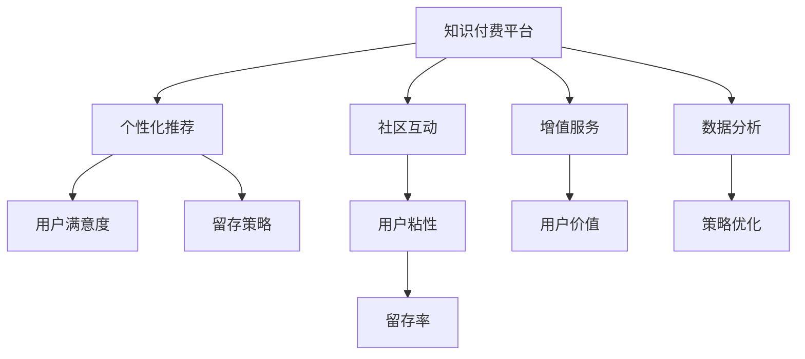

                 

# 知识付费的用户留存策略:程序员视角

> 关键词：知识付费,用户留存,程序员,留存策略,数据分析,行为分析,个性化推荐,社区互动,增值服务

## 1. 背景介绍

随着互联网的迅猛发展和知识经济的崛起，知识付费平台逐渐成为教育和学习领域的重要生态。通过知识付费，用户可以随时随地获取高质量的内容和技能，满足自我提升的需求。然而，知识付费平台面临的一大挑战是用户留存问题，即如何吸引用户持续消费内容，以实现平台商业价值的最大化。

程序员作为知识付费平台的重要用户群体，其留存策略与一般用户群体相比，具有特殊性和复杂性。程序员普遍具有技术背景，对产品功能和体验有较高要求，对内容质量和时效性也有高标准。本节将对知识付费平台的用户留存问题进行系统分析，并特别从程序员视角探讨有效的留存策略。

## 2. 核心概念与联系

### 2.1 核心概念概述

为深入理解知识付费平台的用户留存策略，本节将介绍几个密切相关的核心概念：

- **知识付费平台(Knowledge-Subscription Platforms)**：提供在线课程、电子书、编程指南、技术文章等内容，并通过订阅或按需付费的方式提供服务的平台。典型平台包括Coursera、Udemy、慕课网等。

- **用户留存(User Retention)**：指用户在首次消费后，持续在平台上进行消费或互动，从而维持平台活跃度和商业价值的策略。

- **个性化推荐(Personalized Recommendations)**：通过用户行为数据和学习算法，为每个用户推荐最感兴趣的内容，提升用户满意度和留存率。

- **社区互动(Community Engagement)**：构建用户社区，促进用户之间的交流和互动，形成积极的社群氛围，增加用户粘性。

- **增值服务(Up-Selling Services)**：向用户提供额外的服务或产品，如在线咨询、导师答疑、编程工具等，提升用户价值和留存率。

- **数据分析(Analytics)**：通过收集和分析用户数据，评估平台表现，指导产品迭代和留存策略优化。

这些核心概念之间存在着紧密的联系，共同构成了一个复杂但可控的用户留存系统。通过合理的策略组合，可以有效提升知识付费平台的留存率，确保平台业务的长期健康发展。

### 2.2 核心概念原理和架构的 Mermaid 流程图



此流程图展示了知识付费平台用户留存的几个关键环节，以及它们之间的相互关系。个性化推荐、社区互动和增值服务共同作用于用户满意度和粘性，而数据分析和策略优化则辅助这些环节的实现和调整。最终，这些环节协同作用，共同影响用户的留存率。

## 3. 核心算法原理 & 具体操作步骤

### 3.1 算法原理概述

知识付费平台的用户留存策略基于数据驱动的个性化推荐和行为分析。通过收集用户行为数据，分析用户的兴趣和需求，设计个性化的内容推荐和服务提供，从而提升用户满意度和留存率。

算法流程通常包括以下几个关键步骤：

1. **数据收集**：通过用户在平台上的操作行为（如浏览、点击、购买、评分等）收集数据。
2. **特征提取**：对用户行为数据进行特征提取，如用户兴趣、浏览历史、课程评分等。
3. **模型训练**：使用机器学习算法（如协同过滤、深度学习等）训练个性化推荐模型。
4. **内容推荐**：根据用户行为特征和模型预测，推荐符合用户兴趣的内容。
5. **策略优化**：通过A/B测试等手段，不断优化推荐策略和平台功能。

### 3.2 算法步骤详解

#### 3.2.1 数据收集

知识付费平台通常采用日志记录和数据埋点的方式，收集用户在平台上的行为数据。典型的数据项包括：

- **用户基本信息**：如年龄、性别、职业、学习背景等。
- **课程/内容信息**：如课程名称、描述、难度、评分等。
- **用户行为数据**：如浏览时间、点击次数、购买记录、课程评分等。

#### 3.2.2 特征提取

特征提取是推荐算法的基础。通过特征提取，算法能够理解用户的行为模式和兴趣偏好。常用的特征提取方法包括：

- **统计特征**：如浏览次数、平均停留时间、页面停留深度等。
- **行为特征**：如点击次数、购买行为、课程评分等。
- **交互特征**：如评论互动、课程完成度、点赞数等。

#### 3.2.3 模型训练

基于特征提取的结果，可以使用协同过滤、矩阵分解、深度学习等算法进行模型训练。以深度学习为例，常用的推荐模型包括：

- **矩阵分解模型**：如ALS（交替最小二乘）、SVD（奇异值分解）等。
- **神经网络模型**：如FM（因子分解机）、DNN（深度神经网络）等。
- **序列模型**：如RNN（循环神经网络）、LSTM（长短期记忆网络）等。

#### 3.2.4 内容推荐

推荐算法根据用户行为数据和模型预测，生成推荐列表。推荐列表可以包含以下几种类型的内容：

- **热门课程**：根据浏览和购买记录，推荐最受欢迎的课程。
- **个性化课程**：基于用户行为特征和模型预测，推荐符合用户兴趣的课程。
- **相关课程**：根据课程标签和用户浏览历史，推荐内容相近的课程。

#### 3.2.5 策略优化

策略优化通过A/B测试、用户反馈和数据分析等手段，不断迭代优化推荐策略。优化目标包括：

- **提升点击率**：优化推荐内容，增加用户点击和浏览行为。
- **提升转化率**：优化购买流程，提高用户购买和付费行为。
- **提升留存率**：优化用户互动，增加用户活跃度和留存时间。

### 3.3 算法优缺点

基于数据驱动的个性化推荐算法具有以下优点：

1. **提升用户满意度**：通过精准的内容推荐，满足用户个性化需求，提升用户满意度。
2. **增加用户粘性**：增加用户在平台上的停留时间和互动频率，提高用户粘性。
3. **优化资源配置**：通过推荐算法，优化课程资源配置，提升平台整体效率。

然而，这类算法也存在一些缺点：

1. **数据依赖度高**：推荐算法依赖大量用户行为数据，数据质量直接影响推荐效果。
2. **模型复杂度高**：深度学习等模型需要较强的计算资源，训练和优化过程复杂。
3. **冷启动问题**：对于新用户，没有足够的历史数据，推荐效果可能较差。

### 3.4 算法应用领域

个性化推荐算法广泛应用在知识付费平台、电商平台、视频网站等多个领域。例如：

- **知识付费平台**：根据用户行为数据，推荐个性化课程和学习路径。
- **电商平台**：根据用户浏览和购买行为，推荐相关商品和优惠活动。
- **视频网站**：根据用户观看记录，推荐热门视频和相关内容。

此外，个性化推荐算法在社交网络、在线教育、金融服务等多个领域也具有重要应用。通过个性化推荐，可以有效提升用户留存率，实现平台业务的持续增长。

## 4. 数学模型和公式 & 详细讲解 & 举例说明

### 4.1 数学模型构建

个性化推荐算法通常基于用户行为数据，构建推荐模型。以下以协同过滤为例，构建推荐模型的数学模型：

假设用户集为 $U$，物品集为 $I$，用户对物品的评分矩阵为 $R \in \mathbb{R}^{N \times M}$，其中 $N$ 为用户数，$M$ 为物品数。协同过滤的目标是预测用户对未评分物品的评分，并推荐评分较高的物品。

协同过滤模型可以分为基于用户的模型和基于物品的模型两种。以基于用户的模型为例，其目标是最小化预测评分与实际评分之间的均方误差：

$$
\min_{\theta} \frac{1}{N} \sum_{i=1}^N \sum_{j=1}^M (r_{ij}-\hat{r}_{ij})^2
$$

其中 $\hat{r}_{ij}$ 为用户 $i$ 对物品 $j$ 的预测评分，$\theta$ 为模型的参数。

### 4.2 公式推导过程

以基于用户的协同过滤模型为例，推导预测评分的公式。假设模型使用K近邻方法，用户 $i$ 对物品 $j$ 的预测评分由与 $i$ 最相似的 $K$ 个用户的平均评分决定：

$$
\hat{r}_{ij}=\frac{1}{K} \sum_{k=1}^K \frac{r_{kj}}{1+\exp(-s_k \cdot \phi(r_{kj}, r_{ij}))
$$

其中 $s_k$ 为相似度权重，$\phi$ 为相似度函数。

### 4.3 案例分析与讲解

假设某知识付费平台有10000名用户和10000门课程。通过A/B测试，发现基于用户的协同过滤推荐模型比基于物品的模型效果更好。具体分析如下：

- **用户行为分析**：平台收集到大量用户浏览和购买数据，包括课程ID、用户ID、评分等。
- **特征提取**：对用户行为数据进行特征提取，包括课程评分、平均停留时间、浏览次数等。
- **模型训练**：使用基于用户的协同过滤模型，训练预测评分的算法。
- **内容推荐**：根据用户行为数据和模型预测，推荐评分较高的课程。
- **效果评估**：通过A/B测试，对比协同过滤和基于物品的推荐模型，结果显示协同过滤模型推荐的用户点击率和购买率更高。

## 5. 项目实践：代码实例和详细解释说明

### 5.1 开发环境搭建

在进行知识付费平台的用户留存策略开发前，需要搭建开发环境。以下是基于Python的开发环境配置流程：

1. 安装Python：从官网下载并安装Python，建议选择最新版本。
2. 安装Pandas、NumPy、Scikit-Learn、TensorFlow等常用库：
   ```bash
   pip install pandas numpy scikit-learn tensorflow
   ```
3. 安装PyTorch：用于深度学习模型开发，尤其是推荐系统中的深度神经网络模型：
   ```bash
   pip install torch torchvision
   ```
4. 安装Flask：用于开发Web应用，实现推荐系统的前端展示和用户交互：
   ```bash
   pip install flask
   ```
5. 安装Keras：基于TensorFlow和Theano的高级神经网络API，简化深度学习模型开发：
   ```bash
   pip install keras
   ```

完成上述步骤后，即可在Python环境中进行用户留存策略的开发实践。

### 5.2 源代码详细实现

以下是一个简单的基于协同过滤的推荐系统实现示例，包括数据预处理、模型训练和内容推荐：

```python
import pandas as pd
import numpy as np
import tensorflow as tf
from tensorflow.keras.layers import Input, Dense, Embedding, Flatten
from tensorflow.keras.models import Model
from sklearn.metrics import mean_absolute_error

# 读取数据
data = pd.read_csv('user_course_data.csv', header=None)
user_ids = data.iloc[:, 0]
item_ids = data.iloc[:, 1]
ratings = data.iloc[:, 2]

# 数据预处理
user_ids = np.array(user_ids).astype(np.int32)
item_ids = np.array(item_ids).astype(np.int32)
ratings = np.array(ratings).astype(np.float32)
ratings = (ratings - np.mean(ratings)) / np.std(ratings)

# 模型构建
input_user = Input(shape=(1,), name='user')
input_item = Input(shape=(1,), name='item')

user_embed = Embedding(input_dim=10000, output_dim=100)(input_user)
item_embed = Embedding(input_dim=10000, output_dim=100)(input_item)

dot_product = tf.keras.layers.Dot(axes=1, normalize=True, name='dot_product')([user_embed, item_embed])
predictions = Dense(1, activation='sigmoid')(dot_product)

model = Model(inputs=[input_user, input_item], outputs=predictions)
model.compile(optimizer='adam', loss='binary_crossentropy', metrics=['mae'])

# 模型训练
model.fit([user_ids, item_ids], ratings, epochs=10, batch_size=32)

# 内容推荐
user_id = 123
item_id = 456
user_embeddings = model.layers[0].get_weights()[0][user_id]
item_embeddings = model.layers[1].get_weights()[0][item_id]
predicted_rating = model.predict([np.array([user_id]), np.array([item_id])])
print(predicted_rating)
```

### 5.3 代码解读与分析

本段代码实现了一个基于协同过滤的推荐系统，具体分析如下：

**数据预处理**：读取用户-课程评分数据，并进行标准化处理。

**模型构建**：使用Keras构建基于用户和物品的协同过滤模型，包含用户嵌入层、物品嵌入层和预测层。

**模型训练**：通过TensorFlow训练模型，使用Adam优化器，损失函数为二元交叉熵。

**内容推荐**：输入用户ID和课程ID，计算用户和课程的嵌入向量，并进行点积计算，最后通过sigmoid函数预测评分。

**运行结果展示**：在用户ID和课程ID输入后，输出预测评分。

## 6. 实际应用场景

### 6.1 智能推荐系统

智能推荐系统是知识付费平台的重要功能，通过个性化推荐，提升用户留存率和平台收益。以下是一个实际应用场景的描述：

- **背景**：某知识付费平台有数百万用户，每月新增课程数千门。用户通过订阅或购买课程，获得课程视频和讲义等资源。
- **挑战**：平台面临用户留存率低的挑战，用户在首次购买后，往往不会继续消费。
- **解决方案**：构建智能推荐系统，根据用户行为数据和课程特征，推荐用户可能感兴趣的新课程和相关内容。

### 6.2 用户行为分析

用户行为分析是了解用户需求和行为模式的重要手段，通过数据分析，优化平台策略。以下是一个实际应用场景的描述：

- **背景**：某知识付费平台每月有数十万用户活跃，但用户流失率较高。平台希望通过用户行为分析，找出流失原因，优化留存策略。
- **挑战**：平台缺乏用户行为数据，难以进行详细分析。
- **解决方案**：在平台中植入数据埋点，收集用户浏览、点击、购买等行为数据，进行分析，找出用户流失的共性原因。

### 6.3 课程评分和反馈机制

课程评分和反馈机制是用户参与平台互动的重要方式，通过收集用户反馈，优化课程内容。以下是一个实际应用场景的描述：

- **背景**：某知识付费平台提供各类编程语言课程，课程质量参差不齐，用户反馈不一。
- **挑战**：课程质量难以统一标准，用户反馈难以量化。
- **解决方案**：在课程页面增加评分和反馈功能，收集用户对课程的评价和建议，通过数据分析，找出课程质量问题，优化课程设计。

### 6.4 未来应用展望

随着知识付费平台的发展，个性化推荐和用户留存策略将面临新的挑战和机遇。未来，知识付费平台将更加注重以下几个方面：

- **跨平台协作**：在多个平台间进行数据共享和协同推荐，提升用户跨平台留存率。
- **个性化服务**：基于用户行为数据，提供定制化的课程和服务，满足用户个性化需求。
- **智能助手**：通过NLP技术，构建智能问答和推荐系统，提升用户交互体验。
- **社区生态**：构建社区生态，促进用户之间的交流和互动，增强用户粘性。
- **数据安全**：加强数据保护和隐私管理，确保用户数据安全。

## 7. 工具和资源推荐

### 7.1 学习资源推荐

为了帮助开发者系统掌握知识付费平台的用户留存策略，这里推荐一些优质的学习资源：

1. **《推荐系统实践》**：该书深入浅出地介绍了推荐系统理论基础和实践方法，适合初学者和进阶读者。
2. **Coursera《推荐系统》课程**：斯坦福大学的在线课程，涵盖了推荐系统的基本概念、算法和应用，适合系统学习。
3. **Kaggle推荐系统竞赛**：Kaggle平台上的推荐系统竞赛，提供实际数据集和挑战，实践推荐系统开发。
4. **《深度学习入门》**：该书介绍了深度学习基础知识，包括神经网络、卷积神经网络、循环神经网络等，适合入门读者。
5. **TensorFlow官方文档**：TensorFlow的官方文档，提供了详细的API和使用示例，适合开发实践。

通过这些资源的学习实践，相信你一定能够快速掌握知识付费平台的用户留存策略，并用于解决实际的NLP问题。

### 7.2 开发工具推荐

高效的开发离不开优秀的工具支持。以下是几款用于知识付费平台用户留存策略开发的常用工具：

1. **Jupyter Notebook**：Python的交互式编程环境，支持代码块、图形和数据分析等，适合开发和实验。
2. **Google Colab**：谷歌提供的在线Jupyter Notebook环境，免费提供GPU算力，适合实验和演示。
3. **Pandas和NumPy**：Python的数据分析库，支持高效的数据处理和特征提取。
4. **Scikit-Learn**：Python的机器学习库，包含丰富的推荐算法实现。
5. **Keras和TensorFlow**：深度学习框架，适合构建复杂的推荐系统模型。
6. **Flask和Django**：Python的Web框架，适合开发推荐系统的前端界面和用户交互。

合理利用这些工具，可以显著提升知识付费平台用户留存策略的开发效率，加快创新迭代的步伐。

### 7.3 相关论文推荐

知识付费平台的用户留存策略涉及多个领域的最新研究。以下是几篇奠基性的相关论文，推荐阅读：

1. **《基于协同过滤的推荐系统》**：该论文介绍了协同过滤的基本原理和算法，是推荐系统领域的经典之作。
2. **《深度学习在推荐系统中的应用》**：该论文探讨了深度学习在推荐系统中的应用，包括神经网络、卷积神经网络等。
3. **《推荐系统的评估与优化》**：该论文介绍了推荐系统的评估指标和优化方法，适合了解推荐系统的综合性能。
4. **《在线学习的推荐系统》**：该论文研究了在线学习在推荐系统中的应用，提升了推荐模型的实时性和灵活性。
5. **《基于用户画像的推荐系统》**：该论文探讨了用户画像在推荐系统中的应用，提供了详细的实现方法。

这些论文代表了大数据、人工智能在推荐系统领域的最新进展，通过学习这些前沿成果，可以帮助研究者把握学科前进方向，激发更多的创新灵感。

## 8. 总结：未来发展趋势与挑战

### 8.1 研究成果总结

本文对知识付费平台的用户留存问题进行了系统分析，特别从程序员视角探讨了有效的留存策略。通过数据驱动的个性化推荐和行为分析，可以实现用户满意度提升和用户留存率的增加。

### 8.2 未来发展趋势

展望未来，知识付费平台的用户留存策略将呈现以下几个发展趋势：

1. **数据驱动**：基于用户行为数据的精准推荐将持续优化，个性化服务将更加普及。
2. **智能辅助**：通过NLP和机器学习技术，构建智能问答和推荐系统，提升用户交互体验。
3. **跨平台协作**：在多个平台间进行数据共享和协同推荐，提升用户跨平台留存率。
4. **社区生态**：构建社区生态，促进用户之间的交流和互动，增强用户粘性。
5. **数据安全**：加强数据保护和隐私管理，确保用户数据安全。

### 8.3 面临的挑战

尽管知识付费平台的用户留存策略取得了显著进展，但在迈向更加智能化、普适化应用的过程中，仍面临诸多挑战：

1. **数据质量**：用户行为数据的质量直接影响推荐效果，如何获取和处理高质量数据是关键。
2. **算法复杂度**：深度学习等算法需要较强的计算资源，如何优化算法和模型结构，减少计算成本。
3. **用户体验**：推荐系统需要兼顾算法性能和用户体验，避免过度推荐和冗余信息。
4. **隐私保护**：用户数据隐私保护是重要课题，如何平衡数据利用和隐私保护是挑战。
5. **模型公平性**：推荐模型需要避免偏见和歧视，确保用户公平使用。

### 8.4 研究展望

面对知识付费平台用户留存策略所面临的挑战，未来的研究需要在以下几个方面寻求新的突破：

1. **数据增强**：通过数据增强技术，提高用户行为数据的质量和多样性。
2. **模型压缩**：开发轻量级、高效化的推荐模型，提升推荐系统的实时性和可扩展性。
3. **算法公平性**：研究公平推荐算法，确保推荐系统不带有偏见和歧视。
4. **用户界面优化**：提升推荐系统的UI/UX设计，增强用户体验。
5. **隐私保护**：研究数据隐私保护技术，确保用户数据安全。

这些研究方向的探索，必将引领知识付费平台用户留存策略的进一步优化，为平台提供更强大的竞争力，实现业务的持续增长。

## 9. 附录：常见问题与解答

**Q1：为什么推荐算法需要大量用户行为数据？**

A: 推荐算法依赖大量用户行为数据进行模型训练，数据量越大，模型预测的准确度越高。用户行为数据反映了用户的兴趣和偏好，是推荐算法的核心输入。通过数据驱动，推荐系统能够更好地理解用户需求，提升推荐效果。

**Q2：如何处理冷启动问题？**

A: 冷启动问题是指新用户没有足够的历史数据，推荐效果较差。可以通过以下方法解决：
1. 利用用户属性信息进行推荐，如性别、年龄、职业等。
2. 使用协同过滤算法，预测新用户对热门物品的评分。
3. 采用基于内容的推荐方法，推荐与热门物品相关的物品。

**Q3：推荐系统的评估指标有哪些？**

A: 推荐系统的评估指标包括：
1. 准确率（Accuracy）：预测结果与真实结果相符的比例。
2. 召回率（Recall）：真实结果被预测出来的比例。
3. 精确率（Precision）：预测结果中真实结果的比例。
4. F1分数（F1 Score）：综合考虑准确率和召回率的指标。
5. AUC（Area Under Curve）：ROC曲线下的面积，衡量模型性能。

**Q4：推荐系统如何实现个性化服务？**

A: 推荐系统实现个性化服务的关键在于用户行为数据的精准分析和模型优化。具体步骤包括：
1. 数据收集：收集用户行为数据，如浏览历史、评分、购买记录等。
2. 特征提取：提取用户行为数据中的关键特征，如兴趣标签、浏览次数、评分等。
3. 模型训练：使用协同过滤、深度学习等算法，训练个性化推荐模型。
4. 内容推荐：根据用户行为特征和模型预测，推荐个性化内容。

**Q5：如何确保推荐系统的公平性？**

A: 确保推荐系统的公平性是重要课题，可以通过以下方法实现：
1. 数据预处理：去除数据中的偏见和歧视，确保数据质量。
2. 算法设计：使用公平性算法，避免推荐算法中带有偏见。
3. 用户反馈：收集用户反馈，及时调整推荐策略，确保用户公平使用。

通过这些问题和解答，相信你对知识付费平台的用户留存策略有了更深入的理解，并能够应用于实际开发和优化中。总之，个性化推荐和用户留存策略是知识付费平台的核心竞争力，需要不断优化和提升，以实现业务的持续健康发展。

