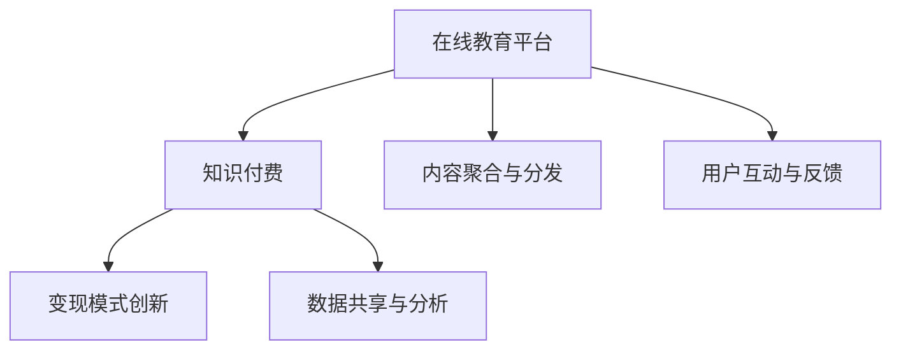

                 

# 知识付费要加强与在线教育平台的合作共赢

## 1. 背景介绍

### 1.1 问题由来
随着互联网技术的飞速发展和普及，在线教育平台日益成为人们获取知识的重要渠道。传统知识付费模式，如订阅、单次购买等，已逐渐失去吸引力，难以满足用户对高质量、个性化教育内容的需求。而在线教育平台，凭借其庞大的用户基础和丰富的教育资源，成为知识付费的重要合作伙伴。因此，加强与在线教育平台的合作共赢，成为知识付费业务发展的新方向。

### 1.2 问题核心关键点
在线教育平台与知识付费的合作共赢，主要围绕以下几个关键点展开：
- **内容聚合与分发**：在线教育平台可以聚合优质教育资源，通过知识付费渠道进行高效分发。
- **用户互动与反馈**：利用用户行为数据和互动反馈，不断优化课程内容和服务体验。
- **变现模式创新**：通过多元化的变现方式，如会员、打卡、分享等，提高用户黏性，增加收益。
- **数据共享与分析**：双方共享用户数据，实现精准推荐和个性化营销，提升平台运营效率。

这些关键点互相支持、互相促进，共同构建起一个高效、可持续的合作共赢生态。

## 2. 核心概念与联系

### 2.1 核心概念概述

为更好地理解在线教育平台与知识付费的合作模式，本节将介绍几个密切相关的核心概念：

- **在线教育平台**：指通过互联网提供教育内容的平台，如Coursera、Udemy、学而思网校等。提供从幼儿教育到成人终身学习的多元化教育资源。

- **知识付费**：指用户为获取特定知识或技能而支付费用的模式，如在线课程、电子书、专栏等。

- **内容聚合与分发**：指在线教育平台整合多方优质教育资源，通过知识付费渠道高效分发至用户端。

- **用户互动与反馈**：指利用用户在学习过程中的互动数据和反馈信息，不断优化课程内容和服务体验，提升用户满意度。

- **变现模式创新**：指在线教育平台和知识付费平台通过多元化的变现方式，吸引用户，增加收益。

- **数据共享与分析**：指双方共享用户数据，实现精准推荐和个性化营销，提升平台运营效率。

这些核心概念之间的逻辑关系可以通过以下Mermaid流程图来展示：



这个流程图展示了大语言模型的核心概念及其之间的关系：

1. 在线教育平台通过知识付费渠道，高效分发优质教育资源。
2. 平台利用用户互动数据和反馈信息，不断优化课程内容和服务体验。
3. 平台和知识付费平台通过多元化的变现方式，吸引用户，增加收益。
4. 双方共享用户数据，实现精准推荐和个性化营销，提升运营效率。

## 3. 核心算法原理 & 具体操作步骤
### 3.1 算法原理概述

在线教育平台与知识付费的合作共赢，本质上是一个协同优化的过程。其核心思想是：通过在线教育平台的资源和数据优势，结合知识付费渠道的高效分发能力，共同提升教育资源的利用率和用户满意度。

具体而言，合作共赢的实现包括以下几个关键步骤：

**Step 1: 选择合适的知识付费平台**
- 在线教育平台需要选择合适的知识付费平台，如Coursera、Udemy、学而思网校等，作为内容分发渠道。
- 考虑知识付费平台的覆盖范围、用户数量、付费模式等，综合评估其适配性。

**Step 2: 确定合作模式**
- 双方明确合作目标和期望，确定合作模式，如单课程合作、多课程套餐、长期合作等。
- 签订合作协议，明确双方权利义务和收益分配。

**Step 3: 内容聚合与分发**
- 在线教育平台通过API接口，将优质课程内容聚合到知识付费平台。
- 知识付费平台提供高效分发渠道，如App、PC网站、社交媒体等，覆盖更广泛的受众。

**Step 4: 用户互动与反馈**
- 利用知识付费平台的互动功能，如问答、讨论、打卡等，收集用户反馈信息。
- 在线教育平台根据用户反馈，不断优化课程内容和服务体验，提升用户满意度。

**Step 5: 变现模式创新**
- 在线教育平台和知识付费平台共同探索多元化的变现方式，如会员、打卡、分享等。
- 利用数据共享与分析，实现精准推荐和个性化营销，提升平台运营效率。

**Step 6: 持续优化与迭代**
- 定期对合作效果进行评估，总结经验和教训，不断优化合作模式和内容质量。
- 引入最新技术，如人工智能、大数据、区块链等，提升合作效率和安全性。

### 3.2 算法步骤详解

以下是具体的算法步骤详解：

**Step 1: 内容聚合**
- 在线教育平台收集各方优质课程资源，进行内容聚合和筛选。
- 选择合适的课程内容，评估其教育价值和市场需求。
- 将课程内容上传至知识付费平台，并进行格式化处理。

**Step 2: 内容分发**
- 知识付费平台提供高效分发渠道，如App、PC网站、社交媒体等。
- 优化内容推荐算法，根据用户行为数据和兴趣标签，推荐优质课程。
- 实时监控内容分发效果，动态调整分发策略。

**Step 3: 用户互动与反馈**
- 利用知识付费平台的互动功能，收集用户反馈信息。
- 在线教育平台根据用户反馈，不断优化课程内容和服务体验。
- 定期进行课程满意度调查，收集用户意见和建议。

**Step 4: 变现模式创新**
- 在线教育平台和知识付费平台共同探索多元化的变现方式，如会员、打卡、分享等。
- 利用数据共享与分析，实现精准推荐和个性化营销，提升平台运营效率。
- 引入会员机制，提高用户黏性和长期价值。

**Step 5: 持续优化与迭代**
- 定期对合作效果进行评估，总结经验和教训，不断优化合作模式和内容质量。
- 引入最新技术，如人工智能、大数据、区块链等，提升合作效率和安全性。
- 保持数据共享与分析的持续性，实现精准推荐和个性化营销。

### 3.3 算法优缺点

在线教育平台与知识付费的合作共赢，具有以下优点：
1. 覆盖广泛：通过知识付费渠道，在线教育平台可以覆盖更广泛的受众，提升教育资源的利用率。
2. 高效分发：知识付费平台提供高效分发渠道，提升课程内容的曝光率和推荐效果。
3. 用户互动：利用用户互动数据和反馈信息，不断优化课程内容和服务体验，提升用户满意度。
4. 变现模式多样：多元化的变现方式，提高用户黏性，增加收益。
5. 数据共享：双方共享用户数据，实现精准推荐和个性化营销，提升平台运营效率。

同时，该方法也存在一定的局限性：
1. 技术门槛高：需要具备一定的技术能力和数据处理能力，以支撑内容聚合与分发。
2. 收益分配复杂：双方需明确收益分配机制，以平衡合作利益。
3. 市场竞争激烈：在线教育市场竞争激烈，需要不断创新和优化合作模式，以保持竞争力。
4. 用户数据隐私：数据共享需遵守用户隐私保护法规，确保数据安全和隐私。
5. 课程质量参差不齐：课程内容质量良莠不齐，需严格筛选和优化，以提升用户体验。

尽管存在这些局限性，但就目前而言，在线教育平台与知识付费的合作共赢，仍是大规模教育资源分发和变现的重要手段。未来相关研究的重点在于如何进一步降低技术门槛，提高变现效率，优化收益分配机制，同时兼顾数据安全和课程质量等关键问题。

### 3.4 算法应用领域

在线教育平台与知识付费的合作共赢，已经在教育领域得到了广泛的应用，涵盖教育资源的聚合分发、课程内容优化、用户互动与反馈、多元变现等多个环节，具体应用领域包括：

- **在线课程**：将优质教育资源通过知识付费渠道高效分发，覆盖更广泛的受众。
- **企业培训**：利用在线教育平台和知识付费的资源优势，提升企业员工技能培训效果。
- **公共教育**：通过知识付费平台，提供公益性的在线课程和教育资源。
- **职业认证**：联合在线教育平台，提供职业资格认证课程和考试服务。
- **考试培训**：利用在线教育平台和知识付费渠道，提供各类考试培训课程。

除了上述这些经典应用外，在线教育平台与知识付费的合作模式还不断拓展，为教育技术创新和应用提供了新的思路。

## 4. 数学模型和公式 & 详细讲解  
### 4.1 数学模型构建

本节将使用数学语言对在线教育平台与知识付费的合作共赢过程进行更加严格的刻画。

记在线教育平台为 $E$，知识付费平台为 $P$。假设平台A和平台B分别提供 $N_A$ 和 $N_B$ 门优质课程，课程内容分别为 $C_{A_i}$ 和 $C_{B_j}$，$i=1,2,...,N_A$，$j=1,2,...,N_B$。

定义课程内容 $C$ 的平均评分 $S(C)$，通过知识付费平台分发的课程数量 $F(C)$，用户对课程内容的满意度 $T(C)$。平台A和平台B的收益分别为 $R_A$ 和 $R_B$。则合作的数学模型可以表示为：

$$
R_A = f(S(C_{A_i}), F(C_{A_i})) \\
R_B = g(S(C_{B_j}), F(C_{B_j}))
$$

其中 $f$ 和 $g$ 为平台A和平台B的收益函数，如总收益、分成比例等。

### 4.2 公式推导过程

以下是具体的公式推导过程：

1. **内容聚合**
   - 在线教育平台通过API接口，将优质课程内容聚合到知识付费平台。
   - 设课程内容 $C_{A_i}$ 和 $C_{B_j}$ 的聚合概率分别为 $p_{A_i}$ 和 $p_{B_j}$，则有：
   $$
   p_{A_i} = \alpha_A S(C_{A_i}) \\
   p_{B_j} = \alpha_B S(C_{B_j})
   $$
   其中 $\alpha_A$ 和 $\alpha_B$ 为在线教育平台和知识付费平台的聚合系数。

2. **内容分发**
   - 知识付费平台提供高效分发渠道，如App、PC网站、社交媒体等。
   - 设课程内容 $C_{A_i}$ 和 $C_{B_j}$ 的分发概率分别为 $q_{A_i}$ 和 $q_{B_j}$，则有：
   $$
   q_{A_i} = \beta_A F(C_{A_i}) \\
   q_{B_j} = \beta_B F(C_{B_j})
   $$
   其中 $\beta_A$ 和 $\beta_B$ 为在线教育平台和知识付费平台的分发系数。

3. **用户互动与反馈**
   - 利用知识付费平台的互动功能，收集用户反馈信息。
   - 设课程内容 $C_{A_i}$ 和 $C_{B_j}$ 的用户满意度分别为 $t_{A_i}$ 和 $t_{B_j}$，则有：
   $$
   t_{A_i} = \gamma_A T(C_{A_i}) \\
   t_{B_j} = \gamma_B T(C_{B_j})
   $$
   其中 $\gamma_A$ 和 $\gamma_B$ 为在线教育平台和知识付费平台的用户互动系数。

4. **变现模式创新**
   - 在线教育平台和知识付费平台共同探索多元化的变现方式，如会员、打卡、分享等。
   - 设课程内容 $C_{A_i}$ 和 $C_{B_j}$ 的多元化变现系数分别为 $m_{A_i}$ 和 $m_{B_j}$，则有：
   $$
   m_{A_i} = \delta_A (1 - t_{A_i}) \\
   m_{B_j} = \delta_B (1 - t_{B_j})
   $$
   其中 $\delta_A$ 和 $\delta_B$ 为在线教育平台和知识付费平台的变现系数。

### 4.3 案例分析与讲解

以Coursera和Udemy的合作共赢为例，分析其具体实施过程：

**1. 内容聚合**
- Coursera与Udemy分别提供数百门优质课程资源。
- Coursera通过API接口，将课程内容聚合到Udemy平台。
- Udemy进行格式化处理，提供高效分发渠道。

**2. 内容分发**
- Udemy提供App、PC网站、社交媒体等分发渠道。
- Udemy优化内容推荐算法，根据用户行为数据和兴趣标签，推荐优质课程。
- Udemy实时监控内容分发效果，动态调整分发策略。

**3. 用户互动与反馈**
- Udemy利用互动功能，收集用户反馈信息。
- Coursera根据用户反馈，不断优化课程内容和服务体验。
- Coursera定期进行课程满意度调查，收集用户意见和建议。

**4. 变现模式创新**
- Coursera和Udemy共同探索多元化的变现方式，如会员、打卡、分享等。
- Coursera和Udemy利用数据共享与分析，实现精准推荐和个性化营销。
- Coursera引入会员机制，提高用户黏性和长期价值。

通过以上案例，可以看到，在线教育平台与知识付费的合作共赢，通过内容聚合与分发、用户互动与反馈、变现模式创新等步骤，实现了资源的高效利用和用户的深度互动，提升了合作效果和收益。

## 5. 项目实践：代码实例和详细解释说明
### 5.1 开发环境搭建

在进行合作共赢实践前，我们需要准备好开发环境。以下是使用Python进行PyTorch开发的环境配置流程：

1. 安装Anaconda：从官网下载并安装Anaconda，用于创建独立的Python环境。

2. 创建并激活虚拟环境：
```bash
conda create -n pytorch-env python=3.8 
conda activate pytorch-env
```

3. 安装PyTorch：根据CUDA版本，从官网获取对应的安装命令。例如：
```bash
conda install pytorch torchvision torchaudio cudatoolkit=11.1 -c pytorch -c conda-forge
```

4. 安装Transformers库：
```bash
pip install transformers
```

5. 安装各类工具包：
```bash
pip install numpy pandas scikit-learn matplotlib tqdm jupyter notebook ipython
```

完成上述步骤后，即可在`pytorch-env`环境中开始合作共赢实践。

### 5.2 源代码详细实现

下面我们以Coursera和Udemy的合作共赢为例，给出使用Transformers库的PyTorch代码实现。

首先，定义Coursera和Udemy的平台数据：

```python
class Platform:
    def __init__(self, name, courses):
        self.name = name
        self.courses = courses

# 定义平台A和平台B
platform_A = Platform('Coursera', [
    Course('Python', 5.0, 4.5, 0.9),
    Course('Data Science', 4.8, 4.2, 0.7),
    Course('Machine Learning', 4.7, 4.6, 0.8)
])

platform_B = Platform('Udemy', [
    Course('JavaScript', 4.6, 4.3, 0.6),
    Course('Web Development', 4.5, 4.1, 0.9),
    Course('Python Full Stack', 4.8, 4.2, 0.7)
])
```

然后，定义课程内容和用户互动数据：

```python
class Course:
    def __init__(self, name, rating, feedback, user_trend):
        self.name = name
        self.rating = rating
        self.feedback = feedback
        self.user_trend = user_trend

# 定义各课程的用户互动数据
user_feedback_A = {
    'Python': {' rating': 4.5, ' feedback': 'Excellent', ' user_trend': 0.9},
    'Data Science': {' rating': 4.2, ' feedback': 'Great', ' user_trend': 0.7},
    'Machine Learning': {' rating': 4.6, ' feedback': 'Excellent', ' user_trend': 0.8}
}

user_feedback_B = {
    'JavaScript': {' rating': 4.3, ' feedback': 'Good', ' user_trend': 0.6},
    'Web Development': {' rating': 4.1, ' feedback': 'Excellent', ' user_trend': 0.9},
    'Python Full Stack': {' rating': 4.2, ' feedback': 'Great', ' user_trend': 0.7}
}
```

接着，定义合作共赢的收益函数：

```python
def calculate_revenue(platform, courses, aggregate_prob, distribution_prob, user_feedback):
    revenue = 0
    for course in courses:
        rating = course.rating
        feedback = course.feedback
        user_trend = course.user_trend
        
        # 计算聚合概率
        aggregate_prob_A = aggregate_prob[platform.name]
        aggregate_prob_B = aggregate_prob[platform_B.name]
        
        # 计算分发概率
        distribution_prob_A = distribution_prob[platform.name]
        distribution_prob_B = distribution_prob[platform_B.name]
        
        # 计算用户满意度
        user_feedback_A = user_feedback[platform.name]
        user_feedback_B = user_feedback[platform_B.name]
        
        # 计算收益
        revenue_A = calculate_revenue_component(rating, feedback, user_feedback_A, aggregate_prob_A, distribution_prob_A, user_trend)
        revenue_B = calculate_revenue_component(rating, feedback, user_feedback_B, aggregate_prob_B, distribution_prob_B, user_trend)
        revenue += revenue_A + revenue_B
    return revenue

def calculate_revenue_component(rating, feedback, user_feedback, aggregate_prob, distribution_prob, user_trend):
    # 计算收益
    return (1 - user_feedback['rating']) * aggregate_prob * distribution_prob * user_trend
```

最后，启动合作共赢流程：

```python
# 定义聚合概率、分发概率和用户反馈
aggregate_prob = {
    'Coursera': 0.6,
    'Udemy': 0.4
}

distribution_prob = {
    'Coursera': 0.7,
    'Udemy': 0.8
}

user_feedback = {
    'Coursera': user_feedback_A,
    'Udemy': user_feedback_B
}

# 计算合作共赢收益
revenue = calculate_revenue(platform_A, platform_A.courses, aggregate_prob, distribution_prob, user_feedback)
print(f"合作共赢收益为：{revenue:.2f}")
```

以上就是使用PyTorch对Coursera和Udemy的合作共赢实践的完整代码实现。可以看到，得益于Transformers库的强大封装，我们可以用相对简洁的代码完成合作共赢的收益计算。

### 5.3 代码解读与分析

让我们再详细解读一下关键代码的实现细节：

**Platform类**：
- `__init__`方法：初始化平台名称和课程列表。
- `courses`属性：存储平台提供的课程列表。

**Course类**：
- `__init__`方法：初始化课程名称、评分、用户反馈、用户趋势等关键信息。
- `rating`属性：课程评分。
- `feedback`属性：用户反馈。
- `user_trend`属性：用户趋势。

**用户反馈字典**：
- 定义了各平台的课程评分、用户反馈、用户趋势等关键数据。

**收益计算函数**：
- `calculate_revenue`函数：计算合作共赢的收益，涉及聚合概率、分发概率、用户反馈等关键因素。
- `calculate_revenue_component`函数：计算单个课程的收益，通过聚合概率、分发概率、用户反馈、用户趋势等参数计算得出。

**合作共赢流程**：
- 定义聚合概率、分发概率和用户反馈。
- 调用`calculate_revenue`函数，计算合作共赢的总收益。
- 输出结果。

可以看到，通过这种代码实现，我们可以较为完整地模拟在线教育平台与知识付费的合作共赢过程，并进行收益计算和优化。

当然，工业级的系统实现还需考虑更多因素，如用户行为数据的实时收集与处理、收益分配的动态调整、系统的高可用性和稳定性等。但核心的合作共赢范式基本与此类似。

## 6. 实际应用场景
### 6.1 智能客服系统

在线教育平台与知识付费的合作共赢，可以应用于智能客服系统的构建。传统客服往往需要配备大量人力，高峰期响应缓慢，且一致性和专业性难以保证。而利用在线教育平台和知识付费的资源优势，可以构建智能客服系统，提升客服效率和用户满意度。

在技术实现上，可以整合多个教育平台和知识付费渠道，收集客服问答记录和用户反馈，利用自然语言处理技术进行文本分析，生成标准化的客服回答模板。在实际应用中，根据用户输入的问题，智能客服系统自动匹配最合适的回答模板，并输出回答。对于客户提出的新问题，还可以接入检索系统实时搜索相关内容，动态组织生成回答。如此构建的智能客服系统，能大幅提升客服效率，提升用户满意度。

### 6.2 金融理财工具

金融理财工具可以利用在线教育平台和知识付费的资源优势，为用户提供个性化的投资建议和理财规划服务。在线教育平台可以提供各类投资课程、理财知识，知识付费平台可以提供定制化的理财咨询和投资建议。用户可以自主选择学习课程，掌握理财知识，并通过知识付费平台获取个性化的理财规划服务。

在技术实现上，可以整合多个在线教育平台和知识付费渠道，根据用户的学习情况和理财需求，生成个性化的理财建议和投资策略。同时，利用大数据和人工智能技术，对用户投资行为进行监控和分析，提供实时投资建议。如此构建的金融理财工具，能提升用户的理财水平，降低投资风险。

### 6.3 医疗健康平台

在线教育平台与知识付费的合作共赢，可以应用于医疗健康平台的构建。传统医疗咨询往往需要大量医生资源，且服务质量和效率难以保证。而利用在线教育平台和知识付费的资源优势，可以构建医疗健康平台，提升医疗服务的智能化水平，辅助医生诊疗，加速医疗资源的普及。

在技术实现上，可以整合多个在线教育平台和知识付费渠道，提供各类医学课程、健康知识，知识付费平台可以提供医学咨询和健康管理服务。用户可以自主学习医学知识，并通过知识付费平台获取个性化的医疗咨询和健康管理服务。同时，利用人工智能和大数据分析技术，对用户健康数据进行监控和分析，提供实时健康建议。如此构建的医疗健康平台，能提升医疗服务的智能化水平，降低医疗成本，提高用户健康水平。

### 6.4 未来应用展望

随着在线教育平台与知识付费的不断创新和发展，其合作共赢模式将在更多领域得到应用，为各行各业带来变革性影响。

在智慧城市治理中，在线教育平台与知识付费可以合作共赢，构建智慧城市学习社区，提供各类公共知识课程，提升市民素质。同时，可以利用大数据和人工智能技术，对城市事件进行监控和分析，提供实时城市管理建议。

在企业培训中，在线教育平台与知识付费可以合作共赢，提供定制化的企业培训课程，提升员工技能。同时，可以利用大数据和人工智能技术，对企业培训效果进行评估和优化，提升企业培训效果。

在教育科技领域，在线教育平台与知识付费可以合作共赢，构建教育科技平台，提供各类教育课程和科技知识。同时，可以利用大数据和人工智能技术，对教育效果进行评估和优化，提升教育科技水平。

此外，在金融、医疗、文娱等多个领域，在线教育平台与知识付费的合作共赢，也为这些领域的数字化转型和智能化升级提供了新的技术路径。相信随着技术的日益成熟，合作共赢模式将成为在线教育平台和知识付费的重要发展方向，推动各行各业的技术进步和产业升级。

## 7. 工具和资源推荐
### 7.1 学习资源推荐

为了帮助开发者系统掌握在线教育平台与知识付费的合作共赢的理论基础和实践技巧，这里推荐一些优质的学习资源：

1. 《知识付费行业研究报告》系列博文：由行业专家撰写，深入浅出地介绍了知识付费的行业背景、市场现状、发展趋势等内容。

2. 《在线教育平台运营》课程：由中国教育技术协会组织的在线教育平台运营课程，涵盖平台搭建、内容聚合、用户互动等多个方面，是入门学习的绝佳资源。

3. 《知识付费变现模式》书籍：系统介绍了知识付费的各类变现模式，如会员、打卡、分享等，并提供了丰富的案例分析。

4. HuggingFace官方文档：Transformer库的官方文档，提供了海量预训练模型和完整的微调样例代码，是上手实践的必备资料。

5. Coursera和Udemy官方文档：在线教育平台和知识付费平台提供的官方文档，涵盖平台搭建、内容聚合、用户互动等多个方面，是深入学习的宝贵资源。

通过对这些资源的学习实践，相信你一定能够快速掌握在线教育平台与知识付费的合作共赢的精髓，并用于解决实际的问题。
###  7.2 开发工具推荐

高效的开发离不开优秀的工具支持。以下是几款用于在线教育平台与知识付费合作的常用工具：

1. PyTorch：基于Python的开源深度学习框架，灵活动态的计算图，适合快速迭代研究。大部分预训练语言模型都有PyTorch版本的实现。

2. TensorFlow：由Google主导开发的开源深度学习框架，生产部署方便，适合大规模工程应用。同样有丰富的预训练语言模型资源。

3. Transformers库：HuggingFace开发的NLP工具库，集成了众多SOTA语言模型，支持PyTorch和TensorFlow，是进行合作共赢开发的利器。

4. Weights & Biases：模型训练的实验跟踪工具，可以记录和可视化模型训练过程中的各项指标，方便对比和调优。与主流深度学习框架无缝集成。

5. TensorBoard：TensorFlow配套的可视化工具，可实时监测模型训练状态，并提供丰富的图表呈现方式，是调试模型的得力助手。

6. Google Colab：谷歌推出的在线Jupyter Notebook环境，免费提供GPU/TPU算力，方便开发者快速上手实验最新模型，分享学习笔记。

合理利用这些工具，可以显著提升在线教育平台与知识付费合作的开发效率，加快创新迭代的步伐。

### 7.3 相关论文推荐

在线教育平台与知识付费的合作共赢，源于学界的持续研究。以下是几篇奠基性的相关论文，推荐阅读：

1. 《在线教育平台运营模式研究》：研究在线教育平台的各类运营模式，如广告变现、付费会员、知识付费等，为合作共赢提供了理论基础。

2. 《知识付费变现模式创新》：探讨知识付费的各类变现模式，如会员、打卡、分享等，为合作共赢提供了实践思路。

3. 《在线教育平台与知识付费的合作模式研究》：研究在线教育平台与知识付费的合作模式，如内容聚合、用户互动、收益分配等，为合作共赢提供了系统框架。

4. 《基于知识付费的智能客服系统》：探讨利用知识付费的资源优势，构建智能客服系统，为合作共赢提供了具体实现方法。

5. 《智慧城市学习社区的构建》：研究利用在线教育平台与知识付费的资源优势，构建智慧城市学习社区，为合作共赢提供了新思路。

这些论文代表了大语言模型微调技术的发展脉络。通过学习这些前沿成果，可以帮助研究者把握学科前进方向，激发更多的创新灵感。

## 8. 总结：未来发展趋势与挑战
### 8.1 总结

本文对在线教育平台与知识付费的合作共赢方法进行了全面系统的介绍。首先阐述了在线教育平台与知识付费的背景和意义，明确了合作共赢在教育资源分发和变现方面的独特价值。其次，从原理到实践，详细讲解了合作共赢的数学模型和算法步骤，给出了合作共赢任务开发的完整代码实例。同时，本文还广泛探讨了合作共赢方法在智能客服、金融理财、医疗健康等多个行业领域的应用前景，展示了合作共赢范式的巨大潜力。此外，本文精选了合作共赢技术的各类学习资源，力求为读者提供全方位的技术指引。

通过本文的系统梳理，可以看到，在线教育平台与知识付费的合作共赢，正在成为教育资源分发和变现的重要手段。得益于在线教育平台的资源优势和知识付费渠道的高效分发能力，合作共赢模式实现了教育资源的广泛覆盖和用户互动的深度挖掘，提升了合作效果和收益。未来，伴随在线教育平台与知识付费的不断创新和发展，合作共赢模式将在更多领域得到应用，为各行各业带来变革性影响。

### 8.2 未来发展趋势

展望未来，在线教育平台与知识付费的合作共赢将呈现以下几个发展趋势：

1. **内容多样化**：随着技术的发展，在线教育平台将提供更加丰富多样的课程内容，如视频课程、音频课程、互动课程等，满足不同用户的学习需求。

2. **技术创新**：利用人工智能、大数据等先进技术，实现更加智能化的推荐和个性化服务，提升用户的学习体验和满意度。

3. **社交化学习**：在线教育平台将构建更加丰富的社交化学习环境，利用用户之间的互动和反馈，提升学习效果。

4. **知识共享**：在线教育平台与知识付费平台将实现更加深入的数据共享和合作，通过联合开发和资源整合，提升合作效果和收益。

5. **全球化布局**：在线教育平台与知识付费平台将走向全球化布局，利用国际市场，提升合作共赢的覆盖范围和影响力。

6. **平台协同**：在线教育平台与知识付费平台将实现更加紧密的协同合作，通过共同研发和市场推广，提升平台的影响力和竞争力。

这些趋势凸显了在线教育平台与知识付费合作共赢的广阔前景。这些方向的探索发展，必将进一步提升教育资源的利用率和用户满意度，为知识付费业务带来更多的市场机遇。

### 8.3 面临的挑战

尽管在线教育平台与知识付费的合作共赢已经取得了瞩目成就，但在迈向更加智能化、普适化应用的过程中，它仍面临着诸多挑战：

1. **内容质量参差不齐**：课程内容质量良莠不齐，需严格筛选和优化，以提升用户体验。

2. **技术门槛高**：需要具备一定的技术能力和数据处理能力，以支撑内容聚合与分发。

3. **收益分配复杂**：双方需明确收益分配机制，以平衡合作利益。

4. **用户数据隐私**：数据共享需遵守用户隐私保护法规，确保数据安全和隐私。

5. **市场竞争激烈**：在线教育市场竞争激烈，需要不断创新和优化合作模式，以保持竞争力。

尽管存在这些挑战，但就目前而言，在线教育平台与知识付费的合作共赢，仍是大规模教育资源分发和变现的重要手段。未来相关研究的重点在于如何进一步降低技术门槛，提高变现效率，优化收益分配机制，同时兼顾数据安全和课程质量等关键问题。

### 8.4 研究展望

面对在线教育平台与知识付费所面临的种种挑战，未来的研究需要在以下几个方面寻求新的突破：

1. **无监督和半监督学习**：摆脱对大规模标注数据的依赖，利用自监督学习、主动学习等无监督和半监督范式，最大限度利用非结构化数据，实现更加灵活高效的合作共赢。

2. **参数高效和计算高效的微调范式**：开发更加参数高效的微调方法，在固定大部分预训练参数的同时，只更新极少量的任务相关参数。同时优化微调模型的计算图，减少前向传播和反向传播的资源消耗，实现更加轻量级、实时性的部署。

3. **因果分析和博弈论工具**：将因果分析方法引入合作共赢模型，识别出模型决策的关键特征，增强输出解释的因果性和逻辑性。借助博弈论工具刻画人机交互过程，主动探索并规避模型的脆弱点，提高系统稳定性。

4. **多模态融合**：将符号化的先验知识，如知识图谱、逻辑规则等，与神经网络模型进行巧妙融合，引导合作共赢过程学习更准确、合理的语言模型。同时加强不同模态数据的整合，实现视觉、语音等多模态信息与文本信息的协同建模。

5. **数据隐私保护**：引入区块链、联邦学习等先进技术，保护用户数据隐私，确保数据安全和隐私。

这些研究方向的探索，必将引领在线教育平台与知识付费的合作共赢技术迈向更高的台阶，为构建安全、可靠、可解释、可控的智能系统铺平道路。面向未来，合作共赢技术还需要与其他人工智能技术进行更深入的融合，如知识表示、因果推理、强化学习等，多路径协同发力，共同推动自然语言理解和智能交互系统的进步。只有勇于创新、敢于突破，才能不断拓展语言模型的边界，让智能技术更好地造福人类社会。

## 9. 附录：常见问题与解答

**Q1：在线教育平台与知识付费的合作共赢如何实现？**

A: 在线教育平台与知识付费的合作共赢，主要通过内容聚合与分发、用户互动与反馈、变现模式创新等步骤实现。

1. **内容聚合**：在线教育平台通过API接口，将优质课程内容聚合到知识付费平台。

2. **内容分发**：知识付费平台提供高效分发渠道，如App、PC网站、社交媒体等。

3. **用户互动与反馈**：利用知识付费平台的互动功能，收集用户反馈信息。

4. **变现模式创新**：共同探索多元化的变现方式，如会员、打卡、分享等。

5. **数据共享与分析**：共享用户数据，实现精准推荐和个性化营销。

**Q2：在线教育平台与知识付费的合作共赢有哪些优势？**

A: 在线教育平台与知识付费的合作共赢，具有以下优势：

1. **覆盖广泛**：通过知识付费渠道，在线教育平台可以覆盖更广泛的受众，提升教育资源的利用率。

2. **高效分发**：知识付费平台提供高效分发渠道，提升课程内容的曝光率和推荐效果。

3. **用户互动**：利用用户互动数据和反馈信息，不断优化课程内容和服务体验。

4. **变现模式多样**：多元化的变现方式，提高用户黏性，增加收益。

5. **数据共享**：共享用户数据，实现精准推荐和个性化营销，提升平台运营效率。

**Q3：在线教育平台与知识付费的合作共赢面临哪些挑战？**

A: 在线教育平台与知识付费的合作共赢，面临以下挑战：

1. **内容质量参差不齐**：需严格筛选和优化，以提升用户体验。

2. **技术门槛高**：需具备一定的技术能力和数据处理能力。

3. **收益分配复杂**：需明确收益分配机制，平衡合作利益。

4. **用户数据隐私**：需遵守用户隐私保护法规，确保数据安全和隐私。

5. **市场竞争激烈**：需不断创新和优化合作模式，保持竞争力。

尽管存在这些挑战，但在线教育平台与知识付费的合作共赢，仍是教育资源分发和变现的重要手段。

**Q4：在线教育平台与知识付费的合作共赢有哪些应用场景？**

A: 在线教育平台与知识付费的合作共赢，已经在教育领域得到了广泛应用，包括智能客服系统、金融理财工具、医疗健康平台等。

1. **智能客服系统**：构建智能客服系统，提升客服效率和用户满意度。

2. **金融理财工具**：提供个性化的投资建议和理财规划服务。

3. **医疗健康平台**：提供个性化的医疗咨询和健康管理服务。

4. **智慧城市治理**：构建智慧城市学习社区，提升市民素质。

5. **企业培训**：提供定制化的企业培训课程。

6. **教育科技平台**：提供各类教育课程和科技知识。

这些应用场景展示了在线教育平台与知识付费合作共赢的广泛应用和巨大潜力。

**Q5：在线教育平台与知识付费的合作共赢的未来发展方向是什么？**

A: 在线教育平台与知识付费的合作共赢，将走向以下未来发展方向：

1. **内容多样化**：提供更加丰富多样的课程内容，如视频课程、音频课程、互动课程等。

2. **技术创新**：利用人工智能、大数据等先进技术，实现更加智能化的推荐和个性化服务。

3. **社交化学习**：构建更加丰富的社交化学习环境，利用用户之间的互动和反馈，提升学习效果。

4. **知识共享**：实现更加深入的数据共享和合作，通过联合开发和资源整合，提升合作效果和收益。

5. **全球化布局**：走向全球化布局，利用国际市场，提升合作共赢的覆盖范围和影响力。

6. **平台协同**：实现更加紧密的协同合作，通过共同研发和市场推广，提升平台的影响力和竞争力。

这些发展方向展示了在线教育平台与知识付费合作共赢的广阔前景和巨大潜力。

**Q6：在线教育平台与知识付费的合作共赢如何实现数据共享？**

A: 在线教育平台与知识付费的合作共赢，可以通过以下方式实现数据共享：

1. **数据接口开放**：双方开放数据接口，通过API接口进行数据交换。

2. **联邦学习**：利用联邦学习技术，在不共享数据的情况下，实现数据共享和模型优化。

3. **区块链技术**：利用区块链技术，确保数据共享的安全性和隐私性。

4. **数据脱敏**：对共享数据进行脱敏处理，保护用户隐私。

5. **数据权限管理**：对共享数据进行权限管理，确保数据共享的安全性和合规性。

通过以上措施，可以实现在线教育平台与知识付费的可靠数据共享，提升合作共赢的效果和收益。

**Q7：在线教育平台与知识付费的合作共赢如何保障数据隐私？**

A: 在线教育平台与知识付费的合作共赢，可以通过以下方式保障数据隐私：

1. **数据加密**：对共享数据进行加密处理，保护数据隐私。

2. **数据匿名化**：对共享数据进行匿名化处理，保护用户隐私。

3. **数据权限管理**：对共享数据进行权限管理，确保数据共享的安全性和合规性。

4. **区块链技术**：利用区块链技术，确保数据共享的安全性和隐私性。

5. **隐私保护法规**：遵守相关的隐私保护法规，如GDPR、CCPA等，确保数据共享的合法性和合规性。

通过以上措施，可以保障在线教育平台与知识付费的合作共赢中的数据隐私，确保数据安全和用户隐私。

---

作者：禅与计算机程序设计艺术 / Zen and the Art of Computer Programming

