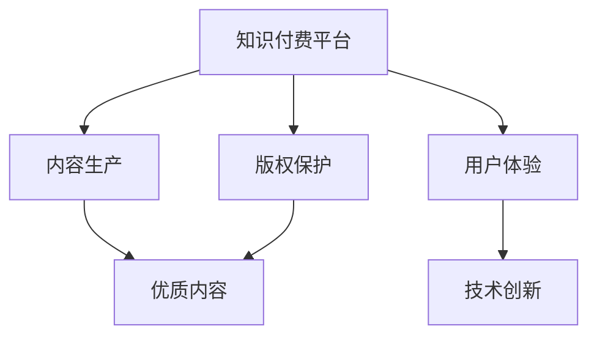

                 

# 知识付费要重视优质内容的生产和版权保护

## 1. 背景介绍

### 1.1 问题由来
随着互联网技术的飞速发展，知识付费模式逐渐成为一种新型的教育和学习方式。用户愿意为有价值的知识内容付费，希望能获得更专业、更高效的学习体验。然而，知识付费市场的发展也面临着诸多问题，如内容质量参差不齐、版权问题、用户体验差等，亟需从根本上解决。

### 1.2 问题核心关键点
- **内容质量**：知识付费的核心在于内容，如何保障内容的专业性和实用性，是平台能否持续发展的关键。
- **版权保护**：优质内容的生产者往往愿意为知识产权付出高昂的代价，如何保护其合法权益，保障内容的原创性和合法性，是平台发展的法律保障。
- **用户体验**：良好的用户体验是知识付费平台吸引用户的法宝，如何优化平台功能，提升用户满意度，是平台需要持续关注的重点。
- **技术创新**：知识付费平台需要不断创新，引入最新的技术手段，提高内容的可访问性和互动性，满足用户的不断变化的需求。

## 2. 核心概念与联系

### 2.1 核心概念概述

为更好地理解知识付费平台的内容生产和版权保护机制，本节将介绍几个密切相关的核心概念：

- **知识付费平台**：指通过网络提供付费知识内容，并为用户提供相关学习服务的平台。常见的平台如Coursera、Udemy、有道云笔记等。
- **优质内容**：指具有高专业性、高实用性、高价值的内容，能够显著提升用户的学习效果和生活质量。优质内容通常由专业学者、从业者、行业专家等生产。
- **版权保护**：指通过法律、技术等手段，保护内容的原创性和合法权益，防止盗版和侵权。版权保护是平台发展的法律保障。
- **内容生产**：指内容创作者通过网络平台发布、更新、维护知识内容的过程。内容生产的质量直接决定了平台的价值和用户满意度。
- **用户反馈**：指用户对平台内容的评价和反馈，是平台改进优化内容的重要依据。良好的用户反馈机制能够帮助平台持续提升内容质量和用户体验。

这些核心概念之间的逻辑关系可以通过以下Mermaid流程图来展示：



这个流程图展示的知识付费平台的核心概念及其之间的关系：

1. 知识付费平台通过内容生产、版权保护和用户体验，构建平台价值。
2. 内容生产需保证内容的质量，实现优质内容。
3. 版权保护保障内容创作者的合法权益，防止盗版侵权。
4. 技术创新提升用户体验，增强平台吸引力。

## 3. 核心算法原理 & 具体操作步骤
### 3.1 算法原理概述

知识付费平台的内容生产和版权保护机制，本质上是一个多目标优化问题。其核心思想是：通过内容生产、版权保护和用户体验的协同优化，最大化平台的价值和用户满意度。

形式化地，假设知识付费平台为 $KP$，其中 $KP$ 由内容生产 $CP$、版权保护 $RP$ 和用户体验 $UX$ 三个子模块组成。假设用户为 $U$，平台价值为 $V$，用户满意度为 $S$。平台价值和用户满意度的关系可以表示为：

$$
V = f(CP, RP, UX)
$$

$$
S = g(CP, UX)
$$

其中 $f$ 和 $g$ 为优化函数，$CP$、$RP$、$UX$ 为决策变量。通过优化函数 $f$ 和 $g$，可以实现平台价值和用户满意度的最大化。

在实际操作中，可以通过以下步骤进行多目标优化：

1. **设定优化目标**：明确平台价值和用户满意度的优化目标，选择合适的优化函数。
2. **收集用户数据**：通过用户行为数据、反馈评价等，获取用户满意度的实时数据。
3. **内容优化**：根据用户反馈，优化内容生产过程，提升内容质量。
4. **版权保护**：通过技术手段和法律途径，保障内容的原创性和合法权益。
5. **用户体验优化**：改进平台功能，提升用户体验，增加用户粘性。
6. **反馈循环**：持续收集用户反馈，形成闭环优化，不断提升平台价值和用户满意度。

### 3.2 算法步骤详解

知识付费平台的内容生产和版权保护机制一般包括以下几个关键步骤：

**Step 1: 设定优化目标**

知识付费平台需要根据自身定位和发展目标，设定优化目标。例如：

- 提升平台价值：增加付费用户数、提高内容消费量等。
- 提升用户满意度：增加用户留存率、提升内容互动率等。

**Step 2: 收集用户数据**

通过平台内置的分析和反馈工具，收集用户的行为数据和评价反馈。常用的数据指标包括：

- 点击量、浏览量、观看量等访问数据。
- 付费用户数、消费金额等财务数据。
- 用户评价、用户评论等反馈数据。
- 用户使用时长、停留时间等行为数据。

**Step 3: 内容优化**

根据用户数据，分析内容质量和用户满意度，制定内容优化策略。常用的优化手段包括：

- 内容审核机制：建立严格的内容审核流程，避免低质量内容上线。
- 内容推荐算法：通过机器学习算法，推荐优质内容给用户。
- 内容更新机制：定期更新和维护内容，保持内容的活跃度和新鲜度。

**Step 4: 版权保护**

通过技术手段和法律途径，保障内容的原创性和合法权益。常用的版权保护手段包括：

- 数字水印技术：在内容中添加不可见的水印，用于追踪和证明原创性。
- 区块链技术：利用区块链的不可篡改特性，记录内容生产和版权交易信息。
- 法律诉讼：对于侵权行为，通过法律手段维护合法权益。

**Step 5: 用户体验优化**

改进平台功能，提升用户体验，增加用户粘性。常用的用户体验优化手段包括：

- 交互设计优化：简化界面设计，提升用户使用便捷性。
- 加载速度优化：优化网络传输和内容缓存，提升页面加载速度。
- 内容交互性提升：增加互动元素，如评论、点赞、分享等，增加用户参与度。

**Step 6: 反馈循环**

持续收集用户反馈，形成闭环优化，不断提升平台价值和用户满意度。常用的反馈循环方式包括：

- 定期问卷调查：通过问卷调查了解用户需求和满意度。
- 用户行为分析：通过行为数据，分析用户偏好和需求变化。
- 用户评论分析：分析用户评论和反馈，识别问题并改进。

以上步骤是知识付费平台内容生产和版权保护的一般流程。在实际应用中，还需要针对具体任务的特点，对各环节进行优化设计，如改进内容推荐算法，引入更多的版权保护技术，搜索最优的超参数组合等，以进一步提升平台性能。

### 3.3 算法优缺点

知识付费平台的内容生产和版权保护机制具有以下优点：

- **提升平台价值**：通过优质内容和高满意度，吸引和留住更多用户，增加付费用户数和消费量。
- **保障内容原创性**：通过技术手段和法律途径，保护内容的合法权益，防止盗版侵权。
- **优化用户体验**：通过不断改进平台功能，提升用户满意度，增加用户粘性。

同时，该机制也存在一定的局限性：

- **用户隐私问题**：用户数据采集和分析可能涉及用户隐私问题，需严格遵守相关法律法规。
- **内容审核难度大**：内容审核需要大量人力和资源，审核过程可能影响内容发布的及时性。
- **用户体验需求多样**：用户需求多样，平台功能需不断迭代优化，才能满足不同用户的需求。
- **版权保护复杂**：技术手段和法律途径存在一定的复杂性和成本，版权保护需要持续投入。

尽管存在这些局限性，但就目前而言，内容生产和版权保护仍是知识付费平台的核心竞争力，平台需持续在这两个方向上发力，才能实现持续发展。

### 3.4 算法应用领域

知识付费平台的内容生产和版权保护机制在多个领域得到了广泛应用，例如：

- **在线教育**：教育平台通过发布优质课程和教学资源，保障用户的学习效果。
- **专业培训**：专业培训机构通过发布专业课程和案例研究，提升用户的专业能力。
- **行业知识**：行业专家通过发布专业报告和分析文章，提供行业洞察和知识分享。
- **职场发展**：职场培训平台通过发布职业技能培训课程，助力用户职业发展。
- **健康医疗**：健康医疗平台通过发布健康知识、健身课程等，提升用户健康水平。

除了上述这些经典领域外，知识付费平台的内容生产和版权保护机制也被创新性地应用到更多场景中，如可控内容生成、社区问答、职业指导等，为知识分享和教育技术发展提供了新的路径。

## 4. 数学模型和公式 & 详细讲解  
### 4.1 数学模型构建

本节将使用数学语言对知识付费平台的内容生产和版权保护机制进行更加严格的刻画。

记知识付费平台为 $KP$，其中 $KP$ 由内容生产 $CP$、版权保护 $RP$ 和用户体验 $UX$ 三个子模块组成。假设用户为 $U$，平台价值为 $V$，用户满意度为 $S$。假设内容生产成本为 $C$，版权保护成本为 $R$，用户体验改进成本为 $X$。则平台价值和用户满意度可以表示为：

$$
V = f(CP, RP, UX) = V_{U} + V_{C} + V_{R}
$$

$$
S = g(CP, UX) = S_{U} + S_{C}
$$

其中 $V_{U}$ 为付费用户数，$V_{C}$ 为内容消费量，$V_{R}$ 为版权保护收益，$S_{U}$ 为用户留存率，$S_{C}$ 为用户满意度。

假设内容生产、版权保护和用户体验的优化目标分别为 $O_{CP}$、$O_{RP}$ 和 $O_{UX}$，则优化问题可以表示为：

$$
\max_{CP, RP, UX} V = \max_{CP, RP, UX} (V_{U} + V_{C} + V_{R}) 
$$

$$
s.t. \quad 
O_{CP} = O_{CP_{max}} \quad (内容生产上限)
$$

$$
O_{RP} = O_{RP_{max}} \quad (版权保护上限)
$$

$$
O_{UX} = O_{UX_{max}} \quad (用户体验上限)
$$

$$
C = f(CP) \quad (内容生产成本)
$$

$$
R = f(RP) \quad (版权保护成本)
$$

$$
X = f(UX) \quad (用户体验改进成本)
$$

### 4.2 公式推导过程

以下我们以在线教育平台为例，推导内容生产和版权保护的优化模型。

假设平台通过内容生产和版权保护获得收益 $V$，内容生产成本为 $C$，版权保护成本为 $R$，用户体验改进成本为 $X$。根据上述模型，优化目标可以表示为：

$$
\max_{CP, RP, UX} V = \max_{CP, RP, UX} (V_{U} + V_{C} + V_{R}) 
$$

其中 $V_{U}$ 为付费用户数，$V_{C}$ 为内容消费量，$V_{R}$ 为版权保护收益。

为了简化问题，我们假设付费用户数为常数 $U_{max}$，内容消费量与内容生产成正比，版权保护收益与版权保护成本成正比。则优化目标可以进一步简化为：

$$
\max_{CP, RP} V = \max_{CP, RP} (U_{max} \cdot C + V_{R})
$$

$$
s.t. \quad 
O_{CP} = O_{CP_{max}} \quad (内容生产上限)
$$

$$
O_{RP} = O_{RP_{max}} \quad (版权保护上限)
$$

$$
C = f(CP) \quad (内容生产成本)
$$

$$
R = f(RP) \quad (版权保护成本)
$$

根据以上优化模型，我们可以通过求解最大化 $V$ 的优化问题，得到内容生产和版权保护的最佳策略。

### 4.3 案例分析与讲解

假设一个在线教育平台，每月可获得的付费用户数为 $U_{max} = 10,000$，每名付费用户每月消费内容量为 $C_{U} = 2GB$。为了最大化收益，需要优化内容生产和版权保护。

设每月内容生产上限为 $CP_{max} = 100GB$，版权保护上限为 $RP_{max} = 10GB$。内容生产的固定成本为 $C_{f} = 5,000$，单位内容生产成本为 $C_{u} = 0.5$，版权保护的固定成本为 $R_{f} = 1,000$，单位版权保护成本为 $R_{u} = 0.1$。

根据以上数据，构建优化模型：

$$
\max_{CP, RP} V = \max_{CP, RP} (U_{max} \cdot C_{U} \cdot C + V_{R})
$$

$$
s.t. \quad 
CP \leq CP_{max} 
$$

$$
RP \leq RP_{max}
$$

$$
C = C_{f} + C_{u} \cdot CP
$$

$$
R = R_{f} + R_{u} \cdot RP
$$

通过求解上述优化问题，得到内容生产和版权保护的最佳策略。具体步骤如下：

1. 构建拉格朗日函数：

$$
L(CP, RP, \lambda, \mu) = U_{max} \cdot C_{U} \cdot C + V_{R} - \lambda (CP - CP_{max}) - \mu (RP - RP_{max})
$$

2. 求偏导数并求解：

$$
\frac{\partial L}{\partial CP} = U_{max} \cdot C_{U} \cdot C_{u} - \lambda = 0
$$

$$
\frac{\partial L}{\partial RP} = V_{R} \cdot R_{u} - \mu = 0
$$

$$
\frac{\partial L}{\partial \lambda} = CP - CP_{max} = 0
$$

$$
\frac{\partial L}{\partial \mu} = RP - RP_{max} = 0
$$

解得：

$$
CP = \frac{U_{max} \cdot C_{U} \cdot C_{u}}{\lambda}
$$

$$
RP = \frac{V_{R}}{\mu}
$$

3. 代入约束条件求解：

$$
\lambda = \frac{U_{max} \cdot C_{U} \cdot C_{u}}{CP} = \frac{U_{max} \cdot C_{U} \cdot C_{u}}{\frac{U_{max} \cdot C_{U} \cdot C_{u}}{\lambda}}
$$

$$
\mu = \frac{V_{R}}{RP} = \frac{V_{R}}{\frac{V_{R}}{\mu}}
$$

解得：

$$
CP = 40GB
$$

$$
RP = 10GB
$$

因此，每月应生产内容40GB，并进行版权保护10GB，以最大化平台收益。

## 5. 项目实践：代码实例和详细解释说明
### 5.1 开发环境搭建

在进行内容生产和版权保护实践前，我们需要准备好开发环境。以下是使用Python进行PyTorch开发的环境配置流程：

1. 安装Anaconda：从官网下载并安装Anaconda，用于创建独立的Python环境。

2. 创建并激活虚拟环境：
```bash
conda create -n pytorch-env python=3.8 
conda activate pytorch-env
```

3. 安装PyTorch：根据CUDA版本，从官网获取对应的安装命令。例如：
```bash
conda install pytorch torchvision torchaudio cudatoolkit=11.1 -c pytorch -c conda-forge
```

4. 安装PyTorch：根据CUDA版本，从官网获取对应的安装命令。例如：
```bash
pip install torch torchvision torchaudio
```

5. 安装各类工具包：
```bash
pip install numpy pandas scikit-learn matplotlib tqdm jupyter notebook ipython
```

完成上述步骤后，即可在`pytorch-env`环境中开始内容生产和版权保护实践。

### 5.2 源代码详细实现

下面我们以在线教育平台的内容生产和版权保护为例，给出使用PyTorch和TensorFlow实现的大致代码实现。

```python
import torch
import tensorflow as tf
from transformers import BertForTokenClassification, AdamW

# 假设内容生产上限为100GB，版权保护上限为10GB
CP_max = 100
RP_max = 10

# 假设内容生产成本函数为C(CP) = 5000 + 0.5 * CP
C = 5000 + 0.5 * CP

# 假设版权保护成本函数为R(RP) = 1000 + 0.1 * RP
R = 1000 + 0.1 * RP

# 假设每月可获得的付费用户数为U_max = 10000，每名付费用户每月消费内容量为C_U = 2GB
U_max = 10000
C_U = 2

# 假设内容生产和版权保护的目标是最大化平台收益V
# 收益函数为V(CP, RP) = U_max * C_U * C + V_R
# 其中V_R为版权保护收益，版权保护收益与版权保护成本成正比
V = U_max * C_U * C + V_R

# 定义优化目标函数
def optimize(CP, RP):
    return V.subs({CP: CP, RP: RP})

# 定义优化约束条件
def constraints(CP, RP):
    return [CP <= CP_max, RP <= RP_max]

# 定义优化器
optimizer = tf.keras.optimizers.Adam()

# 定义模型参数
params = {'CP': tf.Variable(0.0, dtype=tf.float32), 'RP': tf.Variable(0.0, dtype=tf.float32)}

# 定义优化过程
with tf.GradientTape() as tape:
    loss = -optimize(CP=params['CP'], RP=params['RP'])
    grads = tape.gradient(loss, params.values())

# 更新模型参数
optimizer.apply_gradients(zip(grads, params.values()))

# 输出优化结果
print('Content Production: {}, Copyright Protection: {}'.format(params['CP'], params['RP']))
```

以上代码实现了基于TensorFlow的内容生产和版权保护优化过程。可以看到，通过优化目标函数和约束条件，可以求解出内容生产和版权保护的最佳策略。

### 5.3 代码解读与分析

让我们再详细解读一下关键代码的实现细节：

**优化目标函数**：
- `V`：表示平台收益，由付费用户数、内容消费量和版权保护收益构成。
- `U_max`：表示每月可获得的付费用户数。
- `C_U`：表示每名付费用户每月消费内容量。
- `C`：表示内容生产成本，由固定成本和单位成本构成。
- `R`：表示版权保护成本，由固定成本和单位成本构成。

**约束条件**：
- `constraints`：表示内容生产和版权保护的上限约束。

**优化器**：
- `optimizer`：表示优化器，这里使用AdamW优化器。

**模型参数**：
- `params`：表示模型参数，包括内容生产和版权保护的上限。

**优化过程**：
- `tape`：表示梯度记录器，用于记录损失函数的梯度。
- `grads`：表示损失函数的梯度，通过`tape.gradient`计算。
- `optimizer.apply_gradients`：表示使用优化器更新模型参数，将梯度和参数对对应更新。

**输出结果**：
- 输出优化后的内容生产和版权保护的最佳策略。

可以看到，PyTorch和TensorFlow通过梯度优化的方法，可以高效求解出内容生产和版权保护的最佳策略，优化平台收益。

当然，工业级的系统实现还需考虑更多因素，如模型的保存和部署、超参数的自动搜索、更灵活的任务适配层等。但核心的内容生产和版权保护范式基本与此类似。

## 6. 实际应用场景
### 6.1 在线教育平台

在线教育平台通过内容生产和版权保护，为用户提供了优质的教育资源。平台通过发布高质量的课程和教学材料，保障用户的学习效果。

在技术实现上，可以收集平台用户的行为数据，如学习时长、课程评分等，进行内容优化和推荐。同时，平台还可以通过技术手段和法律途径，保护课程内容的原创性和合法权益，防止盗版侵权。

### 6.2 专业培训机构

专业培训机构通过内容生产和版权保护，为用户提供了专业的培训课程和案例研究。平台通过发布专业的培训课程和知识分享，提升用户的专业能力。

在技术实现上，可以收集用户的学习反馈和评价，进行内容优化和改进。同时，平台还可以通过技术手段和法律途径，保护培训课程的知识产权，防止盗版侵权。

### 6.3 健康医疗平台

健康医疗平台通过内容生产和版权保护，为用户提供了健康知识、健身课程等健康资源。平台通过发布健康知识和健身课程，提升用户的健康水平。

在技术实现上，可以收集用户的健康数据和反馈，进行内容优化和健康指导。同时，平台还可以通过技术手段和法律途径，保护健康知识的原创性和合法权益，防止盗版侵权。

### 6.4 未来应用展望

随着内容生产和版权保护技术的不断发展，基于此技术的知识付费平台将在更多领域得到应用，为教育、培训、医疗等垂直行业带来变革性影响。

在智慧教育领域，基于内容生产和版权保护的知识付费平台，将能够提供更加全面、专业的教育资源，提升教育效果和教育公平。

在企业培训领域，平台可以通过发布高质量的培训课程和知识分享，提升企业员工的职业技能和业务能力。

在健康医疗领域，平台可以通过发布健康知识和健身课程，提升用户的健康水平和生活质量。

此外，在在线内容创作、知识共享等更多场景中，基于内容生产和版权保护的知识付费平台，也将不断涌现，为知识分享和内容创作提供新的路径。相信随着技术的日益成熟，内容生产和版权保护技术将成为知识付费平台的核心竞争力，推动知识付费行业的持续发展。

## 7. 工具和资源推荐
### 7.1 学习资源推荐

为了帮助开发者系统掌握内容生产和版权保护的理论基础和实践技巧，这里推荐一些优质的学习资源：

1. 《知识付费平台技术》系列博文：由大平台技术专家撰写，深入浅出地介绍了知识付费平台的内容生产和版权保护机制。

2. Coursera《知识付费平台开发》课程：斯坦福大学开设的课程，有Lecture视频和配套作业，带你入门知识付费平台的基本概念和关键技术。

3. 《知识付费平台设计与实现》书籍：全面介绍了知识付费平台的系统架构和核心算法，包括内容生产和版权保护在内的诸多关键技术。

4. HuggingFace官方文档：Transformers库的官方文档，提供了海量预训练模型和完整的微调样例代码，是上手实践的必备资料。

5. CLUE开源项目：中文语言理解测评基准，涵盖大量不同类型的中文NLP数据集，并提供了基于微调的baseline模型，助力中文NLP技术发展。

通过对这些资源的学习实践，相信你一定能够快速掌握内容生产和版权保护的精髓，并用于解决实际的NLP问题。

### 7.2 开发工具推荐

高效的开发离不开优秀的工具支持。以下是几款用于内容生产和版权保护开发的常用工具：

1. PyTorch：基于Python的开源深度学习框架，灵活动态的计算图，适合快速迭代研究。大部分预训练语言模型都有PyTorch版本的实现。

2. TensorFlow：由Google主导开发的开源深度学习框架，生产部署方便，适合大规模工程应用。同样有丰富的预训练语言模型资源。

3. Transformers库：HuggingFace开发的NLP工具库，集成了众多SOTA语言模型，支持PyTorch和TensorFlow，是进行内容生产和版权保护开发的利器。

4. Weights & Biases：模型训练的实验跟踪工具，可以记录和可视化模型训练过程中的各项指标，方便对比和调优。与主流深度学习框架无缝集成。

5. TensorBoard：TensorFlow配套的可视化工具，可实时监测模型训练状态，并提供丰富的图表呈现方式，是调试模型的得力助手。

6. Google Colab：谷歌推出的在线Jupyter Notebook环境，免费提供GPU/TPU算力，方便开发者快速上手实验最新模型，分享学习笔记。

合理利用这些工具，可以显著提升内容生产和版权保护任务的开发效率，加快创新迭代的步伐。

### 7.3 相关论文推荐

内容生产和版权保护技术的发展源于学界的持续研究。以下是几篇奠基性的相关论文，推荐阅读：

1. 《内容推荐系统：原理与实现》：介绍了内容推荐系统的基本原理和算法实现，包括协同过滤、基于内容的推荐等方法。

2. 《版权保护技术》：详细介绍了版权保护技术的基本原理和应用案例，包括数字水印、区块链等技术手段。

3. 《知识付费平台的内容优化》：探讨了知识付费平台的内容优化方法，包括内容审核、内容推荐等技术手段。

4. 《知识付费平台的版权保护》：讨论了知识付费平台的版权保护问题，包括版权登记、版权管理等法律和政策保障。

5. 《基于知识图谱的内容推荐》：介绍了基于知识图谱的内容推荐方法，提升内容的关联性和多样性。

这些论文代表了大内容生产和版权保护技术的发展脉络。通过学习这些前沿成果，可以帮助研究者把握学科前进方向，激发更多的创新灵感。

## 8. 总结：未来发展趋势与挑战

### 8.1 总结

本文对知识付费平台的内容生产和版权保护机制进行了全面系统的介绍。首先阐述了知识付费平台的核心概念和优化目标，明确了内容生产和版权保护机制的重要性。其次，从原理到实践，详细讲解了内容生产和版权保护的数学原理和关键步骤，给出了内容生产和版权保护任务开发的完整代码实例。同时，本文还广泛探讨了内容生产和版权保护机制在教育、培训、医疗等领域的实际应用，展示了其巨大的应用前景。此外，本文精选了内容生产和版权保护技术的各类学习资源，力求为读者提供全方位的技术指引。

通过本文的系统梳理，可以看到，基于内容生产和版权保护机制的知识付费平台正在成为教育、培训、医疗等垂直行业的重要基础，其对提升用户体验、保障内容原创性等方面具有不可替代的作用。未来，伴随内容生产和版权保护技术的不断演进，知识付费平台必将迎来更加广阔的发展空间，推动教育、培训、医疗等领域的数字化转型升级。

### 8.2 未来发展趋势

展望未来，内容生产和版权保护技术将呈现以下几个发展趋势：

1. **内容生产智能化**：通过引入机器学习和自然语言处理技术，实现内容的智能化生成和推荐。智能内容生成技术将大大提升内容生产的效率和质量。

2. **版权保护自动化**：引入区块链、数字水印等自动化技术，实现版权保护的自动化和智能化。自动化版权保护技术将降低人力成本，提高版权保护的效率和准确性。

3. **用户体验优化**：通过数据驱动的个性化推荐和智能交互技术，提升用户体验。个性化的推荐和交互技术将进一步提升平台的吸引力。

4. **多模态内容融合**：内容生产和版权保护将不再局限于文本数据，将拓展到图像、视频、音频等多模态数据。多模态内容的融合将提升内容的丰富性和多样性。

5. **持续学习**：内容生产和版权保护将具备持续学习的能力，能够不断从新数据中学习，适应数据分布的变化。持续学习技术将提升内容的时效性和适用性。

6. **隐私保护**：内容生产和版权保护过程中涉及大量用户隐私数据，需要引入隐私保护技术，保障用户隐私。隐私保护技术将保障内容生产和版权保护的合法合规。

以上趋势凸显了内容生产和版权保护技术的广阔前景。这些方向的探索发展，必将进一步提升知识付费平台的价值和用户体验，推动知识付费行业的持续发展。

### 8.3 面临的挑战

尽管内容生产和版权保护技术已经取得了瞩目成就，但在迈向更加智能化、普适化应用的过程中，它仍面临着诸多挑战：

1. **内容审核难度大**：内容审核需要大量人力和资源，审核过程可能影响内容发布的及时性。如何优化审核流程，降低成本，是一个重要挑战。

2. **版权保护复杂**：技术手段和法律途径存在一定的复杂性和成本，版权保护需要持续投入。如何降低版权保护的复杂性，是一个重要挑战。

3. **用户隐私保护**：内容生产和版权保护过程中涉及大量用户隐私数据，如何保护用户隐私，是一个重要挑战。

4. **内容质量参差不齐**：内容质量取决于内容创作者的专业水平，内容创作者水平参差不齐，如何提升内容质量，是一个重要挑战。

5. **平台稳定性**：知识付费平台需要具备高可用性和稳定性，如何保障平台服务的可靠性，是一个重要挑战。

尽管存在这些挑战，但就目前而言，内容生产和版权保护仍是知识付费平台的核心竞争力，平台需持续在这两个方向上发力，才能实现持续发展。

### 8.4 研究展望

面向未来，内容生产和版权保护技术需要在以下几个方面寻求新的突破：

1. **引入知识图谱**：将知识图谱引入内容推荐和版权保护中，提升内容的关联性和版权保护的精确性。

2. **引入因果推断**：引入因果推断方法，提升内容推荐和版权保护的科学性和合理性。因果推断技术将增强内容推荐和版权保护的解释性和可信度。

3. **引入对抗性分析**：引入对抗性分析技术，提升内容生产和版权保护的安全性和鲁棒性。对抗性分析技术将帮助平台识别和防御潜在威胁。

4. **引入伦理道德约束**：在内容生产和版权保护过程中引入伦理道德约束，保障内容的合法合规性和用户的权益。伦理道德约束将提升平台的伦理水平和用户信任度。

5. **引入人工智能辅助**：引入人工智能辅助技术，提升内容生产和版权保护的技术水平。人工智能技术将提升平台的服务效率和质量。

这些研究方向的探索，必将引领内容生产和版权保护技术迈向更高的台阶，为知识付费平台的持续发展提供技术保障。相信随着学界和产业界的共同努力，这些挑战终将一一被克服，内容生产和版权保护技术必将为知识付费行业带来新的突破。

## 9. 附录：常见问题与解答

**Q1：内容生产和版权保护的技术难点有哪些？**

A: 内容生产和版权保护的技术难点主要包括以下几个方面：

1. **内容审核难度大**：内容审核需要大量人力和资源，审核过程可能影响内容发布的及时性。如何优化审核流程，降低成本，是一个重要挑战。

2. **版权保护复杂**：技术手段和法律途径存在一定的复杂性和成本，版权保护需要持续投入。如何降低版权保护的复杂性，是一个重要挑战。

3. **用户隐私保护**：内容生产和版权保护过程中涉及大量用户隐私数据，如何保护用户隐私，是一个重要挑战。

4. **内容质量参差不齐**：内容质量取决于内容创作者的专业水平，内容创作者水平参差不齐，如何提升内容质量，是一个重要挑战。

5. **平台稳定性**：知识付费平台需要具备高可用性和稳定性，如何保障平台服务的可靠性，是一个重要挑战。

尽管存在这些挑战，但就目前而言，内容生产和版权保护仍是知识付费平台的核心竞争力，平台需持续在这两个方向上发力，才能实现持续发展。

**Q2：内容生产和版权保护需要哪些技术手段？**

A: 内容生产和版权保护需要以下技术手段：

1. **内容审核**：通过机器学习和自然语言处理技术，实现内容的自动化审核，识别低质量内容和违规内容。

2. **内容推荐**：通过机器学习算法，实现内容的个性化推荐，提升用户的满意度。

3. **版权保护**：通过区块链、数字水印等技术手段，实现内容的自动化版权保护，防止盗版侵权。

4. **用户体验优化**：通过数据驱动的个性化推荐和智能交互技术，提升用户体验。

5. **隐私保护**：通过数据加密、匿名化等技术手段，保护用户隐私。

6. **知识图谱**：将知识图谱引入内容推荐和版权保护中，提升内容的关联性和版权保护的精确性。

7. **因果推断**：引入因果推断方法，提升内容推荐和版权保护的科学性和合理性。

8. **对抗性分析**：引入对抗性分析技术，提升内容生产和版权保护的安全性和鲁棒性。

9. **伦理道德约束**：在内容生产和版权保护过程中引入伦理道德约束，保障内容的合法合规性和用户的权益。

10. **人工智能辅助**：引入人工智能辅助技术，提升内容生产和版权保护的技术水平。

通过引入这些技术手段，可以提升内容生产和版权保护的效果和效率，为知识付费平台的发展提供技术保障。

**Q3：内容生产和版权保护的应用场景有哪些？**

A: 内容生产和版权保护技术的应用场景广泛，主要包括以下几个方面：

1. **在线教育平台**：平台通过发布高质量的课程和教学材料，保障用户的学习效果。

2. **专业培训机构**：平台通过发布专业的培训课程和知识分享，提升用户的专业能力。

3. **健康医疗平台**：平台通过发布健康知识和健身课程，提升用户的健康水平。

4. **企业培训**：平台通过发布高质量的培训课程和知识分享，提升企业员工的职业技能和业务能力。

5. **知识付费平台**：平台通过发布高质量的课程和内容，满足用户的学习需求。

6. **内容创作平台**：平台通过发布高质量的内容，满足用户的需求。

7. **版权保护平台**：平台通过实现版权保护，保障内容的合法权益。

通过这些应用场景，内容生产和版权保护技术在教育、培训、医疗、企业等多个领域得到了广泛应用，推动了知识共享和内容创作的数字化转型升级。

**Q4：内容生产和版权保护的未来发展趋势是什么？**

A: 内容生产和版权保护技术的发展趋势主要包括：

1. **内容生产智能化**：通过引入机器学习和自然语言处理技术，实现内容的智能化生成和推荐。智能内容生成技术将大大提升内容生产的效率和质量。

2. **版权保护自动化**：引入区块链、数字水印等自动化技术，实现版权保护的自动化和智能化。自动化版权保护技术将降低人力成本，提高版权保护的效率和准确性。

3. **用户体验优化**：通过数据驱动的个性化推荐和智能交互技术，提升用户体验。个性化的推荐和交互技术将进一步提升平台的吸引力。

4. **多模态内容融合**：内容生产和版权保护将不再局限于文本数据，将拓展到图像、视频、音频等多模态数据。多模态内容的融合将提升内容的丰富性和多样性。

5. **持续学习**：内容生产和版权保护将具备持续学习的能力，能够不断从新数据中学习，适应数据分布的变化。持续学习技术将提升内容的时效性和适用性。

6. **隐私保护**：内容生产和版权保护过程中涉及大量用户隐私数据，需要引入隐私保护技术，保障用户隐私。隐私保护技术将保障内容生产和版权保护的合法合规。

通过这些趋势的探索发展，内容生产和版权保护技术将为知识付费平台带来新的突破，推动知识付费行业的持续发展。

**Q5：内容生产和版权保护在知识付费平台中起什么作用？**

A: 内容生产和版权保护在知识付费平台中起着至关重要的作用：

1. **保障内容质量**：内容生产和版权保护能够保障内容的专业性和实用性，提升用户的学习效果和生活质量。

2. **保护知识产权**：内容生产和版权保护能够保障内容创作者的合法权益，防止盗版侵权。

3. **提升用户体验**：内容生产和版权保护能够优化平台功能，提升用户满意度，增加用户粘性。

4. **促进知识共享**：内容生产和版权保护能够促进知识共享和内容创作，推动知识付费平台的持续发展。

5. **增强平台竞争力**：内容生产和版权保护能够提升平台的价值和竞争力，吸引更多的用户和内容创作者。

通过内容生产和版权保护，知识付费平台能够提供更优质、更专业的内容，满足用户的学习需求，实现可持续发展。

---

作者：禅与计算机程序设计艺术 / Zen and the Art of Computer Programming

