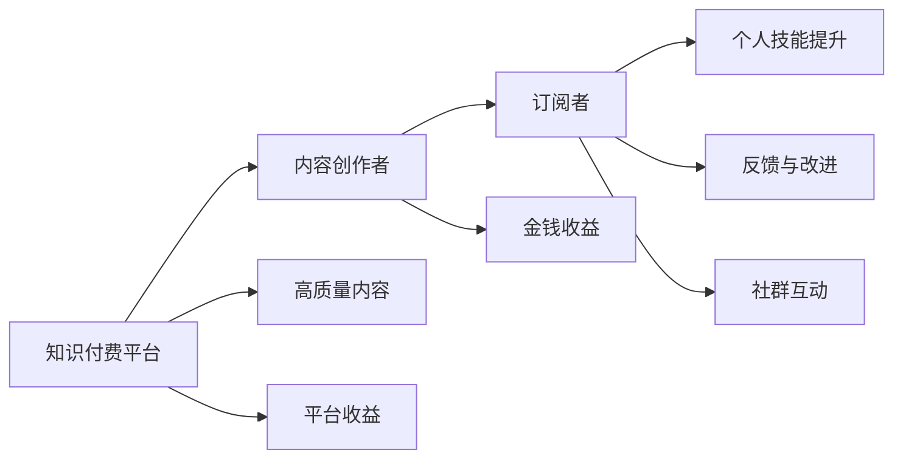

                 

# 知识付费让程序员告别996的生活

## 1. 背景介绍

在过去的几年里，程序员的工作方式和行业环境经历了剧烈的变化。随着互联网技术的快速发展，企业对于人才的需求日益增加，程序员的加班文化盛行，996工作制（即早上9点上班，晚上9点下班，每周工作6天）成为常态。长此以往，许多程序员身心健康受到威胁，同时也影响了家庭生活和职业发展。

## 2. 核心概念与联系

### 2.1 核心概念概述

为了改变这一现状，知识付费成为一个重要的解决方案。知识付费是指通过付费方式获取知识、技能和信息，以此提升个人和组织的学习效率和竞争力。

- **知识付费平台**：如知乎、得到、极客时间等，提供高质量的在线课程、电子书、文章等，帮助用户快速学习和提升技能。
- **内容创作者**：包括行业专家、技术大牛、资深程序员等，通过知识付费平台将自己的经验、见解和项目分享出去。
- **订阅者**：即知识付费的消费者，通过付费获得知识的快速传递和深度学习机会。

### 2.2 核心概念原理和架构的 Mermaid 流程图



此图展示了知识付费生态系统的核心架构：内容创作者在知识付费平台上发布高质量内容，订阅者通过付费获取并学习这些内容，平台从中获得收益，同时订阅者通过学习提升个人技能，形成良性循环。

## 3. 核心算法原理 & 具体操作步骤

### 3.1 算法原理概述

知识付费的核心算法原理基于推荐系统。推荐系统根据用户的历史行为和偏好，为用户推荐最合适的知识内容，从而提升学习效率。

### 3.2 算法步骤详解

1. **用户画像建立**：通过分析用户的浏览、购买、评分等行为数据，构建用户画像，理解用户的兴趣和需求。
2. **内容标签化**：对知识内容进行标签化，如编程语言、开发工具、项目实践等，以便内容匹配用户需求。
3. **推荐模型训练**：使用机器学习算法训练推荐模型，如协同过滤、基于内容的推荐等，生成个性化推荐列表。
4. **实时推荐**：在用户进行新行为时，实时更新推荐列表，提供最新的、最相关的知识内容。

### 3.3 算法优缺点

**优点**：
- **高效学习**：通过个性化推荐，用户可以更快速地找到适合自己的知识内容，提升学习效率。
- **知识质量保障**：推荐系统可以根据用户反馈和内容评价，筛选高质量内容，保证学习质量。
- **多样性**：推荐算法能够提供多种知识选择，满足不同用户的需求。

**缺点**：
- **过度依赖**：用户过度依赖推荐系统，可能导致信息茧房，影响知识面广度。
- **数据隐私**：推荐系统需要收集和分析用户行为数据，可能涉及隐私问题。
- **冷启动问题**：新用户没有足够的行为数据，难以准确推荐内容。

### 3.4 算法应用领域

知识付费在多个领域得到广泛应用：

- **编程学习**：通过知识付费平台获取编程课程、技术博客、编程范例等，加速编程技能提升。
- **职业发展**：利用知识付费获取管理、领导力、市场营销等领域的知识和技能，提升职业竞争力。
- **兴趣爱好**：学习音乐、绘画、摄影等兴趣领域的知识，丰富个人生活。

## 4. 数学模型和公式 & 详细讲解 & 举例说明

### 4.1 数学模型构建

知识付费推荐系统的数学模型可以分为两部分：用户画像建立和推荐模型训练。

- **用户画像**：用户画像可以用向量表示，包含用户的历史行为、兴趣偏好、人口统计特征等。
- **推荐模型**：常见的推荐算法包括协同过滤、基于内容的推荐、矩阵分解等，通过构建用户-物品矩阵，计算用户对物品的评分预测。

### 4.2 公式推导过程

以协同过滤算法为例，假设有$M$个用户和$N$个知识内容，用户-物品矩阵为$R$，用户$u$对物品$i$的评分可以表示为：

$$
R_{ui} = \sum_{j=1}^N \alpha_j \times u_j \times i_j
$$

其中$\alpha_j$表示用户$u$对物品$i$的兴趣权重，$u_j$表示用户$j$对物品$i$的评分，$i_j$表示物品$j$的特征权重。

### 4.3 案例分析与讲解

以在知识付费平台上学习编程为例：

1. **用户画像建立**：平台收集用户的编程语言偏好、学习历史、项目经验等信息，构建用户画像向量$u$。
2. **内容标签化**：对每个课程和文章进行标签化，如Python、Java、机器学习等，构建物品特征向量$i$。
3. **推荐模型训练**：使用协同过滤算法，计算用户$u$对每个课程的评分预测，选择评分最高的课程作为推荐。

## 5. 项目实践：代码实例和详细解释说明

### 5.1 开发环境搭建

以下是使用Python和PyTorch搭建知识付费推荐系统的环境配置：

1. 安装Anaconda：从官网下载并安装Anaconda，用于创建独立的Python环境。
2. 创建并激活虚拟环境：
```bash
conda create -n recommendation-env python=3.8 
conda activate recommendation-env
```

3. 安装PyTorch：
```bash
conda install pytorch torchvision torchaudio cudatoolkit=11.1 -c pytorch -c conda-forge
```

4. 安装各类工具包：
```bash
pip install numpy pandas scikit-learn matplotlib tqdm jupyter notebook ipython
```

### 5.2 源代码详细实现

我们以协同过滤算法为例，实现一个简单的推荐系统。

```python
import numpy as np
from scipy.sparse import csr_matrix

class CollaborativeFiltering:
    def __init__(self, ratings, num_users, num_items):
        self.ratings = ratings
        self.num_users = num_users
        self.num_items = num_items
        self.user_features = np.random.rand(num_users, 10)
        self.item_features = np.random.rand(num_items, 10)

    def predict_ratings(self, user, item):
        user_features = self.user_features[user]
        item_features = self.item_features[item]
        return np.dot(user_features, item_features)

    def fit(self, num_epochs):
        for epoch in range(num_epochs):
            for user in range(self.num_users):
                for item in range(self.num_items):
                    rating = self.ratings[user, item]
                    predicted_rating = self.predict_ratings(user, item)
                    loss = (rating - predicted_rating)**2
                    self.user_features[user] -= 0.01 * np.dot(np.diff(self.ratings[user,:] - predicted_rating), np.diff(self.user_features[user,:]))
                    self.item_features[item] -= 0.01 * np.dot(np.diff(self.ratings[:,item] - predicted_rating), np.diff(self.item_features[item,:]))

    def recommend_items(self, user, num_recommendations):
        predictions = np.zeros((num_recommendations))
        for item in range(self.num_items):
            predictions[item] = self.predict_ratings(user, item)
        return np.argsort(-predictions)[1:num_recommendations+1]

# 数据生成
ratings = np.random.rand(100, 100)
np.fill_diagonal(ratings, 0)
num_users = ratings.shape[0]
num_items = ratings.shape[1]

# 推荐系统构建
model = CollaborativeFiltering(ratings, num_users, num_items)
model.fit(100)

# 用户推荐
user_id = 0
recommendations = model.recommend_items(user_id, 5)
print("推荐物品列表：", recommendations)
```

### 5.3 代码解读与分析

**CollaborativeFiltering类**：
- `__init__`方法：初始化用户和物品特征向量，用户行为矩阵。
- `predict_ratings`方法：根据用户和物品特征向量计算评分预测。
- `fit`方法：根据用户行为矩阵，通过梯度下降更新用户和物品特征向量，最小化预测评分与真实评分之间的差距。
- `recommend_items`方法：根据用户特征向量，计算推荐物品评分，选择最高评分的物品作为推荐。

**推荐系统构建与训练**：
- 使用随机生成的小样本数据，构建一个简单的协同过滤推荐系统。
- 在训练阶段，通过梯度下降更新用户和物品特征向量，使预测评分逐渐逼近真实评分。
- 在推荐阶段，计算用户对每个物品的评分预测，选择评分最高的物品作为推荐。

## 6. 实际应用场景

### 6.1 智能编程助手

知识付费平台可以为用户提供智能编程助手功能，通过推荐最新的编程技术、开源项目、编程范例等，帮助程序员提升编程技能。

**具体实现**：
1. 收集和标注编程相关的文章、代码示例、工具文档等。
2. 使用知识付费平台，将这些资源打包成课程或文章，供程序员学习。
3. 根据程序员的学习历史、浏览记录、代码提交等行为数据，推荐最适合的学习材料。

### 6.2 职业发展规划

知识付费平台还可以帮助用户进行职业发展规划，通过推荐管理、领导力、市场营销等领域的课程和书籍，提升职业竞争力。

**具体实现**：
1. 收集职业发展相关的课程、书籍、文章等。
2. 分析用户的职业背景、学习历史和职业目标，构建用户画像。
3. 根据用户画像，推荐相关领域的课程和书籍，提供职业发展建议。

### 6.3 兴趣爱好拓展

知识付费平台可以提供多种兴趣领域的课程和资源，如音乐、绘画、摄影等，帮助用户拓展兴趣范围，提升生活质量。

**具体实现**：
1. 收集和标注各类兴趣领域的课程、书籍、视频等。
2. 分析用户的兴趣偏好，构建用户画像。
3. 根据用户画像，推荐相关领域的课程和资源，丰富用户生活。

### 6.4 未来应用展望

未来，知识付费平台将在更多领域得到应用，为个人和组织提供更多学习机会和成长空间：

- **在线教育**：知识付费平台将成为在线教育的重要渠道，提供高质量的课程和教学资源。
- **企业培训**：企业可以利用知识付费平台进行员工培训，提升整体技能水平。
- **学术研究**：科研人员可以利用知识付费平台获取最新的研究成果和技术进展。
- **公共知识普及**：政府和社区可以通过知识付费平台普及科学知识，提升公众素质。

## 7. 工具和资源推荐

### 7.1 学习资源推荐

为了帮助开发者系统掌握知识付费推荐系统的理论基础和实践技巧，以下是一些优质的学习资源：

1. **《推荐系统理论与实践》**：介绍了推荐系统的基础理论、算法模型和实现技术，涵盖协同过滤、基于内容的推荐等多种算法。
2. **Coursera推荐系统课程**：由斯坦福大学开设的推荐系统课程，讲解推荐系统的基础和高级技术。
3. **Kaggle推荐系统竞赛**：通过实际竞赛，帮助开发者深入理解推荐系统的应用和优化。
4. **PyTorch官方文档**：PyTorch推荐系统实现指南，提供了丰富的代码示例和教程。
5. **推荐系统论文库**：收录了推荐系统领域的经典论文和最新研究，是学习推荐系统的宝贵资源。

### 7.2 开发工具推荐

高效的开发离不开优秀的工具支持。以下是几款用于知识付费推荐系统开发的常用工具：

1. **Jupyter Notebook**：交互式编程环境，适合快速迭代开发。
2. **TensorBoard**：可视化工具，用于监控和调试模型训练过程。
3. **Weights & Biases**：实验跟踪工具，记录和可视化模型训练状态。
4. **PyTorch**：深度学习框架，支持高效的推荐系统实现。
5. **Scikit-learn**：机器学习库，提供多种推荐算法实现。

### 7.3 相关论文推荐

知识付费推荐系统的研究源于学界的持续研究。以下是几篇奠基性的相关论文，推荐阅读：

1. **《Top-N推荐系统》**：介绍了推荐系统的基础算法和评价指标。
2. **《协同过滤推荐算法》**：讲解协同过滤算法的基本原理和实现方法。
3. **《基于内容的推荐系统》**：介绍基于内容的推荐算法和应用场景。
4. **《深度学习在推荐系统中的应用》**：介绍深度学习在推荐系统中的应用，如神经协同过滤、自编码器推荐等。

## 8. 总结：未来发展趋势与挑战

### 8.1 总结

本文对知识付费推荐系统进行了全面系统的介绍。首先阐述了知识付费背景和推荐系统的核心概念，明确了推荐系统在提高学习和工作效率方面的独特价值。其次，从原理到实践，详细讲解了推荐系统的数学原理和关键步骤，给出了推荐系统开发的全代码实例。同时，本文还广泛探讨了推荐系统在智能编程助手、职业发展规划、兴趣爱好拓展等多个场景的应用前景，展示了知识付费推荐系统的巨大潜力。此外，本文精选了推荐系统的各类学习资源，力求为读者提供全方位的技术指引。

通过本文的系统梳理，可以看到，知识付费推荐系统正在成为在线教育、职业发展、兴趣爱好等领域的重要范式，极大地提升个人和组织的知识获取效率和能力。得益于推荐算法的持续演进，推荐系统正在不断拓展应用边界，为知识付费带来更多创新和突破。未来，随着推荐系统的不断优化和扩展，知识付费平台必将更加智能、高效、多样化，推动人类认知智能的进步。

### 8.2 未来发展趋势

展望未来，知识付费推荐系统将呈现以下几个发展趋势：

1. **个性化推荐精度提升**：随着数据收集和算法优化的不断进步，推荐系统的个性化推荐精度将不断提高，满足用户的多样化需求。
2. **实时推荐与交互优化**：推荐系统将具备实时推荐和动态调整的能力，通过用户反馈和行为数据，不断优化推荐结果。
3. **跨领域知识整合**：推荐系统将具备跨领域知识整合能力，将不同领域的知识进行有效融合，提升综合推荐效果。
4. **多模态信息融合**：推荐系统将支持多模态信息融合，结合文本、图片、视频等多种数据形式，提供更全面的推荐内容。
5. **隐私保护与数据安全**：推荐系统将重视用户隐私保护和数据安全，采用隐私保护技术和加密存储，保障用户数据安全。

以上趋势凸显了知识付费推荐系统的广阔前景。这些方向的探索发展，必将进一步提升推荐系统的性能和应用范围，为知识付费平台带来更大的商业价值和社会效益。

### 8.3 面临的挑战

尽管知识付费推荐系统已经取得了显著成就，但在迈向更加智能化、普适化应用的过程中，它仍面临诸多挑战：

1. **数据质量与标注成本**：推荐系统需要高质量的数据和标签，但获取和标注这些数据成本较高。如何降低数据获取成本，提升数据质量，是一大难题。
2. **模型复杂度与计算资源**：推荐系统需要处理大量数据，计算复杂度较高，对计算资源和存储资源需求较大。如何降低计算复杂度，优化资源使用，是一大挑战。
3. **模型泛化性与鲁棒性**：推荐系统需要在不同数据集上表现稳定，避免过拟合和模型偏见。如何提高模型泛化性，增强鲁棒性，是一大挑战。
4. **用户隐私与数据安全**：推荐系统需要收集和分析用户数据，涉及隐私保护和数据安全问题。如何保障用户隐私，防止数据滥用，是一大挑战。
5. **个性化推荐与多样性**：推荐系统需要平衡个性化推荐与内容多样性，避免信息茧房。如何实现个性化推荐与多样性的平衡，是一大挑战。

### 8.4 研究展望

面对知识付费推荐系统所面临的这些挑战，未来的研究需要在以下几个方面寻求新的突破：

1. **高效数据采集与标注**：研究自动数据采集和标注方法，减少人工干预，降低数据获取成本。
2. **轻量级模型与高效计算**：研究轻量级模型结构和高效计算方法，降低计算复杂度，提升资源使用效率。
3. **多领域知识融合**：研究跨领域知识整合技术，提升推荐系统的综合性能和应用范围。
4. **隐私保护与数据安全**：研究隐私保护和数据安全技术，保障用户数据安全。
5. **推荐系统理论与算法**：研究推荐系统的理论基础和算法优化，提高个性化推荐精度和泛化性。

这些研究方向的探索，必将引领知识付费推荐系统迈向更高的台阶，为知识付费平台带来更大的商业价值和社会效益。面向未来，知识付费推荐系统还需要与其他人工智能技术进行更深入的融合，如自然语言处理、计算机视觉等，多路径协同发力，共同推动知识付费技术的进步。只有勇于创新、敢于突破，才能不断拓展知识付费系统的边界，让智能技术更好地造福人类社会。

## 9. 附录：常见问题与解答

**Q1：知识付费推荐系统是否适用于所有知识领域？**

A: 知识付费推荐系统可以应用于多种知识领域，如编程、管理、音乐、绘画等。不同领域的推荐系统需要针对该领域的特定需求和数据特点进行定制化设计和优化。

**Q2：如何提高推荐系统的个性化精度？**

A: 提高推荐系统个性化精度的主要方法包括：
1. 收集和标注高质量数据，增加用户画像维度。
2. 引入用户行为数据，如点击、购买、浏览等，增加推荐模型输入。
3. 优化推荐算法，如协同过滤、基于内容的推荐等，提升推荐效果。
4. 实时更新推荐模型，根据用户反馈和行为数据进行动态调整。

**Q3：推荐系统在落地应用时需要注意哪些问题？**

A: 推荐系统在落地应用时需要注意以下问题：
1. 数据隐私与用户授权，确保用户数据合法合规使用。
2. 数据存储与计算资源，合理规划数据存储和计算资源配置。
3. 推荐系统效果评估，定期评估推荐系统性能，及时调整优化。
4. 系统可扩展性与稳定性，确保系统在负载增加时能够稳定运行。
5. 用户体验与反馈，收集用户反馈，不断优化推荐算法和用户界面。

**Q4：推荐系统在实际应用中如何平衡个性化推荐与内容多样性？**

A: 推荐系统在实际应用中可以通过以下方法平衡个性化推荐与内容多样性：
1. 引入多样性损失函数，在推荐算法中考虑内容多样性。
2. 设置推荐阈值，限制同一用户的推荐数量，避免信息茧房。
3. 引入多样性惩罚，对于过于相似的内容进行惩罚，增加推荐多样性。
4. 引入用户偏好调整，根据用户反馈和行为数据，调整推荐策略。

这些策略需要在实际应用中不断优化和调整，以达到个性化推荐与内容多样性的平衡。

**Q5：推荐系统的用户画像如何构建？**

A: 推荐系统的用户画像可以通过以下方法构建：
1. 收集和标注用户行为数据，如点击、购买、浏览等，构建行为向量。
2. 收集和标注用户人口统计特征，如年龄、性别、职业等，构建人口统计特征向量。
3. 使用机器学习算法，如协同过滤、矩阵分解等，对用户行为和人口统计特征向量进行建模。
4. 定期更新用户画像，根据用户行为变化和反馈调整用户画像向量。

通过综合考虑用户行为和人口统计特征，可以构建更加精准的用户画像，提升推荐系统的个性化推荐效果。

---

作者：禅与计算机程序设计艺术 / Zen and the Art of Computer Programming

