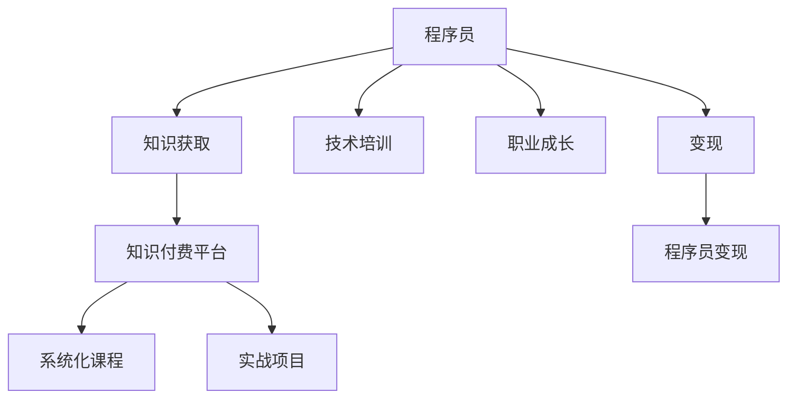

                 

## 1. 背景介绍

在现代数字化社会，程序员作为信息技术的核心力量，其价值和地位日益凸显。然而，与高收入、高智力投入相比，程序员的收入与劳动强度之间存在明显的不匹配，这在很大程度上抑制了程序员的发展潜力，影响了社会整体的技术进步。知识付费平台作为知识传播的重要载体，为程序员提供了一个展示自身价值、获取更多经济回报的新途径。

### 1.1 问题由来

长期以来，程序员在技术迭代快速、市场需求旺盛的背景下，往往需要不断学习新技能，投入大量时间和精力。但由于薪资与劳动强度之间的不匹配，许多程序员缺乏持续学习的动力，甚至出现“程序员焦虑”现象。此外，低成本知识获取渠道的不足，也使得程序员难以获得系统、深入的技术培训。

为了解决这一问题，知识付费平台应运而生。这类平台通过提供系统化的学习课程和实际应用场景，为程序员提供了一个低成本、高效率的学习和展示自我的平台。通过知识付费，程序员不仅能够获取持续的成长动力，还可以提升自身价值，实现更高的收入回报。

### 1.2 问题核心关键点

1. **程序员的价值与收入不匹配**：程序员虽然掌握大量核心技术，但面对高强度工作和高收入期望，存在显著价值与收入不匹配的现象。
2. **知识获取渠道单一**：程序员主要依靠零散的博客、论坛和自学的形式获取知识，系统化、深入的培训资源稀缺。
3. **持续学习的动力不足**：缺乏高成本的知识获取途径，程序员难以持续投入时间和金钱进行深入学习。
4. **知识付费平台的崛起**：知识付费平台的兴起，为程序员提供了一个高效、系统化的学习途径，同时也为程序员的变现提供了可能。

## 2. 核心概念与联系

### 2.1 核心概念概述

为深入理解知识付费平台对程序员职业发展的影响，我们先介绍几个核心概念：

- **程序员**：作为软件开发的核心力量，程序员掌握着丰富的技术知识和实际编程能力。
- **知识付费平台**：通过售卖知识产品（如在线课程、电子书、实战项目等），为程序员提供系统化、深度化的培训平台。
- **程序员自我提升**：利用知识付费平台，程序员能够获取系统化的学习资源，不断提升自身技能，实现职业成长。
- **程序员变现**：通过知识付费平台，程序员可以将自身知识和技能转化为经济价值，实现更高的收入回报。

这些概念之间的联系可以通过以下Mermaid流程图进行展示：



这个流程图展示了程序员通过知识付费平台进行技术培训和职业成长的过程，并最终实现经济变现的路径。

## 3. 核心算法原理 & 具体操作步骤

### 3.1 算法原理概述

知识付费平台的核心算法原理主要包括以下几个方面：

- **课程推荐算法**：通过分析用户的学习行为和偏好，推荐最符合用户需求的学习资源。
- **知识图谱**：构建程序员知识图谱，实现技术概念的关联和索引，方便用户查找和理解。
- **实时反馈与优化**：通过用户学习效果和反馈，实时调整课程内容和教学方法，提升学习效果。

### 3.2 算法步骤详解

知识付费平台的具体操作步骤如下：

1. **用户注册**：用户通过邮箱或第三方账号注册，建立个人学习档案。
2. **课程推荐**：平台根据用户的学习历史、行为偏好、职业背景等数据，推荐适合的课程和项目。
3. **课程学习**：用户选择并学习推荐课程，完成作业和测试。
4. **学习反馈**：平台收集用户的学习进度和反馈，优化课程内容和教学方法。
5. **职业指导**：平台提供职业规划、简历优化、面试辅导等服务，帮助用户实现职业成长。
6. **变现途径**：用户通过平台出售课程、技术咨询、项目开发等形式实现经济变现。

### 3.3 算法优缺点

知识付费平台的算法具有以下优点：

1. **系统化培训**：课程体系完备，用户能够获取系统化的技术培训。
2. **高效便捷**：课程随时随地可学，减少了时间和空间的限制。
3. **实时反馈**：通过学习数据和反馈机制，平台能够实时调整课程内容和教学方法，提升学习效果。

然而，这种模式也存在以下缺点：

1. **课程质量参差不齐**：部分课程内容和质量存在问题，用户需要自行甄别。
2. **高昂费用**：部分课程和项目费用较高，可能超出部分用户的支付能力。
3. **缺乏实践机会**：课程主要以理论学习为主，实战项目较少。

### 3.4 算法应用领域

知识付费平台在程序员自我提升和变现方面有广泛的应用，主要包括以下几个领域：

1. **技术培训**：提供系统化的编程语言、框架、算法等培训课程。
2. **实战项目**：提供企业级项目实战项目，提升用户的实战经验。
3. **职业指导**：提供职业规划、简历优化、面试辅导等服务，帮助用户实现职业转型。
4. **技术咨询**：提供技术问题解答、代码审核等技术咨询服务。
5. **项目开发**：用户可以通过平台发布和承接软件开发项目，实现变现。

## 4. 数学模型和公式 & 详细讲解 & 举例说明

### 4.1 数学模型构建

知识付费平台的推荐算法通常采用协同过滤和深度学习等方法，构建用户-课程评分矩阵，通过矩阵分解得到用户对课程的潜在评分，进而推荐最符合用户需求的课程。推荐算法模型可表示为：

$$
\hat{R}_{ui} = \mathop{\arg\max}_{j} \left\{ p_{uj} \times q_{ij} \right\}
$$

其中，$\hat{R}_{ui}$ 表示用户 $u$ 对课程 $i$ 的潜在评分，$p_{uj}$ 和 $q_{ij}$ 分别为用户 $u$ 和课程 $i$ 的潜在特征向量，$\times$ 表示向量内积。

### 4.2 公式推导过程

推荐算法的核心推导过程如下：

1. **用户-课程评分矩阵**：构建用户-课程评分矩阵 $R$，其中 $R_{ui}$ 表示用户 $u$ 对课程 $i$ 的评分。
2. **矩阵分解**：通过矩阵分解技术，将用户-课程评分矩阵 $R$ 分解为用户潜在特征矩阵 $P$ 和课程潜在特征矩阵 $Q$，即 $R \approx P \times Q$。
3. **评分预测**：通过矩阵乘法 $P_{uj} \times Q_{ij}$，得到用户 $u$ 对课程 $i$ 的潜在评分 $\hat{R}_{ui}$。
4. **推荐排序**：根据潜在评分的大小，对课程进行排序，推荐用户最可能感兴趣的课程。

### 4.3 案例分析与讲解

以一个简单的协同过滤算法为例，假设用户 $u_1$ 和课程 $i_1, i_2, i_3$ 的评分如下表所示：

| 用户 | 课程1 | 课程2 | 课程3 |
| ---- | ---- | ---- | ---- |
| u1   | 4    | 3    | 2    |
| u2   | 5    | 4    | 3    |
| u3   | 2    | 1    | 5    |

构建用户-课程评分矩阵 $R$：

$$
R = \begin{bmatrix}
4 & 3 & 2 \\
5 & 4 & 3 \\
2 & 1 & 5
\end{bmatrix}
$$

通过矩阵分解，得到用户潜在特征矩阵 $P$ 和课程潜在特征矩阵 $Q$：

$$
P = \begin{bmatrix}
2 & 1 \\
3 & 2 \\
1 & 4
\end{bmatrix}, Q = \begin{bmatrix}
1 & 2 \\
2 & 1 \\
4 & 2
\end{bmatrix}
$$

计算用户 $u_1$ 对课程 $i_2$ 的潜在评分：

$$
\hat{R}_{u_1i_2} = P_{u_1} \times Q_{i_2} = (2, 1) \times (2, 1) = 4
$$

因此，平台将课程 $i_2$ 推荐给用户 $u_1$。

## 5. 项目实践：代码实例和详细解释说明

### 5.1 开发环境搭建

要搭建知识付费平台的开发环境，需要以下工具和库：

1. **Python**：主流的编程语言，拥有丰富的科学计算和数据处理库。
2. **Flask**：轻量级的Web框架，适合快速开发API服务。
3. **MySQL**：关系型数据库，用于存储用户和课程信息。
4. **Redis**：内存数据库，用于缓存用户评分和推荐结果。
5. **NumPy**：用于科学计算的库，支持高效矩阵运算。
6. **TensorFlow**：深度学习框架，用于构建推荐算法模型。

### 5.2 源代码详细实现

以下是一个简单的推荐系统实现，基于协同过滤和矩阵分解：

```python
from flask import Flask, request, jsonify
import numpy as np
import mysql.connector
import redis

app = Flask(__name__)

# 连接数据库
db = mysql.connector.connect(host='localhost', user='root', password='123456', database='knowledge_platform')
cursor = db.cursor()

# 连接Redis缓存
r = redis.StrictRedis(host='localhost', port=6379, db=0)

# 推荐算法
def collaborative_filtering(user_id, course_id):
    # 从数据库中获取用户评分
    sql = "SELECT * FROM user_course WHERE user_id=%s AND course_id=%s"
    cursor.execute(sql, (user_id, course_id))
    user_course_score = cursor.fetchone()

    if user_course_score:
        user_id, course_id, score = user_course_score
        user_id = int(user_id)
        course_id = int(course_id)
        score = float(score)

        # 从Redis中获取用户潜在特征和课程潜在特征
        user_feature = r.get('user_%s_feature' % user_id)
        course_feature = r.get('course_%s_feature' % course_id)

        if not user_feature or not course_feature:
            # 从数据库中获取用户潜在特征和课程潜在特征
            sql = "SELECT * FROM user_feature WHERE id=%s" % user_id
            cursor.execute(sql)
            user_feature = cursor.fetchone()

            sql = "SELECT * FROM course_feature WHERE id=%s" % course_id
            cursor.execute(sql)
            course_feature = cursor.fetchone()

            user_feature = np.array(user_feature)
            course_feature = np.array(course_feature)

        user_feature = np.reshape(user_feature, (user_id, 10))
        course_feature = np.reshape(course_feature, (course_id, 10))

        # 计算潜在评分
        score = np.dot(user_feature, course_feature)

        return score
    else:
        return None

# 推荐课程
@app.route('/recommend', methods=['GET'])
def recommend():
    user_id = request.args.get('user_id', 1)
    course_id = request.args.get('course_id', 1)
    score = collaborative_filtering(int(user_id), int(course_id))
    if score:
        return jsonify({'score': score})
    else:
        return jsonify({'score': None})

if __name__ == '__main__':
    app.run(debug=True)
```

### 5.3 代码解读与分析

上述代码实现了基本的协同过滤推荐算法，通过连接MySQL数据库和Redis缓存，从用户评分和潜在特征中计算推荐分数。以下是代码的详细解读：

- **Flask应用**：使用Flask框架搭建Web服务，接收用户请求并返回推荐分数。
- **数据库连接**：连接MySQL数据库，用于存储用户评分和潜在特征。
- **Redis连接**：连接Redis缓存，用于缓存用户评分和推荐结果，提升响应速度。
- **协同过滤算法**：根据用户评分和潜在特征，计算推荐分数。
- **API接口**：定义API接口，接收用户ID和课程ID，返回推荐分数。

## 6. 实际应用场景

### 6.1 智能推荐系统

知识付费平台的核心应用场景之一是智能推荐系统。通过分析用户的学习行为和偏好，平台可以推荐最符合用户需求的学习资源。例如，某程序员学习Java编程时，平台可以推荐他感兴趣的Java算法、框架和实战项目，提高学习效果和兴趣。

### 6.2 在线编程课堂

知识付费平台还可以开设在线编程课堂，邀请行业专家讲授技术课程。通过视频直播和实时互动，用户可以深入理解课程内容，与讲师互动提问，提升学习体验和效果。

### 6.3 技术咨询与项目开发

用户可以在知识付费平台上发布技术咨询和项目开发需求，平台通过匹配合适的专家进行解答和开发。例如，某公司需要开发一个新的电商网站，可以在平台上发布需求，专家可以根据需求提供技术方案和代码实现。

### 6.4 未来应用展望

未来，知识付费平台将进一步拓展应用场景，包括但不限于以下方面：

1. **智能学习助手**：利用自然语言处理技术，构建智能学习助手，自动解答用户问题，提升学习效率。
2. **虚拟编程教室**：利用虚拟现实技术，构建虚拟编程教室，让用户能够在一个虚拟空间中学习编程技能。
3. **在线企业培训**：为大型企业提供定制化的在线培训课程，帮助企业培养人才，提升整体技术水平。
4. **开源社区支持**：支持开源社区的开发者，通过知识付费平台分享开源项目和技术经验，提升社区活跃度和贡献度。
5. **AI驱动的个性化推荐**：利用深度学习技术，构建更加精准的推荐系统，提升用户的学习体验和效果。

## 7. 工具和资源推荐

### 7.1 学习资源推荐

知识付费平台的兴起，为程序员提供了丰富的学习资源，以下是几部值得推荐的书籍和课程：

1. **《深入理解Python》**：全面介绍Python编程语言和常用库的使用，适合初学者和进阶开发者。
2. **《数据结构与算法》**：讲解经典数据结构和算法，适合希望深入理解计算机科学基础理论的读者。
3. **Coursera《机器学习》课程**：斯坦福大学Andrew Ng教授主讲的经典课程，涵盖机器学习基础和常用算法。
4. **Udacity《深度学习》课程**：涵盖深度学习基础和实践，适合希望学习深度学习技术的读者。
5. **GitHub上的开源项目**：通过学习开源项目，程序员可以了解行业最佳实践和最新技术趋势。

### 7.2 开发工具推荐

知识付费平台的开发需要依赖多种工具和库，以下是推荐的工具：

1. **Jupyter Notebook**：支持Python和R语言，提供交互式编程环境，适合数据科学和机器学习开发。
2. **Git**：版本控制系统，支持代码管理和协作开发。
3. **Docker**：容器化技术，支持快速构建和部署应用。
4. **GitHub**：代码托管平台，支持代码共享和协作。
5. **Anaconda**：Python数据分析环境，支持多版本管理和科学计算库的安装。

### 7.3 相关论文推荐

知识付费平台的推荐算法和技术实现涉及多个领域，以下是几篇相关论文推荐：

1. **《协同过滤推荐算法》**：介绍协同过滤推荐算法的基本原理和实现方法。
2. **《深度学习在推荐系统中的应用》**：探讨深度学习技术在推荐系统中的应用和效果。
3. **《用户行为分析与推荐算法》**：分析用户行为数据，构建推荐算法模型，提升推荐效果。
4. **《知识图谱在推荐系统中的应用》**：介绍知识图谱技术在推荐系统中的应用，提升推荐系统的准确性和覆盖面。
5. **《智能学习系统的设计与实现》**：介绍智能学习系统的设计和实现，提升学习体验和效果。

## 8. 总结：未来发展趋势与挑战

### 8.1 研究成果总结

知识付费平台作为程序员职业发展的新途径，为程序员提供了系统化、高效率的学习资源，提升了程序员的职业成长和变现能力。未来，知识付费平台将在更多领域得到应用，为各行各业的技术进步提供新的动力。

### 8.2 未来发展趋势

1. **智能化学习助手**：利用自然语言处理和智能推荐技术，构建智能学习助手，自动解答用户问题，提升学习效率。
2. **虚拟编程教室**：利用虚拟现实技术，构建虚拟编程教室，提升学习体验和效果。
3. **AI驱动的推荐系统**：利用深度学习技术，构建更加精准的推荐系统，提升用户的学习体验和效果。
4. **在线企业培训**：为大型企业提供定制化的在线培训课程，帮助企业培养人才，提升整体技术水平。
5. **开源社区支持**：支持开源社区的开发者，通过知识付费平台分享开源项目和技术经验，提升社区活跃度和贡献度。

### 8.3 面临的挑战

1. **高昂的费用**：部分课程和项目费用较高，可能超出部分用户的支付能力。
2. **课程质量参差不齐**：部分课程内容和质量存在问题，用户需要自行甄别。
3. **缺乏实战机会**：课程主要以理论学习为主，实战项目较少。
4. **数据隐私和安全**：平台需要确保用户数据的安全和隐私，避免数据泄露和滥用。

### 8.4 研究展望

未来的知识付费平台需要从多个方面进行改进和创新，包括但不限于：

1. **降低费用**：通过平台补贴、优惠券等方式降低课程和项目的费用，提升用户体验。
2. **提高课程质量**：加强课程内容审核，确保课程质量和实用价值。
3. **增加实战项目**：提供更多实战项目和项目开发需求，提升用户实践经验。
4. **加强数据安全**：采用先进的数据加密和隐私保护技术，确保用户数据的安全和隐私。

通过不断优化和创新，知识付费平台将成为程序员职业发展的重要平台，为程序员提供持续成长和变现的全新路径。未来，知识付费平台将与多种技术和工具深度融合，共同推动程序员职业发展和技术进步。

## 9. 附录：常见问题与解答

### Q1：知识付费平台有哪些优点？

A: 知识付费平台的主要优点包括：
1. 提供系统化的学习资源，帮助程序员提升技术水平。
2. 支持实时互动和在线编程课堂，提升学习体验和效果。
3. 提供技术咨询和项目开发服务，帮助程序员变现。

### Q2：如何选择合适的知识付费平台？

A: 选择合适的知识付费平台可以从以下几个方面考虑：
1. 平台的用户评价和口碑。
2. 平台提供的课程和项目质量。
3. 平台的师资力量和专家背景。
4. 平台的课程和项目定价。

### Q3：如何利用知识付费平台提升自我？

A: 利用知识付费平台提升自我主要可以从以下几个方面进行：
1. 选择适合的课程和项目，制定学习计划。
2. 参加在线编程课堂和实战项目，提升实践经验。
3. 与专家互动，获取技术咨询和职业指导。
4. 发布项目需求，通过平台获得实际工作机会。

### Q4：知识付费平台有哪些潜在的风险？

A: 知识付费平台也存在一些潜在的风险，主要包括：
1. 课程和项目质量参差不齐，需要自行甄别。
2. 高昂的费用可能超出部分用户的支付能力。
3. 数据隐私和安全问题需要引起重视。

通过了解这些潜在的风险，程序员可以选择合适的知识付费平台，同时注意保护自己的权益和隐私。

### Q5：如何有效利用知识付费平台？

A: 有效利用知识付费平台主要可以从以下几个方面进行：
1. 选择适合自己的课程和项目，制定学习计划。
2. 参加在线编程课堂和实战项目，提升实践经验。
3. 与专家互动，获取技术咨询和职业指导。
4. 发布项目需求，通过平台获得实际工作机会。
5. 注意平台选择和课程质量，选择可信的平台和高质量的课程。

通过有效利用知识付费平台，程序员可以提升技术水平，实现职业成长和变现，提升自身的市场竞争力。

作者：禅与计算机程序设计艺术 / Zen and the Art of Computer Programming

