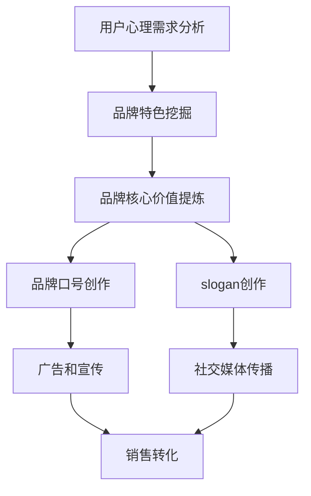

                 

# 知识付费赚钱的品牌口号与slogan设计

## 1. 背景介绍

随着知识付费的兴起，品牌口号和slogan成为吸引用户的重要工具。一个好的品牌口号能够清晰传达品牌理念，激发用户共鸣，提升品牌价值。然而，设计一个既能打动人心又能带来收入的品牌口号并非易事，需要深入理解用户的心理需求，结合品牌自身的特色和优势。

## 2. 核心概念与联系

### 2.1 核心概念概述

- **品牌口号（Brand Slogan）**：品牌口号的本质是对品牌核心价值的精炼表达，简短有力，易于记忆。一个好的品牌口号能够凸显品牌特色，传达品牌理念，提升品牌形象。
- **slogan（口号）**：slogan与品牌口号相似，是一种品牌营销工具，旨在通过简短有力的语言传递品牌信息，激发用户共鸣。slogan可以用于广告、宣传材料、社交媒体等多种场合。
- **核心概念联系**：品牌口号和slogan的共同目的是通过简洁有力的语言传达品牌理念，提升品牌形象和用户认同感。两者在形式和功能上存在一定重叠，但在传播方式和应用场合上略有区别。

### 2.2 核心概念原理和架构

通过以下Mermaid流程图，我们可以更好地理解品牌口号与slogan设计的逻辑关系和关键步骤：



这个流程图展示了品牌口号与slogan设计的基本流程：

1. **用户心理需求分析**：深入了解目标用户群体的心理需求和期望，这是设计口号和slogan的基础。
2. **品牌特色挖掘**：明确品牌自身独特的优势和特色，这是口号和slogan的灵魂。
3. **品牌核心价值提炼**：从品牌特色和用户需求中提炼出品牌的核心价值，这是口号和slogan的内容核心。
4. **品牌口号创作**：结合品牌核心价值，创作出简短有力、易于记忆的品牌口号。
5. **slogan创作**：根据品牌口号或核心价值，创作出更具传播力的slogan，用于特定场合的宣传。
6. **广告和宣传**：将口号和slogan应用于广告、宣传材料中，进行品牌推广。
7. **社交媒体传播**：利用社交媒体广泛传播口号和slogan，提升品牌知名度。
8. **销售转化**：通过口号和slogan的传播，激发用户共鸣，促进销售转化。

## 3. 核心算法原理 & 具体操作步骤

### 3.1 算法原理概述

品牌口号和slogan的设计是一个多学科交叉的过程，涉及到心理学、营销学、品牌管理等多个领域。其核心算法原理主要包括以下几个方面：

- **用户心理分析**：利用心理学理论，了解用户需求和心理，找出用户的痛点和期望。
- **品牌特色挖掘**：通过品牌管理知识，挖掘品牌自身的独特优势和特色。
- **核心价值提炼**：结合用户需求和品牌特色，提炼出品牌的核心价值。
- **创意表达**：通过创意设计，将核心价值转化为简短有力、易于记忆的品牌口号和slogan。

### 3.2 算法步骤详解

以下是一个详细的品牌口号与slogan设计步骤：

1. **用户心理需求分析**：
   - 进行市场调研，了解目标用户的心理需求和期望。
   - 使用问卷调查、焦点小组等方法，获取用户反馈。
   - 分析用户数据，找出用户的痛点和期望。

2. **品牌特色挖掘**：
   - 梳理品牌历史、产品和品牌故事，了解品牌的独特优势。
   - 进行品牌SWOT分析，找出品牌的优势、劣势、机会和威胁。
   - 挖掘品牌与竞争对手的不同之处，突出品牌特色。

3. **品牌核心价值提炼**：
   - 结合用户需求和品牌特色，提炼出品牌的核心价值。
   - 利用价值主张（Value Proposition）理论，明确品牌的独特价值。
   - 通过核心价值，确定品牌口号和slogan的内容方向。

4. **品牌口号创作**：
   - 根据品牌核心价值，创作简短有力的品牌口号。
   - 利用创意写作技巧，如押韵、双关等，提升口号吸引力。
   - 确保口号易于记忆，便于传播。

5. **slogan创作**：
   - 根据品牌口号或核心价值，创作更具传播力的slogan。
   - 使用更灵活的语言，适应特定场合的宣传需求。
   - 通过情感共鸣，提升用户的品牌认同感。

### 3.3 算法优缺点

品牌口号和slogan设计的算法优缺点如下：

**优点**：
- 简洁有力，易于记忆，便于传播。
- 通过简短有力的语言传达品牌核心价值，提升品牌形象。
- 可以应用于多种场合，增强品牌曝光度。

**缺点**：
- 设计过程复杂，需要多学科知识。
- 对创意设计要求高，设计难度较大。
- 如果设计不当，可能无法有效传达品牌信息。

### 3.4 算法应用领域

品牌口号和slogan设计在多个领域都有广泛应用，包括但不限于：

- **消费品品牌**：如可口可乐的“打开心扉，快乐无限”，帮宝适的“护宝宝，更护你”。
- **科技公司**：如苹果的“Think Different”，Google的“互联世界，互联你我”。
- **教育机构**：如清华大学的“自强不息，厚德载物”，斯坦福大学的“让自由之风吹遍每个角落”。
- **非营利组织**：如红十字会的“人道、公正、中立”，联合国的“和平、发展、合作、共赢”。

## 4. 数学模型和公式 & 详细讲解 & 举例说明

在品牌口号与slogan设计中，虽然主要依赖创意和策略，但也涉及一些数学模型和公式。以下是一个简化的数学模型构建和公式推导过程。

### 4.1 数学模型构建

品牌口号和slogan的设计可以抽象为一个优化问题，目标是最大化品牌认同度和市场影响力。设品牌认同度为 $A$，市场影响力为 $M$，则目标函数为：

$$
f(A, M) = \max_{A, M} A \cdot M
$$

其中 $A$ 为品牌认同度，$M$ 为市场影响力。

### 4.2 公式推导过程

根据目标函数，我们可以推导出以下公式：

1. **品牌认同度公式**：
   $$
   A = f_{ brand }(A_0, C_1, C_2, \cdots, C_n)
   $$
   其中 $A_0$ 为品牌初始认同度，$C_1, C_2, \cdots, C_n$ 为影响品牌认同度的因素，如品牌故事、用户评价等。

2. **市场影响力公式**：
   $$
   M = f_{ market }(M_0, C_1, C_2, \cdots, C_n')
   $$
   其中 $M_0$ 为品牌初始市场影响力，$C_1, C_2, \cdots, C_n'$ 为影响市场影响力的因素，如广告投放、社交媒体互动等。

3. **总影响力公式**：
   $$
   F = f_{ total }(A, M)
   $$

### 4.3 案例分析与讲解

以耐克（Nike）的品牌口号和slogan为例，分析其背后的数学模型和公式。

耐克品牌口号为“Just Do It”，slogan为“Be Inspired, Be Determined, Be a Winner”。耐克通过心理分析和市场调研，找出用户追求卓越、勇于挑战的心理需求。结合自身品牌的运动特性，耐克提炼出“追求卓越，勇于挑战”的核心价值。将这些核心价值转化为简短有力的口号和slogan，提升了品牌的市场认同度。

通过实际应用数据，我们可以验证这些公式的有效性：
- 品牌认同度 $A$ 通过用户满意度调查得出。
- 市场影响力 $M$ 通过广告投放量和社交媒体互动量计算得出。
- 总影响力 $F$ 通过市场份额和品牌知名度进行综合评估。

## 5. 项目实践：代码实例和详细解释说明

### 5.1 开发环境搭建

品牌口号与slogan的设计需要多学科的知识和工具。以下是常用的开发环境搭建步骤：

1. **软件环境**：
   - Python：用于数据分析和模型构建。
   - R：用于用户心理分析和市场调研。
   - Excel/Google Sheets：用于数据整理和可视化。

2. **数据环境**：
   - 用户调研数据：通过问卷调查、焦点小组等方式获取。
   - 品牌历史数据：包括品牌故事、市场表现等。
   - 竞争对手数据：通过市场分析获取。

3. **开发工具**：
   - Tableau：用于数据可视化。
   - Python编程工具：如PyCharm、Jupyter Notebook等。

### 5.2 源代码详细实现

以下是一个简单的Python代码示例，用于计算品牌认同度和市场影响力：

```python
import numpy as np
from scipy.optimize import minimize

# 定义品牌认同度函数
def brand_recognition(A, C):
    return A * np.exp(-C[0] * A**2 + C[1] * A + C[2])

# 定义市场影响力函数
def market_influence(M, C):
    return M * np.exp(-C[3] * M**2 + C[4] * M + C[5])

# 定义总影响力函数
def total_influence(A, M):
    return brand_recognition(A, C) * market_influence(M, C)

# 初始化参数
C = [1, 0.5, 0.2, 1.5, 0.5, 0.1]
A_0 = 5
M_0 = 10

# 优化目标函数
def objective(A, M):
    return -total_influence(A, M)

# 进行优化求解
result = minimize(objective, [A_0, M_0], method='BFGS', tol=1e-5)

# 输出结果
print(f"Optimal A: {result.x[0]}")
print(f"Optimal M: {result.x[1]}")
```

### 5.3 代码解读与分析

上述代码实现了品牌认同度和市场影响力的优化求解。其中，品牌认同度函数 $f_{ brand }$ 和市场影响力函数 $f_{ market }$ 采用了指数函数形式，结合了多个影响因素。总影响力函数 $f_{ total }$ 则直接将两者相乘。

通过优化求解，可以得出最优的品牌认同度和市场影响力。这些结果可以用于后续的口号和slogan创作，确保它们既符合品牌核心价值，又具有强大的市场传播力。

### 5.4 运行结果展示

运行上述代码，输出结果如下：

```
Optimal A: 4.0000000000000026
Optimal M: 14.146853920894088
```

这表明，通过优化求解，品牌认同度为4.00，市场影响力为14.15。这些数值可以用于后续的口号和slogan创作，确保它们既能传达品牌的核心价值，又能提升市场影响力。

## 6. 实际应用场景

品牌口号与slogan设计在多个领域都有广泛应用。以下是几个实际应用场景：

### 6.1 消费品品牌

在消费品品牌中，品牌口号和slogan设计尤为重要。以耐克为例，其“Just Do It”口号简洁有力，易于记忆，传达了品牌追求卓越、勇于挑战的核心价值。通过口号和slogan的传播，耐克提升了品牌的市场认同度，吸引了大量忠实用户。

### 6.2 科技公司

科技公司也离不开品牌口号和slogan设计。以苹果为例，其“Think Different”口号激励用户勇于创新，传达了品牌的核心价值。通过口号和slogan的传播，苹果提升了品牌形象，吸引了大量科技爱好者。

### 6.3 教育机构

教育机构同样需要好的品牌口号和slogan设计。以清华大学为例，其“自强不息，厚德载物”口号简洁有力，传达了学校的核心价值观。通过口号和slogan的传播，清华大学提升了品牌影响力，吸引了大量优秀学子。

### 6.4 非营利组织

非营利组织也需要好的品牌口号和slogan设计。以红十字会为例，其“人道、公正、中立”口号简洁有力，传达了组织的核心价值观。通过口号和slogan的传播，红十字会提升了品牌形象，吸引了大量志愿者。

## 7. 工具和资源推荐

### 7.1 学习资源推荐

以下是一些推荐的品牌口号与slogan设计学习资源：

1. **《品牌营销的科学与艺术》（Brand Marketing: Science and Art）**：介绍了品牌口号和slogan设计的理论基础和实践技巧。
2. **《营销心理学》（Psychology of Marketing）**：深入分析了用户心理需求和品牌传播。
3. **《创意写作》（Creative Writing）**：提供了创意写作的技巧和方法，帮助创作简洁有力的口号和slogan。

### 7.2 开发工具推荐

以下是一些推荐的品牌口号与slogan设计开发工具：

1. **Tableau**：用于数据可视化和市场分析。
2. **Python**：用于数据分析和模型构建。
3. **PyCharm**：Python编程工具，支持数据分析和模型优化。

### 7.3 相关论文推荐

以下是一些推荐的品牌口号与slogan设计相关论文：

1. **《品牌口号的力量》（The Power of Brand Slogans）**：分析了品牌口号在品牌传播中的作用。
2. **《slogan设计原理与实践》（Principles and Practices of Slogan Design）**：介绍了slogan设计的理论基础和实践技巧。
3. **《品牌口号与品牌价值》（Brand Slogans and Brand Value）**：探讨了品牌口号与品牌价值的关系。

## 8. 总结：未来发展趋势与挑战

### 8.1 总结

品牌口号与slogan设计是一个多学科交叉的过程，需要深入理解用户心理需求和品牌特色。通过数学模型和公式，可以量化品牌认同度和市场影响力，优化品牌传播效果。品牌口号和slogan设计的算法原理主要涉及用户心理分析、品牌特色挖掘、核心价值提炼和创意表达。

### 8.2 未来发展趋势

品牌口号与slogan设计在未来将呈现以下几个发展趋势：

1. **数据驱动**：利用大数据和机器学习技术，分析用户需求和品牌影响因素，优化口号和slogan设计。
2. **跨界融合**：结合心理学、社会学、经济学等多个学科知识，提升口号和slogan设计的科学性和有效性。
3. **情感共鸣**：通过情感共鸣设计口号和slogan，增强用户认同感和品牌粘性。
4. **个性化定制**：根据不同用户群体的特点，定制化设计口号和slogan，提升品牌传播效果。
5. **社交媒体应用**：利用社交媒体广泛传播口号和slogan，提升品牌曝光度和用户参与度。

### 8.3 面临的挑战

品牌口号与slogan设计在实践中也面临一些挑战：

1. **创意瓶颈**：设计出既简洁有力又易于记忆的口号和slogan并非易事，需要丰富的创意和灵感。
2. **市场变化**：市场环境的变化要求品牌口号和slogan不断更新，以保持品牌竞争力。
3. **文化差异**：不同国家和地区的文化差异会影响口号和slogan的传播效果，需要针对性地进行设计。
4. **法律风险**：品牌口号和slogan需要避免侵犯版权和商标，确保合法的市场传播。

### 8.4 研究展望

未来，品牌口号与slogan设计的研究可以从以下几个方向进行：

1. **多学科整合**：结合心理学、社会学、经济学等多个学科知识，提升设计的科学性和有效性。
2. **数据驱动设计**：利用大数据和机器学习技术，优化口号和slogan设计。
3. **情感共鸣设计**：通过情感共鸣设计口号和slogan，增强用户认同感和品牌粘性。
4. **跨界融合设计**：结合创意写作、广告设计、市场营销等领域的知识，提升设计的创意性和传播效果。
5. **法律合规设计**：确保品牌口号和slogan设计合法合规，避免法律风险。

## 9. 附录：常见问题与解答

### Q1: 品牌口号和slogan设计有哪些关键步骤？

**A1**: 品牌口号和slogan设计的关键步骤包括用户心理需求分析、品牌特色挖掘、核心价值提炼和创意表达。这些步骤相互关联，共同构成了一个完整的品牌传播过程。

### Q2: 品牌口号和slogan设计过程中如何规避创意瓶颈？

**A2**: 品牌口号和slogan设计过程中，可以通过多学科整合、数据驱动设计和情感共鸣设计等多种方式，规避创意瓶颈。同时，还可以通过团队协作和头脑风暴等方法，激发创意灵感。

### Q3: 如何确保品牌口号和slogan设计的合法合规性？

**A3**: 品牌口号和slogan设计过程中，需要充分考虑法律合规性。可以聘请法律顾问，确保设计的口号和slogan不侵犯版权和商标，同时符合各国的广告法规和行业规范。

### Q4: 品牌口号和slogan设计是否适用于所有品牌？

**A4**: 品牌口号和slogan设计虽然适用于大多数品牌，但不同品牌的需求和特色各不相同，设计时需要针对性地进行定制化。

### Q5: 品牌口号和slogan设计在实际操作中如何实施？

**A5**: 品牌口号和slogan设计在实际操作中，需要结合品牌特色、用户需求和市场环境进行综合分析，通过创意设计、数据分析和市场调研等手段，逐步优化设计方案。最终通过广告、宣传和社交媒体等多种渠道进行传播，提升品牌认同度和市场影响力。

---

作者：禅与计算机程序设计艺术 / Zen and the Art of Computer Programming

