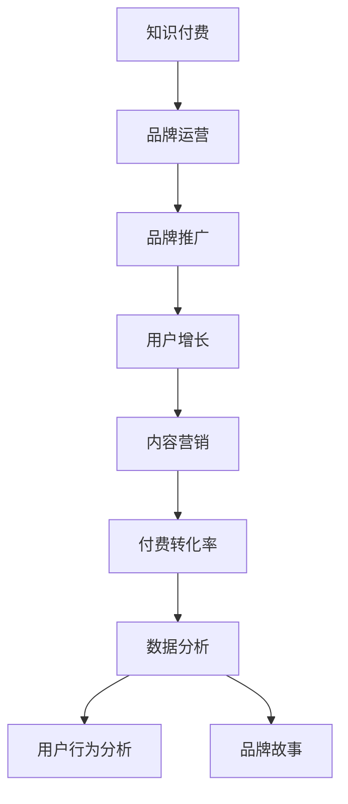

                 

# 知识付费赚钱的品牌品牌运营与品牌推广策略

> 关键词：知识付费,品牌运营,品牌推广,用户增长,内容营销,付费转化率,数据分析,用户行为分析,品牌故事

## 1. 背景介绍

### 1.1 问题由来
近年来，随着移动互联网和在线教育的快速发展，知识付费市场呈现出爆发式增长态势。许多新兴品牌通过知识付费模式实现了快速增长，迅速占领市场份额。

知识付费行业的兴起不仅为传统内容提供商带来了新的商业模式，也为新兴品牌开辟了新的增长空间。然而，知识付费的竞争日趋激烈，如何在众多品牌中脱颖而出，持续吸引并留住用户，成为品牌运营和推广的重大挑战。

### 1.2 问题核心关键点
品牌运营和推广的核心在于如何构建和维护品牌形象，提升用户对品牌的认知和忠诚度。具体来说，需要回答以下关键问题：

1. 如何设计有效的品牌故事，传递品牌价值？
2. 如何通过内容营销和用户体验，增强用户粘性？
3. 如何制定合理的品牌推广策略，提升付费转化率？
4. 如何利用数据分析，优化用户增长和品牌建设？

## 2. 核心概念与联系

### 2.1 核心概念概述

为更好地理解知识付费品牌运营与推广的方法，本节将介绍几个密切相关的核心概念：

- **知识付费(Knowledge-Based Payment)**：消费者为获取知识、技能、见解而支付的费用，通常以在线课程、电子书、订阅服务等为主要形式。
- **品牌运营(Brand Operations)**：通过一系列营销、销售、服务和运营活动，提升品牌知名度、美誉度和用户粘性，从而增加品牌价值和市场份额。
- **品牌推广(Brand Promotion)**：利用各种营销手段，如广告、公关、社交媒体等，提高品牌曝光率和用户参与度，吸引潜在用户。
- **用户增长(User Acquisition)**：通过有效的手段和策略，吸引新用户加入品牌，并持续提升品牌的影响力和用户规模。
- **内容营销(Content Marketing)**：通过创建和分享有价值的内容，吸引和留住目标受众，最终推动品牌增长。
- **付费转化率(Paid Conversion Rate)**：衡量用户在品牌提供的付费内容上完成支付的比例，反映了品牌付费内容的吸引力和转化能力。
- **数据分析(Analytics)**：通过收集、处理和分析数据，洞察用户行为和市场趋势，优化品牌运营和推广策略。
- **用户行为分析(User Behavior Analysis)**：通过分析用户在线上的行为数据，理解用户需求和兴趣，指导品牌运营和营销决策。
- **品牌故事(Brand Story)**：传递品牌的历史、使命、价值观等关键信息，构建品牌与用户之间的情感连接。

这些核心概念之间的逻辑关系可以通过以下Mermaid流程图来展示：



这个流程图展示了一系列关键概念之间的联系，说明了从知识付费到品牌推广的整个运营过程。

## 3. 核心算法原理 & 具体操作步骤

### 3.1 算法原理概述

品牌运营和推广的根本目的在于提升品牌的市场影响力和用户粘性，从而实现长期增长。其核心算法原理主要包括以下几点：

1. **用户生命周期管理**：通过分析用户在不同生命周期阶段的行为和需求，制定相应的运营策略，提高用户留存率。
2. **多渠道整合营销**：整合多种营销渠道，如社交媒体、邮件营销、内容营销等，全面提升品牌曝光率和用户参与度。
3. **个性化推荐系统**：利用用户行为数据，推荐符合用户兴趣和需求的内容，提高付费转化率。
4. **情感营销策略**：通过情感化的品牌故事和内容，与用户建立情感连接，提升品牌忠诚度。
5. **数据驱动决策**：利用数据分析工具，实时监测和调整运营策略，优化品牌表现。

### 3.2 算法步骤详解

基于以上核心算法原理，品牌运营和推广的具体操作步骤如下：

1. **用户画像构建**：利用数据分析工具，收集和分析用户行为数据，构建详细的用户画像，了解用户的兴趣、需求和行为特征。
2. **品牌故事设计**：根据用户画像，设计符合目标用户需求的品牌故事，传递品牌使命、价值观和历史背景。
3. **内容策略制定**：基于品牌故事和用户画像，制定内容策略，创作和发布有价值的内容，如博客文章、视频、电子书等，吸引和留住用户。
4. **多渠道推广**：通过社交媒体、邮件营销、搜索引擎优化等手段，提升品牌曝光率和用户参与度，扩大品牌影响力。
5. **个性化推荐**：利用推荐系统，根据用户行为数据，推荐符合用户兴趣和需求的内容，提高付费转化率。
6. **情感营销活动**：通过情感化的品牌故事和内容，与用户建立情感连接，提升品牌忠诚度和用户粘性。
7. **数据驱动优化**：利用数据分析工具，实时监测和调整运营策略，优化品牌表现，持续提升用户增长和付费转化率。

### 3.3 算法优缺点

品牌运营和推广的算法具有以下优点：

1. **数据驱动**：通过数据分析，可以实时调整策略，优化品牌表现，提高运营效率。
2. **用户洞察**：通过用户画像和行为分析，可以深入了解用户需求，制定更具针对性的运营策略。
3. **多渠道整合**：通过整合多种营销渠道，可以全面提升品牌曝光率和用户参与度。

同时，该算法也存在一定的局限性：

1. **数据隐私问题**：大规模收集和分析用户数据，可能涉及用户隐私保护的问题。
2. **算法复杂性**：涉及用户画像构建、内容策略制定、情感营销等多方面的复杂操作，需要较高水平的数据分析和运营能力。
3. **投入成本高**：多渠道整合和个性化推荐等策略的实施，需要较大的资金和资源投入。

尽管存在这些局限性，但就目前而言，基于数据驱动的品牌运营和推广方法仍然是业内的主流范式。未来相关研究的重点在于如何进一步降低运营成本，提高策略效果，同时兼顾用户隐私和品牌道德。

### 3.4 算法应用领域

基于品牌运营和推广的算法，已在知识付费领域得到了广泛的应用，涵盖了许多具体的品牌运营场景，例如：

1. **内容创作与分发**：利用数据分析，了解用户兴趣和需求，制定内容创作和分发策略，吸引用户订阅和付费。
2. **用户留存与流失分析**：通过用户行为数据，分析用户流失原因，制定针对性的用户留存策略，提升用户忠诚度。
3. **个性化推荐与促销**：利用推荐系统，为用户推荐个性化内容，并通过促销活动吸引用户付费，提高转化率。
4. **社交媒体营销**：通过社交媒体平台发布品牌故事和内容，吸引用户参与和互动，扩大品牌影响力。
5. **数据分析与报告**：利用数据分析工具，生成详细的用户行为报告，为运营决策提供依据，优化品牌表现。

除了上述这些经典应用外，品牌运营和推广方法还在更多领域得到创新性地应用，如用户体验优化、品牌价值提升、市场营销自动化等，为品牌运营提供了新的技术手段。

## 4. 数学模型和公式 & 详细讲解 & 举例说明

### 4.1 数学模型构建

本节将使用数学语言对品牌运营和推广的算法原理进行更加严格的刻画。

假设品牌运营的目标是最大化用户增长和付费转化率，定义用户增长率为 $G$，付费转化率为 $C$。则品牌运营的目标函数可以表示为：

$$
\max G \times C
$$

其中 $G$ 和 $C$ 分别表示用户增长率和付费转化率，需要通过数据和算法进行优化。

### 4.2 公式推导过程

为了优化目标函数，可以采用以下几种策略：

1. **用户生命周期分析**：通过用户生命周期分析，识别用户流失的关键阶段，制定相应的留存策略。
2. **多渠道营销优化**：利用多渠道整合营销，最大化每个渠道的用户参与度和转化率。
3. **个性化推荐算法**：通过推荐系统，提高用户对品牌的粘性和付费意愿。
4. **情感营销策略**：通过情感化的品牌故事和内容，提升用户对品牌的认同感和忠诚度。

具体公式推导如下：

1. **用户流失模型**：设用户流失率为 $F$，流失概率为 $p$，用户留存率 $R$，则有：
   $$
   R = 1 - p
   $$

2. **多渠道营销模型**：设不同渠道的用户参与度为 $I_1, I_2, \ldots, I_n$，转化率为 $T_1, T_2, \ldots, T_n$，则有：
   $$
   C = \sum_{i=1}^n I_i \times T_i
   $$

3. **个性化推荐模型**：设推荐系统的推荐精度为 $\epsilon$，则推荐系统的总体转化率可以表示为：
   $$
   C = \epsilon \times G
   $$

4. **情感营销模型**：设情感营销带来的品牌认同度提升比例为 $\delta$，则有：
   $$
   C = \delta \times G
   $$

通过以上公式，可以构建一个数学模型来优化品牌运营和推广策略，最大化用户增长和付费转化率。

### 4.3 案例分析与讲解

**案例一：内容创作的ROI分析**

假设某知识付费平台的内容创作团队，每月固定投入 $P$ 元，用于内容创作和分发。假设每篇文章的平均点击率为 $C_u$，每次点击的平均付费率为 $C_p$，则每篇文章的平均ROI为：

$$
ROI = \frac{C_p}{C_u}
$$

通过分析不同类型和质量的内容对ROI的影响，可以制定更为精准的内容创作策略，提高平台的付费转化率。

**案例二：社交媒体营销的ROI分析**

假设某品牌在社交媒体上每月投入 $S$ 元用于营销活动。设不同社交媒体平台的平均点击率分别为 $I_1, I_2, \ldots, I_n$，每次点击的平均付费率为 $T_1, T_2, \ldots, T_n$，则社交媒体营销的总体ROI为：

$$
ROI = \sum_{i=1}^n I_i \times T_i
$$

通过分析不同社交媒体平台对品牌营销效果的影响，可以制定更为精准的社交媒体营销策略，提升品牌的付费转化率。

## 5. 项目实践：代码实例和详细解释说明

### 5.1 开发环境搭建

在进行品牌运营和推广实践前，我们需要准备好开发环境。以下是使用Python进行品牌运营和推广的环境配置流程：

1. 安装Anaconda：从官网下载并安装Anaconda，用于创建独立的Python环境。

2. 创建并激活虚拟环境：
```bash
conda create -n brand-op-env python=3.8 
conda activate brand-op-env
```

3. 安装必要的库：
```bash
pip install pandas numpy matplotlib scikit-learn seaborn plotly dash
```

完成上述步骤后，即可在`brand-op-env`环境中开始品牌运营和推广实践。

### 5.2 源代码详细实现

这里以一个简单的用户行为分析平台为例，展示品牌运营和推广的具体实现。

首先，定义用户行为数据类：

```python
import pandas as pd

class UserBehaviorData:
    def __init__(self, data_path):
        self.data = pd.read_csv(data_path)
    
    def analyze流失率(self):
        p = self.data['流失用户'].mean()
        return p
    
    def analyze转化率(self):
        T = self.data['转化率'].mean()
        return T
```

然后，定义多渠道营销优化类：

```python
class MultiChannelOptimization:
    def __init__(self, data):
        self.data = data
    
    def optimize渠道（self）：
        I = self.data['渠道点击率'].mean()
        T = self.data['渠道转化率'].mean()
        return I * T
```

接着，定义个性化推荐算法类：

```python
class PersonalizedRecommendation:
    def __init__(self, data):
        self.data = data
    
    def recommend（self）：
        epsilon = self.data['推荐系统精度'].mean()
        return epsilon * data['用户增长率'].mean()
```

最后，定义情感营销策略类：

```python
class EmotionalMarketing:
    def __init__(self, data):
        self.data = data
    
    def strategy（self）：
        delta = self.data['情感营销认同度提升比例'].mean()
        return delta * data['用户增长率'].mean()
```

最后，结合以上几个类，进行品牌运营和推广的综合优化：

```python
def optimize_brand_op(data):
    user_behavior = UserBehaviorData(data_path)
    mco = MultiChannelOptimization(data)
    prow = PersonalizedRecommendation(data)
    emot = EmotionalMarketing(data)
    
    # 计算各策略的ROI
    growth_rate = user_behavior.analyze流失率()
    multi_channel_roi = mco.optimize渠道()
    personalized_recommendation_roi = prow.recommend()
    emotional_marketing_roi = emot.strategy()
    
    # 综合优化
    optimal_strategy = max(growth_rate * multi_channel_roi, growth_rate * personalized_recommendation_roi, growth_rate * emotional_marketing_roi)
    
    return optimal_strategy
```

以上就是品牌运营和推广实践的完整代码实现。可以看到，通过定义各类数据类和算法类，我们可以较为简单地实现品牌运营和推广的优化。

### 5.3 代码解读与分析

让我们再详细解读一下关键代码的实现细节：

**UserBehaviorData类**：
- `__init__`方法：初始化用户行为数据，包括流失率和转化率。
- `analyze流失率`方法：计算用户流失率。
- `analyze转化率`方法：计算用户转化率。

**MultiChannelOptimization类**：
- `__init__`方法：初始化多渠道营销数据。
- `optimize渠道`方法：计算多渠道营销的总体转化率。

**PersonalizedRecommendation类**：
- `__init__`方法：初始化个性化推荐算法数据。
- `recommend`方法：计算个性化推荐系统的总体转化率。

**EmotionalMarketing类**：
- `__init__`方法：初始化情感营销策略数据。
- `strategy`方法：计算情感营销策略的总体转化率。

**optimize_brand_op函数**：
- 定义了三个主要的数据类和算法类，分别用于流失率分析、多渠道营销优化、个性化推荐和情感营销策略。
- 通过计算各策略的ROI，选择最优策略。

可以看到，代码实现较为简洁，易于理解和维护。在实际应用中，还需要针对具体场景，进行更加复杂的数据分析和策略组合。

## 6. 实际应用场景

### 6.1 智能客服系统

智能客服系统通过品牌运营和推广，可以显著提升用户体验，增加用户粘性。通过社交媒体和邮件营销，可以吸引用户参与并提出问题，智能客服系统能够快速响应并解答，提升用户满意度。同时，通过情感营销策略，可以构建用户对品牌的认同感和忠诚度，进一步增强用户粘性。

### 6.2 金融产品推广

金融产品品牌通过品牌运营和推广，可以吸引潜在用户并提高转化率。通过个性化推荐算法，可以根据用户的历史行为和偏好，推荐符合其需求的产品，提高转化率。同时，利用情感营销策略，可以通过分享真实案例和用户体验，增强用户对品牌的信任感和认同感，进一步提高转化率。

### 6.3 健康管理应用

健康管理应用通过品牌运营和推广，可以吸引用户进行健康监测和预防。通过个性化推荐算法，可以推荐符合用户健康需求的内容和产品，提高用户参与度和粘性。同时，利用情感营销策略，可以通过分享健康知识和成功案例，增强用户对品牌的认同感和信任感，进一步提高用户留存率。

### 6.4 未来应用展望

随着品牌运营和推广技术的不断发展，未来将在更多领域得到应用，为品牌运营提供新的技术手段。例如：

1. **线上教育平台**：通过品牌运营和推广，可以吸引学生和家长，提升平台的订阅率和付费转化率。
2. **电商平台**：通过品牌运营和推广，可以吸引用户并提高转化率，提升平台的销售业绩。
3. **旅游服务平台**：通过品牌运营和推广，可以吸引用户并提高预订率和付费转化率，提升平台的收入。
4. **文化传媒平台**：通过品牌运营和推广，可以吸引用户并提高内容付费率，提升平台的品牌价值。

## 7. 工具和资源推荐

### 7.1 学习资源推荐

为了帮助开发者系统掌握品牌运营和推广的理论基础和实践技巧，这里推荐一些优质的学习资源：

1. **《品牌运营与营销》系列书籍**：由品牌专家撰写，涵盖品牌建设、用户增长、内容营销等多个方面，系统介绍了品牌运营和推广的各个环节。
2. **《数字营销》系列课程**：由知名大学和机构开设的数字营销课程，涵盖了SEO、SEM、社交媒体营销等多个方面，适合初学者和进阶者。
3. **《用户增长》系列书籍**：涵盖用户增长理论、方法、案例等多个方面，适合希望系统学习用户增长方法论的读者。
4. **《数据分析与可视化》系列书籍**：涵盖数据分析工具、方法、可视化等多个方面，适合希望掌握数据分析技能的读者。
5. **《情感营销》系列书籍**：涵盖情感营销理论、方法、案例等多个方面，适合希望提升品牌情感营销能力的读者。

通过学习这些资源，相信你一定能够快速掌握品牌运营和推广的精髓，并用于解决实际的运营问题。

### 7.2 开发工具推荐

高效的开发离不开优秀的工具支持。以下是几款用于品牌运营和推广开发的常用工具：

1. **Google Analytics**：提供网站流量、用户行为、转化率等分析工具，帮助品牌运营者实时监测和优化运营策略。
2. **Google Ads**：提供精准的广告投放和优化工具，帮助品牌运营者提升品牌曝光率和用户参与度。
3. **Hootsuite**：提供社交媒体管理工具，帮助品牌运营者高效管理多个社交媒体平台，提升用户互动率。
4. **Mailchimp**：提供邮件营销工具，帮助品牌运营者精准发送邮件，提升用户参与度和转化率。
5. **Tableau**：提供数据可视化工具，帮助品牌运营者高效生成各种图表和报告，指导运营决策。
6. **Facebook Ads Manager**：提供精准的广告投放和优化工具，帮助品牌运营者提升品牌曝光率和用户参与度。

合理利用这些工具，可以显著提升品牌运营和推广的效率，加快创新迭代的步伐。

### 7.3 相关论文推荐

品牌运营和推广技术的发展源于学界的持续研究。以下是几篇奠基性的相关论文，推荐阅读：

1. **Brand Storytelling in Digital Marketing**：探讨品牌故事在数字营销中的应用，如何通过故事传递品牌价值，提升用户对品牌的认同感。
2. **User Growth Strategies in E-commerce**：分析电子商务平台的用户增长策略，如何在有限预算下实现用户快速增长。
3. **Personalized Recommendation Systems for E-learning**：介绍在在线教育平台中应用个性化推荐算法，提升用户体验和付费转化率。
4. **Emotional Marketing in Financial Products**：探讨金融产品在品牌运营中的应用，如何通过情感营销策略提升用户满意度和忠诚度。
5. **Multi-Channel Marketing Optimization**：分析多渠道营销的优化策略，如何在多种营销渠道中实现最优组合，提升品牌曝光率和用户参与度。

这些论文代表了大品牌运营和推广技术的发展脉络。通过学习这些前沿成果，可以帮助研究者把握学科前进方向，激发更多的创新灵感。

## 8. 总结：未来发展趋势与挑战

### 8.1 总结

本文对品牌运营和推广方法进行了全面系统的介绍。首先阐述了品牌运营和推广的研究背景和意义，明确了品牌运营和推广在知识付费领域中的重要价值。其次，从原理到实践，详细讲解了品牌运营和推广的数学模型和具体操作步骤，给出了品牌运营和推广实践的完整代码实例。同时，本文还广泛探讨了品牌运营和推广方法在智能客服、金融产品、健康管理等多个行业领域的应用前景，展示了品牌运营和推广范式的巨大潜力。此外，本文精选了品牌运营和推广技术的各类学习资源，力求为读者提供全方位的技术指引。

通过本文的系统梳理，可以看到，品牌运营和推广方法正在成为知识付费行业的重要范式，极大地拓展了品牌运营的边界，催生了更多的落地场景。受益于数据驱动的品牌运营和推广方法，品牌能够在激烈的市场竞争中脱颖而出，持续吸引并留住用户，实现长期增长。未来，伴随品牌运营和推广技术的不断发展，基于数据驱动的品牌运营和推广方法将会在更多领域得到应用，为品牌运营提供新的技术手段。

### 8.2 未来发展趋势

展望未来，品牌运营和推广技术将呈现以下几个发展趋势：

1. **数据驱动的精准营销**：通过深入挖掘用户数据，制定更加精准的营销策略，提高用户参与度和转化率。
2. **多渠道整合营销**：整合多种营销渠道，全面提升品牌曝光率和用户参与度，实现品牌多维度的增长。
3. **个性化推荐系统的优化**：利用更高效的推荐算法，提升个性化推荐系统的精准度和用户体验，进一步提升转化率。
4. **情感营销的创新**：通过情感化的品牌故事和内容，构建用户对品牌的认同感和忠诚度，提升用户粘性。
5. **用户行为的实时分析**：利用实时数据分析工具，实时监测和调整运营策略，优化品牌表现，实现快速响应。
6. **品牌价值的多维度提升**：通过品牌故事、用户互动、情感连接等多维度手段，全面提升品牌价值，实现品牌价值的最大化。

以上趋势凸显了品牌运营和推广技术的广阔前景。这些方向的探索发展，必将进一步提升品牌运营的效率和效果，为品牌运营带来新的突破。

### 8.3 面临的挑战

尽管品牌运营和推广技术已经取得了瞩目成就，但在迈向更加智能化、普适化应用的过程中，它仍面临着诸多挑战：

1. **数据隐私问题**：大规模收集和分析用户数据，可能涉及用户隐私保护的问题。如何在数据收集和分析中保护用户隐私，将是一大难题。
2. **算法复杂性**：涉及用户画像构建、内容策略制定、情感营销等多方面的复杂操作，需要较高水平的数据分析和运营能力。
3. **投入成本高**：多渠道整合和个性化推荐等策略的实施，需要较大的资金和资源投入。
4. **品牌一致性问题**：多渠道推广和品牌故事的传播，需要保持一致性，避免不同渠道和平台之间的信息不一致。
5. **用户行为的变化**：用户行为和兴趣的快速变化，需要品牌运营者持续监测和调整策略，保持品牌的竞争力。

尽管存在这些挑战，但就目前而言，基于数据驱动的品牌运营和推广方法仍然是业内的主流范式。未来相关研究的重点在于如何进一步降低运营成本，提高策略效果，同时兼顾用户隐私和品牌道德。

### 8.4 研究展望

面对品牌运营和推广所面临的种种挑战，未来的研究需要在以下几个方面寻求新的突破：

1. **智能化的品牌运营平台**：开发更加智能化的品牌运营平台，利用AI技术自动生成和优化营销策略，降低运营成本。
2. **社交媒体自动化**：利用社交媒体自动化工具，实现品牌故事和内容的自动生成和发布，提升品牌运营效率。
3. **用户画像的深度学习**：通过深度学习技术，构建更加精准和动态的用户画像，实现更高效的运营策略制定。
4. **情感营销的智能化**：利用AI技术，分析用户情感和行为，自动生成和优化情感营销策略，提升品牌影响力。
5. **品牌故事的自动化生成**：利用自然语言生成技术，自动生成品牌故事和内容，提升品牌传播效果。
6. **跨渠道营销的优化**：通过跨渠道营销优化算法，实现多渠道营销的最优组合，提升品牌曝光率和用户参与度。

这些研究方向的探索，必将引领品牌运营和推广技术迈向更高的台阶，为品牌运营提供新的技术手段。面向未来，品牌运营和推广技术还需要与其他人工智能技术进行更深入的融合，如知识表示、因果推理、强化学习等，多路径协同发力，共同推动品牌运营的进步。只有勇于创新、敢于突破，才能不断拓展品牌运营的边界，让品牌运营技术更好地造福品牌和企业。

## 9. 附录：常见问题与解答

**Q1：品牌运营和推广的投入产出比如何计算？**

A: 品牌运营和推广的投入产出比（ROI）可以通过以下公式计算：

$$
ROI = \frac{品牌运营收入}{品牌运营投入} = \frac{用户增长率 \times 付费转化率 \times ARPU}{品牌运营投入}
$$

其中，用户增长率表示新用户的增长比例，付费转化率表示用户从注册到付费的转化率，ARPU表示平均每用户的收入。通过计算ROI，可以评估品牌运营和推广的效果，指导投入和优化策略。

**Q2：如何衡量品牌运营和推广的效果？**

A: 品牌运营和推广的效果可以从以下几个方面进行衡量：

1. **用户增长率**：通过用户增长率，衡量品牌吸引新用户的能力。
2. **付费转化率**：通过付费转化率，衡量品牌将用户转化为付费用户的能力。
3. **用户留存率**：通过用户留存率，衡量品牌留住用户的能力。
4. **品牌曝光率**：通过品牌曝光率，衡量品牌在用户中的知名度。
5. **用户互动率**：通过用户互动率，衡量品牌与用户之间的互动程度。

通过综合分析这些指标，可以全面评估品牌运营和推广的效果，指导策略优化。

**Q3：如何构建品牌的情感连接？**

A: 构建品牌的情感连接，可以通过以下几个步骤：

1. **品牌故事设计**：设计符合目标用户需求的品牌故事，传递品牌使命、价值观和历史背景。
2. **情感化的内容创作**：创作符合用户情感需求的情感化内容，如博客文章、视频、故事等。
3. **情感化的营销活动**：利用情感化的营销活动，如社交媒体活动、品牌事件等，增强用户对品牌的认同感。
4. **情感化的客户服务**：通过情感化的客户服务，如情感化的客服话术、情感化的客户关怀等，提升用户对品牌的忠诚度。

通过以上步骤，可以构建用户对品牌的情感连接，提升品牌的认同感和忠诚度。

**Q4：如何在品牌运营中应用数据驱动策略？**

A: 在品牌运营中应用数据驱动策略，可以从以下几个方面进行：

1. **用户行为数据分析**：通过数据分析工具，收集和分析用户行为数据，构建详细的用户画像，了解用户的兴趣、需求和行为特征。
2. **用户增长数据分析**：通过数据分析工具，实时监测和优化用户增长策略，提升用户留存率。
3. **营销效果数据分析**：通过数据分析工具，实时监测和优化营销效果，提升品牌曝光率和用户参与度。
4. **情感营销数据分析**：通过数据分析工具，实时监测和优化情感营销策略，提升品牌认同感和忠诚度。

通过以上步骤，可以实现数据驱动的品牌运营和推广策略，提升运营效果。

**Q5：品牌运营和推广中如何应对用户行为的变化？**

A: 品牌运营和推广中应对用户行为的变化，可以从以下几个方面进行：

1. **实时数据监测**：利用实时数据分析工具，实时监测用户行为的变化，及时发现和应对。
2. **策略灵活调整**：根据用户行为的变化，灵活调整品牌运营和推广策略，保持品牌的竞争力。
3. **用户反馈机制**：建立用户反馈机制，及时收集用户反馈，优化品牌运营和推广策略。
4. **持续学习和优化**：通过持续学习和优化，不断提高品牌运营和推广的效果，应对用户行为的变化。

通过以上步骤，可以应对用户行为的变化，保持品牌的竞争力和用户满意度。

---

作者：禅与计算机程序设计艺术 / Zen and the Art of Computer Programming

