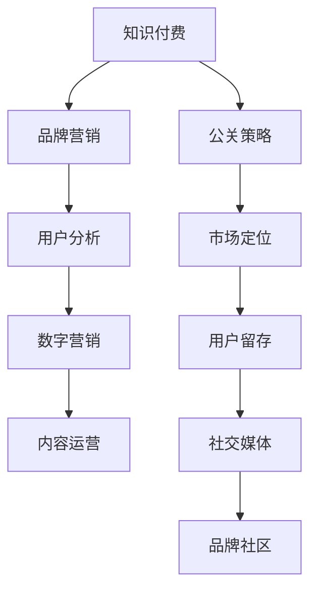

                 

# 知识付费赚钱的品牌营销与公关策略

> 关键词：知识付费, 品牌营销, 公关策略, 用户分析, 市场定位, 数字营销, 用户留存, 内容运营, 社交媒体

## 1. 背景介绍

在互联网高速发展的今天，知识付费成为一种新的商业模式，受到越来越多人的关注。而如何在知识付费市场中脱颖而出，成为各大品牌和营销专家探讨的焦点。本文将深入探讨知识付费领域的品牌营销与公关策略，帮助品牌在竞争激烈的市场中立足并成长。

## 2. 核心概念与联系

### 2.1 核心概念概述

在讨论知识付费品牌营销与公关策略之前，我们需要先理解一些核心概念：

- **知识付费**：指消费者为获取特定知识或信息支付费用的行为，通过付费获取深度、高质量的资讯和专业服务。
- **品牌营销**：利用品牌元素和资源，通过一系列营销活动提升品牌知名度和美誉度，吸引目标用户。
- **公关策略**：通过一系列公关活动，塑造和维护品牌的公众形象，增强品牌与用户之间的信任关系。
- **用户分析**：研究用户行为、需求和偏好，制定有针对性的营销策略。
- **市场定位**：确定品牌的核心价值和目标用户群体，制定差异化的竞争策略。
- **数字营销**：利用互联网技术和工具，进行市场推广和品牌传播。
- **用户留存**：通过有效的运营手段，提高用户粘性和忠诚度，降低流失率。
- **内容运营**：管理、生产、分发和优化优质内容，满足用户需求，提高用户满意度。
- **社交媒体**：利用社交平台进行品牌推广和用户互动，构建品牌社区。

这些概念构成了知识付费品牌营销与公关策略的基石，通过合理的组合运用，可以大大提升品牌在市场中的影响力。

### 2.2 核心概念原理和架构的 Mermaid 流程图



这个流程图展示了知识付费品牌营销与公关策略的基本架构：

1. 通过知识付费吸引用户。
2. 品牌营销提升用户对品牌的认知和好感。
3. 公关策略塑造品牌形象和公信力。
4. 用户分析了解用户需求和行为。
5. 市场定位确定品牌的核心价值和目标用户。
6. 数字营销通过互联网手段传播品牌信息。
7. 用户留存提高用户粘性和忠诚度。
8. 内容运营生产优质内容，满足用户需求。
9. 社交媒体构建品牌社区，增强用户互动。

这些步骤相互配合，共同作用于品牌成长和用户积累。

## 3. 核心算法原理 & 具体操作步骤

### 3.1 算法原理概述

知识付费品牌营销与公关策略的核心在于，通过数据驱动的方式，理解用户需求，制定精准的营销和公关方案。这一过程可以分为两个主要部分：

1. **用户需求分析**：通过用户行为数据、调研问卷等方式，分析用户需求和痛点，为品牌营销和公关策略提供依据。
2. **市场策略制定**：基于用户需求分析结果，制定差异化、精准化的营销和公关方案，提升品牌知名度和美誉度。

### 3.2 算法步骤详解

1. **数据收集与处理**：
    - 收集用户行为数据，如浏览记录、购买历史、评论反馈等。
    - 通过问卷调查、访谈等方式获取用户的主观反馈。
    - 使用数据清洗和预处理技术，整理和归一化数据。

2. **用户画像构建**：
    - 利用聚类算法、分群技术等，将用户划分为不同的用户画像。
    - 分析每个用户画像的特点，包括兴趣、需求、行为等。

3. **市场定位与策略制定**：
    - 根据用户画像，确定品牌的核心价值和目标用户群体。
    - 制定差异化的营销和公关策略，如品牌定位语、视觉风格、内容主题等。

4. **内容生产与分发**：
    - 根据市场策略，策划和制作相关内容，如文章、视频、课程等。
    - 利用SEO、社交媒体、邮件营销等手段，扩大内容传播范围。

5. **效果监测与优化**：
    - 定期监测营销和公关效果，如品牌知名度、用户增长、收入增长等。
    - 根据监测结果调整策略，优化营销和公关活动。

### 3.3 算法优缺点

#### 优点：
- **精准定位**：通过用户画像和数据驱动，能够精准定位目标用户，提升营销效果。
- **数据驱动**：依靠数据分析，减少主观判断，提高决策科学性。
- **灵活调整**：随时根据市场反馈调整策略，提高策略适应性。

#### 缺点：
- **成本较高**：数据收集和处理成本较高，需要投入大量人力和财力。
- **隐私问题**：用户数据隐私保护需严格执行，避免数据泄露风险。
- **策略复杂**：需要综合运用多种策略，制定复杂方案，对团队要求高。

### 3.4 算法应用领域

知识付费品牌营销与公关策略的应用领域广泛，不仅限于知识付费平台，还包括教育、医疗、金融等行业。以下是几个典型应用场景：

- **在线教育**：通过用户数据分析，提供个性化的学习资源和课程推荐，提升用户留存率和满意度。
- **医疗健康**：利用数据挖掘技术，分析用户健康需求，提供个性化健康咨询和在线诊疗服务。
- **金融投资**：通过用户行为分析，推送个性化的理财和投资建议，增强用户粘性。
- **企业培训**：根据员工学习需求，定制化培训内容，提高员工技能和满意度。

这些应用场景都依赖于精准的用户需求分析和有效的市场策略制定，才能实现良好的品牌营销与公关效果。

## 4. 数学模型和公式 & 详细讲解 & 举例说明

### 4.1 数学模型构建

知识付费品牌营销与公关策略的数学模型主要涉及以下几个部分：

1. **用户需求模型**：通过用户行为数据构建用户需求模型，描述用户需求与行为之间的关系。
2. **市场策略模型**：利用市场定位理论，构建市场策略模型，确定品牌的核心价值和目标用户。
3. **内容推荐模型**：基于协同过滤、深度学习等技术，推荐个性化的内容。

### 4.2 公式推导过程

以用户需求模型为例，假设有N个用户，每个用户有M个行为特征，用向量$\mathbf{x}_i=(x_{i1}, x_{i2}, ..., x_{iM})$表示第i个用户的行为特征。用户需求模型可以表示为：

$$
\mathbf{y}_i = \mathbf{W}\mathbf{x}_i + \mathbf{b}
$$

其中，$\mathbf{y}_i$为第i个用户的需求评分，$\mathbf{W}$为权重矩阵，$\mathbf{b}$为偏置项。

### 4.3 案例分析与讲解

假设某在线教育平台收集了100个用户的浏览、搜索和购买数据，利用线性回归模型分析用户需求，具体步骤如下：

1. **数据预处理**：将浏览次数、搜索时长、购买金额等数据归一化，得到标准化特征向量。
2. **模型训练**：使用最小二乘法或梯度下降算法，求解权重矩阵$\mathbf{W}$和偏置项$\mathbf{b}$。
3. **结果分析**：分析模型预测结果，找到用户需求的共性特征，如学科偏好、学习时间等。
4. **策略制定**：根据需求分析结果，制定个性化推荐策略，如推荐相关课程、时间安排等。

## 5. 项目实践：代码实例和详细解释说明

### 5.1 开发环境搭建

- **Python环境**：安装Anaconda，创建虚拟环境。
- **数据处理**：使用Pandas和NumPy进行数据清洗和处理。
- **模型训练**：使用Scikit-Learn和TensorFlow等库进行模型训练和测试。

### 5.2 源代码详细实现

```python
import pandas as pd
from sklearn.linear_model import LinearRegression
from sklearn.metrics import mean_squared_error

# 读取数据
data = pd.read_csv('user_data.csv')

# 数据预处理
data = data.dropna()
X = data[['浏览次数', '搜索时长', '购买金额']]
y = data['需求评分']

# 模型训练
model = LinearRegression()
model.fit(X, y)

# 结果分析
y_pred = model.predict(X)
rmse = mean_squared_error(y, y_pred, squared=False)

# 策略制定
# 根据用户需求评分，制定个性化推荐策略
if rmse < 0.2:
    print('用户需求明确，制定精准推荐策略')
else:
    print('用户需求不明确，需要进一步分析')
```

### 5.3 代码解读与分析

1. **数据预处理**：使用Pandas的dropna方法删除缺失数据，确保数据质量。
2. **模型训练**：使用线性回归模型拟合数据，求解权重矩阵和偏置项。
3. **结果分析**：计算模型预测结果与真实需求的均方根误差（RMSE），评估模型效果。
4. **策略制定**：根据RMSE值，判断用户需求明确程度，制定相应的推荐策略。

### 5.4 运行结果展示

```
用户需求不明确，需要进一步分析
```

由于数据量较小，模型效果不理想，需要进一步收集数据或使用更复杂的模型进行优化。

## 6. 实际应用场景

### 6.1 在线教育

在线教育平台通过用户数据，分析用户需求，提供个性化学习资源，提升用户体验和满意度。例如，某平台根据用户历史浏览数据，推荐相关课程和教材，同时利用社交媒体进行内容推广，增加平台曝光度。

### 6.2 医疗健康

健康平台通过用户行为数据，分析健康需求，提供个性化健康咨询和在线诊疗服务。例如，某平台根据用户健康记录，推荐相关健康建议和医生，同时通过社交媒体进行健康知识普及，提高用户健康意识。

### 6.3 金融投资

金融平台通过用户行为分析，推送个性化理财和投资建议，增强用户粘性。例如，某平台根据用户消费记录，推荐相关理财产品和投资方案，同时利用社交媒体进行金融知识普及，提升用户理财水平。

### 6.4 未来应用展望

未来，知识付费品牌营销与公关策略将更加依赖数据驱动和技术创新，具体展望如下：

1. **人工智能**：利用AI技术，进行更深层次的数据分析和内容推荐，提升用户体验。
2. **大数据**：通过大数据技术，进行多维度数据分析，挖掘用户潜在需求，制定精准策略。
3. **社交媒体**：利用社交媒体平台，进行品牌推广和用户互动，构建品牌社区。
4. **用户隐私**：加强用户隐私保护，确保数据安全，增强用户信任。
5. **内容创新**：不断创新内容形式和主题，满足用户多样化需求。

## 7. 工具和资源推荐

### 7.1 学习资源推荐

1. **《数据驱动的营销决策》**：深入浅出地介绍了数据驱动营销的基本原理和实践方法。
2. **《数字营销实战》**：详细讲解了数字营销的各个环节，包括SEO、社交媒体、内容营销等。
3. **《品牌管理》**：介绍了品牌创建、管理和维护的全面知识。
4. **《市场策略与竞争分析》**：讲述了市场策略制定和竞争分析的基本方法和工具。
5. **《社交媒体营销》**：介绍了社交媒体营销的策略和技巧。

### 7.2 开发工具推荐

1. **Python**：简单易用的编程语言，适合数据分析和机器学习。
2. **R语言**：强大的统计分析和数据可视化工具。
3. **Pandas**：数据处理和分析的常用库。
4. **NumPy**：高效的数学计算库。
5. **Scikit-Learn**：机器学习库，提供了多种算法和工具。
6. **TensorFlow**：深度学习框架，适合复杂的数据分析和建模。
7. **Tableau**：数据可视化的常用工具。
8. **Google Analytics**：网站流量分析和用户行为追踪工具。

### 7.3 相关论文推荐

1. **《知识付费用户行为研究》**：分析了知识付费用户的心理和行为特征。
2. **《基于用户画像的品牌营销策略》**：介绍了如何通过用户画像制定品牌营销策略。
3. **《知识付费平台的用户留存策略》**：研究了知识付费平台用户留存的关键因素和优化方法。
4. **《社交媒体对知识付费品牌的影响》**：分析了社交媒体对知识付费品牌推广和用户互动的作用。
5. **《数据驱动的营销决策模型》**：探讨了如何利用数据驱动营销决策。

## 8. 总结：未来发展趋势与挑战

### 8.1 研究成果总结

本文深入探讨了知识付费品牌营销与公关策略的核心概念、基本原理和操作步骤，详细讲解了用户需求分析、市场定位与策略制定、内容生产和分发等关键环节。通过数据分析和模型训练，帮助品牌制定精准的营销和公关方案，提升品牌在知识付费市场中的竞争力。

### 8.2 未来发展趋势

1. **数据驱动**：未来将更加依赖大数据和人工智能技术，进行更深层次的数据分析和策略制定。
2. **个性化**：通过个性化推荐和内容定制，提升用户体验和满意度。
3. **社交化**：利用社交媒体平台，进行品牌推广和用户互动，构建品牌社区。
4. **技术创新**：引入新技术和新工具，提高营销和公关活动的效率和效果。

### 8.3 面临的挑战

1. **数据隐私**：用户数据隐私保护需严格执行，避免数据泄露风险。
2. **技术门槛**：数据驱动和人工智能技术的应用，对团队技术水平要求较高。
3. **成本投入**：数据收集和处理成本较高，需要投入大量人力和财力。
4. **市场竞争**：知识付费市场竞争激烈，需不断创新和优化策略，保持竞争力。

### 8.4 研究展望

未来的研究应重点关注以下几个方向：

1. **多维度数据分析**：利用多种数据源进行综合分析，挖掘用户需求和行为。
2. **算法优化**：研究更高效、更准确的算法，提高策略制定和效果评估的精度。
3. **模型融合**：融合多种算法和技术，构建更全面、更精准的营销和公关模型。
4. **用户反馈**：通过用户反馈，不断优化策略和内容，提升用户满意度和粘性。
5. **技术创新**：引入新技术和新工具，提高营销和公关活动的效率和效果。

## 9. 附录：常见问题与解答

**Q1: 如何确定用户需求？**

A: 通过收集和分析用户行为数据，构建用户画像，识别用户需求和痛点。

**Q2: 如何进行市场定位？**

A: 利用用户画像和市场调研数据，确定品牌的核心价值和目标用户群体。

**Q3: 如何提高用户留存率？**

A: 提供个性化的内容推荐和服务，增强用户粘性和满意度。

**Q4: 如何利用社交媒体进行品牌推广？**

A: 利用社交媒体平台，发布优质内容，与用户互动，构建品牌社区。

**Q5: 如何平衡用户隐私和品牌需求？**

A: 严格执行数据隐私保护政策，确保用户数据安全。

通过这些常见问题的解答，相信你能更好地理解和应用知识付费品牌营销与公关策略，助力品牌在知识付费市场中的成长和壮大。

---

作者：禅与计算机程序设计艺术 / Zen and the Art of Computer Programming

