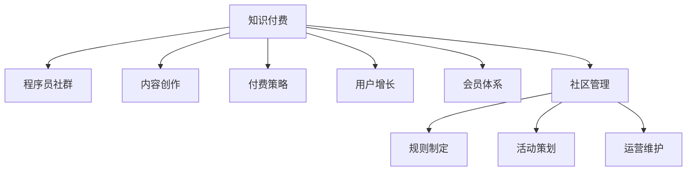

                 

# 知识付费：程序员的社群运营技巧

> 关键词：知识付费, 程序员, 社群运营, 社区管理, 用户增长, 会员体系, 内容创作, 付费策略

## 1. 背景介绍

### 1.1 问题由来

在知识付费时代，如何有效运营程序员社群，吸引更多优质成员，并持续提供有价值的内容，已经成为每一个社区管理者的重要任务。传统的内容分发机制无法满足程序员高密度、专业化的知识需求，因此，建立知识付费型的程序员社群，成为了一个不错的选择。

然而，如何构建一个成功的知识付费社区，并在其中实现良好的运营和管理，并非易事。这不仅需要对内容、产品、市场、运营等方面有深入的理解，还需要具备独特的社群运营技巧。本文将从知识付费社区的构建和运营角度，分享一些实用的社群运营技巧和策略。

### 1.2 问题核心关键点

本文将围绕以下核心问题展开：

1. **如何吸引并保留程序员用户**：程序员社群通常对内容质量有高要求，如何通过高质量的内容吸引用户，并让他们持续关注社区，是社群运营的关键。
2. **构建有效的内容生态**：程序员社群的内容创作具有高度专业性，如何构建一个高效的内容创作机制，确保社区内容不断更新，并与用户需求保持一致，是社群运营的重点。
3. **实现可持续的商业变现**：知识付费社群的成功运营离不开商业变现，如何通过合理的付费策略和会员体系，实现社区的可持续发展，是社群运营的目标。
4. **建立健康的社区文化**：健康的社区文化能够促进用户间的互动和分享，提高社区活跃度。如何构建和维护一个积极、活跃、专业的社区文化，是社群运营的重要考量。

这些核心问题构成了知识付费程序员社群运营的基础框架，明确了社区管理者的主要任务和目标。

### 1.3 问题研究意义

随着知识付费市场的蓬勃发展，程序员社群的知识付费模式也逐渐兴起。成功的社区不仅能够吸引和保留高质量用户，还能够在社区内形成正向循环，实现内容创作和商业变现的双赢。通过深入研究社群运营技巧，可以帮助社区管理者有效应对运营挑战，提升社区价值，推动知识付费市场的进一步发展。

## 2. 核心概念与联系

### 2.1 核心概念概述

为更好地理解知识付费程序员社群的运营技巧，本节将介绍几个密切相关的核心概念：

- **知识付费**：指通过向用户提供高质量、有价值的内容，满足其专业需求，并收取相应费用的模式。知识付费强调内容的质量和用户需求的匹配，而非单纯的内容输出。
- **程序员社群**：由对编程、计算机科学等领域有共同兴趣和需求的程序员组成的线上或线下交流社区。
- **社区管理**：指通过制定规则、策划活动、运营维护等手段，提升社群的活跃度、粘性和价值，以实现社区的目标和使命。
- **内容创作**：指社区成员根据自身专业背景和兴趣，创作有价值、有深度的技术文章、视频、项目分享等内容。
- **付费策略**：指社区在内容付费、会员服务、广告合作等方面的策略设计，目的是实现社区的可持续发展和商业变现。
- **用户增长**：指通过有效的营销、推广、活动策划等手段，吸引更多高质量用户加入社区的过程。
- **会员体系**：指社区为优质用户提供的一系列特权和服务，如专属课程、优先问题解答、技术交流机会等，以增强用户的归属感和满意度。

这些核心概念之间的逻辑关系可以通过以下Mermaid流程图来展示：



这个流程图展示了知识付费、程序员社群、内容创作、付费策略、用户增长、会员体系和社区管理之间的联系：

1. 知识付费是程序员社群的核心运营模式。
2. 内容创作是知识付费的基础，内容质量直接影响用户留存和付费意愿。
3. 付费策略是社区可持续发展的保障。
4. 用户增长是社区规模扩大的关键。
5. 会员体系是社区深度运营的手段。
6. 社区管理是整体运营的基础，涵盖规则制定、活动策划、运营维护等多个方面。

这些概念共同构成了知识付费程序员社群运营的核心框架，有助于理解和管理社区。

## 3. 核心算法原理 & 具体操作步骤
### 3.1 算法原理概述

知识付费程序员社群的运营，本质上是一个复杂的多变量优化问题。其核心思想是通过用户需求和内容质量的匹配，吸引用户并实现商业变现。

具体而言，社群运营的优化目标可以定义为：

$$
\max_{X} \left(\sum_{i=1}^{n} u_i(x_i) - c(x_i)\right)
$$

其中，$X$ 表示社群运营的相关变量，包括内容质量、用户数量、付费策略、活动效果等；$u_i(x_i)$ 表示用户从第 $i$ 个变量中获得的效用；$c(x_i)$ 表示运营变量 $x_i$ 的运营成本。社群运营的目标是最大化用户从各个运营变量中获得的总效用，同时控制在这些变量上的成本支出。

### 3.2 算法步骤详解

知识付费程序员社群的运营一般包括以下几个关键步骤：

**Step 1: 用户需求分析**
- 通过调查问卷、用户反馈等方式，了解社区内程序员用户的需求、兴趣和痛点。
- 根据需求分析结果，设计社群的核心功能，如代码交流、技术分享、在线课程等。

**Step 2: 内容创作机制设计**
- 制定内容创作激励机制，如专栏作者奖励、技术文章投稿奖励等。
- 建立内容审核机制，确保发布内容的质量和专业性。
- 引入专业编辑团队，对内容进行优化和改进。

**Step 3: 付费策略设计**
- 确定付费模式，如订阅制、按需付费、会员等级等。
- 设计付费内容的价值和性价比，确保用户能够获得实际收益。
- 设计合理的收费标准，吸引和留住不同层次的用户。

**Step 4: 用户增长和维护**
- 通过社交媒体、社区活动、网络广告等方式进行推广。
- 策划社区活动，如技术研讨会、代码挑战赛、知识竞赛等，提升用户参与度和粘性。
- 定期进行用户调研，了解用户需求变化，调整运营策略。

**Step 5: 会员体系构建**
- 设计会员等级和特权，如专属课程、优先问题解答等。
- 提供会员专属内容和活动，增强用户归属感和满意度。
- 引入会员推荐机制，促进用户间的推荐和分享。

**Step 6: 社区管理**
- 制定社区规则，维护社区秩序和安全。
- 策划和组织社区活动，提升社区活跃度。
- 建立用户反馈机制，及时响应和处理用户问题。

### 3.3 算法优缺点

知识付费程序员社群运营的优势和劣势如下：

**优点**：
- 能够吸引高质量用户，提升内容质量。
- 通过付费策略实现可持续的商业变现。
- 增强用户粘性，提升社区活跃度。

**缺点**：
- 对内容质量要求高，内容创作成本较高。
- 运营策略复杂，需要综合考虑多个因素。
- 付费门槛可能导致部分用户的流失。

尽管存在这些缺点，但知识付费模式仍然是程序员社群运营的主要方向之一。通过合理的运营策略和技术手段，可以有效应对这些挑战，提升社区的价值和影响力。

### 3.4 算法应用领域

知识付费程序员社群的运营，主要应用于以下几个领域：

1. **技术学习社区**：如 Stack Overflow、GitHub、CSDN 等，提供代码分享、技术文章、在线课程等服务，吸引程序员用户。
2. **技术交流平台**：如 GitHub Gist、Stack Exchange、Codepen 等，通过代码和项目分享，促进程序员间的交流和合作。
3. **企业内部技术社群**：如企业内部的技术分享平台、社区论坛等，通过知识付费模式，提升内部技术交流和协作效率。
4. **在线教育平台**：如 Udacity、Coursera、EdX 等，提供高质量的技术课程和项目，吸引全球程序员用户。

这些应用领域展示了知识付费程序员社群的多样性和广泛性，为开发者提供了丰富的技术交流和学习机会。

## 4. 数学模型和公式 & 详细讲解  
### 4.1 数学模型构建

知识付费程序员社群的运营，可以通过以下数学模型进行建模和分析：

- **用户满意度模型**：
$$
\text{用户满意度} = f(\text{内容质量}, \text{用户互动}, \text{技术支持})
$$

- **社区活跃度模型**：
$$
\text{社区活跃度} = g(\text{内容更新频率}, \text{用户参与度}, \text{活动策划})
$$

- **商业变现模型**：
$$
\text{商业收入} = h(\text{付费用户数}, \text{付费内容价值}, \text{广告收入})
$$

其中，$f$、$g$、$h$ 表示不同变量之间的复杂非线性关系，需要通过数据分析和机器学习模型进行建模。

### 4.2 公式推导过程

以用户满意度模型为例，推导其基本形式。

用户满意度主要受内容质量、用户互动和技术支持三个因素的影响。假设每个因素的影响权重分别为 $w_1$、$w_2$ 和 $w_3$，则用户满意度模型可以表示为：

$$
\text{用户满意度} = w_1 \times \text{内容质量} + w_2 \times \text{用户互动} + w_3 \times \text{技术支持}
$$

其中，$w_1$、$w_2$ 和 $w_3$ 为各自的权重，需要通过实验和数据分析确定。用户互动和技术支持可以通过用户反馈、社区活动等数据进行量化。

### 4.3 案例分析与讲解

以 GitHub Gist 社区为例，分析其知识付费模式的成功之处。

GitHub Gist 是一个代码分享和版本控制平台，通过知识付费模式吸引大量高质量程序员用户。其成功之处在于：

1. **高质量内容创作**：GitHub Gist 吸引了大量专业程序员贡献代码和项目，通过严格的内容审核机制和社区编辑团队，确保内容的专业性和高质量。
2. **会员体系设计**：GitHub 提供的 Premium 会员服务，包括无限存储、专业版集成、项目保护等功能，增强了用户归属感和满意度。
3. **商业变现策略**：GitHub 通过广告、企业合作等方式实现商业变现，同时提供免费的代码分享平台，兼顾用户需求和商业利益。
4. **社区管理机制**：GitHub 通过明确社区规则、积极响应用户反馈、定期举办技术分享会等方式，维护社区秩序，提升用户粘性。

这些措施共同构成了 GitHub Gist 成功的运营模式，为其他知识付费程序员社群提供了宝贵的借鉴。

## 5. 项目实践：代码实例和详细解释说明
### 5.1 开发环境搭建

在进行知识付费程序员社群的开发和运营实践前，我们需要准备好开发环境。以下是使用Python进行Flask框架开发的环境配置流程：

1. 安装Python：从官网下载并安装Python，建议选择3.8及以上版本。
2. 安装Flask：通过pip命令安装Flask框架。
3. 安装SQLAlchemy：用于数据库操作。
4. 安装Flask-SocketIO：用于实时通信。
5. 安装Jinja2：用于模板引擎。

完成上述步骤后，即可在本地搭建Flask应用，并开始社群运营的实践。

### 5.2 源代码详细实现

下面以一个简单的知识付费程序员社群平台为例，展示如何使用Flask实现社区的基本功能。

```python
from flask import Flask, render_template, request, redirect, url_for
from flask_sqlalchemy import SQLAlchemy
from flask_socketio import SocketIO

app = Flask(__name__)
app.config['SQLALCHEMY_DATABASE_URI'] = 'sqlite:///users.db'
app.config['SECRET_KEY'] = 'secret!'
db = SQLAlchemy(app)
socketio = SocketIO(app)

class User(db.Model):
    id = db.Column(db.Integer, primary_key=True)
    username = db.Column(db.String(80), unique=True)
    email = db.Column(db.String(120), unique=True)

@app.route('/')
def index():
    return render_template('index.html')

@app.route('/register', methods=['GET', 'POST'])
def register():
    if request.method == 'POST':
        username = request.form['username']
        email = request.form['email']
        user = User(username=username, email=email)
        db.session.add(user)
        db.session.commit()
        return redirect(url_for('login'))
    return render_template('register.html')

@app.route('/login', methods=['GET', 'POST'])
def login():
    if request.method == 'POST':
        username = request.form['username']
        email = request.form['email']
        user = User.query.filter_by(username=username).first()
        if user and user.email == email:
            session['user_id'] = user.id
            return redirect(url_for('dashboard'))
        else:
            return 'Invalid username or email'
    return render_template('login.html')

@app.route('/dashboard')
def dashboard():
    if 'user_id' not in session:
        return redirect(url_for('login'))
    user = User.query.get(session['user_id'])
    return render_template('dashboard.html')

@app.route('/logout')
def logout():
    session.pop('user_id', None)
    return redirect(url_for('index'))

if __name__ == '__main__':
    socketio.run(app, debug=True)
```

以上是使用Flask实现的知识付费程序员社群平台的基本代码实现，包括用户注册、登录、注销、仪表盘等基本功能。

### 5.3 代码解读与分析

让我们再详细解读一下关键代码的实现细节：

**Flask框架**：
- Flask是一个轻量级的Web框架，易于上手和扩展。通过Flask，可以构建高效、灵活的Web应用。
- 在代码中，我们通过Flask的路由装饰器，定义了社区主页、注册、登录、仪表盘等页面。

**SQLAlchemy库**：
- SQLAlchemy是一个ORM（对象关系映射）库，可以将Python对象与数据库表进行映射。
- 在代码中，我们使用SQLAlchemy定义了用户表，并通过Flask-SQLAlchemy扩展进行数据库操作。

**SocketIO库**：
- Flask-SocketIO是一个用于Flask的实时通信库，支持WebSocket协议，用于实现实时聊天、通知等功能。
- 在代码中，我们通过SocketIO实现用户登录后的实时通信，方便用户互动。

通过Flask、SQLAlchemy和SocketIO等工具，我们可以构建一个功能完善、交互性强的知识付费程序员社群平台。开发者可以根据需求进一步扩展平台功能，如内容管理系统、在线课程、讨论区等。

## 6. 实际应用场景
### 6.1 智能客服系统

知识付费程序员社群可以为智能客服系统提供大量的高质量程序员用户，同时也能够吸引大量高质量的技术问题。智能客服系统可以通过社区的问答和讨论数据，进行持续学习和改进。

在技术实现上，智能客服系统可以接入知识付费社群的技术问答数据，通过自然语言处理(NLP)技术，自动解答用户问题，并提供相似问题的参考回答。同时，智能客服系统可以实时分析用户反馈，不断优化算法，提升服务质量。

### 6.2 金融舆情监测

金融领域对技术知识有很高的要求，但传统金融机构的内部技术团队难以满足快速变化的业务需求。知识付费程序员社群可以提供大量专业程序员用户，帮助金融机构进行技术问题的快速解答和项目开发。

具体而言，金融机构的IT部门可以通过知识付费社群，获取高质量的代码和项目分享，进行内部技术交流和学习。同时，金融机构还可以通过社群平台，快速了解最新的技术趋势和市场动态，提升技术响应速度。

### 6.3 个性化推荐系统

知识付费程序员社群中的高质量内容，可以作为推荐系统的重要数据源。推荐系统可以通过分析社区成员的阅读、点赞、分享等行为，进行个性化推荐，提升用户体验。

在技术实现上，推荐系统可以基于用户的阅读历史和偏好，从知识付费社群中推荐相关内容。推荐系统还可以通过分析社区讨论的热点话题，发现新的技术趋势，进一步提升推荐效果。

### 6.4 未来应用展望

随着知识付费模式的不断发展，程序员社群将迎来更多的应用场景和创新机会。以下是一些未来应用展望：

1. **企业内训平台**：大型企业可以内部构建知识付费程序员社群，提升员工的编程技能和技术水平，同时通过社区平台，进行技术问题的快速解答和项目开发。
2. **开源项目协作**：知识付费程序员社群可以为开源项目提供高质量的代码和文档，促进开源项目的协作和迭代。
3. **在线教育平台**：知识付费社群可以与在线教育平台合作，提供高质量的技术课程和项目，吸引全球程序员用户。
4. **技术创新孵化**：知识付费程序员社群可以成为技术创新孵化的平台，通过社区内的技术交流和合作，推动新技术和产品的开发和应用。

## 7. 工具和资源推荐
### 7.1 学习资源推荐

为了帮助开发者系统掌握知识付费程序员社群的运营技巧，这里推荐一些优质的学习资源：

1. **《知识付费：互联网变现新模式》**：介绍知识付费市场的基本概念、运营策略、用户增长等内容，适合初学者入门。
2. **《程序员社群运营实战》**：通过案例分析，深入探讨程序员社群的运营技巧和策略，适合有实际运营经验的人士。
3. **《社区管理和运营》**：系统讲解社区管理的基本原则和实践技巧，涵盖用户增长、内容运营、商业变现等多个方面。
4. **《Flask实战》**：讲解Flask框架的实用技巧和最佳实践，适合Flask开发初学者。
5. **《WebSocket应用开发》**：讲解WebSocket协议的基本概念和开发技巧，适合实时通信应用开发者。

通过这些学习资源，相信你能够系统掌握知识付费程序员社群的运营技巧，并用于解决实际的运营问题。

### 7.2 开发工具推荐

高效的开发离不开优秀的工具支持。以下是几款用于知识付费程序员社群开发的常用工具：

1. **Flask**：轻量级的Web框架，适合构建高效、灵活的Web应用。
2. **SQLAlchemy**：ORM库，方便Python对象与数据库表的映射。
3. **SocketIO**：实时通信库，支持WebSocket协议，适合实现实时聊天、通知等功能。
4. **Jinja2**：模板引擎，方便构建动态页面。
5. **Redis**：分布式缓存系统，适合存储社区用户的会话信息。
6. **Memcached**：分布式内存缓存系统，适合提高实时通信的响应速度。
7. **Docker**：容器化技术，方便应用程序的部署和扩展。

合理利用这些工具，可以显著提升知识付费程序员社群的开发效率，加快创新迭代的步伐。

### 7.3 相关论文推荐

知识付费模式的兴起，带来了许多新的研究方向。以下是几篇相关的学术论文，推荐阅读：

1. **《知识付费市场现状与未来发展趋势》**：分析知识付费市场的现状和未来发展方向，探讨知识付费模式的潜在机会和挑战。
2. **《基于用户行为的个性化推荐算法》**：介绍推荐系统中的个性化推荐算法，适用于知识付费社群的推荐系统开发。
3. **《社区管理和运营中的用户增长策略》**：探讨用户增长策略在社区管理中的应用，帮助社群吸引更多高质量用户。
4. **《知识付费社区的用户粘性提升策略》**：研究用户粘性提升的策略和方法，提升社群的用户留存率。
5. **《知识付费平台的内容质量控制》**：分析知识付费平台的内容质量控制机制，确保内容的专业性和高质量。

这些论文代表了大语言模型微调技术的发展脉络。通过学习这些前沿成果，可以帮助研究者把握学科前进方向，激发更多的创新灵感。

## 8. 总结：未来发展趋势与挑战
### 8.1 总结

本文对知识付费程序员社群的构建和运营技巧进行了全面系统的介绍。首先阐述了知识付费社区的基本概念和运营背景，明确了社区管理者的主要任务和目标。其次，从用户需求分析、内容创作机制设计、付费策略设计等多个角度，详细讲解了知识付费程序员社群的运营流程。同时，通过案例分析，展示了知识付费社群的成功实践。

通过本文的系统梳理，可以看到，知识付费程序员社群的运营，需要综合考虑用户需求、内容创作、付费策略等多个因素。只有通过系统的运营管理和技术手段，才能吸引和保留高质量用户，实现社区的可持续发展。

### 8.2 未来发展趋势

展望未来，知识付费程序员社群将呈现以下几个发展趋势：

1. **个性化推荐系统的发展**：随着推荐算法和算力的提升，个性化推荐系统将更加精准和高效，提升用户满意度和粘性。
2. **社区自组织机制的建立**：社区内部的自组织机制将更加完善，用户能够自主管理内容和规则，提升社区自治能力。
3. **多元化的付费模式**：社区将探索更多元化的付费模式，如众筹、众测、共享知识等，满足不同用户的需求和价值期待。
4. **社区文化的繁荣**：健康的社区文化将成为社区的重要资产，社区内部的技术交流和合作将更加频繁。
5. **智能化的社区管理**：通过AI技术，实现社区的智能管理和运营，提升运营效率和用户体验。

这些趋势展示了知识付费程序员社群的广阔前景，为社区管理者提供了新的方向和思路。

### 8.3 面临的挑战

尽管知识付费程序员社群有着广阔的前景，但在运营过程中仍然面临许多挑战：

1. **内容创作的挑战**：高质量内容创作需要大量时间和精力，社区管理者需要不断激励和引导用户创作优质内容。
2. **用户增长的挑战**：社区的快速增长需要强大的市场推广和运营策略，如何吸引更多高质量用户，仍是社区管理的难点。
3. **商业变现的挑战**：知识付费社区的商业模式需要持续创新和调整，如何通过合理的付费策略，实现商业变现，也是社区管理者的重要任务。
4. **社区文化的挑战**：社区内部的文化建设需要长期的维护和引导，如何构建和维护一个积极、活跃、专业的社区文化，仍是社区管理者需要解决的问题。
5. **技术发展的挑战**：社区的智能管理和运营需要持续的技术投入，如何通过AI技术提升社区的运营效率和用户体验，仍需进一步探索。

正视这些挑战，积极应对并寻求突破，才能不断提升知识付费程序员社群的价值和影响力。

### 8.4 研究展望

面向未来，知识付费程序员社群的研究需要在以下几个方面寻求新的突破：

1. **内容创作的激励机制**：设计更加科学、灵活的内容创作激励机制，激发用户创作优质内容的热情。
2. **用户增长的策略优化**：探索新的用户增长策略，如社交媒体营销、社区活动策划等，提升社区的用户规模和质量。
3. **付费策略的创新**：设计更加多样化的付费策略，如众筹、众测、共享知识等，提升用户满意度和社区粘性。
4. **社区文化的营造**：通过社区管理者的引导和用户间的互动，营造一个积极、活跃、专业的社区文化。
5. **智能化的社区管理**：利用AI技术，实现社区的智能管理和运营，提升运营效率和用户体验。

这些研究方向的探索，必将引领知识付费程序员社群走向更加成熟和高效，为开发者提供更加丰富和多样化的技术交流和学习机会。

## 9. 附录：常见问题与解答

**Q1: 如何衡量知识付费程序员社群的成功？**

A: 知识付费程序员社群的成功可以从多个维度进行衡量，包括用户数量、付费用户比例、内容质量、用户互动等。具体来说：

1. **用户数量**：社群内的用户数量是衡量社区规模的重要指标，用户数量越多，社区的影响力和价值越大。
2. **付费用户比例**：付费用户比例反映了社群的价值认可度和商业变现能力，付费用户比例越高，社区的可持续性越强。
3. **内容质量**：内容质量是衡量社区价值的核心指标，高质量的内容能够吸引更多用户，提升用户粘性。
4. **用户互动**：用户互动反映了社区活跃度和用户参与度，用户互动越高，社区的氛围和价值越大。

通过综合衡量这些指标，可以全面了解知识付费程序员社群的成功与否。

**Q2: 如何设计有效的付费策略？**

A: 设计有效的付费策略，需要考虑用户需求和社区价值。以下是一些设计付费策略的常见方法：

1. **订阅制**：根据用户的使用频率和时长，提供不同级别的订阅服务，如基础版、高级版等，满足不同用户的需求。
2. **按需付费**：用户按需购买付费内容，如单次购买、单篇付费等，灵活满足用户的需求。
3. **会员等级**：根据会员的付费金额和贡献度，设置不同级别的会员等级，提供专属特权和奖励。
4. **项目支持**：为用户提供项目支持和定制化服务，提升用户的归属感和满意度。

设计付费策略时，需要考虑用户需求和社区价值，灵活设计付费方式，满足不同用户的需求。

**Q3: 如何提升社群的用户留存率？**

A: 提升社群的用户留存率，需要从多个方面入手，包括内容创作、用户互动、社区活动等。以下是一些常见的方法：

1. **内容更新频率**：保持社区内容的定期更新，吸引用户持续关注。
2. **用户互动机制**：建立用户互动机制，如讨论区、问答系统等，促进用户间的交流和分享。
3. **社区活动策划**：定期策划社区活动，如技术分享会、代码挑战赛等，提升用户的参与度和粘性。
4. **用户反馈机制**：建立用户反馈机制，及时响应和处理用户问题，提升用户满意度。

通过综合运用这些方法，可以有效提升社群的用户留存率，保持社群的活跃度和稳定性。

**Q4: 如何构建健康社区文化？**

A: 构建健康社区文化，需要社区管理者的长期引导和用户的共同努力。以下是一些常见的方法：

1. **明确社区规则**：制定明确、公正的社区规则，维护社区秩序和安全。
2. **积极引导用户**：社区管理者应积极引导用户，倡导正向互动和分享，营造积极、活跃、专业的社区氛围。
3. **设立榜样**：设立社区内的榜样和英雄，激励用户积极贡献和分享，提升社区的价值和影响力。
4. **定期培训**：定期举办培训和讲座，提升用户的技术水平和社区认同感。

通过这些方法，可以有效构建和维护一个健康、积极的社区文化，提升社区的用户粘性和满意度。

**Q5: 如何利用AI技术提升社区运营效率？**

A: 利用AI技术，可以有效提升社区的运营效率和用户体验。以下是一些常见的方法：

1. **内容推荐系统**：利用AI技术，实现内容推荐，提升用户满意度和粘性。
2. **实时通信系统**：利用AI技术，实现社区内的实时通信，提升用户互动和交流效率。
3. **用户行为分析**：利用AI技术，分析用户行为数据，提升用户留存率和转化率。
4. **自动化运营**：利用AI技术，实现社区的自动化运营和管理，提升运营效率。

通过这些方法，可以有效利用AI技术，提升社区的运营效率和用户体验。

---

作者：禅与计算机程序设计艺术 / Zen and the Art of Computer Programming

