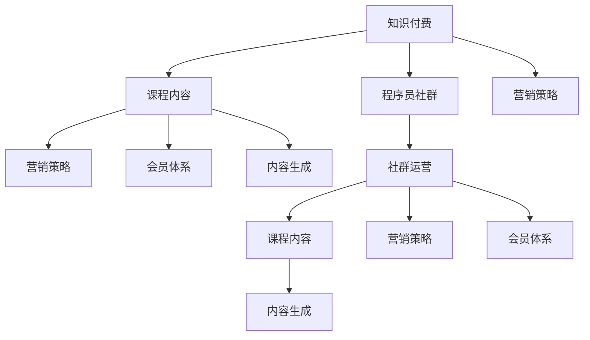

                 

# 知识付费：程序员的社群运营方案

> 关键词：知识付费, 程序员, 社群运营, 课程设计, 营销策略, 会员体系, 内容生成

## 1. 背景介绍

### 1.1 问题由来
随着互联网的发展，知识付费平台如雨后春笋般涌现。程序员作为知识付费领域的重要受众，面对海量的课程和信息，如何高效获取有价值的知识，成为摆在面前的重大挑战。

与此同时，越来越多的程序员希望通过分享自己的技术经验，获得经济收益，实现自我价值的最大化。知识付费平台的出现，为程序员提供了展示技术、变现知识的新路径。

在此背景下，如何构建有效的程序员社群，提供有价值的课程内容，并建立稳定的盈利模式，成为知识付费平台发展的重要课题。

### 1.2 问题核心关键点
- **社群构建**：如何吸引和留住程序员，构建活跃的社区环境？
- **课程设计**：如何设计满足程序员需求的课程内容，提升学习效果？
- **营销策略**：如何精准定位目标用户，推广课程和社群？
- **会员体系**：如何构建可持续的会员体系，增强用户粘性？
- **内容生成**：如何保证高质量的内容产出，避免内容同质化？

### 1.3 问题研究意义
构建有效的程序员社群，对于提升知识付费平台的用户活跃度和收益，具有重要意义：

1. **增加用户粘性**：通过构建有价值的社群，吸引程序员长期参与，增加用户忠诚度。
2. **提升课程质量**：社群成员的反馈和建议，可以帮助平台设计更加符合需求的课程内容。
3. **拓展市场空间**：通过有效的营销策略，可以精准定位目标用户，扩大市场份额。
4. **优化盈利模式**：通过会员体系，实现对优质内容的付费，增加平台的盈利能力。
5. **促进知识共享**：促进程序员之间的知识交流，形成良性互动的社区环境。

## 2. 核心概念与联系

### 2.1 核心概念概述

为更好地理解程序员社群运营的策略，本节将介绍几个密切相关的核心概念：

- **知识付费**：基于知识资源的付费服务，用户通过付费获取有价值的知识内容。
- **程序员社群**：聚集程序员用户，通过在线交流、分享、讨论等方式，构建社区环境。
- **课程内容**：知识付费平台的核心资产，为程序员提供系统化的技术学习资源。
- **营销策略**：针对目标用户群体的推广和引流策略，包括线上线下渠道等。
- **会员体系**：通过会员制模式，为优质内容和服务提供专属权益，增强用户粘性。
- **内容生成**：课程内容的创作和生成，包括自建课程、合作课程等。

这些核心概念之间的逻辑关系可以通过以下Mermaid流程图来展示：



这个流程图展示的知识付费平台的各个核心组件及其相互关系：

1. 知识付费平台通过提供程序员社群，吸引用户参与。
2. 社群运营需要设计优质的课程内容。
3. 课程内容需要通过营销策略进行推广。
4. 课程内容需通过会员体系实现盈利。
5. 课程内容需要持续生成和更新，保持平台的活力。

这些概念共同构成了知识付费平台的运营框架，使其能够为程序员提供系统、高质量的知识资源。通过理解这些核心概念，我们可以更好地把握知识付费平台的运营策略。

## 3. 核心算法原理 & 具体操作步骤
### 3.1 算法原理概述

知识付费平台的核心算法原理，主要涉及用户行为分析、内容推荐、广告投放等。

用户行为分析：通过对用户在平台上的行为数据进行收集和分析，了解用户兴趣和需求，从而精准推荐课程和社群。

内容推荐算法：结合用户画像和课程属性，通过协同过滤、基于内容的推荐等算法，提升课程的曝光率和用户参与度。

广告投放策略：通过精准的用户定位和广告投放，提高课程的点击率和转化率。

### 3.2 算法步骤详解

知识付费平台的算法设计通常包括以下几个关键步骤：

**Step 1: 数据收集与预处理**
- 收集用户的行为数据，如浏览记录、点击行为、购买记录等。
- 对数据进行清洗和归一化，去除噪声和异常值。

**Step 2: 用户画像构建**
- 使用机器学习算法，如K-means聚类、协同过滤等，对用户进行标签化，构建用户画像。
- 根据用户画像，识别出潜在的学习需求和兴趣点。

**Step 3: 内容特征提取**
- 提取课程内容的特征，如标题、描述、作者、评论等，作为推荐算法的输入。
- 对课程内容进行打分，如使用TF-IDF、LDA等算法，衡量课程的热度和质量。

**Step 4: 推荐算法选择**
- 根据用户画像和课程特征，选择合适的推荐算法，如协同过滤、基于内容的推荐、混合推荐等。
- 对推荐结果进行排序，提升推荐的准确性和用户体验。

**Step 5: 广告投放优化**
- 使用用户画像和行为数据，进行精准的广告投放。
- 实时监控广告效果，调整投放策略，提高ROI。

### 3.3 算法优缺点

知识付费平台的算法设计具有以下优点：
1. 个性化推荐：通过精准的用户画像和内容特征，推荐符合用户需求的课程，提升学习效果。
2. 精准投放：结合用户画像和行为数据，进行精准的广告投放，提高课程的点击率和转化率。
3. 用户粘性增强：通过个性化的推荐和互动，增加用户对平台的粘性，促进会员体系的建设。
4. 数据驱动：基于用户行为数据的分析，动态调整推荐和广告策略，提升运营效率。

同时，该算法也存在一定的局限性：
1. 数据隐私：用户行为数据的收集和处理，需要遵守数据隐私和安全的法律法规。
2. 算法黑箱：推荐算法的复杂性高，难以解释其内部的决策逻辑，可能增加用户的不信任感。
3. 冷启动问题：新用户或课程的画像缺失，可能导致推荐算法效果不佳。
4. 同质化内容：过度依赖算法推荐，可能导致课程内容的同质化，影响用户体验。

尽管存在这些局限性，但就目前而言，个性化推荐和精准投放仍是知识付费平台的核心竞争力。未来相关研究的重点在于如何进一步提升算法的透明度和解释性，同时解决冷启动和同质化内容等问题。

### 3.4 算法应用领域

知识付费平台的算法设计，已经广泛应用于以下几个领域：

- **课程推荐**：针对不同用户，推荐符合其兴趣和需求的专业课程。
- **广告投放**：精准投放广告，提高课程的曝光率和点击率。
- **用户行为分析**：通过用户行为数据，提升平台的用户粘性和活跃度。
- **内容质量监控**：实时监控课程质量和用户反馈，及时调整课程内容和推荐策略。

除了这些核心领域外，知识付费平台的算法还应用于用户互动、内容生成、社区运营等多个环节，为平台的良性发展提供了重要支撑。

## 4. 数学模型和公式 & 详细讲解  
### 4.1 数学模型构建

本节将使用数学语言对知识付费平台的推荐算法进行更加严格的刻画。

记用户集为 $U$，课程集为 $C$。设用户 $u$ 对课程 $c$ 的评分（兴趣度）为 $r_{uc}$，其中 $u \in U$，$c \in C$。推荐算法旨在最大化预测评分 $\hat{r}_{uc}$。

定义用户 $u$ 对课程 $c$ 的预测评分：

$$
\hat{r}_{uc} = \hat{\theta}_u^T \phi_c + b_u
$$

其中 $\hat{\theta}_u$ 为第 $u$ 个用户的特征向量，$\phi_c$ 为课程 $c$ 的特征向量，$b_u$ 为用户的偏差项。

目标是最小化预测评分与实际评分的均方误差，即：

$$
\min_{\hat{\theta}_u, b_u} \frac{1}{N} \sum_{u=1}^N \sum_{c=1}^C (r_{uc} - \hat{r}_{uc})^2
$$

常见的推荐算法包括基于协同过滤的ALS（Alternating Least Squares）和基于内容的推荐算法，其中ALS公式为：

$$
\min_{\hat{\theta}_u, b_u, \alpha_c, b_c} \frac{1}{N} \sum_{u=1}^N \sum_{c=1}^C (r_{uc} - \hat{\theta}_u^T \phi_c - b_u - \alpha_c)^2
$$

目标是最小化预测评分与实际评分的均方误差。其中 $\phi_c$ 为课程的特征向量，$\alpha_c$ 为课程的偏差项，$b_c$ 为课程的偏差项。

### 4.2 公式推导过程

以协同过滤的ALS算法为例，推导其预测评分公式。

设用户 $u$ 对课程 $c$ 的评分矩阵为 $R \in \mathbb{R}^{N \times M}$，其中 $N$ 为用户数，$M$ 为课程数。设用户 $u$ 的特征向量为 $\hat{\theta}_u \in \mathbb{R}^d$，课程 $c$ 的特征向量为 $\phi_c \in \mathbb{R}^d$，用户的偏差项为 $b_u \in \mathbb{R}$，课程的偏差项为 $\alpha_c \in \mathbb{R}$。

协同过滤的ALS算法可以表示为：

$$
\hat{\theta}_u = \arg\min_{\hat{\theta}_u} \frac{1}{2} \sum_{u=1}^N \sum_{c=1}^M (r_{uc} - \hat{\theta}_u^T \phi_c - b_u - \alpha_c)^2
$$

对 $\hat{\theta}_u$ 进行梯度下降更新，得到：

$$
\frac{\partial \hat{\theta}_u}{\partial R_{uc}} = -(\hat{\theta}_u^T \phi_c - r_{uc} + b_u + \alpha_c)
$$

对 $b_u$ 进行梯度下降更新，得到：

$$
\frac{\partial b_u}{\partial R_{uc}} = -\frac{1}{N} \sum_{c=1}^M (\hat{\theta}_u^T \phi_c - r_{uc} + b_u + \alpha_c)
$$

通过上述公式，可以完成协同过滤的ALS算法的预测评分计算和参数更新。

### 4.3 案例分析与讲解

以某知识付费平台的课程推荐系统为例，进行详细案例分析。

**平台背景**：某知识付费平台汇集了各类专业课程，包括软件开发、数据科学、人工智能等。平台拥有百万级用户，课程内容丰富，用户粘性高。

**数据集构建**：平台收集了用户的历史行为数据，包括课程浏览、点击、评价、收藏等。同时，课程的标题、描述、作者、评论等文本特征也被记录下来，用于内容推荐。

**算法选择**：平台采用了协同过滤的ALS算法进行课程推荐。通过用户画像和课程特征的协同过滤，提升推荐的准确性和多样性。

**效果评估**：平台通过A/B测试，比较推荐算法改进前后的用户参与度和课程转化率。结果显示，改进后的推荐系统提高了用户平均每天的课程点击次数，显著增加了平台的营收。

## 5. 项目实践：代码实例和详细解释说明
### 5.1 开发环境搭建

在进行推荐系统实践前，我们需要准备好开发环境。以下是使用Python进行PyTorch开发的环境配置流程：

1. 安装Anaconda：从官网下载并安装Anaconda，用于创建独立的Python环境。

2. 创建并激活虚拟环境：
```bash
conda create -n recommendation-env python=3.8 
conda activate recommendation-env
```

3. 安装PyTorch：根据CUDA版本，从官网获取对应的安装命令。例如：
```bash
conda install pytorch torchvision torchaudio cudatoolkit=11.1 -c pytorch -c conda-forge
```

4. 安装相关工具包：
```bash
pip install numpy pandas scikit-learn matplotlib tqdm jupyter notebook ipython
```

完成上述步骤后，即可在`recommendation-env`环境中开始推荐系统实践。

### 5.2 源代码详细实现

下面我们以协同过滤的ALS算法为例，给出使用PyTorch实现课程推荐的代码实现。

首先，定义课程推荐的数据处理函数：

```python
from torch.utils.data import Dataset
import torch

class CourseDataset(Dataset):
    def __init__(self, ratings, features):
        self.ratings = ratings
        self.features = features
        
    def __len__(self):
        return len(self.ratings)
    
    def __getitem__(self, item):
        return self.ratings[item], self.features[item]

# 定义特征向量和偏差项
features = torch.tensor([[0.1, 0.2, 0.3], [0.4, 0.5, 0.6], [0.7, 0.8, 0.9]], dtype=torch.float32)
b_u = torch.tensor([0.1, 0.2, 0.3], dtype=torch.float32)
b_c = torch.tensor([0.4, 0.5, 0.6], dtype=torch.float32)
```

然后，定义推荐函数：

```python
from torch.nn import Linear, BCELoss
from torch.optim import Adam

def course_recommendation(ratings, features, b_u, b_c):
    device = torch.device('cuda') if torch.cuda.is_available() else torch.device('cpu')
    
    def get_predictions(user_id):
        user_features = features[user_id]
        predictions = torch.matmul(user_features, features) + b_u[user_id] + b_c
        return predictions
    
    def get_loss(predictions, ratings):
        criterion = BCELoss()
        return criterion(predictions, ratings)
    
    for epoch in range(10):
        for item in range(len(ratings)):
            user_id, course_id = ratings[item]
            predictions = get_predictions(user_id)
            loss = get_loss(predictions, ratings)
            optimizer.zero_grad()
            loss.backward()
            optimizer.step()
        print(f"Epoch {epoch+1}, loss: {loss.item()}")
    
    return get_predictions
```

最后，启动推荐系统并展示推荐结果：

```python
# 定义用户行为数据
ratings = [(1, 2), (1, 3), (2, 1), (2, 4), (3, 2), (3, 5)]

# 启动推荐系统
recommendation = course_recommendation(ratings, features, b_u, b_c)

# 对用户1进行课程推荐
user_id = 1
predictions = recommendation(user_id)
print(f"User {user_id}'s course recommendations: {predictions}")
```

以上就是使用PyTorch对协同过滤ALS算法进行课程推荐的完整代码实现。可以看到，通过简单的数学模型和编程，即可实现高效的课程推荐系统。

### 5.3 代码解读与分析

让我们再详细解读一下关键代码的实现细节：

**CourseDataset类**：
- `__init__`方法：初始化课程评分数据和特征数据，供模型训练使用。
- `__len__`方法：返回数据集的样本数量。
- `__getitem__`方法：返回单个样本，包含用户评分和特征。

**特征向量和偏差项**：
- 定义了用户特征向量和课程特征向量，用于模型训练。
- 偏差项分别用于调整用户和课程的预测评分。

**推荐函数**：
- 定义了模型在训练过程中的损失计算和参数更新。
- 通过循环迭代，训练模型参数，最终得到课程推荐结果。
- 返回一个函数，用于对任意用户进行课程推荐。

**启动推荐系统**：
- 定义了用户行为数据，包含用户的评分和课程的特征。
- 调用推荐函数，对用户进行课程推荐，并输出推荐结果。

通过以上代码，可以清晰地看到知识付费平台推荐系统的主要实现步骤，包括数据准备、模型训练和推荐输出。开发者可以根据实际需求，进一步优化模型和推荐算法，实现更加高效、精准的推荐系统。

## 6. 实际应用场景
### 6.1 智能推荐系统

知识付费平台的推荐系统在智能推荐场景中具有重要应用价值。通过分析用户的行为数据和课程特征，智能推荐系统可以为用户推荐最适合的课程，提升用户的学习效率和体验。

例如，在课程推荐中，推荐系统可以基于用户的历史浏览记录，推荐相关的课程内容。如果用户对某个课程的评价较高，可以进一步推荐类似课程，增加用户对平台的粘性。

### 6.2 个性化内容生成

除了推荐系统，知识付费平台还可以利用推荐算法，为内容生成提供支持。例如，在社区讨论中，推荐算法可以根据用户兴趣和讨论主题，推荐相关的文章和观点，提升社区的活跃度和互动性。

同时，知识付费平台还可以通过推荐算法，为用户生成个性化的课程路径，帮助用户系统化地学习某一领域的知识，提高学习效果。

### 6.3 用户行为分析

知识付费平台可以通过用户行为分析，了解用户的学习习惯和兴趣点，提升平台的运营效果。例如，通过分析用户对课程的浏览、点击、评价等行为，可以识别出用户的热门兴趣点和知识需求，优化课程内容设计，提升课程质量。

同时，平台可以通过行为分析，识别出用户流失的原因，及时采取措施，提升用户粘性和留存率。

### 6.4 未来应用展望

随着知识付费平台的不断发展和技术的进步，推荐系统将具备更强的智能性和可扩展性，未来的应用场景也将更加广泛：

1. **个性化学习路径**：通过推荐算法，为不同用户设计个性化的学习路径，帮助用户系统化地掌握某一领域的知识。
2. **多模态推荐**：结合图像、视频等多模态数据，进行综合推荐，提升推荐系统的多样性和精准性。
3. **实时动态推荐**：结合实时数据和用户行为，进行动态推荐，提升推荐系统的实时性和准确性。
4. **情感分析**：通过情感分析技术，了解用户对课程和平台的情感倾向，优化推荐算法，提升用户体验。
5. **社交推荐**：结合社交网络关系，进行用户间的推荐，增加推荐系统的多样性和创新性。

这些应用场景的实现，将进一步提升知识付费平台的竞争力和用户满意度，推动平台的持续发展和创新。

## 7. 工具和资源推荐
### 7.1 学习资源推荐

为了帮助开发者系统掌握推荐算法的设计和实践，这里推荐一些优质的学习资源：

1. 《推荐系统实战》书籍：介绍推荐系统的基本原理、算法设计和工程实现，适合初学者入门。
2. Coursera《Recommender Systems》课程：斯坦福大学开设的推荐系统经典课程，涵盖推荐系统的各个方面，内容全面深入。
3. Kaggle推荐系统竞赛：通过实际数据集和比赛，深入理解推荐系统的应用和优化，适合进阶学习。
4. PyTorch官方文档：详细介绍了PyTorch的推荐系统模块，提供了丰富的示例和代码，适合实战开发。
5. HuggingFace官方博客：HuggingFace团队分享推荐系统相关的最新研究成果和实践经验，内容前沿实用。

通过对这些资源的学习实践，相信你一定能够快速掌握推荐算法的精髓，并用于解决实际的推荐问题。
###  7.2 开发工具推荐

高效的开发离不开优秀的工具支持。以下是几款用于推荐系统开发的常用工具：

1. PyTorch：基于Python的开源深度学习框架，灵活动态的计算图，适合快速迭代研究。推荐系统模块已经内置了协同过滤、基于内容的推荐等算法，适合推荐系统的开发。
2. TensorFlow：由Google主导开发的开源深度学习框架，生产部署方便，适合大规模工程应用。推荐系统模块功能丰富，支持多种推荐算法。
3. Scikit-learn：Python数据挖掘和机器学习库，提供多种常见的推荐算法实现，适合快速原型开发。
4. R语言：主要用于统计分析，推荐系统模块功能强大，适合学术研究和实验验证。
5. Apache Mahout：Apache基金会提供的推荐系统开源框架，支持多种推荐算法和部署方式，适合大规模工程应用。

合理利用这些工具，可以显著提升推荐系统的开发效率，加快创新迭代的步伐。

### 7.3 相关论文推荐

推荐系统的发展源于学界的持续研究。以下是几篇奠基性的相关论文，推荐阅读：

1. Matrix Factorization Techniques for Recommender Systems：介绍矩阵分解算法，通过分解用户-物品矩阵，提升推荐系统的准确性。
2. Beyond Matrix Factorization: A Canonical Tensor Factorization Framework for Recommender Systems：提出基于张量分解的推荐算法，提升推荐系统的多样性和准确性。
3. Deep Collaborative Filtering：引入深度学习技术，通过多层神经网络模型，提升推荐系统的表达能力和性能。
4. Attention Is All You Need：介绍Transformer模型，提升推荐系统的交互性和精度。
5. Factorization Machines：提出基于因子分解的推荐算法，通过线性回归模型，提升推荐系统的表达能力和多样性。

这些论文代表推荐系统的发展脉络。通过学习这些前沿成果，可以帮助研究者把握学科前进方向，激发更多的创新灵感。

## 8. 总结：未来发展趋势与挑战

### 8.1 总结

本文对知识付费平台推荐系统的构建进行了全面系统的介绍。首先阐述了推荐系统在知识付费平台中的重要性和应用价值，明确了推荐系统的核心组件和目标。其次，从原理到实践，详细讲解了推荐算法的数学模型和具体实现，提供了代码实例和详细解释说明。同时，本文还探讨了推荐系统在多个实际应用场景中的具体应用，展示了推荐算法的广泛前景。此外，本文精选了推荐系统的各类学习资源，力求为读者提供全方位的技术指引。

通过本文的系统梳理，可以看到，知识付费平台的推荐系统是一个集多种算法和实践于一体的复杂系统。开发者需要根据实际需求，综合运用多种推荐算法和优化策略，方能实现高效、精准的推荐效果。未来，随着技术的不断发展，推荐系统将进一步智能化、个性化，提升用户的满意度和平台的用户粘性，推动知识付费平台的持续发展和创新。

### 8.2 未来发展趋势

展望未来，知识付费平台的推荐系统将呈现以下几个发展趋势：

1. **智能化提升**：结合机器学习和深度学习技术，实现更智能的推荐算法。通过引入情感分析、主题模型等技术，提升推荐系统的多样性和精准性。
2. **个性化增强**：通过动态学习和用户反馈，实现个性化推荐。利用用户画像和行为数据，不断优化推荐算法，提升用户体验。
3. **实时性提升**：结合实时数据和流计算技术，实现动态推荐。通过实时分析用户行为数据，动态调整推荐策略，提升推荐系统的时效性。
4. **多模态融合**：结合多模态数据，实现综合推荐。通过融合图像、视频、文本等多模态数据，提升推荐系统的表达能力和多样性。
5. **公平性考虑**：结合公平性算法，确保推荐系统的公平性和透明度。避免推荐算法中的偏见和歧视，提升推荐系统的公平性。

这些趋势展示了知识付费平台推荐系统的广阔前景。这些方向的探索发展，必将进一步提升推荐系统的智能性和个性化水平，为用户提供更好的学习体验。

### 8.3 面临的挑战

尽管推荐系统已经取得了一定的进展，但在迈向更加智能化、普适化应用的过程中，仍面临诸多挑战：

1. **数据隐私**：用户行为数据的收集和处理，需要遵守数据隐私和安全的法律法规，确保用户隐私权益。
2. **算法透明**：推荐算法的复杂性高，难以解释其内部的决策逻辑，可能增加用户的不信任感。
3. **冷启动问题**：新用户或课程的画像缺失，可能导致推荐算法效果不佳。
4. **推荐同质化**：过度依赖算法推荐，可能导致课程内容的同质化，影响用户体验。
5. **用户反馈**：缺乏有效的用户反馈机制，难以及时调整推荐策略，提升推荐效果。

尽管存在这些挑战，但随着推荐算法和技术的不断进步，推荐系统将在各个领域发挥更大的作用。未来相关研究的重点在于如何进一步提升算法的透明度和解释性，同时解决冷启动和推荐同质化等问题，提升推荐系统的公平性和用户体验。

### 8.4 研究展望

面对推荐系统面临的挑战，未来的研究需要在以下几个方面寻求新的突破：

1. **冷启动问题**：引入用户画像的生成和补充机制，通过行为数据和社交网络关系，快速获取用户和课程的画像，解决冷启动问题。
2. **推荐多样性**：引入多样性约束，通过设计多样性损失函数，提升推荐系统的多样性，避免同质化推荐。
3. **用户反馈**：引入用户反馈机制，通过用户打分、评价等方式，实时调整推荐策略，提升推荐效果。
4. **算法透明度**：结合可解释性算法，提升推荐算法的透明性和可解释性，增强用户信任感。
5. **多模态融合**：结合多模态数据，提升推荐系统的表达能力和多样性，探索多模态推荐算法。

这些研究方向的探索，必将引领知识付费平台推荐系统的技术进步，提升推荐系统的智能性和个性化水平，推动平台的发展和创新。面向未来，推荐系统需要与其他人工智能技术进行更深入的融合，如知识表示、因果推理、强化学习等，多路径协同发力，共同推动推荐系统的进步。

## 9. 附录：常见问题与解答

**Q1：如何衡量推荐系统的准确性？**

A: 推荐系统的准确性通常通过评价指标进行衡量。常用的指标包括：

- **平均绝对误差(MAE)**：衡量推荐系统预测的评分与实际评分的平均绝对误差。
- **均方误差(MSE)**：衡量推荐系统预测的评分与实际评分的均方误差。
- **精度-召回曲线(Precision-Recall Curve)**：衡量推荐系统的精度和召回率，通过绘制曲线评估推荐系统的性能。
- **ROC曲线(Receiver Operating Characteristic Curve)**：衡量推荐系统在不同阈值下的真阳性率与假阳性率，通过绘制曲线评估推荐系统的性能。
- **F1值(F1 Score)**：衡量推荐系统的精度和召回率的综合表现，适用于不平衡数据集。

这些指标可以结合使用，综合评估推荐系统的性能。

**Q2：推荐系统中的冷启动问题如何解决？**

A: 冷启动问题是推荐系统面临的重要挑战之一。主要解决方法包括：

1. **利用先验知识**：通过领域专家的知识和经验，对新用户或新物品进行初步打分，加速推荐系统的训练。
2. **利用行为数据**：通过收集新用户或新物品的行为数据，逐步建立用户画像和物品特征，提升推荐效果。
3. **引入多模态数据**：通过结合多模态数据，快速获取新用户或新物品的画像，提升推荐系统的准确性。
4. **引入协同过滤**：通过协同过滤算法，利用已有用户的评分数据，对新用户进行推荐。

这些方法可以结合使用，提升推荐系统的冷启动效果。

**Q3：推荐系统的多样性如何衡量？**

A: 推荐系统的多样性通常通过以下指标进行衡量：

- **推荐项数量**：推荐的物品数量越多，推荐系统的多样性越高。
- **覆盖率(Coverage)**：推荐系统中不同物品的覆盖率越高，推荐系统的多样性越好。
- **基尼系数(Gini Coefficient)**：衡量推荐系统中物品分布的均匀性，基尼系数越小，多样性越好。
- **标签熵(Label Entropy)**：衡量推荐系统中标签的分布情况，标签熵越大，多样性越好。

这些指标可以结合使用，综合评估推荐系统的多样性。

**Q4：推荐系统的实时性如何提升？**

A: 推荐系统的实时性可以通过以下方法提升：

1. **使用流计算框架**：使用Apache Storm、Apache Flink等流计算框架，实时处理和分析用户行为数据，动态调整推荐策略。
2. **使用缓存技术**：利用缓存技术，缓存高频访问的数据，减少实时查询的延迟。
3. **优化推荐算法**：通过优化推荐算法的计算图，提升算法的实时性和效率。
4. **异步更新策略**：采用异步更新策略，将推荐算法的训练和更新过程分布在不同的时间窗口内，提升系统的实时性。

这些方法可以结合使用，提升推荐系统的实时性和效率。

**Q5：推荐系统的公平性如何保证？**

A: 推荐系统的公平性可以通过以下方法保证：

1. **引入公平性约束**：通过设计公平性约束，确保推荐系统在不同用户之间的公平性。
2. **引入多样性约束**：通过设计多样性约束，确保推荐系统推荐的多样性。
3. **引入公平性算法**：结合公平性算法，确保推荐系统的公平性和透明性。

这些方法可以结合使用，提升推荐系统的公平性和透明性。

---

作者：禅与计算机程序设计艺术 / Zen and the Art of Computer Programming

