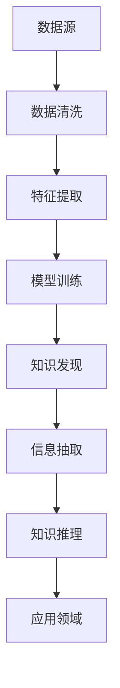

                 

# 知识发现引擎助力程序员职业发展

## 1. 背景介绍

### 1.1 问题由来
在信息爆炸的时代，程序员们面临前所未有的挑战。每日不仅要面对代码的编写、调试、维护，还要不断学习新的技术栈和框架，阅读大量的代码和文档。然而，随着知识量的爆炸性增长，传统的“搜索-阅读-实践”学习模式已无法满足需求，难以快速、系统、高效地获取和应用知识。

### 1.2 问题核心关键点
知识发现引擎（Knowledge Discovery Engine, KDE）作为人工智能和信息科学的前沿领域，能够通过自动化技术从海量数据中发现隐藏的知识和规律，直接应用于程序员职业发展中。

1. **问题定义**：知识发现引擎是用于自动发现数据中知识、模式和规律的工具。通过自动化学习和数据挖掘技术，从大量文献、代码、文档和用户反馈中提取有价值的信息，生成报告、推荐、提示等辅助程序员学习与工作。
2. **技术应用**：知识发现引擎可以应用于代码推荐、错误诊断、学习路径规划、代码质量评估等多个场景，助力程序员快速提升职业能力。

### 1.3 问题研究意义
知识发现引擎能够使程序员从繁重的重复性工作中解放出来，将更多时间和精力投入到创新和创造中。通过自动化学习，程序员可以系统性地提升自身技术水平，推动技术的迭代和创新。

## 2. 核心概念与联系

### 2.1 核心概念概述

为更好地理解知识发现引擎，本节将介绍几个密切相关的核心概念：

- **知识发现（Knowledge Discovery）**：指从大量数据中抽取、识别和总结知识的过程。包括数据清洗、预处理、特征提取、建模和验证等多个步骤。
- **数据挖掘（Data Mining）**：数据挖掘是知识发现的重要组成部分，通过算法从数据中发现有用信息和知识。
- **信息抽取（Information Extraction）**：从非结构化文本中抽取特定信息，用于支持知识发现和推理。
- **机器学习（Machine Learning）**：机器学习算法在知识发现中用于模型训练和预测，提升发现知识的准确性和泛化能力。
- **自然语言处理（NLP）**：用于处理和分析人类语言的技术，知识发现引擎往往需要基于NLP技术对代码、文档等非结构化数据进行处理。

这些核心概念之间的逻辑关系可以通过以下Mermaid流程图来展示：



这个流程图展示了大规模数据从数据源开始，经过一系列技术处理，最终被知识发现引擎抽取、识别、总结为知识的过程。

## 3. 核心算法原理 & 具体操作步骤
### 3.1 算法原理概述

知识发现引擎的核心思想是通过数据挖掘和机器学习技术，自动从数据中发现有用的知识，应用于程序员职业发展的各个环节。其核心算法包括：

1. **数据预处理**：清洗和处理原始数据，提取出有用的特征。
2. **特征提取**：将原始数据转换为机器学习算法能够处理的形式。
3. **模型训练**：通过机器学习算法训练模型，识别数据中的模式和规律。
4. **知识发现**：应用模型对数据进行预测和推理，发现新的知识。
5. **信息抽取**：从大量文本数据中抽取结构化信息，如代码结构、变量类型、函数调用等。
6. **知识推理**：基于已发现的知识，推理新的知识，如代码改进、性能优化等。

### 3.2 算法步骤详解

知识发现引擎的实现通常包括以下关键步骤：

**Step 1: 数据采集与清洗**
- 通过API接口、日志文件、代码仓库等方式，自动采集数据。
- 清洗数据，去除噪音和重复数据，进行标准化处理。

**Step 2: 特征提取与选择**
- 提取文本、代码、日志等数据中的关键特征，如代码结构、函数调用、变量类型等。
- 使用特征选择算法，去除冗余和无关特征。

**Step 3: 模型训练与优化**
- 选择适当的机器学习算法，如决策树、随机森林、深度学习等。
- 使用训练集进行模型训练，并进行交叉验证和参数调优。

**Step 4: 知识发现与推理**
- 应用模型对测试集进行预测和推理，识别新的知识模式。
- 根据发现的知识，生成相应的代码、报告、提示等。

**Step 5: 应用与反馈**
- 将知识发现结果应用于代码推荐、错误诊断、学习路径规划等场景。
- 通过用户反馈不断调整和优化知识发现引擎。

### 3.3 算法优缺点

知识发现引擎的主要优点包括：

1. **高效性**：自动处理大量数据，快速发现有用知识。
2. **普适性**：适用于各种数据类型和应用场景。
3. **辅助性**：为程序员提供辅助建议和工具，减少重复性劳动。

主要缺点包括：

1. **数据依赖**：依赖于数据质量和数量，高质量数据获取成本高。
2. **模型复杂**：需要复杂的算法和模型，对技术要求高。
3. **结果可解释性**：发现的知识可能难以解释，难以调试和优化。

## 4. 数学模型和公式 & 详细讲解 & 举例说明

### 4.1 数学模型构建

知识发现引擎的数学模型构建通常涉及以下步骤：

1. **数据预处理模型**：包括数据清洗、标准化等步骤，可以使用数据预处理算法，如缺失值填充、去重等。
2. **特征提取模型**：将原始数据转换为特征向量，可以使用线性模型、树模型等。
3. **模型训练模型**：通过训练算法，构建模型，可以使用线性回归、决策树、神经网络等。
4. **知识发现模型**：基于训练好的模型，进行知识推理和发现，可以使用聚类、分类、关联规则等算法。

### 4.2 公式推导过程

以下以聚类算法为例，推导其基本公式：

设 $D=\{d_1, d_2, ..., d_n\}$ 为数据集，其中每个数据 $d_i=(x_{i1}, x_{i2}, ..., x_{in})$。

**K-Means算法**：

1. **初始化**：随机选择 $k$ 个数据点作为聚类中心。
2. **计算距离**：计算每个数据点 $d_i$ 到聚类中心的距离。
3. **分配**：将每个数据点 $d_i$ 分配到距离最近的聚类中心。
4. **更新**：重新计算每个聚类的中心，使聚类更加紧密。
5. **迭代**：重复2-4步，直到收敛或达到预设迭代次数。

K-Means的核心公式为：

$$
c_j=\arg\min_{c_j \in C} \sum_{i=1}^n ||d_i-c_j||^2
$$

其中 $C$ 为聚类中心集合，$c_j$ 为聚类中心，$||\cdot||$ 表示距离度量。

### 4.3 案例分析与讲解

**案例一：代码质量评估**

假设有一批开源项目的代码，需要自动评估代码质量。可以使用代码质量评估模型，自动识别高耦合、低内聚的代码，并生成改进建议。

1. **数据采集**：从开源代码仓库中采集数据，提取函数调用、变量类型、代码复杂度等特征。
2. **特征提取**：使用文本处理算法，如词袋模型、TF-IDF等，提取代码的关键特征。
3. **模型训练**：使用随机森林算法，训练代码质量评估模型，预测代码质量评分。
4. **知识发现**：应用模型对新代码进行预测，发现代码质量问题。
5. **应用与反馈**：将发现的问题与改进建议应用于代码评审流程，收集用户反馈，不断优化模型。

## 5. 项目实践：代码实例和详细解释说明

### 5.1 开发环境搭建

在进行知识发现引擎的实践前，我们需要准备好开发环境。以下是使用Python进行Scikit-learn开发的简单环境配置流程：

1. 安装Anaconda：从官网下载并安装Anaconda，用于创建独立的Python环境。

2. 创建并激活虚拟环境：
```bash
conda create -n kde-env python=3.8 
conda activate kde-env
```

3. 安装Scikit-learn：
```bash
conda install scikit-learn
```

4. 安装各类工具包：
```bash
pip install numpy pandas scikit-learn matplotlib tqdm jupyter notebook ipython
```

完成上述步骤后，即可在`kde-env`环境中开始知识发现引擎的开发。

### 5.2 源代码详细实现

下面我们以代码质量评估为例，给出使用Scikit-learn进行知识发现引擎开发的PyTorch代码实现。

```python
import numpy as np
import pandas as pd
from sklearn.ensemble import RandomForestClassifier
from sklearn.feature_extraction.text import CountVectorizer
from sklearn.model_selection import train_test_split

# 数据集加载
data = pd.read_csv('code_quality.csv')
features = data[['function_call_count', 'variable_count', 'code_complexity']]
labels = data['code_quality']

# 特征提取
vectorizer = CountVectorizer()
features = vectorizer.fit_transform(features)

# 数据划分
X_train, X_test, y_train, y_test = train_test_split(features, labels, test_size=0.2, random_state=42)

# 模型训练
clf = RandomForestClassifier(n_estimators=100, random_state=42)
clf.fit(X_train, y_train)

# 代码质量评估
def code_quality_assessment(code):
    features = vectorizer.transform([code])
    prediction = clf.predict(features)
    return prediction[0]

# 测试
code = 'def func():\n    x = 1\n    y = 2\n    z = x + y\n    return z'
print(code_quality_assessment(code))
```

以上代码实现了基于随机森林算法的代码质量评估模型，通过将代码特征化并使用机器学习算法训练，对新代码进行质量评估。

### 5.3 代码解读与分析

让我们再详细解读一下关键代码的实现细节：

**特征提取**：
- `CountVectorizer` 用于将代码转换为词频向量，提取关键特征。

**模型训练**：
- `RandomForestClassifier` 用于训练模型，使用随机森林算法预测代码质量。

**代码质量评估**：
- `code_quality_assessment` 函数将新的代码特征化并使用模型进行预测，评估代码质量。

**测试**：
- 定义一个简单的代码片段进行测试，评估其质量。

## 6. 实际应用场景

### 6.1 代码推荐系统

代码推荐系统可以帮助程序员快速找到相关代码片段或模板，提高编码效率。知识发现引擎可以通过分析大量代码库和文档，发现代码间的关联和相似性，生成推荐结果。

1. **数据采集**：收集代码库、文档、API等数据，提取代码片段、函数调用等特征。
2. **特征提取**：使用词袋模型、TF-IDF等算法，提取代码片段的关键特征。
3. **模型训练**：使用协同过滤、内容推荐等算法，训练代码推荐模型。
4. **知识发现**：应用模型对新代码进行推荐，发现代码相似片段。
5. **应用与反馈**：将推荐结果应用于代码编辑器或IDE，收集用户反馈，不断优化模型。

### 6.2 错误诊断系统

错误诊断系统可以快速定位和修复代码中的错误，减少调试时间。知识发现引擎可以通过分析大量的错误日志和代码变化，识别出常见错误类型和解决方法，生成诊断提示。

1. **数据采集**：收集错误日志、代码版本控制等数据，提取错误类型、代码变化等特征。
2. **特征提取**：使用TF-IDF、词袋模型等算法，提取关键特征。
3. **模型训练**：使用分类算法，如决策树、神经网络等，训练错误诊断模型。
4. **知识发现**：应用模型对新错误进行预测，发现错误类型和解决方法。
5. **应用与反馈**：将诊断结果应用于调试工具，收集用户反馈，不断优化模型。

### 6.3 学习路径规划

学习路径规划可以帮助程序员制定高效的学习计划，系统地提升技术能力。知识发现引擎可以通过分析大量的学习资料和社区讨论，发现不同技能之间的关联和先后顺序，生成学习路径。

1. **数据采集**：收集学习资料、社区讨论等数据，提取技能、课程、文档等特征。
2. **特征提取**：使用图算法，如PageRank、邻接矩阵等，提取技能之间的关联。
3. **模型训练**：使用图神经网络算法，训练学习路径规划模型。
4. **知识发现**：应用模型生成学习路径，推荐学习资料和课程。
5. **应用与反馈**：将学习路径应用于学习管理系统，收集用户反馈，不断优化模型。

### 6.4 未来应用展望

知识发现引擎的未来应用前景广阔，随着技术的发展，将进一步深入以下领域：

1. **多模态数据融合**：结合代码、文档、日志等多模态数据，进行更全面的知识发现。
2. **个性化推荐**：根据程序员的兴趣、历史行为等个性化特征，提供更精准的推荐。
3. **实时监控与反馈**：实时监控代码质量、学习进度等指标，动态调整学习路径。
4. **集成到IDE与开发工具**：直接集成到开发环境，提供实时提示和建议，提高开发效率。
5. **大规模数据处理**：支持大数据处理技术，处理海量数据，提升知识发现能力。

## 7. 工具和资源推荐

### 7.1 学习资源推荐

为了帮助开发者系统掌握知识发现引擎的理论基础和实践技巧，这里推荐一些优质的学习资源：

1. 《Python数据科学手册》：由数据科学专家撰写，全面介绍了Python在数据科学中的应用，包括数据清洗、特征提取、模型训练等技术。
2. 《机器学习实战》：由Google数据科学家撰写，提供了大量实战案例，帮助读者理解机器学习算法和应用。
3. 《Python深度学习》：由深度学习专家撰写，系统介绍了深度学习算法和实践，包括数据预处理、特征提取、模型训练等环节。
4. Kaggle在线学习平台：提供大量数据科学和机器学习竞赛，帮助读者在实践中提升技能。
5. 《自然语言处理综论》：全面介绍了自然语言处理的基础知识和前沿技术，包括文本分类、信息抽取等任务。

通过对这些资源的学习实践，相信你一定能够快速掌握知识发现引擎的精髓，并用于解决实际的NLP问题。

### 7.2 开发工具推荐

高效的开发离不开优秀的工具支持。以下是几款用于知识发现引擎开发的常用工具：

1. Jupyter Notebook：开源的交互式笔记本，支持Python、R等多种语言，适合数据科学和机器学习任务。
2. TensorFlow：由Google主导开发的深度学习框架，支持大规模模型训练和部署。
3. Scikit-learn：Python机器学习库，提供简单易用的接口，支持多种机器学习算法。
4. NLTK：自然语言处理库，支持文本处理和特征提取等任务。
5. Keras：高层次深度学习框架，支持快速原型设计和模型部署。

合理利用这些工具，可以显著提升知识发现引擎的开发效率，加快创新迭代的步伐。

### 7.3 相关论文推荐

知识发现引擎的研究方向众多，以下是几篇奠基性的相关论文，推荐阅读：

1. "Knowledge Discovery in Databases: An Overview"（数据挖掘综述）：由Pang-Ning Tan等人撰写，系统介绍了数据挖掘的基础知识和前沿技术。
2. "An Introduction to Statistical Learning"（统计学习方法）：由Gareth James等人撰写，全面介绍了统计学习方法的理论和应用。
3. "Neural Network Methods for Text Processing"（神经网络文本处理）：由Hinton等人撰写，介绍了神经网络在文本处理中的应用。
4. "Data Mining Techniques"（数据挖掘技术）：由Rangarajan和Venkatesh撰写，系统介绍了数据挖掘的各种技术和方法。
5. "Adaptive Data Mining"（自适应数据挖掘）：由Tjoa和Tan撰写，介绍了自适应数据挖掘的原理和应用。

这些论文代表了大规模数据挖掘和知识发现技术的发展脉络，通过学习这些前沿成果，可以帮助研究者把握学科前进方向，激发更多的创新灵感。

## 8. 总结：未来发展趋势与挑战

### 8.1 总结

本文对知识发现引擎进行了全面系统的介绍。首先阐述了知识发现引擎在程序员职业发展中的重要作用，明确了知识发现引擎的应用场景和效果。其次，从原理到实践，详细讲解了知识发现引擎的数学模型和操作步骤，给出了知识发现引擎的代码实现。同时，本文还广泛探讨了知识发现引擎在代码推荐、错误诊断、学习路径规划等领域的实际应用，展示了知识发现引擎的巨大潜力。此外，本文精选了知识发现引擎的各类学习资源，力求为读者提供全方位的技术指引。

通过本文的系统梳理，可以看到，知识发现引擎在程序员职业发展中扮演着越来越重要的角色。这些技术的应用，使程序员能够更加系统地获取和应用知识，提升自身技术水平，推动技术的迭代和创新。

### 8.2 未来发展趋势

展望未来，知识发现引擎将呈现以下几个发展趋势：

1. **自动化水平提升**：自动化数据清洗、特征提取、模型训练等环节，提升知识发现的效率和准确性。
2. **多模态数据融合**：结合代码、文档、日志等多模态数据，进行更全面的知识发现。
3. **个性化推荐**：根据程序员的兴趣、历史行为等个性化特征，提供更精准的推荐。
4. **实时监控与反馈**：实时监控代码质量、学习进度等指标，动态调整学习路径。
5. **大规模数据处理**：支持大数据处理技术，处理海量数据，提升知识发现能力。

这些趋势将进一步提升知识发现引擎的智能化水平，使程序员能够更高效地获取和应用知识，推动技术的快速发展和创新。

### 8.3 面临的挑战

尽管知识发现引擎已经取得了显著成果，但在应用过程中仍面临诸多挑战：

1. **数据质量问题**：数据缺失、噪音、不平衡等问题可能导致知识发现结果不准确。
2. **模型复杂性**：复杂的算法和模型可能导致计算资源消耗大，训练时间长。
3. **结果可解释性**：发现的知识可能难以解释，难以调试和优化。
4. **技术瓶颈**：现有技术难以处理大规模、复杂的数据集，需要进一步创新。
5. **伦理与安全**：发现的知识可能存在偏见、有害信息，需要严格的伦理和安全保障。

面对这些挑战，未来的研究需要在以下几个方面寻求新的突破：

1. **数据预处理技术**：提高数据清洗和预处理的质量，减少噪音和误差。
2. **模型优化算法**：开发高效的算法，减少计算资源消耗，提高训练速度。
3. **结果解释性**：引入可解释性技术，提高知识发现的透明性和可理解性。
4. **大模型应用**：应用大模型进行知识发现，提升模型的泛化能力和表现。
5. **伦理与法律**：制定相关法规，确保知识发现的伦理和安全，避免有害信息传播。

这些研究方向将进一步推动知识发现引擎技术的成熟，提升其应用价值和实用性。

### 8.4 研究展望

面对知识发现引擎所面临的挑战，未来的研究需要在以下几个方面寻求新的突破：

1. **数据清洗与预处理**：开发高效的数据清洗和预处理算法，提高数据质量。
2. **高效模型训练**：开发高效的模型训练算法，提升训练速度和效率。
3. **知识解释与可视化**：引入可解释性技术，提高知识发现的透明性和可理解性。
4. **多模态数据融合**：研究多模态数据的融合方法，提升知识发现的效果和泛化能力。
5. **跨领域知识发现**：将知识发现引擎应用于多个领域，提升跨领域的知识发现能力。

这些研究方向将进一步推动知识发现引擎技术的成熟，提升其应用价值和实用性。

## 9. 附录：常见问题与解答

**Q1：知识发现引擎如何应用于代码质量评估？**

A: 知识发现引擎可以通过分析大量的代码库和文档，识别出高耦合、低内聚的代码，生成代码质量评估报告。具体流程如下：
1. 数据采集：从开源代码仓库中采集数据，提取函数调用、变量类型、代码复杂度等特征。
2. 特征提取：使用文本处理算法，如词袋模型、TF-IDF等，提取代码的关键特征。
3. 模型训练：使用随机森林算法，训练代码质量评估模型，预测代码质量评分。
4. 知识发现：应用模型对新代码进行预测，发现代码质量问题。
5. 应用与反馈：将发现的问题与改进建议应用于代码评审流程，收集用户反馈，不断优化模型。

**Q2：知识发现引擎如何应用于学习路径规划？**

A: 知识发现引擎可以通过分析大量的学习资料和社区讨论，发现不同技能之间的关联和先后顺序，生成学习路径。具体流程如下：
1. 数据采集：收集学习资料、社区讨论等数据，提取技能、课程、文档等特征。
2. 特征提取：使用图算法，如PageRank、邻接矩阵等，提取技能之间的关联。
3. 模型训练：使用图神经网络算法，训练学习路径规划模型。
4. 知识发现：应用模型生成学习路径，推荐学习资料和课程。
5. 应用与反馈：将学习路径应用于学习管理系统，收集用户反馈，不断优化模型。

**Q3：知识发现引擎的计算资源消耗如何优化？**

A: 知识发现引擎的计算资源消耗主要集中在数据预处理、模型训练和特征提取环节。优化方法包括：
1. 数据预处理：采用高效的清洗和标准化算法，减少噪音和误差。
2. 模型训练：使用分布式训练、GPU加速等技术，提高训练速度。
3. 特征提取：优化特征提取算法，减少特征维度，提高计算效率。
4. 模型优化：使用高效的模型架构，如轻量化模型、量化加速等，减少计算资源消耗。

这些优化方法可以有效提升知识发现引擎的计算效率，使其在实际应用中更加高效和稳定。

**Q4：知识发现引擎如何处理多模态数据？**

A: 知识发现引擎可以通过结合代码、文档、日志等多模态数据，进行更全面的知识发现。具体方法包括：
1. 数据融合：将多种数据类型融合到一个数据集中，提取多模态特征。
2. 特征提取：使用多模态特征提取算法，提取多模态数据的关键特征。
3. 模型训练：使用多模态数据训练模型，识别数据中的模式和规律。
4. 知识发现：应用模型对多模态数据进行预测和推理，发现新的知识。
5. 应用与反馈：将发现的知识应用于实际应用场景，收集用户反馈，不断优化模型。

通过多模态数据的融合和处理，知识发现引擎可以更全面地获取和应用知识，提升系统的智能化水平。

**Q5：知识发现引擎的应用前景如何？**

A: 知识发现引擎的应用前景广阔，随着技术的发展，将进一步深入以下领域：
1. 代码推荐系统：帮助程序员快速找到相关代码片段或模板，提高编码效率。
2. 错误诊断系统：快速定位和修复代码中的错误，减少调试时间。
3. 学习路径规划：制定高效的学习计划，系统地提升技术能力。
4. 实时监控与反馈：实时监控代码质量、学习进度等指标，动态调整学习路径。
5. 集成到IDE与开发工具：直接集成到开发环境，提供实时提示和建议，提高开发效率。

通过知识发现引擎的应用，程序员能够更加系统地获取和应用知识，提升自身技术水平，推动技术的迭代和创新。

---

作者：禅与计算机程序设计艺术 / Zen and the Art of Computer Programming

