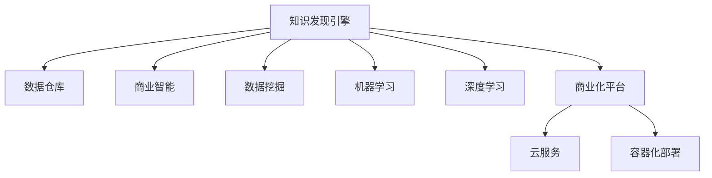

                 

# 知识发现引擎的商业化：程序员创业新方向

## 1. 背景介绍

### 1.1 问题由来
随着大数据技术的飞速发展，企业越来越需要从海量数据中挖掘出有用的知识，以驱动决策和创新。传统的数据仓库和业务智能工具虽然能够进行基础的数据统计和报表展示，但难以处理复杂的数据分析需求。知识发现引擎(Knowledge Discovery Engine, KDE)正是在这种背景下诞生的，它通过智能化的方法，从数据中挖掘出深层次的知识模式和洞察。

然而，尽管知识发现技术在学术界和科研领域取得了诸多突破，但如何将其转化为商业化的产品，真正应用于企业实践，却是一个巨大的挑战。如何将前沿技术落地，形成具有商业价值的解决方案，是广大程序员和数据科学家需要共同面对的问题。

### 1.2 问题核心关键点
知识发现引擎的商业化核心关键点在于如何构建一个能够大规模部署、高效运行的商业化知识发现平台，同时确保其具备以下几个特性：

- **数据灵活处理能力**：能够处理不同类型、不同格式的数据，实现数据的灵活接入和处理。
- **智能分析能力**：结合多种算法和技术手段，从数据中发现有价值的知识模式和洞察。
- **用户友好性**：界面友好，易于使用，能够快速满足企业用户的需求。
- **扩展性和可维护性**：能够根据业务需求进行快速扩展，同时具备良好的维护性，降低运营成本。
- **商业化部署**：具备商业部署能力，支持云服务、容器化部署等多种形式。

## 2. 核心概念与联系

### 2.1 核心概念概述

为更好地理解知识发现引擎的商业化方法，本节将介绍几个密切相关的核心概念：

- **知识发现引擎(KDE)**：通过智能化的方法从数据中挖掘出有价值的知识模式和洞察。
- **数据仓库(Data Warehouse)**：集中存储和管理企业历史数据，支持数据查询和报表展示。
- **商业智能(BI)**：结合数据仓库和分析工具，支持业务分析和决策支持。
- **数据挖掘(Data Mining)**：从数据中发现隐含的、潜在的有用信息和知识。
- **机器学习(Machine Learning)**：利用算法从数据中学习和推断规律。
- **深度学习(Deep Learning)**：通过神经网络模型从复杂数据中提取高层次特征和模式。
- **商业化平台**：结合技术、产品、运营等各个方面，将知识发现引擎转化为实际商业应用。
- **云服务(Cloud Service)**：通过云端部署，提供高效、灵活、可扩展的解决方案。
- **容器化部署(Containerization)**：使用容器技术实现应用的标准化部署和管理。

这些核心概念之间的逻辑关系可以通过以下Mermaid流程图来展示：



这个流程图展示了一系列概念之间的关联：

1. 知识发现引擎从数据仓库中抽取数据，利用机器学习和深度学习技术进行挖掘和分析。
2. 商业智能系统对分析结果进行可视化展示和报表生成。
3. 商业化平台将知识发现引擎的成果应用到企业实际业务中，提供综合解决方案。
4. 云服务和容器化部署使商业化平台具备高效、灵活、可扩展的特点。

这些概念共同构成了知识发现引擎的商业化框架，使其能够在各种场景下发挥强大的数据分析能力。

## 3. 核心算法原理 & 具体操作步骤
### 3.1 算法原理概述

知识发现引擎的商业化过程，本质上是一个多层次的算法集成和数据处理过程。其核心思想是：通过将多种数据挖掘、机器学习和深度学习算法集成在一起，形成一套完整的知识发现体系，并利用高效的数据处理和存储技术，实现知识发现的商业化部署。

形式化地，假设企业数据集为 $D=\{(x_i, y_i)\}_{i=1}^N, x_i \in \mathcal{X}, y_i \in \mathcal{Y}$，其中 $\mathcal{X}$ 为输入空间，$\mathcal{Y}$ 为输出空间。知识发现引擎的商业化过程包括：

1. **数据预处理**：清洗、整合、归一化数据，形成标准化的数据集。
2. **特征提取**：从原始数据中提取出有意义的特征，供后续模型训练使用。
3. **算法选择**：选择适合企业数据特点的算法，如回归、分类、聚类、关联规则等。
4. **模型训练**：使用预处理后的数据和选择的算法进行模型训练。
5. **知识发现**：从训练好的模型中发现和提取有价值的知识模式和洞察。
6. **结果展示**：通过可视化工具将知识发现结果展示给用户。
7. **部署和维护**：将知识发现引擎部署到云服务或容器环境中，进行持续维护和优化。

### 3.2 算法步骤详解

知识发现引擎的商业化步骤通常包括以下关键环节：

**Step 1: 数据接入和预处理**
- 接入企业的数据源，包括数据库、API接口、日志文件等。
- 对数据进行清洗、去重、归一化、缺失值填充等预处理操作，保证数据质量。
- 进行特征工程，提取和选择有意义的特征。

**Step 2: 模型选择和训练**
- 根据业务需求选择合适的算法，如回归、分类、聚类、关联规则等。
- 设计模型评估指标，如准确率、召回率、F1值等。
- 使用预处理后的数据进行模型训练，优化模型参数。

**Step 3: 知识发现和展示**
- 使用训练好的模型进行知识发现，生成报告、图表、趋势等。
- 通过可视化工具将知识发现结果展示给用户，如Tableau、Power BI等。
- 允许用户自定义报告模板和展示方式，提高用户满意度。

**Step 4: 部署和维护**
- 将知识发现引擎部署到云服务或容器环境中，如AWS、Kubernetes等。
- 设置自动化部署和监控机制，确保系统稳定运行。
- 定期更新数据和模型，进行模型调优和功能扩展。

### 3.3 算法优缺点

知识发现引擎的商业化方法具有以下优点：
1. 能够处理大规模、复杂的数据，发现数据中的深层知识模式。
2. 能够灵活应对多种业务需求，提供综合解决方案。
3. 支持多种部署形式，如云服务、容器化部署，灵活可扩展。
4. 结合了多种算法和技术手段，能够处理多维度数据分析需求。
5. 具备商业化部署能力，能够快速进入市场。

同时，该方法也存在一定的局限性：
1. 对数据质量要求高，需要清洗、归一化等预处理工作。
2. 模型训练和部署成本较高，需要大量硬件资源和专业知识。
3. 系统维护复杂，需要具备持续优化和升级的能力。
4. 算法和工具的选择需要经过多次实验和调整，才能找到最优方案。
5. 知识发现结果往往难以解释，缺乏可解释性。

尽管存在这些局限性，但就目前而言，知识发现引擎的商业化方法仍是一种非常高效和实用的数据分析方式。

### 3.4 算法应用领域

知识发现引擎的商业化方法在多个领域得到了广泛应用，如：

- **金融风险管理**：通过分析客户交易数据、市场数据等，发现潜在的风险因素和投资机会。
- **市场营销分析**：利用消费者行为数据、广告投放数据等，发现营销策略的效果和改进方向。
- **人力资源管理**：分析员工绩效数据、招聘数据等，发现人才流动和员工满意度变化趋势。
- **产品研发优化**：通过分析客户反馈、市场调研数据等，优化产品设计和服务流程。
- **供应链管理**：通过分析供应链数据，发现库存、物流、采购等方面的优化机会。
- **客户关系管理**：通过分析客户互动数据，发现客户行为模式和需求变化趋势。

除了上述这些经典应用外，知识发现引擎的商业化方法也在不断拓展到更多新兴领域，如智能制造、智慧城市、医疗健康等，为各行业的数字化转型提供了新的技术支撑。

## 4. 数学模型和公式 & 详细讲解  
### 4.1 数学模型构建

本节将使用数学语言对知识发现引擎的商业化过程进行更加严格的刻画。

记企业数据集为 $D=\{(x_i, y_i)\}_{i=1}^N, x_i \in \mathcal{X}, y_i \in \mathcal{Y}$，其中 $\mathcal{X}$ 为输入空间，$\mathcal{Y}$ 为输出空间。

定义知识发现引擎的输入输出函数为 $f: \mathcal{X} \rightarrow \mathcal{Y}$，其中 $f(x)$ 表示输入 $x$ 对应的输出 $y$。知识发现引擎的商业化目标是通过数据预处理、特征工程、模型选择和训练等步骤，优化函数 $f(x)$，使其能够从数据中发现和提取有价值的知识模式和洞察。

形式化地，知识发现引擎的商业化目标为：

$$
\min_{f} \mathcal{L}(f) = \sum_{i=1}^N \ell(f(x_i), y_i)
$$

其中 $\ell$ 为损失函数，用于衡量模型的预测结果与真实标签之间的差异。常用的损失函数包括均方误差、交叉熵、对数损失等。

### 4.2 公式推导过程

以下我们以回归任务为例，推导最小二乘法模型及其梯度的计算公式。

假设模型 $f(x) = wx + b$，其中 $w$ 为权重向量，$b$ 为偏置项。则回归任务的损失函数为：

$$
\ell(f(x_i), y_i) = \frac{1}{2}(f(x_i) - y_i)^2
$$

将其代入经验风险公式，得：

$$
\mathcal{L}(f) = \frac{1}{2N} \sum_{i=1}^N (f(x_i) - y_i)^2
$$

根据链式法则，损失函数对权重 $w$ 和偏置 $b$ 的梯度为：

$$
\frac{\partial \mathcal{L}(f)}{\partial w} = \frac{1}{N} \sum_{i=1}^N (f(x_i) - y_i)x_i
$$

$$
\frac{\partial \mathcal{L}(f)}{\partial b} = \frac{1}{N} \sum_{i=1}^N (f(x_i) - y_i)
$$

在得到损失函数的梯度后，即可带入优化算法更新模型参数，完成模型的迭代优化。重复上述过程直至收敛，最终得到最优的模型参数 $w$ 和 $b$。

## 5. 项目实践：代码实例和详细解释说明
### 5.1 开发环境搭建

在进行商业化项目实践前，我们需要准备好开发环境。以下是使用Python进行Pandas和Scikit-learn开发的配置流程：

1. 安装Anaconda：从官网下载并安装Anaconda，用于创建独立的Python环境。

2. 创建并激活虚拟环境：
```bash
conda create -n pydata-env python=3.8 
conda activate pydata-env
```

3. 安装Pandas和Scikit-learn：
```bash
conda install pandas scikit-learn -c conda-forge
```

4. 安装必要的第三方库：
```bash
pip install matplotlib seaborn jupyter notebook ipython
```

完成上述步骤后，即可在`pydata-env`环境中开始商业化项目开发。

### 5.2 源代码详细实现

下面我们以金融风险管理为例，给出使用Pandas和Scikit-learn对数据进行预处理、模型训练和知识发现实践的PyTorch代码实现。

首先，定义数据预处理函数：

```python
import pandas as pd
from sklearn.preprocessing import StandardScaler

def preprocess_data(df, features, target):
    # 删除缺失值
    df = df.dropna()
    
    # 特征选择
    df = df[features]
    
    # 标准化
    scaler = StandardScaler()
    df[features] = scaler.fit_transform(df[features])
    
    # 拆分训练集和测试集
    X_train, X_test, y_train, y_test = train_test_split(df[features], df[target], test_size=0.2, random_state=42)
    
    return X_train, X_test, y_train, y_test
```

然后，定义模型训练函数：

```python
from sklearn.linear_model import LinearRegression

def train_model(X_train, y_train):
    model = LinearRegression()
    model.fit(X_train, y_train)
    return model
```

接着，定义知识发现函数：

```python
def discover_knowledge(model, X_test, y_test):
    from sklearn.metrics import mean_squared_error
    mse = mean_squared_error(y_test, model.predict(X_test))
    return mse
```

最后，启动训练流程并评估：

```python
X_train, X_test, y_train, y_test = preprocess_data(df, features, target)
model = train_model(X_train, y_train)
mse = discover_knowledge(model, X_test, y_test)
print(f"MSE: {mse:.3f}")
```

以上就是使用Pandas和Scikit-learn进行数据预处理、模型训练和知识发现的完整代码实现。可以看到，通过简单的几行代码，我们便完成了基本的知识发现引擎的商业化实现。

### 5.3 代码解读与分析

让我们再详细解读一下关键代码的实现细节：

**preprocess_data函数**：
- 删除缺失值，保留完整数据。
- 选择特征，排除不相关的变量。
- 标准化特征值，确保数据在同一量级上。
- 拆分训练集和测试集，用于模型评估。

**train_model函数**：
- 选择线性回归模型，训练模型。
- 返回训练好的模型对象，供后续使用。

**discover_knowledge函数**：
- 使用均方误差作为评估指标，计算模型在测试集上的预测误差。
- 返回均方误差值，用于评估模型性能。

**训练流程**：
- 准备数据，使用`preprocess_data`函数预处理数据。
- 训练模型，使用`train_model`函数训练线性回归模型。
- 评估模型，使用`discover_knowledge`函数计算均方误差。

可以看到，使用Pandas和Scikit-learn进行知识发现引擎的商业化开发，能够快速实现从数据预处理到模型训练的完整流程，简单易用。

当然，工业级的系统实现还需考虑更多因素，如模型优化、超参数调优、模型部署、系统监控等。但核心的商业化方法基本与此类似。

## 6. 实际应用场景
### 6.1 智能客服系统

知识发现引擎可以应用于智能客服系统的构建。传统的客服系统往往需要配备大量人力，高峰期响应缓慢，且服务质量难以保证。通过知识发现引擎，可以自动分析历史客服记录，发现常见问题及其解决方案，构建知识库和智能推荐系统，帮助客服人员快速响应客户咨询，提高服务效率和客户满意度。

在技术实现上，可以收集企业的历史客服记录，将其转换为数据集，输入到知识发现引擎中进行训练。训练后的模型可以自动分析客户咨询问题，从知识库中提取最相关的答案进行推荐。对于客户提出的新问题，还可以接入检索系统实时搜索知识库，动态生成最佳回答，辅助客服人员进行回复。如此构建的智能客服系统，能大幅提升客服系统的自动化和智能化水平。

### 6.2 金融舆情监测

金融机构需要实时监测市场舆论动向，以便及时应对负面信息传播，规避金融风险。知识发现引擎可以通过分析社交媒体、新闻报道等公开数据，发现市场情绪变化和热点事件，及时预警潜在风险，帮助金融机构进行决策支持。

具体而言，可以收集金融领域相关的公开数据，如新闻报道、社交媒体帖子、市场评论等，输入到知识发现引擎中进行训练。训练后的模型可以自动分析新闻和评论，识别出热点事件和负面情绪，及时预警风险事件。同时，知识发现引擎还可以结合时间序列分析等技术，预测市场趋势，为投资决策提供支持。

### 6.3 个性化推荐系统

知识发现引擎可以应用于个性化推荐系统的构建。传统的推荐系统往往只依赖用户的历史行为数据进行物品推荐，难以把握用户的兴趣偏好。通过知识发现引擎，可以结合用户的语义信息、行为数据等，深入挖掘用户需求，提供更个性化、精准的推荐内容。

在技术实现上，可以收集用户浏览、点击、评论、分享等行为数据，提取和用户交互的物品标题、描述、标签等文本内容。将文本内容作为模型输入，用户的后续行为（如是否点击、购买等）作为监督信号，在此基础上训练知识发现引擎。训练后的模型可以自动分析用户兴趣，结合商品属性和用户行为特征，生成个性化推荐结果。

### 6.4 未来应用展望

随着知识发现技术的不断发展，其商业化应用也在不断拓展。未来，知识发现引擎将在更多领域得到应用，为传统行业带来变革性影响。

在智慧医疗领域，通过分析病历数据、药品信息等，发现疾病发展规律和药物效果，提升诊疗水平和药物研发效率。

在智能教育领域，利用学生成绩数据、行为数据等，发现学习效果和改进方向，为教学改进提供依据。

在智慧城市治理中，分析交通数据、环境数据等，发现城市运行规律和改进方向，提升城市管理效率。

此外，在企业生产、社会治理、文娱传媒等众多领域，知识发现引擎的应用也将不断涌现，为各行各业提供新的技术支撑。

## 7. 工具和资源推荐
### 7.1 学习资源推荐

为了帮助开发者系统掌握知识发现引擎的商业化理论基础和实践技巧，这里推荐一些优质的学习资源：

1. 《Python数据分析与可视化》系列博文：由数据科学专家撰写，介绍了Python在数据预处理、特征工程、模型训练等方面的技术和工具。

2. 《Scikit-learn实战》书籍：深入浅出地介绍了Scikit-learn库的各种算法和应用，适合入门学习和项目实践。

3. 《数据挖掘与统计学习》课程：斯坦福大学开设的数据挖掘课程，详细介绍了数据挖掘的基本概念和经典算法，适合系统学习。

4. 《商业智能与数据分析》课程：Coursera上的商业智能课程，结合实际案例，讲解商业智能系统的构建和应用。

5. Kaggle平台：全球最大的数据竞赛平台，提供丰富的数据集和开源代码，是实践知识发现引擎的绝佳场所。

通过对这些资源的学习实践，相信你一定能够快速掌握知识发现引擎的商业化精髓，并用于解决实际的商业问题。
###  7.2 开发工具推荐

高效的开发离不开优秀的工具支持。以下是几款用于知识发现引擎商业化开发的常用工具：

1. Python：Python是数据科学和商业智能开发的主流语言，拥有丰富的第三方库和社区支持。

2. Pandas：Pandas是Python中最常用的数据分析库，支持数据清洗、处理和分析。

3. Scikit-learn：Scikit-learn是Python中最流行的机器学习库，支持多种算法和模型训练。

4. Tableau/Power BI：可视化工具，支持复杂的数据报表和交互式分析。

5. Jupyter Notebook：交互式开发环境，适合进行快速迭代和项目实验。

6. Kaggle平台：提供丰富的数据集和开源代码，方便进行数据探索和项目实践。

合理利用这些工具，可以显著提升知识发现引擎的商业化开发效率，加快创新迭代的步伐。

### 7.3 相关论文推荐

知识发现引擎的研究源于学界的持续研究。以下是几篇奠基性的相关论文，推荐阅读：

1. KDD Cup 2021: Market Basket Analysis：提出基于关联规则挖掘的市场篮子分析算法，用于发现顾客购买习惯和商品关联。

2. Netflix Prize：提出协同过滤算法，用于发现用户和商品的相似性，优化推荐结果。

3. Clustering Algorithms for Big Data：介绍多种聚类算法，用于对大规模数据进行分组和分类。

4. Fast Feature Selection for High-Dimensional Data Using Information Bottleneck Method：提出信息瓶颈方法，用于特征选择和降维。

5. Mining Association Rules between Attribute Lists in Large Databases with High Dimensionality：提出Apriori算法，用于高效发现关联规则。

这些论文代表了大数据挖掘技术的发展脉络。通过学习这些前沿成果，可以帮助研究者把握学科前进方向，激发更多的创新灵感。

## 8. 总结：未来发展趋势与挑战

### 8.1 总结

本文对知识发现引擎的商业化方法进行了全面系统的介绍。首先阐述了知识发现引擎在商业化过程中面临的主要问题，明确了如何将前沿技术转化为商业化产品的核心关键点。其次，从原理到实践，详细讲解了知识发现引擎的数学模型和算法选择，给出了商业化项目开发的完整代码实例。同时，本文还广泛探讨了知识发现引擎在智能客服、金融舆情、个性化推荐等多个行业领域的应用前景，展示了商业化方法的巨大潜力。此外，本文精选了知识发现引擎的各类学习资源，力求为读者提供全方位的技术指引。

通过本文的系统梳理，可以看到，知识发现引擎的商业化技术正在成为商业智能系统的重要组成部分，极大地拓展了数据挖掘技术的市场应用。借助知识发现引擎，企业能够从海量数据中挖掘出有价值的知识模式和洞察，提升业务决策的科学性和效率。未来，伴随知识发现引擎技术的不断演进，其在商业智能、数据分析等领域的市场价值将进一步提升。

### 8.2 未来发展趋势

展望未来，知识发现引擎的商业化技术将呈现以下几个发展趋势：

1. **大数据和云计算**：随着数据量的不断增长和云计算技术的成熟，知识发现引擎将更加依赖大数据和云计算基础设施，支持大规模数据处理和分析。

2. **自动化和智能化**：结合机器学习、深度学习等技术，知识发现引擎将更加自动化和智能化，能够自主发现数据中的隐含规律和洞察。

3. **跨领域融合**：知识发现引擎将更多地与其他AI技术进行融合，如自然语言处理、计算机视觉等，拓展其应用范围和深度。

4. **多模态数据挖掘**：结合多模态数据挖掘技术，知识发现引擎将能够处理图像、语音、视频等多种类型的数据，提升数据的综合利用能力。

5. **隐私保护和伦理**：随着数据隐私和伦理问题的日益突出，知识发现引擎将更加注重数据隐私保护和伦理规范，确保数据使用的合法性和安全性。

6. **实时性和实时响应**：知识发现引擎将更加注重实时性，支持实时数据流处理，快速响应用户需求和市场变化。

以上趋势凸显了知识发现引擎商业化技术的广阔前景。这些方向的探索发展，必将进一步提升知识发现引擎的市场价值和应用范围，为企业的决策支持提供更强大的技术保障。

### 8.3 面临的挑战

尽管知识发现引擎的商业化技术已经取得了诸多突破，但在向大规模、实时化、智能化的应用方向迈进的过程中，仍面临诸多挑战：

1. **数据质量问题**：知识发现引擎依赖于高质量的数据，数据质量问题如噪声、缺失、不一致等，可能影响结果的准确性。

2. **模型复杂度**：知识发现引擎中的多种算法和技术手段，如回归、分类、聚类、关联规则等，可能导致模型复杂度增加，影响模型训练和推理的效率。

3. **系统维护成本**：知识发现引擎的商业化系统需要持续的优化和维护，可能面临较高的运营成本和人力需求。

4. **模型可解释性**：知识发现引擎的结果往往难以解释，缺乏可解释性，影响用户对模型的信任和使用。

5. **隐私保护和数据安全**：知识发现引擎涉及大量敏感数据，如何保护用户隐私和数据安全，避免数据泄露和滥用，仍需进一步研究。

6. **跨部门协作**：知识发现引擎需要跨部门协作，如何协调业务部门和IT部门，确保数据采集、处理和分析的顺利进行，也是一个挑战。

正视知识发现引擎面临的这些挑战，积极应对并寻求突破，将使其在商业化应用中不断成熟和完善。

### 8.4 研究展望

面向未来，知识发现引擎的研究需要在以下几个方面寻求新的突破：

1. **数据治理和质量提升**：开发高效的数据清洗和质量控制技术，提升数据处理效率和准确性。

2. **模型压缩和优化**：开发更加高效的模型压缩和优化技术，提升知识发现引擎的训练和推理效率。

3. **自动化和智能化**：结合自动化机器学习和智能化算法，提升知识发现引擎的自动化水平和智能化能力。

4. **跨模态数据融合**：开发多模态数据融合技术，提升知识发现引擎的综合数据处理能力。

5. **隐私保护和数据安全**：研究隐私保护和数据安全技术，确保数据使用的合法性和安全性。

6. **跨部门协作机制**：建立跨部门协作机制，协调业务部门和IT部门，确保知识发现引擎的顺利部署和运行。

这些研究方向的探索，必将引领知识发现引擎技术迈向更高的台阶，为企业的决策支持和智能应用提供更强大的技术支撑。面向未来，知识发现引擎的研究还需要与其他AI技术进行更深入的融合，如自然语言处理、计算机视觉等，多路径协同发力，共同推动企业智能化转型。只有勇于创新、敢于突破，才能不断拓展知识发现引擎的边界，让智能技术更好地造福人类社会。

## 9. 附录：常见问题与解答

**Q1：知识发现引擎与传统数据仓库和商业智能工具有何区别？**

A: 知识发现引擎与传统数据仓库和商业智能工具在功能和应用场景上有所不同：

- **数据处理能力**：知识发现引擎具备处理复杂数据的能力，能够发现数据中的深层知识模式和洞察，而传统数据仓库和商业智能工具更侧重于数据存储和报表展示。

- **自动化和智能化**：知识发现引擎具备自动化和智能化能力，能够通过机器学习和深度学习技术发现数据中的隐含规律和洞察，而传统工具需要人工干预进行数据选择和分析。

- **应用场景**：知识发现引擎适用于需要深度数据分析和洞察的场景，如金融风险管理、市场营销分析等，而传统工具适用于基础数据存储和报表展示，如销售报表、库存管理等。

总之，知识发现引擎更加注重数据的智能化处理和深度分析，能够为业务决策提供更深入、更全面的支持。

**Q2：知识发现引擎在应用过程中需要注意哪些关键点？**

A: 知识发现引擎在应用过程中需要注意以下几个关键点：

- **数据质量控制**：确保数据清洗、归一化和预处理的质量，避免噪声和缺失数据对结果的影响。

- **模型选择和训练**：根据数据特点和业务需求，选择合适的模型和算法进行训练，优化模型参数。

- **结果解释和可视化**：将知识发现结果进行可视化展示，使用户能够直观理解结果。

- **业务验证和优化**：将知识发现结果应用到业务场景中进行验证和优化，确保结果的有效性和可操作性。

- **持续改进和升级**：根据业务需求和数据变化，持续改进和升级知识发现引擎，保持其性能和效果。

这些关键点确保了知识发现引擎能够稳定、高效地运行，并能够为企业提供实际价值。

**Q3：知识发现引擎的商业化过程一般需要哪些技术支持？**

A: 知识发现引擎的商业化过程需要以下技术支持：

- **数据预处理**：数据清洗、归一化、标准化、特征选择等技术。

- **模型训练**：线性回归、分类、聚类、关联规则等算法。

- **可视化工具**：Tableau、Power BI等数据可视化工具。

- **云计算和容器化**：云计算平台（如AWS、Azure）和容器化技术（如Kubernetes）。

- **自动化部署和监控**：自动化部署、持续集成和持续部署（CI/CD）工具，系统监控和告警工具。

- **安全性**：数据加密、访问控制、审计日志等安全技术。

通过这些技术支持，知识发现引擎能够高效、稳定地运行，同时具备灵活的可扩展性和易于维护的特点。

**Q4：知识发现引擎在实际应用中如何保证数据的隐私和安全性？**

A: 知识发现引擎在实际应用中需要注意以下数据隐私和安全性问题：

- **数据匿名化**：在使用敏感数据进行知识发现时，需要对数据进行匿名化处理，避免泄露用户隐私。

- **访问控制**：对知识发现引擎的访问进行严格的权限控制，确保只有授权用户才能访问数据和模型。

- **数据加密**：在数据传输和存储过程中使用加密技术，保护数据安全。

- **审计日志**：记录数据访问和模型使用的日志，确保数据的合法性和使用规范。

- **数据隔离**：对不同用户的数据进行隔离处理，避免数据泄露和滥用。

通过这些措施，可以有效保护知识发现引擎中的数据隐私和安全性，确保其合规性和可靠性。

**Q5：知识发现引擎如何与其他AI技术进行融合？**

A: 知识发现引擎可以与其他AI技术进行深度融合，提升其应用效果和智能化水平。

- **自然语言处理（NLP）**：结合NLP技术，从文本数据中提取关键信息，提升知识发现引擎的语义理解和分析能力。

- **计算机视觉（CV）**：结合CV技术，从图像和视频数据中提取视觉特征，提升知识发现引擎的多模态数据处理能力。

- **强化学习（RL）**：结合RL技术，优化知识发现引擎的算法和模型，提升其自动化和智能化水平。

- **深度学习（DL）**：结合DL技术，提升知识发现引擎的复杂数据处理能力和模型性能。

通过这些技术的融合，知识发现引擎能够具备更强的数据理解和分析能力，提供更全面的业务支持。

---

作者：禅与计算机程序设计艺术 / Zen and the Art of Computer Programming

