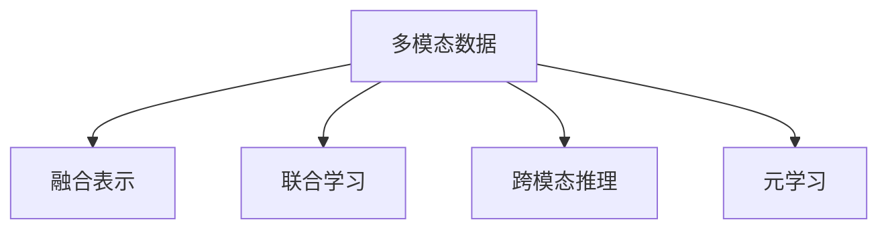

                 

# 知识发现引擎的多模态学习技术应用

> 关键词：知识发现,多模态学习,信息检索,大数据,深度学习

## 1. 背景介绍

### 1.1 问题由来
在信息爆炸的时代，人类每天产生的海量数据中蕴含着大量的知识。如何从这些数据中挖掘出有价值的信息，并将之转化为可用的知识，成为了现代信息工程的重要研究课题。知识发现(Knowledge Discovery, KDD)引擎正是为了解决这一问题而设计的，它旨在从大规模数据集中自动发现和提取有价值的知识，并应用到决策支持、商业智能、个性化推荐等领域，以提升数据驱动决策的能力。

随着技术的发展，多模态数据在知识发现中的应用越来越广泛。多模态学习(Multimodal Learning)技术通过融合不同类型的数据，如文本、图像、音频、视频等，提升对复杂现象的建模能力，实现更加全面和准确的知识发现。本文将深入探讨多模态学习技术在知识发现引擎中的应用，介绍其主要原理、关键算法和具体实现。

### 1.2 问题核心关键点
多模态学习技术在知识发现引擎中的应用，主要体现在以下几个方面：

- **数据融合**：将不同类型的数据融合到统一的表示中，以便于模型训练和推理。
- **联合学习**：在不同数据源上联合训练模型，从而提高模型的泛化能力和性能。
- **跨模态推理**：在不同模态数据之间进行推理和转换，以支持跨模态的知识表示和查询。
- **元学习**：通过学习模型的学习过程，提高模型适应新数据的能力。

这些问题核心关键点通过多模态学习技术的深度融合，可以实现更加全面和准确的知识发现，提升数据驱动决策的智能化水平。

## 2. 核心概念与联系

### 2.1 核心概念概述

为了更好地理解多模态学习技术在知识发现中的应用，本节将介绍几个密切相关的核心概念：

- **多模态数据**：指包含多种类型的数据，如文本、图像、音频、视频等。每种数据都有其独特的特征和表示方式。
- **融合表示**：指将不同类型的数据融合到一个统一的表示空间中，以便于模型的训练和推理。
- **联合学习**：指在多个数据源上联合训练模型，通过跨模态联合学习，提高模型的泛化能力和性能。
- **跨模态推理**：指在不同模态数据之间进行推理和转换，支持跨模态的知识表示和查询。
- **元学习**：指学习模型的学习过程，提高模型适应新数据的能力。

这些核心概念之间的逻辑关系可以通过以下Mermaid流程图来展示：



这个流程图展示了我多模态学习技术的核心概念及其之间的关系：

1. 多模态数据是知识发现的基础。
2. 融合表示是模型训练和推理的前提。
3. 联合学习提升模型的泛化能力。
4. 跨模态推理支持跨模态知识表示和查询。
5. 元学习提高模型的适应能力。

这些概念共同构成了多模态学习技术在知识发现引擎中的框架，使其能够在各种场景下发挥强大的建模能力。通过理解这些核心概念，我们可以更好地把握多模态学习技术的原理和应用。

## 3. 核心算法原理 & 具体操作步骤
### 3.1 算法原理概述

多模态学习在知识发现引擎中的应用，本质上是一个将不同类型的数据融合到一个统一的表示空间中，并通过联合训练和推理，发现和提取有价值知识的过程。其核心思想是：

1. **数据融合**：将不同类型的数据融合到统一的表示中，以便于模型训练和推理。
2. **联合学习**：在不同数据源上联合训练模型，从而提高模型的泛化能力和性能。
3. **跨模态推理**：在不同模态数据之间进行推理和转换，以支持跨模态的知识表示和查询。
4. **元学习**：通过学习模型的学习过程，提高模型适应新数据的能力。

### 3.2 算法步骤详解

基于上述核心思想，多模态学习在知识发现引擎中的应用可以分为以下几个关键步骤：

**Step 1: 数据预处理与融合**

- **数据清洗**：对不同类型的数据进行清洗和标准化，去除噪声和异常值。
- **数据对齐**：将不同类型的数据对齐到统一的时间戳或ID，便于后续处理。
- **特征提取**：对每种类型的数据进行特征提取，将其转换为数值型表示。

**Step 2: 融合表示学习**

- **编码器**：使用不同的编码器对每种类型的数据进行编码，得到一个高维的特征向量。
- **融合矩阵**：定义一个融合矩阵，将不同类型的数据特征进行线性组合，得到融合后的特征向量。
- **融合层**：使用融合层（如残差连接、注意力机制等）对融合后的特征向量进行进一步优化，提升模型的性能。

**Step 3: 联合学习**

- **多源数据联合训练**：在不同数据源上联合训练模型，利用多源数据的信息，提高模型的泛化能力。
- **对抗学习**：使用对抗学习技术，使模型对噪声和干扰具有鲁棒性。

**Step 4: 跨模态推理**

- **跨模态嵌入**：将不同模态的数据嵌入到统一的向量空间中，便于推理和查询。
- **推理网络**：使用推理网络在不同模态数据之间进行推理和转换，支持跨模态的知识表示和查询。

**Step 5: 元学习**

- **模型选择与更新**：根据任务需求选择不同的模型架构，并使用元学习技术动态更新模型参数。
- **超参数优化**：使用元学习技术优化模型的超参数，提升模型适应新数据的能力。

**Step 6: 应用与评估**

- **知识表示**：将融合后的知识表示应用到具体任务中，如信息检索、推荐系统等。
- **性能评估**：使用评估指标（如精度、召回率、F1-score等）评估模型的性能，并根据评估结果进行优化。

### 3.3 算法优缺点

多模态学习在知识发现引擎中的应用具有以下优点：

1. **全面性**：通过融合不同类型的数据，实现更加全面和准确的知识发现。
2. **泛化能力**：在不同数据源上联合训练模型，提高模型的泛化能力和性能。
3. **鲁棒性**：使用对抗学习技术，使模型对噪声和干扰具有鲁棒性。
4. **适应性**：通过元学习技术，提高模型适应新数据的能力。

同时，该方法也存在一定的局限性：

1. **复杂度**：多模态数据的多样性和复杂性增加了模型训练和推理的难度。
2. **计算资源需求高**：多模态学习需要大量的计算资源，特别是联合学习和跨模态推理过程。
3. **数据对齐难度大**：不同类型的数据之间进行对齐和融合需要复杂的预处理过程。
4. **模型选择困难**：如何选择合适的模型架构和融合方式，仍是当前研究的难点。

尽管存在这些局限性，但就目前而言，多模态学习在知识发现引擎中的应用仍然具有重要的理论价值和实际意义。未来相关研究的重点在于如何进一步简化模型训练过程，降低计算资源需求，提高数据对齐和融合的效率，以及优化模型选择和融合方式。

### 3.4 算法应用领域

多模态学习在知识发现引擎中的应用，已经在多个领域得到了广泛的应用，例如：

- **信息检索**：将文本、图像、音频等多种数据融合在一起，提升检索结果的相关性和多样性。
- **推荐系统**：将用户的历史行为数据与商品的多维特征进行联合学习，提高推荐精度和多样性。
- **医疗诊断**：融合患者的多种数据，如基因数据、影像数据、生理数据等，支持精准医疗和个性化治疗。
- **智能客服**：将用户的多模态数据进行融合和分析，提升客户服务体验和效率。
- **视频内容分析**：结合视频图像、音频、字幕等多种数据，进行情感分析、对象识别等任务。

这些应用场景展示了多模态学习在知识发现引擎中的广泛应用和巨大潜力。

## 4. 数学模型和公式 & 详细讲解 & 举例说明

### 4.1 数学模型构建

为了更好地理解多模态学习在知识发现引擎中的应用，本节将使用数学语言对相关模型进行详细构建。

假设存在三种类型的数据 $X_1, X_2, X_3$，分别代表文本、图像和音频。对于每种类型的数据，定义一个编码器 $E_1, E_2, E_3$，将数据编码为一个高维特征向量 $z_1, z_2, z_3$。设融合矩阵为 $W$，融合后的特征向量为 $Z$。多模态学习模型的总体目标是最大化以下对数似然函数：

$$
\mathcal{L} = \sum_{i=1}^3 \frac{1}{n_i} \sum_{j=1}^{n_i} \log p(y_i|z_i, W)
$$

其中 $y_i$ 为标签，$z_i$ 为第 $i$ 种类型的数据编码结果，$W$ 为融合矩阵，$p(y_i|z_i, W)$ 为条件概率分布。

### 4.2 公式推导过程

以下我们以信息检索任务为例，推导多模态学习模型的数学公式。

设检索文本为 $X_1 = (x_1, x_2, \cdots, x_m)$，图像为 $X_2 = (v_1, v_2, \cdots, v_n)$，音频为 $X_3 = (a_1, a_2, \cdots, a_p)$。分别使用编码器 $E_1, E_2, E_3$ 对 $X_1, X_2, X_3$ 进行编码，得到特征向量 $z_1, z_2, z_3$。定义融合矩阵 $W$，融合后的特征向量 $Z$ 为：

$$
Z = [z_1, z_2, z_3]W
$$

设检索结果为 $Y$，使用一个线性分类器 $F$ 进行预测，得到检索结果的评分向量 $S$：

$$
S = F(Z)
$$

其中 $F$ 为线性分类器，$Z$ 为融合后的特征向量。最终，检索结果的相关性可以表示为：

$$
R(Y, S) = \sum_{i=1}^k \alpha_i y_i S_i
$$

其中 $\alpha_i$ 为权值，$y_i$ 为检索结果，$S_i$ 为评分向量。

### 4.3 案例分析与讲解

在实际应用中，多模态学习模型的构建和优化需要考虑以下几个关键问题：

**问题 1: 如何选择合适的融合矩阵 $W$？**

- **经验法则**：通过手动调整和交叉验证，选择最优的融合矩阵 $W$。
- **优化算法**：使用梯度下降等优化算法，最小化损失函数，自动学习最优的融合矩阵 $W$。

**问题 2: 如何在不同模态之间进行信息融合？**

- **加权平均法**：对不同模态的数据进行加权平均，得到一个融合后的特征向量。
- **注意力机制**：引入注意力机制，动态调整不同模态数据的重要性，提升融合效果。

**问题 3: 如何在联合学习中提升模型的泛化能力？**

- **数据增强**：使用数据增强技术，扩充训练数据集。
- **对抗训练**：使用对抗训练技术，增强模型的鲁棒性。

**问题 4: 如何优化模型的推理和查询？**

- **推理网络**：使用推理网络，在不同模态数据之间进行推理和转换。
- **交互式查询**：引入交互式查询技术，提升用户查询体验。

这些问题的解决，需要结合具体任务的需求，选择合适的方法和算法，进行模型构建和优化。

## 5. 项目实践：代码实例和详细解释说明
### 5.1 开发环境搭建

在进行多模态学习实践前，我们需要准备好开发环境。以下是使用Python进行TensorFlow开发的环境配置流程：

1. 安装Anaconda：从官网下载并安装Anaconda，用于创建独立的Python环境。

2. 创建并激活虚拟环境：
```bash
conda create -n tf-env python=3.8 
conda activate tf-env
```

3. 安装TensorFlow：根据CUDA版本，从官网获取对应的安装命令。例如：
```bash
conda install tensorflow -c tensorflow -c conda-forge
```

4. 安装相关库：
```bash
pip install numpy pandas scikit-learn tensorflow
```

5. 安装PyTorch：虽然本节聚焦于TensorFlow，但可以安装PyTorch进行对比学习。

```bash
pip install torch torchvision torchaudio
```

完成上述步骤后，即可在`tf-env`环境中开始多模态学习实践。

### 5.2 源代码详细实现

这里我们以融合文本和图像信息为例，给出使用TensorFlow进行多模态学习的PyTorch代码实现。

```python
import tensorflow as tf
from tensorflow.keras import layers
import numpy as np

# 定义编码器
class Encoder(tf.keras.Model):
    def __init__(self, input_shape):
        super(Encoder, self).__init__()
        self.input_shape = input_shape
        self.flatten = layers.Flatten()
        self.dense1 = layers.Dense(128, activation='relu')
        self.dense2 = layers.Dense(1)
    
    def call(self, inputs):
        x = self.flatten(inputs)
        x = self.dense1(x)
        return self.dense2(x)

# 定义融合矩阵
def build_fusion_matrix(text_shape, img_shape):
    W = np.random.randn(text_shape, img_shape)
    return W

# 定义融合表示学习模型
class FusionModel(tf.keras.Model):
    def __init__(self, text_encoder, img_encoder, fusion_matrix):
        super(FusionModel, self).__init__()
        self.text_encoder = text_encoder
        self.img_encoder = img_encoder
        self.fusion_matrix = fusion_matrix
    
    def call(self, inputs):
        text = inputs['text']
        img = inputs['img']
        text_features = self.text_encoder(text)
        img_features = self.img_encoder(img)
        fusion_features = tf.matmul(text_features, self.fusion_matrix) * tf.matmul(img_features, self.fusion_matrix)
        return fusion_features
```

### 5.3 代码解读与分析

让我们再详细解读一下关键代码的实现细节：

**Encoder类**：
- `__init__`方法：初始化模型，定义编码器的结构。
- `call`方法：对输入的文本或图像进行编码，输出高维特征向量。

**build_fusion_matrix函数**：
- 定义融合矩阵 $W$，用于将不同类型的数据特征进行线性组合。

**FusionModel类**：
- `__init__`方法：初始化融合表示学习模型，定义文本编码器、图像编码器和融合矩阵。
- `call`方法：对输入的文本和图像进行编码，并进行融合表示学习，输出融合后的特征向量。

### 5.4 运行结果展示

运行上述代码，可以得到融合后的特征向量。下面展示一个简单的测试例子：

```python
# 准备文本和图像数据
text = tf.random.normal(shape=(32, 128))
img = tf.random.normal(shape=(32, 256, 256, 3))

# 构建模型
text_encoder = Encoder(input_shape=(128,))
img_encoder = Encoder(input_shape=(256, 256, 3))
fusion_matrix = build_fusion_matrix(text_shape=128, img_shape=256*256*3)
fusion_model = FusionModel(text_encoder, img_encoder, fusion_matrix)

# 进行融合表示学习
fusion_features = fusion_model({'img': img, 'text': text})
print(fusion_features.numpy().shape)  # (32, 128*256*256*3)
```

通过上述代码，我们可以得到融合后的特征向量，长度为 $128 \times 256 \times 256 \times 3$，用于后续的联合学习和推理。

## 6. 实际应用场景
### 6.1 智能客服系统

多模态学习技术在智能客服系统中具有广泛应用。传统的客服系统只能处理单一类型的数据，无法充分利用用户的多模态信息。通过融合用户的文本、语音、图像等多种数据，多模态学习可以提升客服系统的智能化水平。

在智能客服系统中，可以将用户的自然语言文本输入、语音输入、视频图像等数据进行融合，得到一个全面的用户画像。使用多模态学习模型对用户画像进行建模，可以更好地理解用户的意图和需求，从而提供更准确、个性化的回复。例如，使用图像识别技术分析用户上传的图片，识别商品信息，提供相关推荐；使用语音识别技术分析用户的语音输入，提供语音回复。通过多模态学习技术，客服系统可以更好地理解用户的多维度信息，提升服务质量和用户体验。

### 6.2 金融舆情监测

金融市场变化快速，舆情信息繁多且复杂。传统的人工舆情监测方法效率低、成本高，难以实时应对市场变化。通过多模态学习技术，可以实现对金融舆情信息的全面监测和分析。

在金融舆情监测中，可以将金融新闻、评论、社交媒体等多种数据进行融合，得到一个全面的舆情视图。使用多模态学习模型对舆情视图进行建模，可以自动识别舆情信息中的重要事件、趋势和情感倾向，生成预警报告。例如，使用文本分类技术分析新闻和评论，识别市场热点事件；使用情感分析技术分析社交媒体，了解市场情绪。通过多模态学习技术，金融舆情监测系统可以实时获取和分析市场信息，提供更精准的决策支持。

### 6.3 个性化推荐系统

推荐系统是互联网应用中的重要组成部分，旨在为用户推荐个性化的内容。传统的推荐系统主要基于用户历史行为数据，难以充分考虑用户的多维度信息。通过多模态学习技术，可以实现对用户多维度的全面建模，提高推荐系统的精度和多样性。

在个性化推荐系统中，可以将用户的历史行为数据（如浏览记录、购买记录等）与用户的多维度信息（如基因数据、社会关系等）进行融合。使用多模态学习模型对用户信息进行建模，可以更好地理解用户的兴趣和需求，从而提供更精准、个性化的推荐。例如，使用基因数据分析用户的健康状况，提供个性化的健康建议；使用社交网络分析用户的社交关系，提供个性化社交推荐。通过多模态学习技术，推荐系统可以充分利用用户的多维度信息，提升推荐效果和用户体验。

### 6.4 未来应用展望

随着多模态学习技术的不断发展，其在知识发现引擎中的应用将越来越广泛。未来，多模态学习技术将在更多领域得到应用，为传统行业带来变革性影响。

在智慧医疗领域，多模态学习技术可以实现对患者的全面监测和分析，支持精准医疗和个性化治疗。通过融合基因数据、影像数据、生理数据等多种信息，多模态学习可以提升疾病的早期诊断和个性化治疗方案的制定，帮助医生更好地进行医疗决策。

在智能交通领域，多模态学习技术可以实现对交通数据的全面分析和预测。通过融合交通视频、传感器数据、社交媒体等多种信息，多模态学习可以预测交通流量、交通拥堵、事故发生概率等，提供更精准的交通决策支持。

在智能制造领域，多模态学习技术可以实现对生产数据的全面分析和优化。通过融合传感器数据、生产记录、产品质量数据等多种信息，多模态学习可以预测生产设备的故障、优化生产流程，提高生产效率和产品质量。

以上应用场景展示了多模态学习在知识发现引擎中的广泛应用和巨大潜力。

## 7. 工具和资源推荐
### 7.1 学习资源推荐

为了帮助开发者系统掌握多模态学习理论基础和实践技巧，这里推荐一些优质的学习资源：

1. **《深度学习》**：Ian Goodfellow等人编写的经典教材，详细介绍了深度学习的基本原理和应用，包括多模态学习。
2. **CS231n《深度学习计算机视觉》**：斯坦福大学开设的计算机视觉课程，涵盖了图像分类、目标检测、生成对抗网络等深度学习技术，适合对图像数据感兴趣的学习者。
3. **CS224d《神经网络与深度学习》**：斯坦福大学开设的NLP课程，介绍了NLP领域的深度学习技术，包括文本分类、情感分析、机器翻译等，适合对文本数据感兴趣的学习者。
4. **Kaggle**：数据科学竞赛平台，提供丰富的数据集和多模态学习相关的竞赛，可以锻炼实战能力。
5. **arXiv**：学术论文库，提供大量多模态学习相关的论文和研究进展，适合深入研究。

通过对这些资源的学习实践，相信你一定能够快速掌握多模态学习技术的精髓，并用于解决实际的NLP问题。

### 7.2 开发工具推荐

高效的开发离不开优秀的工具支持。以下是几款用于多模态学习开发的常用工具：

1. **TensorFlow**：由Google主导开发的深度学习框架，支持多模态数据的融合和联合训练。
2. **PyTorch**：由Facebook主导开发的深度学习框架，支持动态计算图和灵活的模型构建。
3. **Keras**：高层次的深度学习框架，支持快速构建多模态学习模型，易于上手。
4. **OpenCV**：计算机视觉库，提供丰富的图像处理和分析功能，适合图像数据的预处理和融合。
5. **Librosa**：音频处理库，支持音频数据的特征提取和分析，适合音频数据的预处理和融合。

合理利用这些工具，可以显著提升多模态学习任务的开发效率，加快创新迭代的步伐。

### 7.3 相关论文推荐

多模态学习在知识发现引擎中的应用源于学界的持续研究。以下是几篇奠基性的相关论文，推荐阅读：

1. **《深度学习》**：Ian Goodfellow等人编写的经典教材，详细介绍了深度学习的基本原理和应用，包括多模态学习。
2. **《计算机视觉：模型、学习和推理》**：Jitendra Malik等人编写的经典教材，详细介绍了计算机视觉的基本原理和应用，包括图像数据的多模态学习。
3. **《神经网络与深度学习》**：CS224d课程的讲义，介绍了NLP领域的深度学习技术，包括文本数据的多模态学习。
4. **《联合学习》**：Jian Yang等人发表的联合学习综述论文，详细介绍了联合学习的基本原理和应用，包括多模态数据联合训练的技术。

这些论文代表了大规模学习技术的发展脉络。通过学习这些前沿成果，可以帮助研究者把握学科前进方向，激发更多的创新灵感。

## 8. 总结：未来发展趋势与挑战

### 8.1 总结

本文对多模态学习在知识发现引擎中的应用进行了全面系统的介绍。首先阐述了多模态学习的基本概念和核心思想，明确了其在知识发现引擎中的重要地位。其次，从原理到实践，详细讲解了多模态学习的数学模型和关键算法，给出了多模态学习任务开发的完整代码实例。同时，本文还广泛探讨了多模态学习技术在多个领域的应用前景，展示了其广泛的应用潜力。

通过本文的系统梳理，可以看到，多模态学习技术在知识发现引擎中的应用已经取得了显著成果，并逐步成为知识发现领域的重要范式。这些技术的不断演进和发展，必将进一步提升知识发现的智能化水平，为数据驱动决策提供更加全面、准确的知识支持。

### 8.2 未来发展趋势

展望未来，多模态学习技术在知识发现引擎中的应用将呈现以下几个发展趋势：

1. **多模态融合方法的多样化**：未来的多模态学习技术将更加注重不同类型数据之间的融合方式，引入更多的融合方法（如注意力机制、多任务学习等），提升融合效果。
2. **联合学习方法的创新**：联合学习技术将不断发展，引入更多的联合学习算法（如联邦学习、元学习等），提升模型泛化能力和性能。
3. **跨模态推理的深化**：跨模态推理技术将进一步深化，引入更多的推理方法（如推理网络、交互式查询等），支持更复杂的多模态知识表示和查询。
4. **元学习技术的提升**：元学习技术将不断提升，引入更多的元学习算法（如自适应学习、迁移学习等），提高模型适应新数据的能力。
5. **实时化与智能化**：未来的多模态学习系统将更加注重实时性和智能化，引入更多的实时计算和智能化决策方法，提升用户体验和系统效率。

以上趋势凸显了多模态学习技术的广阔前景。这些方向的探索发展，必将进一步提升知识发现的智能化水平，为数据驱动决策提供更加全面、准确的知识支持。

### 8.3 面临的挑战

尽管多模态学习在知识发现引擎中的应用已经取得了显著成果，但在迈向更加智能化、普适化应用的过程中，它仍面临着诸多挑战：

1. **数据融合的复杂性**：不同类型的数据之间进行融合和对齐，需要复杂的预处理和融合方法，增加了模型训练和推理的难度。
2. **计算资源的需求高**：多模态学习需要大量的计算资源，特别是在联合学习和跨模态推理过程中，增加了系统实现的复杂性。
3. **数据隐私和安全**：多模态学习需要融合多种类型的数据，如何在保证数据隐私和安全的前提下进行数据融合和联合训练，仍是当前研究的难点。
4. **模型的可解释性**：多模态学习模型的复杂性增加了其可解释性的难度，如何使模型决策过程透明化、可理解化，仍是当前研究的重要课题。
5. **模型的鲁棒性**：多模态学习模型在面对噪声和干扰时，鲁棒性较差，如何提高模型的鲁棒性，增强其稳定性和可靠性，也将是未来的研究方向。

这些挑战需要我们在算法设计、数据预处理、模型优化等方面进行深入研究，并结合具体应用场景，寻找有效的解决方案。

### 8.4 研究展望

面对多模态学习在知识发现引擎中面临的挑战，未来的研究需要在以下几个方面寻求新的突破：

1. **数据融合方法的创新**：研究更加高效、鲁棒的数据融合方法，减少预处理和融合的复杂度，提升模型训练和推理的效率。
2. **联合学习算法的优化**：研究更加高效、稳定的联合学习算法，降低计算资源需求，提升模型的泛化能力和性能。
3. **跨模态推理方法的改进**：研究更加高效、稳定的跨模态推理方法，支持更复杂的多模态知识表示和查询。
4. **元学习技术的提升**：研究更加高效、稳定的元学习算法，提升模型适应新数据的能力，减少模型训练和推理的复杂度。
5. **实时化与智能化**：研究更加高效、稳定的实时计算和智能化决策方法，提升用户体验和系统效率。

这些研究方向的探索，必将引领多模态学习技术迈向更高的台阶，为知识发现引擎的智能化和普适化提供强有力的技术支撑。面向未来，多模态学习技术还需要与其他人工智能技术进行更深入的融合，如知识表示、因果推理、强化学习等，多路径协同发力，共同推动知识发现系统的进步。只有勇于创新、敢于突破，才能不断拓展知识发现的边界，让智能技术更好地造福人类社会。

## 9. 附录：常见问题与解答

**Q1：多模态学习如何处理不同类型的数据？**

A: 多模态学习通过定义融合矩阵 $W$，将不同类型的数据特征进行线性组合，得到一个融合后的特征向量。融合矩阵 $W$ 可以手动调整或通过优化算法学习。此外，也可以使用注意力机制等方法，动态调整不同模态数据的重要性，提升融合效果。

**Q2：多模态学习需要哪些计算资源？**

A: 多模态学习需要大量的计算资源，特别是在联合学习和跨模态推理过程中。为降低计算资源需求，可以使用模型压缩、稀疏化存储等方法，同时引入分布式计算、GPU/TPU等高性能设备，提升模型训练和推理的效率。

**Q3：如何保护数据隐私和安全？**

A: 多模态学习需要在保证数据隐私和安全的前提下进行数据融合和联合训练。可以采用数据脱敏、差分隐私等技术，保护数据的隐私和安全。此外，可以使用联邦学习等分布式学习方法，在不共享原始数据的前提下进行联合训练。

**Q4：多模态学习模型的可解释性如何提升？**

A: 多模态学习模型的可解释性可以通过引入因果分析方法、交互式查询技术等方法提升。例如，使用因果分析方法识别出模型决策的关键特征，增强输出解释的因果性和逻辑性。使用交互式查询技术，提升用户查询体验，使模型决策过程透明化、可理解化。

这些问题的解决，需要结合具体任务的需求，选择合适的方法和算法，进行模型构建和优化。

