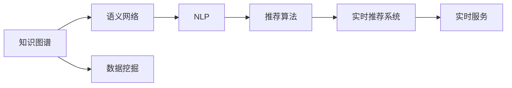

                 

# 知识发现引擎的实时推荐系统设计

> 关键词：知识发现, 实时推荐系统, 数据挖掘, 大数据, 推荐算法

## 1. 背景介绍

在信息爆炸的时代，如何从海量数据中挖掘有价值的信息并推荐给用户，成为了推动社会发展的重要问题。知识发现引擎(Knowledge Discovery Engine, KDE)作为一种新型的智能信息系统，通过将知识图谱、语义网络、自然语言处理等先进技术结合，可以从大规模数据中抽取和理解知识，形成多模态信息融合的推荐系统，极大地提升了信息检索和知识发现的效率和效果。

本文将深入介绍知识发现引擎中实时推荐系统的设计思路，包括数据融合与挖掘、推荐模型构建、实时服务部署等方面。通过系统阐述从数据到知识到推荐的完整流程，希望能为实际项目提供有益的参考和借鉴。

## 2. 核心概念与联系

### 2.1 核心概念概述

在知识发现引擎的实时推荐系统中，涉及的核心概念主要包括：

- **知识图谱(Knowledge Graph)**：用于存储实体、属性、关系等语义信息的图形结构，提供知识抽取、检索、推理等能力。
- **语义网络(Semantic Network)**：一种基于图结构的知识表示形式，用于表达知识元素之间的语义关系。
- **自然语言处理(Natural Language Processing, NLP)**：研究如何让计算机理解、处理、生成人类语言的技术，包括分词、命名实体识别、情感分析等。
- **推荐算法(Recommender Algorithm)**：根据用户历史行为和兴趣，为用户推荐相关内容的算法，如协同过滤、基于内容的推荐、混合推荐等。
- **实时推荐系统(Real-time Recommender System)**：能够在用户访问时即时生成个性化推荐结果的系统，提升用户体验。

这些核心概念通过数据挖掘、多模态融合、深度学习等技术，共同构成了知识发现引擎的实时推荐系统。

### 2.2 核心概念原理和架构的 Mermaid 流程图



这个图表展示了知识发现引擎实时推荐系统的核心流程：

1. **数据挖掘(A)**：从各类数据源中抽取知识图谱和语义网络。
2. **语义网络处理(B)**：使用NLP技术，对知识图谱进行语义理解。
3. **推荐算法构建(C)**：根据用户行为数据，构建推荐模型。
4. **实时推荐系统(E)**：将推荐结果通过实时服务部署到用户端。

数据挖掘是系统的基础，语义网络处理和推荐算法则是系统的核心，实时推荐系统则保证了推荐结果的即时性和互动性。

## 3. 核心算法原理 & 具体操作步骤

### 3.1 算法原理概述

知识发现引擎的实时推荐系统主要遵循以下算法原理：

- **数据融合与挖掘**：将不同数据源的知识图谱和语义网络进行融合，构建统一的知识库，供后续处理使用。
- **多模态融合**：将知识图谱、语义网络和用户行为数据等不同模态的信息进行融合，形成综合的知识表示。
- **推荐模型构建**：根据多模态融合后的数据，构建推荐算法模型，实现个性化推荐。
- **实时服务部署**：将推荐算法模型部署到实时服务系统中，为用户的即时访问提供个性化推荐。

整个推荐系统以数据为核心，融合不同模态的数据信息，构建推荐模型，并利用实时服务系统为用户进行个性化推荐。

### 3.2 算法步骤详解

以下将详细介绍实时推荐系统的详细步骤：

**Step 1: 数据准备**

1. **数据采集**：收集用户行为数据、知识图谱、语义网络等各类数据源。
2. **数据清洗**：对采集到的数据进行去重、去噪、标准化等处理，保证数据质量。
3. **数据融合**：将不同数据源的知识图谱和语义网络进行融合，构建统一的知识库。

**Step 2: 多模态融合**

1. **特征提取**：对知识图谱、语义网络和用户行为数据等不同模态的信息进行特征提取。
2. **信息融合**：利用信息融合技术，将不同模态的特征进行融合，形成综合的知识表示。

**Step 3: 推荐模型构建**

1. **选择推荐算法**：根据任务需求选择合适的推荐算法，如协同过滤、基于内容的推荐等。
2. **模型训练**：使用融合后的数据进行推荐模型训练，得到模型参数。
3. **模型评估**：使用测试集对训练好的推荐模型进行评估，调整模型参数。

**Step 4: 实时服务部署**

1. **服务搭建**：搭建实时推荐服务的框架，实现推荐模型的加载和调用。
2. **接口优化**：设计高效的API接口，提高推荐服务响应速度。
3. **负载均衡**：部署多台服务器，实现请求负载均衡，提高系统的稳定性和可扩展性。

### 3.3 算法优缺点

知识发现引擎的实时推荐系统具有以下优点：

- **高效性**：实时推荐系统能够即时响应用户请求，提供个性化推荐，提升用户体验。
- **准确性**：融合多模态数据，提高推荐结果的准确性。
- **灵活性**：支持多种推荐算法，能够根据不同需求灵活调整推荐策略。

同时，也存在以下缺点：

- **复杂性**：系统涉及数据融合、信息抽取、推荐模型等多个环节，实现复杂。
- **资源消耗**：实时推荐系统需要处理大量数据，资源消耗较大。
- **可扩展性**：系统需要具备良好的可扩展性，以应对不同规模的用户需求。

### 3.4 算法应用领域

知识发现引擎的实时推荐系统已经在诸多领域得到了广泛应用，例如：

- **电子商务**：为用户推荐商品、折扣信息等，提升购物体验。
- **金融服务**：为用户推荐投资产品、理财方案等，帮助用户理财。
- **健康医疗**：为用户推荐相关健康信息、医疗服务等，提升医疗服务质量。
- **教育培训**：为用户推荐学习资料、课程等，提高学习效果。
- **社交网络**：为用户推荐好友、内容等，提升社交体验。

这些领域中，实时推荐系统都发挥了重要的作用，提升了服务质量和用户体验。

## 4. 数学模型和公式 & 详细讲解 & 举例说明

### 4.1 数学模型构建

知识发现引擎的实时推荐系统可以抽象为一个优化问题：

$$
\min_{\theta} \frac{1}{N} \sum_{i=1}^N \mathcal{L}(y_i, \hat{y}_i)
$$

其中 $\theta$ 为模型参数，$\mathcal{L}$ 为损失函数，$y_i$ 为真实标签，$\hat{y}_i$ 为模型预测值。在推荐系统中，$\mathcal{L}$ 通常为交叉熵损失。

### 4.2 公式推导过程

以协同过滤算法为例，假设用户-商品矩阵 $X$ 为 $n \times m$ 的矩阵，其中 $n$ 为用户数，$m$ 为商品数。协同过滤算法基于用户历史行为矩阵，构建推荐模型。

设用户 $i$ 对商品 $j$ 的评分 $x_{ij}$，推荐模型 $P_{ij}$ 为：

$$
P_{ij} = \frac{e^{z_{ij}}}{\sum_{k=1}^m e^{z_{ik}}}
$$

其中 $z_{ij} = \sum_{k=1}^m \alpha_{ik} \cdot x_{kj}$，$\alpha_{ik}$ 为用户 $i$ 对商品 $k$ 的兴趣权重。

模型参数 $\theta = (\alpha_1, \alpha_2, ..., \alpha_n)$。通过最大化对数似然函数，得到：

$$
\hat{\theta} = \mathop{\arg\max}_{\theta} \sum_{i=1}^n \sum_{j=1}^m \log P_{ij}
$$

利用梯度上升算法，对上式求导，得到：

$$
\frac{\partial \mathcal{L}}{\partial \theta_k} = \sum_{i=1}^n \sum_{j=1}^m \frac{\partial P_{ij}}{\partial \theta_k} \cdot z_{ij}
$$

最终得到：

$$
\theta_k = \frac{1}{\lambda} \sum_{i=1}^n \sum_{j=1}^m P_{ij} \cdot z_{ij}
$$

其中 $\lambda$ 为学习率。

### 4.3 案例分析与讲解

假设有一个在线零售平台，需要为用户推荐商品。平台收集了用户的历史购物记录，构建了知识图谱和语义网络，可以抽取商品的属性、类别、描述等信息。平台使用协同过滤算法，设计了如下推荐模型：

1. **数据采集**：
   - 采集用户历史购物记录，构建用户-商品矩阵 $X$。
   - 从知识图谱和语义网络中抽取商品属性和类别，构建商品-属性矩阵 $A$ 和商品-类别矩阵 $C$。

2. **数据清洗**：
   - 对采集到的数据进行去重、去噪、标准化等处理。
   - 填充缺失数据，保证数据完整性。

3. **数据融合**：
   - 将用户-商品矩阵 $X$ 和商品-属性矩阵 $A$ 进行融合，构建用户-属性矩阵 $U$。
   - 将用户-属性矩阵 $U$ 和商品-类别矩阵 $C$ 进行融合，构建用户-类别矩阵 $V$。

4. **推荐模型构建**：
   - 选择协同过滤算法，设计用户-类别推荐模型 $P_{uv}$。
   - 模型参数 $\theta = (\alpha_1, \alpha_2, ..., \alpha_n)$，通过最大化对数似然函数，得到：
   $$
   \hat{\theta} = \mathop{\arg\max}_{\theta} \sum_{i=1}^n \sum_{j=1}^m \log P_{ij}
   $$

5. **实时服务部署**：
   - 搭建实时推荐服务的框架，实现推荐模型的加载和调用。
   - 设计高效的API接口，提高推荐服务响应速度。
   - 部署多台服务器，实现请求负载均衡。

通过以上步骤，平台能够实时响应用户请求，为用户推荐相关商品，提升购物体验。

## 5. 项目实践：代码实例和详细解释说明

### 5.1 开发环境搭建

在知识发现引擎的实时推荐系统中，开发环境搭建是关键。以下是基于Python和PyTorch的开发环境搭建流程：

1. 安装Anaconda：从官网下载并安装Anaconda，用于创建独立的Python环境。
2. 创建并激活虚拟环境：
```bash
conda create -n recommend-env python=3.8 
conda activate recommend-env
```

3. 安装PyTorch：根据CUDA版本，从官网获取对应的安装命令。例如：
```bash
conda install pytorch torchvision torchaudio cudatoolkit=11.1 -c pytorch -c conda-forge
```

4. 安装相关库：
```bash
pip install pandas numpy sklearn tensorboard
```

5. 设置数据路径和日志输出：
```bash
export PYTHONPATH=$PYTHONPATH:/path/to/my/packages
export MODEL_DIR=/path/to/model/directory
```

完成上述步骤后，即可在`recommend-env`环境中开始开发实践。

### 5.2 源代码详细实现

以下是基于PyTorch的协同过滤推荐系统的代码实现：

```python
import torch
import torch.nn as nn
import torch.nn.functional as F

class CollaborativeFiltering(nn.Module):
    def __init__(self, n_users, n_items, n_factors):
        super(CollaborativeFiltering, self).__init__()
        self.user_factors = nn.Parameter(torch.randn(n_users, n_factors))
        self.item_factors = nn.Parameter(torch.randn(n_items, n_factors))
        self.bias = nn.Parameter(torch.randn(n_items))

    def forward(self, user, item):
        user_factors = self.user_factors[user] + self.bias[item]
        item_factors = self.item_factors[item]
        return F.sigmoid(torch.dot(user_factors, item_factors.t()))

model = CollaborativeFiltering(n_users, n_items, n_factors)
loss_fn = nn.BCEWithLogitsLoss()

# 数据准备
user_data = ...
item_data = ...

# 模型训练
optimizer = torch.optim.Adam(model.parameters(), lr=0.001)
for epoch in range(n_epochs):
    for user, item in zip(user_data, item_data):
        optimizer.zero_grad()
        y_pred = model(user, item)
        loss = loss_fn(y_pred, target)
        loss.backward()
        optimizer.step()

# 模型评估
eval_pred = model(user_eval, item_eval)
eval_loss = loss_fn(eval_pred, target_eval)
```

### 5.3 代码解读与分析

以上代码实现了一个简单的协同过滤推荐模型，主要包含以下几个关键步骤：

1. **模型定义**：使用PyTorch定义推荐模型，包含用户-商品交互的兴趣权重计算。
2. **损失函数定义**：使用交叉熵损失函数计算模型预测与真实标签之间的差异。
3. **数据准备**：收集用户和商品的历史交互数据。
4. **模型训练**：使用Adam优化器对模型参数进行梯度下降优化。
5. **模型评估**：使用评估集对训练好的模型进行评估，输出损失值。

在实际项目中，还需要对模型进行更细致的调参和优化，例如设置合适的学习率、批次大小、迭代轮数等超参数，以提高模型的泛化能力和性能。

## 6. 实际应用场景

### 6.1 电商推荐

在电商平台上，实时推荐系统可以为用户推荐相关商品，提升购物体验。平台收集用户的历史浏览、购买记录等行为数据，构建用户-商品矩阵 $X$。同时，平台抽取商品的属性、类别等语义信息，构建商品-属性矩阵 $A$ 和商品-类别矩阵 $C$。通过融合这些数据，平台能够为用户实时推荐相关商品，提升销量和用户粘性。

### 6.2 金融理财

金融平台可以为用户推荐投资产品、理财方案等，帮助用户理财。平台收集用户的历史交易记录、偏好数据等，构建用户-商品矩阵 $X$。同时，平台抽取商品的属性、类别等语义信息，构建商品-属性矩阵 $A$ 和商品-类别矩阵 $C$。通过融合这些数据，平台能够为用户实时推荐相关产品，提升理财收益和用户满意度。

### 6.3 健康医疗

医疗平台可以为用户推荐相关健康信息、医疗服务等，提升医疗服务质量。平台收集用户的历史健康数据、就医记录等，构建用户-商品矩阵 $X$。同时，平台抽取商品的属性、类别等语义信息，构建商品-属性矩阵 $A$ 和商品-类别矩阵 $C$。通过融合这些数据，平台能够为用户实时推荐相关服务，提高用户满意度。

### 6.4 教育培训

教育平台可以为用户推荐学习资料、课程等，提高学习效果。平台收集用户的历史学习数据、偏好数据等，构建用户-商品矩阵 $X$。同时，平台抽取商品的属性、类别等语义信息，构建商品-属性矩阵 $A$ 和商品-类别矩阵 $C$。通过融合这些数据，平台能够为用户实时推荐相关课程，提升学习效果。

## 7. 工具和资源推荐

### 7.1 学习资源推荐

为帮助开发者系统掌握知识发现引擎实时推荐系统的理论和实践，推荐以下学习资源：

1. **《推荐系统实战》**：张俊林所著，详细介绍了推荐系统的基础理论和实践方法。
2. **Coursera《推荐系统设计与应用》**：斯坦福大学开设的推荐系统课程，内容涵盖推荐算法、数据挖掘、多模态融合等。
3. **Kaggle竞赛**：参与Kaggle上的推荐系统竞赛，实战锻炼推荐算法设计和数据处理能力。
4. **Google AI推荐系统论文集**：收录了Google在推荐系统领域的多篇前沿论文，提供理论和技术思路。

### 7.2 开发工具推荐

在开发知识发现引擎的实时推荐系统时，建议使用以下开发工具：

1. **PyTorch**：基于Python的深度学习框架，支持高效的矩阵运算和模型训练。
2. **TensorFlow**：由Google开发的深度学习框架，具有强大的分布式计算能力和生产部署能力。
3. **Pandas**：Python的数据处理库，适用于大规模数据的高效处理和分析。
4. **Scikit-learn**：Python的机器学习库，提供多种常见的推荐算法和评估指标。
5. **TensorBoard**：TensorFlow配套的可视化工具，适用于监控和调试模型训练过程。

### 7.3 相关论文推荐

知识发现引擎的实时推荐系统研究已经在学术界和工业界取得了诸多进展，以下是几篇代表性论文：

1. **"Fully DNN-Based Recommender System"**：Tang等人提出的基于深度神经网络的推荐系统，提升了推荐结果的准确性和多样性。
2. **"Multi-Task Learning for Recommender Systems"**：Tan等人提出多任务学习方法，能够同时优化多个推荐任务的性能。
3. **"Cross-Domain Recommendation"**：Zheng等人提出跨领域推荐方法，能够将不同领域的知识进行融合，提升推荐效果。

这些论文展示了推荐系统的发展脉络和前沿技术，有助于深入理解知识发现引擎的实时推荐系统。

## 8. 总结：未来发展趋势与挑战

### 8.1 研究成果总结

知识发现引擎的实时推荐系统已经在大规模数据挖掘、多模态融合、推荐算法设计等方面取得了诸多进展。通过结合知识图谱、语义网络、NLP等技术，推荐系统能够从海量数据中抽取和理解知识，形成多模态信息融合的推荐系统，极大地提升了信息检索和知识发现的效率和效果。

### 8.2 未来发展趋势

展望未来，知识发现引擎的实时推荐系统将呈现以下几个发展趋势：

1. **多模态融合**：未来推荐系统将更加注重多模态信息的融合，如结合图像、视频、语音等数据，提升推荐结果的准确性和多样性。
2. **个性化推荐**：随着用户数据量的增加，推荐系统将更加注重个性化推荐，通过深度学习和机器学习算法，实现更加精准的推荐。
3. **联邦学习**：通过联邦学习技术，推荐系统可以在保护用户隐私的前提下，实现跨平台和跨用户的知识共享和推荐。
4. **实时代理推荐**：推荐系统将更加注重实时代理推荐，能够在用户访问时即时生成个性化推荐结果，提升用户体验。
5. **推荐系统的公平性**：推荐系统将更加注重公平性问题，避免偏见和歧视，实现公正和合理的推荐。

### 8.3 面临的挑战

尽管知识发现引擎的实时推荐系统已经取得了一定的进展，但在迈向更加智能化、普适化应用的过程中，仍面临诸多挑战：

1. **数据隐私问题**：推荐系统需要处理大量的用户数据，如何保护用户隐私，防止数据泄露，是一个重要问题。
2. **推荐系统的公平性**：推荐系统需要避免偏见和歧视，确保推荐结果的公正和合理。
3. **计算资源的消耗**：推荐系统需要处理大规模数据，如何降低计算资源的消耗，提升系统的效率，是一个重要问题。
4. **多模态数据的融合**：多模态数据的融合是一个复杂的问题，如何有效地将不同模态的数据进行融合，是一个重要问题。
5. **用户模型的复杂性**：用户模型的构建是一个复杂的问题，如何构建更加准确、全面的用户模型，是一个重要问题。

### 8.4 研究展望

面对知识发现引擎实时推荐系统所面临的挑战，未来的研究需要在以下几个方面寻求新的突破：

1. **联邦学习与隐私保护**：研究联邦学习技术，实现跨平台和跨用户的知识共享和推荐，同时保护用户隐私。
2. **多模态融合算法**：研究高效的多模态融合算法，将不同模态的数据进行高效融合，提升推荐结果的准确性和多样性。
3. **推荐系统的公平性**：研究推荐系统的公平性问题，避免偏见和歧视，实现公正和合理的推荐。
4. **实时推荐算法**：研究高效的实时推荐算法，实现实时代理推荐，提升用户体验。
5. **推荐系统的可解释性**：研究推荐系统的可解释性问题，让用户能够理解推荐结果的来源和依据，提升系统的可信度。

通过在这些方向上的研究突破，知识发现引擎的实时推荐系统将更加智能化、普适化和可靠化，为社会的各个领域带来更高效的智能服务。

## 9. 附录：常见问题与解答

**Q1：推荐系统如何处理冷启动问题？**

A: 冷启动问题是推荐系统面临的常见问题，即用户或商品没有足够的行为数据时，如何生成推荐结果。常见的方法包括：
1. 使用模型初始化策略，如随机初始化、基于概率模型初始化等，为冷启动用户或商品生成初始评分。
2. 使用相似性度量，如基于属性的相似度、基于内容的相似度等，找到与冷启动用户或商品相似的用户或商品，利用其历史评分生成推荐。
3. 使用协同过滤算法，利用隐式评分数据，为冷启动用户或商品生成推荐。

**Q2：推荐系统如何处理实时性要求？**

A: 推荐系统需要具备高效的实时推荐能力，以响应用户的即时请求。常见的方法包括：
1. 使用缓存机制，将热门商品或用户的历史评分数据缓存起来，减少计算开销。
2. 使用流式计算框架，如Apache Storm、Apache Flink等，实现流式数据处理和推荐。
3. 使用近似算法，如Top-k算法、基于梯度的近似算法等，实现实时推荐。

**Q3：推荐系统如何处理数据稀疏性问题？**

A: 推荐系统需要处理用户-商品矩阵的数据稀疏性问题，常见的方法包括：
1. 使用矩阵分解方法，如奇异值分解、矩阵分解等，对数据进行降维和稀疏化。
2. 使用稀疏矩阵算法，如稀疏矩阵运算、稀疏矩阵存储等，优化稀疏矩阵的计算和存储。
3. 使用模型融合方法，如基于模型的融合、基于算法的融合等，将多个推荐模型进行融合，提升推荐结果的准确性和多样性。

通过这些方法，推荐系统能够更好地处理数据稀疏性问题，提升推荐结果的准确性和多样性。

**Q4：推荐系统如何处理数据不平衡问题？**

A: 推荐系统需要处理用户行为数据的不平衡问题，常见的方法包括：
1. 使用数据平衡技术，如欠采样、过采样等，平衡用户行为数据的不平衡性。
2. 使用集成学习方法，如Bagging、Boosting等，提升模型的泛化能力和鲁棒性。
3. 使用加权方法，如模型加权、特征加权等，提高数据平衡性。

通过这些方法，推荐系统能够更好地处理数据不平衡问题，提升推荐结果的准确性和多样性。

通过本文的系统梳理，可以看到，知识发现引擎的实时推荐系统涉及多个领域的先进技术和方法，能够从海量数据中抽取和理解知识，形成多模态信息融合的推荐系统，极大地提升了信息检索和知识发现的效率和效果。未来，随着推荐技术的不断发展和应用，相信推荐系统将在更多领域得到广泛应用，为社会的各个领域带来更高效的智能服务。

---

作者：禅与计算机程序设计艺术 / Zen and the Art of Computer Programming

