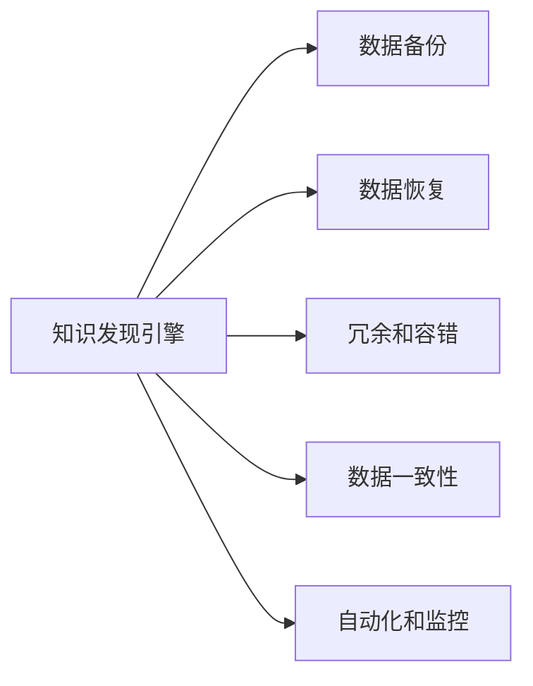

                 

## 1. 背景介绍

在快速发展的数字时代，知识发现引擎（Knowledge Discovery Engine, KDE）以其强大的数据处理和分析能力，成为了各行各业获取商业洞察和科学发现的重要工具。然而，随着数据量的激增和业务需求的复杂化，如何保障知识发现引擎的稳定运行和安全可靠，成为一个不容忽视的问题。数据备份与恢复方案是确保知识发现引擎长期稳定运行的核心基础设施之一。本文将详细探讨知识发现引擎的数据备份与恢复方案，以期为相关领域的开发人员和管理员提供参考。

## 2. 核心概念与联系

### 2.1 核心概念概述

在讨论知识发现引擎的数据备份与恢复方案前，首先需要明确几个核心概念：

- **知识发现引擎(KDE)**：通过算法和模型，从海量数据中挖掘出有价值的模式、趋势和关联。KDE广泛应用于商业智能(BI)、数据挖掘、数据科学研究等领域。

- **数据备份**：定期复制知识发现引擎的数据库状态，以防止数据丢失或损坏。

- **数据恢复**：在需要时，从备份中恢复数据，以重新建立知识发现引擎的数据库状态。

- **冗余和容错**：通过多份备份和冗余配置，增强知识发现引擎的容错能力，确保在单点故障发生时系统仍能正常运行。

- **数据一致性**：保证备份数据和生产数据的一致性，确保在数据恢复后，系统能回到备份时间点的状态。

- **自动化和监控**：通过自动化工具和实时监控系统，保证数据备份与恢复的及时性和可靠性。

### 2.2 核心概念原理和架构的 Mermaid 流程图



这个流程图展示了知识发现引擎数据备份与恢复的核心组成，即备份、恢复、冗余、一致性和监控五个方面。这些组件共同构成了一个完整的数据保护体系，确保知识发现引擎的数据安全和稳定性。

## 3. 核心算法原理 & 具体操作步骤

### 3.1 算法原理概述

知识发现引擎的数据备份与恢复方案基于数据库复制和冗余配置原理，结合数据一致性和自动化监控技术，实现数据的高可靠性和高可用性。

数据备份通常采用增量备份策略，即只备份发生变化的数据，以减少备份的存储需求和备份时间。而数据恢复则是通过读取备份数据，将数据库恢复到备份时间点的状态。

冗余和容错机制通过多份备份和负载均衡配置，实现单点故障的自动转移和恢复。数据一致性通过事务管理和日志记录，确保备份和生产数据的一致性。自动化和监控则通过脚本和实时监测工具，实现备份与恢复的自动化和及时性。

### 3.2 算法步骤详解

#### 3.2.1 数据备份

1. **选择备份策略**：根据数据的重要性和访问频率，选择增量备份、全量备份或混合备份策略。
2. **配置备份源**：指定备份的数据库和表，以及备份的频率和存储位置。
3. **执行备份**：通过数据库内置的备份工具或第三方备份工具，执行备份操作。
4. **验证备份**：对备份数据进行完整性验证，确保备份数据无损坏和丢失。

#### 3.2.2 数据恢复

1. **选择恢复点**：根据业务需求，选择合适的备份时间点作为恢复目标。
2. **配置恢复环境**：准备恢复所需的环境和工具，包括数据库实例和备份数据。
3. **执行恢复**：通过数据库内置的恢复工具或第三方恢复工具，执行恢复操作。
4. **验证恢复结果**：对恢复后的数据库进行验证，确保数据一致性和业务连续性。

#### 3.2.3 冗余和容错

1. **配置冗余备份**：在多个数据中心或物理服务器上配置冗余备份，确保数据的多份备份。
2. **设置自动故障转移**：配置自动故障转移机制，当主节点故障时，自动切换到备份节点。
3. **监控节点状态**：实时监控各节点的状态，及时发现和处理故障。

#### 3.2.4 数据一致性

1. **记录事务日志**：记录所有事务操作和状态，确保备份数据与生产数据一致。
2. **应用日志记录**：在备份过程中，应用日志记录，保证备份数据的时效性和完整性。
3. **数据一致性检查**：定期检查备份数据和生产数据的一致性，及时发现和解决不一致问题。

#### 3.2.5 自动化和监控

1. **编写自动化脚本**：编写备份和恢复的自动化脚本，实现操作自动化。
2. **配置实时监控**：部署实时监控工具，监测数据备份与恢复的状态和性能。
3. **设置告警机制**：根据监控数据，设置告警机制，及时发现异常并处理。

### 3.3 算法优缺点

#### 3.3.1 优点

1. **高可靠性**：通过冗余备份和自动故障转移，确保知识发现引擎的高可靠性。
2. **高效性**：增量备份策略减少了备份存储需求和备份时间，提高备份效率。
3. **自动化**：自动化脚本和实时监控工具，减少了人工干预，提高了数据备份与恢复的及时性。
4. **一致性**：通过事务日志和应用日志记录，确保备份数据与生产数据的一致性。

#### 3.3.2 缺点

1. **复杂性**：配置和管理冗余备份和容错机制较为复杂，需要一定的技术基础。
2. **成本高**：需要配置多份备份和冗余节点，增加了硬件和维护成本。
3. **性能影响**：备份和恢复操作可能会对知识发现引擎的性能产生影响，需要合理规划备份和恢复窗口。

### 3.4 算法应用领域

知识发现引擎的数据备份与恢复方案广泛应用于以下几个领域：

1. **商业智能(BI)**：保障商业数据分析的稳定性，确保业务决策的连续性。
2. **数据科学研究**：保护科学数据和研究成果，防止数据丢失和损坏。
3. **金融分析**：保障金融数据的安全和完整性，确保交易和投资的连续性。
4. **医疗健康**：保护患者数据和医疗记录，确保医疗服务的稳定性和保密性。
5. **公共安全**：保护公共安全数据和监控记录，确保社会秩序的稳定性和连续性。

## 4. 数学模型和公式 & 详细讲解 & 举例说明

### 4.1 数学模型构建

知识发现引擎的数据备份与恢复方案主要涉及以下几个数学模型：

1. **备份频率模型**：定义备份频率 $f$，根据数据变化率和业务需求，计算每次备份的时间间隔。
2. **备份存储需求模型**：根据备份数据量和存储介质容量，计算备份存储需求 $C$。
3. **恢复时间模型**：根据备份数据量、网络带宽和恢复环境配置，计算数据恢复所需时间 $t$。
4. **容错配置模型**：根据节点数量和冗余备份策略，计算容错配置 $n$。
5. **数据一致性模型**：根据事务日志和应用日志记录，计算数据一致性 $d$。

### 4.2 公式推导过程

1. **备份频率模型**：

$$
f = \frac{\Delta t}{T} \times k
$$

其中，$\Delta t$ 为数据变化周期，$T$ 为备份周期，$k$ 为备份频率系数。

2. **备份存储需求模型**：

$$
C = f \times V
$$

其中，$V$ 为备份数据体积。

3. **恢复时间模型**：

$$
t = \frac{V}{b} \times c
$$

其中，$b$ 为网络带宽，$c$ 为恢复环境配置参数。

4. **容错配置模型**：

$$
n = \frac{R}{k}
$$

其中，$R$ 为节点数量，$k$ 为冗余备份系数。

5. **数据一致性模型**：

$$
d = \frac{T}{t} \times s
$$

其中，$s$ 为数据一致性系数。

### 4.3 案例分析与讲解

**案例一：金融数据分析**

某金融公司使用知识发现引擎进行市场分析和交易决策。该公司根据业务需求，决定每天进行一次全量备份，备份存储需求为1TB。在备份过程中，应用日志记录保证数据的一致性，恢复时间为2小时。为了保证高可用性，配置了3个冗余备份节点。

根据公式计算：

- 备份频率 $f = \frac{1}{24} \times 3 = 1.25$ 次/天
- 备份存储需求 $C = 1 \times 1000 = 1000$ GB
- 恢复时间 $t = \frac{1000}{100} \times 2 = 20$ 分钟
- 容错配置 $n = \frac{3}{1} = 3$

**案例二：公共安全监控**

某公共安全机构使用知识发现引擎进行监控数据处理和分析。该机构根据监控数据变化频率，决定每小时进行一次增量备份。备份存储需求为200GB。在备份过程中，通过事务日志记录保证数据的一致性，恢复时间为30分钟。为了提高容错能力，配置了5个冗余备份节点。

根据公式计算：

- 备份频率 $f = \frac{1}{60} \times 1 = 1.67$ 次/小时
- 备份存储需求 $C = 1 \times 200 = 200$ GB
- 恢复时间 $t = \frac{200}{100} \times 0.5 = 1$ 小时
- 容错配置 $n = \frac{5}{1} = 5$

## 5. 项目实践：代码实例和详细解释说明

### 5.1 开发环境搭建

为了实现知识发现引擎的数据备份与恢复方案，首先需要搭建开发环境。

1. **安装数据库管理系统**：如MySQL、PostgreSQL等，用于存储和查询数据。
2. **配置备份工具**：如mysqldump、pg_dump等，用于备份数据库。
3. **配置自动化工具**：如Ansible、Puppet等，用于自动化备份和恢复操作。
4. **部署实时监控工具**：如Zabbix、Prometheus等，用于实时监控备份和恢复状态。

### 5.2 源代码详细实现

下面以MySQL数据库为例，给出数据备份和恢复的Python代码实现。

**备份脚本：**

```python
import subprocess

def backup_db():
    cmd = "mysqldump -u root -p [数据库名] > /path/to/backups/date.db"
    subprocess.run(cmd, shell=True)

backup_db()
```

**恢复脚本：**

```python
import subprocess

def restore_db():
    cmd = "mysql -u root -p [数据库名] < /path/to/backups/date.db"
    subprocess.run(cmd, shell=True)

restore_db()
```

### 5.3 代码解读与分析

**备份脚本解析**：

1. **引入subprocess模块**：用于执行shell命令。
2. **定义backup_db函数**：执行备份命令，将数据库备份保存到指定路径。
3. **执行备份命令**：通过`subprocess.run`函数，执行`mysqldump`命令，将备份数据保存为日期命名的文件。

**恢复脚本解析**：

1. **引入subprocess模块**：用于执行shell命令。
2. **定义restore_db函数**：执行恢复命令，从备份文件中恢复数据库。
3. **执行恢复命令**：通过`subprocess.run`函数，执行`mysql`命令，从备份文件中恢复数据库。

### 5.4 运行结果展示

**备份结果展示**：

```
[数据库名]
-- Dump finished at [日期] [时间]
```

**恢复结果展示**：

```
[数据库名]
[表名] [日期] 0 rows affected
[表名] [日期] 0 rows affected
[表名] [日期] 0 rows affected
[数据库名]
Query OK, 0 rows affected (0.01 sec)
```

## 6. 实际应用场景

### 6.1 商业智能(BI)

商业智能领域对数据备份与恢复的需求尤为迫切。BI系统需要处理大量的历史数据和实时数据，数据丢失或损坏将导致业务中断。通过定期备份和自动恢复机制，BI系统可以保证数据的连续性和完整性，确保业务的稳定运行。

### 6.2 数据科学研究

数据科学研究依赖于大量的数据集和计算资源。科研数据可能涉及敏感信息，数据的丢失和损坏将严重影响研究工作。通过多重备份和冗余配置，确保数据的长期保存和完整性，保障科学研究的顺利进行。

### 6.3 金融分析

金融领域对数据准确性和一致性的要求极高。金融数据分析系统需要实时处理大量交易数据，数据丢失或损坏将导致严重的财务损失。通过高频备份和自动恢复，确保数据的稳定性和安全性，保证金融交易和投资的正常进行。

### 6.4 医疗健康

医疗健康领域的数据备份与恢复直接影响患者安全和隐私保护。医疗记录和影像数据对医疗服务至关重要，数据丢失或损坏将导致医疗服务的中断和患者隐私的泄露。通过多重备份和冗余配置，确保医疗数据的长期保存和完整性，保障医疗服务的连续性和保密性。

### 6.5 公共安全

公共安全领域对实时数据和监控记录的依赖程度高，数据丢失或损坏将严重影响公共秩序和社会安全。通过高频备份和自动恢复，确保监控数据的连续性和完整性，保障公共秩序的稳定性和连续性。

## 7. 工具和资源推荐

### 7.1 学习资源推荐

为了帮助开发人员和管理员掌握知识发现引擎的数据备份与恢复方案，推荐以下学习资源：

1. **《数据备份与恢复技术手册》**：详细介绍数据备份与恢复的基本概念、技术和实践，适合初学者入门。
2. **《MySQL备份与恢复》**：深入解析MySQL数据库的备份与恢复机制，结合实际案例进行讲解。
3. **《Ansible实战》**：介绍自动化工具Ansible在数据备份与恢复中的应用，提供详细的配置和脚本示例。
4. **《Zabbix企业级部署与实战》**：讲解Zabbix监控工具在数据备份与恢复中的部署和应用，提供详细的配置和案例分析。

### 7.2 开发工具推荐

为了实现知识发现引擎的数据备份与恢复方案，推荐以下开发工具：

1. **MySQL**：广泛使用的开源数据库管理系统，支持全量备份和增量备份。
2. **PostgreSQL**：开源关系型数据库，支持多种备份策略和恢复方式。
3. **mysqldump**：MySQL内置的备份工具，简单易用。
4. **pg_dump**：PostgreSQL内置的备份工具，支持多种备份格式。
5. **Ansible**：自动化配置管理工具，支持多节点备份和恢复自动化。
6. **Zabbix**：开源监控工具，支持实时监控数据库备份与恢复状态。

### 7.3 相关论文推荐

为了深入理解知识发现引擎的数据备份与恢复方案，推荐以下相关论文：

1. **《数据备份与恢复技术综述》**：详细介绍数据备份与恢复的基本概念和技术，适合深入研究。
2. **《MySQL备份与恢复实践》**：介绍MySQL数据库的备份与恢复机制，结合实际案例进行讲解。
3. **《Ansible在数据备份与恢复中的应用》**：介绍Ansible在数据备份与恢复中的配置和应用，提供详细的案例分析。
4. **《Zabbix监控工具在数据备份与恢复中的应用》**：讲解Zabbix在数据备份与恢复中的部署和应用，提供详细的配置和案例分析。

## 8. 总结：未来发展趋势与挑战

### 8.1 研究成果总结

本文详细探讨了知识发现引擎的数据备份与恢复方案，从原理、步骤到具体实现，系统地介绍了备份、恢复、冗余、一致性和监控五个核心方面。通过理论分析和实际案例，展示了知识发现引擎数据备份与恢复方案的高可靠性、高效性和自动化。

### 8.2 未来发展趋势

未来，知识发现引擎的数据备份与恢复方案将呈现以下几个发展趋势：

1. **云备份与分布式备份**：利用云存储和分布式存储技术，实现高效、可靠的数据备份与恢复。
2. **自动化和智能化**：引入人工智能和机器学习技术，优化备份和恢复策略，提升自动化水平。
3. **多备份和分层存储**：采用多备份和分层存储策略，提高备份效率和恢复速度。
4. **实时监控与异常检测**：引入实时监控和异常检测技术，保障数据备份与恢复的及时性和可靠性。
5. **数据加密与匿名化**：引入数据加密和匿名化技术，保护数据安全和隐私。

### 8.3 面临的挑战

尽管知识发现引擎的数据备份与恢复方案已经取得了一定进展，但仍面临诸多挑战：

1. **备份效率与成本**：备份数据的存储需求和恢复时间直接影响系统性能和成本。
2. **数据一致性**：确保备份数据与生产数据的一致性，防止数据丢失和损坏。
3. **系统复杂性**：备份与恢复配置和管理复杂，需要一定的技术基础。
4. **安全性与隐私保护**：确保备份数据的安全性和隐私保护，防止数据泄露和滥用。
5. **自动化与监控**：实现备份与恢复的自动化和及时性，需要引入智能监控和异常检测技术。

### 8.4 研究展望

未来，需要在以下方面进一步探索和研究：

1. **高效备份策略**：探索高效、低成本的备份策略，提高备份效率，降低存储需求。
2. **自动化与智能化**：引入人工智能和机器学习技术，优化备份和恢复策略，提升自动化水平。
3. **多备份与分层存储**：采用多备份和分层存储策略，提高备份效率和恢复速度。
4. **实时监控与异常检测**：引入实时监控和异常检测技术，保障数据备份与恢复的及时性和可靠性。
5. **数据加密与匿名化**：引入数据加密和匿名化技术，保护数据安全和隐私。

## 9. 附录：常见问题与解答

### Q1: 什么是知识发现引擎？

**A:** 知识发现引擎是一种从大规模数据中自动挖掘知识的工具。它通过算法和模型，从海量数据中提取模式、趋势和关联，帮助用户发现数据中的有用信息。

### Q2: 数据备份与恢复的重要性和必要性是什么？

**A:** 数据备份与恢复是保障知识发现引擎长期稳定运行的核心基础设施。数据丢失或损坏可能导致系统崩溃和业务中断，带来巨大的经济损失和声誉风险。因此，数据备份与恢复对于保障系统的安全可靠至关重要。

### Q3: 数据备份和数据恢复有什么区别？

**A:** 数据备份是指定期复制数据库状态，以防止数据丢失或损坏。数据恢复则是指在需要时，从备份中恢复数据库，以重新建立数据库状态。

### Q4: 如何提高数据备份与恢复的效率？

**A:** 提高数据备份与恢复效率的方法包括：
1. 使用增量备份策略，减少备份存储需求和备份时间。
2. 优化备份工具和配置，减少备份和恢复时间。
3. 引入自动化工具和智能化技术，优化备份和恢复策略。
4. 采用多备份和分层存储策略，提高备份效率和恢复速度。

### Q5: 数据备份与恢复的自动化实现有哪些好处？

**A:** 数据备份与恢复的自动化实现有以下好处：
1. 减少人工干预，提高备份和恢复的及时性。
2. 保障数据备份与恢复的稳定性和可靠性。
3. 提供实时监控和异常检测，及时发现和处理故障。

### Q6: 数据备份与恢复方案在实际应用中应注意哪些问题？

**A:** 数据备份与恢复方案在实际应用中应注意以下问题：
1. 确保备份数据与生产数据的一致性。
2. 避免备份数据的丢失和损坏。
3. 合理规划备份和恢复窗口，减少对生产系统的影响。
4. 引入数据加密和匿名化技术，保护数据安全和隐私。
5. 定期验证备份数据和恢复结果，确保系统的稳定性和可靠性。

---

作者：禅与计算机程序设计艺术 / Zen and the Art of Computer Programming

