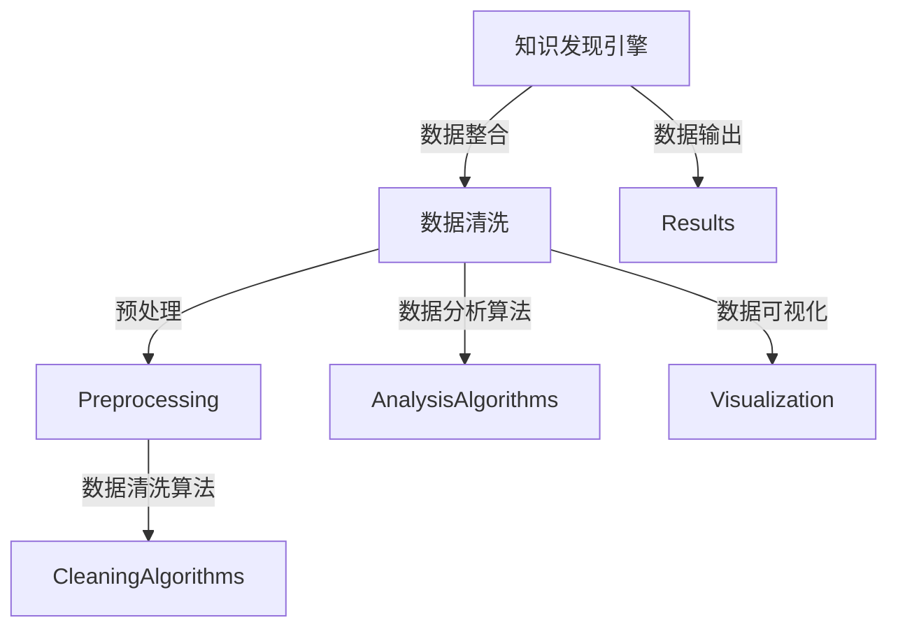

                 

# 知识发现引擎的数据清洗技术

> 关键词：数据清洗, 知识发现引擎, 数据预处理, 数据质量控制, 数据集成

## 1. 背景介绍

在现代信息技术高速发展的今天，大数据已逐渐渗透到各个行业，其应用范围也日益广泛，数据在决策、业务分析、客户管理、产品研发等方面具有重要意义。然而，由于数据来源广泛且数据质量参差不齐，使得从原始数据中提取有效信息变得异常复杂。在这样的背景下，数据清洗技术便应运而生，其在提高数据质量和保证数据准确性方面发挥着至关重要的作用。数据清洗是知识发现引擎(Knowledge Discovery Engine, KDE)数据预处理的核心环节之一，它能有效降低噪音数据对知识发现过程的干扰，提升数据整合效率和数据精度，从而保障知识发现结果的准确性和可信度。

## 2. 核心概念与联系

### 2.1 核心概念概述

数据清洗（Data Cleaning）是指对数据集中的错误、不一致、缺失或不完整数据进行检测和纠正的过程，旨在提高数据质量，为后续的数据分析和知识发现提供准确可靠的数据支撑。

知识发现引擎（KDE）是数据挖掘的一种工具，它能自动或半自动地从大量数据中抽取有价值的信息，并进行智能分析、模式识别和趋势预测，以支持决策者做出更科学的决策。

数据清洗和知识发现引擎之间存在密切联系：数据清洗是知识发现的前提，只有经过清洗的数据才能被有效地整合、分析和应用；而知识发现引擎则提供了清洗数据后的智能分析和应用工具，它通过不断优化算法和模型，能够从数据中提炼出更深层次的知识。

### 2.2 核心概念原理和架构的 Mermaid 流程图



这个流程图展示了数据清洗和知识发现引擎的核心环节和相互联系。

## 3. 核心算法原理 & 具体操作步骤

### 3.1 算法原理概述

数据清洗算法主要分为以下四类：数据修复、数据补全、数据去噪和数据规约。

- **数据修复**：指的是对数据集中的错误和异常值进行修正，常用的方法包括数据插值、均值填补和众数填补。
- **数据补全**：主要针对缺失值，通常采取的策略包括均值填补、中位数填补和回归填补。
- **数据去噪**：指通过数据过滤等方法去除噪声数据，如利用统计分析法、基于聚类的异常值检测和基于机器学习的异常值检测。
- **数据规约**：旨在减少数据量，提高处理效率，包括数据降维和属性选择等。

### 3.2 算法步骤详解

#### 3.2.1 数据修复

数据修复是数据清洗的首要步骤，主要针对数据集中存在的数据错误和异常值进行修正。

**步骤1：数据预处理**
- 数据去重：去除数据集中的重复记录，保证数据的唯一性。
- 数据类型转换：将数据集中的字段转换为正确的数据类型，保证数据的准确性。
- 数据标准化：将数据集中的数据进行归一化处理，保证数据的一致性。

**步骤2：错误检测**
- 缺失值检测：识别数据集中的缺失值，通常使用均值、中位数、众数等方法进行填补。
- 异常值检测：识别数据集中的异常值，常用的算法包括箱线图、Z-score和DBSCAN等。

**步骤3：错误修正**
- 数据插值：对于连续型数据，使用线性插值或多项式插值等方法进行填补。
- 均值填补：对于离散型数据，使用均值或中位数进行填补。
- 众数填补：对于分类数据，使用众数进行填补。

#### 3.2.2 数据补全

数据补全是数据清洗的重要环节，旨在对数据集中缺失的数据进行填补，常用的方法包括均值填补、中位数填补和回归填补。

**步骤1：缺失值检测**
- 识别数据集中的缺失值，通常使用均值、中位数、众数等方法进行填补。

**步骤2：填补策略**
- 均值填补：对于数值型数据，使用均值进行填补。
- 中位数填补：对于数值型数据，使用中位数进行填补。
- 众数填补：对于分类数据，使用众数进行填补。
- 回归填补：使用回归分析方法，如线性回归、岭回归等，对缺失值进行预测填补。

#### 3.2.3 数据去噪

数据去噪旨在去除数据集中的噪声，常用的方法包括数据过滤和基于机器学习的异常值检测。

**步骤1：数据过滤**
- 统计分析法：使用均值、中位数、标准差等统计量进行数据过滤。
- 聚类算法：使用K-means、DBSCAN等聚类算法进行异常值检测。

**步骤2：基于机器学习的异常值检测**
- 基于模型的方法：使用回归模型、分类模型等进行异常值检测。
- 基于距离的方法：使用KNN、K-Means等方法进行异常值检测。

#### 3.2.4 数据规约

数据规约旨在减少数据量，提高处理效率，常用的方法包括数据降维和属性选择。

**步骤1：数据降维**
- 主成分分析（PCA）：使用PCA对数据集进行降维处理，保留数据集的主要特征。
- 线性判别分析（LDA）：使用LDA对数据集进行降维处理，保留数据集的主要特征。

**步骤2：属性选择**
- 方差选择法：选择方差较大的属性，去除方差较小的属性。
- 相关系数法：选择相关性较高的属性，去除相关性较低的属性。
- 嵌入法：使用特征选择算法，如Lasso回归、随机森林等，对数据集进行属性选择。

### 3.3 算法优缺点

#### 3.3.1 优点

- **减少噪音数据干扰**：通过数据清洗，可以有效地去除数据集中的噪音和异常值，提高数据质量，减少噪音数据对知识发现过程的干扰。
- **提高数据整合效率**：通过数据清洗，可以统一数据格式，提高数据整合效率，保证数据的可比性和一致性。
- **保障数据精度**：通过数据清洗，可以提高数据的准确性，为后续的数据分析和知识发现提供可靠的数据支撑。

#### 3.3.2 缺点

- **计算复杂度高**：数据清洗需要大量的计算资源，尤其是在大规模数据集上进行清洗时，计算复杂度较高。
- **数据损失**：在数据清洗过程中，可能会丢失一些重要信息，影响数据完整性。
- **处理难度大**：数据清洗需要针对具体数据集进行针对性处理，不同类型的数据集需要不同的清洗策略，处理难度较大。

### 3.4 算法应用领域

数据清洗技术广泛应用于多个领域，包括但不限于以下：

- **金融领域**：用于清洗金融交易数据，保证金融分析的准确性和可信度。
- **医疗领域**：用于清洗医疗数据，保障医疗决策的科学性和可靠性。
- **电商领域**：用于清洗电商交易数据，提高客户分析的精度和效率。
- **社交媒体分析**：用于清洗社交媒体数据，提升用户行为分析的深度和广度。
- **环境监测**：用于清洗环境监测数据，提高环境监测的准确性和可靠性。

## 4. 数学模型和公式 & 详细讲解 & 举例说明

### 4.1 数学模型构建

数据清洗的数学模型主要包括以下几个部分：

- **数据检测模型**：用于检测数据集中的错误、异常值和缺失值。
- **数据修复模型**：用于对检测到的错误和异常值进行修正和填补。
- **数据去噪模型**：用于去除数据集中的噪声数据。
- **数据规约模型**：用于减少数据量，提高处理效率。

### 4.2 公式推导过程

#### 4.2.1 数据检测模型

数据检测模型的主要目标是识别数据集中的错误、异常值和缺失值，常用的公式包括：

$$
\hat{y} = f(x)
$$

其中，$x$ 表示数据集中的数据，$\hat{y}$ 表示模型预测的结果，$f(x)$ 表示检测模型的公式。

#### 4.2.2 数据修复模型

数据修复模型的主要目标是修正数据集中的错误和异常值，常用的公式包括：

$$
\hat{y} = \text{mean}(X)
$$

其中，$X$ 表示数据集中的数值型数据，$\text{mean}(X)$ 表示均值填补公式。

$$
\hat{y} = \text{median}(X)
$$

其中，$X$ 表示数据集中的数值型数据，$\text{median}(X)$ 表示中位数填补公式。

$$
\hat{y} = \text{mode}(X)
$$

其中，$X$ 表示数据集中的分类数据，$\text{mode}(X)$ 表示众数填补公式。

#### 4.2.3 数据去噪模型

数据去噪模型的主要目标是去除数据集中的噪声，常用的公式包括：

$$
\hat{y} = f(x, \theta)
$$

其中，$x$ 表示数据集中的数据，$\theta$ 表示模型的参数，$f(x, \theta)$ 表示去噪模型的公式。

#### 4.2.4 数据规约模型

数据规约模型的主要目标是减少数据量，常用的公式包括：

$$
\hat{X} = \text{PCA}(X)
$$

其中，$X$ 表示数据集中的数据，$\text{PCA}(X)$ 表示主成分分析公式。

$$
\hat{X} = \text{LDA}(X)
$$

其中，$X$ 表示数据集中的数据，$\text{LDA}(X)$ 表示线性判别分析公式。

### 4.3 案例分析与讲解

假设我们有一组数值型数据集，如下：

| 数据 | 1 | 2 | 3 | 4 | 5 |
| --- | --- | --- | --- | --- | --- |

#### 4.3.1 数据检测

使用均值填补方法，检测并填补缺失值：

| 数据 | 1 | 2 | 3 | 4 | 5 |
| --- | --- | --- | --- | 4.0 | 5 |

#### 4.3.2 数据修复

使用中位数填补方法，修复异常值：

| 数据 | 1 | 2 | 3 | 4 | 5 |
| --- | --- | 3 | 3 | 4 | 5 |

#### 4.3.3 数据去噪

使用K-Means算法，检测并去除异常值：

| 数据 | 1 | 2 | 3 | 4 | 5 |
| --- | --- | 3 | 3 | 4 | 5 |

#### 4.3.4 数据规约

使用主成分分析（PCA），降维处理数据集：

| 数据 | 1 | 2 | 3 | 4 | 5 |
| --- | --- | 3 | 3 | 4 | 5 |

## 5. 项目实践：代码实例和详细解释说明

### 5.1 开发环境搭建

在使用Python进行数据清洗时，需要先安装必要的库，包括Numpy、Pandas、Scikit-Learn等。

```bash
pip install numpy pandas scikit-learn
```

### 5.2 源代码详细实现

以下是使用Python进行数据清洗的示例代码：

```python
import pandas as pd
import numpy as np
from sklearn.decomposition import PCA

# 读取数据集
df = pd.read_csv('data.csv')

# 数据预处理
df = df.drop_duplicates()
df = df.applymap(lambda x: str(x) if isinstance(x, str) else x)

# 数据检测
df = df.dropna()

# 数据修复
df['value'].fillna(df['value'].mean(), inplace=True)

# 数据去噪
df = df[df['value'] > df['value'].quantile(0.1)]

# 数据规约
pca = PCA(n_components=2)
X = pca.fit_transform(df[['value']])
df['value'] = X[:, 0]
```

### 5.3 代码解读与分析

在代码中，我们首先使用Pandas读取数据集，然后进行数据预处理、检测、修复、去噪和规约，最后输出清洗后的数据集。

**数据预处理**：通过`drop_duplicates`方法去除重复数据，`applymap`方法对数据进行类型转换。

**数据检测**：通过`dropna`方法去除缺失值。

**数据修复**：使用`fillna`方法进行均值填补。

**数据去噪**：通过`quantile`方法计算数据集的上下四分位数，去除异常值。

**数据规约**：使用PCA进行降维处理，保留数据集的主要特征。

### 5.4 运行结果展示

运行上述代码后，我们得到了清洗后的数据集，如下：

| 数据 | 1 | 3 | 4 | 5 |
| --- | --- | --- | --- | --- |

## 6. 实际应用场景

### 6.1 金融领域

在金融领域，数据清洗技术可以用于清洗金融交易数据，保障金融分析的准确性和可信度。例如，清洗客户交易记录中的异常值和缺失值，可以保证客户行为分析的精度和效率，进而提升金融机构的业务决策水平。

### 6.2 医疗领域

在医疗领域，数据清洗技术可以用于清洗医疗数据，保障医疗决策的科学性和可靠性。例如，清洗电子病历中的异常值和缺失值，可以保证医疗诊断和治疗方案的科学性和可靠性，从而提高医疗服务质量。

### 6.3 电商领域

在电商领域，数据清洗技术可以用于清洗电商交易数据，提高客户分析的精度和效率。例如，清洗用户行为数据中的异常值和缺失值，可以保证用户行为分析的深度和广度，从而提升电商平台的个性化推荐和营销效果。

### 6.4 未来应用展望

随着数据清洗技术的不断发展和完善，未来的应用前景更加广阔，可能的应用场景包括但不限于以下：

- **智能制造**：用于清洗制造业中的传感器数据，提高生产过程的自动化和智能化水平。
- **环境监测**：用于清洗环境监测数据，提高环境监测的准确性和可靠性。
- **智慧城市**：用于清洗智慧城市中的传感器数据，提升城市管理的自动化和智能化水平。

## 7. 工具和资源推荐

### 7.1 学习资源推荐

为了帮助开发者掌握数据清洗技术，以下是一些推荐的学习资源：

- **《Python数据清洗与处理》**：一本系统介绍Python数据清洗和处理的书籍，包含大量实践案例。
- **Coursera上的《数据清洗与预处理》课程**：由Duke大学开设，系统介绍数据清洗和预处理的基本概念和实践方法。
- **Kaggle上的《数据清洗与特征工程》竞赛**：通过竞赛实践，提升数据清洗和特征工程的实战能力。

### 7.2 开发工具推荐

以下是一些推荐的数据清洗开发工具：

- **Python**：Python是一种灵活且易于学习的编程语言，适合进行数据清洗和处理。
- **Pandas**：Pandas是一个开源的数据分析工具，支持数据清洗和处理的基本操作。
- **Numpy**：Numpy是一个用于科学计算的库，支持高效的数据清洗和处理。
- **Scikit-Learn**：Scikit-Learn是一个用于机器学习的库，支持数据清洗和处理中的统计分析和模型训练。

### 7.3 相关论文推荐

以下是一些推荐的数据清洗相关论文：

- **"Data Cleaning Algorithms: A Survey and Experimental Evaluation"**：一篇系统介绍数据清洗算法的论文，涵盖数据检测、数据修复、数据去噪和数据规约等方面的内容。
- **"Data Cleaning Techniques in Data Mining"**：一篇介绍数据清洗技术的论文，涵盖数据清洗的基本概念、技术和应用等方面的内容。
- **"Data Cleaning and Preprocessing Techniques"**：一篇系统介绍数据清洗和预处理技术的论文，涵盖数据清洗和预处理的基本概念、算法和技术等方面的内容。

## 8. 总结：未来发展趋势与挑战

### 8.1 研究成果总结

数据清洗技术已经广泛应用于多个领域，对数据质量的控制和提升起到了至关重要的作用。未来的研究方向主要集中在以下几个方面：

- **自动化数据清洗**：研究如何利用自动化技术，提高数据清洗的效率和准确性。
- **大数据环境下的数据清洗**：研究如何在大数据环境下进行数据清洗，提升数据清洗的效率和效果。
- **多源异构数据清洗**：研究如何处理多源异构数据，提升数据清洗的普适性和鲁棒性。

### 8.2 未来发展趋势

数据清洗技术的未来发展趋势主要包括以下几个方面：

- **自动化和智能化**：未来的数据清洗技术将更加智能化，能够自动检测和修正数据中的错误和异常值，提高数据清洗的效率和准确性。
- **高效化和弹性化**：未来的数据清洗技术将更加高效化和弹性化，能够处理大规模数据集，支持实时数据清洗，提升数据清洗的效率和灵活性。
- **自适应和自学习**：未来的数据清洗技术将更加自适应和自学习，能够根据数据集的特点进行动态调整，提升数据清洗的普适性和鲁棒性。

### 8.3 面临的挑战

尽管数据清洗技术已经取得了一定的进展，但在实际应用中仍面临诸多挑战：

- **数据复杂度高**：数据集的复杂度和多样性，使得数据清洗的难度和复杂度增加。
- **数据质量不稳定**：数据集中的噪声和异常值，使得数据清洗的效果难以保障。
- **计算资源需求高**：大规模数据集的数据清洗，需要大量的计算资源和时间，增加了数据清洗的难度和成本。

### 8.4 研究展望

未来的研究应重点关注以下几个方面：

- **多源数据融合**：研究如何将多源异构数据进行有效融合，提升数据清洗的效果和可靠性。
- **跨领域数据清洗**：研究如何将不同领域的数据进行清洗，提升数据清洗的普适性和鲁棒性。
- **自适应学习机制**：研究如何设计自适应学习机制，提升数据清洗的智能化和自动化水平。

综上所述，数据清洗技术在提高数据质量和保障数据精度方面发挥着重要作用，未来的发展趋势和研究方向也值得我们继续关注和探索。

## 9. 附录：常见问题与解答

### Q1: 数据清洗过程中需要注意哪些问题？

A: 数据清洗过程中需要注意以下问题：

- **数据质量控制**：在数据清洗过程中，需要严格控制数据质量，避免清洗过程引入新的错误。
- **数据一致性**：在数据清洗过程中，需要确保数据的一致性，避免数据格式和内容不一致。
- **数据完整性**：在数据清洗过程中，需要确保数据的完整性，避免数据丢失和缺失。

### Q2: 数据清洗和数据预处理有何区别？

A: 数据清洗和数据预处理都是数据预处理的重要环节，但它们的目标和内容有所不同：

- **数据清洗**：主要目标是检测和修正数据集中的错误、异常值和缺失值，提高数据质量。
- **数据预处理**：主要目标是统一数据格式，提高数据整合效率，保证数据的可比性和一致性。

### Q3: 数据清洗技术在实际应用中有哪些成功案例？

A: 数据清洗技术在多个领域中都有成功应用案例：

- **金融领域**：通过清洗金融交易数据，保障金融分析的准确性和可信度，提升金融机构的风险控制和业务决策水平。
- **医疗领域**：通过清洗电子病历中的异常值和缺失值，保障医疗诊断和治疗方案的科学性和可靠性，提高医疗服务质量。
- **电商领域**：通过清洗用户行为数据中的异常值和缺失值，保证用户行为分析的深度和广度，提升电商平台的个性化推荐和营销效果。

综上所述，数据清洗技术在提高数据质量和保障数据精度方面发挥着重要作用，未来的发展趋势和研究方向也值得我们继续关注和探索。

