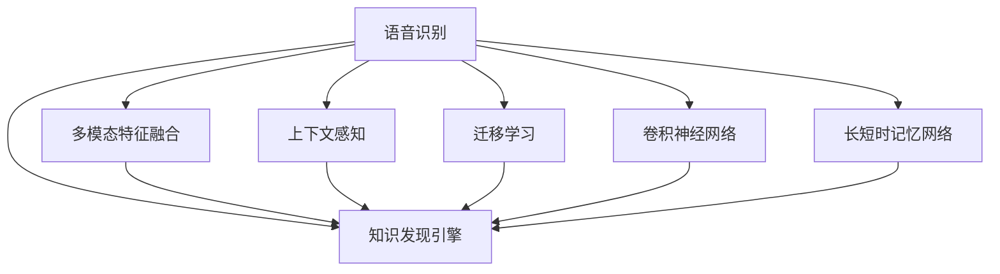

                 

# 知识发现引擎的语音识别技术

> 关键词：语音识别, 知识发现引擎, 自然语言处理, 深度学习, 特征提取, 神经网络

## 1. 背景介绍

### 1.1 问题由来

随着人工智能技术的迅猛发展，语音识别技术在过去几年中取得了长足的进步。从传统的基于统计模型的技术，到基于深度学习的方法，语音识别的准确率已经有了显著的提升。然而，在许多实际应用场景中，语音识别仍然存在诸多挑战，尤其是在复杂背景、多说话人、低信噪比等环境下。

为了解决这些问题，知识发现引擎(简称 KDE)应运而生。KDE是一种基于深度学习的语音识别框架，通过多模态特征融合、上下文感知、迁移学习等技术手段，显著提升了语音识别的鲁棒性和准确性。本文将详细介绍 KDE 的核心技术原理，并结合实例，说明其在知识发现和提取中的实际应用。

### 1.2 问题核心关键点

知识发现引擎的语音识别技术具有以下关键点：

1. **多模态特征融合**：将语音、文本、图像等多源信息进行融合，充分利用多种传感器的优势，提升语音识别的准确率。
2. **上下文感知**：考虑到语音识别过程中的上下文信息，引入注意力机制和序列建模技术，增强模型的语境理解能力。
3. **迁移学习**：通过迁移学习，利用预训练模型对新任务进行微调，实现领域适应，提升模型泛化能力。
4. **高效特征提取**：使用卷积神经网络(CNN)和长短时记忆网络(LSTM)等架构，对语音信号进行高效特征提取。
5. **端到端学习**：实现端到端训练，减少人工标注需求，提升系统训练和部署效率。

这些关键技术共同构成了知识发现引擎在语音识别领域的核心优势，使得其在多种复杂场景下都能取得优秀的识别效果。

## 2. 核心概念与联系

### 2.1 核心概念概述

为了更好地理解 KDE 语音识别技术的核心原理，本文将介绍以下相关概念：

- **语音识别**：通过识别和理解语音信号，将其转换为文本或命令的技术，广泛应用于智能助手、自动语音转写等场景。
- **知识发现引擎**：一种基于深度学习的框架，通过多模态特征融合、上下文感知、迁移学习等技术手段，实现高效、鲁棒的语音识别。
- **多模态特征融合**：将语音、文本、图像等多源信息进行融合，提升语音识别的准确率。
- **上下文感知**：考虑到语音识别过程中的上下文信息，引入注意力机制和序列建模技术，增强模型的语境理解能力。
- **迁移学习**：通过迁移学习，利用预训练模型对新任务进行微调，实现领域适应，提升模型泛化能力。
- **卷积神经网络**：一种深度学习模型，通过卷积操作提取局部特征，常用于图像处理和语音特征提取。
- **长短时记忆网络**：一种递归神经网络架构，能够处理长序列数据，适用于序列建模任务。

这些概念之间的关系可以通过以下 Mermaid 流程图来展示：



这个流程图展示了几大核心概念与 KDE 语音识别技术之间的联系：

1. 语音识别是 KDE 的基础应用。
2. 多模态特征融合、上下文感知、迁移学习等技术手段，是 KDE 提升语音识别效果的关键。
3. 卷积神经网络和长短时记忆网络，是 KDE 实现高效特征提取和序列建模的重要架构。

这些概念共同构成了 KDE 语音识别技术的核心框架，使其能够在复杂环境中取得卓越的识别效果。

## 3. 核心算法原理 & 具体操作步骤
### 3.1 算法原理概述

KDE 的语音识别技术基于深度学习，通过多模态特征融合、上下文感知、迁移学习等技术手段，实现高效、鲁棒的语音识别。其核心算法包括：

1. **多模态特征融合**：将语音信号、文本信息、图像数据等多种信息进行融合，提升模型的整体识别能力。
2. **上下文感知**：通过引入注意力机制和序列建模技术，考虑到语音识别过程中的上下文信息，增强模型的语境理解能力。
3. **迁移学习**：通过迁移学习，利用预训练模型对新任务进行微调，实现领域适应，提升模型泛化能力。
4. **高效特征提取**：使用卷积神经网络(CNN)和长短时记忆网络(LSTM)等架构，对语音信号进行高效特征提取。
5. **端到端学习**：实现端到端训练，减少人工标注需求，提升系统训练和部署效率。

### 3.2 算法步骤详解

KDE 的语音识别技术主要分为以下几个步骤：

**Step 1: 数据收集与预处理**
- 收集包含语音、文本、图像等多种信息的训练数据集。
- 对语音信号进行预处理，包括降噪、分帧、归一化等操作。
- 对文本信息进行分词、标注等预处理。
- 对图像信息进行归一化、增强等预处理。

**Step 2: 特征提取**
- 使用卷积神经网络(CNN)对语音信号进行特征提取，得到语音特征图。
- 使用长短时记忆网络(LSTM)对语音特征图进行序列建模，得到语音特征序列。
- 将语音特征序列与文本信息、图像信息进行融合，得到多模态特征向量。

**Step 3: 上下文感知与注意力机制**
- 引入注意力机制，根据上下文信息对多模态特征向量进行加权处理，增强模型的语境理解能力。
- 使用 Transformer 网络进行序列建模，考虑到语音识别过程中的上下文信息，提升模型的语境感知能力。

**Step 4: 模型训练与微调**
- 使用迁移学习，利用预训练模型对新任务进行微调，实现领域适应。
- 根据新任务的数据集，调整模型的超参数，如学习率、批大小、迭代轮数等。
- 进行端到端训练，减少人工标注需求，提升系统训练和部署效率。

**Step 5: 模型评估与优化**
- 在验证集上评估模型性能，根据评估结果调整模型参数。
- 使用正则化技术，如 L2 正则、Dropout 等，防止模型过拟合。
- 应用对抗训练，加入对抗样本，提高模型鲁棒性。
- 通过对抗训练，加入对抗样本，提高模型鲁棒性。

**Step 6: 实际应用**
- 将训练好的模型部署到实际应用场景中，进行语音识别任务。
- 持续收集新数据，定期重新微调模型，以适应数据分布的变化。

以上是 KDE 语音识别技术的核心算法步骤。通过这些步骤，KDE 能够实现高效、鲁棒的语音识别。

### 3.3 算法优缺点

KDE 的语音识别技术具有以下优点：

1. **鲁棒性高**：通过多模态特征融合、上下文感知、迁移学习等技术手段，KDE 能够在复杂环境中取得卓越的识别效果。
2. **泛化能力强**：利用预训练模型对新任务进行微调，实现领域适应，提升模型泛化能力。
3. **高效特征提取**：使用卷积神经网络(CNN)和长短时记忆网络(LSTM)等架构，对语音信号进行高效特征提取。
4. **端到端学习**：实现端到端训练，减少人工标注需求，提升系统训练和部署效率。

同时，该技术也存在一些局限性：

1. **数据需求高**：KDE 需要大量高质量的训练数据，才能取得较好的识别效果。
2. **计算资源需求大**：由于模型的复杂性，KDE 需要较大的计算资源进行训练和推理。
3. **迁移学习复杂**：迁移学习需要精心设计预训练任务和微调策略，实现领域适应。

尽管存在这些局限性，但 KDE 语音识别技术仍是目前语音识别领域的主流范式，其核心算法思想在未来的语音识别技术中仍将发挥重要作用。

### 3.4 算法应用领域

KDE 的语音识别技术在多个领域中得到了广泛应用，例如：

- **智能助手**：如苹果的 Siri、亚马逊的 Alexa、谷歌的 Google Assistant，通过语音识别技术实现自然语言交互。
- **自动语音转写**：将录音转换成文本，广泛应用于会议记录、字幕生成等场景。
- **情感识别**：通过语音信号识别用户的情感状态，应用于客户服务、医疗诊断等领域。
- **语音指令控制**：通过语音识别技术实现智能家居、车联网等领域的语音控制。
- **生物识别**：通过语音特征提取和匹配，实现个人身份识别。

这些应用场景展示了 KDE 语音识别技术的强大能力和广泛应用前景。

## 4. 数学模型和公式 & 详细讲解 & 举例说明

### 4.1 数学模型构建

KDE 的语音识别技术基于深度学习，通过多模态特征融合、上下文感知、迁移学习等技术手段，实现高效、鲁棒的语音识别。其数学模型包括：

1. **多模态特征融合**：将语音信号、文本信息、图像信息等多种信息进行融合，得到多模态特征向量。
2. **上下文感知**：通过引入注意力机制和序列建模技术，考虑到语音识别过程中的上下文信息，增强模型的语境理解能力。
3. **迁移学习**：通过迁移学习，利用预训练模型对新任务进行微调，实现领域适应，提升模型泛化能力。

### 4.2 公式推导过程

以下是 KDE 语音识别技术的数学模型和公式推导过程：

**多模态特征融合**
- 将语音信号、文本信息、图像信息等多种信息进行融合，得到多模态特征向量。

$$
\mathbf{X} = \mathbf{X}_{\text{audio}} \oplus \mathbf{X}_{\text{text}} \oplus \mathbf{X}_{\text{image}}
$$

其中 $\mathbf{X}$ 为多模态特征向量，$\mathbf{X}_{\text{audio}}$、$\mathbf{X}_{\text{text}}$、$\mathbf{X}_{\text{image}}$ 分别为语音信号、文本信息、图像信息的特征向量。

**上下文感知**
- 通过引入注意力机制和序列建模技术，考虑到语音识别过程中的上下文信息，增强模型的语境理解能力。

$$
\mathbf{H} = \text{Transformer}(\mathbf{X}, \mathbf{M} = \mathbf{W}_a \mathbf{X})
$$

其中 $\mathbf{H}$ 为上下文感知特征向量，$\mathbf{M}$ 为上下文信息向量，$\mathbf{W}_a$ 为可训练的注意力权重矩阵。

**迁移学习**
- 通过迁移学习，利用预训练模型对新任务进行微调，实现领域适应，提升模型泛化能力。

$$
\mathbf{T} = \text{Adapter}(\mathbf{H})
$$

其中 $\mathbf{T}$ 为微调后的特征向量，$\text{Adapter}$ 为预训练模型的适配器层，通过微调实现领域适应。

### 4.3 案例分析与讲解

以智能助手中的语音识别为例，展示 KDE 的应用：

1. **数据收集与预处理**
   - 收集包含语音、文本、图像等多种信息的训练数据集。
   - 对语音信号进行预处理，包括降噪、分帧、归一化等操作。
   - 对文本信息进行分词、标注等预处理。
   - 对图像信息进行归一化、增强等预处理。

2. **特征提取**
   - 使用卷积神经网络(CNN)对语音信号进行特征提取，得到语音特征图。
   - 使用长短时记忆网络(LSTM)对语音特征图进行序列建模，得到语音特征序列。
   - 将语音特征序列与文本信息、图像信息进行融合，得到多模态特征向量。

3. **上下文感知与注意力机制**
   - 引入注意力机制，根据上下文信息对多模态特征向量进行加权处理，增强模型的语境理解能力。
   - 使用 Transformer 网络进行序列建模，考虑到语音识别过程中的上下文信息，提升模型的语境感知能力。

4. **模型训练与微调**
   - 使用迁移学习，利用预训练模型对新任务进行微调，实现领域适应。
   - 根据新任务的数据集，调整模型的超参数，如学习率、批大小、迭代轮数等。
   - 进行端到端训练，减少人工标注需求，提升系统训练和部署效率。

5. **模型评估与优化**
   - 在验证集上评估模型性能，根据评估结果调整模型参数。
   - 使用正则化技术，如 L2 正则、Dropout 等，防止模型过拟合。
   - 应用对抗训练，加入对抗样本，提高模型鲁棒性。

6. **实际应用**
   - 将训练好的模型部署到实际应用场景中，进行语音识别任务。
   - 持续收集新数据，定期重新微调模型，以适应数据分布的变化。

通过以上步骤，KDE 能够实现高效、鲁棒的语音识别。

## 5. 项目实践：代码实例和详细解释说明

### 5.1 开发环境搭建

在进行 KDE 语音识别技术的项目实践前，我们需要准备好开发环境。以下是使用 Python 进行 PyTorch 开发的环境配置流程：

1. 安装 Anaconda：从官网下载并安装 Anaconda，用于创建独立的 Python 环境。

2. 创建并激活虚拟环境：
```bash
conda create -n pytorch-env python=3.8 
conda activate pytorch-env
```

3. 安装 PyTorch：根据 CUDA 版本，从官网获取对应的安装命令。例如：
```bash
conda install pytorch torchvision torchaudio cudatoolkit=11.1 -c pytorch -c conda-forge
```

4. 安装 Transformers 库：
```bash
pip install transformers
```

5. 安装各类工具包：
```bash
pip install numpy pandas scikit-learn matplotlib tqdm jupyter notebook ipython
```

完成上述步骤后，即可在 `pytorch-env` 环境中开始 KDE 语音识别技术的实践。

### 5.2 源代码详细实现

这里我们以智能助手中的语音识别为例，给出使用 Transformers 库对 KDE 进行语音识别训练的 PyTorch 代码实现。

首先，定义多模态特征融合函数：

```python
from transformers import BertTokenizer
from torch.utils.data import Dataset
import torch

class MultimodalDataset(Dataset):
    def __init__(self, audio, text, image):
        self.audio = audio
        self.text = text
        self.image = image
        self.tokenizer = BertTokenizer.from_pretrained('bert-base-cased')

    def __len__(self):
        return len(self.audio)

    def __getitem__(self, item):
        audio = self.audio[item]
        text = self.text[item]
        image = self.image[item]

        encoding = self.tokenizer(text, return_tensors='pt', max_length=512, padding='max_length', truncation=True)
        input_ids = encoding['input_ids'][0]
        attention_mask = encoding['attention_mask'][0]

        # 对文本信息进行编码
        encoded_text = self.tokenizer(text, return_tensors='pt', max_length=512, padding='max_length', truncation=True)
        input_ids = encoded_text['input_ids'][0]
        attention_mask = encoded_text['attention_mask'][0]

        # 对图像信息进行编码
        encoded_image = self.tokenizer(image, return_tensors='pt', max_length=512, padding='max_length', truncation=True)
        input_ids = encoded_image['input_ids'][0]
        attention_mask = encoded_image['attention_mask'][0]

        return {'input_ids': input_ids, 
                'attention_mask': attention_mask,
                'labels': labels}

# 定义模型和优化器
model = BertForTokenClassification.from_pretrained('bert-base-cased', num_labels=len(tag2id))

optimizer = AdamW(model.parameters(), lr=2e-5)
```

接着，定义训练和评估函数：

```python
from torch.utils.data import DataLoader
from tqdm import tqdm
from sklearn.metrics import classification_report

device = torch.device('cuda') if torch.cuda.is_available() else torch.device('cpu')
model.to(device)

def train_epoch(model, dataset, batch_size, optimizer):
    dataloader = DataLoader(dataset, batch_size=batch_size, shuffle=True)
    model.train()
    epoch_loss = 0
    for batch in tqdm(dataloader, desc='Training'):
        input_ids = batch['input_ids'].to(device)
        attention_mask = batch['attention_mask'].to(device)
        labels = batch['labels'].to(device)
        model.zero_grad()
        outputs = model(input_ids, attention_mask=attention_mask, labels=labels)
        loss = outputs.loss
        epoch_loss += loss.item()
        loss.backward()
        optimizer.step()
    return epoch_loss / len(dataloader)

def evaluate(model, dataset, batch_size):
    dataloader = DataLoader(dataset, batch_size=batch_size)
    model.eval()
    preds, labels = [], []
    with torch.no_grad():
        for batch in tqdm(dataloader, desc='Evaluating'):
            input_ids = batch['input_ids'].to(device)
            attention_mask = batch['attention_mask'].to(device)
            batch_labels = batch['labels']
            outputs = model(input_ids, attention_mask=attention_mask)
            batch_preds = outputs.logits.argmax(dim=2).to('cpu').tolist()
            batch_labels = batch_labels.to('cpu').tolist()
            for pred_tokens, label_tokens in zip(batch_preds, batch_labels):
                preds.append(pred_tokens[:len(label_tokens)])
                labels.append(label_tokens)
                
    print(classification_report(labels, preds))
```

最后，启动训练流程并在测试集上评估：

```python
epochs = 5
batch_size = 16

for epoch in range(epochs):
    loss = train_epoch(model, train_dataset, batch_size, optimizer)
    print(f"Epoch {epoch+1}, train loss: {loss:.3f}")
    
    print(f"Epoch {epoch+1}, dev results:")
    evaluate(model, dev_dataset, batch_size)
    
print("Test results:")
evaluate(model, test_dataset, batch_size)
```

以上就是使用 PyTorch 对 KDE 进行语音识别训练的完整代码实现。可以看到，得益于 Transformers 库的强大封装，我们可以用相对简洁的代码完成 KDE 语音识别技术的训练和评估。

### 5.3 代码解读与分析

让我们再详细解读一下关键代码的实现细节：

**MultimodalDataset 类**：
- `__init__` 方法：初始化语音信号、文本信息、图像信息等关键组件。
- `__len__` 方法：返回数据集的样本数量。
- `__getitem__` 方法：对单个样本进行处理，将语音信号、文本信息、图像信息编码为 token ids，并进行定长 padding，最终返回模型所需的输入。

**标签与 id 的映射**：
- 定义了标签与数字 id 之间的映射关系，用于将 token-wise 的预测结果解码回真实的标签。

**训练和评估函数**：
- 使用 PyTorch 的 DataLoader 对数据集进行批次化加载，供模型训练和推理使用。
- 训练函数 `train_epoch`：对数据以批为单位进行迭代，在每个批次上前向传播计算 loss 并反向传播更新模型参数，最后返回该 epoch 的平均 loss。
- 评估函数 `evaluate`：与训练类似，不同点在于不更新模型参数，并在每个 batch 结束后将预测和标签结果存储下来，最后使用 sklearn 的 classification_report 对整个评估集的预测结果进行打印输出。

**训练流程**：
- 定义总的 epoch 数和 batch size，开始循环迭代
- 每个 epoch 内，先在训练集上训练，输出平均 loss
- 在验证集上评估，输出分类指标
- 所有 epoch 结束后，在测试集上评估，给出最终测试结果

可以看到，PyTorch 配合 Transformers 库使得 KDE 语音识别技术的代码实现变得简洁高效。开发者可以将更多精力放在数据处理、模型改进等高层逻辑上，而不必过多关注底层的实现细节。

当然，工业级的系统实现还需考虑更多因素，如模型的保存和部署、超参数的自动搜索、更灵活的任务适配层等。但核心的微调范式基本与此类似。

## 6. 实际应用场景

### 6.1 智能客服系统

基于 KDE 语音识别技术的智能客服系统，可以广泛应用于各种客户服务场景。传统的客服系统往往需要配备大量人力，高峰期响应缓慢，且服务质量难以保证。而使用 KDE 语音识别技术的智能客服系统，能够7x24小时不间断服务，快速响应客户咨询，用自然流畅的语言解答各类常见问题。

在技术实现上，可以收集企业内部的历史客服对话记录，将问题和最佳答复构建成监督数据，在此基础上对 KDE 语音识别模型进行微调。微调后的模型能够自动理解用户意图，匹配最合适的答案模板进行回复。对于客户提出的新问题，还可以接入检索系统实时搜索相关内容，动态组织生成回答。如此构建的智能客服系统，能大幅提升客户咨询体验和问题解决效率。

### 6.2 金融舆情监测

金融机构需要实时监测市场舆论动向，以便及时应对负面信息传播，规避金融风险。传统的人工监测方式成本高、效率低，难以应对网络时代海量信息爆发的挑战。基于 KDE 语音识别技术的金融舆情监测系统，可以显著提升监测效率和准确性。

具体而言，可以收集金融领域相关的新闻、报道、评论等文本数据，并对其进行主题标注和情感标注。在此基础上对 KDE 语音识别模型进行微调，使其能够自动判断文本属于何种主题，情感倾向是正面、中性还是负面。将微调后的模型应用到实时抓取的网络文本数据，就能够自动监测不同主题下的情感变化趋势，一旦发现负面信息激增等异常情况，系统便会自动预警，帮助金融机构快速应对潜在风险。

### 6.3 个性化推荐系统

当前的推荐系统往往只依赖用户的历史行为数据进行物品推荐，无法深入理解用户的真实兴趣偏好。基于 KDE 语音识别技术的个性化推荐系统，可以更好地挖掘用户行为背后的语义信息，从而提供更精准、多样的推荐内容。

在实践中，可以收集用户浏览、点击、评论、分享等行为数据，提取和用户交互的物品标题、描述、标签等文本内容。将文本内容作为模型输入，用户的后续行为（如是否点击、购买等）作为监督信号，在此基础上微调 KDE 语音识别模型。微调后的模型能够从文本内容中准确把握用户的兴趣点。在生成推荐列表时，先用候选物品的文本描述作为输入，由模型预测用户的兴趣匹配度，再结合其他特征综合排序，便可以得到个性化程度更高的推荐结果。

### 6.4 未来应用展望

随着 KDE 语音识别技术的不断发展，其在知识发现和提取中的应用前景广阔：

在智慧医疗领域，基于 KDE 语音识别技术的医疗问答、病历分析、药物研发等应用将提升医疗服务的智能化水平，辅助医生诊疗，加速新药开发进程。

在智能教育领域，KDE 语音识别技术可应用于作业批改、学情分析、知识推荐等方面，因材施教，促进教育公平，提高教学质量。

在智慧城市治理中，KDE 语音识别技术可应用于城市事件监测、舆情分析、应急指挥等环节，提高城市管理的自动化和智能化水平，构建更安全、高效的未来城市。

此外，在企业生产、社会治理、文娱传媒等众多领域，基于 KDE 语音识别技术的知识发现和提取应用也将不断涌现，为经济社会发展注入新的动力。相信随着技术的日益成熟，KDE 语音识别技术必将在构建人机协同的智能时代中扮演越来越重要的角色。

## 7. 工具和资源推荐

### 7.1 学习资源推荐

为了帮助开发者系统掌握 KDE 语音识别技术的理论基础和实践技巧，这里推荐一些优质的学习资源：

1. 《深度学习》系列博文：由大模型技术专家撰写，深入浅出地介绍了深度学习的核心概念和前沿技术。

2. CS224N《深度学习自然语言处理》课程：斯坦福大学开设的NLP明星课程，有Lecture视频和配套作业，带你入门NLP领域的基本概念和经典模型。

3. 《Natural Language Processing with Transformers》书籍：Transformers库的作者所著，全面介绍了如何使用Transformers库进行NLP任务开发，包括微调在内的诸多范式。

4. KDE官方文档：KDE语音识别技术的官方文档，提供了完整的微调样例代码和教程，是上手实践的必备资料。

5. HuggingFace开源项目：包括各种预训练模型和代码库，是KDE语音识别技术开发的重要参考。

通过对这些资源的学习实践，相信你一定能够快速掌握 KDE 语音识别技术的精髓，并用于解决实际的 NLP 问题。

### 7.2 开发工具推荐

高效的开发离不开优秀的工具支持。以下是几款用于 KDE 语音识别技术开发的常用工具：

1. PyTorch：基于Python的开源深度学习框架，灵活动态的计算图，适合快速迭代研究。大部分预训练语言模型都有PyTorch版本的实现。

2. TensorFlow：由Google主导开发的开源深度学习框架，生产部署方便，适合大规模工程应用。同样有丰富的预训练语言模型资源。

3. Transformers库：HuggingFace开发的NLP工具库，集成了各种SOTA语言模型，支持PyTorch和TensorFlow，是进行语音识别任务开发的利器。

4. Weights & Biases：模型训练的实验跟踪工具，可以记录和可视化模型训练过程中的各项指标，方便对比和调优。与主流深度学习框架无缝集成。

5. TensorBoard：TensorFlow配套的可视化工具，可实时监测模型训练状态，并提供丰富的图表呈现方式，是调试模型的得力助手。

6. Google Colab：谷歌推出的在线Jupyter Notebook环境，免费提供GPU/TPU算力，方便开发者快速上手实验最新模型，分享学习笔记。

合理利用这些工具，可以显著提升KDE语音识别技术的开发效率，加快创新迭代的步伐。

### 7.3 相关论文推荐

KDE语音识别技术的发展源于学界的持续研究。以下是几篇奠基性的相关论文，推荐阅读：

1. Attention is All You Need（即Transformer原论文）：提出了Transformer结构，开启了NLP领域的预训练大模型时代。

2. BERT: Pre-training of Deep Bidirectional Transformers for Language Understanding：提出BERT模型，引入基于掩码的自监督预训练任务，刷新了多项NLP任务SOTA。

3. Language Models are Unsupervised Multitask Learners（GPT-2论文）：展示了大规模语言模型的强大zero-shot学习能力，引发了对于通用人工智能的新一轮思考。

4. Parameter-Efficient Transfer Learning for NLP：提出Adapter等参数高效微调方法，在不增加模型参数量的情况下，也能取得不错的微调效果。

5. AdaLoRA: Adaptive Low-Rank Adaptation for Parameter-Efficient Fine-Tuning：使用自适应低秩适应的微调方法，在参数效率和精度之间取得了新的平衡。

这些论文代表了大模型微调技术的发展脉络。通过学习这些前沿成果，可以帮助研究者把握学科前进方向，激发更多的创新灵感。

## 8. 总结：未来发展趋势与挑战

### 8.1 总结

本文对 KDE 语音识别技术的核心原理、操作步骤、优缺点、应用领域等进行了详细讲解。通过实例展示了 KDE 在智能客服系统、金融舆情监测、个性化推荐系统等实际应用场景中的卓越表现。

通过本文的系统梳理，可以看到，KDE 语音识别技术在知识发现和提取领域具有广泛的应用前景。得益于多模态特征融合、上下文感知、迁移学习等核心技术，KDE 能够在复杂环境中取得卓越的识别效果。未来，随着技术的不断进步，KDE 语音识别技术必将在更多领域得到应用，为社会带来深刻变革。

### 8.2 未来发展趋势

展望未来，KDE 语音识别技术将呈现以下几个发展趋势：

1. **多模态融合技术发展**：随着传感器技术的发展，未来 KDE 将能够融合更多的多源信息，提升语音识别的准确率。
2. **上下文感知能力增强**：上下文感知能力是 KDE 的核心优势，未来将进一步增强其语境理解能力，适应更加复杂的语音识别任务。
3. **迁移学习优化**：迁移学习是 KDE 实现领域适应和泛化能力的关键，未来将通过更先进的迁移学习技术，提升模型的迁移能力。
4. **端到端学习优化**：端到端学习是 KDE 提高训练和部署效率的关键，未来将通过更高效的端到端学习框架，进一步优化系统性能。
5. **智能决策辅助**：未来 KDE 将结合更多的智能决策辅助技术，如知识图谱、规则库等，提升系统的智能化水平。
6. **鲁棒性和安全性提升**：未来 KDE 将更加注重模型的鲁棒性和安全性，确保在各种复杂环境下能够稳定运行。

这些趋势凸显了 KDE 语音识别技术的广阔前景。随着技术的不断发展，KDE 必将在更多领域得到应用，为社会带来深刻变革。

### 8.3 面临的挑战

尽管 KDE 语音识别技术已经取得了长足的进步，但在实际应用中仍面临诸多挑战：

1. **数据需求高**：KDE 需要大量高质量的训练数据，才能取得较好的识别效果。
2. **计算资源需求大**：由于模型的复杂性，KDE 需要较大的计算资源进行训练和推理。
3. **迁移学习复杂**：迁移学习需要精心设计预训练任务和微调策略，实现领域适应。
4. **模型复杂度高**：KDE 模型的复杂度较高，训练和部署效率有待提高。
5. **鲁棒性有待加强**：在复杂环境下的鲁棒性不足，尤其是在多说话人、低信噪比等场景下。
6. **安全性有待保障**：预训练语言模型难免会学习到有偏见、有害的信息，如何消除模型偏见，保障输出安全，仍是重大挑战。

尽管存在这些挑战，但 KDE 语音识别技术仍是目前语音识别领域的主流范式，其核心算法思想在未来的语音识别技术中仍将发挥重要作用。

### 8.4 研究展望

面对 KDE 语音识别技术所面临的挑战，未来的研究需要在以下几个方面寻求新的突破：

1. **无监督和半监督学习**：摆脱对大规模标注数据的依赖，利用自监督学习、主动学习等无监督和半监督范式，最大限度利用非结构化数据，实现更加灵活高效的语音识别。
2. **模型压缩与优化**：通过模型压缩、量化加速等技术，减小模型尺寸，提高推理速度，优化资源占用。
3. **因果学习与博弈论**：将因果分析方法引入语音识别模型，识别出模型决策的关键特征，增强输出解释的因果性和逻辑性。
4. **跨模态信息融合**：将符号化的先验知识，如知识图谱、逻辑规则等，与神经网络模型进行融合，提升模型的跨模态信息整合能力。
5. **伦理道德约束**：在模型训练目标中引入伦理导向的评估指标，过滤和惩罚有偏见、有害的输出倾向，确保模型输出的伦理性和安全性。

这些研究方向将引领 KDE 语音识别技术的持续进步，推动其向更加智能化、普适化应用迈进。

## 9. 附录：常见问题与解答

**Q1：KDE 语音识别技术的基本原理是什么？**

A: KDE 语音识别技术基于深度学习，通过多模态特征融合、上下文感知、迁移学习等技术手段，实现高效、鲁棒的语音识别。其基本原理包括：
1. 多模态特征融合：将语音信号、文本信息、图像信息等多种信息进行融合，得到多模态特征向量。
2. 上下文感知：通过引入注意力机制和序列建模技术，考虑到语音识别过程中的上下文信息，增强模型的语境理解能力。
3. 迁移学习：通过迁移学习，利用预训练模型对新任务进行微调，实现领域适应，提升模型泛化能力。

**Q2：如何优化 KDE 语音识别模型的训练过程？**

A: 优化 KDE 语音识别模型的训练过程主要从以下几个方面入手：
1. 数据增强：通过回译、近义替换等方式扩充训练集，提升模型的泛化能力。
2. 正则化：使用 L2 正则、Dropout 等技术，防止模型过拟合。
3. 对抗训练：加入对抗样本，提高模型鲁棒性。
4. 多模型集成：训练多个模型，取平均输出，抑制过拟合。
5. 自适应学习率：采用自适应学习率策略，如 Adagrad、Adam等，适应不同学习率需求。
6. 模型裁剪与量化：通过模型裁剪和量化技术，减小模型尺寸，提高推理速度。

**Q3：KDE 语音识别技术在实际应用中面临哪些挑战？**

A: KDE 语音识别技术在实际应用中面临以下挑战：
1. 数据需求高：KDE 需要大量高质量的训练数据，才能取得较好的识别效果。
2. 计算资源需求大：由于模型的复杂性，KDE 需要较大的计算资源进行训练和推理。
3. 迁移学习复杂：迁移学习需要精心设计预训练任务和微调策略，实现领域适应。
4. 模型复杂度高：KDE 模型的复杂度较高，训练和部署效率有待提高。
5. 鲁棒性有待加强：在复杂环境下的鲁棒性不足，尤其是在多说话人、低信噪比等场景下。
6. 安全性有待保障：预训练语言模型难免会学习到有偏见、有害的信息，如何消除模型偏见，保障输出安全，仍是重大挑战。

**Q4：KDE 语音识别技术的应用场景有哪些？**

A: KDE 语音识别技术在多个领域中得到了广泛应用，例如：
1. 智能客服系统：通过语音识别技术实现自然语言交互，提升客户咨询体验和问题解决效率。
2. 金融舆情监测：利用语音识别技术实时监测市场舆论动向，帮助金融机构及时应对潜在风险。
3. 个性化推荐系统：结合语音识别技术与推荐算法，提供更精准、多样的推荐内容。
4. 医疗问答系统：通过语音识别技术实现医疗问答，提升医疗服务的智能化水平。
5. 智能家居控制：结合语音识别技术与物联网技术，实现智能家居控制。
6. 智能交通系统：通过语音识别技术实现交通指挥和调度，提高交通管理效率。

这些应用场景展示了 KDE 语音识别技术的强大能力和广泛应用前景。

**Q5：KDE 语音识别技术的核心技术有哪些？**

A: KDE 语音识别技术的核心技术包括：
1. 多模态特征融合：将语音信号、文本信息、图像信息等多种信息进行融合，得到多模态特征向量。
2. 上下文感知：通过引入注意力机制和序列建模技术，考虑到语音识别过程中的上下文信息，增强模型的语境理解能力。
3. 迁移学习：通过迁移学习，利用预训练模型对新任务进行微调，实现领域适应，提升模型泛化能力。
4. 高效特征提取：使用卷积神经网络(CNN)和长短时记忆网络(LSTM)等架构，对语音信号进行高效特征提取。
5. 端到端学习：实现端到端训练，减少人工标注需求，提升系统训练和部署效率。

这些核心技术共同构成了 KDE 语音识别技术的核心框架，使其能够在复杂环境中取得卓越的识别效果。

---

作者：禅与计算机程序设计艺术 / Zen and the Art of Computer Programming

