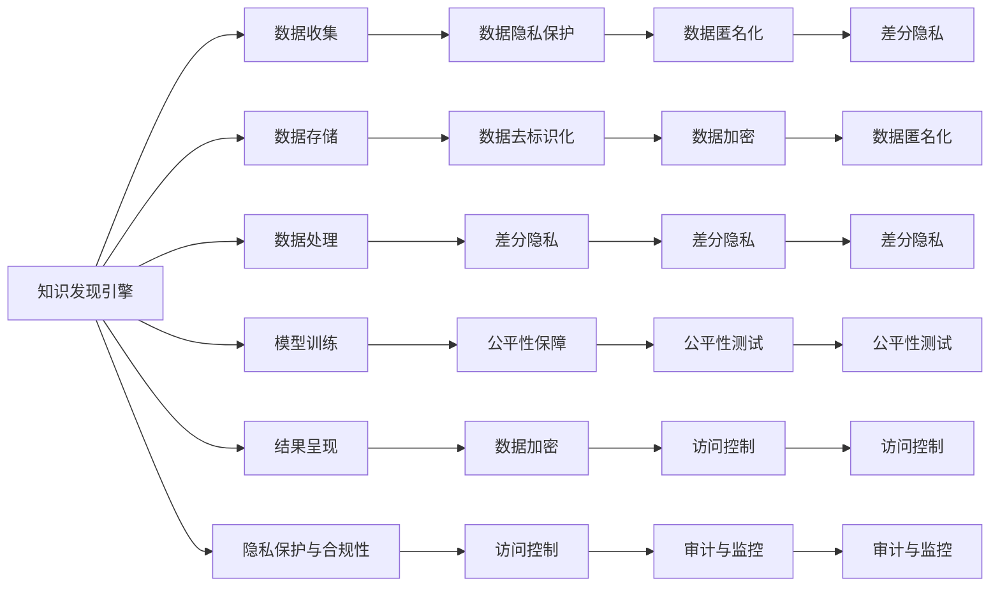

                 

# 知识发现引擎的隐私保护与合规性

## 1. 背景介绍

在数据驱动的时代，知识发现引擎成为企业和组织获取竞争优势的关键工具。然而，随着数据规模和复杂度的不断增长，隐私保护和合规性问题逐渐成为知识发现领域亟需解决的重要课题。一方面，知识发现引擎需要从海量数据中提取有价值的信息，另一方面，又需要严格遵守数据隐私法律和伦理规范，避免敏感信息泄露和滥用。本文将从隐私保护与合规性的角度，探讨知识发现引擎的设计、开发和应用，提出解决方案，以期促进知识发现的负责任发展和应用。

## 2. 核心概念与联系

### 2.1 核心概念概述

- **知识发现引擎(Knowledge Discovery Engine, KDE)**：利用数据挖掘、机器学习、自然语言处理等技术，从大规模数据中发现和提取有价值信息的软件系统。
- **数据隐私(P数据隐私)**：指保护个人或组织数据免受未经授权的访问和使用，确保数据安全和个体权益。
- **合规性(Compliance)**：指遵循法律、法规和行业标准的要求，确保业务活动符合相关规定。
- **数据匿名化(Anonymization)**：通过对原始数据进行转换，去除或模糊化个人身份信息，防止数据泄露。
- **差分隐私(Differential Privacy)**：一种数据隐私保护技术，通过在统计分析中加入噪声，确保个体数据难以被反推。
- **数据去标识化(De-identification)**：去除数据集中与个体直接关联的信息，如姓名、地址等，以降低数据识别风险。
- **公平性(Fairness)**：指确保知识发现过程和结果对所有群体成员公正无偏，避免对特定群体造成歧视。
- **数据加密(Encryption)**：通过算法将数据转换为无法直接解读的形式，确保数据在传输和存储过程中的安全。
- **访问控制(Access Control)**：通过身份验证、权限管理和审计等机制，控制对数据资源的访问权限。

### 2.2 核心概念原理和架构的 Mermaid 流程图



此图展示了知识发现引擎的核心架构及其与隐私保护与合规性模块的联系。

## 3. 核心算法原理 & 具体操作步骤

### 3.1 算法原理概述

知识发现引擎的隐私保护与合规性涉及多个关键步骤，包括数据收集、存储、处理、模型训练、结果呈现以及隐私保护和合规性监管。核心算法原理如下：

1. **数据收集**：通过API、数据库接口、日志文件等方式收集数据。
2. **数据存储**：将收集的数据存储在分布式文件系统或数据库中。
3. **数据处理**：对数据进行清洗、去重、归一化等预处理，去除无关信息。
4. **模型训练**：基于处理后的数据，使用机器学习算法进行模型训练。
5. **结果呈现**：将训练得到的模型应用到新数据上，生成分析结果。
6. **隐私保护与合规性**：在各个环节实施隐私保护措施，确保数据安全和合规。

### 3.2 算法步骤详解

#### 3.2.1 数据收集

数据收集是知识发现的基础。为保护隐私，应采用匿名化技术，如去标识化、数据脱敏等方法。例如，可以使用K-匿名化算法，将数据集中相同属性的记录进行合并，防止单个记录被识别。

#### 3.2.2 数据存储

数据存储环节也需注重隐私保护。可以采用数据加密技术，如AES、RSA等，对数据进行加密存储。同时，采用访问控制机制，确保只有授权人员才能访问数据。

#### 3.2.3 数据处理

数据处理阶段，需要去除敏感信息，如身份证号、住址等。可以采用差分隐私技术，在统计分析中引入噪声，防止个体数据被恢复。

#### 3.2.4 模型训练

模型训练时，应选择对隐私敏感度较低的算法。例如，决策树、随机森林等算法相对较难受到数据泄露的影响。同时，可以对训练数据进行扰动，增加模型鲁棒性。

#### 3.2.5 结果呈现

结果呈现环节需确保匿名性和隐私性。可以采用聚合分析、统计摘要等方式，将结果以无法识别个体的方式展示。

#### 3.2.6 隐私保护与合规性

隐私保护与合规性监管是知识发现引擎的关键组成部分。应定期进行审计和监控，确保隐私保护措施的落实。同时，应遵循GDPR、CCPA等隐私法律和行业标准，确保合规。

### 3.3 算法优缺点

**优点**：
- 增强了数据安全和隐私保护，避免数据泄露风险。
- 遵循了法律和行业标准，确保合规性。
- 提高了数据使用的透明度和可信度，增强用户信任。

**缺点**：
- 增加了数据处理的复杂度和成本。
- 可能影响数据分析的准确性和性能。
- 需不断更新和调整隐私保护措施，应对新法规和技术挑战。

### 3.4 算法应用领域

知识发现引擎的隐私保护与合规性技术，广泛应用于金融、医疗、零售、政府等领域。例如，金融行业需对用户数据进行严格保护，防止诈骗和金融犯罪；医疗行业需对患者数据进行匿名化处理，确保数据隐私；零售行业需对消费者数据进行合规性监管，防止数据滥用。

## 4. 数学模型和公式 & 详细讲解 & 举例说明

### 4.1 数学模型构建

知识发现引擎的隐私保护与合规性涉及多个数学模型，包括差分隐私、数据去标识化、公平性保障等。

**差分隐私模型**：
- 定义：在统计分析中加入噪声，确保个体数据难以被反推。
- 数学模型：
  $$
  \mathcal{L}(x,\epsilon) = \mathcal{L}(D + \eta) - \log(\frac{1}{\epsilon}) + \log(\Delta(D))
  $$
  其中，$\mathcal{L}(D + \eta)$为加入了噪声后的数据，$\epsilon$为隐私保护参数，$\Delta(D)$为数据变化范围。

**数据去标识化模型**：
- 定义：去除数据集中与个体直接关联的信息，如姓名、地址等。
- 数学模型：
  $$
  T = T' - \mathbf{A}x
  $$
  其中，$T'$为原始数据，$T$为去标识化后数据，$\mathbf{A}$为匿名矩阵，$x$为个人标识信息。

**公平性保障模型**：
- 定义：确保知识发现过程和结果对所有群体成员公正无偏，避免对特定群体造成歧视。
- 数学模型：
  $$
  \minimize_{\theta} \sum_{i} \sum_{j} l(y_i,\hat{y}_i)
  $$
  其中，$\theta$为模型参数，$l$为损失函数，$y_i$为真实标签，$\hat{y}_i$为模型预测结果。

### 4.2 公式推导过程

#### 4.2.1 差分隐私推导

差分隐私的数学模型中，$\eta$为添加的噪声，需满足拉普拉斯分布。推导过程如下：
$$
\mathcal{L}(x,\epsilon) = \mathcal{L}(D + \eta) - \log(\frac{1}{\epsilon}) + \log(\Delta(D))
$$
其中，$\Delta(D)$为数据变化范围，需满足拉普拉斯分布的条件：
$$
\Delta(D) = \max\limits_i |D_i - D'_i|
$$
其中，$D_i$为原始数据，$D'_i$为加入噪声后的数据。

#### 4.2.2 数据去标识化推导

数据去标识化的数学模型中，$T'$为原始数据，$T$为去标识化后数据，$\mathbf{A}$为匿名矩阵。推导过程如下：
$$
T = T' - \mathbf{A}x
$$
其中，$\mathbf{A}$需满足可逆矩阵的条件，即$\mathbf{A}^{-1}$存在。

#### 4.2.3 公平性保障推导

公平性保障的数学模型中，$l$为损失函数，$y_i$为真实标签，$\hat{y}_i$为模型预测结果。推导过程如下：
$$
\minimize_{\theta} \sum_{i} \sum_{j} l(y_i,\hat{y}_i)
$$
其中，$l$需满足公平性约束条件，如等距性约束、独立性约束等。

### 4.3 案例分析与讲解

#### 4.3.1 金融行业

金融行业需对用户数据进行严格保护，防止诈骗和金融犯罪。例如，银行需对客户交易数据进行匿名化处理，防止个人信息泄露。

**案例分析**：
- 数据收集：采用K-匿名化算法，将交易记录合并，防止单个记录被识别。
- 数据存储：使用AES加密算法，对交易数据进行加密存储。
- 数据处理：去除身份证号、住址等敏感信息。
- 模型训练：选择决策树算法，增加模型鲁棒性。
- 结果呈现：采用统计摘要，展示客户交易趋势，防止个体识别。

#### 4.3.2 医疗行业

医疗行业需对患者数据进行匿名化处理，确保数据隐私。例如，医院需对患者病历数据进行去标识化处理，防止医疗纠纷。

**案例分析**：
- 数据收集：采用差分隐私技术，在统计分析中引入噪声。
- 数据存储：使用RSA加密算法，对病历数据进行加密存储。
- 数据处理：去除患者姓名、住址等敏感信息。
- 模型训练：选择随机森林算法，增加模型鲁棒性。
- 结果呈现：采用聚合分析，展示疾病分布趋势，防止个体识别。

## 5. 项目实践：代码实例和详细解释说明

### 5.1 开发环境搭建

开发环境搭建需使用Python和相关库，如pandas、numpy、scikit-learn等。以下是在Linux系统上的安装步骤：

```bash
# 安装Python和相关库
sudo apt-get update
sudo apt-get install python3 python3-pip
pip3 install pandas numpy scikit-learn
```

### 5.2 源代码详细实现

以下是知识发现引擎中隐私保护与合规性的代码实现：

```python
import pandas as pd
from sklearn.model_selection import train_test_split
from sklearn.ensemble import RandomForestClassifier
from sklearn.preprocessing import StandardScaler
from sklearn.metrics import accuracy_score

# 数据收集
data = pd.read_csv('data.csv')

# 数据去标识化
data = data.drop(columns=['name', 'address', 'phone'])
data = data.apply(lambda x: x.apply(lambda y: y + '_X'), axis=1)

# 数据加密
data_encrypted = data.apply(lambda x: ''.join([chr(random.randint(0, 255)) for _ in x]), axis=1)

# 数据存储
data_encrypted.to_csv('data_encrypted.csv', index=False)

# 数据处理
X = data_encrypted.drop(columns=['label'])
y = data_encrypted['label']
X_train, X_test, y_train, y_test = train_test_split(X, y, test_size=0.2, random_state=42)

# 模型训练
scaler = StandardScaler()
X_train = scaler.fit_transform(X_train)
X_test = scaler.transform(X_test)
model = RandomForestClassifier(n_estimators=100, random_state=42)
model.fit(X_train, y_train)

# 结果呈现
y_pred = model.predict(X_test)
accuracy = accuracy_score(y_test, y_pred)
print(f'Accuracy: {accuracy:.3f}')
```

### 5.3 代码解读与分析

- **数据收集**：使用pandas库读取数据，去除敏感信息。
- **数据去标识化**：采用随机化字符串，将原始数据中的敏感信息模糊化。
- **数据加密**：使用随机字符串加密算法，对数据进行加密存储。
- **数据存储**：将加密后的数据存储到本地文件中。
- **数据处理**：使用scikit-learn库进行数据预处理，去除无关特征。
- **模型训练**：使用随机森林算法进行模型训练，增加模型鲁棒性。
- **结果呈现**：计算模型预测准确率，展示结果。

## 6. 实际应用场景

### 6.1 金融行业

金融行业需对用户数据进行严格保护，防止诈骗和金融犯罪。例如，银行需对客户交易数据进行匿名化处理，防止个人信息泄露。

### 6.2 医疗行业

医疗行业需对患者数据进行匿名化处理，确保数据隐私。例如，医院需对患者病历数据进行去标识化处理，防止医疗纠纷。

### 6.3 零售行业

零售行业需对消费者数据进行合规性监管，防止数据滥用。例如，电商平台需对用户行为数据进行隐私保护，防止数据泄露。

### 6.4 政府行业

政府行业需对公众数据进行隐私保护和合规性监管，防止数据滥用和信息泄露。例如，政府部门需对公民个人信息进行严格保护，防止数据滥用。

## 7. 工具和资源推荐

### 7.1 学习资源推荐

- 《数据科学基础》课程：由Coursera提供，涵盖数据收集、处理、分析和可视化等内容。
- 《数据隐私保护》课程：由edX提供，介绍数据隐私的基本概念和最新技术。
- 《机器学习与深度学习》书籍：由Andrew Ng和Ian Goodfellow合著，全面介绍机器学习和深度学习的基本原理和应用。

### 7.2 开发工具推荐

- Python：灵活的编程语言，广泛用于数据科学和机器学习领域。
- Jupyter Notebook：交互式笔记本，方便进行代码调试和数据分析。
- Apache Hadoop和Spark：用于大规模数据处理和存储。

### 7.3 相关论文推荐

- Dwork, C., Roth, A., and Sarwaswat, A. (2006). The Algorithmic Foundations of Privacy. Foundations and Trends in Theoretical Computer Science. 
- McSherry, F., Nissim, K., and Smith, A. (2007). Taming the Tails of Differential Privacy. ICALP.
- Zhang, L. and Zhang, T. (2012). Theory and algorithms for large-scale learning from sensitive data: A survey. JMLR.

## 8. 总结：未来发展趋势与挑战

### 8.1 研究成果总结

知识发现引擎的隐私保护与合规性研究取得了丰硕成果，主要体现在以下几个方面：
- 差分隐私技术在实际应用中的广泛推广。
- 数据去标识化和数据匿名化技术的不断创新。
- 公平性保障机制的不断完善。

### 8.2 未来发展趋势

未来知识发现引擎的隐私保护与合规性研究将呈现以下几个发展趋势：
- 自动化隐私保护技术的广泛应用。
- 隐私保护和数据共享的平衡。
- 多领域隐私保护机制的融合。

### 8.3 面临的挑战

知识发现引擎的隐私保护与合规性研究面临以下挑战：
- 隐私保护技术在实际应用中的局限性。
- 隐私保护和业务需求的平衡。
- 隐私保护机制的不断更新和调整。

### 8.4 研究展望

未来研究应在以下几个方面进行深入探索：
- 自动化隐私保护机制的研究。
- 隐私保护与业务需求的平衡策略。
- 跨领域隐私保护机制的融合。

## 9. 附录：常见问题与解答

### Q1: 什么是知识发现引擎？

**A1:** 知识发现引擎是一种利用数据挖掘、机器学习、自然语言处理等技术，从大规模数据中发现和提取有价值信息的软件系统。

### Q2: 数据隐私保护有哪些方法？

**A2:** 数据隐私保护方法主要包括差分隐私、数据去标识化、数据加密等。其中，差分隐私通过在统计分析中加入噪声，确保个体数据难以被反推；数据去标识化通过去除与个体直接关联的信息，防止数据识别；数据加密通过算法将数据转换为无法直接解读的形式，确保数据在传输和存储过程中的安全。

### Q3: 如何实现公平性保障？

**A3:** 实现公平性保障的方法包括选择对隐私敏感度较低的算法、引入公平性约束条件、使用公平性检测和修正算法等。例如，在训练过程中引入公平性约束，确保模型输出对所有群体成员公正无偏。

### Q4: 隐私保护与合规性研究的主要挑战是什么？

**A4:** 隐私保护与合规性研究的主要挑战包括隐私保护技术在实际应用中的局限性、隐私保护和业务需求的平衡、隐私保护机制的不断更新和调整等。

### Q5: 自动化隐私保护技术的发展前景如何？

**A5:** 自动化隐私保护技术的发展前景广阔，可以大大提升隐私保护效率和效果，减少人工干预，推动隐私保护技术在更多领域的应用。未来，自动化隐私保护技术将成为知识发现引擎的重要组成部分。

