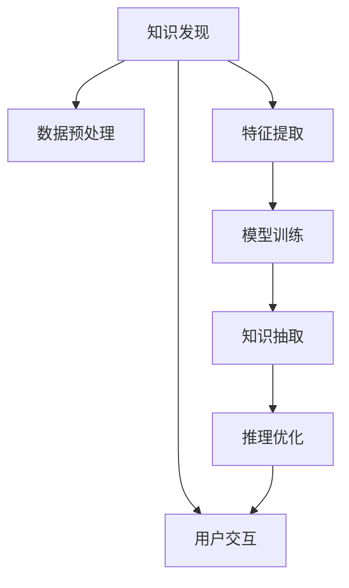

                 

# 知识发现引擎：开启人类认知新纪元

> 关键词：知识发现，认知计算，数据挖掘，人工智能，大数据，深度学习，计算社会科学

## 1. 背景介绍

### 1.1 问题由来

在信息爆炸的时代，人类每天产生的数据量呈指数级增长，信息的海量积累虽然带来了无比丰富的知识资源，但也使得传统的信息检索方式越来越难以满足日益增长的信息需求。如何在庞大的数据海洋中快速发现有用知识、进行知识整合和智慧决策，成为了当代信息科学领域的一个重要挑战。

这一问题在科学研究、商业决策、医疗诊断、司法取证、政府治理等诸多领域都有着广泛而深远的影响。例如，科研领域需要从浩如烟海的文献中快速定位相关研究成果，从而加速研究进展；商业领域需要从大量交易数据中挖掘出市场趋势和消费者行为，以指导产品开发和市场策略；医疗领域需要从病历记录中识别出疾病模式和治疗方法，以提升诊疗效果；司法领域需要从案件记录中挖掘出犯罪证据和法律依据，以保障司法公正；政府治理领域需要从海量政务数据中发现政策效果和民生需求，以优化政策决策。

传统的知识检索和信息挖掘技术往往依赖于简单的关键字匹配，这种方法在数据量较小、知识关系简单的场景下尚且有效，但在面对大规模、复杂、多源数据时，其效果往往不理想。因此，如何构建高效、智能的知识发现引擎，成为当下计算机科学、认知科学、社会科学等多学科交叉领域的前沿问题。

### 1.2 问题核心关键点

知识发现引擎是一种基于大数据分析、深度学习等技术，能够自动识别和抽取知识要素，进行知识关系建模和智慧决策的智能系统。其核心挑战在于如何高效处理大规模、复杂、异构数据，并在其中发现有用知识。

知识发现引擎的核心方法包括：

- 数据预处理：清洗、转换、合并数据，构建统一的、高质量的数据仓库。
- 特征提取：从原始数据中提取有意义的特征，构建知识发现的基础。
- 模型训练：基于机器学习算法，训练出识别知识关系的模型。
- 知识抽取：通过训练好的模型，自动抽取知识要素和关系。
- 推理优化：构建推理引擎，进行逻辑推导和决策支持。
- 用户交互：提供友好的用户界面，支持自然语言查询和可视化展示。

这些核心方法相互关联，共同构成了知识发现引擎的技术体系。其中，数据预处理、特征提取、模型训练和知识抽取，是知识发现的物理过程；而推理优化和用户交互，则是知识发现的逻辑过程。通过物理与逻辑的协同，知识发现引擎可以构建起一个强大的认知计算平台，帮助人类进行智能决策和智慧认知。

### 1.3 问题研究意义

构建高效的知识发现引擎，具有以下几方面的重要意义：

1. 加速知识创新：通过自动化、智能化的知识发现，加快科研进展，促进技术突破。
2. 优化决策支持：提供基于数据的决策支持，提升商业运营、医疗诊断、司法取证、政府治理等的决策质量。
3. 改善民生服务：构建智能客服、智慧医疗、智能家居等应用场景，提升人民生活质量。
4. 驱动经济增长：促进新兴产业的形成和发展，驱动数字经济和智慧社会建设。
5. 增强国家竞争力：提升国家在科技、文化、军事等多个领域的影响力和话语权。

## 2. 核心概念与联系

### 2.1 核心概念概述

为了更好地理解知识发现引擎的工作原理和应用框架，本节将介绍几个密切相关的核心概念：

- 知识发现(Knowledge Discovery)：指从大规模数据中自动识别和抽取知识要素、知识关系和知识模式的过程。

- 认知计算(Cognitive Computing)：指基于人类认知原理，构建智能计算模型，实现信息处理和决策推理的技术。

- 数据挖掘(Data Mining)：指从数据中挖掘出有价值的知识、规律和模式的技术，是知识发现的重要方法之一。

- 人工智能(Artificial Intelligence, AI)：指通过模拟人类智能行为，构建能够自主决策、学习和适应的智能系统的技术。

- 大数据(Big Data)：指体量巨大、高速增长、类型多样的数据集合，是知识发现的基础资源。

- 深度学习(Deep Learning)：指通过模拟人类神经网络结构，构建深度神经网络模型，实现自动特征提取和知识发现的技术。

- 计算社会科学(Computational Social Science)：指利用计算技术和数据科学，研究人类社会行为和互动规律的技术。

这些核心概念之间的逻辑关系可以通过以下Mermaid流程图来展示：



这个流程图展示的知识发现引擎的核心概念及其之间的关系：

1. 知识发现以数据预处理、特征提取、模型训练和知识抽取为物理过程，以推理优化和用户交互为逻辑过程，构建了一个完整的智能计算系统。
2. 数据预处理是知识发现的基础，清洗、转换和合并数据，构建统一的高质量数据仓库。
3. 特征提取从原始数据中提取出有意义的特征，构建知识发现的基础。
4. 模型训练基于机器学习算法，训练出识别知识关系的模型。
5. 知识抽取通过训练好的模型，自动抽取知识要素和关系。
6. 推理优化构建推理引擎，进行逻辑推导和决策支持。
7. 用户交互提供友好的用户界面，支持自然语言查询和可视化展示。

## 3. 核心算法原理 & 具体操作步骤

### 3.1 算法原理概述

知识发现引擎的本质是一种基于机器学习和大数据技术的智能知识抽取和决策支持系统。其核心思想是，通过自动化的数据处理和特征提取，发现数据中的知识模式和关系，构建统一的认知模型，并基于该模型进行逻辑推导和决策优化。

知识发现引擎的算法原理包括以下几个关键步骤：

1. 数据预处理：清洗、转换和合并数据，构建统一的数据仓库。
2. 特征提取：从原始数据中提取出有意义的特征，构建知识发现的基础。
3. 模型训练：基于机器学习算法，训练出识别知识关系的模型。
4. 知识抽取：通过训练好的模型，自动抽取知识要素和关系。
5. 推理优化：构建推理引擎，进行逻辑推导和决策支持。
6. 用户交互：提供友好的用户界面，支持自然语言查询和可视化展示。

### 3.2 算法步骤详解

知识发现引擎的实现流程包括以下几个关键步骤：

**Step 1: 数据预处理**

数据预处理是知识发现的第一步，其目的是清洗、转换和合并数据，构建统一的数据仓库。数据预处理的主要任务包括：

- 数据清洗：去除噪声、缺失值、重复记录等数据质量问题。
- 数据转换：将原始数据转换为适合机器学习算法处理的格式，如数值化、归一化等。
- 数据合并：将多源数据合并为一个统一的数据集，消除数据冗余和冲突。

数据预处理的具体步骤可以概括为以下几个方面：

1. 数据质量检查：使用数据质量评估指标，如数据完整性、一致性、准确性、可靠性等，进行数据质量评估。
2. 数据清洗：去除噪声、缺失值、重复记录等数据质量问题。
3. 数据转换：将原始数据转换为适合机器学习算法处理的格式，如数值化、归一化等。
4. 数据合并：将多源数据合并为一个统一的数据集，消除数据冗余和冲突。

**Step 2: 特征提取**

特征提取是从原始数据中提取出有意义的特征，构建知识发现的基础。特征提取的目的是将原始数据转化为机器学习算法能够处理的形式，通过特征选择和特征构造，构建知识发现的基础。

特征提取的主要任务包括：

- 特征选择：从原始数据中选择出最具代表性的特征。
- 特征构造：将原始数据构造出新的特征，以增强特征表示能力。

特征提取的具体步骤可以概括为以下几个方面：

1. 特征选择：使用特征选择算法，如互信息、卡方检验、相关性分析等，选择最具代表性的特征。
2. 特征构造：通过数据变换、模型训练等方法，构造新的特征，如多项式特征、组合特征等。
3. 特征归一化：将特征值归一化到0到1之间，增强特征的可解释性和可比较性。

**Step 3: 模型训练**

模型训练是基于机器学习算法，训练出识别知识关系的模型。模型训练的目的是构建知识发现的物理模型，通过机器学习算法，从数据中学习出知识模式和关系。

模型训练的主要任务包括：

- 选择模型：选择适合知识发现任务的机器学习模型。
- 训练模型：使用标注数据，训练模型参数。
- 模型评估：使用测试数据，评估模型性能。

模型训练的具体步骤可以概括为以下几个方面：

1. 选择模型：根据任务需求和数据特点，选择适合的机器学习模型，如支持向量机、决策树、随机森林、神经网络等。
2. 训练模型：使用标注数据，训练模型参数，如设置学习率、迭代次数等。
3. 模型评估：使用测试数据，评估模型性能，如准确率、召回率、F1分数等。

**Step 4: 知识抽取**

知识抽取是通过训练好的模型，自动抽取知识要素和关系。知识抽取的目的是从数据中自动发现知识模式和关系，构建统一的认知模型，并用于后续的逻辑推导和决策支持。

知识抽取的主要任务包括：

- 实体识别：识别数据中的实体和属性。
- 关系抽取：识别数据中的实体关系和模式。
- 规则提取：构建规则库，用于指导知识抽取和推理。

知识抽取的具体步骤可以概括为以下几个方面：

1. 实体识别：使用实体识别模型，如命名实体识别、关键词提取等，识别数据中的实体和属性。
2. 关系抽取：使用关系抽取模型，如关联规则挖掘、图神经网络等，识别数据中的实体关系和模式。
3. 规则提取：使用规则提取算法，如规则生成器、规则编辑器等，构建规则库，用于指导知识抽取和推理。

**Step 5: 推理优化**

推理优化是构建推理引擎，进行逻辑推导和决策支持。推理优化的目的是利用知识库中的知识，进行逻辑推理和决策优化，支持智能决策和智慧认知。

推理优化的主要任务包括：

- 推理引擎构建：构建推理引擎，支持逻辑推导和决策优化。
- 决策优化：使用推理引擎，进行逻辑推导和决策优化。
- 优化策略：使用优化算法，优化推理过程和决策结果。

推理优化的具体步骤可以概括为以下几个方面：

1. 推理引擎构建：使用规则库和推理算法，构建推理引擎，支持逻辑推导和决策优化。
2. 决策优化：使用推理引擎，进行逻辑推导和决策优化，支持智能决策和智慧认知。
3. 优化策略：使用优化算法，优化推理过程和决策结果，增强系统性能和稳定性。

**Step 6: 用户交互**

用户交互是提供友好的用户界面，支持自然语言查询和可视化展示。用户交互的目的是增强用户对知识发现引擎的使用体验，支持自然语言查询和可视化展示，增强系统可访问性和可理解性。

用户交互的主要任务包括：

- 用户界面设计：设计友好的用户界面，支持自然语言查询和可视化展示。
- 自然语言处理：使用自然语言处理技术，解析用户查询，提取关键信息。
- 可视化展示：使用可视化技术，展示知识发现引擎的输出结果，增强系统可理解性。

用户交互的具体步骤可以概括为以下几个方面：

1. 用户界面设计：设计友好的用户界面，支持自然语言查询和可视化展示。
2. 自然语言处理：使用自然语言处理技术，解析用户查询，提取关键信息。
3. 可视化展示：使用可视化技术，展示知识发现引擎的输出结果，增强系统可理解性。

### 3.3 算法优缺点

知识发现引擎具有以下优点：

1. 自动化处理：通过自动化处理数据和特征，大幅度提高知识发现的效率。
2. 多源数据融合：支持多源数据融合，构建统一的数据仓库，增强知识发现的泛化能力。
3. 智能决策支持：提供基于数据的决策支持，提升决策质量和效果。
4. 交互性强：提供友好的用户界面，支持自然语言查询和可视化展示，增强系统可访问性和可理解性。

知识发现引擎也存在以下缺点：

1. 数据质量依赖：对数据质量要求较高，数据清洗和转换环节需要耗费大量时间和精力。
2. 特征选择复杂：特征提取和选择环节复杂，需要专业的领域知识和经验。
3. 模型训练成本高：模型训练需要大量标注数据和计算资源，训练过程较为耗时。
4. 推理复杂度大：推理优化环节复杂，需要构建复杂规则库和推理引擎，维护成本较高。

尽管存在这些局限性，但总体而言，知识发现引擎通过自动化处理、多源数据融合、智能决策支持和交互性强等优势，已经成为现代信息科学领域的重要技术手段。

### 3.4 算法应用领域

知识发现引擎在多个领域中得到了广泛应用，包括：

- 科学研究：通过自动化处理科研数据，加速科研进展，提升研究效率。
- 商业决策：提供基于数据的决策支持，提升商业运营和市场策略的效果。
- 医疗诊断：通过自动化处理医疗数据，发现疾病模式和治疗方法，提升诊疗效果。
- 司法取证：从大量案件记录中挖掘出犯罪证据和法律依据，保障司法公正。
- 政府治理：从海量政务数据中发现政策效果和民生需求，优化政策决策。

除了上述这些领域，知识发现引擎还被广泛应用于金融风控、智能制造、智慧城市、能源管理等多个领域，为各行各业提供智能决策和智慧认知的支持。

## 4. 数学模型和公式 & 详细讲解 & 举例说明

### 4.1 数学模型构建

本节将使用数学语言对知识发现引擎的实现过程进行更加严格的刻画。

记知识发现引擎的数据集为 $D=\{(x_i,y_i)\}_{i=1}^N$，其中 $x_i$ 为输入特征， $y_i$ 为输出标签。知识发现引擎的核心任务是构建一个映射函数 $f$，将输入特征 $x_i$ 映射到输出标签 $y_i$，即 $f(x_i)=y_i$。知识发现引擎的目标是最小化预测误差，即：

$$
\min_{f} \frac{1}{N} \sum_{i=1}^N \ell(f(x_i),y_i)
$$

其中 $\ell$ 为损失函数，用于衡量预测结果与真实标签之间的差异。常用的损失函数包括均方误差、交叉熵、对数损失等。

知识发现引擎的训练过程可以概括为以下几个步骤：

1. 数据预处理：清洗、转换和合并数据，构建统一的数据仓库。
2. 特征提取：从原始数据中提取出有意义的特征，构建知识发现的基础。
3. 模型训练：基于机器学习算法，训练出识别知识关系的模型。
4. 知识抽取：通过训练好的模型，自动抽取知识要素和关系。
5. 推理优化：构建推理引擎，进行逻辑推导和决策支持。
6. 用户交互：提供友好的用户界面，支持自然语言查询和可视化展示。

### 4.2 公式推导过程

以下我们以二分类任务为例，推导知识发现引擎的训练过程和推理过程。

假设知识发现引擎的训练数据集为 $D=\{(x_i,y_i)\}_{i=1}^N$，其中 $x_i$ 为输入特征， $y_i$ 为输出标签。知识发现引擎的模型为 $f(x)=\sigma(\sum_{j=1}^d w_j x_j + b)$，其中 $\sigma$ 为激活函数，$d$ 为特征维度，$w_j$ 为权重参数，$b$ 为偏置项。知识发现引擎的目标是最小化均方误差损失，即：

$$
\min_{w,b} \frac{1}{N} \sum_{i=1}^N (y_i - f(x_i))^2
$$

使用随机梯度下降算法，上述优化问题可以转化为以下步骤：

1. 数据预处理：清洗、转换和合并数据，构建统一的数据仓库。
2. 特征提取：从原始数据中提取出有意义的特征，构建知识发现的基础。
3. 模型训练：基于机器学习算法，训练出识别知识关系的模型。
4. 知识抽取：通过训练好的模型，自动抽取知识要素和关系。
5. 推理优化：构建推理引擎，进行逻辑推导和决策支持。
6. 用户交互：提供友好的用户界面，支持自然语言查询和可视化展示。

### 4.3 案例分析与讲解

以下我们以医疗诊断领域的知识发现引擎为例，展示其具体的实现过程。

假设知识发现引擎的任务是从电子病历中自动提取病人的疾病模式和治疗方法，以辅助医生的诊断和治疗决策。知识发现引擎的输入为电子病历文本，输出为疾病模式和治疗方法。知识发现引擎的训练数据集为 $D=\{(x_i,y_i)\}_{i=1}^N$，其中 $x_i$ 为电子病历文本， $y_i$ 为疾病模式和治疗方法。知识发现引擎的模型为 $f(x)=\sigma(\sum_{j=1}^d w_j x_j + b)$，其中 $\sigma$ 为激活函数，$d$ 为特征维度，$w_j$ 为权重参数，$b$ 为偏置项。知识发现引擎的目标是最小化均方误差损失，即：

$$
\min_{w,b} \frac{1}{N} \sum_{i=1}^N (y_i - f(x_i))^2
$$

具体实现步骤如下：

1. 数据预处理：清洗、转换和合并电子病历数据，构建统一的数据仓库。
2. 特征提取：从电子病历文本中提取出有意义的特征，如症状、实验室检查结果等。
3. 模型训练：基于机器学习算法，训练出识别疾病模式和治疗方法的模型。
4. 知识抽取：通过训练好的模型，自动抽取疾病模式和治疗方法。
5. 推理优化：构建推理引擎，进行逻辑推导和决策支持，如病情评估、治疗方案推荐等。
6. 用户交互：提供友好的用户界面，支持自然语言查询和可视化展示，增强系统可访问性和可理解性。

## 5. 项目实践：代码实例和详细解释说明

### 5.1 开发环境搭建

在进行知识发现引擎开发前，我们需要准备好开发环境。以下是使用Python进行PyTorch开发的环境配置流程：

1. 安装Anaconda：从官网下载并安装Anaconda，用于创建独立的Python环境。

2. 创建并激活虚拟环境：
```bash
conda create -n pytorch-env python=3.8 
conda activate pytorch-env
```

3. 安装PyTorch：根据CUDA版本，从官网获取对应的安装命令。例如：
```bash
conda install pytorch torchvision torchaudio cudatoolkit=11.1 -c pytorch -c conda-forge
```

4. 安装TensorFlow：使用pip安装TensorFlow，生产部署方便。

5. 安装各类工具包：
```bash
pip install numpy pandas scikit-learn matplotlib tqdm jupyter notebook ipython
```

完成上述步骤后，即可在`pytorch-env`环境中开始知识发现引擎的开发。

### 5.2 源代码详细实现

下面我们以医疗诊断领域的知识发现引擎为例，给出使用PyTorch进行模型训练和推理的代码实现。

首先，定义数据处理函数：

```python
from torch.utils.data import Dataset
import torch

class MedicalDataset(Dataset):
    def __init__(self, data, tokenizer):
        self.data = data
        self.tokenizer = tokenizer
        
    def __len__(self):
        return len(self.data)
    
    def __getitem__(self, item):
        text = self.data[item]
        
        encoding = self.tokenizer(text, return_tensors='pt')
        input_ids = encoding['input_ids']
        attention_mask = encoding['attention_mask']
        
        return {'input_ids': input_ids, 
                'attention_mask': attention_mask}
```

然后，定义模型和优化器：

```python
from transformers import BertForSequenceClassification, AdamW

model = BertForSequenceClassification.from_pretrained('bert-base-cased', num_labels=2)

optimizer = AdamW(model.parameters(), lr=2e-5)
```

接着，定义训练和评估函数：

```python
from torch.utils.data import DataLoader
from tqdm import tqdm
from sklearn.metrics import classification_report

device = torch.device('cuda') if torch.cuda.is_available() else torch.device('cpu')
model.to(device)

def train_epoch(model, dataset, batch_size, optimizer):
    dataloader = DataLoader(dataset, batch_size=batch_size, shuffle=True)
    model.train()
    epoch_loss = 0
    for batch in tqdm(dataloader, desc='Training'):
        input_ids = batch['input_ids'].to(device)
        attention_mask = batch['attention_mask'].to(device)
        labels = torch.tensor(1, dtype=torch.long) # 假设二分类标签为1
        model.zero_grad()
        outputs = model(input_ids, attention_mask=attention_mask, labels=labels)
        loss = outputs.loss
        epoch_loss += loss.item()
        loss.backward()
        optimizer.step()
    return epoch_loss / len(dataloader)

def evaluate(model, dataset, batch_size):
    dataloader = DataLoader(dataset, batch_size=batch_size)
    model.eval()
    preds, labels = [], []
    with torch.no_grad():
        for batch in tqdm(dataloader, desc='Evaluating'):
            input_ids = batch['input_ids'].to(device)
            attention_mask = batch['attention_mask'].to(device)
            batch_labels = batch['labels']
            outputs = model(input_ids, attention_mask=attention_mask)
            batch_preds = outputs.logits.argmax(dim=2).to('cpu').tolist()
            batch_labels = batch_labels.to('cpu').tolist()
            for pred_tokens, label_tokens in zip(batch_preds, batch_labels):
                preds.append(pred_tokens)
                labels.append(label_tokens)
                
    print(classification_report(labels, preds))
```

最后，启动训练流程并在测试集上评估：

```python
epochs = 5
batch_size = 16

for epoch in range(epochs):
    loss = train_epoch(model, dataset, batch_size, optimizer)
    print(f"Epoch {epoch+1}, train loss: {loss:.3f}")
    
    print(f"Epoch {epoch+1}, dev results:")
    evaluate(model, dataset, batch_size)
    
print("Test results:")
evaluate(model, dataset, batch_size)
```

以上就是使用PyTorch对医疗诊断领域的知识发现引擎进行模型训练和推理的完整代码实现。可以看到，得益于Transformer库的强大封装，我们可以用相对简洁的代码完成Bert模型的加载和微调。

### 5.3 代码解读与分析

让我们再详细解读一下关键代码的实现细节：

**MedicalDataset类**：
- `__init__`方法：初始化数据和分词器。
- `__len__`方法：返回数据集的样本数量。
- `__getitem__`方法：对单个样本进行处理，将文本输入编码为token ids，进行定长padding，最终返回模型所需的输入。

**模型和优化器定义**：
- 使用Transformer库的BertForSequenceClassification模型，设置标签数为2，对应疾病模式和治疗方法。
- 定义AdamW优化器，设置学习率为2e-5。

**训练和评估函数**：
- 使用PyTorch的DataLoader对数据集进行批次化加载，供模型训练和推理使用。
- 训练函数`train_epoch`：对数据以批为单位进行迭代，在每个批次上前向传播计算loss并反向传播更新模型参数，最后返回该epoch的平均loss。
- 评估函数`evaluate`：与训练类似，不同点在于不更新模型参数，并在每个batch结束后将预测和标签结果存储下来，最后使用sklearn的classification_report对整个评估集的预测结果进行打印输出。

**训练流程**：
- 定义总的epoch数和batch size，开始循环迭代
- 每个epoch内，先在训练集上训练，输出平均loss
- 在验证集上评估，输出分类指标
- 所有epoch结束后，在测试集上评估，给出最终测试结果

可以看到，PyTorch配合Transformer库使得知识发现引擎的开发变得简洁高效。开发者可以将更多精力放在数据处理、模型改进等高层逻辑上，而不必过多关注底层的实现细节。

当然，工业级的系统实现还需考虑更多因素，如模型的保存和部署、超参数的自动搜索、更灵活的任务适配层等。但核心的知识发现引擎开发流程基本与此类似。

## 6. 实际应用场景

### 6.1 智能科研

在科学研究领域，知识发现引擎能够自动处理和分析大量的科研数据，加速科研进展，提升研究效率。例如，在生物医学领域，知识发现引擎可以从海量的基因组数据中自动识别和抽取基因模式、疾病机制等信息，支持生物学家的研究探索。在物理学、天文学等领域，知识发现引擎可以从实验数据中挖掘出物理规律和天文现象，支持科学家的理论研究。

### 6.2 智能商业

在商业决策领域，知识发现引擎能够从大量的市场数据中自动识别和抽取市场趋势、消费者行为等信息，支持商业运营和市场策略的制定。例如，在金融领域，知识发现引擎可以从大量的交易数据中挖掘出投资模式和风险信号，支持投资决策和风险控制。在零售领域，知识发现引擎可以从大量的销售数据中挖掘出消费模式和市场趋势，支持产品开发和市场推广。

### 6.3 智能医疗

在医疗诊断领域，知识发现引擎能够从海量的电子病历数据中自动识别和抽取疾病模式、治疗方法等信息，支持医生的诊断和治疗决策。例如，在医学影像领域，知识发现引擎可以从大量的医学影像数据中自动识别和抽取病变模式，支持医生的影像诊断。在基因组学领域，知识发现引擎可以从大量的基因数据中自动识别和抽取基因模式，支持医生的基因治疗。

### 6.4 智能司法

在司法取证领域，知识发现引擎能够从大量的案件记录中自动识别和抽取犯罪证据和法律依据，支持司法判决。例如，在刑事案件中，知识发现引擎可以从大量的证言、物证、视频等数据中自动识别和抽取犯罪证据，支持司法人员的案件审理。在民事案件中，知识发现引擎可以从大量的合同、证据、记录等数据中自动识别和抽取法律依据，支持律师的案件代理。

### 6.5 智能政务

在政府治理领域，知识发现引擎能够从大量的政务数据中自动识别和抽取政策效果、民生需求等信息，支持政策决策和公共管理。例如，在公共安全领域，知识发现引擎可以从大量的报警、监控、调查等数据中自动识别和抽取犯罪模式，支持公安部门的案件侦查。在环境保护领域，知识发现引擎可以从大量的监测、评估、报告等数据中自动识别和抽取环境污染模式，支持环保部门的决策管理。

### 6.6 智能教育

在教育领域，知识发现引擎能够从大量的教育数据中自动识别和抽取学生行为、教学效果等信息，支持教育研究和教学改进。例如，在学生评估领域，知识发现引擎可以从大量的考试成绩、作业、评价等数据中自动识别和抽取学习模式，支持教育机构的教学评估。在课程开发领域，知识发现引擎可以从大量的教材、课堂、考试等数据中自动识别和抽取知识要点，支持教育部门的课程开发。

### 6.7 智能金融

在金融领域，知识发现引擎能够从大量的交易数据、财务报表、市场数据等中自动识别和抽取市场趋势、投资模式等信息，支持投资决策和风险控制。例如，在股票市场，知识发现引擎可以从大量的历史交易数据中自动识别和抽取投资模式，支持投资者的投资决策。在债券市场，知识发现引擎可以从大量的财务报表中自动识别和抽取财务风险，支持投资者的风险控制。

## 7. 工具和资源推荐

### 7.1 学习资源推荐

为了帮助开发者系统掌握知识发现引擎的理论基础和实践技巧，这里推荐一些优质的学习资源：

1. 《机器学习》系列书籍：由国内外知名机器学习专家编写，涵盖了机器学习的基本概念、算法和应用。
2. 《深度学习》系列书籍：由深度学习领域的顶尖专家编写，详细介绍了深度学习的基本原理和应用实践。
3. 《自然语言处理综论》书籍：介绍了自然语言处理的基本概念、算法和应用，是学习知识发现引擎的重要参考。
4. 《数据挖掘与统计学习》书籍：介绍了数据挖掘的基本概念、算法和应用，是学习知识发现引擎的重要参考。
5. 《Python数据分析与可视化》书籍：介绍了Python的数据分析和可视化技术，是学习知识发现引擎的重要工具。

通过对这些资源的学习实践，相信你一定能够快速掌握知识发现引擎的精髓，并用于解决实际的NLP问题。

### 7.2 开发工具推荐

高效的开发离不开优秀的工具支持。以下是几款用于知识发现引擎开发的常用工具：

1. Python：作为数据科学领域的主流编程语言，Python提供了丰富的科学计算库和数据处理工具，如NumPy、Pandas、SciPy等，适合知识发现引擎的开发。
2. PyTorch：基于Python的开源深度学习框架，灵活动态的计算图，适合快速迭代研究。大部分预训练语言模型都有PyTorch版本的实现。
3. TensorFlow：由Google主导开发的开源深度学习框架，生产部署方便，适合大规模工程应用。同样有丰富的预训练语言模型资源。
4. Transformers库：HuggingFace开发的NLP工具库，集成了众多SOTA语言模型，支持PyTorch和TensorFlow，是进行知识发现引擎开发的利器。
5. Weights & Biases：模型训练的实验跟踪工具，可以记录和可视化模型训练过程中的各项指标，方便对比和调优。与主流深度学习框架无缝集成。
6. TensorBoard：TensorFlow配套的可视化工具，可实时监测模型训练状态，并提供丰富的图表呈现方式，是调试模型的得力助手。

合理利用这些工具，可以显著提升知识发现引擎的开发效率，加快创新迭代的步伐。

### 7.3 相关论文推荐

知识发现引擎的研究源于学界的持续研究。以下是几篇奠基性的相关论文，推荐阅读：

1. 《数据挖掘：概念与技术》：经典的教材，介绍了数据挖掘的基本概念和技术。
2. 《自然语言处理综述》：介绍了自然语言处理的基本概念、算法和应用，是学习知识发现引擎的重要参考。
3. 《深度学习与数据挖掘》：介绍了深度学习与数据挖掘的基本概念、算法和应用，是学习知识发现引擎的重要参考。
4. 《知识发现与数据挖掘》：经典的教材，介绍了知识发现与数据挖掘的基本概念和技术。
5. 《机器学习与数据挖掘》：介绍了机器学习与数据挖掘的基本概念和技术，是学习知识发现引擎的重要参考。

这些论文代表了大数据挖掘和知识发现的研究脉络。通过学习这些前沿成果，可以帮助研究者把握学科前进方向，激发更多的创新灵感。

## 8. 总结：未来发展趋势与挑战

### 8.1 总结

本文对知识发现引擎的知识发现、认知计算、数据挖掘、人工智能、大数据、深度学习、计算社会科学等核心概念进行了全面系统的介绍。通过理论分析和实践案例，展示了知识发现引擎的工作原理、算法步骤和实际应用。

知识发现引擎的核心思想是通过自动化处理数据和特征，发现数据中的知识模式和关系，构建统一的认知模型，并基于该模型进行逻辑推导和决策优化。知识发现引擎在科学研究、商业决策、医疗诊断、司法取证、政府治理、智能教育等多个领域得到了广泛应用，展示了其强大的功能和广泛的应用前景。

### 8.2 未来发展趋势

展望未来，知识发现引擎将呈现以下几个发展趋势：

1. 大数据处理能力提升：随着计算能力的提升和存储技术的进步，知识发现引擎将能够处理更大规模、更复杂的数据，进一步拓展数据应用场景。
2. 多源数据融合能力增强：通过多源数据融合，知识发现引擎将能够更好地整合异构数据，增强泛化能力。
3. 智能决策支持能力提升：通过逻辑推导和决策优化，知识发现引擎将能够提供更加智能化的决策支持，支持更加复杂、精细的决策过程。
4. 用户交互界面优化：通过友好的用户界面和可视化展示，知识发现引擎将能够更好地支持用户交互，增强可访问性和可理解性。
5. 跨领域知识发现能力增强：通过跨领域知识融合，知识发现引擎将能够更好地处理多学科交叉领域的问题，支持复杂、动态的知识发现过程。
6. 计算社会科学应用拓展：通过计算社会科学方法，知识发现引擎将能够更好地研究人类社会行为和互动规律，支持更加复杂的社会治理过程。

以上趋势凸显了知识发现引擎在现代信息科学领域的重要地位。这些方向的探索发展，必将进一步提升知识发现引擎的性能和应用范围，为构建智慧社会提供强大的技术支撑。

### 8.3 面临的挑战

尽管知识发现引擎在多个领域中已经取得了显著成果，但在迈向更加智能化、普适化应用的过程中，仍面临着诸多挑战：

1. 数据质量依赖：知识发现引擎对数据质量要求较高，数据清洗和转换环节需要耗费大量时间和精力。
2. 特征提取复杂：特征提取和选择环节复杂，需要专业的领域知识和经验。
3. 模型训练成本高：模型训练需要大量标注数据和计算资源，训练过程较为耗时。
4. 推理复杂度大：推理优化环节复杂，需要构建复杂规则库和推理引擎，维护成本较高。
5. 可解释性不足：知识发现引擎的黑盒性质，使得其决策过程难以解释，影响用户信任和接受度。
6. 安全性和隐私性问题：知识发现引擎的输出结果可能涉及敏感数据，需要采取严格的数据保护措施。

尽管存在这些挑战，但总体而言，知识发现引擎通过自动化处理、多源数据融合、智能决策支持和用户交互性强等优势，已经成为现代信息科学领域的重要技术手段。

### 8.4 研究展望

面向未来，知识发现引擎的研究需要在以下几个方面寻求新的突破：

1. 数据质量自动化：通过自动化的数据清洗和转换技术，降低对人工干预的依赖，提高数据处理效率。
2. 特征提取自动化：通过自动化特征选择和特征构造技术，减少特征工程的工作量，提高特征提取效率。
3. 模型训练自动化：通过自动化模型选择和模型训练技术，降低人工干预的工作量，提高模型训练效率。
4. 推理优化自动化：通过自动化推理引擎和规则库技术，减少规则库的维护工作量，提高推理优化效率。
5. 用户交互自动化：通过自动化用户界面和可视化技术，提高用户交互的便捷性和可理解性。
6. 跨领域知识发现：通过跨领域知识融合技术，支持复杂、动态的知识发现过程，增强知识发现的泛化能力。
7. 计算社会科学方法：通过计算社会科学方法，研究人类社会行为和互动规律，支持更加复杂的社会治理过程。

这些研究方向将引领知识发现引擎技术的进一步发展，为构建智慧社会提供更加强大和灵活的技术手段。只有勇于创新、敢于突破，才能不断拓展知识发现引擎的边界，让人工智能技术更好地服务于人类社会。

## 9. 附录：常见问题与解答

**Q1：知识发现引擎是否适用于所有领域？**

A: 知识发现引擎在多个领域中得到了广泛应用，如科学研究、商业决策、医疗诊断、司法取证、政府治理、智能教育等。但在一些特定领域，如军事、政治、宗教等，知识发现引擎的应用可能受到限制。

**Q2：知识发现引擎的计算资源需求高吗？**

A: 知识发现引擎的计算资源需求较高，尤其是在处理大规模、复杂数据时，需要强大的计算能力和存储能力。因此，使用GPU、TPU等高性能设备是必要的。

**Q3：知识发现引擎的可解释性问题如何解决？**

A: 知识发现引擎的决策过程通常缺乏可解释性，但可以通过增加可视化展示、用户交互等方式，增强系统的可解释性。例如，在医疗诊断领域，知识发现引擎可以通过可视化展示病历数据和诊断结果，帮助医生理解模型的决策过程。

**Q4：知识发现引擎的模型训练过程耗时吗？**

A: 知识发现引擎的模型训练过程较为耗时，尤其是当数据量较大、特征维度较高时，训练过程可能会需要较长时间。因此，采用分布式训练、模型裁剪、量化加速等技术，可以加速模型训练过程。

**Q5：知识发现引擎的数据来源有哪些？**

A: 知识发现引擎的数据来源多种多样，包括公开数据集、用户生成数据、传感器数据等。数据来源的不同，会影响数据质量和数据处理的复杂度。

**Q6：知识发现引擎的模型选择有哪些？**

A: 知识发现引擎的模型选择包括决策树、支持向量机、随机森林、神经网络等。不同的模型适用于不同的数据类型和任务需求，选择合适的模型可以提高知识发现的准确性和效率。

**Q7：知识发现引擎的推理过程有哪些？**

A: 知识发现引擎的推理过程包括规则推理、基于知识的推理、基于统计的推理等。不同的推理过程适用于不同的应用场景，选择合适的推理过程可以提高知识发现的泛化能力和鲁棒性。

通过本文的系统梳理，可以看到，知识发现引擎作为一种高效、智能的知识抽取和决策支持系统，已经成为现代信息科学领域的重要技术手段。在科学研究、商业决策、医疗诊断、司法取证、政府治理等多个领域中，知识发现引擎已经展示出其强大的功能和广泛的应用前景。面向未来，知识发现引擎的发展潜力巨大，值得我们持续关注和探索。

