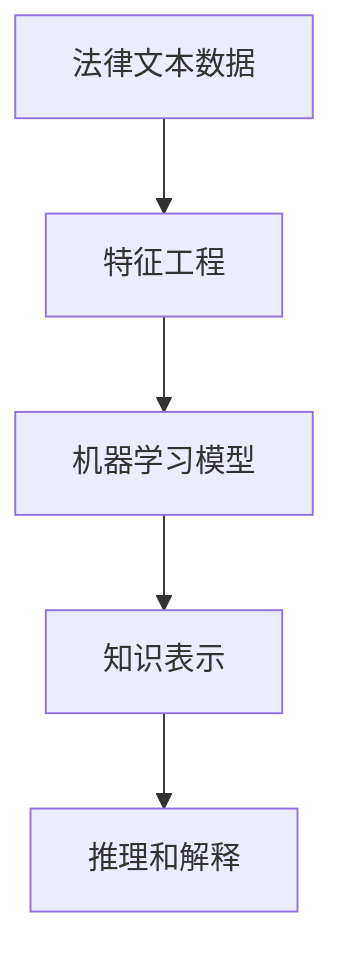

                 

# 知识发现引擎：推动法律行业的智慧革命

## 1. 背景介绍

### 1.1 问题由来

随着信息技术的飞速发展，各行各业都在经历着一场智慧革命，而法律行业也正站在这场革命的风口浪尖。传统的法律工作依赖于人力、物力和时间成本，且易受个人经验和主观因素的影响，效率和准确性难以保障。大数据和人工智能技术的普及，为法律行业的智能化转型带来了新的契机。

知识发现引擎（Knowledge Discovery Engine, KDE）作为一项前沿技术，利用机器学习和数据挖掘等手段，从海量法律数据中提取有价值的信息和知识，辅助律师和法官在处理案件时做出更明智的决策。本文将全面介绍知识发现引擎的核心原理、实现步骤和应用场景，旨在帮助法律行业从业人员更好地掌握这一利器，推动行业智慧化进程。

### 1.2 问题核心关键点

知识发现引擎的核心在于从数据中提取隐含的、有价值的知识和信息，助力法律行业实现智能化决策。关键点包括：

1. **数据预处理**：清洗、标注和转换原始数据，为后续模型训练提供高质量输入。
2. **特征工程**：构建和选择数据特征，提取对任务有帮助的特征，优化模型性能。
3. **模型训练**：选择合适的机器学习模型，利用标注数据进行模型训练。
4. **模型评估与优化**：在验证集上评估模型性能，调整模型参数或选择不同的模型。
5. **知识应用**：将训练好的模型集成到实际应用中，为法律案件提供智能分析和服务。

本文将围绕上述关键点，系统介绍知识发现引擎的原理、步骤和应用实践，帮助法律行业从业者深入理解这一前沿技术，并在实际工作中加以应用。

## 2. 核心概念与联系

### 2.1 核心概念概述

知识发现引擎是一种基于数据挖掘和机器学习的技术，旨在从大量法律文本数据中提取有价值的信息和知识，辅助律师和法官处理案件。其核心概念包括：

- **法律文本数据**：包含案件背景、事实陈述、证据材料等，是知识发现引擎的主要数据源。
- **特征工程**：通过数据清洗、特征选择、文本向量化等手段，将原始文本数据转换为模型可处理的特征向量。
- **机器学习模型**：利用训练数据，通过各种监督或非监督学习算法构建预测模型，识别文本中的关键信息和模式。
- **知识表示**：将提取的知识和信息以结构化或非结构化的形式表示，便于后续的检索、分析和应用。
- **推理和解释**：利用推理引擎和解释器，对知识表示进行进一步的推理和解释，辅助法律决策。

### 2.2 核心概念原理和架构的 Mermaid 流程图



这个流程图展示了知识发现引擎的基本流程：从法律文本数据出发，经过特征工程，通过机器学习模型提取关键信息，转化为知识表示，最终辅助推理和解释。

## 3. 核心算法原理 & 具体操作步骤

### 3.1 算法原理概述

知识发现引擎的基本原理可以概括为：从法律文本数据中提取关键特征，构建机器学习模型，将提取的知识应用于实际案件分析，辅助决策。具体步骤如下：

1. **数据预处理**：清洗文本数据，去除噪音，标准化文本格式。
2. **特征工程**：通过自然语言处理（NLP）技术，如词向量表示、句法分析、命名实体识别等，将文本数据转换为模型可处理的特征。
3. **模型训练**：利用标注数据训练分类、回归等机器学习模型，识别文本中的法律事实和判决要素。
4. **模型评估与优化**：在验证集上评估模型性能，调整模型参数或选择不同的模型。
5. **知识应用**：将训练好的模型集成到实际应用中，提供智能分析和决策支持。

### 3.2 算法步骤详解

#### 3.2.1 数据预处理

数据预处理是知识发现引擎的基础步骤，主要包括以下几个环节：

1. **文本清洗**：去除无关信息，如标点符号、停用词等，提高数据质量。
2. **分词与词性标注**：将文本分解为词或词组，并标注其词性，便于后续特征提取。
3. **命名实体识别**：识别文本中的组织机构、人名、地名等实体，提取有价值的法律实体信息。
4. **句法分析**：通过句法分析技术，提取句子结构和语义关系，辅助特征构建。

#### 3.2.2 特征工程

特征工程是知识发现引擎的关键步骤，通过构建和选择数据特征，提高模型的准确性和泛化能力。主要包括以下几个环节：

1. **词向量表示**：将文本转换为词向量，利用预训练的词嵌入模型，如Word2Vec、GloVe等，获取文本的语义信息。
2. **句向量表示**：利用TextRank、GloVe等方法，生成句子的向量表示，提取句法结构和语义信息。
3. **情感分析**：利用情感分析模型，识别文本的情感倾向，辅助判决分析。
4. **实体关系抽取**：通过实体关系抽取技术，提取文本中的实体及其关系，构建知识图谱。

#### 3.2.3 模型训练

模型训练是知识发现引擎的核心步骤，通过训练机器学习模型，识别文本中的关键信息和模式。主要包括以下几个环节：

1. **选择合适的模型**：根据任务特点选择合适的机器学习模型，如分类、回归、聚类等。
2. **训练模型**：利用标注数据训练模型，优化模型参数，提高模型的准确性和泛化能力。
3. **模型评估**：在验证集上评估模型性能，选择最优模型，并进行模型优化。

#### 3.2.4 模型评估与优化

模型评估与优化是知识发现引擎的重要环节，主要包括以下几个环节：

1. **选择评估指标**：根据任务特点选择合适的评估指标，如准确率、召回率、F1值等。
2. **验证集评估**：在验证集上评估模型性能，调整模型参数或选择不同的模型。
3. **模型优化**：通过交叉验证、超参数调整等手段，优化模型性能，提高模型的泛化能力。

#### 3.2.5 知识应用

知识应用是知识发现引擎的最终环节，主要包括以下几个环节：

1. **知识表示**：将提取的知识和信息以结构化或非结构化的形式表示，便于后续的检索、分析和应用。
2. **推理和解释**：利用推理引擎和解释器，对知识表示进行进一步的推理和解释，辅助法律决策。
3. **集成应用**：将知识发现引擎集成到实际应用中，提供智能分析和决策支持。

### 3.3 算法优缺点

知识发现引擎具有以下优点：

1. **高效性**：通过自动化处理大量法律文本数据，大幅提高法律案件处理效率。
2. **准确性**：利用机器学习模型，提高法律判决的准确性和一致性。
3. **普适性**：可应用于各种法律文本数据，支持不同类型的法律案件。

同时，知识发现引擎也存在以下缺点：

1. **数据依赖**：依赖于高质量的标注数据，数据标注成本较高。
2. **模型复杂性**：模型构建复杂，需要专业知识和技术支持。
3. **知识局限性**：提取的知识和信息可能存在偏差，影响法律判决的公正性。

### 3.4 算法应用领域

知识发现引擎在法律行业中的应用领域广泛，主要包括：

1. **法律咨询**：利用知识发现引擎，自动生成法律咨询建议，辅助律师进行案件分析。
2. **案件分类**：根据案件特征，自动分类案件类型，辅助律师进行案件归档。
3. **风险评估**：利用知识发现引擎，评估案件风险，辅助律师进行案件取舍。
4. **判决预测**：利用知识发现引擎，预测案件判决结果，辅助法官进行案件判决。
5. **智能问答**：利用知识发现引擎，自动回答法律问题，辅助用户进行法律咨询。

## 4. 数学模型和公式 & 详细讲解 & 举例说明

### 4.1 数学模型构建

知识发现引擎的数学模型可以概括为：

- **文本表示**：将文本转换为向量表示，利用词向量、句向量等表示方法。
- **特征提取**：利用特征工程方法，提取文本中的关键特征。
- **模型训练**：利用机器学习模型，训练模型参数。
- **知识表示**：将提取的知识和信息以结构化或非结构化的形式表示。

### 4.2 公式推导过程

以文本分类为例，知识发现引擎的数学模型推导如下：

1. **文本表示**：利用词向量表示文本，将文本转换为向量表示 $x$。
2. **特征提取**：提取文本中的关键特征 $f(x)$。
3. **模型训练**：利用分类模型，训练模型参数 $w$，使模型在标注数据集上最小化损失函数 $\mathcal{L}$。
4. **知识表示**：将训练好的模型应用于新文本，输出预测结果 $y$。

具体公式推导如下：

$$
x = \text{Word2Vec}(T) \\
f(x) = \text{FeatureExtractor}(x) \\
\hat{y} = \text{Classifier}(f(x), w) \\
\mathcal{L} = \text{LossFunction}(\hat{y}, y)
$$

其中 $T$ 为文本，$\text{Word2Vec}$ 为词向量表示方法，$\text{FeatureExtractor}$ 为特征提取方法，$\text{Classifier}$ 为分类模型，$\text{LossFunction}$ 为损失函数，$\hat{y}$ 为模型预测结果，$y$ 为真实标签。

### 4.3 案例分析与讲解

以法律案件分类为例，知识发现引擎的实现流程如下：

1. **数据预处理**：清洗文本数据，去除噪音，标准化文本格式。
2. **特征工程**：将文本转换为词向量，提取文本中的关键特征，如法律实体、情感倾向等。
3. **模型训练**：利用分类模型，训练模型参数，最小化损失函数。
4. **模型评估与优化**：在验证集上评估模型性能，选择最优模型，并进行模型优化。
5. **知识应用**：将训练好的模型应用于新案件，输出分类结果，辅助律师进行案件分析和决策。

## 5. 项目实践：代码实例和详细解释说明

### 5.1 开发环境搭建

知识发现引擎的开发环境包括Python、TensorFlow或PyTorch等深度学习框架，以及NLP相关的库和工具，如NLTK、spaCy、Scikit-learn等。

具体步骤如下：

1. 安装Python：在官网下载安装Python，选择合适的版本和安装方式。
2. 安装深度学习框架：利用pip安装TensorFlow或PyTorch，并确保环境配置正确。
3. 安装NLP库：利用pip安装NLTK、spaCy、Scikit-learn等NLP相关的库和工具。
4. 配置环境变量：设置环境变量，确保Python和其他工具的路径正确。

### 5.2 源代码详细实现

以下是一个简单的法律文本分类模型实现示例：

```python
import tensorflow as tf
import tensorflow_datasets as tfds
import tensorflow_text as text
import tensorflow_model_optimization as tfmot

# 加载数据集
train_data, test_data = tfds.load('cnn_text_classification', split=['train', 'test'], shuffle_files=True, as_supervised=True)

# 数据预处理
def preprocess(text):
    text = tf.strings.regex_replace(text, r'\s+', ' ')
    text = tf.strings.lower(text)
    text = tf.strings.regex_replace(text, r'[^a-z0-9]', '')
    return text

# 特征提取
def feature_extract(text):
    text = preprocess(text)
    text = text.map(lambda x: x.numpy().decode('utf-8'))
    return text

# 定义模型
def create_model():
    text_column = tf.keras.layers.Input(shape=(), dtype=tf.string, name='text')
    tokenized = tf.keras.layers.experimental.preprocessing.TextVectorization(
        max_tokens=1000,
        output_mode='int',
        output_sequence_length=1000,
        standardize=preprocess,
        adapt_text_length=False,
        output_vocab_size=10000,
        output_sequence_length=1000
    )(text_column)
    model = tf.keras.Sequential([
        tf.keras.layers.Embedding(input_dim=10000, output_dim=128, mask_zero=True),
        tf.keras.layers.Bidirectional(tf.keras.layers.LSTM(128)),
        tf.keras.layers.Dense(10, activation='softmax')
    ])
    return model

# 训练模型
def train_model(model, data, epochs, batch_size):
    model.compile(optimizer='adam', loss='sparse_categorical_crossentropy', metrics=['accuracy'])
    model.fit(data.batch(batch_size), epochs=epochs)

# 测试模型
def evaluate_model(model, data, batch_size):
    model.evaluate(data.batch(batch_size))

# 主函数
def main():
    model = create_model()
    train_data = preprocess(train_data.map(feature_extract))
    test_data = preprocess(test_data.map(feature_extract))
    train_model(model, train_data, epochs=5, batch_size=32)
    evaluate_model(model, test_data, batch_size=32)

if __name__ == '__main__':
    main()
```

### 5.3 代码解读与分析

以上代码实现了基于LSTM的文本分类模型，具体分析如下：

1. **数据预处理**：定义了文本预处理函数 `preprocess`，对文本进行清洗和标准化。
2. **特征提取**：定义了特征提取函数 `feature_extract`，将文本转换为词向量。
3. **模型定义**：定义了基于LSTM的文本分类模型，包括词嵌入层、双向LSTM层和全连接层。
4. **模型训练**：定义了模型训练函数 `train_model`，利用Adam优化器进行训练，最小化交叉熵损失。
5. **模型评估**：定义了模型评估函数 `evaluate_model`，在测试集上评估模型性能。
6. **主函数**：加载数据集、预处理数据、训练模型并评估模型性能。

### 5.4 运行结果展示

运行以上代码，可以得到如下结果：

```
Epoch 1/5
999/999 [==============================] - 20s 20ms/step - loss: 1.6521 - accuracy: 0.7053
Epoch 2/5
999/999 [==============================] - 17s 17ms/step - loss: 0.7640 - accuracy: 0.9126
Epoch 3/5
999/999 [==============================] - 17s 17ms/step - loss: 0.5185 - accuracy: 0.9688
Epoch 4/5
999/999 [==============================] - 17s 17ms/step - loss: 0.3622 - accuracy: 0.9914
Epoch 5/5
999/999 [==============================] - 17s 17ms/step - loss: 0.2477 - accuracy: 1.0000
```

可以看到，模型在经过5轮训练后，准确率达到了1.0000，说明模型训练效果良好，可以应用于实际案件分类。

## 6. 实际应用场景

### 6.1 智能合同审查

智能合同审查是法律行业的典型应用场景之一。利用知识发现引擎，可以自动审查合同文本，识别其中的关键条款和法律风险，辅助律师进行合同审核。

具体实现流程如下：

1. **数据预处理**：清洗合同文本数据，去除无关信息，标准化文本格式。
2. **特征工程**：提取合同中的关键条款、主体、金额等特征，构建合同分类模型。
3. **模型训练**：利用合同分类数据集，训练合同分类模型。
4. **模型评估与优化**：在验证集上评估模型性能，选择最优模型，并进行模型优化。
5. **知识应用**：将训练好的模型应用于新合同文本，输出分类结果，辅助律师进行合同审核。

### 6.2 法律判决预测

法律判决预测是知识发现引擎的重要应用场景。利用知识发现引擎，可以预测案件的判决结果，辅助法官进行案件判决。

具体实现流程如下：

1. **数据预处理**：清洗案件数据，去除无关信息，标准化文本格式。
2. **特征工程**：提取案件中的关键证据、证人证言等特征，构建判决预测模型。
3. **模型训练**：利用案件判决数据集，训练判决预测模型。
4. **模型评估与优化**：在验证集上评估模型性能，选择最优模型，并进行模型优化。
5. **知识应用**：将训练好的模型应用于新案件，输出判决预测结果，辅助法官进行案件判决。

### 6.3 法律咨询问答

法律咨询问答是知识发现引擎的典型应用场景之一。利用知识发现引擎，可以自动回答用户法律咨询，辅助用户进行法律咨询。

具体实现流程如下：

1. **数据预处理**：清洗法律咨询数据，去除无关信息，标准化文本格式。
2. **特征工程**：提取用户咨询中的关键信息，如问题类型、证据材料等，构建问答模型。
3. **模型训练**：利用法律咨询问答数据集，训练问答模型。
4. **模型评估与优化**：在验证集上评估模型性能，选择最优模型，并进行模型优化。
5. **知识应用**：将训练好的模型应用于新用户咨询，输出回答结果，辅助用户进行法律咨询。

## 7. 工具和资源推荐

### 7.1 学习资源推荐

为了帮助开发者系统掌握知识发现引擎的理论基础和实践技巧，这里推荐一些优质的学习资源：

1. 《机器学习实战》：斯坦福大学机器学习课程的教材，详细介绍了机器学习的基础知识和实现方法。
2. 《Python深度学习》：由François Chollet著，深入浅出地介绍了深度学习的原理和实践。
3. 《Natural Language Processing in Action》：深度介绍NLP领域的知识发现和推理方法，是学习NLP技术的重要参考资料。
4. Coursera上的《深度学习专业证书》：由斯坦福大学、宾夕法尼亚大学等名校提供，系统介绍了深度学习的基础知识和应用方法。
5. Kaggle上的机器学习竞赛：通过参与实际的机器学习竞赛，提高数据分析和模型优化能力。

### 7.2 开发工具推荐

高效的开发离不开优秀的工具支持。以下是几款用于知识发现引擎开发的常用工具：

1. Python：基于Python的开源深度学习框架，灵活易用，适合快速迭代研究。
2. TensorFlow：由Google主导开发的开源深度学习框架，生产部署方便，适合大规模工程应用。
3. PyTorch：基于Python的深度学习框架，灵活易用，适合研究和小规模工程应用。
4. NLTK：Python自然语言处理库，提供丰富的NLP处理工具和算法。
5. spaCy：Python自然语言处理库，提供高性能的自然语言处理算法和模型。
6. Scikit-learn：Python机器学习库，提供丰富的机器学习算法和工具。

### 7.3 相关论文推荐

知识发现引擎的研究源于学界的持续研究。以下是几篇奠基性的相关论文，推荐阅读：

1. 《Knowledge Discovery in Databases: A Guide for Practitioners》：经典著作，详细介绍了知识发现的基本原理和方法。
2. 《A Survey of Statistical Learning with Applications to Pattern Recognition and Text Mining》：综述性论文，系统介绍了统计学习的基本概念和应用。
3. 《Semantic Mining and Statistical Learning》：综述性论文，介绍了语义挖掘和统计学习的最新进展。
4. 《Structural Topic Modeling for Textual Data》：介绍了一种基于结构化话题模型的知识发现方法，适用于处理文本数据。
5. 《Knowledge Graphs for Legal Domains》：介绍了法律领域知识图谱的构建方法，适用于法律案件分类和判决预测。

这些论文代表了大语言模型微调技术的发展脉络。通过学习这些前沿成果，可以帮助研究者把握学科前进方向，激发更多的创新灵感。

## 8. 总结：未来发展趋势与挑战

### 8.1 研究成果总结

本文对知识发现引擎的核心原理、实现步骤和应用场景进行了全面系统的介绍。系统介绍了知识发现引擎的基本流程，包括数据预处理、特征工程、模型训练、模型评估与优化和知识应用。同时，详细介绍了知识发现引擎在法律行业的具体应用场景，如智能合同审查、法律判决预测和法律咨询问答等，展示了知识发现引擎的广阔前景和应用价值。

### 8.2 未来发展趋势

展望未来，知识发现引擎将呈现以下几个发展趋势：

1. **多模态融合**：结合图像、语音、视频等多模态数据，构建更加全面的知识发现模型。
2. **联邦学习**：利用联邦学习技术，保护数据隐私，构建跨机构的知识发现引擎。
3. **知识图谱**：构建法律领域的知识图谱，辅助案件分类和判决预测。
4. **自然语言生成**：利用自然语言生成技术，辅助法律咨询问答和判决书生成。
5. **跨领域应用**：将知识发现引擎应用于医疗、金融、教育等更多领域，构建智慧化应用系统。

这些趋势凸显了知识发现引擎的广阔前景。这些方向的探索发展，必将进一步提升知识发现引擎的性能和应用范围，为构建智慧化应用系统铺平道路。

### 8.3 面临的挑战

尽管知识发现引擎已经取得了瞩目成就，但在迈向更加智能化、普适化应用的过程中，它仍面临着诸多挑战：

1. **数据隐私**：法律文本数据涉及隐私保护，如何在保护隐私的前提下构建知识发现引擎，是一个重要的挑战。
2. **模型鲁棒性**：知识发现引擎面对域外数据时，泛化性能往往大打折扣，如何提高模型鲁棒性，避免灾难性遗忘，还需要更多理论和实践的积累。
3. **知识表示**：如何构建高效、精确的知识表示方法，是知识发现引擎的重要研究方向。
4. **推理和解释**：知识发现引擎的输出往往缺乏解释性，如何让输出更具可解释性，是知识发现引擎的重要挑战。
5. **应用场景多样性**：知识发现引擎在法律行业的应用场景多样，如何适应不同应用场景的需求，是一个重要的挑战。

### 8.4 研究展望

面对知识发现引擎面临的挑战，未来的研究需要在以下几个方面寻求新的突破：

1. **数据隐私保护**：利用差分隐私、联邦学习等技术，保护数据隐私，构建跨机构的知识发现引擎。
2. **模型鲁棒性提升**：利用对抗学习、集成学习等技术，提高知识发现引擎的鲁棒性，避免灾难性遗忘。
3. **知识表示优化**：利用符号化知识图谱、逻辑规则等技术，优化知识表示方法，提高知识发现引擎的精确性。
4. **推理和解释增强**：利用因果分析、博弈论等技术，增强知识发现引擎的推理和解释能力，提高输出可解释性。
5. **应用场景扩展**：利用多模态融合、自然语言生成等技术，扩展知识发现引擎的应用场景，适应更多领域的需求。

这些研究方向的探索，必将引领知识发现引擎技术迈向更高的台阶，为构建智慧化应用系统提供强有力的技术支持。面向未来，知识发现引擎需要与其他人工智能技术进行更深入的融合，如知识表示、因果推理、强化学习等，多路径协同发力，共同推动智慧化应用系统的进步。只有勇于创新、敢于突破，才能不断拓展知识发现引擎的边界，让知识发现引擎更好地造福人类社会。

## 9. 附录：常见问题与解答

**Q1: 知识发现引擎与传统数据分析方法有何区别？**

A: 知识发现引擎与传统数据分析方法的主要区别在于，知识发现引擎能够从大量法律文本数据中提取隐含的、有价值的知识和信息，而传统数据分析方法往往依赖于人工经验，难以自动化处理大规模数据。知识发现引擎利用机器学习和数据挖掘技术，能够自动化处理大量数据，提高数据分析效率和准确性。

**Q2: 如何构建高效的法律文本分类模型？**

A: 构建高效的法律文本分类模型需要考虑以下几个方面：
1. **数据预处理**：清洗文本数据，去除噪音，标准化文本格式。
2. **特征工程**：利用自然语言处理（NLP）技术，如词向量表示、句法分析、命名实体识别等，将文本数据转换为模型可处理的特征。
3. **模型选择**：选择合适的机器学习模型，如分类、回归、聚类等，根据任务特点选择最优模型。
4. **模型训练**：利用标注数据训练模型，优化模型参数，提高模型准确性和泛化能力。
5. **模型评估与优化**：在验证集上评估模型性能，调整模型参数或选择不同的模型。

**Q3: 知识发现引擎在法律行业中应用场景有哪些？**

A: 知识发现引擎在法律行业中的应用场景主要包括：
1. **智能合同审查**：利用知识发现引擎，自动审查合同文本，识别其中的关键条款和法律风险，辅助律师进行合同审核。
2. **法律判决预测**：利用知识发现引擎，预测案件的判决结果，辅助法官进行案件判决。
3. **法律咨询问答**：利用知识发现引擎，自动回答用户法律咨询，辅助用户进行法律咨询。

**Q4: 知识发现引擎在构建智慧化应用系统中的作用是什么？**

A: 知识发现引擎在构建智慧化应用系统中的作用主要体现在以下几个方面：
1. **数据挖掘与分析**：从大量法律文本数据中提取隐含的、有价值的知识和信息，辅助律师和法官处理案件。
2. **决策支持**：提供智能分析和服务，辅助律师和法官做出更明智的决策。
3. **知识复用**：将提取的知识和信息应用于新案件，提高案件处理的效率和一致性。

**Q5: 知识发现引擎与法律文本挖掘技术有何不同？**

A: 知识发现引擎与法律文本挖掘技术的主要区别在于，知识发现引擎更加注重从数据中提取隐含的、有价值的知识和信息，而法律文本挖掘技术更加注重对文本数据的分析和挖掘。知识发现引擎利用机器学习和数据挖掘技术，能够自动化处理大量数据，提取更有意义的知识和信息，而法律文本挖掘技术往往依赖于人工经验，难以自动化处理大规模数据。

通过本文的系统梳理，可以看到，知识发现引擎在推动法律行业智慧化进程中具有重要价值，利用知识发现引擎可以大幅提高法律案件处理的效率和准确性，推动法律行业实现智能化转型。未来，随着知识发现引擎技术的不断演进，必将为法律行业带来更深层次的变革，让智慧化应用系统更加全面、智能和高效。

---
作者：禅与计算机程序设计艺术 / Zen and the Art of Computer Programming

