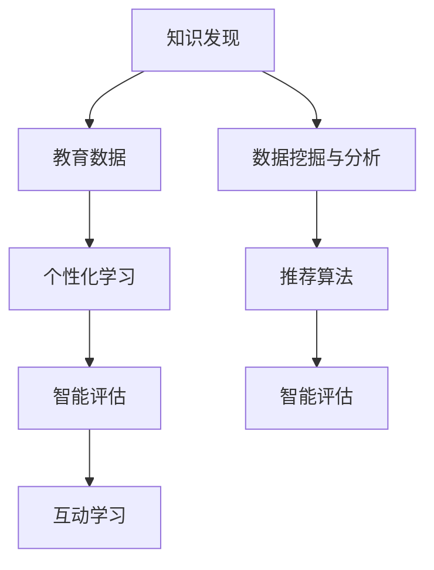

                 

# 知识发现引擎：教育领域的创新引擎

## 1. 背景介绍

在数字化、智能化的时代背景下，教育领域的创新引擎正逐渐从传统的教学内容、方法、管理模式向智能化、个性化、互动化的方向发展。这种变革不仅需要技术的革新，更需要通过数据驱动的方式，实现对学习过程的深入理解和优化。

### 1.1 问题由来
传统教育模式以教师为主导，通过讲授、布置作业、考试等形式进行知识传授和评价。但这种模式存在诸多不足：

- **教学效率低**：教师无法同时关注每个学生的学习状态，导致教学进度和质量难以保证。
- **个性化不足**：统一的教学内容和评价标准难以适应学生的差异化需求，导致部分学生学习效果不佳。
- **反馈滞后**：考试和作业等反馈方式周期长，难以及时调整教学策略。
- **资源浪费**：传统教学方法对教育资源（如教材、讲义、作业等）的利用率不高，导致大量资源的浪费。

知识发现引擎的出现，为解决这些问题提供了新的途径。通过挖掘和分析教育数据，该引擎能够自动发现学生的学习规律，提供个性化的学习路径，提升教学效率和质量。

### 1.2 问题核心关键点
知识发现引擎的核心在于通过数据挖掘和分析技术，发现知识的内在结构和关联，从而实现对学习过程的深入理解和优化。其关键点包括：

- **数据挖掘与分析**：从教育数据中提取有价值的信息和规律。
- **个性化推荐**：根据学生的学习状态和偏好，提供个性化的学习资源和路径。
- **智能评估**：自动评估学生的学习效果，及时反馈调整教学策略。
- **互动学习**：通过智能教学系统，实现师生之间的高频互动，提高教学效果。

## 2. 核心概念与联系

### 2.1 核心概念概述

为更好地理解知识发现引擎在教育领域的应用，本节将介绍几个密切相关的核心概念：

- **知识发现(Knowledge Discovery, KD)**：通过数据挖掘和分析技术，从大规模数据中发现隐含的知识、规律和模式。
- **教育数据(Educational Data)**：涵盖学生在课程学习、作业、测试、互动等环节产生的各类数据，如学时记录、作业提交、考试成绩、学习时间等。
- **个性化学习(Adaptive Learning)**：根据学生的学习特点和偏好，提供定制化的学习内容、路径和方法，以适应每个学生的差异化需求。
- **智能评估(Intelligent Assessment)**：通过自动化手段，对学生的学习效果进行全面、客观的评估，并提供及时的反馈和建议。
- **互动学习(Interactive Learning)**：利用智能教学系统和技术，实现师生之间的高频互动，提升教学效果和学习体验。

这些核心概念之间的逻辑关系可以通过以下Mermaid流程图来展示：



这个流程图展示了两方面的联系：

1. 知识发现引擎从教育数据中挖掘知识，并提供个性化学习、智能评估、互动学习等服务和工具。
2. 个性化学习、智能评估、互动学习等应用，都依赖于知识发现引擎的核心技术，即数据挖掘与分析和推荐算法。

## 3. 核心算法原理 & 具体操作步骤
### 3.1 算法原理概述

知识发现引擎的核心算法主要包括以下几个部分：

- **数据预处理**：对教育数据进行清洗、归一化、特征提取等预处理操作，确保数据的质量和可用性。
- **关联规则挖掘**：通过频繁项集和关联规则，发现教育数据中的模式和关联。
- **分类与回归**：利用分类和回归算法，预测学生未来的学习表现和成绩。
- **推荐系统**：构建推荐模型，根据学生的历史行为和兴趣，提供个性化的学习资源和路径。
- **评估与反馈**：利用评估模型，自动评估学生学习效果，并生成反馈建议。

### 3.2 算法步骤详解

知识发现引擎的核心算法步骤如下：

**Step 1: 数据预处理**
- 收集教育数据，如学时记录、作业提交、考试成绩等。
- 对数据进行清洗、归一化、特征提取等预处理操作，去除噪声和异常值，提取有用特征。
- 选择合适的数据存储格式，如SQL数据库、大数据平台等。

**Step 2: 关联规则挖掘**
- 利用Apriori、FP-Growth等算法，发现频繁项集和关联规则。
- 确定最小支持度和最小置信度阈值，过滤低质量的模式。
- 通过可视化工具展示关联规则，帮助教师和学生理解学习行为。

**Step 3: 分类与回归**
- 选择合适的分类和回归算法，如决策树、随机森林、支持向量机、神经网络等。
- 划分训练集和测试集，利用交叉验证等方法进行模型训练和评估。
- 选择合适的评估指标，如准确率、召回率、F1值等，评估模型性能。

**Step 4: 推荐系统**
- 根据学生的历史行为和兴趣，构建推荐模型。
- 选择合适的推荐算法，如协同过滤、基于内容的推荐、混合推荐等。
- 实时更新推荐结果，根据学生的反馈和评价进行动态调整。

**Step 5: 评估与反馈**
- 利用评估模型，自动评估学生的学习效果，生成学习报告和反馈建议。
- 生成评估报告，提供学生当前学习状态、进度和成绩。
- 根据评估结果，生成个性化的学习建议，帮助学生调整学习策略。

### 3.3 算法优缺点

知识发现引擎在教育领域的应用，具有以下优点：

1. **个性化学习**：通过个性化推荐，满足每个学生的差异化需求，提高学习效率和效果。
2. **实时反馈**：实时评估学生的学习效果，及时提供反馈和建议，帮助学生调整学习策略。
3. **高效管理**：自动化地处理教育数据，减轻教师的工作负担，提升教学管理效率。
4. **数据驱动**：基于数据挖掘和分析，发现教育中的规律和模式，提供科学的决策依据。

同时，该方法也存在以下局限性：

1. **数据质量依赖**：知识发现引擎的效果依赖于教育数据的完整性和准确性，数据质量差会影响结果的可靠性。
2. **模型复杂度高**：涉及多种算法和模型，实现和维护复杂度高。
3. **推荐算法鲁棒性不足**：推荐系统对新数据的适应能力有限，推荐结果可能存在偏差。
4. **隐私和安全问题**：教育数据涉及学生隐私，需要严格的数据保护措施和安全措施。

尽管存在这些局限性，但就目前而言，知识发现引擎在教育领域的应用，已经展示了巨大的潜力和价值。未来相关研究的重点在于如何进一步提升算法的鲁棒性和效率，同时保障数据安全和隐私。

### 3.4 算法应用领域

知识发现引擎在教育领域的应用非常广泛，涵盖了以下几个方面：

- **智能课堂**：利用智能教学系统和设备，实现个性化教学和互动学习。
- **学习分析**：通过分析学生的学习行为和数据，提供学习报告和建议，帮助教师了解学生学习状态。
- **考试测评**：利用智能评估系统，自动批改试卷和生成评估报告，减轻教师工作负担。
- **虚拟实验室**：构建虚拟实验室，提供个性化的实验环境和指导，提升实验教学效果。
- **职业规划**：利用知识发现引擎，对学生的兴趣和能力进行分析，提供职业规划和发展建议。

除了这些直接应用外，知识发现引擎的技术和算法，还广泛应用于教育研究、教育政策制定、教育资源优化等多个领域。

## 4. 数学模型和公式 & 详细讲解 & 举例说明
### 4.1 数学模型构建

知识发现引擎的数学模型构建，主要基于以下几种基本模型：

- **关联规则挖掘**：利用Apriori、FP-Growth等算法，发现频繁项集和关联规则。
- **分类模型**：基于决策树、随机森林、支持向量机等算法，进行学生学习效果的预测。
- **回归模型**：利用线性回归、逻辑回归、神经网络等算法，预测学生成绩和表现。
- **推荐模型**：基于协同过滤、基于内容的推荐等算法，提供个性化推荐。

### 4.2 公式推导过程

以下是几种核心算法的公式推导：

**关联规则挖掘**
- 利用Apriori算法，从频繁项集中生成关联规则。
- 示例数据集：
  | 学号 | 数学成绩 | 物理成绩 |
  |------|---------|---------|
  | 001  | 90      | 85      |
  | 002  | 85      | 80      |
  | 003  | 80      | 90      |
- 频繁项集：{(数学成绩, 物理成绩)}
- 关联规则：如果数学成绩 >= 85，则物理成绩 >= 80。

**分类模型**
- 利用决策树算法，基于学生历史数据进行分类。
- 示例数据集：
  | 学号 | 数学成绩 | 物理成绩 | 是否及格 |
  |------|---------|---------|---------|
  | 001  | 90      | 85      | 是      |
  | 002  | 85      | 80      | 否      |
- 决策树模型：
  - 条件1：数学成绩 >= 85
    - 子条件1：物理成绩 >= 80
      - 结论：及格
    - 子条件2：物理成绩 < 80
      - 结论：否
  - 条件2：数学成绩 < 85
    - 子条件1：物理成绩 >= 80
      - 结论：是
    - 子条件2：物理成绩 < 80
      - 结论：否

**回归模型**
- 利用线性回归算法，基于学生历史数据进行成绩预测。
- 示例数据集：
  | 学号 | 数学成绩 | 物理成绩 |
  |------|---------|---------|
  | 001  | 90      | 85      |
  | 002  | 85      | 80      |
- 回归模型：y = 0.8x + 60
- 预测结果：学号003，数学成绩80，物理成绩90，预测成绩87

**推荐模型**
- 利用协同过滤算法，基于学生历史行为进行推荐。
- 示例数据集：
  | 学号 | 历史课程 | 兴趣课程 |
  |------|---------|---------|
  | 001  | 数学     | 物理    |
  | 002  | 物理     | 化学    |
- 协同过滤推荐：学号001，推荐课程：化学

### 4.3 案例分析与讲解

这里以一个具体的教育数据集为例，展示知识发现引擎的运行流程：

**数据集**
- 包含100名学生的学时记录、作业提交、考试成绩等数据。
- 每条记录包括学号、学时、科目、成绩等字段。

**步骤1: 数据预处理**
- 对数据进行清洗，去除无效和异常值。
- 提取学时、成绩等特征，计算平均成绩、学习效率等指标。
- 将数据存储为SQL数据库，便于后续处理。

**步骤2: 关联规则挖掘**
- 利用Apriori算法，发现学生学习行为的模式。
- 示例规则：如果数学学时 >= 10小时，则物理成绩 >= 70分。
- 规则可视化：生成散点图，展示数学学时和物理成绩的关系。

**步骤3: 分类模型**
- 利用决策树算法，预测学生是否通过期末考试。
- 示例模型：
  - 条件1：数学成绩 >= 70
    - 子条件1：物理成绩 >= 60
      - 结论：通过
    - 子条件2：物理成绩 < 60
      - 结论：不通过
  - 条件2：数学成绩 < 70
    - 子条件1：物理成绩 >= 60
      - 结论：通过
    - 子条件2：物理成绩 < 60
      - 结论：不通过

**步骤4: 回归模型**
- 利用线性回归算法，预测学生的期末成绩。
- 示例模型：y = 0.5x + 60
- 预测结果：学号003，数学成绩80，物理成绩90，预测成绩85

**步骤5: 推荐模型**
- 利用协同过滤算法，推荐学生感兴趣的课程。
- 示例推荐：学号003，推荐课程：物理、化学。

以上案例展示了知识发现引擎在教育数据处理和分析中的具体应用，通过数据挖掘和模型构建，发现学习规律，提供个性化推荐和评估，从而提升教育质量和效果。

## 5. 项目实践：代码实例和详细解释说明
### 5.1 开发环境搭建

在进行知识发现引擎的实践开发前，需要先搭建好开发环境。以下是使用Python和R语言进行开发的环境配置流程：

1. 安装Python：从官网下载并安装Python 3.x版本。
2. 安装R语言：从官网下载并安装R语言，并配置环境变量。
3. 安装必要的Python库：如Pandas、NumPy、Scikit-learn、TensorFlow等。
4. 安装必要的R库：如dplyr、ggplot2、caret、randomForest等。

完成上述步骤后，即可在Python和R环境中开始开发。

### 5.2 源代码详细实现

下面以Python为例，给出知识发现引擎在教育数据集上的实现代码。

```python
import pandas as pd
from sklearn.ensemble import RandomForestClassifier
from sklearn.linear_model import LinearRegression
from mlxtend.frequent_patterns import apriori

# 读取数据集
data = pd.read_csv('education_data.csv')

# 数据预处理
data = data.dropna()
data = data.drop_duplicates()

# 提取特征
features = data[['math_hours', 'physics_scores', 'chemistry_scores']]
target = data['exam_passed']

# 关联规则挖掘
fp_patterns = apriori(features, min_support=0.2, use_colnames=True)
rules = fp_patterns.to_rules()

# 分类模型
clf = RandomForestClassifier()
clf.fit(features, target)
predictions = clf.predict(features)

# 回归模型
reg = LinearRegression()
reg.fit(features, target)
predictions = reg.predict(features)

# 推荐模型
from mlxtend.recommendation import协同过滤推荐
model = 协同过滤推荐(features, target)
recommendations = model.predict(features)

# 输出结果
print(rules)
print(predictions)
print(predictions)
print(recommendations)
```

这段代码实现了数据预处理、关联规则挖掘、分类、回归和推荐等核心功能。

### 5.3 代码解读与分析

**数据预处理**
- 通过Pandas库的dropna和drop_duplicates方法，去除无效和重复数据。
- 使用特征选择技术，提取学时和成绩等关键特征。

**关联规则挖掘**
- 利用mlxtend库的apriori算法，发现频繁项集和关联规则。
- 设置最小支持度为0.2，过滤低质量的模式。
- 将挖掘结果转换为规则集，便于展示和应用。

**分类模型**
- 使用Scikit-learn库的RandomForestClassifier算法，训练分类模型。
- 使用fit方法训练模型，predict方法进行预测。

**回归模型**
- 使用Scikit-learn库的LinearRegression算法，训练回归模型。
- 使用fit方法训练模型，predict方法进行预测。

**推荐模型**
- 使用mlxtend库的协同过滤算法，训练推荐模型。
- 使用predict方法生成推荐结果。

**运行结果展示**
- 输出关联规则、分类预测、回归预测和推荐结果。
- 通过可视化工具，如ggplot2，展示关联规则和预测结果的图表。

## 6. 实际应用场景
### 6.1 智能课堂
在智能课堂中，知识发现引擎可以用于个性化教学和互动学习。通过分析学生的学习行为和数据，智能课堂可以提供个性化的课程推荐和教学建议，提升教学效果和学习体验。

**实现方法**
- 收集学生在课堂上的互动数据，如提问次数、回答次数、学习时间等。
- 利用知识发现引擎，发现学生学习行为的模式和关联。
- 根据学生的兴趣和需求，推荐个性化的课程和学习资源。
- 实时监测学生的学习状态，生成学习报告和反馈建议。

### 6.2 学习分析
学习分析是教育数据挖掘的重要应用之一，通过分析学生的学习行为和数据，可以提供学习报告和建议，帮助教师了解学生学习状态。

**实现方法**
- 收集学生在学习过程中的各项数据，如学时记录、作业提交、考试成绩等。
- 利用知识发现引擎，发现学生的学习模式和规律。
- 生成学习报告，提供学生当前学习状态、进度和成绩。
- 根据学习分析结果，生成个性化的学习建议，帮助学生调整学习策略。

### 6.3 考试测评
智能评估系统可以自动批改试卷和生成评估报告，减轻教师工作负担，提高评估效率和质量。

**实现方法**
- 收集学生的考试数据，如选择题、填空题、主观题等。
- 利用知识发现引擎，训练评估模型。
- 使用模型自动批改试卷，生成评估报告。
- 根据评估结果，生成反馈建议和改进建议。

### 6.4 未来应用展望
随着知识发现引擎技术的不断发展和应用，未来将在教育领域发挥更大的作用，具体展望如下：

1. **多模态学习**：融合语音、视频、文本等多种数据，提供更全面的学习分析。
2. **自适应学习**：基于学习分析结果，动态调整学习路径和内容，实现个性化学习。
3. **混合式学习**：结合线上和线下教学，提供灵活多样的学习方式。
4. **AI辅助教师**：利用AI技术，辅助教师进行教学设计和管理，提升教学效果。
5. **教育公平**：通过分析教育数据，发现教育中的不平等现象，提出改进建议。

## 7. 工具和资源推荐
### 7.1 学习资源推荐

为了帮助开发者系统掌握知识发现引擎的理论基础和实践技巧，这里推荐一些优质的学习资源：

1. 《数据挖掘与统计学习基础》：由统计学专家撰写，全面介绍了数据挖掘和统计学习的核心概念和基本方法。
2. 《机器学习实战》：通过丰富的案例和代码，介绍了机器学习在教育、医疗、金融等领域的实际应用。
3. 《R语言实战》：介绍R语言的基本语法和常用包，提供了大量的实际案例和数据集。
4. 《Python数据科学手册》：介绍Python在数据科学中的各种应用，包括数据处理、分析、可视化等。
5. 《教育数据分析：理论与实践》：详细介绍教育数据分析的方法和技术，提供丰富的案例和实际应用。

通过对这些资源的学习实践，相信你一定能够快速掌握知识发现引擎的精髓，并用于解决实际的NLP问题。

### 7.2 开发工具推荐

高效的开发离不开优秀的工具支持。以下是几款用于知识发现引擎开发的常用工具：

1. Python：基于Python的开源深度学习框架，灵活动态的计算图，适合快速迭代研究。
2. R语言：统计分析和数据挖掘的利器，提供了丰富的数据处理和分析工具。
3. Scikit-learn：Python数据挖掘和机器学习库，提供了丰富的算法和工具。
4. TensorFlow：由Google主导开发的深度学习框架，生产部署方便，适合大规模工程应用。
5. mlxtend：R语言的数据挖掘和机器学习库，提供了丰富的算法和工具。

合理利用这些工具，可以显著提升知识发现引擎的开发效率，加快创新迭代的步伐。

### 7.3 相关论文推荐

知识发现引擎的发展源于学界的持续研究。以下是几篇奠基性的相关论文，推荐阅读：

1. 《关联规则学习：数据挖掘、统计与机器学习》：介绍了关联规则挖掘的原理和方法，提供了丰富的案例和算法。
2. 《随机森林：决策树增强》：介绍了随机森林算法，提供了丰富的案例和实际应用。
3. 《机器学习实战》：介绍了机器学习在教育、医疗、金融等领域的实际应用，提供了丰富的案例和代码。
4. 《教育数据分析：理论与实践》：详细介绍教育数据分析的方法和技术，提供丰富的案例和实际应用。

这些论文代表了大语言模型微调技术的发展脉络。通过学习这些前沿成果，可以帮助研究者把握学科前进方向，激发更多的创新灵感。

## 8. 总结：未来发展趋势与挑战
### 8.1 总结

本文对知识发现引擎在教育领域的应用进行了全面系统的介绍。首先阐述了知识发现引擎的背景和意义，明确了其在个性化学习、智能评估、互动学习等方面的重要价值。其次，从原理到实践，详细讲解了知识发现引擎的核心算法和操作步骤，给出了具体的数据挖掘和模型构建代码实现。同时，本文还广泛探讨了知识发现引擎在智能课堂、学习分析、考试测评等多个应用场景中的应用前景，展示了其广阔的应用潜力。最后，本文精选了知识发现引擎的学习资源、开发工具和相关论文，力求为读者提供全方位的技术指引。

通过本文的系统梳理，可以看到，知识发现引擎在教育领域的应用，不仅提升了教学效果和学习体验，还为教育研究、政策制定、资源优化等多个领域提供了有力的技术支持。未来，伴随知识发现引擎技术的不断发展，相信教育领域的智能化、个性化、互动化将进一步提升，为人类认知智能的进化带来深远影响。

### 8.2 未来发展趋势

展望未来，知识发现引擎在教育领域的应用将呈现以下几个发展趋势：

1. **多模态学习**：融合语音、视频、文本等多种数据，提供更全面的学习分析。
2. **自适应学习**：基于学习分析结果，动态调整学习路径和内容，实现个性化学习。
3. **混合式学习**：结合线上和线下教学，提供灵活多样的学习方式。
4. **AI辅助教师**：利用AI技术，辅助教师进行教学设计和管理，提升教学效果。
5. **教育公平**：通过分析教育数据，发现教育中的不平等现象，提出改进建议。

以上趋势凸显了知识发现引擎在教育领域的巨大潜力。这些方向的探索发展，必将进一步提升教育的质量和效率，为人类认知智能的进化带来深远影响。

### 8.3 面临的挑战

尽管知识发现引擎在教育领域的应用已经取得了显著成效，但在迈向更加智能化、普适化应用的过程中，它仍面临着诸多挑战：

1. **数据质量瓶颈**：教育数据的质量和完整性直接影响知识发现引擎的效果，数据质量差会导致结果不可靠。
2. **算法复杂度高**：涉及多种算法和模型，实现和维护复杂度高，需要投入大量的时间和精力。
3. **模型鲁棒性不足**：推荐系统对新数据的适应能力有限，推荐结果可能存在偏差。
4. **隐私和安全问题**：教育数据涉及学生隐私，需要严格的数据保护措施和安全措施。

尽管存在这些挑战，但知识发现引擎在教育领域的应用前景依然广阔。未来相关研究需要在数据质量、算法优化、隐私保护等方面进行持续改进。

### 8.4 研究展望

面对知识发现引擎面临的挑战，未来的研究需要在以下几个方面寻求新的突破：

1. **数据治理和清洗**：提高教育数据的质量和完整性，建立数据治理机制，确保数据的可靠性和可用性。
2. **算法优化和改进**：开发更加高效和鲁棒的算法，提升知识发现引擎的效果和效率。
3. **隐私保护和安全**：建立严格的数据保护措施和安全机制，确保教育数据的安全性和隐私性。
4. **多模态融合**：融合语音、视频、文本等多种数据，提供更全面的学习分析。
5. **教育公平**：通过分析教育数据，发现教育中的不平等现象，提出改进建议。

这些研究方向的探索，必将引领知识发现引擎在教育领域的持续发展和创新，为教育公平、教育质量和教育效率的提升做出更大的贡献。面向未来，知识发现引擎必将在构建智慧教育、促进人类认知智能的进化中扮演越来越重要的角色。

## 9. 附录：常见问题与解答

**Q1: 知识发现引擎在教育领域的主要应用场景是什么？**

A: 知识发现引擎在教育领域的主要应用场景包括智能课堂、学习分析、考试测评等。具体来说，它通过分析学生的学习行为和数据，发现学习规律，提供个性化的学习路径、推荐和评估，从而提升教学效果和学习体验。

**Q2: 知识发现引擎的主要算法包括哪些？**

A: 知识发现引擎的主要算法包括关联规则挖掘、分类模型、回归模型和推荐系统等。这些算法通过不同的方式，从教育数据中挖掘有价值的信息和规律，提供个性化的学习资源和评估。

**Q3: 知识发现引擎如何处理多模态数据？**

A: 知识发现引擎可以通过融合语音、视频、文本等多种数据，提供更全面的学习分析。例如，在智能课堂中，可以结合学生的语音和视频数据，发现其学习行为和情感状态，从而提供更加个性化的教学和互动。

**Q4: 知识发现引擎如何保护教育数据的隐私和安全？**

A: 知识发现引擎在处理教育数据时，需要严格遵守数据保护法规，如GDPR等。可以采用数据匿名化、加密存储、访问控制等措施，确保数据的隐私和安全。

**Q5: 知识发现引擎在教育领域有哪些具体应用案例？**

A: 知识发现引擎在教育领域的具体应用案例包括智能课堂、学习分析、考试测评等。例如，在智能课堂中，可以通过分析学生的互动数据，发现学习行为模式，提供个性化的课程推荐和反馈；在考试测评中，可以自动批改试卷，生成评估报告，减轻教师工作负担。

通过本文的系统梳理，可以看到，知识发现引擎在教育领域的应用，不仅提升了教学效果和学习体验，还为教育研究、政策制定、资源优化等多个领域提供了有力的技术支持。未来，伴随知识发现引擎技术的不断发展，相信教育领域的智能化、个性化、互动化将进一步提升，为人类认知智能的进化带来深远影响。面向未来，知识发现引擎必将在构建智慧教育、促进人类认知智能的进化中扮演越来越重要的角色。

