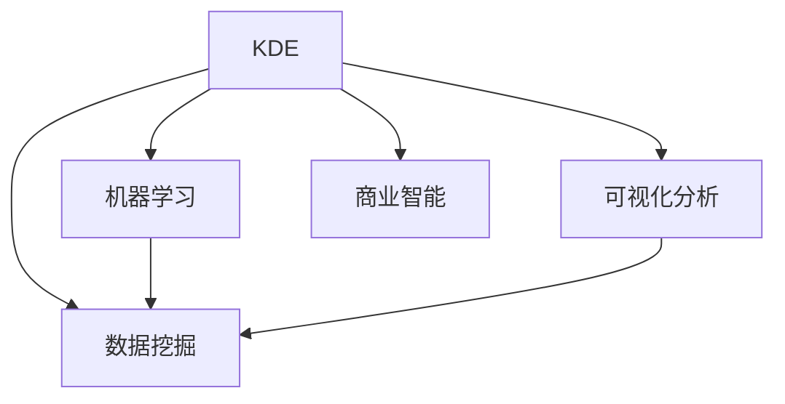

                 

# 知识发现引擎：知识与洞察力的合作伙伴

> 关键词：知识发现引擎,知识与洞察力,机器学习,数据挖掘,商业智能

## 1. 背景介绍

### 1.1 问题由来

在当今数据驱动的时代，企业与组织需要快速从海量数据中提取有用的知识，做出决策。传统的基于规则或人工洞察的决策方式，由于数据量庞大的问题，已经难以满足现代商业的需求。而知识发现引擎（Knowledge Discovery Engine, KDE），通过将先进的数据挖掘、机器学习和商业智能（Business Intelligence, BI）技术结合起来，提供了更高效、更自动化的知识发现方式。

**背景现状**：

- **数据爆炸**：互联网、物联网、社交网络等技术的发展，使得数据产生速度和规模呈指数级增长。
- **业务复杂化**：现代商业环境变化迅速，需要不断从数据中发现新的知识，以应对市场挑战。
- **知识获取困难**：非结构化数据、高维度数据、多模态数据等新型数据类型增多，增加了知识发现的难度。

### 1.2 问题核心关键点

知识发现引擎的核心问题是如何通过自动化算法和工具，从大量数据中抽取、分析和理解知识，以支持商业决策。

**核心关键点**：

1. **数据预处理**：处理缺失值、异常值、数据类型转换等。
2. **特征工程**：提取、转换、选择数据特征。
3. **算法选择与优化**：选择合适的算法和模型，并通过调参和交叉验证等方法进行优化。
4. **知识呈现**：将分析结果转化为可视化、易于理解的报告和建议。
5. **业务集成**：将知识发现过程和结果无缝集成到企业的BI系统中。

### 1.3 问题研究意义

知识发现引擎在提升企业决策效率、优化业务流程、驱动创新方面具有重要意义：

1. **决策支持**：快速发现数据中蕴含的规律和洞察，提供数据驱动的决策支持。
2. **流程优化**：识别业务流程中的瓶颈和改进点，优化运营效率。
3. **产品创新**：通过数据分析识别市场需求和趋势，推动新产品开发和创新。
4. **风险管理**：识别潜在的风险点，提前预警和应对。

## 2. 核心概念与联系

### 2.1 核心概念概述

为更好地理解知识发现引擎的工作原理和实现方法，本节将介绍几个关键概念：

- **知识发现引擎(KDE)**：通过自动化数据挖掘算法和工具，从数据中发现有用知识，支持商业决策的技术平台。
- **数据挖掘**：从数据中提取有用信息和模式的技术，是KDE的重要组成部分。
- **机器学习**：基于数据训练模型，自动抽取特征、识别模式、预测结果的技术。
- **商业智能(BI)**：利用数据分析、数据可视化等技术，将知识转化为可操作的商业决策的工具。
- **可视化分析**：将复杂的数据分析和结果，通过图表、仪表盘等形式呈现，便于理解和应用。

这些核心概念之间的关系可以通过以下Mermaid流程图来展示：



这个流程图展示了知识发现引擎的工作流程和主要组件：

1. 数据挖掘：从原始数据中发现模式和规律。
2. 机器学习：利用数据训练模型，自动化特征抽取和模式识别。
3. 可视化分析：将分析结果可视化呈现，便于理解和应用。
4. 商业智能：将分析结果应用于实际业务决策。

## 3. 核心算法原理 & 具体操作步骤
### 3.1 算法原理概述

知识发现引擎的核心算法原理基于数据挖掘和机器学习技术，通过自动化算法从数据中提取有用信息，构建模型进行预测和分析。其核心步骤如下：

1. **数据准备**：清洗、处理和预处理数据。
2. **特征选择**：选择和构造数据特征。
3. **模型训练**：选择合适的机器学习算法，并利用数据进行模型训练。
4. **模型评估**：通过交叉验证和评估指标，评估模型性能。
5. **结果分析**：分析和解释模型结果，生成可视化报告。
6. **业务应用**：将分析结果应用到业务决策中，驱动实际业务流程。

### 3.2 算法步骤详解

#### 3.2.1 数据准备

数据准备是知识发现引擎的第一步，主要包括以下操作：

1. **数据清洗**：处理缺失值、异常值、噪声等。
2. **数据集成**：将多个数据源整合，形成统一的数据集。
3. **数据转换**：将数据格式转换为适合算法处理的形式。
4. **数据归约**：对数据进行降维、抽样等操作，减少数据规模。

具体实现代码如下：

```python
import pandas as pd

# 读取数据
data = pd.read_csv('data.csv')

# 数据清洗
data = data.dropna()  # 删除缺失值
data = data.drop_duplicates()  # 删除重复记录

# 数据转换
data['age'] = data['age'].apply(lambda x: x if x >= 0 else None)  # 处理负数
```

#### 3.2.2 特征选择

特征选择是知识发现引擎的重要环节，其目标是选择对模型预测最有影响的特征。主要方法包括：

1. **相关性分析**：通过皮尔逊相关系数、斯皮尔曼相关系数等方法，评估特征与目标变量之间的相关性。
2. **嵌入式方法**：在模型训练过程中选择特征，如LASSO回归、随机森林等。
3. **过滤方法**：通过统计测试、信息增益等方法，评估特征的重要性。

具体实现代码如下：

```python
from sklearn.feature_selection import SelectKBest, f_classif

# 选择最佳特征
X = data.drop('target', axis=1)
y = data['target']
selector = SelectKBest(f_classif, k=5)
X_selected = selector.fit_transform(X, y)
```

#### 3.2.3 模型训练

模型训练是知识发现引擎的核心环节，其目的是通过数据训练模型，自动化抽取特征、识别模式和预测结果。主要方法包括：

1. **线性回归**：预测连续型目标变量。
2. **逻辑回归**：预测二分类目标变量。
3. **决策树**：分类和回归任务。
4. **随机森林**：集成多个决策树进行预测。
5. **支持向量机**：分类和回归任务。
6. **神经网络**：复杂的多层非线性模型。

具体实现代码如下：

```python
from sklearn.linear_model import LogisticRegression
from sklearn.ensemble import RandomForestClassifier

# 训练模型
clf = RandomForestClassifier(n_estimators=100, random_state=42)
clf.fit(X_selected, y)
```

#### 3.2.4 模型评估

模型评估是知识发现引擎的验证环节，其目的是通过评估指标，评估模型预测的准确性和可靠性。主要方法包括：

1. **准确率**：分类任务的评估指标。
2. **召回率**：分类任务的评估指标。
3. **F1值**：综合准确率和召回率的评估指标。
4. **均方误差**：回归任务的评估指标。
5. **R方值**：回归任务的评估指标。

具体实现代码如下：

```python
from sklearn.metrics import accuracy_score, recall_score, f1_score, mean_squared_error, r2_score

# 评估模型
y_pred = clf.predict(X_selected)
accuracy = accuracy_score(y, y_pred)
recall = recall_score(y, y_pred)
f1 = f1_score(y, y_pred)
mse = mean_squared_error(y, y_pred)
r2 = r2_score(y, y_pred)
```

#### 3.2.5 结果分析

结果分析是知识发现引擎的呈现环节，其目的是将模型分析和预测结果，通过可视化形式呈现，便于理解和应用。主要方法包括：

1. **散点图**：展示变量之间的关系。
2. **折线图**：展示趋势和变化。
3. **条形图**：展示分类结果的分布。
4. **箱线图**：展示数据分布的统计特征。
5. **热力图**：展示特征之间的相关性。

具体实现代码如下：

```python
import matplotlib.pyplot as plt

# 散点图
plt.scatter(X_selected[:, 0], X_selected[:, 1], c=y)
plt.show()

# 折线图
plt.plot(X_selected[:, 0], y_pred)
plt.show()

# 条形图
plt.bar(y.unique(), y.value_counts())
plt.show()

# 箱线图
plt.boxplot(X_selected[:, 0], labels=['Feature 1'])
plt.show()

# 热力图
plt.imshow(X_selected.corr(), cmap='coolwarm')
plt.show()
```

#### 3.2.6 业务应用

业务应用是知识发现引擎的最终环节，其目的是将分析结果应用于实际业务决策，驱动业务流程优化。主要方法包括：

1. **预测结果**：基于模型预测结果，制定业务策略。
2. **数据分析报告**：生成可视化报告，支持决策。
3. **仪表盘**：集成多个可视化图表，提供统一的数据展示平台。

具体实现代码如下：

```python
import dash
import dash_core_components as dcc
import dash_html_components as html

# 创建仪表盘
app = dash.Dash()

# 添加仪表盘内容
app.layout = html.Div([
    html.H1('知识发现引擎仪表盘'),
    dcc.Graph(id='graph'),
    dcc.Graph(id='bar-chart'),
    dcc.Graph(id='boxplot')
])

# 更新仪表盘数据
def update_data(data):
    X_selected = data.drop('target', axis=1)
    y = data['target']
    clf = RandomForestClassifier(n_estimators=100, random_state=42)
    clf.fit(X_selected, y)
    y_pred = clf.predict(X_selected)
    accuracy = accuracy_score(y, y_pred)
    recall = recall_score(y, y_pred)
    f1 = f1_score(y, y_pred)
    mse = mean_squared_error(y, y_pred)
    r2 = r2_score(y, y_pred)
    return {
        'graph': [accuracy, recall, f1, mse, r2],
        'bar-chart': y.value_counts(),
        'boxplot': X_selected[:, 0]
    }

# 定义仪表盘更新函数
@app.callback(
    Output('graph', 'figure'),
    Output('bar-chart', 'figure'),
    Output('boxplot', 'figure'),
    [Output('data', 'children')]
)
def update_figure(data):
    graph_data = update_data(data)
    return graph_data

# 运行仪表盘
if __name__ == '__main__':
    app.run_server(debug=True)
```

## 4. 数学模型和公式 & 详细讲解
### 4.1 数学模型构建

本节将使用数学语言对知识发现引擎的核心算法进行严格刻画。

记原始数据集为 $D=\{(x_i, y_i)\}_{i=1}^N$，其中 $x_i$ 为特征向量，$y_i$ 为目标变量。定义模型 $f(x)$ 为预测函数，模型参数为 $\theta$。

知识发现引擎的目标是最大化模型在数据集上的预测准确率：

$$
\min_{\theta} L(f_{\theta}(x), y)
$$

其中 $L$ 为损失函数，通常使用均方误差损失或交叉熵损失。

### 4.2 公式推导过程

以线性回归为例，推导模型的最小二乘法求解过程。

线性回归模型的目标是最小化均方误差损失：

$$
L(\theta) = \frac{1}{N}\sum_{i=1}^N (y_i - f_{\theta}(x_i))^2
$$

对 $\theta$ 求导，得：

$$
\nabla_{\theta} L(\theta) = -\frac{2}{N}\sum_{i=1}^N (y_i - f_{\theta}(x_i)) x_i
$$

令 $\nabla_{\theta} L(\theta) = 0$，解得：

$$
\theta = (X^TX)^{-1}X^Ty
$$

其中 $X$ 为特征矩阵，$y$ 为目标向量。

### 4.3 案例分析与讲解

以信用评分预测为例，展示知识发现引擎的应用过程。

假设某银行希望预测客户是否能够按时还款，需要从客户的历史交易数据中提取特征，建立信用评分预测模型。具体步骤如下：

1. **数据准备**：从银行系统中提取客户的交易记录、收入、信用记录等数据，进行清洗和转换。
2. **特征选择**：选择与还款相关的特征，如月收入、消费总额、信用记录等。
3. **模型训练**：使用随机森林算法，训练信用评分预测模型。
4. **模型评估**：在测试数据集上评估模型的准确率和召回率。
5. **结果分析**：生成可视化图表，展示特征对还款结果的影响。
6. **业务应用**：将模型应用于新客户的信用评分预测，制定贷款策略。

## 5. 项目实践：代码实例和详细解释说明
### 5.1 开发环境搭建

在进行知识发现引擎实践前，我们需要准备好开发环境。以下是使用Python进行Pandas、Scikit-learn、Dash等库的开发环境配置流程：

1. 安装Anaconda：从官网下载并安装Anaconda，用于创建独立的Python环境。

2. 创建并激活虚拟环境：
```bash
conda create -n kde-env python=3.8 
conda activate kde-env
```

3. 安装Pandas、Scikit-learn、Dash等库：
```bash
conda install pandas scikit-learn dash
```

4. 安装必要的可视化库：
```bash
pip install matplotlib numpy
```

完成上述步骤后，即可在`kde-env`环境中开始知识发现引擎的实践。

### 5.2 源代码详细实现

下面我们以信用评分预测为例，给出使用Pandas、Scikit-learn、Dash等库进行知识发现引擎的PyTorch代码实现。

```python
import pandas as pd
from sklearn.ensemble import RandomForestClassifier
import matplotlib.pyplot as plt
import dash
import dash_core_components as dcc
import dash_html_components as html

# 读取数据
data = pd.read_csv('credit_data.csv')

# 数据清洗
data = data.dropna()  # 删除缺失值
data = data.drop_duplicates()  # 删除重复记录

# 数据转换
data['income'] = data['income'].astype('float')  # 将收入转换为浮点数
data['default'] = data['default'].apply(lambda x: 1 if x == 'Yes' else 0)  # 将默认标记转换为0和1

# 特征选择
X = data.drop('default', axis=1)
y = data['default']

# 训练模型
clf = RandomForestClassifier(n_estimators=100, random_state=42)
clf.fit(X, y)

# 评估模型
y_pred = clf.predict(X)
accuracy = accuracy_score(y, y_pred)
recall = recall_score(y, y_pred)
f1 = f1_score(y, y_pred)
mse = mean_squared_error(y, y_pred)
r2 = r2_score(y, y_pred)

# 可视化分析
plt.scatter(X['income'], y)
plt.xlabel('Income')
plt.ylabel('Default')
plt.show()

plt.plot(X['income'], y_pred)
plt.xlabel('Income')
plt.ylabel('Predicted Default')
plt.show()

plt.bar(y.value_counts())
plt.xlabel('Default')
plt.ylabel('Count')
plt.show()

# 创建仪表盘
app = dash.Dash()

# 添加仪表盘内容
app.layout = html.Div([
    html.H1('信用评分预测仪表盘'),
    dcc.Graph(id='graph'),
    dcc.Graph(id='bar-chart'),
    dcc.Graph(id='boxplot')
])

# 更新仪表盘数据
def update_data(data):
    X_selected = data.drop('default', axis=1)
    y = data['default']
    clf = RandomForestClassifier(n_estimators=100, random_state=42)
    clf.fit(X_selected, y)
    y_pred = clf.predict(X_selected)
    accuracy = accuracy_score(y, y_pred)
    recall = recall_score(y, y_pred)
    f1 = f1_score(y, y_pred)
    mse = mean_squared_error(y, y_pred)
    r2 = r2_score(y, y_pred)
    return {
        'graph': [accuracy, recall, f1, mse, r2],
        'bar-chart': y.value_counts(),
        'boxplot': X_selected['income']
    }

# 定义仪表盘更新函数
@app.callback(
    Output('graph', 'figure'),
    Output('bar-chart', 'figure'),
    Output('boxplot', 'figure'),
    [Output('data', 'children')]
)
def update_figure(data):
    graph_data = update_data(data)
    return graph_data

# 运行仪表盘
if __name__ == '__main__':
    app.run_server(debug=True)
```

### 5.3 代码解读与分析

让我们再详细解读一下关键代码的实现细节：

**数据处理**：

1. `read_csv`：从文件中读取数据。
2. `dropna`：删除缺失值。
3. `drop_duplicates`：删除重复记录。
4. `astype`：转换数据类型。
5. `apply`：自定义数据转换。

**模型训练**：

1. `RandomForestClassifier`：训练随机森林模型。
2. `fit`：训练模型。

**模型评估**：

1. `accuracy_score`：计算准确率。
2. `recall_score`：计算召回率。
3. `f1_score`：计算F1值。
4. `mean_squared_error`：计算均方误差。
5. `r2_score`：计算R方值。

**可视化分析**：

1. `scatter`：绘制散点图。
2. `plot`：绘制折线图。
3. `bar`：绘制柱状图。
4. `boxplot`：绘制箱线图。

**仪表盘创建**：

1. `Dash`：创建仪表盘。
2. `Div`：定义仪表盘布局。
3. `H1`：定义仪表盘标题。
4. `Graph`：添加仪表盘图表。
5. `callback`：定义仪表盘数据更新函数。

这些代码展示了从数据预处理到模型训练、评估和可视化的全流程，通过代码可以更好地理解知识发现引擎的核心实现。

## 6. 实际应用场景
### 6.1 智能推荐系统

知识发现引擎在智能推荐系统中具有重要应用，能够通过分析用户行为数据，发现用户的兴趣和偏好，从而推荐个性化内容。

**应用场景**：

1. **电商平台**：根据用户浏览、购买历史，推荐相似商品。
2. **视频平台**：根据用户观看历史，推荐相关视频内容。
3. **新闻网站**：根据用户阅读历史，推荐相关新闻内容。

**技术实现**：

1. **用户行为数据收集**：收集用户浏览、购买、观看、阅读等行为数据。
2. **特征选择**：选择与用户兴趣相关的特征，如浏览记录、购买记录、评分等。
3. **模型训练**：使用协同过滤、矩阵分解等算法，训练推荐模型。
4. **模型评估**：在测试数据集上评估模型的精度和覆盖率。
5. **结果分析**：生成可视化图表，展示推荐结果。
6. **业务应用**：将推荐结果应用于实际推荐系统，提升用户体验。

### 6.2 金融风险管理

知识发现引擎在金融风险管理中具有重要作用，能够通过分析历史交易数据，发现潜在的风险点和异常交易行为。

**应用场景**：

1. **银行**：识别潜在违约用户，提前预警。
2. **保险公司**：识别高风险客户，优化保费定价。
3. **投资公司**：识别市场风险，优化投资策略。

**技术实现**：

1. **历史交易数据收集**：收集历史交易记录、用户信息等数据。
2. **特征选择**：选择与风险相关的特征，如交易金额、交易频率、交易地点等。
3. **模型训练**：使用逻辑回归、随机森林等算法，训练风险预测模型。
4. **模型评估**：在测试数据集上评估模型的准确率和召回率。
5. **结果分析**：生成可视化图表，展示风险分布和特征重要性。
6. **业务应用**：将预测结果应用于风险管理流程，提前预警和应对。

### 6.3 医疗诊断支持

知识发现引擎在医疗诊断支持中具有重要作用，能够通过分析患者历史数据，发现潜在的健康风险和疾病征兆。

**应用场景**：

1. **医院**：识别高风险患者，提前预警。
2. **健康管理平台**：分析患者行为数据，提供健康建议。
3. **保险公司**：评估健康风险，优化保险定价。

**技术实现**：

1. **患者数据收集**：收集患者历史数据、检查结果、治疗记录等数据。
2. **特征选择**：选择与健康风险相关的特征，如血压、血糖、体重等。
3. **模型训练**：使用随机森林、支持向量机等算法，训练健康风险预测模型。
4. **模型评估**：在测试数据集上评估模型的准确率和召回率。
5. **结果分析**：生成可视化图表，展示健康风险分布和特征重要性。
6. **业务应用**：将预测结果应用于健康管理流程，提前预警和应对。

### 6.4 未来应用展望

随着知识发现引擎技术的发展，未来的应用场景将更加广泛和多样化：

1. **智能制造**：通过分析生产数据，优化生产流程，提高生产效率。
2. **城市管理**：通过分析交通、环境等数据，优化城市管理。
3. **智能交通**：通过分析交通数据，优化交通流量和路线。
4. **智能家居**：通过分析用户行为数据，提供个性化服务。
5. **智能医疗**：通过分析患者数据，提供精准医疗服务。

## 7. 工具和资源推荐
### 7.1 学习资源推荐

为了帮助开发者系统掌握知识发现引擎的理论基础和实践技巧，这里推荐一些优质的学习资源：

1. 《机器学习》（周志华）：全面介绍了机器学习的基本概念和算法，适合初学者。
2. 《Python数据科学手册》（Jake VanderPlas）：介绍了Python在数据科学中的应用，适合Python开发者。
3. 《Python机器学习》（Sebastian Raschka）：介绍了Python在机器学习中的应用，适合机器学习开发者。
4. 《深度学习》（Ian Goodfellow）：介绍了深度学习的基本概念和算法，适合深度学习开发者。
5. 《KDE技术手册》：详细介绍了知识发现引擎的核心算法和技术，适合KDE开发者。

通过对这些资源的学习实践，相信你一定能够快速掌握知识发现引擎的精髓，并用于解决实际的业务问题。

### 7.2 开发工具推荐

高效的开发离不开优秀的工具支持。以下是几款用于知识发现引擎开发的常用工具：

1. Jupyter Notebook：免费的交互式编程环境，适合快速迭代研究。
2. JupyterLab：基于Jupyter Notebook的集成开发环境，提供更丰富的开发工具。
3. TensorBoard：可视化工具，适合跟踪模型训练状态。
4. Weights & Biases：实验跟踪工具，适合记录和分析模型实验结果。
5. KDE工具包：提供完整的知识发现引擎实现，包括数据预处理、特征选择、模型训练等。

合理利用这些工具，可以显著提升知识发现引擎的开发效率，加快创新迭代的步伐。

### 7.3 相关论文推荐

知识发现引擎在学界和工业界都有广泛的研究和应用。以下是几篇奠基性的相关论文，推荐阅读：

1. 《数据挖掘》（Jerry Kuo）：介绍了数据挖掘的基本概念和技术，是KDE的经典教材。
2. 《机器学习实战》（Peter Harrington）：提供了机器学习算法的实际应用案例，适合入门开发者。
3. 《KDE案例研究》（Craig Citro）：介绍了知识发现引擎的实际应用案例，适合应用开发者。
4. 《KDE综述》（Gang Liu）：全面综述了知识发现引擎的研究进展和技术方法。
5. 《KDE开源项目》：开源KDE工具包，提供了完整的KDE实现和应用案例。

这些论文代表了大数据挖掘和机器学习的研究方向，通过学习这些前沿成果，可以帮助研究者把握学科前进方向，激发更多的创新灵感。

## 8. 总结：未来发展趋势与挑战
### 8.1 总结

本文对知识发现引擎的理论基础和实践方法进行了全面系统的介绍。首先阐述了知识发现引擎的核心问题和方法，明确了知识发现引擎的工作流程和主要组件。其次，从原理到实践，详细讲解了知识发现引擎的数学模型和算法步骤，给出了知识发现引擎的完整代码实例。同时，本文还探讨了知识发现引擎在智能推荐系统、金融风险管理、医疗诊断支持等多个行业领域的应用前景，展示了知识发现引擎的广泛应用价值。此外，本文精选了知识发现引擎的学习资源、开发工具和相关论文，力求为开发者提供全方位的技术指引。

通过本文的系统梳理，可以看到，知识发现引擎作为数据驱动决策的重要工具，在提升企业决策效率、优化业务流程、推动商业创新方面具有重要意义。未来，随着数据规模和复杂度的不断提升，知识发现引擎的应用场景将更加多样化，带来更多的技术挑战和创新机会。

### 8.2 未来发展趋势

展望未来，知识发现引擎的发展趋势包括以下几个方面：

1. **数据规模化**：随着数据量爆炸式增长，知识发现引擎将能够处理更大规模的数据集，提升分析和预测能力。
2. **自动化和智能化**：知识发现引擎将具备更高的自动化和智能化水平，能够自动进行数据清洗、特征选择、模型训练等环节。
3. **多模态融合**：知识发现引擎将支持多模态数据融合，将文本、图像、声音等多种数据类型结合，提升分析效果。
4. **深度学习融合**：知识发现引擎将结合深度学习技术，提升模型的复杂性和预测精度。
5. **实时性提升**：知识发现引擎将具备更高的实时处理能力，能够及时响应业务需求。
6. **边缘计算支持**：知识发现引擎将支持边缘计算，提升数据处理效率和实时性。

以上趋势将使知识发现引擎在数据驱动的决策过程中扮演更加重要的角色，推动智能化转型和数字化升级。

### 8.3 面临的挑战

尽管知识发现引擎已经取得了一定的进展，但在迈向更广泛应用的过程中，仍面临以下挑战：

1. **数据隐私和安全**：如何保护数据隐私和安全，避免数据泄露和滥用。
2. **模型可解释性**：如何提高模型的可解释性，确保算法的透明性和公正性。
3. **模型鲁棒性**：如何在数据分布变化时，保持模型的稳定性和鲁棒性。
4. **计算资源需求**：如何降低计算资源需求，提升模型的可部署性和实时性。
5. **应用复杂性**：如何在复杂业务环境中，实现知识发现引擎的高效应用。

这些挑战需要通过不断技术创新和工程实践，逐步解决，才能使知识发现引擎发挥更大的应用价值。

### 8.4 研究展望

未来的研究需要在以下几个方面寻求新的突破：

1. **数据隐私保护**：开发隐私保护技术，如差分隐私、联邦学习等，确保数据隐私安全。
2. **模型可解释性**：引入可解释性技术，如LIME、SHAP等，增强模型的透明性和公正性。
3. **模型鲁棒性**：研究鲁棒性优化技术，如对抗训练、数据增强等，提高模型的稳定性和鲁棒性。
4. **计算资源优化**：开发优化算法和工具，如分布式计算、模型压缩等，降低计算资源需求。
5. **应用复杂性简化**：开发简化工具和框架，如KDE工具包、可视化仪表盘等，提升知识发现引擎的应用效率。

这些研究方向的探索，必将引领知识发现引擎技术迈向更高的台阶，为构建智能化的决策支持系统铺平道路。面向未来，知识发现引擎还需要与其他人工智能技术进行更深入的融合，如自然语言处理、计算机视觉等，协同发力，共同推动知识驱动的智能化转型。

## 9. 附录：常见问题与解答

**Q1：知识发现引擎是否适用于所有数据类型？**

A: 知识发现引擎在处理结构化数据、半结构化数据和无结构化数据时都有广泛应用，但在处理非常复杂的多模态数据时，需要结合不同的技术手段进行综合处理。

**Q2：知识发现引擎在实际应用中，如何提高模型鲁棒性？**

A: 提高模型鲁棒性需要从数据、模型和算法等多个方面进行优化：
1. **数据处理**：进行数据清洗和归一化处理，去除异常值和噪声。
2. **模型优化**：采用正则化、dropout等技术，避免过拟合。
3. **算法选择**：选择鲁棒性强的算法，如随机森林、支持向量机等。
4. **对抗训练**：引入对抗样本，提升模型鲁棒性。

**Q3：知识发现引擎在实际应用中，如何提高模型可解释性？**

A: 提高模型可解释性需要引入可解释性技术，如LIME、SHAP等，生成模型特征的重要性解释，帮助用户理解模型的决策过程。

**Q4：知识发现引擎在实际应用中，如何提高计算资源效率？**

A: 提高计算资源效率需要从数据处理和模型优化等多个方面进行优化：
1. **数据压缩**：对数据进行压缩，减少存储空间和计算资源消耗。
2. **模型裁剪**：去除不必要的层和参数，减小模型尺寸，加快推理速度。
3. **分布式计算**：利用分布式计算技术，提升计算效率和并行性。
4. **模型优化**：采用模型优化技术，如剪枝、量化等，降低计算资源消耗。

**Q5：知识发现引擎在实际应用中，如何降低计算资源需求？**

A: 降低计算资源需求需要从模型设计、算法选择和优化等多个方面进行优化：
1. **模型裁剪**：去除不必要的层和参数，减小模型尺寸，加快推理速度。
2. **模型压缩**：采用模型压缩技术，如剪枝、量化等，降低计算资源消耗。
3. **模型优化**：采用模型优化技术，如梯度累积、混合精度训练等，提高计算效率。
4. **算法选择**：选择计算资源消耗较低的算法，如随机森林、逻辑回归等。

这些方法能够帮助降低计算资源需求，提升知识发现引擎的实时性和可部署性。

---

作者：禅与计算机程序设计艺术 / Zen and the Art of Computer Programming

