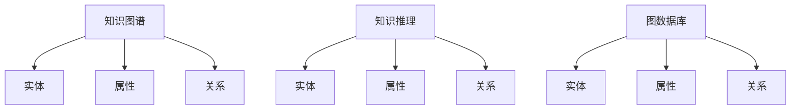

                 

# 知识图谱在个人学习路径规划中的应用

## 1. 背景介绍

在当今信息爆炸的时代，终身学习已成为个人成长和社会发展的关键要素。随着在线教育、知识共享等技术的进步，人们获取知识的方式越来越多样化，但如何在海量知识中高效规划学习路径，提升学习效果，仍然是一个难题。

知识图谱（Knowledge Graphs）作为一种结构化的知识表示方式，为个人学习路径规划提供了一种全新的方法。知识图谱通过描述实体、属性和实体间关系，构建起知识网络，能够帮助人们快速定位知识结构，发现知识之间的关联性，从而更有效地制定学习计划。

## 2. 核心概念与联系

### 2.1 核心概念概述

#### 2.1.1 知识图谱

知识图谱是一种通过实体、属性和关系构建的知识网络。它由节点和边组成，其中节点表示实体，边表示实体之间的关系。知识图谱可以广泛应用于搜索引擎、推荐系统、问答系统等领域，帮助机器理解和处理复杂的知识。

#### 2.1.2 实体与属性

实体是知识图谱的基本单元，可以是人、地点、组织、事件等。属性是实体的特征，描述实体的某些属性，如姓名、地址、属性等。

#### 2.1.3 关系

关系描述实体之间的关系，如“父母”、“同事”、“邻居”等。关系可以是无向或双向的，也可以是带有方向性的。

#### 2.1.4 知识推理

知识推理是指基于知识图谱中的实体和关系，自动推断新的知识和结论。知识推理是知识图谱的核心功能之一，能够帮助机器理解和应用知识。

#### 2.1.5 图数据库

图数据库是一种专门用于存储和查询图数据的数据库，支持基于图的查询语言和算法。图数据库是知识图谱的核心基础设施，为知识图谱的构建、查询和推理提供支持。

### 2.2 核心概念联系

知识图谱、实体、属性、关系、知识推理和图数据库之间的关系可以用下面的Mermaid流程图来表示：



该图展示了知识图谱和实体、属性、关系、知识推理和图数据库之间的关系。其中，实体和属性是知识图谱的组成部分，关系描述了实体之间的关系，知识推理通过实体和关系推断新的知识和结论，图数据库是知识图谱的基础设施。

## 3. 核心算法原理 & 具体操作步骤

### 3.1 算法原理概述

个人学习路径规划的本质是一个基于知识图谱的推理过程。通过构建个人的知识图谱，我们可以利用知识图谱中的实体、属性和关系，发现知识之间的关联性，从而更有效地制定学习计划。

具体而言，个人学习路径规划可以分为以下几个步骤：

1. **构建个人知识图谱**：通过收集个人的学习经历、兴趣爱好、技能等数据，构建个人的知识图谱。
2. **发现知识关联**：利用知识图谱中的实体、属性和关系，发现知识之间的关联性，找到与目标知识相关的实体和关系。
3. **规划学习路径**：根据目标知识和相关实体之间的关系，规划出一条高效的学习路径，涵盖学习目标、所需技能、学习资源等。
4. **动态调整学习路径**：根据学习过程中的反馈和进展，动态调整学习路径，确保学习效果和效率。

### 3.2 算法步骤详解

#### 3.2.1 构建个人知识图谱

构建个人知识图谱需要收集个人的学习经历、兴趣爱好、技能等数据。这些数据可以来自在线学习平台、社交媒体、个人笔记等。

具体步骤如下：

1. **数据收集**：从不同的渠道收集个人的数据，如在线学习平台的学习记录、社交媒体上的兴趣爱好、个人笔记等。
2. **数据清洗**：对收集到的数据进行清洗和预处理，去除冗余、噪音和无效数据。
3. **实体识别**：将清洗后的数据转换成知识图谱中的实体，如课程、技能、兴趣爱好等。
4. **关系抽取**：通过自然语言处理技术，从数据中抽取实体之间的关系，如“参加过某课程”、“擅长某技能”等。
5. **属性添加**：为每个实体添加属性，如课程名称、技能等级、兴趣爱好类别等。

#### 3.2.2 发现知识关联

在构建好个人知识图谱后，我们可以利用知识图谱中的实体、属性和关系，发现知识之间的关联性，找到与目标知识相关的实体和关系。

具体步骤如下：

1. **知识图谱查询**：使用图数据库中的查询语言，如Cypher语言，查询与目标知识相关的实体和关系。
2. **关联性分析**：分析查询结果，找到与目标知识相关的实体和关系，以及它们之间的关联性。
3. **推荐学习资源**：根据关联性分析的结果，推荐学习资源，如相关课程、书籍、视频等。

#### 3.2.3 规划学习路径

在发现知识关联后，我们可以根据目标知识和相关实体之间的关系，规划出一条高效的学习路径，涵盖学习目标、所需技能、学习资源等。

具体步骤如下：

1. **确定学习目标**：明确学习目标，如掌握某项技能、完成某门课程等。
2. **查找相关实体**：在知识图谱中查找与学习目标相关的实体，如所需的技能、课程等。
3. **规划学习路径**：根据相关实体的关系，规划出一条高效的学习路径，涵盖学习目标、所需技能、学习资源等。
4. **动态调整学习路径**：根据学习过程中的反馈和进展，动态调整学习路径，确保学习效果和效率。

### 3.3 算法优缺点

#### 3.3.1 优点

1. **知识关联性**：利用知识图谱中的实体、属性和关系，发现知识之间的关联性，找到与目标知识相关的实体和关系。
2. **学习资源推荐**：根据关联性分析的结果，推荐学习资源，如相关课程、书籍、视频等。
3. **动态调整学习路径**：根据学习过程中的反馈和进展，动态调整学习路径，确保学习效果和效率。

#### 3.3.2 缺点

1. **数据收集难度大**：构建个人知识图谱需要收集大量的个人数据，数据收集和清洗难度较大。
2. **知识图谱复杂**：知识图谱的构建和查询过程较为复杂，需要一定的技术背景和经验。
3. **数据隐私问题**：收集和存储个人数据可能涉及隐私问题，需要确保数据安全和隐私保护。

### 3.4 算法应用领域

知识图谱在个人学习路径规划中的应用主要体现在以下几个领域：

1. **在线教育**：通过构建个人知识图谱，帮助学生制定高效的学习计划，推荐相关学习资源。
2. **职业发展**：通过构建个人知识图谱，帮助职场人士发现自身技能与职业目标之间的关联性，规划职业发展路径。
3. **兴趣爱好**：通过构建个人知识图谱，帮助用户发现自身兴趣与相关领域之间的关联性，拓展兴趣爱好。
4. **终身学习**：通过构建个人知识图谱，帮助用户规划终身学习路径，持续提升自身素质和能力。

## 4. 数学模型和公式 & 详细讲解 & 举例说明

### 4.1 数学模型构建

个人学习路径规划的数学模型可以表示为一个图，其中节点表示实体，边表示实体之间的关系。我们可以使用图数据库中的节点和关系表来表示这个图。

具体来说，我们可以将个人知识图谱表示为一个三元组图，每个三元组表示一个实体-关系-实体（RDF）三元组，其中实体用节点表示，关系用边表示。例如，以下是一个简单的个人知识图谱：

```
Alice - 参加过 - 数据科学课程
Alice - 擅长 - Python编程
```

### 4.2 公式推导过程

在图数据库中，我们可以使用Cypher语言进行查询和推理。例如，以下是一个查询语句，用于查找与“数据科学课程”相关的实体：

```cypher
MATCH (p:Person)-[:参加过]->(c:课程)<-[:擅长]-(s:技能)
WHERE c.name = '数据科学课程'
RETURN s
```

该查询语句的含义是：查找所有参加过“数据科学课程”的Person节点，通过“擅长”关系，查找与课程相关的技能节点，并返回这些技能节点。

### 4.3 案例分析与讲解

#### 4.3.1 案例分析

假设Alice是一名数据科学家，她希望学习机器学习相关的课程。我们可以通过构建Alice的个人知识图谱，发现她已经参加过数据科学课程，并擅长Python编程。根据这些信息，我们可以推荐她学习机器学习课程，并建议她学习Python编程相关技能。

#### 4.3.2 讲解

在实际应用中，我们可以使用Cypher语言进行查询和推理。例如，以下是一个查询语句，用于查找与“机器学习课程”相关的实体：

```cypher
MATCH (p:Person)-[:参加过]->(c:课程)<-[:擅长]-(s:技能)
WHERE c.name = '机器学习课程' AND p.name = 'Alice'
RETURN s
```

该查询语句的含义是：查找所有参加过“机器学习课程”的Person节点，通过“擅长”关系，查找与课程相关的技能节点，并返回这些技能节点。根据查询结果，我们可以推荐Alice学习机器学习课程，并建议她学习Python编程相关技能。

## 5. 项目实践：代码实例和详细解释说明

### 5.1 开发环境搭建

开发环境搭建需要安装图数据库和图查询语言库。常用的图数据库有Neo4j、ArangoDB等，常用的图查询语言库有Cypher、Spark GraphX等。这里以Neo4j和Cypher为例，介绍开发环境的搭建过程。

1. **安装Neo4j**：从官网下载Neo4j社区版，进行安装和配置。
2. **安装Cypher**：通过Neo4j提供的Cypher客户端或官方提供的Cypher语言库，进行Cypher语言的开发和调试。

### 5.2 源代码详细实现

以下是一个简单的Cypher查询，用于查找与“机器学习课程”相关的实体：

```cypher
MATCH (p:Person)-[:参加过]->(c:课程)<-[:擅长]-(s:技能)
WHERE c.name = '机器学习课程' AND p.name = 'Alice'
RETURN s
```

### 5.3 代码解读与分析

#### 5.3.1 Cypher查询

该Cypher查询语句的含义是：

- `MATCH`：匹配节点和关系，构建查询图。
- `(p:Person)-[:参加过]->(c:课程)<-[:擅长]-(s:技能)`：匹配Person节点和课程节点，通过“参加过”关系，查找与课程相关的技能节点。
- `WHERE c.name = '机器学习课程' AND p.name = 'Alice'`：筛选出Alice参加过“机器学习课程”的节点。
- `RETURN s`：返回与“机器学习课程”相关的技能节点。

#### 5.3.2 查询结果

查询结果为与“机器学习课程”相关的技能节点。例如，以下是一个查询结果示例：

```
Alice - 擅长 - Python编程
Alice - 参加过 - 数据科学课程
Alice - 参加过 - 机器学习课程
```

## 6. 实际应用场景

### 6.1 在线教育

在线教育平台可以利用知识图谱技术，帮助学生制定高效的学习计划，推荐相关学习资源。例如，学生可以输入自己的兴趣爱好和学习目标，在线教育平台通过查询知识图谱，推荐相关课程和学习资源。

### 6.2 职业发展

职场人士可以利用知识图谱技术，发现自身技能与职业目标之间的关联性，规划职业发展路径。例如，职场人士可以输入自己的技能和职业目标，知识图谱平台通过查询知识图谱，推荐相关职业路径和技能学习资源。

### 6.3 兴趣爱好

用户可以利用知识图谱技术，发现自身兴趣与相关领域之间的关联性，拓展兴趣爱好。例如，用户可以输入自己的兴趣爱好，知识图谱平台通过查询知识图谱，推荐相关兴趣领域和相关学习资源。

### 6.4 终身学习

终身学习者可以利用知识图谱技术，规划终身学习路径，持续提升自身素质和能力。例如，终身学习者可以输入自己的学习目标和兴趣爱好，知识图谱平台通过查询知识图谱，推荐相关学习资源和职业路径。

## 7. 工具和资源推荐

### 7.1 学习资源推荐

1. **Neo4j官方文档**：Neo4j社区版提供了详细的文档和教程，帮助用户快速上手。
2. **Cypher语言教程**：Cypher语言是图数据库的查询语言，可以通过官方文档和第三方教程学习。
3. **Spark GraphX官方文档**：Spark GraphX是Spark的图处理库，提供了丰富的图处理算法和API。
4. **GraphLab官方文档**：GraphLab是Facebook开源的图处理框架，提供了丰富的图处理算法和API。

### 7.2 开发工具推荐

1. **Neo4j社区版**：免费的Neo4j社区版提供了丰富的功能和大规模集群支持。
2. **Cypher客户端**：Neo4j提供的Cypher客户端，方便用户进行图查询和推理。
3. **Spark GraphX**：Spark GraphX提供了图处理API和算法库，方便用户在Spark上进行图处理。
4. **GraphLab**：Facebook开源的GraphLab提供了图处理算法和API，方便用户进行图处理和分析。

### 7.3 相关论文推荐

1. **GraphSAGE: Semi-supervised Classification of Multi-Relational Networks**：这篇论文提出了GraphSAGE图嵌入方法，用于构建知识图谱中的实体嵌入。
2. **Relational Data Mining with the HyperStreaming Graph**：这篇论文提出了HyperStreaming图数据结构，用于高效存储和查询图数据。
3. **Scalable Graph Processing with Pregel: An Approach for Machine Learning on Massive Datasets**：这篇论文提出了Pregel图处理框架，用于高效处理大规模图数据。

## 8. 总结：未来发展趋势与挑战

### 8.1 未来发展趋势

1. **知识图谱规模化**：随着知识图谱技术的成熟和应用场景的扩大，知识图谱的规模将不断增长，涵盖更多领域的知识和关系。
2. **实时化查询**：知识图谱将支持实时查询和推理，提高查询的实时性和响应速度。
3. **跨图融合**：知识图谱将支持多图融合，整合不同领域的知识图谱，提供更全面的知识服务。
4. **自动化构建**：知识图谱将支持自动化构建，通过机器学习技术自动构建知识图谱，减少人工干预。

### 8.2 面临的挑战

1. **数据质量和完整性**：知识图谱的构建需要大量的高质量数据，数据质量和完整性直接影响知识图谱的效果。
2. **知识图谱复杂度**：知识图谱的构建和查询过程较为复杂，需要一定的技术背景和经验。
3. **隐私和安全**：收集和存储个人数据可能涉及隐私问题，需要确保数据安全和隐私保护。

### 8.3 研究展望

未来的知识图谱研究可以从以下几个方向进行：

1. **自动化构建**：通过机器学习技术，自动构建知识图谱，减少人工干预。
2. **实时化查询**：开发实时查询和推理算法，提高查询的实时性和响应速度。
3. **跨图融合**：整合不同领域的知识图谱，提供更全面的知识服务。
4. **隐私保护**：开发隐私保护技术，确保数据安全和隐私保护。

## 9. 附录：常见问题与解答

### 9.1 常见问题

1. **如何构建个人知识图谱？**
   - **解答**：可以通过收集个人的学习经历、兴趣爱好、技能等数据，构建个人的知识图谱。数据可以来自在线学习平台、社交媒体、个人笔记等。

2. **如何使用Cypher语言进行图查询？**
   - **解答**：可以使用Cypher语言进行图查询和推理。具体查询语句可以参考Cypher官方文档和第三方教程。

3. **知识图谱在实际应用中面临哪些挑战？**
   - **解答**：知识图谱在实际应用中面临数据收集难度大、知识图谱复杂、数据隐私问题等挑战。需要采取相应的措施进行解决。

4. **如何提高知识图谱的查询效率？**
   - **解答**：可以通过优化查询语句、使用索引、优化查询算法等方式提高知识图谱的查询效率。

5. **知识图谱如何支持实时查询和推理？**
   - **解答**：可以使用流式计算和实时数据处理技术，支持知识图谱的实时查询和推理。

---

作者：禅与计算机程序设计艺术 / Zen and the Art of Computer Programming

