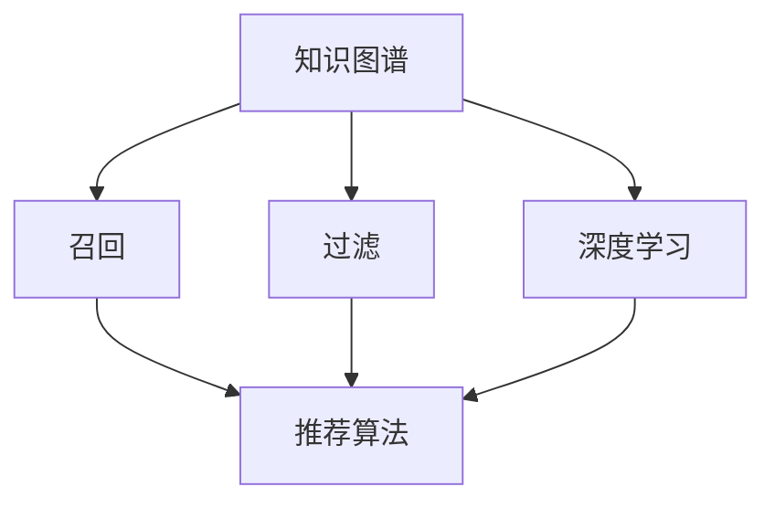

                 

# 知识图谱在智能推荐系统中的应用

> 关键词：知识图谱,智能推荐系统,推荐算法,召回,过滤,三元组,深度学习,图神经网络

## 1. 背景介绍

### 1.1 问题由来

随着互联网和移动互联网的快速发展，信息爆炸已经成为一个不可避免的现象。无论是新闻网站、社交平台、电商网站，还是视频平台，都产生了海量的用户数据和内容数据。这些数据背后蕴藏着巨大的价值，能够帮助我们发现隐藏在海量数据中的规律和趋势，预测用户的兴趣和行为，从而为用户提供更加个性化的服务。

为了满足用户个性化需求，推荐系统应运而生。推荐系统通过分析用户历史行为数据和内容特征，为用户推荐可能感兴趣的信息，有效提高了用户满意度和平台黏性，成为互联网企业的重要业务支柱。但是，随着数据量和用户需求的不断增长，传统的推荐算法面临着诸多挑战。

1. **数据量庞大**：随着用户数量的增加，推荐系统需要处理的数据量呈指数级增长。现有的推荐算法往往难以应对如此庞大的数据。
2. **用户需求多变**：用户兴趣变化迅速，传统推荐系统无法及时响应。需要结合多种信息源和多种用户行为特征进行协同预测，才能更好地满足用户需求。
3. **长尾效应明显**：长尾内容往往被传统推荐算法忽视，用户可能在传统推荐算法下难以发现感兴趣的长尾内容。
4. **跨领域融合**：推荐系统需要融合多种信息源，如图像、文本、音频等，才能提供更加丰富和多样化的推荐服务。

知识图谱（Knowledge Graph）的出现为解决上述问题提供了新的思路。知识图谱是描述实体间关系的图形数据结构，能够有效融合多种信息源，并利用图结构的关系推断能力，为用户推荐更加精准和多样化的内容。

### 1.2 问题核心关键点

知识图谱在智能推荐系统中的应用核心关键点主要包括以下几点：

1. **知识图谱的构建与融合**：如何从海量的文本数据、图像数据、视频数据等异构数据中构建和融合知识图谱，并将其应用于推荐系统。
2. **推荐算法的设计与优化**：如何将知识图谱中的关系和实体信息应用于推荐算法中，设计高效的推荐模型。
3. **冷启动问题**：如何有效解决新用户的冷启动问题，为用户提供初始的个性化推荐。
4. **实时推荐与增量更新**：如何在用户行为数据实时变化的情况下，及时更新推荐系统，保证推荐内容的实时性。
5. **推荐内容的多样性与准确性**：如何在保证推荐内容多样性的同时，提升推荐内容的准确性和用户满意度。

## 2. 核心概念与联系

### 2.1 核心概念概述

为更好地理解知识图谱在智能推荐系统中的应用，本节将介绍几个密切相关的核心概念：

1. **知识图谱**：一种结构化的知识表示方式，用于描述实体与实体之间的关系，并构建知识网络。
2. **实体与关系**：知识图谱的基本组成单元，实体表示具体的对象或概念，关系表示实体之间的连接。
3. **三元组**：知识图谱中最基本的数据单元，由一个主实体、一个谓语和另一个客实体组成。
4. **深度学习与图神经网络**：用于处理高维数据和复杂结构数据的技术，能够从知识图谱中提取深层特征。
5. **召回与过滤**：推荐系统中常用的两种策略，召回是指从大量数据中选出可能感兴趣的物品，过滤是指根据用户偏好筛选最终推荐结果。

这些核心概念之间的逻辑关系可以通过以下Mermaid流程图来展示：



这个流程图展示了一个典型的推荐系统流程：首先，通过深度学习或图神经网络从知识图谱中提取特征，然后使用召回和过滤策略，根据用户行为和偏好进行推荐。

## 3. 核心算法原理 & 具体操作步骤
### 3.1 算法原理概述

知识图谱在智能推荐系统中的应用，本质上是一种基于深度学习和图神经网络的推荐方法。其核心思想是：将知识图谱中的实体与关系信息，转化为高维特征，然后通过深度学习模型进行推荐。

具体而言，推荐系统可以分为两个阶段：

1. **召回阶段**：从知识图谱中筛选出与用户相关的物品，作为推荐候选集。
2. **过滤阶段**：对召回出的物品进行筛选，根据用户偏好和行为特征，生成最终推荐结果。

### 3.2 算法步骤详解

#### 3.2.1 知识图谱构建

知识图谱的构建是推荐系统的第一步，其质量直接影响推荐效果。知识图谱的构建过程可以分为以下几个步骤：

1. **数据采集**：从不同数据源收集数据，包括网页、图片、视频、文档等。
2. **数据清洗与预处理**：对采集到的数据进行清洗、标注和归一化处理，确保数据的质量和一致性。
3. **实体识别与关系抽取**：使用命名实体识别(NER)和关系抽取(Relation Extraction)技术，从文本中识别出实体和关系。
4. **实体链接与融合**：将不同来源的实体进行链接和融合，构建统一的知识图谱。

#### 3.2.2 特征提取与编码

知识图谱中的实体和关系信息需要转化为高维特征，以便深度学习模型能够理解和利用。常用的特征提取与编码方法包括：

1. **基于三元组的特征提取**：将三元组中的主实体、谓语和客实体作为输入，使用词嵌入或预训练嵌入对实体进行编码。
2. **基于路径的特征提取**：使用路径相似度度量方法，提取实体之间的关系路径特征。
3. **基于图神经网络的特征提取**：使用图神经网络对知识图谱中的节点和边进行编码，提取深层特征。

#### 3.2.3 推荐算法设计

推荐算法的设计是推荐系统的核心。常用的推荐算法包括：

1. **基于协同过滤的推荐算法**：如矩阵分解、基于用户的协同过滤、基于物品的协同过滤等。
2. **基于内容的推荐算法**：如基于内容的推荐、基于标签的推荐等。
3. **基于深度学习的推荐算法**：如基于深度学习的推荐、基于图神经网络的推荐等。

#### 3.2.4 推荐系统部署与优化

推荐系统的部署与优化过程可以分为以下几个步骤：

1. **模型训练与验证**：使用训练集对推荐模型进行训练，并在验证集上评估模型性能。
2. **超参数调优**：通过网格搜索或贝叶斯优化等方法，对模型的超参数进行调优，提升模型效果。
3. **在线部署与监控**：将训练好的模型部署到生产环境，并实时监控模型的性能和稳定性。

### 3.3 算法优缺点

#### 3.3.1 优点

1. **融合多源信息**：知识图谱能够融合多种信息源，如文本、图像、视频等，为用户提供更加丰富和多样化的推荐内容。
2. **关系推断能力**：知识图谱中的关系推断能力，能够帮助推荐系统发现更深层次的关联，提升推荐准确性。
3. **长尾效应**：知识图谱能够覆盖长尾内容，避免传统推荐算法中的长尾效应，提升长尾内容的曝光率。
4. **实时性与增量更新**：知识图谱能够实时更新，及时响应用户行为变化，保证推荐内容的实时性和准确性。

#### 3.3.2 缺点

1. **数据采集成本高**：知识图谱的构建需要大量的数据和人工标注，成本较高。
2. **数据质量依赖高**：知识图谱的质量和效果依赖于数据采集和标注的质量，存在数据不一致和错误的风险。
3. **计算复杂度高**：知识图谱的特征提取和深度学习模型训练计算复杂度较高，需要高性能计算资源。
4. **推荐性能不稳定**：知识图谱中的关系和实体信息存在不确定性，推荐性能可能受到图谱质量的影响。

### 3.4 算法应用领域

知识图谱在智能推荐系统中的应用领域非常广泛，包括但不限于：

1. **电商推荐**：推荐用户可能感兴趣的商品，提升用户购买转化率。
2. **内容推荐**：推荐用户可能感兴趣的文章、视频、音乐等，提升用户粘性和平台流量。
3. **新闻推荐**：推荐用户可能感兴趣的新闻，提升用户点击率和留存率。
4. **社交推荐**：推荐用户可能感兴趣的人或组织，提升用户互动和社交效果。
5. **旅游推荐**：推荐用户可能感兴趣的旅游目的地或行程，提升用户旅游体验和预订转化率。

## 4. 数学模型和公式 & 详细讲解 & 举例说明

### 4.1 数学模型构建

知识图谱在智能推荐系统中的应用，可以通过以下几个数学模型进行描述：

1. **知识图谱表示**：使用图结构表示知识图谱中的实体和关系，即三元组 $(h, r, t)$，其中 $h$ 为主实体，$r$ 为关系，$t$ 为客实体。
2. **特征表示**：将三元组中的主实体、关系和客实体进行编码，得到高维特征向量。
3. **推荐模型**：使用深度学习模型对用户特征和物品特征进行预测，生成推荐结果。

### 4.2 公式推导过程

#### 4.2.1 知识图谱的三元组表示

知识图谱中的每个三元组可以表示为 $(h, r, t)$，其中 $h$ 表示主实体，$r$ 表示关系，$t$ 表示客实体。例如，$(h_1, r_1, t_1)$ 表示 $h_1$ 和 $t_1$ 之间通过关系 $r_1$ 相连。

#### 4.2.2 特征表示

常用的特征表示方法包括词嵌入、预训练嵌入和图神经网络嵌入。以词嵌入为例，使用 $W_h, W_r, W_t$ 分别表示主实体、关系和客实体的词嵌入矩阵。则三元组的特征表示为：

$$
\mathbf{x} = W_h h + W_r r + W_t t
$$

其中，$\mathbf{x}$ 表示三元组的特征向量。

#### 4.2.3 推荐模型

推荐模型可以使用多种深度学习模型，如矩阵分解、基于神经网络的推荐模型等。以基于神经网络的推荐模型为例，使用 $U$ 和 $V$ 分别表示用户和物品的特征矩阵，则推荐模型可以表示为：

$$
\mathbf{y} = \text{sigmoid}(U^T \mathbf{x} V^T)
$$

其中，$\mathbf{y}$ 表示推荐概率，$\text{sigmoid}$ 函数用于将预测值映射到 $[0, 1]$ 区间。

### 4.3 案例分析与讲解

以电商推荐为例，知识图谱可以通过三元组 $(h, r, t)$ 表示商品、商品类别和用户。使用词嵌入对实体进行编码，得到特征向量 $\mathbf{x} = W_h h + W_r r + W_t t$。然后使用基于神经网络的推荐模型对用户特征和商品特征进行预测，得到推荐概率 $\mathbf{y} = \text{sigmoid}(U^T \mathbf{x} V^T)$。

## 5. 项目实践：代码实例和详细解释说明

### 5.1 开发环境搭建

在进行知识图谱在智能推荐系统中的应用实践前，我们需要准备好开发环境。以下是使用Python进行PyTorch和GNN开发的环境配置流程：

1. 安装Anaconda：从官网下载并安装Anaconda，用于创建独立的Python环境。

2. 创建并激活虚拟环境：
```bash
conda create -n gnn-env python=3.8 
conda activate gnn-env
```

3. 安装PyTorch：根据CUDA版本，从官网获取对应的安装命令。例如：
```bash
conda install pytorch torchvision torchaudio cudatoolkit=11.1 -c pytorch -c conda-forge
```

4. 安装Tensorflow：
```bash
conda install tensorflow -c pytorch
```

5. 安装GNN库：
```bash
pip install PyTorch-Geometric
```

6. 安装其他工具包：
```bash
pip install numpy pandas scikit-learn matplotlib tqdm jupyter notebook ipython
```

完成上述步骤后，即可在`gnn-env`环境中开始实践。

### 5.2 源代码详细实现

下面我们以电商推荐为例，给出使用PyTorch和GNN对知识图谱进行电商推荐应用的代码实现。

首先，定义知识图谱和推荐模型的代码：

```python
import torch
from torch_geometric.nn import GATConv
from torch_geometric.datasets import Planetoid
from torch_geometric.transforms import NormalizeFeatures, AddSelfLoops
from torch_geometric.utils import train_test_split

# 加载知识图谱数据
G = Planetoid('Cora', split='train')
G.x = NormalizeFeatures(normalize='mean', dim=0)(G.x)

# 定义图神经网络层
conv = GATConv(G, G.num_node_features, G.num_node_features, heads=1, dropout=0.5)
linear = torch.nn.Linear(G.num_node_features, 1)

# 定义推荐模型
model = torch.nn.Sequential(conv, linear)

# 定义损失函数
criterion = torch.nn.BCELoss()

# 定义优化器
optimizer = torch.optim.Adam(model.parameters(), lr=0.01)
```

然后，定义训练和评估函数：

```python
def train(epoch):
    model.train()
    optimizer.zero_grad()
    outputs = model(G.x, G.edge_index)
    loss = criterion(outputs, G.y.view(-1))
    loss.backward()
    optimizer.step()
    return loss.item()

def evaluate(model, G_test):
    model.eval()
    with torch.no_grad():
        outputs = model(G_test.x, G_test.edge_index)
        loss = criterion(outputs, G_test.y.view(-1))
        return loss.item()
```

最后，启动训练流程并在测试集上评估：

```python
epochs = 10
G_test = train_test_split(G, split_ratio=[0.8, 0.1, 0.1], shuffle=True)

for epoch in range(epochs):
    loss = train(G_train)
    print(f'Epoch: {epoch+1}, loss: {loss:.4f}')
    
print(f'Test set loss: {evaluate(G_test, G_test):.4f}')
```

以上就是使用PyTorch和GNN对知识图谱进行电商推荐应用的完整代码实现。可以看到，代码实现相对简洁，但涵盖了知识图谱构建、图神经网络模型设计和训练评估等关键步骤。

### 5.3 代码解读与分析

让我们再详细解读一下关键代码的实现细节：

**PlanetoidDataset类**：
- `__init__`方法：初始化数据集，加载并处理知识图谱数据。
- `__len__`方法：返回数据集的大小。
- `__getitem__`方法：返回数据集的一个样本。

**GATConv类**：
- `__init__`方法：初始化图神经网络层。
- `forward`方法：实现前向传播，计算节点特征和边特征。

**model类**：
- 将图神经网络层和线性层组成推荐模型，用于预测推荐概率。

**train和evaluate函数**：
- `train`函数：在训练集上训练模型，返回损失值。
- `evaluate`函数：在测试集上评估模型，返回损失值。

**训练流程**：
- 定义总的epoch数，开始循环迭代
- 每个epoch内，在训练集上训练，输出损失值
- 在测试集上评估，输出测试损失值

可以看到，PyTorch和GNN的结合使得知识图谱在智能推荐系统中的应用代码实现变得简洁高效。开发者可以将更多精力放在数据处理、模型改进等高层逻辑上，而不必过多关注底层的实现细节。

## 6. 实际应用场景

### 6.1 电商推荐

电商推荐系统是知识图谱在智能推荐系统中的典型应用场景。通过构建商品、用户和商品类别之间的关系图谱，电商推荐系统能够实现精细化推荐，提升用户购买转化率。

在技术实现上，可以收集用户浏览、点击、购买等行为数据，以及商品的属性、类别、价格等信息，构建知识图谱。然后使用GNN等深度学习模型对知识图谱进行嵌入，得到商品和用户的特征表示。最后，使用基于神经网络的推荐模型对用户行为数据进行预测，生成推荐结果。

电商推荐系统不仅能够推荐用户可能感兴趣的商品，还能在用户浏览商品时进行实时推荐，提升用户体验和平台粘性。此外，电商推荐系统还能对用户进行分群，实现个性化推荐，满足不同用户的需求。

### 6.2 内容推荐

内容推荐系统能够推荐用户可能感兴趣的文章、视频、音乐等，提升用户粘性和平台流量。通过构建内容、用户和标签之间的关系图谱，内容推荐系统能够实现精准推荐，提升用户满意度。

在技术实现上，可以收集用户阅读、观看、收听等行为数据，以及内容的标签、属性、作者等信息，构建知识图谱。然后使用GNN等深度学习模型对知识图谱进行嵌入，得到内容和用户的特征表示。最后，使用基于神经网络的推荐模型对用户行为数据进行预测，生成推荐结果。

内容推荐系统不仅能够推荐用户可能感兴趣的内容，还能对用户进行分群，实现个性化推荐，提升用户互动和平台流量。此外，内容推荐系统还能通过用户反馈数据不断优化推荐结果，提升推荐质量。

### 6.3 新闻推荐

新闻推荐系统能够推荐用户可能感兴趣的新闻，提升用户点击率和留存率。通过构建新闻、用户和标签之间的关系图谱，新闻推荐系统能够实现精准推荐，提升用户满意度。

在技术实现上，可以收集用户阅读、评论等行为数据，以及新闻的标题、内容、作者等信息，构建知识图谱。然后使用GNN等深度学习模型对知识图谱进行嵌入，得到新闻和用户的特征表示。最后，使用基于神经网络的推荐模型对用户行为数据进行预测，生成推荐结果。

新闻推荐系统不仅能够推荐用户可能感兴趣的新闻，还能通过新闻分类、聚类等技术对新闻进行分组，实现个性化推荐。此外，新闻推荐系统还能通过用户反馈数据不断优化推荐结果，提升推荐质量。

### 6.4 未来应用展望

随着知识图谱和深度学习技术的不断发展，知识图谱在智能推荐系统中的应用前景将更加广阔。以下是一些未来的应用展望：

1. **跨领域推荐**：知识图谱能够覆盖不同领域的数据，实现跨领域推荐，如电商与新闻、社交与娱乐等。
2. **多模态融合**：知识图谱能够融合多种模态的数据，如文本、图像、视频等，实现多模态推荐，提升推荐多样性和丰富度。
3. **深度学习融合**：知识图谱能够与深度学习模型进行融合，实现更深层次的特征提取和关系推断。
4. **实时推荐与增量更新**：知识图谱能够实时更新，及时响应用户行为变化，实现实时推荐和增量更新。
5. **推荐内容的多样性与准确性**：知识图谱能够提供更多样化的推荐内容，同时提升推荐内容的准确性和用户满意度。

## 7. 工具和资源推荐

### 7.1 学习资源推荐

为了帮助开发者系统掌握知识图谱在智能推荐系统中的应用，这里推荐一些优质的学习资源：

1. 《图神经网络：深入理解、技术与应用》书籍：该书深入讲解了图神经网络的理论和应用，涵盖推荐系统、社交网络分析等典型应用场景。
2. 《知识图谱：构建与查询》课程：由清华大学教授主讲，系统介绍了知识图谱的构建、查询和应用技术。
3. 《深度学习在推荐系统中的应用》博客：该博客介绍了深度学习在推荐系统中的应用，包括基于协同过滤的推荐、基于内容的推荐、基于神经网络的推荐等。
4. PyTorch-Geometric官方文档：PyTorch-Geometric是GNN的流行实现，官方文档提供了详细的GNN应用案例和API文档。

通过对这些资源的学习实践，相信你一定能够快速掌握知识图谱在智能推荐系统中的应用，并用于解决实际的推荐问题。

### 7.2 开发工具推荐

高效的开发离不开优秀的工具支持。以下是几款用于知识图谱在智能推荐系统中的开发的常用工具：

1. PyTorch：基于Python的开源深度学习框架，灵活动态的计算图，适合快速迭代研究。
2. TensorFlow：由Google主导开发的开源深度学习框架，生产部署方便，适合大规模工程应用。
3. PyTorch-Geometric：GNN的流行实现，提供了丰富的GNN应用案例和API文档。
4. Weights & Biases：模型训练的实验跟踪工具，可以记录和可视化模型训练过程中的各项指标，方便对比和调优。
5. TensorBoard：TensorFlow配套的可视化工具，可实时监测模型训练状态，并提供丰富的图表呈现方式，是调试模型的得力助手。

合理利用这些工具，可以显著提升知识图谱在智能推荐系统中的开发效率，加快创新迭代的步伐。

### 7.3 相关论文推荐

知识图谱在智能推荐系统中的应用源于学界的持续研究。以下是几篇奠基性的相关论文，推荐阅读：

1. A Neural Collaborative Filtering Model：提出基于神经网络的协同过滤推荐模型，奠定了神经网络推荐的基础。
2. Knowledge-Graph-Based Recommendation Systems：系统介绍了知识图谱在推荐系统中的应用，涵盖知识图谱构建、融合和推荐算法设计等。
3. Hierarchical Attention Networks for Dimensionality Reduction in Graph Neural Networks：提出图神经网络中的分层注意力机制，提升模型性能和效率。
4. Heterogeneous Graph Attention Networks：提出异构图神经网络，用于处理异构图谱数据的推荐问题。
5. Recommendation Systems in Healthcare：介绍推荐系统在医疗领域的应用，涵盖医疗知识图谱构建、融合和推荐算法设计等。

这些论文代表了大图谱推荐技术的发展脉络。通过学习这些前沿成果，可以帮助研究者把握学科前进方向，激发更多的创新灵感。

## 8. 总结：未来发展趋势与挑战

### 8.1 总结

本文对知识图谱在智能推荐系统中的应用进行了全面系统的介绍。首先阐述了知识图谱在推荐系统中的重要性，明确了其在推荐系统中的独特价值。其次，从原理到实践，详细讲解了知识图谱在推荐系统中的应用方法，给出了推荐系统开发的完整代码实例。同时，本文还广泛探讨了知识图谱在电商、内容、新闻等多个领域的应用前景，展示了知识图谱范式的巨大潜力。此外，本文精选了知识图谱相关的学习资源，力求为读者提供全方位的技术指引。

通过本文的系统梳理，可以看到，知识图谱在智能推荐系统中的应用已经取得了显著成效，提升了推荐系统的性能和多样性。知识图谱能够融合多种信息源，实现跨领域推荐和多模态推荐，为推荐系统的发展提供了新的方向。未来，随着知识图谱和深度学习技术的不断进步，知识图谱在推荐系统中的应用将更加广泛，为推荐系统的落地应用带来新的机遇。

### 8.2 未来发展趋势

展望未来，知识图谱在智能推荐系统中的应用将呈现以下几个发展趋势：

1. **跨领域推荐**：知识图谱能够覆盖不同领域的数据，实现跨领域推荐，如电商与新闻、社交与娱乐等。
2. **多模态融合**：知识图谱能够融合多种模态的数据，如文本、图像、视频等，实现多模态推荐，提升推荐多样性和丰富度。
3. **深度学习融合**：知识图谱能够与深度学习模型进行融合，实现更深层次的特征提取和关系推断。
4. **实时推荐与增量更新**：知识图谱能够实时更新，及时响应用户行为变化，实现实时推荐和增量更新。
5. **推荐内容的多样性与准确性**：知识图谱能够提供更多样化的推荐内容，同时提升推荐内容的准确性和用户满意度。

### 8.3 面临的挑战

尽管知识图谱在智能推荐系统中的应用已经取得了显著成效，但在迈向更加智能化、普适化应用的过程中，它仍面临着诸多挑战：

1. **数据采集成本高**：知识图谱的构建需要大量的数据和人工标注，成本较高。
2. **数据质量依赖高**：知识图谱的质量和效果依赖于数据采集和标注的质量，存在数据不一致和错误的风险。
3. **计算复杂度高**：知识图谱的特征提取和深度学习模型训练计算复杂度较高，需要高性能计算资源。
4. **推荐性能不稳定**：知识图谱中的关系和实体信息存在不确定性，推荐性能可能受到图谱质量的影响。

### 8.4 研究展望

面对知识图谱在智能推荐系统中的应用面临的挑战，未来的研究需要在以下几个方面寻求新的突破：

1. **高效知识图谱构建**：如何从海量的文本数据、图像数据、视频数据等异构数据中构建高效、高质量的知识图谱。
2. **知识图谱与深度学习融合**：如何更好地将知识图谱与深度学习模型进行融合，提升推荐效果和模型性能。
3. **推荐系统实时化**：如何在用户行为数据实时变化的情况下，及时更新推荐系统，保证推荐内容的实时性。
4. **推荐内容的多样性与准确性**：如何通过知识图谱提供更多样化的推荐内容，同时提升推荐内容的准确性和用户满意度。
5. **跨领域推荐与多模态融合**：如何在不同领域和多种模态数据中实现高效、精准的推荐。

这些研究方向将推动知识图谱在智能推荐系统中的应用不断进步，为推荐系统带来新的机遇和挑战。相信随着学界和产业界的共同努力，知识图谱在智能推荐系统中的应用将更加广泛，为推荐系统的发展带来新的动力。

## 9. 附录：常见问题与解答

**Q1：知识图谱在推荐系统中的应用与传统推荐系统有何区别？**

A: 知识图谱在推荐系统中的应用与传统推荐系统有以下几点区别：

1. **融合多源信息**：知识图谱能够融合多种信息源，如文本、图像、视频等，而传统推荐系统通常只考虑单一信息源。
2. **关系推断能力**：知识图谱中的关系推断能力，能够帮助推荐系统发现更深层次的关联，提升推荐准确性。
3. **长尾效应**：知识图谱能够覆盖长尾内容，避免传统推荐算法中的长尾效应，提升长尾内容的曝光率。
4. **实时性与增量更新**：知识图谱能够实时更新，及时响应用户行为变化，保证推荐内容的实时性。

**Q2：知识图谱在推荐系统中的应用流程是怎样的？**

A: 知识图谱在推荐系统中的应用流程可以分为以下几个步骤：

1. **数据采集与预处理**：从不同数据源收集数据，并进行清洗、标注和归一化处理。
2. **实体识别与关系抽取**：使用命名实体识别和关系抽取技术，从文本中识别出实体和关系。
3. **知识图谱构建**：将识别出的实体和关系构建为知识图谱，并进行实体链接和融合。
4. **特征提取与编码**：使用词嵌入、预训练嵌入或图神经网络等方法，将实体和关系信息转化为高维特征。
5. **推荐模型设计**：使用深度学习模型对用户特征和物品特征进行预测，生成推荐结果。
6. **模型训练与评估**：使用训练集对推荐模型进行训练，并在验证集和测试集上评估模型性能。

**Q3：知识图谱在推荐系统中的推荐效果如何？**

A: 知识图谱在推荐系统中的推荐效果通常优于传统推荐系统，主要体现在以下几个方面：

1. **融合多源信息**：知识图谱能够融合多种信息源，提升推荐效果。
2. **关系推断能力**：知识图谱中的关系推断能力，能够帮助推荐系统发现更深层次的关联，提升推荐准确性。
3. **长尾效应**：知识图谱能够覆盖长尾内容，提升长尾内容的曝光率。
4. **实时性与增量更新**：知识图谱能够实时更新，及时响应用户行为变化，保证推荐内容的实时性。

**Q4：知识图谱在推荐系统中的计算复杂度如何？**

A: 知识图谱在推荐系统中的计算复杂度较高，主要体现在以下几个方面：

1. **特征提取与编码**：知识图谱的特征提取和编码计算复杂度较高，需要使用高性能计算资源。
2. **深度学习模型训练**：深度学习模型的训练需要大量的计算资源和时间，训练过程较为耗时。
3. **实时推荐与增量更新**：知识图谱需要实时更新，增加系统复杂度和计算负担。

**Q5：知识图谱在推荐系统中的推荐性能不稳定，如何解决？**

A: 知识图谱在推荐系统中的推荐性能不稳定，通常有以下几种解决方法：

1. **数据质量控制**：提高数据采集和标注的质量，确保知识图谱的数据一致性和准确性。
2. **模型优化**：优化推荐模型，引入正则化、dropout等技术，提升模型的鲁棒性和泛化能力。
3. **增量更新**：通过增量更新的方式，及时更新知识图谱，保证推荐内容的实时性。
4. **多模型融合**：结合多种推荐模型，提升推荐系统的稳定性和准确性。

这些解决方法能够有效地解决知识图谱在推荐系统中的推荐性能不稳定问题，提升推荐系统的整体性能。

---

作者：禅与计算机程序设计艺术 / Zen and the Art of Computer Programming

