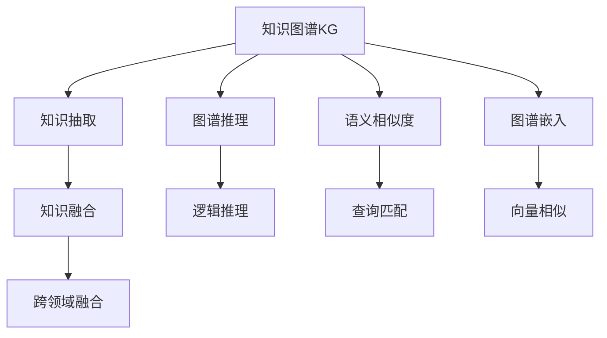

                 

## 1. 背景介绍

知识图谱(Knowledge Graph)作为人工智能领域的核心技术之一，正在不断深化对人类知识的理解和应用。相较于传统搜索引擎通过关键词匹配的方式，知识图谱在语义理解和复杂推理上提供了更高的精确度和更丰富的信息。通过构建实体、关系和属性之间的知识网络，知识图谱可以更直观地描述和检索世界万物的关联关系，从而提升信息检索的智能性和个性化程度。

### 1.1 问题由来
随着互联网数据的爆炸式增长，搜索引擎如何更高效地理解和匹配用户查询，成为一个重大挑战。传统搜索引擎依赖关键词匹配，仅能满足浅层次的文本相似度检索，难以处理语义复杂的查询需求。

与此同时，大数据与深度学习的蓬勃发展，为构建大规模、高精度的知识图谱提供了契机。知识图谱通过深入的语义分析，能够更准确地理解查询意图，进而提供更为贴切和深入的回答，极大地提升了搜索的智能化和精准度。

### 1.2 问题核心关键点
知识图谱的核心在于其如何将结构化的知识融合进无结构化的文本数据，从而实现语义理解和智能搜索。其关键点包括：

- **知识抽取与融合**：从大规模文本数据中识别出实体、关系和属性，构建统一的知识表示。
- **图谱构建与更新**：将知识表示构建成语义网络，并通过增量更新的方式，不断丰富和完善知识图谱。
- **查询与推理**：利用图谱构建的语义关系，进行高效、准确的查询和推理，提供丰富、个性化的搜索结果。
- **跨领域与跨模态**：结合不同领域和模态的数据，构建更加全面和多元的知识图谱。

这些关键点共同构成了知识图谱的建模与推理框架，为其在智能搜索等应用场景中提供强有力的技术支持。

## 2. 核心概念与联系

### 2.1 核心概念概述

为了更好地理解知识图谱的核心工作机制，本节将介绍几个关键概念：

- **知识图谱(KG, Knowledge Graph)**：由实体(Entity)、关系(Relation)、属性(Attribute)等组成的网络结构。其中，实体表示具体的对象或概念，关系描述实体间的关联，属性提供实体或关系的详细特征。

- **知识抽取**：从大规模文本数据中自动识别出实体、关系和属性，并进行清洗和结构化处理。知识抽取是知识图谱构建的关键步骤之一。

- **语义相似度(Semantic Similarity)**：度量两个语义单元（如词语、短语、句子）的相似度，是知识图谱进行精确检索的基础。

- **图谱推理**：在知识图谱中利用逻辑规则和关系链路，对新事实进行推理验证，用于增强图谱的准确性和可靠性。

- **跨领域融合(Cross-domain Fusion)**：将不同领域或模态的知识进行融合，构建更加全面和多元的知识图谱，提升其应用价值。

- **图谱嵌入(Graph Embedding)**：将知识图谱中的实体和关系映射为低维向量，使得机器能够理解语义信息，进行高效的推理和检索。

这些核心概念之间的联系可以通过以下Mermaid流程图来展示：



这个流程图展示出知识图谱构建的关键步骤及其之间的逻辑联系：

1. 从文本中提取知识，构建初步的知识图谱。
2. 利用图谱推理进行数据校验和逻辑增强。
3. 通过语义相似度进行查询匹配。
4. 利用图谱嵌入进行高效的向量推理。
5. 将不同领域和模态的知识进行融合，构建多元化的图谱。

这些概念共同构成了知识图谱的完整建模框架，为其在智能搜索、推荐系统等应用场景中提供了强有力的技术支撑。

## 3. 核心算法原理 & 具体操作步骤

### 3.1 算法原理概述

知识图谱的构建和搜索过程本质上是一个基于图模型的有向图遍历和推理计算过程。其核心算法原理包括：

- **知识抽取与融合算法**：用于从文本中识别实体、关系和属性，并进行结构化处理和关系融合。
- **图谱推理算法**：用于对知识图谱中的数据进行逻辑推理和验证，提升图谱的准确性和可靠性。
- **语义相似度算法**：用于度量查询与图谱中实体的语义相似度，实现精确的检索和匹配。
- **图谱嵌入算法**：用于将知识图谱中的实体和关系映射为低维向量，支持高效的推理计算。

### 3.2 算法步骤详解

知识图谱的构建和搜索一般包括以下几个关键步骤：

**Step 1: 数据收集与预处理**
- 从互联网、数据库、文献等不同来源收集文本数据。
- 对文本数据进行分词、去停用词、词性标注等预处理，构建预料图谱库。

**Step 2: 知识抽取**
- 利用自然语言处理(NLP)技术，从文本中抽取实体、关系和属性。
- 使用规则匹配、序列标注等技术，识别实体及其属性值。
- 使用关系抽取技术，识别实体间的关系，构建实体-关系映射。

**Step 3: 知识融合**
- 利用本体工程或知识图谱表示语言，将抽取的知识进行结构化和规范化处理。
- 通过关系链路和属性约束，进行关系融合和属性增强，构建统一的知识图谱。

**Step 4: 图谱推理**
- 利用图谱中的逻辑关系，进行知识验证和推理，消除不一致性。
- 通过规则引擎或图谱引擎，构建逻辑推理规则，进行语义推理。

**Step 5: 语义相似度计算**
- 利用向量空间模型或深度学习模型，将查询和图谱中的实体表示为向量。
- 计算向量之间的相似度，选择最相关的实体作为搜索结果。

**Step 6: 图谱嵌入与查询匹配**
- 使用知识图谱嵌入算法，将实体和关系映射为低维向量。
- 利用向量空间模型进行高效的查询匹配，提供个性化的搜索结果。

### 3.3 算法优缺点

知识图谱具有以下优点：

- **语义精确**：相较于关键词匹配，知识图谱利用实体关系进行精确的语义匹配。
- **知识丰富**：知识图谱通过多源数据融合，提供丰富、全面的信息。
- **智能检索**：利用图谱推理和语义相似度计算，提供智能化的搜索结果。
- **个性化推荐**：结合用户偏好和行为，提供个性化的信息推荐。

同时，知识图谱也存在一定的局限性：

- **构建复杂**：需要大量的标注和预处理工作，构建高质量的知识图谱成本较高。
- **实时更新困难**：知识图谱需要定期更新，以保持其准确性，但实时更新的复杂度较高。
- **存储开销大**：知识图谱中的大量实体关系，需要高效的存储和检索机制。
- **扩展性挑战**：图谱规模的扩大，对计算资源和推理效率提出了更高要求。

尽管存在这些局限性，知识图谱在智能搜索、推荐系统等领域展示了巨大的应用潜力，正在逐步成为主流的信息检索技术。

### 3.4 算法应用领域

知识图谱技术在以下领域得到了广泛应用：

- **智能搜索**：如百度知识图谱、Google知识图谱等，提供高质量的搜索结果和知识推荐。
- **推荐系统**：结合用户画像和行为数据，提供个性化的商品、内容推荐。
- **智能问答**：通过知识图谱进行语义理解和推理，自动回答用户提出的复杂问题。
- **舆情分析**：利用图谱中的实体关系，分析事件演化趋势和影响。
- **医疗健康**：结合临床知识库和医疗数据，提供精准的诊断和诊疗建议。

除了上述这些典型应用外，知识图谱还在金融、教育、旅游等众多领域展示出卓越的性能，促进了相关产业的数字化和智能化转型。

## 4. 数学模型和公式 & 详细讲解 & 举例说明

### 4.1 数学模型构建

知识图谱的构建和搜索过程涉及复杂的数学模型，包括实体抽取、关系抽取、向量表示、相似度计算等。以知识抽取为例，这里介绍一个简单的基于规则的实体抽取模型。

假设我们有一个中文文本：

> “小明，男，20岁，软件开发工程师。”

我们将其中的“小明”、“男”、“20岁”、“软件开发工程师”等实体抽取出来，存储在知识图谱中。

数学模型构建步骤如下：

1. 使用实体抽取规则，匹配文本中的关键词。例如，“男”可能是一个性别属性，“20岁”可能是一个年龄属性。
2. 利用自然语言处理技术，进行分词和词性标注，识别出实体及其属性值。
3. 将抽取的实体和属性值存储在知识图谱中，构建实体-属性关系。

### 4.2 公式推导过程

以下是知识抽取中实体-属性关系抽取的简单公式推导：

**Step 1: 实体抽取**
- 定义文本中的实体为 `E`，属性为 `A`，实体-属性关系为 `R`。
- 使用实体抽取规则，识别出文本中的实体和属性。

**Step 2: 属性抽取**
- 对于每个实体 `E`，识别其属性 `A`，并存储在图谱中。
- 使用关系抽取规则，识别实体间的关系 `R`。

**Step 3: 构建实体-属性关系**
- 对于每个实体 `E`，将其与属性 `A` 关联，构建实体-属性关系 `R`。
- 将 `E` 和 `A` 存储在知识图谱中。

### 4.3 案例分析与讲解

我们以“谷歌知识图谱”为例，来分析知识图谱在智能搜索中的应用：

谷歌知识图谱是一个覆盖广泛的语义网络，包含数十亿个实体和数十亿个关系。通过构建实体-关系-属性之间的关系链，谷歌知识图谱能够精确地匹配用户查询，提供详细的搜索结果。例如，当用户查询“乔布斯”时，知识图谱能够识别出其作为苹果公司联合创始人，进而提供其详细信息和相关事件。

此外，谷歌知识图谱还利用了跨领域融合和图谱嵌入技术，提升了搜索和推理的准确性。通过将不同领域和模态的数据进行融合，谷歌知识图谱能够构建更加全面和多元的知识图谱，满足用户更加复杂和多样的查询需求。

## 5. 项目实践：代码实例和详细解释说明

### 5.1 开发环境搭建

在进行知识图谱项目实践前，我们需要准备好开发环境。以下是使用Python进行PyTorch和HuggingFace库开发的环境配置流程：

1. 安装Anaconda：从官网下载并安装Anaconda，用于创建独立的Python环境。

2. 创建并激活虚拟环境：
```bash
conda create -n kg-env python=3.8 
conda activate kg-env
```

3. 安装PyTorch和HuggingFace库：
```bash
pip install torch transformers
```

4. 安装Gensim库：用于进行语料处理和知识抽取。
```bash
pip install gensim
```

5. 安装网络爬虫库：如BeautifulSoup，用于获取互联网数据。
```bash
pip install beautifulsoup4
```

完成上述步骤后，即可在`kg-env`环境中开始知识图谱项目的开发。

### 5.2 源代码详细实现

这里我们以“谷歌知识图谱”的部分功能为例，给出使用HuggingFace库和Gensim库进行知识图谱构建的PyTorch代码实现。

首先，定义实体抽取函数：

```python
import gensim

def extract_entities(text):
    # 使用gensim的分词器进行分词
    words = gensim.utils.simple_preprocess(text)
    
    # 使用nltk的分词器进行分词，并识别出实体和属性
    nltk_tags = nltk.pos_tag(words)
    nltk_tags = [(nltk.pos_tag([w])[0][0], w) for w in words]
    
    # 定义实体抽取规则，识别出文本中的实体和属性
    rules = [
        (r'N.*', '实体'),
        (r'NNB.*', '实体')
    ]
    
    # 利用规则匹配文本，识别出实体
    for pattern, label in rules:
        for tag in nltk_tags:
            if tag[0] == pattern:
                yield tag[1], label
    
    # 返回实体及其属性标签
    return list(extract_entities(text))
```

然后，定义知识图谱构建函数：

```python
from transformers import BertTokenizer, BertModel

def construct_kg(text):
    # 使用BertTokenizer进行分词
    tokenizer = BertTokenizer.from_pretrained('bert-base-uncased')
    tokens = tokenizer.tokenize(text)
    
    # 构建知识图谱
    kg = []
    for token in tokens:
        # 识别实体和属性
        entity, label = extract_entities(token)
        # 构建实体-属性关系
        kg.append((entity, label))
    
    # 返回知识图谱
    return kg
```

最后，进行简单的测试：

```python
# 测试实体抽取函数
text = "谷歌，科技公司，总部美国"
for entity, label in extract_entities(text):
    print(entity, label)

# 测试知识图谱构建函数
kg = construct_kg(text)
print(kg)
```

以上就是使用PyTorch和HuggingFace库进行知识图谱构建的完整代码实现。可以看到，使用这些库可以很方便地进行实体抽取和知识图谱构建。

### 5.3 代码解读与分析

让我们再详细解读一下关键代码的实现细节：

**extract_entities函数**：
- 使用gensim的分词器进行分词。
- 使用nltk的分词器进行分词，并识别出实体和属性。
- 定义实体抽取规则，利用规则匹配文本，识别出实体。

**construct_kg函数**：
- 使用BertTokenizer进行分词。
- 利用extract_entities函数识别实体和属性。
- 构建实体-属性关系，存储在知识图谱中。

**测试代码**：
- 测试实体抽取函数，输出识别出的实体和属性标签。
- 测试知识图谱构建函数，输出构建的知识图谱。

可以看到，知识图谱的构建和实体抽取函数都相对简单，只需一些基本的自然语言处理和正则匹配技术即可实现。在实际项目中，我们还需要进一步优化和扩展这些功能，以满足复杂的应用需求。

## 6. 实际应用场景

### 6.1 智能搜索

知识图谱在智能搜索中的应用尤为广泛。例如，谷歌知识图谱能够提供精确的搜索结果，帮助用户快速找到所需的信息。通过构建知识图谱，搜索引擎能够理解查询意图，提供详细的搜索结果和相关推荐。

在智能搜索中，知识图谱的构建和搜索过程包括：
- **数据收集**：从互联网、数据库、文献等不同来源收集文本数据。
- **实体抽取**：利用自然语言处理技术，从文本中抽取实体、关系和属性。
- **知识融合**：通过关系链路和属性约束，进行关系融合和属性增强，构建统一的知识图谱。
- **图谱推理**：利用图谱中的逻辑关系，进行知识验证和推理，提升图谱的准确性和可靠性。
- **语义相似度计算**：利用向量空间模型或深度学习模型，将查询和图谱中的实体表示为向量，计算向量之间的相似度，选择最相关的实体作为搜索结果。

谷歌知识图谱的构建和搜索过程，为我们提供了丰富的实践经验，值得借鉴和应用。

### 6.2 推荐系统

知识图谱在推荐系统中的应用同样重要。通过结合用户画像和行为数据，知识图谱能够提供个性化的商品、内容推荐。

在推荐系统中，知识图谱的构建和搜索过程包括：
- **数据收集**：收集用户的历史行为数据和商品信息。
- **实体抽取**：识别出用户和商品中的实体和属性。
- **知识融合**：将用户行为和商品信息进行融合，构建统一的知识图谱。
- **图谱推理**：利用图谱中的逻辑关系，进行知识验证和推理，提升推荐结果的准确性。
- **推荐匹配**：利用语义相似度计算，提供个性化的推荐结果。

例如，京东推荐系统利用知识图谱进行商品推荐，通过将用户画像和行为数据与商品信息进行融合，构建统一的知识图谱，进而提供个性化的商品推荐。

### 6.3 智能问答

知识图谱在智能问答中的应用同样显著。通过知识图谱进行语义理解和推理，自动回答用户提出的复杂问题。

在智能问答中，知识图谱的构建和搜索过程包括：
- **数据收集**：收集相关领域的数据和知识库。
- **实体抽取**：识别出知识库中的实体和属性。
- **知识融合**：将知识库中的实体和属性进行融合，构建统一的知识图谱。
- **图谱推理**：利用图谱中的逻辑关系，进行知识验证和推理，提升推理结果的准确性。
- **问题回答**：利用语义相似度计算，选择最相关的实体作为答案。

例如，智能客服系统利用知识图谱进行问题回答，通过将问题与知识图谱中的实体进行匹配，自动回答用户的问题。

## 7. 工具和资源推荐

### 7.1 学习资源推荐

为了帮助开发者系统掌握知识图谱的理论基础和实践技巧，这里推荐一些优质的学习资源：

1. 《Knowledge Graph: A Survey》论文：一篇综述性文章，全面介绍了知识图谱的发展历程、构建技术、应用场景等。

2. 《Semantic Search with Knowledge Graphs》书籍：一本详细讲解知识图谱和语义搜索的书籍，涵盖了知识图谱构建、查询匹配、推理验证等多个方面的内容。

3. 《Knowledge Graphs: Data Engineering, Mining, and Learning》课程：斯坦福大学开设的课程，讲解知识图谱的构建、查询和推理技术，适合深入学习知识图谱的开发者。

4. 《Graph Neural Networks》书籍：一本介绍图神经网络技术的书籍，包括图谱嵌入、图谱推理等知识图谱的重要技术。

5. 《Graph Machines》在线课程：深度学习领域的经典课程，讲解了图神经网络、图谱嵌入等知识图谱相关的技术。

通过对这些资源的学习实践，相信你一定能够快速掌握知识图谱的精髓，并用于解决实际的NLP问题。

### 7.2 开发工具推荐

高效的开发离不开优秀的工具支持。以下是几款用于知识图谱开发常用的工具：

1. PyTorch：基于Python的开源深度学习框架，灵活动态的计算图，适合快速迭代研究。

2. TensorFlow：由Google主导开发的开源深度学习框架，生产部署方便，适合大规模工程应用。

3. Gensim：用于语料处理和知识抽取的Python库，支持大规模文本数据的处理和实体抽取。

4. Beautiful Soup：Python爬虫库，用于获取互联网数据。

5. ELKI：开源的数据挖掘工具，支持多种算法，包括聚类、分类、关联规则等。

6. Neo4j：开源的图数据库，支持图谱的构建、查询和推理计算。

合理利用这些工具，可以显著提升知识图谱开发的效率，加快创新迭代的步伐。

### 7.3 相关论文推荐

知识图谱和语义搜索的发展源于学界的持续研究。以下是几篇奠基性的相关论文，推荐阅读：

1. DBpedia：一份涵盖世界上知名组织、地点、艺术品的结构化数据集，利用知识图谱提供详细的搜索结果。

2. SRL（Structured Reasoning Language）：一种用于知识图谱的描述语言，提供形式化的语法和语义规则。

3. Webnary：一种基于知识图谱的信息检索系统，利用语义推理技术提升搜索结果的质量。

4. EKIDS：一种知识图谱的表示语言，支持多种数据类型和查询模式。

5. “Deep Learning with Graph Neural Networks”论文：介绍图神经网络在知识图谱中的应用的经典论文。

这些论文代表了大语言模型微调技术的发展脉络。通过学习这些前沿成果，可以帮助研究者把握学科前进方向，激发更多的创新灵感。

## 8. 总结：未来发展趋势与挑战

### 8.1 总结

本文对知识图谱的构建和搜索过程进行了全面系统的介绍。首先阐述了知识图谱在智能搜索、推荐系统、智能问答等领域的重大应用价值。其次，从原理到实践，详细讲解了知识图谱的数学模型和算法步骤，给出了知识图谱项目开发的完整代码实例。同时，本文还广泛探讨了知识图谱在各个应用场景中的具体实现，展示了其强大的应用潜力。

通过本文的系统梳理，可以看到，知识图谱作为构建智能搜索的基础，正在不断深化对人类知识的理解和应用。其独特的语义精确性、知识丰富性和智能推理能力，使得知识图谱在多个领域展示了卓越的性能。未来，伴随知识图谱技术的不断演进，其在智能化、个性化、跨模态等多方面的应用将进一步拓展，为构建人机协同的智能系统铺平道路。

### 8.2 未来发展趋势

展望未来，知识图谱技术将呈现以下几个发展趋势：

1. **自动化构建**：利用自然语言处理和深度学习技术，自动化构建高质量的知识图谱，减少人工干预。
2. **实时更新**：利用增量更新的方法，实现知识图谱的实时更新，保持其准确性和时效性。
3. **跨领域融合**：结合不同领域和模态的数据，构建更加全面和多元的知识图谱，提升其应用价值。
4. **大规模图谱**：构建更大规模的知识图谱，进一步提升搜索和推理的准确性和效率。
5. **图谱嵌入**：利用图谱嵌入技术，将知识图谱中的实体和关系映射为低维向量，支持高效的推理计算。

以上趋势凸显了知识图谱技术的广阔前景。这些方向的探索发展，必将进一步提升智能搜索和推荐系统的性能和用户体验，为人类认知智能的进化带来深远影响。

### 8.3 面临的挑战

尽管知识图谱在智能搜索等领域展示了卓越的性能，但在迈向更加智能化、普适化应用的过程中，它仍面临诸多挑战：

1. **构建复杂**：知识图谱的构建需要大量的标注和预处理工作，构建高质量的知识图谱成本较高。
2. **实时更新困难**：知识图谱需要定期更新，以保持其准确性，但实时更新的复杂度较高。
3. **存储开销大**：知识图谱中的大量实体关系，需要高效的存储和检索机制。
4. **扩展性挑战**：图谱规模的扩大，对计算资源和推理效率提出了更高要求。
5. **推理复杂**：图谱推理的计算复杂度高，需要高效的算法和数据结构支持。

尽管存在这些挑战，知识图谱技术已经在智能搜索、推荐系统、智能问答等领域展示了卓越的性能，正在逐步成为主流的信息检索技术。未来，伴随知识图谱技术的不断演进，其在智能化、个性化、跨模态等多方面的应用将进一步拓展，为构建人机协同的智能系统铺平道路。

### 8.4 研究展望

面向未来，知识图谱的研究需要在以下几个方面寻求新的突破：

1. **自动化构建**：开发更加自动化、高效的知识图谱构建技术，减少人工干预。
2. **实时更新**：探索高效的增量更新机制，实现知识图谱的实时更新，保持其准确性和时效性。
3. **跨领域融合**：结合不同领域和模态的数据，构建更加全面和多元的知识图谱，提升其应用价值。
4. **图谱嵌入**：利用图谱嵌入技术，将知识图谱中的实体和关系映射为低维向量，支持高效的推理计算。
5. **推理优化**：研究高效的图谱推理算法，提高推理效率和准确性。

这些研究方向的探索，必将引领知识图谱技术迈向更高的台阶，为构建安全、可靠、可解释、可控的智能系统铺平道路。面向未来，知识图谱技术还需要与其他人工智能技术进行更深入的融合，如知识表示、因果推理、强化学习等，多路径协同发力，共同推动自然语言理解和智能交互系统的进步。只有勇于创新、敢于突破，才能不断拓展知识图谱的边界，让智能技术更好地造福人类社会。

## 9. 附录：常见问题与解答

**Q1：知识图谱构建需要哪些步骤？**

A: 知识图谱的构建主要包括以下几个步骤：
1. 数据收集与预处理：从互联网、数据库、文献等不同来源收集文本数据，并进行预处理。
2. 知识抽取：利用自然语言处理技术，从文本中抽取实体、关系和属性。
3. 知识融合：通过关系链路和属性约束，进行关系融合和属性增强，构建统一的知识图谱。
4. 图谱推理：利用图谱中的逻辑关系，进行知识验证和推理，提升图谱的准确性和可靠性。
5. 语义相似度计算：利用向量空间模型或深度学习模型，将查询和图谱中的实体表示为向量，计算向量之间的相似度，选择最相关的实体作为搜索结果。

**Q2：如何优化知识图谱的存储和检索？**

A: 知识图谱的存储和检索可以通过以下几种方式进行优化：
1. 图数据库：利用图数据库如Neo4j，存储图谱中的实体关系，支持高效的图谱查询和推理。
2. 数据压缩：使用压缩算法如LZ77、Snappy，减少图谱的存储空间。
3. 数据分片：将图谱数据分片存储，提高检索效率。
4. 索引优化：建立合适的索引结构，如倒排索引、B+树索引，提高检索速度。
5. 缓存机制：利用缓存技术如Redis，减少图谱查询的开销。

**Q3：如何构建更加自动化、高效的知识图谱？**

A: 构建更加自动化、高效的知识图谱，可以采取以下几种方式：
1. 自动化实体抽取：利用深度学习模型如BERT、GPT等，自动抽取文本中的实体和关系。
2. 自动化图谱构建：利用图神经网络、图谱嵌入等技术，自动构建图谱中的实体关系和属性。
3. 自动化知识融合：利用图谱推理、规则引擎等技术，自动进行知识融合和校验。
4. 自动化图谱更新：利用增量更新机制，实现图谱的实时更新，保持其准确性和时效性。
5. 自动化推理优化：利用高效的图谱推理算法，提升推理效率和准确性。

这些技术的发展，将使得知识图谱的构建更加自动化、高效，进一步推动其在各个应用场景中的广泛应用。

---

作者：禅与计算机程序设计艺术 / Zen and the Art of Computer Programming

