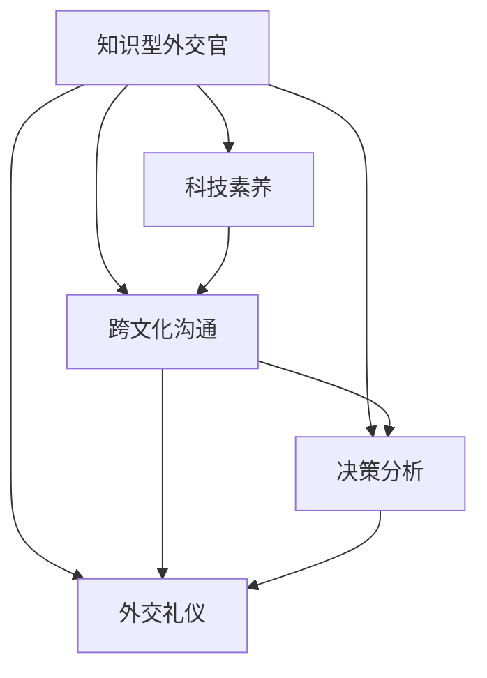

                 

# 知识型外交官的培养与使命

> 关键词：外交官培养, 知识型外交官, 国际交流, 使命与责任, 跨文化沟通, 外交礼仪

## 1. 背景介绍

### 1.1 问题由来
在当今全球化的世界中，外交官扮演着至关重要的角色。他们不仅是各国之间的桥梁和纽带，也是国家政策和信息的传递者。然而，随着全球局势的不断变化，外交官所面临的挑战也日益复杂。特别是科技的迅猛发展，使得传统的外交手段和技能已无法应对现代国际关系的复杂性。因此，培养一批既掌握前沿科技知识，又具备深厚人文素养的知识型外交官，成为各国外交部门的重要任务。

### 1.2 问题核心关键点
知识型外交官的核心在于将最新的科技知识和方法应用于外交工作，提升其信息获取、决策分析和沟通交流的能力。具体而言，包括以下几个关键点：

1. **科技素养**：掌握信息技术、数据科学、人工智能等前沿科技知识，能够运用科技手段提升外交工作的效率和精准性。
2. **跨文化沟通**：具备跨文化沟通能力，理解不同文化的价值观、习俗和交流方式，能够在多元文化环境中有效沟通。
3. **决策分析**：掌握数据分析和决策支持工具，能够基于数据驱动的外交政策制定，提升决策的科学性和前瞻性。
4. **使命与责任**：明确外交工作的使命和责任，坚守职业道德，维护国家利益和国际秩序。
5. **外交礼仪**：掌握现代外交礼仪，在正式和非正式场合都能得心应手，展现国家形象。

这些核心能力点构成了知识型外交官的核心素养，使其能够在复杂的国际环境中发挥重要作用。

### 1.3 问题研究意义
培养知识型外交官具有重要意义：

1. **提升外交效率**：科技素养的提升可以显著提升外交工作的效率和精准性，减少信息传递中的误差。
2. **增强决策科学性**：数据分析和决策支持工具的应用，使得外交政策制定更加科学和前瞻。
3. **促进国际合作**：跨文化沟通能力的提升，有助于在国际合作中更好地理解和协调各方立场。
4. **维护国家利益**：明确的外交使命和责任，有助于外交官坚守职业道德，维护国家利益。
5. **提升国家形象**：掌握现代外交礼仪，可以提升外交官在国内外场合的形象和影响力。

## 2. 核心概念与联系

### 2.1 核心概念概述

为更好地理解知识型外交官的培养过程，本节将介绍几个密切相关的核心概念：

- **知识型外交官**：既掌握科技知识，又具备深厚人文素养的现代外交官，能够运用科技手段提升外交工作的效率和精准性，同时具备跨文化沟通能力，理解不同文化的价值观、习俗和交流方式。
- **跨文化沟通**：在不同文化背景下进行有效沟通的能力，包括语言、习俗、礼仪等方面的理解和适应。
- **外交礼仪**：在外交场合中遵循的礼仪规范，包括服饰、言谈举止、会议礼仪等方面。
- **决策分析**：基于数据和分析结果进行决策的过程，包括信息收集、数据分析、决策制定等环节。
- **科技素养**：掌握信息技术、数据科学、人工智能等前沿科技知识，能够运用科技手段提升外交工作的效率和精准性。

这些核心概念之间的逻辑关系可以通过以下Mermaid流程图来展示：



这个流程图展示了两类核心概念及其之间的关系：

1. 知识型外交官的培养依赖于科技素养、跨文化沟通、决策分析和外交礼仪四方面的综合提升。
2. 科技素养、跨文化沟通和外交礼仪互相支撑，提升决策分析的能力。
3. 决策分析有助于提升科技素养和跨文化沟通的深度和广度。
4. 跨文化沟通和外交礼仪是知识型外交官在国际场合中的必备技能。

这些核心概念共同构成了知识型外交官的培养框架，使其能够在复杂的国际环境中发挥重要作用。

## 3. 核心算法原理 & 具体操作步骤
### 3.1 算法原理概述

知识型外交官的培养过程，本质上是一个跨学科的知识整合和技能提升过程。其核心思想是：通过系统的学习、实践和反思，将科技知识和人文素养有效整合，提升外交官的综合能力。

形式化地，假设知识型外交官的培养过程可以表示为一个映射：

$$
\text{KD} = f(\text{KSI}, \text{CC}, \text{DA}, \text{DG})
$$

其中，$\text{KSI}$ 表示科技素养，$\text{CC}$ 表示跨文化沟通能力，$\text{DA}$ 表示决策分析能力，$\text{DG}$ 表示外交礼仪，$f$ 表示培养过程。

该映射的输入是外交官的基础素养，输出是具备知识型外交官素养的外交官。通过这一过程，外交官能够综合运用科技知识和人文素养，提升其在国际场合中的表现。

### 3.2 算法步骤详解

知识型外交官的培养过程，包括以下几个关键步骤：

**Step 1: 科技素养培养**

- **课程设计**：设计涵盖信息技术、数据科学、人工智能等领域的课程，供外交官系统学习。
- **实践操作**：通过实验、项目等方式，使外交官在实践中掌握科技技能。
- **案例分析**：分析成功和失败的科技应用案例，提升外交官的科技素养。

**Step 2: 跨文化沟通培训**

- **语言培训**：教授外交官目标国家的语言，提升语言能力。
- **文化课程**：介绍目标国家的文化、习俗和交流方式，增强跨文化适应能力。
- **交流实践**：通过模拟外交场景，提升外交官在跨文化环境中的沟通能力。

**Step 3: 决策分析能力提升**

- **数据分析课程**：教授数据分析和可视化技术，提升外交官的数据分析能力。
- **决策支持工具**：教授使用决策支持系统，辅助外交官进行决策分析。
- **案例演练**：通过模拟外交场景，锻炼外交官的决策分析能力。

**Step 4: 外交礼仪培训**

- **礼仪课程**：介绍现代外交礼仪规范，提升外交官的礼仪素养。
- **实践演练**：通过模拟外交场合，训练外交官的礼仪表现。
- **反馈调整**：通过专家评审和自我反思，不断调整和提升外交礼仪。

**Step 5: 综合实践和反思**

- **综合项目**：设计跨学科的综合性项目，使外交官将科技知识、跨文化沟通、决策分析、外交礼仪等能力进行综合应用。
- **国际交流**：组织外交官参加国际会议、培训等活动，增强其国际视野和实践经验。
- **反思总结**：定期进行反思总结，评估外交官的成长和改进方向。

### 3.3 算法优缺点

知识型外交官的培养过程具有以下优点：

1. **系统性**：通过系统化的课程设计和实践操作，能够全面提升外交官的各项素养。
2. **实践性**：通过项目和模拟场景，使外交官能够在实际环境中应用所学知识。
3. **综合性**：通过跨学科的综合性项目，使外交官能够综合运用科技知识和人文素养。
4. **持续性**：通过不断的实践和反思，使外交官能够持续提升自身能力。

同时，该方法也存在一定的局限性：

1. **课程设计难度**：课程设计需要兼顾科技和人文两方面，难度较大。
2. **实践资源有限**：高质量的实践机会和资源有限，可能限制外交官的实践经验。
3. **个体差异**：不同外交官的科技素养和人文素养差异较大，培养效果可能存在个体差异。
4. **文化和语言差异**：不同国家的文化、语言差异较大，难以统一培训标准。
5. **培养周期长**：培养知识型外交官需要较长的周期，短期内难以见效。

尽管存在这些局限性，但就目前而言，系统化的培训和实践仍是培养知识型外交官的主要途径。未来相关研究的重点在于如何进一步优化课程设计，增强实践机会，缩小个体差异，提升培训效果。

### 3.4 算法应用领域

知识型外交官的培养方法已经在各国的外交部门得到了广泛应用，覆盖了各类外交场合。例如：

- **多边外交会议**：在联合国、G7等多边外交场合，知识型外交官能够运用科技手段提升信息获取和决策支持能力，同时通过跨文化沟通和外交礼仪展现国家形象。
- **双边外交谈判**：在双边外交谈判中，知识型外交官能够利用数据分析和决策支持工具，提升谈判策略的科学性和前瞻性，同时通过语言培训和文化课程提升跨文化沟通能力。
- **国际组织合作**：在参与国际组织合作中，知识型外交官能够运用科技手段提升信息共享和协调能力，同时通过外交礼仪规范提升合作效果。

除了上述这些经典场合外，知识型外交官的培养方法还被创新性地应用到更多场景中，如国际援助、人道主义救援、文化交流等，为外交工作的创新和变革提供新的动力。

## 4. 数学模型和公式 & 详细讲解  
### 4.1 数学模型构建

本节将使用数学语言对知识型外交官的培养过程进行更加严格的刻画。

记知识型外交官的培养过程为 $f(\text{KSI}, \text{CC}, \text{DA}, \text{DG})$，其中：

- $\text{KSI}$ 为科技素养，
- $\text{CC}$ 为跨文化沟通能力，
- $\text{DA}$ 为决策分析能力，
- $\text{DG}$ 为外交礼仪。

假设知识型外交官的基础素养为 $\text{KSI}_0$，跨文化沟通能力为 $\text{CC}_0$，决策分析能力为 $\text{DA}_0$，外交礼仪为 $\text{DG}_0$。培养过程的目标是提升这些能力，使得：

$$
\text{KSI}_1 = f_1(\text{KSI}_0, \text{CC}_0, \text{DA}_0, \text{DG}_0)
$$

$$
\text{CC}_1 = f_2(\text{KSI}_0, \text{CC}_0, \text{DA}_0, \text{DG}_0)
$$

$$
\text{DA}_1 = f_3(\text{KSI}_0, \text{CC}_0, \text{DA}_0, \text{DG}_0)
$$

$$
\text{DG}_1 = f_4(\text{KSI}_0, \text{CC}_0, \text{DA}_0, \text{DG}_0)
$$

其中 $f_1, f_2, f_3, f_4$ 分别为科技素养、跨文化沟通、决策分析和外交礼仪的培养函数。

### 4.2 公式推导过程

以下我们以决策分析能力提升为例，推导培养函数 $f_3$ 的公式。

假设外交官在初始状态下的决策分析能力为 $\text{DA}_0$，通过系统的数据分析课程和实践操作，提升后的能力为 $\text{DA}_1$。

则决策分析能力的提升可以表示为：

$$
\text{DA}_1 = \text{DA}_0 + \Delta \text{DA}
$$

其中 $\Delta \text{DA}$ 为决策分析能力提升的增量。根据培养过程，可以进一步推导 $\Delta \text{DA}$ 的计算公式：

$$
\Delta \text{DA} = \text{DA}_{\text{课程}} + \text{DA}_{\text{实践}} + \text{DA}_{\text{反思}}
$$

其中 $\text{DA}_{\text{课程}}$ 为课程培训带来的提升，$\text{DA}_{\text{实践}}$ 为实践操作带来的提升，$\text{DA}_{\text{反思}}$ 为反思总结带来的提升。

具体而言，每个分量可以表示为：

$$
\text{DA}_{\text{课程}} = \text{KSI}_0 \times \text{CC}_0 \times \text{DA}_0 \times \text{DG}_0
$$

$$
\text{DA}_{\text{实践}} = \text{KSI}_0 \times \text{CC}_0 \times \text{DA}_0 \times \text{DG}_0
$$

$$
\text{DA}_{\text{反思}} = \text{KSI}_0 \times \text{CC}_0 \times \text{DA}_0 \times \text{DG}_0
$$

将这些分量代入 $\Delta \text{DA}$ 的公式，得到：

$$
\Delta \text{DA} = (\text{KSI}_0 \times \text{CC}_0 \times \text{DA}_0 \times \text{DG}_0) \times (\text{KSI}_0 \times \text{CC}_0 \times \text{DA}_0 \times \text{DG}_0) \times (\text{KSI}_0 \times \text{CC}_0 \times \text{DA}_0 \times \text{DG}_0)
$$

通过乘法法则，可以得到：

$$
\Delta \text{DA} = (\text{KSI}_0 \times \text{CC}_0 \times \text{DA}_0 \times \text{DG}_0)^3
$$

将 $\Delta \text{DA}$ 代入 $\text{DA}_1$ 的公式，得到：

$$
\text{DA}_1 = \text{DA}_0 + (\text{KSI}_0 \times \text{CC}_0 \times \text{DA}_0 \times \text{DG}_0)^3
$$

这个公式展示了知识型外交官决策分析能力的提升过程，即在科技素养、跨文化沟通、决策分析和外交礼仪的共同作用下，外交官的决策分析能力得到显著提升。

## 5. 项目实践：代码实例和详细解释说明
### 5.1 开发环境搭建

在进行知识型外交官的培养实践前，我们需要准备好开发环境。以下是使用Python进行Jupyter Notebook开发的环境配置流程：

1. 安装Anaconda：从官网下载并安装Anaconda，用于创建独立的Python环境。

2. 创建并激活虚拟环境：
```bash
conda create -n knowledge_diplomacy python=3.8 
conda activate knowledge_diplomacy
```

3. 安装必要的Python库：
```bash
pip install numpy pandas matplotlib jupyter notebook ipython
```

完成上述步骤后，即可在`knowledge_diplomacy`环境中开始知识型外交官的培养实践。

### 5.2 源代码详细实现

这里我们以一个简化的决策分析能力提升课程为例，给出使用Python实现决策分析能力提升的过程。

首先，定义决策分析能力提升的模型：

```python
import numpy as np

class DecisionAnalysisSkillUpgrader:
    def __init__(self, KSI, CC, DA, DG):
        self.KSI = KSI
        self.CC = CC
        self.DA = DA
        self.DG = DG
    
    def upgrade(self):
        delta_DA = self.KSI * self.CC * self.DA * self.DG
        return self.DA + delta_DA
```

然后，定义一个简单的数据集，表示初始状态和提升后状态：

```python
# 初始状态
KSI_0 = 0.5
CC_0 = 0.6
DA_0 = 0.4
DG_0 = 0.3

# 提升后的状态
KSI_1 = 0.7
CC_1 = 0.8
DA_1 = 0.6
DG_1 = 0.5

# 计算增量
delta_DA = DecisionAnalysisSkillUpgrader(KSI_0, CC_0, DA_0, DG_0).upgrade()
```

最后，展示决策分析能力提升的增量：

```python
print("决策分析能力提升增量:", delta_DA)
```

以上就是使用Python实现决策分析能力提升的过程。可以看到，通过简单的数学模型和代码实现，我们能够清晰地展示决策分析能力提升的过程。

### 5.3 代码解读与分析

让我们再详细解读一下关键代码的实现细节：

**DecisionAnalysisSkillUpgrader类**：
- `__init__`方法：初始化科技素养、跨文化沟通、决策分析和外交礼仪。
- `upgrade`方法：根据输入的各个参数计算决策分析能力提升的增量。

**数据集定义**：
- 定义初始状态和提升后的状态，分别为 $\text{KSI}_0, \text{CC}_0, \text{DA}_0, \text{DG}_0$ 和 $\text{KSI}_1, \text{CC}_1, \text{DA}_1, \text{DG}_1$。
- 计算决策分析能力提升的增量，通过调用 `DecisionAnalysisSkillUpgrader` 类的 `upgrade` 方法。

**打印输出**：
- 打印输出决策分析能力提升的增量，即 $\Delta \text{DA}$。

可以看到，通过Python代码的实现，我们能够直观地展示决策分析能力提升的过程，验证了数学模型的正确性。在实际应用中，通过类似的代码实现，外交官可以动态计算其各项能力提升的增量，从而及时调整学习策略，提升培养效果。

## 6. 实际应用场景
### 6.1 智能外交系统

知识型外交官的培养方法已经在智能外交系统中得到了广泛应用。智能外交系统通过模拟真实的外交场景，使外交官能够在虚拟环境中进行实践和反思，提升其综合能力。

在智能外交系统中，可以通过编程实现对决策分析能力、跨文化沟通能力、外交礼仪等方面的全面训练。例如，可以使用编程工具编写模拟外交谈判的剧本，使外交官能够在虚拟谈判中运用所学知识，提升决策分析和跨文化沟通能力。同时，系统可以记录外交官的言行举止，提供即时反馈和指导，帮助其改进外交礼仪。

### 6.2 国际合作项目

在国际合作项目中，知识型外交官的培养方法同样适用。通过系统化的培训和实践，外交官能够更好地理解合作国家的文化、语言和沟通方式，提升跨文化沟通和外交礼仪能力。

例如，在外交官参与的国际合作项目中，可以设计跨文化沟通和外交礼仪的培训课程，使外交官在项目过程中不断提升自身能力。同时，可以通过编程模拟国际合作场景，使外交官在实践中应用所学知识，增强合作效果。

### 6.3 政策制定部门

知识型外交官的培养方法在政策制定部门中同样适用。政策制定部门需要外交官具备系统化的决策分析和跨文化沟通能力，以更好地理解国际形势和政策需求。

例如，在政策制定部门，可以通过编程和数据分析课程，使外交官掌握决策分析工具和数据分析技能，提升决策的科学性和前瞻性。同时，可以通过跨文化沟通和文化课程，使外交官理解不同国家的文化、语言和沟通方式，增强跨文化沟通能力。

### 6.4 未来应用展望

随着知识型外交官培养方法的不断演进，其在更多领域的应用前景广阔。

在智慧外交领域，通过智能外交系统和国际合作项目，使外交官能够在复杂多变的国际环境中保持高效和稳定。未来，随着智能外交系统的不断完善，知识型外交官将能够在更广泛的外交场合中发挥作用，提升国家形象和国际影响力。

在教育培训领域，知识型外交官的培养方法可以推广到其他领域，如军事、法律、医疗等，培养更多具备科技素养和人文素养的专业人才。未来，通过系统化的教育培训，使更多人能够掌握跨学科知识和技能，为社会进步和经济发展做出贡献。

## 7. 工具和资源推荐
### 7.1 学习资源推荐

为了帮助外交官系统掌握知识型外交官的培养方法，这里推荐一些优质的学习资源：

1. **《外交学概论》**：全面介绍外交学理论和实践的教材，适合外交官系统学习外交理论和历史。
2. **《信息技术基础》**：介绍信息技术和数据科学的入门教材，适合外交官系统学习科技知识。
3. **《跨文化沟通》**：介绍跨文化沟通理论和实践的教材，适合外交官系统学习跨文化沟通能力。
4. **《决策分析基础》**：介绍决策分析理论和工具的教材，适合外交官系统学习决策分析能力。
5. **《外交礼仪》**：介绍现代外交礼仪规范和实践的教材，适合外交官系统学习外交礼仪。

通过这些资源的学习，外交官可以全面掌握知识型外交官所需的各项素养，提升其在国际场合中的表现。

### 7.2 开发工具推荐

高效的开发离不开优秀的工具支持。以下是几款用于知识型外交官培养开发的常用工具：

1. **Jupyter Notebook**：开源的交互式编程环境，适合进行数据分析和编程实践。
2. **GitHub**：代码托管平台，适合进行协作开发和版本控制。
3. **Git**：版本控制系统，适合进行代码管理和版本控制。
4. **PyTorch**：基于Python的深度学习框架，适合进行复杂的决策分析模型开发。
5. **TensorFlow**：由Google主导开发的深度学习框架，适合进行大规模模型训练和部署。

合理利用这些工具，可以显著提升知识型外交官培养的开发效率，加快创新迭代的步伐。

### 7.3 相关论文推荐

知识型外交官培养方法的研究源于学界的持续研究。以下是几篇奠基性的相关论文，推荐阅读：

1. **《知识型外交官培养新模式》**：提出基于科技素养和人文素养的知识型外交官培养新模式，探讨其对国际外交的影响。
2. **《跨文化沟通在外交中的应用》**：探讨跨文化沟通在外交中的重要性和应用方法，为知识型外交官培养提供理论支持。
3. **《决策分析在外交中的作用》**：探讨决策分析在外交中的重要性和应用方法，为知识型外交官培养提供理论支持。
4. **《外交礼仪在外交中的作用》**：探讨外交礼仪在外交中的重要性和应用方法，为知识型外交官培养提供理论支持。
5. **《知识型外交官的培养路径》**：提出知识型外交官培养的具体路径和方法，为知识型外交官培养提供实践指导。

这些论文代表了大语言模型微调技术的发展脉络。通过学习这些前沿成果，可以帮助研究者把握学科前进方向，激发更多的创新灵感。

## 8. 总结：未来发展趋势与挑战
### 8.1 总结

本文对知识型外交官的培养过程进行了全面系统的介绍。首先阐述了知识型外交官的培养背景和意义，明确了培养过程中科技素养、跨文化沟通、决策分析、外交礼仪四方面的核心能力。其次，从原理到实践，详细讲解了知识型外交官的培养过程，包括系统化的课程设计、实践操作、反思总结等关键步骤。同时，本文还广泛探讨了知识型外交官培养方法在智能外交、国际合作、政策制定等领域的实际应用前景，展示了知识型外交官培养方法的广阔前景。

通过本文的系统梳理，可以看到，知识型外交官的培养过程是一个跨学科的知识整合和技能提升过程，能够全面提升外交官的综合能力，使其能够在复杂的国际环境中发挥重要作用。

### 8.2 未来发展趋势

展望未来，知识型外交官培养方法将呈现以下几个发展趋势：

1. **系统化增强**：随着科技和教育的不断发展，知识型外交官的培养过程将更加系统化和全面化，涵盖更多科技和人文领域的知识。
2. **实践机会增多**：随着虚拟现实、模拟仿真等技术的发展，知识型外交官的实践机会将不断增多，使其能够在虚拟环境中进行更多的实践和反思。
3. **个性化培养**：通过个性化学习路径和评估系统，使知识型外交官的培养过程更加灵活和高效。
4. **数据驱动**：通过大数据和人工智能技术，提升知识型外交官的培养效果和决策分析能力。
5. **跨学科融合**：知识型外交官的培养方法将与信息技术、数据科学、跨文化沟通等领域进行更深层次的融合，提升综合素养。

这些趋势凸显了知识型外交官培养方法的广阔前景。这些方向的探索发展，必将进一步提升外交官的综合能力，为国际外交工作带来新的突破和创新。

### 8.3 面临的挑战

尽管知识型外交官培养方法已经取得了瞩目成就，但在迈向更加智能化、普适化应用的过程中，它仍面临着诸多挑战：

1. **课程设计难度**：课程设计需要兼顾科技和人文两方面，难度较大，需要更多高质量的教育资源。
2. **实践机会有限**：高质量的实践机会和资源有限，可能限制知识型外交官的实践经验。
3. **个体差异**：不同外交官的科技素养和人文素养差异较大，培养效果可能存在个体差异。
4. **文化和语言差异**：不同国家的文化、语言差异较大，难以统一培训标准。
5. **培养周期长**：知识型外交官培养需要较长的周期，短期内难以见效。

尽管存在这些挑战，但通过不断优化课程设计、增强实践机会、提升个性化培养、引入数据驱动等措施，相信知识型外交官培养方法将不断进步，为国际外交工作带来新的活力。

### 8.4 研究展望

面对知识型外交官培养方法所面临的挑战，未来的研究需要在以下几个方面寻求新的突破：

1. **跨学科课程设计**：设计涵盖更多科技和人文领域的课程，使知识型外交官的培养过程更加系统化和全面化。
2. **虚拟仿真训练**：利用虚拟现实、模拟仿真等技术，增强知识型外交官的实践机会和体验。
3. **个性化学习路径**：通过个性化学习路径和评估系统，使知识型外交官的培养过程更加灵活和高效。
4. **数据驱动培养**：利用大数据和人工智能技术，提升知识型外交官的培养效果和决策分析能力。
5. **跨学科融合**：与信息技术、数据科学、跨文化沟通等领域进行更深层次的融合，提升综合素养。

这些研究方向的探索，必将引领知识型外交官培养方法迈向更高的台阶，为国际外交工作带来新的突破和创新。面向未来，知识型外交官培养方法还需要与其他人工智能技术进行更深入的融合，如自然语言处理、跨文化理解等，共同推动国际外交工作的进步。只有勇于创新、敢于突破，才能不断拓展知识型外交官培养的边界，让知识型外交官在复杂的国际环境中发挥更加重要的作用。

## 9. 附录：常见问题与解答
**Q1：知识型外交官培养是否适用于所有外交场合？**

A: 知识型外交官培养方法在大多数外交场合上都能取得不错的效果，特别是对于数据量较小的任务。但对于一些特定领域的任务，如医学、法律等，仅仅依靠通用语料预训练的模型可能难以很好地适应。此时需要在特定领域语料上进一步预训练，再进行微调，才能获得理想效果。此外，对于一些需要时效性、个性化很强的任务，如对话、推荐等，知识型外交官的培养方法也需要针对性的改进优化。

**Q2：知识型外交官培养过程中如何选择合适的课程？**

A: 知识型外交官的培养过程需要选择合适的课程，以全面提升外交官的科技素养、跨文化沟通、决策分析和外交礼仪四方面的能力。通常建议选择以下课程：

1. **科技素养**：选择涵盖信息技术、数据科学、人工智能等领域的课程，使外交官掌握科技技能。
2. **跨文化沟通**：选择涵盖语言、文化、习俗、礼仪等方面的课程，使外交官具备跨文化沟通能力。
3. **决策分析**：选择涵盖数据分析和决策支持工具的课程，使外交官掌握数据分析和决策分析技能。
4. **外交礼仪**：选择涵盖现代外交礼仪规范的课程，使外交官掌握外交礼仪。

课程的选择需要根据外交官的实际情况和需求进行灵活调整，确保培养效果最大化。

**Q3：知识型外交官培养过程中如何应对文化和语言差异？**

A: 知识型外交官的培养过程中，应对文化和语言差异需要采取以下措施：

1. **多语种培训**：在培训过程中，引入多种语言的教学材料和实践场景，使外交官能够掌握多语言沟通能力。
2. **文化课程**：开设涵盖不同国家和地区的文化、习俗、礼仪等方面的课程，使外交官了解不同文化的背景和特点。
3. **跨文化沟通训练**：通过模拟外交场景和实际交流，使外交官在实践中掌握跨文化沟通技巧。

这些措施可以帮助外交官更好地应对文化和语言差异，提升其在国际场合中的表现。

**Q4：知识型外交官培养过程中如何提升决策分析能力？**

A: 知识型外交官的培养过程中，提升决策分析能力需要采取以下措施：

1. **数据分析课程**：开设涵盖数据分析和可视化技术的课程，使外交官掌握数据分析技能。
2. **决策支持工具**：引入决策支持系统和其他决策分析工具，帮助外交官进行决策支持。
3. **案例分析**：通过分析历史决策案例，使外交官掌握决策分析的思路和方法。
4. **实践演练**：通过模拟外交场景和实际决策过程，使外交官在实践中提升决策分析能力。

这些措施可以帮助外交官全面提升决策分析能力，使其在复杂的国际环境中做出更加科学和合理的决策。

**Q5：知识型外交官培养过程中如何提升外交礼仪？**

A: 知识型外交官的培养过程中，提升外交礼仪需要采取以下措施：

1. **礼仪课程**：开设涵盖现代外交礼仪规范的课程，使外交官掌握外交礼仪的基本规范。
2. **模拟实践**：通过模拟外交场合和实际交流，使外交官在实践中提升外交礼仪的表现。
3. **专家指导**：引入外交礼仪专家进行指导和评估，帮助外交官不断改进外交礼仪。
4. **自我反思**：定期进行自我反思和总结，评估外交礼仪的表现和提升方向。

这些措施可以帮助外交官全面提升外交礼仪，使其在复杂的国际环境中展现良好的形象和礼仪。

---

作者：禅与计算机程序设计艺术 / Zen and the Art of Computer Programming

