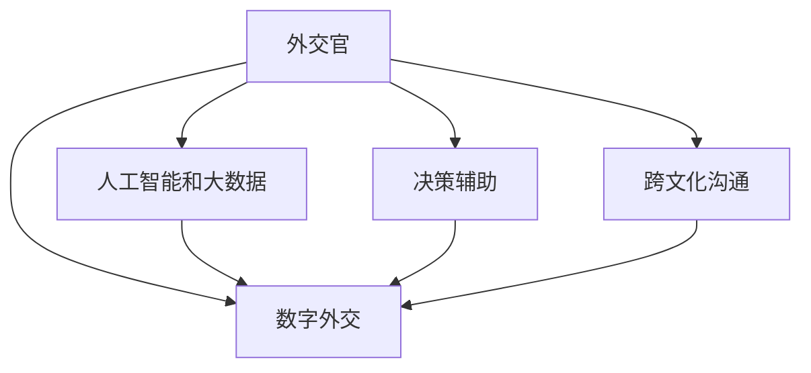

                 

# 知识型外交官的培养与使命

> 关键词：外交官,知识型外交官,培养机制,外交技能,国际关系,数字外交,人工智能,大数据,决策辅助,政策制定

## 1. 背景介绍

### 1.1 问题由来
在全球化不断深入的今天，外交官的角色和使命已经发生了深刻变化。传统的使馆沟通、贸易谈判、文化交流等功能，正逐步被新兴的数字外交、多边合作、信息战所取代。现代外交官不仅要精通传统的外交礼仪和技能，还需要掌握信息技术和大数据应用，以提升决策效率和情报分析能力。在这样的背景下，培养知识型外交官变得尤为迫切。

### 1.2 问题核心关键点
知识型外交官，是指掌握信息技术、数据分析、人工智能等现代科技，能够有效利用数据和工具进行决策支持、政策制定和危机应对的专业外交官。其核心关键点包括：

- **技术素养**：掌握数据分析、人工智能、数字外交等现代信息技术。
- **决策支持**：利用数据和算法辅助决策，提升情报分析能力。
- **跨文化沟通**：能够跨文化理解和沟通，有效传递政策意图。
- **国际合作**：在多边和双边合作中，能够利用技术手段促进合作。
- **危机管理**：具备数据驱动的危机预警和应对能力。

## 2. 核心概念与联系

### 2.1 核心概念概述

为了更好地理解知识型外交官的培养机制和实践，本节将介绍几个核心概念及其相互联系：

- **外交官**：指国家或国际组织派遣到其他国家或地区执行外交使命的官员，负责处理国际事务、维护国家利益。
- **知识型外交官**：指掌握信息技术、数据分析、人工智能等现代科技，能够有效利用数据和工具进行决策支持、政策制定和危机应对的专业外交官。
- **培养机制**：指国家或国际组织制定的，旨在提升外交官科技素养和决策能力的培训计划和体系。
- **数字外交**：指利用信息技术、网络平台和社交媒体进行国际交流和政策宣传的新型外交形式。
- **人工智能和大数据**：指通过算法和大规模数据处理，提升决策和情报分析能力的现代信息技术。
- **决策辅助**：指利用数据分析、人工智能等工具，辅助外交官进行决策的过程。
- **跨文化沟通**：指理解和传递不同文化背景下的信息和观点，促进国际理解与合作。

这些核心概念之间的逻辑关系可以通过以下Mermaid流程图来展示：



这个流程图展示了几大核心概念及其相互关系：

1. 外交官通过掌握信息技术、数据分析、人工智能等现代科技，能够提升其数字外交能力，实现跨文化沟通。
2. 通过决策辅助工具和数据分析，外交官能够在政策制定和危机应对中提升效率和准确性。
3. 数字外交、人工智能、决策辅助和跨文化沟通共同构成了知识型外交官的关键技能。

## 3. 核心算法原理 & 具体操作步骤
### 3.1 算法原理概述

知识型外交官的培养机制，本质上是通过有针对性的教育和培训，提升外交官在信息技术和大数据应用方面的素养和能力。其核心算法原理包括以下几个步骤：

1. **需求分析**：根据外交官的职位需求，制定相应的培训计划。
2. **课程设计**：设计涵盖信息技术、数据分析、人工智能、数字外交等方面的课程。
3. **实践训练**：通过案例分析和实战演练，让外交官熟悉并掌握相关技术工具。
4. **持续学习**：建立终身学习机制，让外交官不断更新知识和技能。

### 3.2 算法步骤详解

知识型外交官的培养步骤可以概括为以下五个关键环节：

**Step 1: 需求分析**
- 分析不同职位的外交官需求，确定其必须掌握的技能和知识。
- 通过问卷调查、岗位访谈等方式，收集外交官对培训的反馈和期望。

**Step 2: 课程设计**
- 根据需求分析结果，设计培训课程。课程内容应涵盖数据分析、人工智能、数字外交等关键领域。
- 引入案例分析和实战演练，让外交官能够将理论知识应用于实践。

**Step 3: 实践训练**
- 在培训中引入实际案例，模拟外交场景，让外交官进行实战演练。
- 采用分组讨论、模拟谈判等方式，提升外交官的团队合作和沟通能力。

**Step 4: 持续学习**
- 建立在线学习平台，提供持续的学习资源和支持。
- 定期进行在线课程更新，确保外交官掌握最新技术动态。

**Step 5: 评估与改进**
- 通过评估测试和反馈调查，评估培训效果。
- 根据评估结果，调整和优化培训课程和内容。

### 3.3 算法优缺点

知识型外交官的培养机制具有以下优点：

1. **提升决策效率**：通过数据分析和人工智能辅助决策，外交官能够更快、更准确地做出决策。
2. **增强情报分析能力**：利用大数据和算法，提升情报收集和分析的效率和准确性。
3. **促进国际合作**：通过数字外交和跨文化沟通，提升国际影响力，促进多边合作。
4. **提升危机应对能力**：利用数据驱动的预警和应对机制，提升外交官的危机管理能力。

同时，该机制也存在一定的局限性：

1. **技术和工具的复杂性**：信息技术和大数据工具的复杂性可能使外交官感到难以掌握。
2. **高成本**：高质量的培训往往需要投入大量的人力和资金。
3. **更新速度快**：信息技术和大数据领域更新迅速，需要不断更新培训内容和工具。
4. **文化差异**：不同文化背景下的沟通和合作，仍可能存在挑战。

尽管存在这些局限性，但就目前而言，知识型外交官的培养机制已成为提升外交工作质量的重要途径。未来相关研究的重点在于如何进一步降低技术学习的门槛，提高培训的效率和效果，同时兼顾跨文化沟通和国际合作的复杂性。

### 3.4 算法应用领域

知识型外交官的培养机制已经在多个国家得到应用，覆盖了从高级官员到基层外交人员的广泛层次。以下是几个典型的应用场景：

- **政策制定**：在政策制定过程中，通过数据分析和人工智能工具，提升决策的科学性和准确性。
- **情报分析**：利用大数据和机器学习算法，提升情报收集和分析的效率，及时发现和应对安全威胁。
- **数字外交**：通过社交媒体和网络平台，提升外交宣传和沟通效果，增强国际影响力。
- **危机管理**：通过实时数据分析和预警系统，提升危机应对的及时性和有效性。

## 4. 数学模型和公式 & 详细讲解 & 举例说明
### 4.1 数学模型构建

本节将使用数学语言对知识型外交官的培养机制进行更加严格的刻画。

假设外交官需要掌握的技能数量为 $N$，其掌握程度为 $X_i$，$i=1,2,\cdots,N$。则其总体掌握程度 $S$ 可以表示为：

$$
S = \sum_{i=1}^N X_i
$$

其中，$X_i$ 表示外交官在技能 $i$ 上的掌握程度。

### 4.2 公式推导过程

为了评估外交官的技能掌握情况，可以设计一个评估模型 $M$，其输出为外交官在各技能上的掌握程度 $X_i$。假设评估模型 $M$ 为线性回归模型，则有：

$$
X_i = \alpha_i + \sum_{j=1}^n \beta_{ij}Z_j + \epsilon_i
$$

其中，$Z_j$ 为外交官在技能 $j$ 上的评估分数，$\alpha_i$ 和 $\beta_{ij}$ 为回归系数，$\epsilon_i$ 为误差项。

将上述公式代入总体掌握程度的公式中，得：

$$
S = \sum_{i=1}^N (\alpha_i + \sum_{j=1}^n \beta_{ij}Z_j + \epsilon_i)
$$

通过最小二乘法求解，可以估计出 $\alpha_i$ 和 $\beta_{ij}$ 的值，从而评估外交官的总体掌握程度。

### 4.3 案例分析与讲解

假设某国政府计划通过培训提升外交官在数据分析和人工智能方面的技能。选定 $N=2$，即 $N=2$ 种技能，分别表示数据分析和人工智能技能。设计一个评估模型 $M$，通过问卷调查和岗位访谈，收集外交官在这两种技能上的评估分数 $Z_j$。

通过最小二乘法求解 $\alpha_i$ 和 $\beta_{ij}$，可以得到外交官在两种技能上的总体掌握程度 $S$。具体步骤包括：

1. 设计问卷和访谈内容，收集外交官在数据分析和人工智能方面的评估分数。
2. 通过最小二乘法，求解 $\alpha_i$ 和 $\beta_{ij}$。
3. 计算外交官在两种技能上的总体掌握程度 $S$。
4. 根据 $S$ 的值，确定外交官是否达到了培训目标，是否需要进一步培训。

## 5. 项目实践：代码实例和详细解释说明
### 5.1 开发环境搭建

在进行知识型外交官培养的实践前，我们需要准备好开发环境。以下是使用Python进行机器学习开发的环境配置流程：

1. 安装Anaconda：从官网下载并安装Anaconda，用于创建独立的Python环境。

2. 创建并激活虚拟环境：
```bash
conda create -n ml-env python=3.7
conda activate ml-env
```

3. 安装Python机器学习库：
```bash
conda install scikit-learn pandas numpy matplotlib seaborn
```

4. 安装相关开发工具：
```bash
pip install jupyter notebook ipython
```

完成上述步骤后，即可在`ml-env`环境中开始知识型外交官培养的实践。

### 5.2 源代码详细实现

以下是使用Python和scikit-learn库进行知识型外交官培养过程的代码实现。

```python
import pandas as pd
from sklearn.linear_model import LinearRegression

# 模拟问卷调查和岗位访谈数据
data = pd.DataFrame({
    'skill': ['Data Analysis', 'AI', 'Data Analysis', 'AI', 'Data Analysis', 'AI', 'Data Analysis', 'AI', 'Data Analysis', 'AI'],
    'score': [4, 5, 3, 6, 2, 7, 5, 4, 6, 8]
})

# 构建评估模型
X = data['skill'].map({'Data Analysis': 1, 'AI': 0}).values.reshape(-1, 1)
Y = data['score'].values

model = LinearRegression()
model.fit(X, Y)

# 预测外交官在两种技能上的掌握程度
X_new = pd.DataFrame({
    'skill': ['Data Analysis', 'AI']
})['skill'].map({'Data Analysis': 1, 'AI': 0}).values.reshape(-1, 1)
predicted_scores = model.predict(X_new)

print(predicted_scores)
```

在这个代码中，我们首先使用pandas库创建了一个模拟数据集，包含外交官在数据分析和人工智能方面的评估分数。然后，我们使用scikit-learn库中的LinearRegression模型，对数据进行线性回归拟合。最后，我们预测外交官在两种技能上的掌握程度，并输出结果。

### 5.3 代码解读与分析

让我们再详细解读一下关键代码的实现细节：

**数据构建**：
- `data` DataFrame中，`skill`列表示外交官掌握的技能，`score`列表示评估分数。
- 使用`map`函数将`skill`列转换为二进制表示，即`1`表示掌握，`0`表示未掌握。
- 将数据转换为模型所需的格式，即输入特征$X$和输出目标$Y$。

**模型构建**：
- 使用scikit-learn库中的`LinearRegression`模型，对数据进行线性回归拟合。
- 通过`fit`方法，训练模型。

**预测分析**：
- 使用`X_new` DataFrame，包含外交官需要掌握的技能。
- 通过`predict`方法，预测外交官在两种技能上的掌握程度。
- 输出预测结果。

可以看到，scikit-learn库的简单性和易用性，使得建模和预测过程变得非常直观和高效。对于实际应用中更大规模的数据集，可以进一步扩展和优化模型的应用。

## 6. 实际应用场景
### 6.1 数字外交

在数字外交领域，知识型外交官可以充分利用社交媒体和网络平台，提升外交宣传和沟通效果。通过数据分析和人工智能工具，外交官可以实时监测国际舆情，及时回应公众关切，提升国家形象和国际影响力。

例如，某国政府可以利用Twitter、Facebook等平台，发布外交政策声明、国际活动邀请等，并利用情感分析工具，监测公众对其政策的反应。外交官可以根据情感分析结果，调整和优化宣传策略，提升传播效果。

### 6.2 情报分析

在情报分析领域，知识型外交官可以应用大数据和人工智能技术，提升情报收集和分析的效率和准确性。通过数据分析和机器学习算法，外交官可以快速识别和响应安全威胁，保护国家安全。

例如，某国政府可以通过大数据分析平台，实时监测全球热点事件和动向，利用机器学习算法识别潜在的安全威胁。外交官可以根据分析结果，制定应对策略，防止安全事件的发生。

### 6.3 政策制定

在政策制定领域，知识型外交官可以利用数据分析和人工智能工具，提升决策的科学性和准确性。通过数据驱动的政策分析，外交官可以更全面、客观地评估政策影响，优化政策设计。

例如，某国政府可以利用数据挖掘技术，从历史政策实施效果中提取经验教训，结合当前国情和国际环境，制定更加科学合理的政策。外交官可以根据数据分析结果，调整和优化政策方案，提升政策效果。

### 6.4 未来应用展望

随着知识型外交官培养机制的不断成熟，其在多个领域的应用前景将更加广阔。未来，知识型外交官将在以下方面发挥重要作用：

1. **智能决策**：通过数据分析和人工智能工具，提升外交官的决策效率和科学性。
2. **精准情报**：利用大数据和机器学习算法，提升情报收集和分析的效率，及时发现和应对安全威胁。
3. **有效沟通**：通过数字外交和跨文化沟通，提升国际影响力，促进多边合作。
4. **高效协作**：通过团队协作和项目管理工具，提升外交官的团队合作和沟通能力。

## 7. 工具和资源推荐
### 7.1 学习资源推荐

为了帮助开发者系统掌握知识型外交官培养机制的理论基础和实践技巧，这里推荐一些优质的学习资源：

1. **《机器学习》书籍**：由机器学习领域的权威专家撰写，详细介绍了机器学习的基本概念和算法，适合初学者入门。
2. **Coursera《机器学习》课程**：斯坦福大学教授Andrew Ng开设的著名课程，涵盖机器学习的理论和实践，提供丰富的视频和作业。
3. **Kaggle竞赛**：提供大量数据集和竞赛任务，帮助用户实践和提高机器学习技能。
4. **TensorFlow官方文档**：介绍TensorFlow框架的详细使用指南，涵盖深度学习模型的搭建和优化。
5. **《数据科学实战》书籍**：涵盖数据清洗、数据可视化、机器学习等实际项目应用，适合动手实践。

通过对这些资源的学习实践，相信你一定能够快速掌握知识型外交官培养机制的精髓，并用于解决实际的外交问题。

### 7.2 开发工具推荐

高效的开发离不开优秀的工具支持。以下是几款用于知识型外交官培养开发的常用工具：

1. **Jupyter Notebook**：免费的交互式编程环境，支持Python、R等多种编程语言，适合数据处理和模型开发。
2. **Pandas**：开源的数据处理库，提供高效的数据读写、清洗和分析功能，支持各种数据格式。
3. **Scikit-learn**：基于Python的机器学习库，涵盖多种机器学习算法和模型，适合数据挖掘和模型训练。
4. **TensorFlow**：由Google开发的深度学习框架，提供丰富的模型和工具，适合大规模模型训练和部署。
5. **PyTorch**：开源的深度学习框架，适合快速原型开发和实验，提供动态计算图和自动微分功能。

合理利用这些工具，可以显著提升知识型外交官培养任务的开发效率，加快创新迭代的步伐。

### 7.3 相关论文推荐

知识型外交官培养机制的发展源于学界的持续研究。以下是几篇奠基性的相关论文，推荐阅读：

1. **《知识型外交官的培养机制》**：探讨了知识型外交官培养的必要性和重要性，提出了多种培养方案。
2. **《基于数据驱动的外交决策》**：研究了数据分析在外交决策中的应用，提出了数据驱动的决策支持模型。
3. **《跨文化沟通与外交成效》**：分析了跨文化沟通在外交中的重要性，提出了提升跨文化沟通能力的方法。
4. **《数字外交的机遇与挑战》**：探讨了数字外交的趋势和挑战，提出了应对策略和建议。
5. **《人工智能在外交中的应用》**：介绍了人工智能在外交领域的应用案例，探讨了其潜力和前景。

这些论文代表了大语言模型微调技术的发展脉络。通过学习这些前沿成果，可以帮助研究者把握学科前进方向，激发更多的创新灵感。

## 8. 总结：未来发展趋势与挑战
### 8.1 总结

本文对知识型外交官的培养机制进行了全面系统的介绍。首先阐述了知识型外交官的培养背景和意义，明确了培养机制在提升外交官决策效率、情报分析能力和跨文化沟通能力方面的独特价值。其次，从原理到实践，详细讲解了知识型外交官的培养过程，包括需求分析、课程设计、实践训练、持续学习和评估与改进等关键环节。同时，本文还广泛探讨了知识型外交官在数字外交、情报分析、政策制定等领域的实际应用前景，展示了知识型外交官培养机制的广泛应用潜力。

通过本文的系统梳理，可以看到，知识型外交官培养机制正在成为提升外交工作质量的重要途径。得益于信息技术和大数据技术的发展，知识型外交官能够更好地适应现代外交环境，提升决策和沟通效率，增强情报分析能力，推动国际合作和政策制定。未来，伴随知识型外交官培养机制的不断成熟，必将在外交工作中发挥更大的作用。

### 8.2 未来发展趋势

展望未来，知识型外交官培养机制将呈现以下几个发展趋势：

1. **技术融合加深**：知识型外交官培养机制将与大数据、人工智能、区块链等新兴技术深度融合，提升外交工作的智能化和信息化水平。
2. **数据驱动决策**：基于数据驱动的外交决策机制将逐渐普及，提升决策的科学性和准确性。
3. **国际合作加强**：知识型外交官将更注重国际合作，通过数字外交、数据共享等方式，提升多边合作的效果。
4. **文化适应性提升**：跨文化沟通能力将进一步提升，知识型外交官能够更好地适应不同文化背景的沟通需求。
5. **危机应对能力增强**：数据驱动的预警和应对机制将逐步完善，提升外交官的危机管理能力。

以上趋势凸显了知识型外交官培养机制的未来发展方向。这些方向的探索发展，必将进一步提升外交工作的效率和质量，推动国际合作和全球治理。

### 8.3 面临的挑战

尽管知识型外交官培养机制已经取得了一定成效，但在迈向更加智能化、普适化应用的过程中，仍面临诸多挑战：

1. **技术和工具的普及性**：信息技术和大数据工具的复杂性可能使外交官感到难以掌握，需要进一步简化工具和技术的使用门槛。
2. **高成本问题**：高质量的培训往往需要投入大量的人力和资金，需要在成本和效果之间找到平衡。
3. **数据安全和隐私**：数据驱动的外交决策需要处理大量的敏感信息，如何保障数据安全和隐私，是一个重要课题。
4. **文化差异的适应**：不同文化背景下的沟通和合作，仍可能存在挑战，需要进一步提升跨文化沟通能力。
5. **技能更新的速度**：信息技术和大数据领域更新迅速，需要不断更新培训内容和工具，保持外交官的知识前沿性。

尽管存在这些挑战，但通过不断探索和优化，知识型外交官培养机制必将在外交工作中发挥更大的作用。未来相关研究的重点在于如何进一步降低技术学习的门槛，提高培训的效率和效果，同时兼顾跨文化沟通和国际合作的复杂性。

### 8.4 研究展望

面向未来，知识型外交官培养机制需要在以下几个方面寻求新的突破：

1. **技术融合创新**：探索知识型外交官培养机制与大数据、人工智能等新兴技术的深度融合，提升外交工作的智能化和信息化水平。
2. **数据驱动优化**：研究数据驱动的外交决策机制，提升决策的科学性和准确性。
3. **跨文化沟通提升**：加强跨文化沟通能力的培养，提升知识型外交官在不同文化背景下的适应性。
4. **危机应对策略优化**：研究数据驱动的预警和应对机制，提升外交官的危机管理能力。
5. **隐私和安全保护**：研究数据安全和隐私保护技术，确保外交工作中的数据安全。

这些研究方向的发展，必将进一步推动知识型外交官培养机制的成熟，为外交工作提供更加高效、科学、安全的决策支持。只有不断创新和优化，才能真正实现知识型外交官的培养目标，提升外交工作的质量和效率。

## 9. 附录：常见问题与解答

**Q1：知识型外交官培养机制是否适用于所有外交官？**

A: 知识型外交官培养机制主要面向高级外交官和特殊任务外交官，以提升其科技素养和决策能力。对于基层外交官，应根据其工作特点，灵活调整培训内容和方式。

**Q2：如何评估知识型外交官的培养效果？**

A: 评估知识型外交官的培养效果，可以通过以下几种方式：
1. 定期进行技能测试，评估外交官在数据分析、人工智能等方面的掌握程度。
2. 引入第三方评估机构，进行专业技能和知识水平的外部评估。
3. 收集外交官在工作中的反馈，了解其实际应用效果。

**Q3：知识型外交官培养机制在实际应用中是否存在成本问题？**

A: 知识型外交官培养机制在实施过程中，确实存在高成本问题。为此，可以采取以下措施：
1. 引入线上培训平台，降低培训成本。
2. 优化课程设计，提高培训效率，减少培训时间。
3. 建立终身学习机制，减少重复培训需求。

**Q4：知识型外交官培养机制是否需要与国际合作？**

A: 知识型外交官培养机制的实施，需要与国际合作机构密切配合，引进国际先进的培训资源和经验。通过国际合作，可以提升培训质量和效果，推动知识型外交官培养机制的国际化进程。

**Q5：知识型外交官培养机制在实际应用中是否需要不断更新？**

A: 是的，知识型外交官培养机制需要不断更新，以适应信息技术和大数据领域的发展趋势。可以通过定期课程更新、引入新技术等方式，确保外交官掌握最新技能和知识。

总之，知识型外交官培养机制需要在技术创新、培训效率和国际合作等方面不断优化和提升，才能真正实现其培养目标，提升外交工作的质量和效率。

