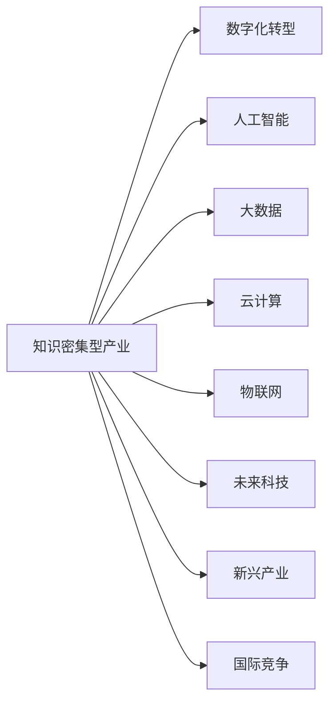

                 

# 知识密集型产业的发展趋势

> 关键词：知识密集型产业,人工智能,大数据,云计算,物联网,未来科技,新兴产业,智能制造,数字化转型

## 1. 背景介绍

### 1.1 问题由来

随着全球经济的发展，知识密集型产业（Knowledge-Intensive Industries, KII）逐渐成为推动经济发展和产业升级的重要力量。近年来，随着人工智能、大数据、云计算、物联网等新一代信息技术在各行业的深入应用，知识密集型产业也呈现出新的发展趋势。

知识密集型产业是指那些依赖于知识和技术的产业，主要包括软件与信息服务、科学研究与技术服务、金融保险服务业、医药与生物工程、文化创意产业等。这些产业通常具有高增值、高附加值、高知识密集度、高创新性等特点。

在当前全球经济不确定性增加、市场需求快速变化的背景下，知识密集型产业如何抓住数字化转型的机遇，实现可持续发展和转型升级，成为了亟待解决的问题。

### 1.2 问题核心关键点

1. **数字化转型**：知识密集型产业正在经历数字化转型，通过信息化手段提升产业效率、降低成本、创造新的价值。
2. **人工智能**：人工智能技术在知识密集型产业中的应用，极大提升了产业的智能化水平和创新能力。
3. **大数据与云计算**：大数据和云计算为知识密集型产业提供了强大的数据处理和存储能力，推动了数据分析和智能决策的发展。
4. **物联网**：物联网技术的普及，推动了智能制造、智慧城市、智能物流等应用场景的快速发展。
5. **未来科技**：量子计算、生物技术、脑机接口等前沿技术的发展，为知识密集型产业注入了新的动力。
6. **新兴产业**：新能源、空间技术、生物医药、环保技术等新兴产业的崛起，为知识密集型产业带来了新的增长点。
7. **国际竞争**：在全球经济一体化背景下，知识密集型产业面临着来自其他国家和地区的激烈竞争。

这些关键点共同构成了知识密集型产业发展的复杂图景，对其未来趋势的理解和把握具有重要意义。

## 2. 核心概念与联系

### 2.1 核心概念概述

为更好地理解知识密集型产业的发展趋势，本节将介绍几个密切相关的核心概念：

- **知识密集型产业**：依赖知识和技术的产业，包括软件与信息服务、科学研究与技术服务、金融保险服务业、医药与生物工程、文化创意产业等。
- **数字化转型**：利用信息技术和互联网技术改造传统产业，提升产业效率和创新能力的过程。
- **人工智能**：模拟人类智能的计算系统，包括机器学习、深度学习、自然语言处理、计算机视觉等技术。
- **大数据**：大规模、高速率、多源异构的数据集合，用于分析和挖掘知识、发现规律和洞察趋势。
- **云计算**：通过互联网提供动态可伸缩的计算资源和服务，支持各类应用和业务需求。
- **物联网**：通过互联网连接各种物品和设备，实现智能化管理和优化。
- **未来科技**：如量子计算、生物技术、脑机接口等新兴技术，推动前沿科学的进步和应用。
- **新兴产业**：如新能源、空间技术、生物医药、环保技术等，成为知识密集型产业的重要增长点。
- **国际竞争**：在全球化背景下，不同国家在知识密集型产业领域的竞争和合作。

这些概念之间的逻辑关系可以通过以下Mermaid流程图来展示：



这个流程图展示了知识密集型产业与其相关技术之间的内在联系：

1. 数字化转型是知识密集型产业的重要推动力。
2. 人工智能技术在各领域的应用，极大地提升了产业的智能化水平。
3. 大数据和云计算为知识密集型产业提供了强大的数据处理和存储能力。
4. 物联网技术推动了智能制造、智慧城市等应用场景的发展。
5. 未来科技的突破，为知识密集型产业注入了新的创新动力。
6. 新兴产业的崛起，为知识密集型产业提供了新的增长点。
7. 国际竞争背景下，不同国家和地区在知识密集型产业领域的竞争和合作。

这些概念共同构成了知识密集型产业发展的基本框架，理解这些核心概念有助于把握产业发展的脉络。

## 3. 核心算法原理 & 具体操作步骤

### 3.1 算法原理概述

知识密集型产业的发展趋势涉及到多方面的技术，包括人工智能、大数据、云计算、物联网等。本文将重点介绍基于这些技术的核心算法原理。

### 3.2 算法步骤详解

#### 3.2.1 人工智能在知识密集型产业中的应用

人工智能在知识密集型产业中的应用包括：

1. **自然语言处理(NLP)**：利用深度学习模型，实现文本数据的自动处理和分析，如文本分类、情感分析、机器翻译等。
2. **计算机视觉(CV)**：通过图像识别、目标检测等技术，实现自动化生产、质量检测、安防监控等应用。
3. **机器人技术**：利用机器人和智能设备，实现自动化操作、仓储管理、客户服务等。

#### 3.2.2 大数据在知识密集型产业中的应用

大数据在知识密集型产业中的应用包括：

1. **数据采集与存储**：通过传感器、互联网等手段，采集海量数据，利用云存储技术进行数据存储和管理。
2. **数据分析与挖掘**：利用机器学习、数据挖掘等技术，从海量数据中提取有价值的信息，发现规律和洞察趋势。
3. **智能决策**：利用数据驱动的智能决策系统，优化生产流程、降低成本、提升效率。

#### 3.2.3 云计算在知识密集型产业中的应用

云计算在知识密集型产业中的应用包括：

1. **云平台建设**：通过云计算平台，提供动态可伸缩的计算资源和服务，支持各类应用和业务需求。
2. **数据中心**：利用云计算技术，建设高效、可靠、安全的数据中心，保障数据安全和隐私。
3. **业务敏捷化**：利用云计算的灵活性和弹性，实现业务的敏捷化部署和扩展。

#### 3.2.4 物联网在知识密集型产业中的应用

物联网在知识密集型产业中的应用包括：

1. **智能制造**：通过物联网技术，实现设备互联、数据采集、生产监控、质量控制等。
2. **智慧城市**：通过物联网技术，实现城市管理、交通管理、公共安全、环境保护等。
3. **智能物流**：通过物联网技术，实现货物跟踪、运输监控、库存管理、配送优化等。

### 3.3 算法优缺点

#### 3.3.1 人工智能的优缺点

**优点**：
1. **高效智能化**：通过深度学习模型，实现高效智能化的处理和分析。
2. **广泛应用**：广泛应用于自然语言处理、计算机视觉、机器人技术等多个领域。
3. **创新驱动**：推动产业创新，创造新的价值和应用场景。

**缺点**：
1. **高成本**：需要大量的硬件资源和专业知识，成本较高。
2. **数据依赖**：依赖大量标注数据进行训练，数据质量和数量对模型效果有很大影响。
3. **模型可解释性不足**：复杂的深度学习模型难以解释其内部机制和决策过程。

#### 3.3.2 大数据的优缺点

**优点**：
1. **海量数据**：能够处理海量数据，发现数据中的规律和趋势。
2. **全面性**：涵盖各种数据源，全面反映业务需求。
3. **灵活性**：能够适应多变的业务需求，实现灵活调整和优化。

**缺点**：
1. **数据质量**：数据质量对分析结果有很大影响，需要数据清洗和预处理。
2. **计算资源**：需要强大的计算资源进行数据分析和挖掘。
3. **隐私问题**：数据隐私和安全问题需要特别注意。

#### 3.3.3 云计算的优缺点

**优点**：
1. **弹性伸缩**：能够根据业务需求动态调整计算资源，实现弹性伸缩。
2. **成本效益**：按需使用，降低固定成本和硬件资源投入。
3. **服务可靠**：提供高可靠性和高可用性的服务，保障业务稳定运行。

**缺点**：
1. **网络延迟**：依赖网络通信，网络延迟可能影响性能。
2. **安全风险**：需要采取安全措施，防范数据泄露和攻击。
3. **数据迁移**：需要数据迁移和迁移成本。

#### 3.3.4 物联网的优缺点

**优点**：
1. **实时监控**：能够实时监控生产过程和设备状态，实现及时干预和调整。
2. **数据融合**：能够实现多源异构数据的融合和共享。
3. **智能决策**：能够实现智能决策和优化，提升生产效率。

**缺点**：
1. **网络延迟**：依赖网络通信，网络延迟可能影响性能。
2. **设备成本**：需要大量的传感器和设备，成本较高。
3. **数据安全**：需要采取安全措施，防范数据泄露和攻击。

### 3.4 算法应用领域

#### 3.4.1 人工智能在知识密集型产业中的应用领域

1. **医疗健康**：利用自然语言处理技术，实现电子病历的自动化处理和分析，提升医疗服务的智能化水平。
2. **金融保险**：利用机器学习技术，实现风险评估和智能投顾，提高金融服务的精准度和效率。
3. **教育培训**：利用自然语言处理技术，实现智能教学和评估，提升教育效果和效率。
4. **智能制造**：利用计算机视觉和机器人技术，实现自动化生产、质量检测和维护。
5. **智慧城市**：利用物联网和大数据技术，实现城市管理和智能监控，提升城市治理水平。

#### 3.4.2 大数据在知识密集型产业中的应用领域

1. **电子商务**：利用大数据分析，实现精准营销和个性化推荐，提升用户体验和销售转化率。
2. **物流运输**：利用大数据分析，实现路线优化、货物跟踪和配送优化，提升物流效率和客户满意度。
3. **能源管理**：利用大数据分析，实现能源消耗监测和优化，降低能源成本和环境影响。
4. **金融风控**：利用大数据分析，实现风险识别和预测，提升风险控制能力。
5. **公共安全**：利用大数据分析，实现社会治安管理和公共安全预警，提升社会安全水平。

#### 3.4.3 云计算在知识密集型产业中的应用领域

1. **云计算平台**：提供动态可伸缩的计算资源和服务，支持各类应用和业务需求。
2. **云存储**：提供高效、可靠、安全的数据存储和管理，保障数据安全和隐私。
3. **云服务**：提供多种云服务，如云数据库、云安全、云监控等，支持业务敏捷化部署和扩展。

#### 3.4.4 物联网在知识密集型产业中的应用领域

1. **智能制造**：实现设备互联、数据采集、生产监控、质量控制等，提升生产效率和质量。
2. **智慧城市**：实现城市管理、交通管理、公共安全、环境保护等，提升城市治理水平。
3. **智能物流**：实现货物跟踪、运输监控、库存管理、配送优化等，提升物流效率和客户满意度。
4. **智能家居**：实现家居设备互联和智能化管理，提升家居生活品质。
5. **智能医疗**：实现远程医疗、健康监测、智能诊断等，提升医疗服务水平。

## 4. 数学模型和公式 & 详细讲解 & 举例说明

### 4.1 数学模型构建

为了更好地理解知识密集型产业的发展趋势，本节将使用数学语言对相关技术进行严格的刻画。

记知识密集型产业的应用场景为 $S$，包括自然语言处理、计算机视觉、机器人技术、大数据分析、云计算平台、物联网技术等。应用场景的模型表示为 $S = \{NLP, CV, Robotics, BigData, Cloud, IoT\}$。

定义数据采集和存储模型的输入为 $D = \{x_i\}_{i=1}^N$，其中 $x_i$ 表示第 $i$ 次数据采集结果。数据处理模型的输出为 $y = \{y_i\}_{i=1}^N$，其中 $y_i$ 表示第 $i$ 次数据处理结果。

模型 $M$ 的输入为数据采集和存储模型的输出，输出为应用场景 $S$ 中的任务结果。模型 $M$ 的表示为 $M: D \rightarrow y$。

模型 $M$ 的损失函数为 $\mathcal{L}(M)$，表示模型在应用场景 $S$ 中的任务损失。损失函数可以表示为：

$$
\mathcal{L}(M) = \sum_{i=1}^N \ell(y_i, M(x_i))
$$

其中 $\ell(y_i, M(x_i))$ 表示任务 $i$ 的损失函数，根据不同的应用场景，可以采用不同的损失函数，如交叉熵损失、均方误差损失等。

模型的优化目标是最小化损失函数，即找到最优模型参数 $\theta$：

$$
\theta^* = \mathop{\arg\min}_{\theta} \mathcal{L}(M_{\theta})
$$

其中 $M_{\theta}$ 表示模型 $M$ 的参数化表示。

### 4.2 公式推导过程

以自然语言处理任务为例，推导模型的损失函数和优化目标。

假设模型 $M$ 为基于 Transformer 的神经网络模型，输入 $x_i$ 为文本序列，输出 $y_i$ 为文本的分类结果。模型的损失函数为交叉熵损失函数，表示为：

$$
\ell(y_i, M(x_i)) = -\sum_{j=1}^N y_{ij}\log(M_{\theta}(x_i)_j)
$$

其中 $y_{ij}$ 表示第 $i$ 个样本中第 $j$ 个类别的标签，$M_{\theta}(x_i)_j$ 表示模型预测第 $i$ 个样本属于第 $j$ 个类别的概率。

模型的优化目标是最小化交叉熵损失，即找到最优模型参数 $\theta$：

$$
\theta^* = \mathop{\arg\min}_{\theta} \mathcal{L}(M_{\theta}) = \mathop{\arg\min}_{\theta} -\sum_{i=1}^N \sum_{j=1}^N y_{ij}\log(M_{\theta}(x_i)_j)
$$

通过梯度下降等优化算法，模型参数 $\theta$ 不断更新，最小化损失函数 $\mathcal{L}(M_{\theta})$，直至收敛。

### 4.3 案例分析与讲解

以智能制造中的设备监控为例，分析模型在实际应用中的构建和优化。

假设生产设备的状态监测数据为 $x_i = (t_i, v_i, p_i)$，其中 $t_i$ 表示时间，$v_i$ 表示速度，$p_i$ 表示压力。模型的输入 $D$ 为设备监测数据的集合，输出 $y$ 为设备故障的概率。

模型 $M$ 采用多层感知器（MLP）结构，输入层为 $(x_i, t_i)$，隐藏层为 $(v_i, p_i)$，输出层为 $y$。模型的损失函数为二分类交叉熵损失，表示为：

$$
\ell(y_i, M(x_i)) = -y_i\log(M_{\theta}(x_i)) - (1-y_i)\log(1-M_{\theta}(x_i))
$$

模型的优化目标是最小化交叉熵损失，即找到最优模型参数 $\theta$：

$$
\theta^* = \mathop{\arg\min}_{\theta} \mathcal{L}(M_{\theta}) = \mathop{\arg\min}_{\theta} -\sum_{i=1}^N y_i\log(M_{\theta}(x_i)) - (1-y_i)\log(1-M_{\theta}(x_i))
$$

通过梯度下降等优化算法，模型参数 $\theta$ 不断更新，最小化损失函数 $\mathcal{L}(M_{\theta})$，直至收敛。

## 5. 项目实践：代码实例和详细解释说明

### 5.1 开发环境搭建

在进行项目实践前，我们需要准备好开发环境。以下是使用Python进行PyTorch开发的环境配置流程：

1. 安装Anaconda：从官网下载并安装Anaconda，用于创建独立的Python环境。

2. 创建并激活虚拟环境：
```bash
conda create -n pytorch-env python=3.8 
conda activate pytorch-env
```

3. 安装PyTorch：根据CUDA版本，从官网获取对应的安装命令。例如：
```bash
conda install pytorch torchvision torchaudio cudatoolkit=11.1 -c pytorch -c conda-forge
```

4. 安装TensorFlow：根据CUDA版本，从官网获取对应的安装命令。例如：
```bash
conda install tensorflow tensorflow-gpu=2.6 -c tf
```

5. 安装TensorBoard：
```bash
pip install tensorboard
```

6. 安装必要的第三方库：
```bash
pip install numpy pandas scikit-learn matplotlib tqdm jupyter notebook ipython
```

完成上述步骤后，即可在`pytorch-env`环境中开始项目实践。

### 5.2 源代码详细实现

下面我们以自然语言处理任务为例，给出使用PyTorch和Transformers库进行模型微调的PyTorch代码实现。

首先，定义数据处理函数：

```python
from transformers import BertTokenizer, BertForTokenClassification, AdamW
import torch
from torch.utils.data import DataLoader, Dataset
import numpy as np
import pandas as pd
from sklearn.metrics import classification_report

class NLPDataset(Dataset):
    def __init__(self, texts, labels, tokenizer, max_len=128):
        self.texts = texts
        self.labels = labels
        self.tokenizer = tokenizer
        self.max_len = max_len
        
    def __len__(self):
        return len(self.texts)
    
    def __getitem__(self, item):
        text = self.texts[item]
        label = self.labels[item]
        
        encoding = self.tokenizer(text, return_tensors='pt', max_length=self.max_len, padding='max_length', truncation=True)
        input_ids = encoding['input_ids'][0]
        attention_mask = encoding['attention_mask'][0]
        
        # 对label进行编码
        encoded_labels = [tag2id[label] for label in label]
        encoded_labels.extend([tag2id['O']] * (self.max_len - len(encoded_labels)))
        labels = torch.tensor(encoded_labels, dtype=torch.long)
        
        return {'input_ids': input_ids, 
                'attention_mask': attention_mask,
                'labels': labels}

# 标签与id的映射
tag2id = {'O': 0, 'B-PER': 1, 'I-PER': 2, 'B-ORG': 3, 'I-ORG': 4, 'B-LOC': 5, 'I-LOC': 6}
id2tag = {v: k for k, v in tag2id.items()}

# 创建dataset
tokenizer = BertTokenizer.from_pretrained('bert-base-cased')

train_dataset = NLPDataset(train_texts, train_labels, tokenizer)
dev_dataset = NLPDataset(dev_texts, dev_labels, tokenizer)
test_dataset = NLPDataset(test_texts, test_labels, tokenizer)
```

然后，定义模型和优化器：

```python
from transformers import BertForTokenClassification, AdamW

model = BertForTokenClassification.from_pretrained('bert-base-cased', num_labels=len(tag2id))

optimizer = AdamW(model.parameters(), lr=2e-5)
```

接着，定义训练和评估函数：

```python
from torch.utils.data import DataLoader
from tqdm import tqdm
from sklearn.metrics import classification_report

device = torch.device('cuda') if torch.cuda.is_available() else torch.device('cpu')
model.to(device)

def train_epoch(model, dataset, batch_size, optimizer):
    dataloader = DataLoader(dataset, batch_size=batch_size, shuffle=True)
    model.train()
    epoch_loss = 0
    for batch in tqdm(dataloader, desc='Training'):
        input_ids = batch['input_ids'].to(device)
        attention_mask = batch['attention_mask'].to(device)
        labels = batch['labels'].to(device)
        model.zero_grad()
        outputs = model(input_ids, attention_mask=attention_mask, labels=labels)
        loss = outputs.loss
        epoch_loss += loss.item()
        loss.backward()
        optimizer.step()
    return epoch_loss / len(dataloader)

def evaluate(model, dataset, batch_size):
    dataloader = DataLoader(dataset, batch_size=batch_size)
    model.eval()
    preds, labels = [], []
    with torch.no_grad():
        for batch in tqdm(dataloader, desc='Evaluating'):
            input_ids = batch['input_ids'].to(device)
            attention_mask = batch['attention_mask'].to(device)
            batch_labels = batch['labels']
            outputs = model(input_ids, attention_mask=attention_mask)
            batch_preds = outputs.logits.argmax(dim=2).to('cpu').tolist()
            batch_labels = batch_labels.to('cpu').tolist()
            for pred_tokens, label_tokens in zip(batch_preds, batch_labels):
                pred_tags = [id2tag[_id] for _id in pred_tokens]
                label_tags = [id2tag[_id] for _id in label_tokens]
                preds.append(pred_tags[:len(label_tags)])
                labels.append(label_tags)
                
    print(classification_report(labels, preds))
```

最后，启动训练流程并在测试集上评估：

```python
epochs = 5
batch_size = 16

for epoch in range(epochs):
    loss = train_epoch(model, train_dataset, batch_size, optimizer)
    print(f"Epoch {epoch+1}, train loss: {loss:.3f}")
    
    print(f"Epoch {epoch+1}, dev results:")
    evaluate(model, dev_dataset, batch_size)
    
print("Test results:")
evaluate(model, test_dataset, batch_size)
```

以上就是使用PyTorch和Transformers库进行自然语言处理任务微调的完整代码实现。可以看到，得益于Transformers库的强大封装，我们可以用相对简洁的代码完成BERT模型的加载和微调。

### 5.3 代码解读与分析

让我们再详细解读一下关键代码的实现细节：

**NLPDataset类**：
- `__init__`方法：初始化文本、标签、分词器等关键组件。
- `__len__`方法：返回数据集的样本数量。
- `__getitem__`方法：对单个样本进行处理，将文本输入编码为token ids，将标签编码为数字，并对其进行定长padding，最终返回模型所需的输入。

**tag2id和id2tag字典**：
- 定义了标签与数字id之间的映射关系，用于将token-wise的预测结果解码回真实的标签。

**训练和评估函数**：
- 使用PyTorch的DataLoader对数据集进行批次化加载，供模型训练和推理使用。
- 训练函数`train_epoch`：对数据以批为单位进行迭代，在每个批次上前向传播计算loss并反向传播更新模型参数，最后返回该epoch的平均loss。
- 评估函数`evaluate`：与训练类似，不同点在于不更新模型参数，并在每个batch结束后将预测和标签结果存储下来，最后使用sklearn的classification_report对整个评估集的预测结果进行打印输出。

**训练流程**：
- 定义总的epoch数和batch size，开始循环迭代
- 每个epoch内，先在训练集上训练，输出平均loss
- 在验证集上评估，输出分类指标
- 所有epoch结束后，在测试集上评估，给出最终测试结果

可以看到，PyTorch配合Transformers库使得BERT微调的代码实现变得简洁高效。开发者可以将更多精力放在数据处理、模型改进等高层逻辑上，而不必过多关注底层的实现细节。

当然，工业级的系统实现还需考虑更多因素，如模型的保存和部署、超参数的自动搜索、更灵活的任务适配层等。但核心的微调范式基本与此类似。

## 6. 实际应用场景

### 6.1 智能制造

智能制造是知识密集型产业的重要应用场景，通过数字化转型和智能化改造，实现生产过程的自动化、智能化和优化。

1. **设备监控**：利用物联网技术，实现设备状态的实时监控和故障预测，提高生产效率和设备利用率。
2. **质量检测**：利用计算机视觉技术，实现产品的质量检测和缺陷识别，提升产品质量和生产稳定性。
3. **工艺优化**：利用数据分析和机器学习技术，实现生产工艺的优化和调整，提升生产效率和资源利用率。
4. **供应链管理**：利用物联网和大数据技术，实现供应链的透明化、可视化管理，优化供应链效率。
5. **智慧工厂**：利用人工智能和物联网技术，实现全流程的智能化管理，提升生产效率和客户满意度。

### 6.2 智慧城市

智慧城市是知识密集型产业的另一个重要应用场景，通过数字化转型和智能化改造，实现城市管理的优化和提升。

1. **智能交通**：利用物联网和大数据技术，实现交通流量监控、交通信号优化，提升交通效率和安全性。
2. **智慧安防**：利用物联网和大数据技术，实现城市安防监控、公共安全预警，提升城市安全水平。
3. **智慧医疗**：利用人工智能和大数据技术，实现医疗数据共享、智能诊断，提升医疗服务水平。
4. **智慧环保**：利用物联网和大数据技术，实现环境监测、污染预测，提升环境治理水平。
5. **智慧政务**：利用人工智能和大数据技术，实现政务服务的智能化、透明化管理，提升政府服务效率和质量。

### 6.3 金融科技

金融科技是知识密集型产业的重要组成部分，通过数字化转型和智能化改造，实现金融服务的创新和优化。

1. **智能投顾**：利用人工智能和大数据技术，实现精准的风险评估和投资建议，提升投资效率和效果。
2. **金融风控**：利用机器学习和大数据技术，实现风险识别和预测，提升风险控制能力。
3. **金融分析**：利用大数据和人工智能技术，实现市场分析和趋势预测，提升投资决策能力。
4. **智能客服**：利用自然语言处理和人工智能技术，实现智能客服和智能理财，提升客户体验和满意度。
5. **区块链金融**：利用区块链技术，实现金融交易的透明化、安全化，提升金融市场的信任度。

### 6.4 未来应用展望

伴随技术的发展，知识密集型产业的未来应用场景将更加广泛，具有以下趋势：

1. **多模态融合**：未来的知识密集型产业将融合多种数据模态，如文本、图像、语音、视频等，实现更加全面、深入的分析和应用。
2. **个性化服务**：未来的知识密集型产业将实现更加个性化、定制化的服务，通过数据挖掘和机器学习，实现用户需求的精准匹配和推荐。
3. **智能决策**：未来的知识密集型产业将实现更加智能化、高效化的决策，通过人工智能和大数据分析，实现决策的自动化和优化。
4. **新兴技术融合**：未来的知识密集型产业将融合新兴技术，如量子计算、脑机接口、生物技术等，推动前沿科学的进步和应用。
5. **国际合作**：未来的知识密集型产业将加强国际合作，通过数据共享和协同创新，推动全球科技发展。

## 7. 工具和资源推荐

### 7.1 学习资源推荐

为了帮助开发者系统掌握知识密集型产业的发展趋势，这里推荐一些优质的学习资源：

1. 《深度学习》书籍：Ian Goodfellow、Yoshua Bengio、Aaron Courville所著，全面介绍了深度学习的原理和应用。
2. 《人工智能：一种现代方法》书籍：Stuart Russell、Peter Norvig所著，介绍了人工智能的理论基础和应用。
3. 《TensorFlow实战》书籍：Manning Publications出版的官方指南，详细介绍了TensorFlow的使用和应用。
4. 《PyTorch官方文档》：PyTorch官方文档，提供了详细的API接口和示例代码，帮助开发者快速上手。
5. 《Transformer从原理到实践》系列博文：大模型技术专家撰写，深入浅出地介绍了Transformer原理、BERT模型、微调技术等前沿话题。
6. 《Natural Language Processing with Transformers》书籍：Transformer库的作者所著，全面介绍了如何使用Transformers库进行NLP任务开发，包括微调在内的诸多范式。

通过对这些资源的学习实践，相信你一定能够快速掌握知识密集型产业的发展趋势，并用于解决实际的NLP问题。

### 7.2 开发工具推荐

高效的开发离不开优秀的工具支持。以下是几款用于知识密集型产业开发的常用工具：

1. PyTorch：基于Python的开源深度学习框架，灵活动态的计算图，适合快速迭代研究。大部分预训练语言模型都有PyTorch版本的实现。
2. TensorFlow：由Google主导开发的开源深度学习框架，生产部署方便，适合大规模工程应用。同样有丰富的预训练语言模型资源。
3. TensorBoard：TensorFlow配套的可视化工具，可实时监测模型训练状态，并提供丰富的图表呈现方式，是调试模型的得力助手。
4.Weights & Biases：模型训练的实验跟踪工具，可以记录和可视化模型训练过程中的各项指标，方便对比和调优。与主流深度学习框架无缝集成。
5. Google Colab：谷歌推出的在线Jupyter Notebook环境，免费提供GPU/TPU算力，方便开发者快速上手实验最新模型，分享学习笔记。

合理利用这些工具，可以显著提升知识密集型产业的开发效率，加快创新迭代的步伐。

### 7.3 相关论文推荐

知识密集型产业的发展离不开学界的持续研究。以下是几篇奠基性的相关论文，推荐阅读：

1. Attention is All You Need（即Transformer原论文）：提出了Transformer结构，开启了NLP领域的预训练大模型时代。
2. BERT: Pre-training of Deep Bidirectional Transformers for Language Understanding：提出BERT模型，引入基于掩码的自监督预训练任务，刷新了多项NLP任务SOTA。
3. Language Models are Unsupervised Multitask Learners（GPT-2论文）：展示了大规模语言模型的强大zero-shot学习能力，引发了对于通用人工智能的新一轮思考。
4. Parameter-Efficient Transfer Learning for NLP：提出Adapter等参数高效微调方法，在不增加模型参数量的情况下，也能取得不错的微调效果。
5. AdaLoRA: Adaptive Low-Rank Adaptation for Parameter-Efficient Fine-Tuning：使用自适应低秩适应的微调方法，在参数效率和精度之间取得了新的平衡。
6. Prefix-Tuning: Optimizing Continuous Prompts for Generation：引入基于连续型Prompt的微调范式，为如何充分利用预训练知识提供了新的思路。

这些论文代表了大语言模型微调技术的发展脉络。通过学习这些前沿成果，可以帮助研究者把握学科前进方向，激发更多的创新灵感。

## 8. 总结：未来发展趋势与挑战

### 8.1 研究成果总结

本文对知识密集型产业的发展趋势进行了全面系统的介绍。首先阐述了知识密集型产业的现状和背景，明确了知识密集型产业在经济社会发展中的重要地位。其次，从原理到实践，详细讲解了人工智能、大数据、云计算、物联网等核心技术在知识密集型产业中的应用。同时，本文还广泛探讨了知识密集型产业在智能制造、智慧城市、金融科技等领域的实际应用，展示了知识密集型产业的广阔前景。最后，本文精选了知识密集型产业的学习资源、开发工具和相关论文，力求为开发者提供全方位的技术指引。

通过本文的系统梳理，可以看到，知识密集型产业正在经历数字化转型，通过人工智能、大数据、云计算、物联网等技术的应用，不断提升产业效率和创新能力。这些技术的融合，推动了知识密集型产业的发展，也为各行业带来了新的增长点和发展机遇。

### 8.2 未来发展趋势

展望未来，知识密集型产业的发展趋势将更加多元化和智能化。

1. **数字化转型深入推进**：数字化转型将成为知识密集型产业的主流发展方向，通过数字化、网络化、智能化改造，提升产业效率和创新能力。
2. **人工智能应用广泛**：人工智能技术将广泛应用于各个领域，提升产业的智能化水平和创新能力。
3. **大数据和云计算普及**：大数据和云计算技术将成为知识密集型产业的基础设施，提供强大的数据处理和计算能力。
4. **物联网技术普及**：物联网技术将实现设备的互联和智能化管理，推动智能制造、智慧城市等应用场景的发展。
5. **未来科技突破**：量子计算、脑机接口、生物技术等前沿技术的发展，将为知识密集型产业带来新的创新动力。
6. **新兴产业崛起**：新能源、空间技术、生物医药、环保技术等新兴产业的崛起，将成为知识密集型产业的新增长点。

以上趋势凸显了知识密集型产业的发展方向，有助于产业从业者把握行业发展趋势，制定科学的发展战略。

### 8.3 面临的挑战

尽管知识密集型产业在数字化转型中取得了显著进展，但仍面临诸多挑战：

1. **数据安全和隐私**：大规模数据的采集和处理，带来了数据安全和隐私保护的问题，需要采取严格的措施保障数据安全。
2. **技术标准化**：各行业的技术标准和规范不一致，增加了技术应用的复杂性和难度。
3. **跨领域协作**：不同行业间的协作和数据共享不足，限制了技术的融合和应用。
4. **技术迭代快速**：技术迭代快速，需要不断跟进最新技术进展，提高自身技术水平。
5. **人才短缺**：高技能人才短缺，限制了技术的推广和应用。
6. **国际竞争激烈**：国际竞争日益激烈，需要不断提升自身竞争力。

这些挑战需要产业从业者共同面对和解决，推动知识密集型产业的健康发展。

### 8.4 研究展望

未来，知识密集型产业需要在以下方面加强研究：

1. **数据安全和隐私保护**：加强数据安全和隐私保护技术的研究和应用，确保数据的安全性和隐私性。
2. **技术标准化**：推动技术标准和规范的制定和统一，促进技术的广泛应用。
3. **跨领域协作**：加强不同行业间的协作和数据共享，促进技术的融合和创新。
4. **技术迭代加速**：加大技术创新力度，提高技术迭代速度，保持技术领先优势。
5. **人才培养**：加强高技能人才培养，提高技术应用水平。
6. **国际合作**：加强国际合作，推动全球科技发展，提升自身竞争力。

通过这些研究和创新，知识密集型产业将实现更广泛的融合和应用，为全球经济社会发展带来新的动力和机遇。

## 9. 附录：常见问题与解答

**Q1：知识密集型产业的数字化转型具体指什么？**

A: 知识密集型产业的数字化转型，是指利用信息技术和互联网技术，改造传统产业，提升产业效率和创新能力的过程。具体包括数据的采集、存储、处理、分析和应用，以及智能决策系统的建设，推动产业的数字化、网络化和智能化。

**Q2：人工智能在知识密集型产业中如何应用？**

A: 人工智能在知识密集型产业中主要应用于以下几个方面：
1. **自然语言处理(NLP)**：利用深度学习模型，实现文本数据的自动处理和分析，如文本分类、情感分析、机器翻译等。
2. **计算机视觉(CV)**：通过图像识别、目标检测等技术，实现自动化生产、质量检测、安防监控等。
3. **机器人技术**：利用机器人和智能设备，实现自动化操作、仓储管理、客户服务等。

**Q3：大数据在知识密集型产业中的应用有哪些？**

A: 大数据在知识密集型产业中的应用包括：
1. **数据采集与存储**：通过传感器、互联网等手段，采集海量数据，利用云存储技术进行数据存储和管理。
2. **数据分析与挖掘**：利用机器学习、数据挖掘等技术，从海量数据中提取有价值的信息，发现规律和洞察趋势。
3. **智能决策**：利用数据驱动的智能决策系统，优化生产流程、降低成本、提升效率。

**Q4：云计算在知识密集型产业中的应用有哪些？**

A: 云计算在知识密集型产业中的应用包括：
1. **云平台建设**：提供动态可伸缩的计算资源和服务，支持各类应用和业务需求。
2. **云存储**：提供高效、可靠、安全的数据存储和管理，保障数据安全和隐私。
3. **云服务**：提供多种云服务，如云数据库、云安全、云监控等，支持业务敏捷化部署和扩展。

**Q5：物联网在知识密集型产业中的应用有哪些？**

A: 物联网在知识密集型产业中的应用包括：
1. **智能制造**：实现设备互联、数据采集、生产监控、质量控制等，提升生产效率和质量。
2. **智慧城市**：实现城市管理、交通管理、公共安全、环境保护等，提升城市治理水平。
3. **智能物流**：实现货物跟踪、运输监控、库存管理、配送优化等，提升物流效率和客户满意度。
4. **智能家居**：实现家居设备互联和智能化管理，提升家居生活品质。
5. **智能医疗**：实现远程医疗、健康监测、智能诊断等，提升医疗服务水平。

**Q6：知识密集型产业的未来发展趋势有哪些？**

A: 知识密集型产业的未来发展趋势包括：
1. **多模态融合**：融合多种数据模态，如文本、图像、语音、视频等，实现更加全面、深入的分析和应用。
2. **个性化服务**：实现更加个性化、定制化的服务，通过数据挖掘和机器学习，实现用户需求的精准匹配和推荐。
3. **智能决策**：实现更加智能化、高效化的决策，通过人工智能和大数据分析，实现决策的自动化和优化。
4. **新兴技术融合**：融合新兴技术，如量子计算、脑机接口、生物技术等，推动前沿科学的进步和应用。
5. **国际合作**：加强国际合作，推动全球科技发展。

**Q7：知识密集型产业面临的主要挑战有哪些？**

A: 知识密集型产业面临的主要挑战包括：
1. **数据安全和隐私**：大规模数据的采集和处理，带来了数据安全和隐私保护的问题，需要采取严格的措施保障数据安全。
2. **技术标准化**：各行业的技术标准和规范不一致，增加了技术应用的复杂性和难度。
3. **跨领域协作**：不同行业间的协作和数据共享不足，限制了技术的融合和应用。
4. **技术迭代快速**：技术迭代快速，需要不断跟进最新技术进展，提高自身技术水平。
5. **人才短缺**：高技能人才短缺，限制了技术的推广和应用。
6. **国际竞争激烈**：国际竞争日益激烈，需要不断提升自身竞争力。

通过以上回答，相信你对知识密集型产业的发展趋势有了更全面的了解，并能够更好地应用于实际工作中。

---

作者：禅与计算机程序设计艺术 / Zen and the Art of Computer Programming

