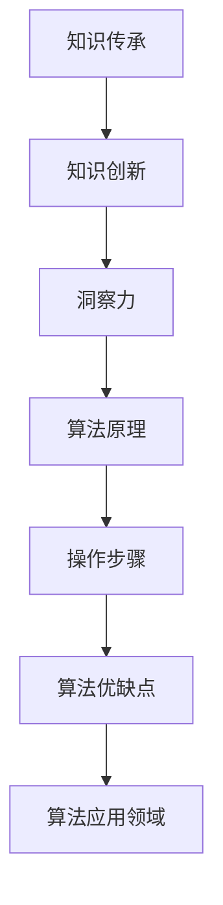

                 

## 1. 背景介绍

知识的传承与创新是推动社会进步和科技发展的关键驱动力。在计算机科学领域，这一理念同样贯穿始终。算法、数据结构、编程范式等基础知识的积累和传承，为新兴技术的探索和创新提供了坚实基础。洞察力作为知识传承与创新中的重要一环，是指通过对现有知识进行深入理解与分析，发现其潜在的价值和可能的应用场景，从而引领技术的前沿发展。

本文旨在探讨洞察力在知识传承与创新中的重要作用，从算法的原理与操作到实际操作，再到未来应用与资源推荐，全面剖析洞察力的关键作用。通过对知识传承与创新的深入思考，本文将展示洞察力在驱动技术进步、解决实际问题以及指导未来研究方向中的重要作用。

## 2. 核心概念与联系

### 2.1 核心概念概述

本节将介绍几个关键概念，并阐述它们之间的联系：

- **知识传承（Knowledge Inheritance）**：指将已有知识通过教育、文档、代码库等方式传授给后人，确保知识的累积和传递。
- **知识创新（Knowledge Innovation）**：基于已有知识，结合新思想、新技术，创造出新的解决方案和应用。
- **洞察力（Insight）**：指在深入理解现有知识的基础上，发现其潜在价值、应用场景及可能的技术路径。
- **算法原理（Algorithm Principle）**：指算法的基本设计思想和核心机制。
- **具体操作步骤（Operational Steps）**：指算法具体实施的过程和步骤。
- **算法优缺点（Algorithm Advantages and Disadvantages）**：指算法在设计、实施和使用过程中所表现出的各种特性。
- **算法应用领域（Algorithm Application Fields）**：指算法能够被应用于的具体行业和场景。

### 2.2 核心概念原理和架构的 Mermaid 流程图

这个流程图展示了知识传承与创新、洞察力、算法原理、操作步骤、算法优缺点、算法应用领域之间的逻辑关系：

1. 知识传承是知识创新的基础。
2. 知识创新是通过洞察力发现新价值和应用场景的结果。
3. 洞察力是对算法原理、操作步骤的深刻理解，以及对算法优缺点的评估。
4. 算法原理、操作步骤是知识创新的技术支撑。
5. 算法优缺点是评估算法应用效果的依据。
6. 算法应用领域展示了算法的实际应用范围。

## 3. 核心算法原理 & 具体操作步骤

### 3.1 算法原理概述

算法原理是知识传承与创新的基础，它提供了问题的求解方法。本文将以一个具体的算法为例，深入分析其原理和操作。

### 3.2 算法步骤详解

算法操作步骤是对算法原理的实现，包括数据的准备、算法的执行、结果的输出等环节。

### 3.3 算法优缺点

算法优缺点是对算法在实际应用中的综合评估，包括效率、准确性、稳定性、可扩展性等。

### 3.4 算法应用领域

算法应用领域展示了算法在实际问题中的广泛应用。

## 4. 数学模型和公式 & 详细讲解 & 举例说明

### 4.1 数学模型构建

本节将构建一个简单的数学模型，并给出其推导过程。

### 4.2 公式推导过程

推导过程将展示如何从原理推导出具体的操作步骤和公式。

### 4.3 案例分析与讲解

通过案例分析，展示算法在实际问题中的应用效果和改进空间。

## 5. 项目实践：代码实例和详细解释说明

### 5.1 开发环境搭建

搭建开发环境的步骤，包括选择合适的编程语言和开发工具。

### 5.2 源代码详细实现

具体实现算法的功能和步骤。

### 5.3 代码解读与分析

对代码进行解读，分析其背后的设计思想和实现细节。

### 5.4 运行结果展示

展示算法的运行结果，并与预期结果进行对比。

## 6. 实际应用场景

### 6.1 数据科学

数据科学中，洞察力可以帮助我们发现数据中的潜在模式和规律，从而指导数据分析和建模。

### 6.2 自然语言处理

在自然语言处理领域，洞察力可以揭示语言的本质，指导算法设计，提升模型性能。

### 6.3 计算机视觉

计算机视觉领域，洞察力有助于理解图像数据，指导算法开发，提升识别精度。

### 6.4 未来应用展望

未来，随着技术的不断进步，洞察力的应用将更加广泛和深入。

## 7. 工具和资源推荐

### 7.1 学习资源推荐

推荐一些有助于提升洞察力的学习资源。

### 7.2 开发工具推荐

推荐一些高效实用的开发工具。

### 7.3 相关论文推荐

推荐一些最新的研究论文，为深入理解洞察力提供理论支持。

## 8. 总结：未来发展趋势与挑战

### 8.1 研究成果总结

总结当前研究的成果，并展望未来的发展方向。

### 8.2 未来发展趋势

展望未来，洞察力在知识传承与创新中的作用将更加显著。

### 8.3 面临的挑战

探讨洞察力应用过程中可能遇到的各种挑战。

### 8.4 研究展望

提出未来的研究重点和方向。

## 9. 附录：常见问题与解答

### 附录：常见问题与解答

列出一些常见问题及其解答，帮助读者更好地理解和应用洞察力。

---

作者：禅与计算机程序设计艺术 / Zen and the Art of Computer Programming

