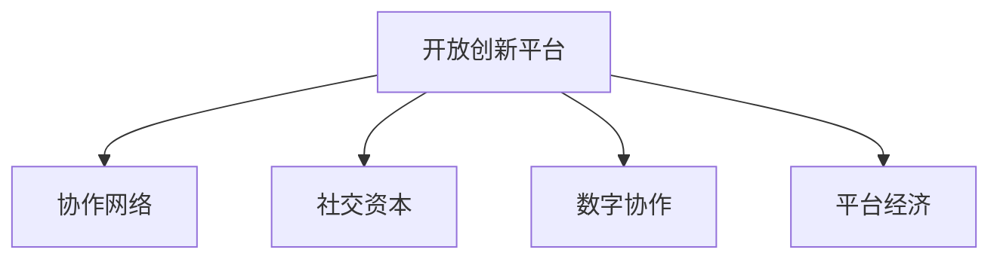

                 

# 知识的共创：开放创新平台的力量

> 关键词：知识共创, 开放创新平台, 协作网络, 社交资本, 数字协作, 平台经济

## 1. 背景介绍

### 1.1 问题由来
在信息爆炸的时代，知识的获取和传播方式发生了翻天覆地的变化。传统的知识获取渠道，如书籍、学术论文，虽然仍然发挥着重要作用，但面对海量且快速变化的信息，其效率和灵活性显得捉襟见肘。与此同时，互联网的普及和社交媒体的兴起，使得知识的获取和传播更加高效和便捷，人们可以通过网络随时随地获取和分享知识，甚至直接参与到知识的创造和传播过程中。

在这样一个背景下，知识共创（Co-Creation of Knowledge）成为一种新的趋势。通过开放创新平台（Open Innovation Platforms），人们可以突破时空限制，借助协作网络（Collaboration Networks）和数字协作工具，更加高效地进行知识共创。这种模式的兴起，不仅仅改变了知识的传播和获取方式，更推动了企业、科研机构和个人之间的深度合作，激发了大量的创新活动。

### 1.2 问题核心关键点
知识共创的核心在于，通过开放的协作平台，汇集来自不同背景、具有不同专业技能的人，共同参与到知识的创造和传播过程中。这种模式不仅提升了知识的产出效率，还能促进跨学科、跨领域的知识融合，推动技术创新和应用革新。

开放创新平台是实现知识共创的重要工具。它提供了一个在线环境，使参与者可以自由交流、协作，共享资源和信息。这些平台通常具备以下几个特点：

- **开放性**：平台向所有用户开放，任何人都可以在上面分享知识和获取知识。
- **协作性**：平台鼓励用户之间的互动，通过评论、讨论等方式进行知识交流。
- **数字性**：平台主要通过数字形式进行信息的存储和传播，便于检索、分享和利用。
- **社区性**：平台通常形成了一个基于共同兴趣和目标的社区，用户可以在社区中找到志同道合的伙伴，共同进行项目或问题的解决。

### 1.3 问题研究意义
研究开放创新平台在知识共创中的作用，对于推动知识创新、促进社会经济的发展具有重要意义：

1. **提升知识产出效率**：通过汇聚多方智慧，快速集成和迭代知识，加速创新过程。
2. **促进跨界融合**：突破学科和领域的界限，促进知识的多样化融合，推动跨学科创新。
3. **增强社会协作**：提供了一个协作的网络环境，使得不同背景的人可以相互学习、共同成长。
4. **优化资源配置**：通过平台匹配最优的资源和能力，提高资源利用效率，降低创新成本。
5. **培育创新生态**：形成了一个生态系统，持续推动新知识、新技术的涌现。

本文将系统介绍开放创新平台在知识共创中的应用，探讨其原理和操作方法，提供实际案例和代码示例，展望未来发展趋势和面临的挑战。

## 2. 核心概念与联系

### 2.1 核心概念概述

为更好地理解开放创新平台在知识共创中的应用，本节将介绍几个密切相关的核心概念：

- **开放创新平台**：提供开放式协作环境，使用户可以自由交流、共享和创造知识的平台。
- **协作网络**：指通过开放创新平台形成的网络结构，用户之间通过评论、讨论等方式进行互动。
- **社交资本**：指用户通过平台建立的信任和关系网络，有助于知识的传播和创新。
- **数字协作**：指通过数字工具实现的知识交流和合作，如云文档、在线讨论、代码库等。
- **平台经济**：指以开放创新平台为载体的经济模式，通过知识共享和协作推动经济增长。

这些概念之间的逻辑关系可以通过以下Mermaid流程图来展示：



这个流程图展示了好开放创新平台的核心概念及其之间的关系：

1. 开放创新平台通过提供协作环境，促进用户之间的互动和合作，形成协作网络。
2. 协作网络中的用户通过互动，建立起信任和关系网络，形成社交资本。
3. 数字协作工具使得信息传递和知识共享变得更加高效和便捷。
4. 平台经济通过汇聚和利用知识，推动经济的持续增长。

## 3. 核心算法原理 & 具体操作步骤
### 3.1 算法原理概述

开放创新平台的知识共创过程，本质上是一种基于网络的协作行为。它通过协作网络中的用户互动，形成知识的创造、传播和利用。在平台上的知识共创过程可以分为以下几个步骤：

1. **知识贡献**：用户将自己的知识、经验、研究成果等贡献到平台上，形成知识库。
2. **知识传播**：用户通过评论、讨论、分享等方式，将知识传播给其他用户。
3. **知识融合**：用户之间通过互动，交流不同的知识视角和见解，形成新的知识。
4. **知识应用**：用户将知识应用到实际问题解决中，推动技术创新和应用。

这些步骤可以通过以下公式来表示：

- **知识贡献**：
  $$
  C = \sum_{i=1}^{n} K_i
  $$
  其中 $K_i$ 为第 $i$ 个用户贡献的知识，$n$ 为平台上的用户总数。

- **知识传播**：
  $$
  P = \sum_{i=1}^{n} \sum_{j=1}^{m} I_{i,j}
  $$
  其中 $I_{i,j}$ 表示用户 $i$ 和用户 $j$ 之间的互动次数，$m$ 为平台上的用户总数。

- **知识融合**：
  $$
  F = C + P - \sum_{i=1}^{n} K_i
  $$
  其中 $F$ 为通过互动形成的新知识。

- **知识应用**：
  $$
  A = \sum_{i=1}^{n} A_i
  $$
  其中 $A_i$ 为第 $i$ 个用户应用的知识。

### 3.2 算法步骤详解

开放创新平台上的知识共创过程可以分为以下几个关键步骤：

**Step 1: 准备开放创新平台**
- 选择合适的开放创新平台，如GitHub、Stack Overflow、CSDN等。
- 创建用户账号，注册并参与到平台中的知识交流中。

**Step 2: 贡献和传播知识**
- 在平台上发布自己的文章、代码、项目等，形成知识库。
- 通过评论、讨论、分享等方式，将自己的知识传播给其他用户。

**Step 3: 互动和融合知识**
- 积极参与平台上的讨论和项目，与他人交流不同的知识视角和见解。
- 基于他人的贡献，形成新的知识，如改进代码、撰写综述等。

**Step 4: 应用和验证知识**
- 将新知识应用到实际问题解决中，推动技术创新和应用。
- 通过其他用户反馈和验证，不断优化和完善自己的知识。

**Step 5: 持续优化平台**
- 反馈平台使用过程中的问题和建议，帮助平台持续优化。
- 参与到平台的社区建设和管理中，推动平台的健康发展。

### 3.3 算法优缺点

开放创新平台在知识共创中的作用，具有以下优点：

1. **开放性和包容性**：任何人都可以在平台上贡献和获取知识，不受身份、背景限制。
2. **多样化和跨界性**：用户来自不同背景、不同领域，带来了多样化的知识和视角。
3. **效率和速度**：通过平台的互动和传播，知识传播效率大大提升。
4. **持续性和更新性**：平台不断更新和补充知识库，保持知识的最新状态。

同时，这种模式也存在一些局限：

1. **质量参差不齐**：用户提交的内容质量不一，需要人工筛选和审核。
2. **虚假信息和噪声**：平台上的信息量巨大，存在虚假信息和噪声，增加了知识筛选的难度。
3. **社会资本依赖**：平台的社会资本和互动质量直接影响知识的传播和利用。
4. **隐私和版权问题**：用户贡献的知识可能涉及隐私和版权问题，需要明确规定和保护。

### 3.4 算法应用领域

开放创新平台在知识共创中的应用非常广泛，以下是一些主要领域：

1. **科学研究**：如arXiv、ResearchGate等平台，促进科学研究的共享和交流。
2. **软件开发**：如GitHub、GitLab等平台，通过代码共享和协作，推动软件项目的开发和迭代。
3. **教育**：如Coursera、edX等平台，提供丰富的在线课程和资源，促进知识的学习和传播。
4. **设计**：如Behance、Dribbble等平台，展示和交流设计作品和创意。
5. **创意写作**：如Wattpad、Medium等平台，分享和交流小说、博客等内容。
6. **开源社区**：如Open Source Initiative、SourceForge等平台，推动开源软件的协作开发和应用。

## 4. 数学模型和公式 & 详细讲解  
### 4.1 数学模型构建

开放创新平台的知识共创过程可以抽象为图网络模型（Graph Network Model）。知识共创的过程可以看作是一个网络中节点之间的交互和传播。

假设有 $n$ 个用户在平台上活跃，每两个用户之间都有一个边相连，表示它们之间的互动。我们用图 $G=(V,E)$ 来表示这个网络，其中 $V$ 是节点集合，$E$ 是边集合。每个用户可以看作一个节点，每条边表示用户之间的互动。

在知识共创过程中，用户贡献和传播的知识量可以用矩阵 $K$ 来表示，其中 $K_{i,j}$ 表示用户 $i$ 和用户 $j$ 之间互动次数，贡献的知识量。

用户之间的互动可以用邻接矩阵 $A$ 来表示，其中 $A_{i,j}$ 表示用户 $i$ 和用户 $j$ 之间是否存在边。

用户贡献和传播的知识可以用向量 $C$ 和 $P$ 来表示，其中 $C_i$ 表示用户 $i$ 贡献的知识量，$P_{i,j}$ 表示用户 $i$ 和用户 $j$ 之间互动传播的知识量。

### 4.2 公式推导过程

在图网络模型中，知识共创的过程可以表示为一个迭代的过程。每个用户 $i$ 的知识贡献和传播量可以用以下公式计算：

$$
C_i^{(t+1)} = \sum_{j=1}^{n} A_{i,j} C_j^{(t)} + \sum_{j=1}^{n} P_{i,j} K_j^{(t)}
$$

$$
P_{i,j}^{(t+1)} = \sum_{k=1}^{n} A_{i,k} P_{k,j}^{(t)} + \sum_{k=1}^{n} A_{j,k} P_{i,k}^{(t)}
$$

其中 $t$ 表示迭代次数，$C_i^{(t)}$ 和 $P_{i,j}^{(t)}$ 分别表示在第 $t$ 次迭代中用户 $i$ 的知识贡献和传播量。

知识融合的过程可以表示为：

$$
F^{(t+1)} = C^{(t)} + P^{(t)} - \sum_{i=1}^{n} C_i^{(t)}
$$

其中 $F^{(t)}$ 表示在第 $t$ 次迭代中形成的新知识。

知识应用的过程可以表示为：

$$
A^{(t+1)} = \sum_{i=1}^{n} A_i^{(t)}
$$

其中 $A_i^{(t)}$ 表示在第 $t$ 次迭代中用户 $i$ 应用的知识量。

通过迭代计算，平台上的知识共创过程可以不断进行，新的知识被不断地生成和传播，推动知识的更新和应用。

### 4.3 案例分析与讲解

以GitHub为例，分析其如何利用开放创新平台推动知识共创：

- **知识贡献**：用户通过提交代码、撰写文档、编写教程等，将自己的知识和经验贡献到平台上。
- **知识传播**：用户通过评论、讨论、star、fork等方式，将自己的知识传播给其他用户。
- **知识融合**：用户之间通过互动，交流不同的代码实现、技术栈和设计思路，形成新的项目和功能。
- **知识应用**：用户通过参与开源项目和社区活动，应用新知识解决实际问题，推动技术创新和应用。

GitHub的成功在于其开放性和社区的活跃度，吸引了大量的开发者参与其中。平台上的代码共享和协作，推动了开源软件的快速发展和普及。

## 5. 项目实践：代码实例和详细解释说明
### 5.1 开发环境搭建

在进行知识共创平台开发前，我们需要准备好开发环境。以下是使用Python进行Flask开发的环境配置流程：

1. 安装Anaconda：从官网下载并安装Anaconda，用于创建独立的Python环境。

2. 创建并激活虚拟环境：
```bash
conda create -n flask-env python=3.8 
conda activate flask-env
```

3. 安装Flask：
```bash
pip install flask
```

4. 安装Flask-RESTful：用于构建RESTful风格的API。
```bash
pip install flask-restful
```

5. 安装Flask-SQLAlchemy：用于数据库交互。
```bash
pip install flask-sqlalchemy
```

6. 安装SQLite：
```bash
pip install sqlite3
```

7. 安装SQLAlchemy：
```bash
pip install sqlalchemy
```

完成上述步骤后，即可在`flask-env`环境中开始项目开发。

### 5.2 源代码详细实现

这里我们以一个简单的开源社区为例，展示如何使用Flask构建知识共创平台。

首先，定义SQLite数据库连接：

```python
from flask_sqlalchemy import SQLAlchemy
from sqlalchemy import create_engine

engine = create_engine('sqlite:///community.db')
db = SQLAlchemy(engine)
```

然后，定义知识贡献和传播的数据模型：

```python
class Knowledge(db.Model):
    id = db.Column(db.Integer, primary_key=True)
    title = db.Column(db.String(255))
    description = db.Column(db.Text)
    contributor_id = db.Column(db.Integer, db.ForeignKey('user.id'))
    created_at = db.Column(db.DateTime, default=datetime.datetime.utcnow)

class Interaction(db.Model):
    id = db.Column(db.Integer, primary_key=True)
    user_id = db.Column(db.Integer, db.ForeignKey('user.id'))
    knowledge_id = db.Column(db.Integer, db.ForeignKey('knowledge.id'))
    created_at = db.Column(db.DateTime, default=datetime.datetime.utcnow)
```

接着，定义用户的数据模型：

```python
class User(db.Model):
    id = db.Column(db.Integer, primary_key=True)
    username = db.Column(db.String(255), unique=True)
    email = db.Column(db.String(255))
    password = db.Column(db.String(255))
    created_at = db.Column(db.DateTime, default=datetime.datetime.utcnow)
```

然后，定义Flask应用的蓝图：

```python
from flask import Flask, request, jsonify

app = Flask(__name__)

@app.route('/knowledge', methods=['POST'])
def create_knowledge():
    title = request.form.get('title')
    description = request.form.get('description')
    contributor_id = request.form.get('contributor_id')
    knowledge = Knowledge(title=title, description=description, contributor_id=contributor_id)
    db.session.add(knowledge)
    db.session.commit()
    return jsonify({'message': 'Knowledge created successfully'}), 201

@app.route('/knowledge/<int:id>', methods=['GET'])
def get_knowledge(id):
    knowledge = Knowledge.query.get(id)
    if not knowledge:
        return jsonify({'message': 'Knowledge not found'}), 404
    return jsonify({'knowledge': {'title': knowledge.title, 'description': knowledge.description}})

@app.route('/interaction', methods=['POST'])
def create_interaction():
    user_id = request.form.get('user_id')
    knowledge_id = request.form.get('knowledge_id')
    interaction = Interaction(user_id=user_id, knowledge_id=knowledge_id)
    db.session.add(interaction)
    db.session.commit()
    return jsonify({'message': 'Interaction created successfully'}), 201

@app.route('/knowledge', methods=['GET'])
def get_all_knowledge():
    knowledge = Knowledge.query.all()
    knowledge_list = [{'id': knowledge.id, 'title': knowledge.title, 'description': knowledge.description} for knowledge in knowledge]
    return jsonify({'knowledge': knowledge_list})
```

最后，启动Flask应用：

```python
if __name__ == '__main__':
    app.run(debug=True)
```

以上就是使用Flask构建知识共创平台的完整代码实现。可以看到，借助Flask和SQLAlchemy，我们可以高效地实现知识贡献、传播和互动等功能，构建一个简单的知识共创平台。

### 5.3 代码解读与分析

让我们再详细解读一下关键代码的实现细节：

**Knowledge类**：
- `__init__`方法：初始化知识的基本属性。
- `__repr__`方法：返回知识对象的字符串表示。

**Interaction类**：
- `__init__`方法：初始化交互的基本属性。
- `__repr__`方法：返回交互对象的字符串表示。

**User类**：
- `__init__`方法：初始化用户的基本属性。
- `__repr__`方法：返回用户对象的字符串表示。

**Flask应用**：
- `create_knowledge`方法：处理知识贡献的API请求，将知识保存到数据库。
- `get_knowledge`方法：处理获取知识详情的API请求，返回指定ID的知识信息。
- `create_interaction`方法：处理知识互动的API请求，记录用户对知识的互动信息。
- `get_all_knowledge`方法：处理获取所有知识的API请求，返回所有知识的信息。

通过这些代码，我们展示了如何使用Flask构建一个简单的知识共创平台，包含知识贡献、传播和互动等功能。当然，工业级的系统实现还需考虑更多因素，如用户认证、权限控制、数据同步等，但核心的功能实现思路基本与此类似。

## 6. 实际应用场景
### 6.1 智能办公平台

智能办公平台通过开放创新平台，打破了企业内部信息孤岛，实现知识的共享和利用。企业内部员工可以通过平台上传文档、分享经验，促进跨部门协作，提升工作效率。

在技术实现上，可以构建基于开放创新平台的办公系统，涵盖文档共享、任务分配、知识库、在线协作等功能。员工可以在平台上共享和获取文档、讨论项目问题、协作编写代码等，实现知识的实时传递和应用。

### 6.2 学术研究平台

学术研究平台通过开放创新平台，汇聚全球科研人员的智慧，加速科学研究的进展。研究者可以通过平台发布论文、共享数据、讨论研究方向，推动科学研究的交流和合作。

在技术实现上，可以构建基于开放创新平台的学术社区，涵盖论文发布、数据共享、研究项目、合作申请等功能。研究者可以在平台上发布自己的研究成果，获取其他研究者的反馈和建议，共同推进科学研究的深入。

### 6.3 在线教育平台

在线教育平台通过开放创新平台，提供丰富的学习资源和在线课程，促进知识的传播和学习。学习者可以通过平台获取知识、参加讨论、提交作业，提升自身的学习效果。

在技术实现上，可以构建基于开放创新平台的在线教育系统，涵盖课程发布、学习笔记、讨论区、作业提交等功能。学习者可以在平台上获取优质课程、参与讨论、提交作业，形成学习闭环，提升学习效果。

## 7. 工具和资源推荐
### 7.1 学习资源推荐

为了帮助开发者系统掌握开放创新平台的知识共创理论基础和实践技巧，这里推荐一些优质的学习资源：

1. 《Web开发实战》系列书籍：深入浅出地介绍了Web开发的各种技术和工具，适合初学者入门。
2. 《Python网络编程》课程：通过实战项目，学习使用Python进行网络编程，适合进阶学习。
3. 《Flask官方文档》：详细介绍了Flask框架的各个组件和功能，适合开发Flask应用。
4. 《SQLAlchemy官方文档》：详细介绍了SQLAlchemy的各个组件和功能，适合进行数据库交互。
5. 《Web应用安全指南》书籍：介绍了Web应用的常见安全问题和防御措施，适合提升开发安全意识。

通过对这些资源的学习实践，相信你一定能够快速掌握开放创新平台的知识共创原理和实现方法，构建高效、安全的知识共创系统。

### 7.2 开发工具推荐

高效的开发离不开优秀的工具支持。以下是几款用于知识共创平台开发的常用工具：

1. Flask：轻量级Web框架，简单易用，适合快速原型开发。
2. SQLite：轻量级关系型数据库，适合开发小规模知识共创平台。
3. SQLAlchemy：ORM框架，支持多种数据库，适合进行数据库交互。
4. Pycharm：Python IDE，功能强大，适合开发和调试Python应用。
5. Git：版本控制系统，支持代码版本管理和协作，适合开放创新平台的需求。
6. Jupyter Notebook：交互式编程环境，支持代码编写、数据可视化和实验报告，适合数据科学和机器学习项目。

合理利用这些工具，可以显著提升知识共创平台的开发效率，加快创新迭代的步伐。

### 7.3 相关论文推荐

开放创新平台和知识共创技术的发展，离不开学界的持续研究。以下是几篇奠基性的相关论文，推荐阅读：

1. "Co-Creation of Knowledge in Online Communities"（Knowledge Co-Creation in Online Communities）：探讨了知识共创的理论基础和实际应用。
2. "Collaborative Filtering Techniques"（Collaborative Filtering）：介绍了知识推荐中的协作过滤算法。
3. "Social Media and Knowledge Exchange"（Social Media and Knowledge Exchange）：研究了社交媒体对知识共创的影响。
4. "Open Innovation and the Growth of Technological Innovation"（Open Innovation and Technological Growth）：分析了开放创新对技术创新的推动作用。
5. "Platform Economics"（Platform Economics）：探讨了开放创新平台中的经济学问题。

这些论文代表了大规模知识共创技术的发展脉络。通过学习这些前沿成果，可以帮助研究者把握学科前进方向，激发更多的创新灵感。

## 8. 总结：未来发展趋势与挑战
### 8.1 总结

本文对开放创新平台在知识共创中的应用进行了全面系统的介绍。首先阐述了知识共创的概念和平台经济的意义，明确了开放创新平台在知识共创中的重要作用。其次，从原理到实践，详细讲解了开放创新平台的工作原理和操作方法，提供了实际案例和代码示例。同时，本文还探讨了开放创新平台的优缺点和应用领域，展望了其未来的发展趋势和面临的挑战。

通过本文的系统梳理，可以看到，开放创新平台在知识共创中的应用具有广阔的前景，极大地提升了知识的产出效率和应用范围，推动了社会经济的持续发展。未来，伴随技术的不断演进和创新，开放创新平台将不断拓展其应用场景，推动知识共创向更高效、更广泛的方向发展。

### 8.2 未来发展趋势

展望未来，开放创新平台在知识共创中的应用将呈现以下几个发展趋势：

1. **智能化升级**：引入AI和机器学习技术，提升知识推荐和筛选的准确性，推动知识共创向智能化的方向发展。
2. **多模态融合**：支持多种数据格式和交互方式，如视频、图像、语音等，提升知识共创的多样性和实效性。
3. **跨平台协作**：打破平台间的信息孤岛，支持跨平台的知识共创和协作，提升知识共享和传播的效率。
4. **去中心化发展**：推动去中心化的知识共创模式，减少对平台的依赖，提升知识的自由流动。
5. **社会化激励**：引入社会化的激励机制，如声誉积分、社区认可等，激励用户积极参与知识共创。

这些趋势预示着开放创新平台将更加智能化、多样化、高效化，推动知识共创向更高的水平发展。

### 8.3 面临的挑战

尽管开放创新平台在知识共创中已经取得了显著的成果，但在迈向更加智能化、普适化应用的过程中，它仍面临诸多挑战：

1. **数据隐私和安全**：平台需要处理大量的用户数据，如何保障数据隐私和安全成为重要课题。
2. **算法偏见和公平性**：平台算法可能存在偏见，如何保障算法的公平性，避免歧视性的输出。
3. **跨平台互通性**：不同平台之间的数据互操作性较差，如何实现跨平台的知识共享和协作。
4. **平台运营成本**：平台的运营和维护需要大量的资源，如何降低成本，提升平台的可持续性。
5. **知识标准化**：知识的形式和结构多样，如何实现知识的规范化管理和利用。

正视这些挑战，积极应对并寻求突破，将是大规模知识共创平台走向成熟的必由之路。相信随着技术进步和政策支持，这些挑战终将一一被克服，开放创新平台将更好地服务于知识共创和创新发展。

### 8.4 研究展望

未来的研究需要在以下几个方面寻求新的突破：

1. **多模态知识表示**：研究如何更好地融合多种数据格式，提升知识的全面性和准确性。
2. **协作网络优化**：研究如何优化协作网络结构，提升知识共创的效率和质量。
3. **分布式知识管理**：研究分布式知识管理技术，提升知识共享和传播的效率。
4. **知识图谱和本体论**：研究如何构建知识图谱和本体论，实现知识的系统化和规范化管理。
5. **社会化计算**：研究如何利用社会化计算技术，提升知识共创和协作的智能性。

这些研究方向的探索，必将引领开放创新平台技术迈向更高的台阶，为知识共创和创新发展提供更强大的支撑。面向未来，开放创新平台需要与其他AI技术进行更深入的融合，如自然语言处理、计算机视觉等，协同发力，共同推动知识共创和创新发展的进程。只有勇于创新、敢于突破，才能不断拓展知识共创的边界，让知识共创成为推动社会进步的重要力量。

## 9. 附录：常见问题与解答

**Q1：开放创新平台如何保证数据隐私和安全？**

A: 开放创新平台需要采取多种措施来保障数据隐私和安全，包括：
1. 数据加密：对敏感数据进行加密处理，防止数据泄露。
2. 访问控制：通过身份验证和权限控制，限制用户访问敏感数据。
3. 匿名化处理：对用户数据进行匿名化处理，防止个人信息被滥用。
4. 定期审计：对平台进行定期安全审计，及时发现和修复安全漏洞。
5. 合规性检查：确保平台符合数据隐私和安全相关的法律法规，如GDPR等。

**Q2：开放创新平台如何避免算法偏见？**

A: 开放创新平台需要采取多种措施来避免算法偏见，包括：
1. 数据多样化：确保数据集的多样性，避免数据偏差。
2. 公平性指标：设计公平性指标，监测算法的输出结果，确保公平性。
3. 模型透明性：提高模型的透明性，便于用户理解和解释。
4. 反馈机制：引入用户反馈机制，及时调整和改进算法。
5. 多样性训练：在模型训练过程中加入多样性约束，避免偏见和歧视。

**Q3：开放创新平台如何实现跨平台互通性？**

A: 开放创新平台需要采取多种措施来实现跨平台互通性，包括：
1. 数据标准：制定统一的数据标准，支持不同平台之间的数据互操作性。
2. API接口：提供统一的API接口，支持不同平台之间的数据交换。
3. 数据交换协议：制定数据交换协议，确保数据交换的可靠性和安全性。
4. 跨平台认证：实现跨平台的用户认证和授权，支持不同平台之间的用户互通。
5. 平台互联：构建平台的互联网络，实现不同平台之间的知识共享和协作。

**Q4：开放创新平台如何降低运营成本？**

A: 开放创新平台需要采取多种措施来降低运营成本，包括：
1. 开源架构：采用开源架构，降低平台开发和维护成本。
2. 云服务：使用云服务，减少硬件和运营成本。
3. 用户自助服务：通过自助服务和社区协作，减少平台运营的人力成本。
4. 自动化流程：引入自动化流程，提升平台的运营效率。
5. 数据分析：通过数据分析，优化平台运营策略，降低成本。

**Q5：开放创新平台如何实现知识标准化？**

A: 开放创新平台需要采取多种措施来实现知识标准化，包括：
1. 知识分类：对知识进行分类和编码，实现知识的系统化管理。
2. 知识图谱：构建知识图谱，实现知识的关联和推理。
3. 本体论：引入本体论技术，实现知识的语义化和规范化管理。
4. 语义标注：对知识进行语义标注，提升知识的搜索和利用效率。
5. 知识共享协议：制定知识共享协议，规范知识的共享和使用。

通过这些措施，开放创新平台可以更好地实现知识的规范化管理和利用，推动知识共创向更高的水平发展。

---

作者：禅与计算机程序设计艺术 / Zen and the Art of Computer Programming

