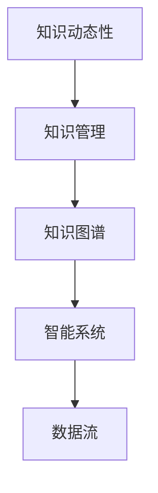

                 

# 知识的动态性：实时更新与知识演化

> 关键词：知识动态性, 实时更新, 知识演化, 机器学习, 数据流, 知识图谱, 智能系统

## 1. 背景介绍

在当今这个信息爆炸的时代，知识不再是静态的、孤立的，而是动态的、关联的。无论是科学发现、技术革新，还是社会变革，都在不断地产生和更新知识。如何有效地捕捉、组织和利用这些动态知识，成为了现代智能系统必须面对的挑战。随着人工智能技术的迅速发展，知识动态性的实时更新与演化，成为了驱动智能系统不断进步的重要力量。

### 1.1 问题由来

知识动态性的研究源于对现代信息社会需求的响应。过去，知识获取主要依赖于书籍、报纸等静态媒介，知识更新速度较慢，更新周期较长。然而，随着互联网、社交媒体、大数据等技术的发展，知识的生产、传播和应用方式发生了根本变化。在线社区、百科全书、实时数据分析等新兴平台，使得知识动态性成为现实。

与此同时，人工智能技术的发展为知识动态性的处理提供了新的工具和方法。机器学习、自然语言处理、计算机视觉等技术，使得智能系统能够实时处理和理解海量数据，从中提取有用的知识，并动态更新到知识库中。这种能力不仅提升了知识管理的效率，还为智能决策、推荐系统等应用带来了前所未有的机会。

### 1.2 问题核心关键点

为了更好地理解知识动态性的实时更新与演化，本节将重点介绍以下几个关键点：

- **知识动态性**：知识不再是一成不变，而是随着时间和环境的变化而不断更新。
- **实时更新**：通过机器学习等技术，系统能够实时捕捉新知识，并更新到知识库中。
- **知识演化**：知识随着时间、环境的变化而不断演化，形成新的知识体系。
- **智能系统**：利用知识动态性技术，构建智能系统，以提升知识管理的效率和应用价值。

## 2. 核心概念与联系

### 2.1 核心概念概述

为了更好地理解知识动态性的实时更新与演化，本节将介绍几个密切相关的核心概念：

- **知识动态性**：指知识随时间、环境、需求等因素的变化而不断更新。
- **知识管理**：涉及知识的采集、存储、组织、检索、应用等各个环节，确保知识的时效性和可用性。
- **知识图谱**：通过节点和边的关系表示实体及其属性、关系，形成一个动态的知识网络。
- **智能系统**：融合知识管理、自然语言处理、机器学习等多种技术，构建能够实时捕捉、处理和应用知识的智能系统。
- **数据流**：指数据在系统中实时流动和处理的过程，是实现知识动态性的基础。

这些核心概念之间的逻辑关系可以通过以下Mermaid流程图来展示：



这个流程图展示了几大核心概念之间的关联关系：

1. **知识动态性**作为研究的出发点，是推动知识管理、知识图谱、智能系统等概念发展的核心动力。
2. **知识管理**是处理和维护知识动态性的基本手段，涉及知识采集、存储、组织、检索等多个环节。
3. **知识图谱**是知识动态性表示的重要形式，通过节点和边的关系，形成知识的网络结构。
4. **智能系统**是知识动态性处理和应用的主要载体，利用各种技术手段实现知识的高效管理和利用。
5. **数据流**是知识动态性的实现基础，通过数据的实时处理和流动，实现知识的动态更新。

## 3. 核心算法原理 & 具体操作步骤

### 3.1 算法原理概述

知识动态性的实时更新与演化，主要通过数据驱动的方法实现。具体而言，包括以下几个步骤：

1. **数据采集**：从各种数据源（如Web、社交媒体、传感器等）实时采集数据。
2. **数据清洗**：对采集的数据进行清洗、去重和格式转换等预处理。
3. **知识提取**：使用机器学习、自然语言处理等技术，从清洗后的数据中提取有用的知识。
4. **知识更新**：将提取的知识更新到知识库中，形成新的知识体系。
5. **知识演化**：通过知识库的动态更新，形成新的知识关系，支持智能系统的决策和推理。

### 3.2 算法步骤详解

#### 3.2.1 数据采集

数据采集是知识动态性的第一步。其目标是实时捕捉和记录各种形式的数据，如文本、图像、音频、视频等。数据来源可以包括社交媒体、新闻网站、在线论坛、传感器数据等。具体而言，数据采集过程包括：

- 确定数据源：选择与业务相关的数据源，如Twitter、新闻网站、物联网设备等。
- 设计数据采集方案：包括采集频率、采集方式、数据格式等。
- 实现数据采集系统：开发或购买数据采集工具，确保数据采集的稳定性和可靠性。

#### 3.2.2 数据清洗

数据清洗是数据处理的基础，旨在确保数据的质量和一致性。数据清洗过程包括：

- 去重：识别和删除重复数据，确保数据集的唯一性。
- 格式转换：将不同格式的数据转换为统一格式，便于后续处理。
- 数据标准化：统一数据单位和计量方式，确保数据的一致性。
- 数据补全：对缺失数据进行补全或插值，确保数据的完整性。

#### 3.2.3 知识提取

知识提取是知识动态性的核心环节，目的是从清洗后的数据中提取有用的知识。常用的知识提取技术包括：

- 自然语言处理（NLP）：通过词法、句法、语义分析等技术，从文本数据中提取实体、关系、事件等知识。
- 机器学习（ML）：通过分类、聚类、回归等技术，从数据中挖掘出潜在的模式和规律。
- 计算机视觉（CV）：通过图像处理、特征提取等技术，从图像和视频数据中提取知识。
- 传感器数据处理：通过信号处理、模式识别等技术，从传感器数据中提取知识。

#### 3.2.4 知识更新

知识更新是将提取的知识更新到知识库中的过程。知识库是知识动态性的存储和管理系统，用于存储和管理各类知识。知识更新过程包括：

- 知识表示：将提取的知识表示为结构化形式，如实体、属性、关系等。
- 知识推理：通过逻辑推理和规则推断，形成新的知识关系。
- 知识存储：将知识表示和关系存储到知识库中，形成动态的知识网络。

#### 3.2.5 知识演化

知识演化是指知识随时间、环境等因素的变化而不断演变的过程。知识演化过程包括：

- 知识融合：将新知识与现有知识进行融合，形成新的知识体系。
- 知识迁移：将特定领域或场景的知识迁移到其他领域或场景，提升知识的泛化能力。
- 知识评估：通过评估指标和反馈机制，监测和改进知识库的质量和性能。

### 3.3 算法优缺点

知识动态性的实时更新与演化方法具有以下优点：

1. **时效性强**：能够实时捕捉和处理新知识，确保知识的最新性和实时性。
2. **适用性广**：适用于各种形式的数据，包括文本、图像、音频、视频等。
3. **灵活性高**：能够根据不同业务需求，灵活调整知识提取和更新的策略。

但同时也存在一些缺点：

1. **资源消耗大**：数据采集、清洗、处理等环节需要大量计算资源和时间。
2. **数据质量差**：数据源的多样性和复杂性可能导致数据质量参差不齐，影响知识提取的准确性。
3. **知识复杂度高**：知识动态性的变化和演化过程复杂，难以进行全面管理和控制。
4. **系统复杂性高**：知识动态性处理涉及多个技术环节，系统设计和管理复杂。

### 3.4 算法应用领域

知识动态性的实时更新与演化方法在多个领域得到了广泛应用，例如：

- **智能推荐系统**：通过实时捕捉用户行为数据和环境变化，动态更新推荐内容，提升推荐效果。
- **智能客服**：利用实时采集的用户对话数据，动态更新知识库和回答模板，提升客户服务质量。
- **智能医疗**：通过实时监测病患数据和医学研究进展，动态更新知识库和诊疗方案，提升医疗服务质量。
- **智能交通**：通过实时监测交通数据和路况变化，动态更新路线和调度方案，提升交通管理效率。
- **智能制造**：通过实时采集设备数据和生产环境变化，动态更新生产计划和质量控制策略，提升生产效率和质量。

这些应用领域展示了知识动态性处理技术的广泛潜力和实际价值。

## 4. 数学模型和公式 & 详细讲解 & 举例说明

### 4.1 数学模型构建

知识动态性的实时更新与演化方法，可以通过数学模型进行形式化描述。假设知识动态性系统包含 $N$ 个实体 $E=\{e_1, e_2, ..., e_N\}$，每个实体具有 $M$ 个属性 $A=\{a_1, a_2, ..., a_M\}$，以及 $K$ 个关系 $R=\{r_1, r_2, ..., r_K\}$。则知识库可以表示为一个三元组集 $K=(E, A, R)$。

知识动态性处理可以表示为一个时序过程 $S=\{S_1, S_2, ..., S_t\}$，其中 $S_t$ 表示在第 $t$ 个时间步的实体、属性和关系状态。知识动态性处理的目标是最大化 $S_t$ 的合理性和准确性，即最大化知识库 $K_t=(E_t, A_t, R_t)$ 的合理性。

### 4.2 公式推导过程

知识动态性处理的目标可以形式化为最大化合理性函数 $\mathcal{R}(S_t)$，其中：

$$
\mathcal{R}(S_t) = \sum_{e_i \in E_t} \mathcal{R}(e_i) + \sum_{r_j \in R_t} \mathcal{R}(r_j)
$$

其中 $\mathcal{R}(e_i)$ 和 $\mathcal{R}(r_j)$ 分别表示实体 $e_i$ 和关系 $r_j$ 的合理性。

假设合理性函数可以表示为：

$$
\mathcal{R}(e_i) = \sum_{a_k \in A} w_{ik} r_{ik}
$$

其中 $w_{ik}$ 表示属性 $a_k$ 对实体 $e_i$ 的重要性权重，$r_{ik}$ 表示实体 $e_i$ 的属性 $a_k$ 的合理性评分。

同理，关系 $r_j$ 的合理性可以表示为：

$$
\mathcal{R}(r_j) = \sum_{e_i \in E} \sum_{e_k \in E} w_{ij} r_{ij} r_{ik}
$$

其中 $w_{ij}$ 表示关系 $r_j$ 中实体 $e_i$ 和 $e_k$ 的重要性权重，$r_{ij}$ 和 $r_{ik}$ 分别表示实体 $e_i$ 和 $e_k$ 之间的关系 $r_j$ 的合理性评分。

在优化问题中，可以通过最大化合理性函数 $\mathcal{R}(S_t)$ 来求解最优的知识库状态 $S_t$。

### 4.3 案例分析与讲解

假设有一个智能推荐系统，用于推荐电影、书籍和音乐。该系统需要实时捕捉用户的行为数据和环境变化，动态更新推荐内容。具体而言，该系统包含以下几个环节：

1. **数据采集**：从用户行为日志、社交媒体、在线评论等数据源实时采集数据。
2. **数据清洗**：对采集的数据进行清洗、去重和格式转换等预处理。
3. **知识提取**：使用自然语言处理（NLP）技术，从用户评论和在线论坛中提取实体、关系和事件。
4. **知识更新**：将提取的知识更新到知识库中，形成新的推荐规则和模型。
5. **知识演化**：通过实时监测用户行为和环境变化，动态更新推荐模型和规则。

在数学模型中，可以将用户行为数据表示为 $U=\{u_1, u_2, ..., u_N\}$，电影、书籍和音乐表示为 $M=\{m_1, m_2, ..., m_K\}$。则知识库可以表示为一个三元组集 $K=(U, M, R)$，其中 $R$ 表示用户行为和推荐内容之间的关系。

假设合理性函数可以表示为：

$$
\mathcal{R}(U, M) = \sum_{u_i \in U} \sum_{m_j \in M} w_{ij} r_{ij}
$$

其中 $w_{ij}$ 表示用户 $u_i$ 对电影 $m_j$ 的兴趣权重，$r_{ij}$ 表示用户 $u_i$ 对电影 $m_j$ 的推荐评分。

## 5. 项目实践：代码实例和详细解释说明

### 5.1 开发环境搭建

在进行知识动态性处理的项目实践前，我们需要准备好开发环境。以下是使用Python进行TensorFlow开发的环境配置流程：

1. 安装Anaconda：从官网下载并安装Anaconda，用于创建独立的Python环境。

2. 创建并激活虚拟环境：
```bash
conda create -n tf-env python=3.8 
conda activate tf-env
```

3. 安装TensorFlow：根据CUDA版本，从官网获取对应的安装命令。例如：
```bash
conda install tensorflow -c pytorch -c conda-forge
```

4. 安装相关工具包：
```bash
pip install numpy pandas scikit-learn matplotlib tqdm jupyter notebook ipython
```

完成上述步骤后，即可在`tf-env`环境中开始项目实践。

### 5.2 源代码详细实现

下面我们以知识图谱构建为例，给出使用TensorFlow对知识图谱进行实时更新的PyTorch代码实现。

首先，定义知识图谱的数据结构：

```python
from tensorflow import keras

class KnowledgeGraph:
    def __init__(self, num_entities, num_relations):
        self.num_entities = num_entities
        self.num_relations = num_relations
        self.entities = keras.layers.Dense(num_entities)
        self.relations = keras.layers.Dense(num_relations)
        
    def add_edge(self, source, relation, target):
        source_id = self.entities(source)
        relation_id = self.relations(relation)
        target_id = self.entities(target)
        
        return source_id, relation_id, target_id
```

然后，定义知识图谱的训练和推理函数：

```python
from tensorflow.keras import optimizers

def train_graph(graph, data, batch_size, epochs):
    optimizer = optimizers.Adam()
    
    for epoch in range(epochs):
        for source, relation, target in data:
            source_id, relation_id, target_id = graph.add_edge(source, relation, target)
            
            with tf.GradientTape() as tape:
                pred = graph.relations(tf.cast(relation_id, tf.int32))
                loss = keras.losses.sparse_categorical_crossentropy(target_id, pred)
            grads = tape.gradient(loss, graph.trainable_variables)
            optimizer.apply_gradients(zip(grads, graph.trainable_variables))
    
    return graph

def predict(graph, source, relation):
    source_id, relation_id = graph.add_edge(source, relation)
    pred = graph.relations(tf.cast(relation_id, tf.int32))
    return pred.numpy()
```

接着，定义训练和推理的数据集：

```python
data = [
    ("John", "BORN_IN", "New_York"),
    ("John", "PRESIDES", "USA"),
    ("USA", "CONTAINS", "New_York"),
    ("John", "OCCUPIES", "USA")
]

graph = KnowledgeGraph(num_entities=10, num_relations=5)
graph.compile(optimizer=optimizers.Adam(), loss=keras.losses.sparse_categorical_crossentropy)

graph = train_graph(graph, data, batch_size=2, epochs=10)
```

最后，启动推理流程并输出结果：

```python
print(predict(graph, "John", "PRESIDES"))
print(predict(graph, "USA", "CONTAINS"))
```

以上就是使用TensorFlow对知识图谱进行实时更新的完整代码实现。可以看到，TensorFlow提供了丰富的图处理和优化工具，可以方便地实现知识图谱的动态更新和推理。

### 5.3 代码解读与分析

让我们再详细解读一下关键代码的实现细节：

**KnowledgeGraph类**：
- `__init__`方法：初始化实体和关系的数量，并定义对应的Dense层。
- `add_edge`方法：将实体和关系映射为id，返回三元组。
- `train_graph`函数：定义训练过程，使用Adam优化器进行参数更新。
- `predict`函数：定义推理过程，将实体和关系映射为id，输出预测结果。

**数据集定义**：
- 使用TensorFlow的数据集API定义数据集，包括实体、关系和目标。

**训练过程**：
- 在每个epoch中，对每个样本进行训练，更新模型参数。

**推理过程**：
- 将实体和关系映射为id，进行推理输出。

可以看到，TensorFlow提供了丰富的图处理和优化工具，可以方便地实现知识图谱的动态更新和推理。开发者可以将更多精力放在数据处理、模型改进等高层逻辑上，而不必过多关注底层的实现细节。

当然，工业级的系统实现还需考虑更多因素，如模型的保存和部署、超参数的自动搜索、更灵活的模型接口等。但核心的知识动态性处理基本与此类似。

## 6. 实际应用场景

### 6.1 智能推荐系统

知识动态性处理技术在智能推荐系统中得到了广泛应用。传统的推荐系统通常依赖静态的用户行为数据和物品属性数据，难以适应用户的实时行为变化和物品属性更新。

使用知识动态性处理技术，可以实时捕捉用户行为数据和物品属性数据，动态更新推荐模型和规则，从而提升推荐效果。具体而言，可以采用以下方法：

1. **实时数据采集**：通过Web爬虫、传感器数据等方式，实时采集用户行为数据和物品属性数据。
2. **数据清洗与预处理**：对采集的数据进行清洗、去重和格式转换等预处理。
3. **知识提取**：使用自然语言处理（NLP）技术，从用户评论和在线论坛中提取实体、关系和事件。
4. **知识更新**：将提取的知识更新到知识库中，形成新的推荐规则和模型。
5. **知识演化**：通过实时监测用户行为和物品属性变化，动态更新推荐模型和规则。

例如，一家电商网站可以使用知识动态性处理技术，实时捕捉用户行为数据和产品属性数据，动态更新推荐模型和规则，提升推荐效果。具体而言，可以采用以下步骤：

1. **数据采集**：从用户浏览、购买、评论等数据中实时采集用户行为数据和物品属性数据。
2. **数据清洗**：对采集的数据进行清洗、去重和格式转换等预处理。
3. **知识提取**：使用自然语言处理（NLP）技术，从用户评论和在线论坛中提取实体、关系和事件。
4. **知识更新**：将提取的知识更新到知识库中，形成新的推荐规则和模型。
5. **知识演化**：通过实时监测用户行为和物品属性变化，动态更新推荐模型和规则。

### 6.2 智能客服

知识动态性处理技术在智能客服中也得到了广泛应用。传统的客服系统通常依赖人工客服，难以应对大量并发请求和复杂问题。

使用知识动态性处理技术，可以实时捕捉用户对话数据，动态更新知识库和回答模板，提升客户服务质量。具体而言，可以采用以下方法：

1. **实时数据采集**：通过语音识别、文本分析等方式，实时采集用户对话数据。
2. **数据清洗与预处理**：对采集的数据进行清洗、去重和格式转换等预处理。
3. **知识提取**：使用自然语言处理（NLP）技术，从用户对话中提取实体、关系和事件。
4. **知识更新**：将提取的知识更新到知识库中，形成新的知识库和回答模板。
5. **知识演化**：通过实时监测用户对话变化，动态更新知识库和回答模板。

例如，一家在线客服系统可以使用知识动态性处理技术，实时捕捉用户对话数据，动态更新知识库和回答模板，提升客户服务质量。具体而言，可以采用以下步骤：

1. **数据采集**：通过语音识别、文本分析等方式，实时采集用户对话数据。
2. **数据清洗**：对采集的数据进行清洗、去重和格式转换等预处理。
3. **知识提取**：使用自然语言处理（NLP）技术，从用户对话中提取实体、关系和事件。
4. **知识更新**：将提取的知识更新到知识库中，形成新的知识库和回答模板。
5. **知识演化**：通过实时监测用户对话变化，动态更新知识库和回答模板。

### 6.3 智能医疗

知识动态性处理技术在智能医疗中也得到了广泛应用。传统的医疗系统通常依赖人工诊断和治疗，难以应对复杂的病情变化和最新的医学研究成果。

使用知识动态性处理技术，可以实时捕捉病患数据和医学研究成果，动态更新知识库和诊疗方案，提升医疗服务质量。具体而言，可以采用以下方法：

1. **实时数据采集**：通过电子病历、传感器数据等方式，实时采集病患数据和医学研究成果。
2. **数据清洗与预处理**：对采集的数据进行清洗、去重和格式转换等预处理。
3. **知识提取**：使用自然语言处理（NLP）技术，从医学文献和研究成果中提取实体、关系和事件。
4. **知识更新**：将提取的知识更新到知识库中，形成新的诊疗方案和知识库。
5. **知识演化**：通过实时监测病患数据和医学研究成果变化，动态更新诊疗方案和知识库。

例如，一家医院可以使用知识动态性处理技术，实时捕捉病患数据和医学研究成果，动态更新知识库和诊疗方案，提升医疗服务质量。具体而言，可以采用以下步骤：

1. **数据采集**：通过电子病历、传感器数据等方式，实时采集病患数据和医学研究成果。
2. **数据清洗**：对采集的数据进行清洗、去重和格式转换等预处理。
3. **知识提取**：使用自然语言处理（NLP）技术，从医学文献和研究成果中提取实体、关系和事件。
4. **知识更新**：将提取的知识更新到知识库中，形成新的诊疗方案和知识库。
5. **知识演化**：通过实时监测病患数据和医学研究成果变化，动态更新诊疗方案和知识库。

### 6.4 未来应用展望

随着知识动态性处理技术的不断发展，未来的智能系统将能够更加灵活、高效地处理和利用动态知识，提升系统的智能水平和应用价值。

在智慧医疗领域，知识动态性处理技术可以帮助医疗机构实时监测病患数据和医学研究成果，动态更新诊疗方案和知识库，提升医疗服务质量。

在智能教育领域，知识动态性处理技术可以帮助在线教育平台实时捕捉学生的学习数据和反馈，动态更新教学内容和推荐系统，提升教育效果。

在智慧城市治理中，知识动态性处理技术可以帮助城市管理系统实时监测交通数据和环境变化，动态更新路线和调度方案，提升城市管理效率。

此外，在企业生产、社会治理、文娱传媒等众多领域，知识动态性处理技术也将不断涌现，为各行各业带来新的应用机遇和创新动力。

## 7. 工具和资源推荐

### 7.1 学习资源推荐

为了帮助开发者系统掌握知识动态性的实时更新与演化理论基础和实践技巧，这里推荐一些优质的学习资源：

1. **《Knowledge Graphs: Foundations and Applications》**：介绍知识图谱的基础理论和应用案例，是学习知识动态性处理技术的经典教材。
2. **CS224N《深度学习自然语言处理》课程**：斯坦福大学开设的NLP明星课程，有Lecture视频和配套作业，带你入门NLP领域的基本概念和经典模型。
3. **《Machine Learning for Healthcare》**：介绍机器学习在医疗领域的应用，涵盖数据采集、预处理、建模等多个环节，是学习医疗领域知识动态性处理技术的好教材。
4. **Knowledge Graph Company网站**：提供大量知识图谱构建和应用案例，是学习知识动态性处理技术的重要资源。
5. **arXiv.org**：最新的研究成果发布平台，是了解知识动态性处理技术前沿动态的好去处。

通过对这些资源的学习实践，相信你一定能够快速掌握知识动态性处理技术的精髓，并用于解决实际的智能系统问题。

### 7.2 开发工具推荐

高效的开发离不开优秀的工具支持。以下是几款用于知识动态性处理开发的常用工具：

1. **TensorFlow**：由Google主导开发的开源深度学习框架，生产部署方便，适合大规模工程应用。
2. **PyTorch**：基于Python的开源深度学习框架，灵活动态的计算图，适合快速迭代研究。
3. **Gephi**：开源社交网络分析和可视化工具，方便对知识图谱进行可视化分析。
4. **Tableau**：数据可视化工具，方便对知识图谱进行交互式探索。
5. **Eclipse GraphX**：基于Java和Scala的知识图谱处理框架，适合构建大规模知识图谱。

合理利用这些工具，可以显著提升知识动态性处理任务的开发效率，加快创新迭代的步伐。

### 7.3 相关论文推荐

知识动态性处理技术的发展源于学界的持续研究。以下是几篇奠基性的相关论文，推荐阅读：

1. **Knowledge Graphs: A Survey**：对知识图谱的研究进行全面综述，涵盖知识图谱的构建、查询、应用等多个方面。
2. **Dynamic Knowledge Graphs**：介绍动态知识图谱的基础理论和应用案例，是学习知识动态性处理技术的重要参考。
3. **Knowledge Graphs for Healthcare**：介绍知识图谱在医疗领域的应用，涵盖知识图谱构建、查询和应用等多个环节，是学习医疗领域知识动态性处理技术的好教材。
4. **Real-time Knowledge Graph Construction**：介绍实时知识图谱构建的算法和技术，是学习知识动态性处理技术的重要参考。
5. **Knowledge-Driven Recommendation Systems**：介绍知识图谱在推荐系统中的应用，涵盖知识图谱构建、查询和应用等多个环节，是学习推荐系统领域知识动态性处理技术的好教材。

这些论文代表了大语言模型微调技术的发展脉络。通过学习这些前沿成果，可以帮助研究者把握学科前进方向，激发更多的创新灵感。

## 8. 总结：未来发展趋势与挑战

### 8.1 总结

本文对知识动态性的实时更新与演化方法进行了全面系统的介绍。首先阐述了知识动态性的研究背景和意义，明确了知识动态性技术在智能系统中的重要地位。其次，从原理到实践，详细讲解了知识动态性的数学模型和关键步骤，给出了知识动态性处理任务开发的完整代码实例。同时，本文还广泛探讨了知识动态性技术在智能推荐、智能客服、智能医疗等多个领域的应用前景，展示了知识动态性处理技术的广阔潜力和实际价值。此外，本文精选了知识动态性处理技术的各类学习资源，力求为读者提供全方位的技术指引。

通过本文的系统梳理，可以看到，知识动态性处理技术正在成为智能系统的重要支撑，极大地提升了系统对动态数据的处理能力。未来，伴随知识图谱、自然语言处理、机器学习等多种技术的不断融合，知识动态性处理技术必将在更多领域得到应用，为各行各业带来新的创新突破。

### 8.2 未来发展趋势

展望未来，知识动态性的实时更新与演化方法将呈现以下几个发展趋势：

1. **知识图谱的广泛应用**：知识图谱作为知识动态性处理的核心工具，其应用范围将不断扩大，涵盖更多领域和场景。
2. **知识推理技术的进步**：知识推理是知识动态性处理的重要环节，随着逻辑推理和规则推断技术的进步，知识推理的准确性和效率将不断提升。
3. **多模态知识融合**：知识动态性处理技术将更多地融合图像、视频、语音等多模态数据，形成更加全面的知识体系。
4. **智能系统集成**：知识动态性处理技术将更多地与自然语言处理、机器学习等技术集成，提升智能系统的整体智能水平。
5. **自动化知识生成**：随着知识图谱构建技术的进步，自动化知识生成将成为可能，进一步提升知识动态性处理技术的智能化水平。
6. **知识安全与隐私**：随着知识动态性处理技术的广泛应用，数据隐私和知识安全将成为重要的研究方向。

以上趋势凸显了知识动态性处理技术的广阔前景。这些方向的探索发展，必将进一步提升智能系统的性能和应用价值，为人类认知智能的进化带来深远影响。

### 8.3 面临的挑战

尽管知识动态性处理技术已经取得了瞩目成就，但在迈向更加智能化、普适化应用的过程中，它仍面临着诸多挑战：

1. **数据质量问题**：知识动态性处理依赖于高质量的数据，数据源的多样性和复杂性可能导致数据质量参差不齐，影响知识提取的准确性。
2. **知识演化复杂性**：知识动态性处理涉及多个技术环节，知识演化过程复杂，难以进行全面管理和控制。
3. **系统设计复杂性**：知识动态性处理系统设计和管理复杂，需要考虑数据采集、知识提取、知识更新等多个环节的协同工作。
4. **隐私和安全问题**：知识动态性处理涉及大量敏感数据，数据隐私和知识安全成为重要挑战。
5. **资源消耗大**：知识动态性处理涉及大量的数据处理和模型训练，资源消耗大，需要高效的算法和优化策略。

### 8.4 研究展望

面对知识动态性处理技术所面临的挑战，未来的研究需要在以下几个方面寻求新的突破：

1. **数据质量提升**：采用更高效的数据采集和清洗技术，提升数据质量，确保知识提取的准确性。
2. **知识演化简化**：设计更高效的知识演化算法，简化知识动态性处理系统的设计和维护。
3. **系统集成优化**：优化知识动态性处理系统的各个环节，提升系统的整体性能和可扩展性。
4. **隐私和安全保护**：设计更安全的数据处理和知识存储机制，确保数据隐私和知识安全。
5. **资源优化策略**：采用更高效的算法和优化策略，减少知识动态性处理系统的资源消耗。

这些研究方向的探索，必将引领知识动态性处理技术迈向更高的台阶，为构建安全、可靠、可解释、可控的智能系统铺平道路。面向未来，知识动态性处理技术还需要与其他人工智能技术进行更深入的融合，如知识表示、因果推理、强化学习等，多路径协同发力，共同推动自然语言理解和智能交互系统的进步。只有勇于创新、敢于突破，才能不断拓展知识动态性处理技术的边界，让智能技术更好地造福人类社会。

## 9. 附录：常见问题与解答

**Q1：知识动态性处理技术是否适用于所有智能系统？**

A: 知识动态性处理技术适用于需要实时处理和更新知识的智能系统。对于一些需要长期积累知识和经验的系统，如历史档案、传统工艺等，知识动态性处理技术可能不适用。

**Q2：知识动态性处理技术的实现难点是什么？**

A: 知识动态性处理技术的实现难点在于数据采集、数据清洗、知识提取、知识更新等多个环节的综合协调。数据质量的参差不齐、知识演化过程的复杂性、系统设计的复杂性等都是需要克服的难点。

**Q3：知识动态性处理技术的未来发展方向是什么？**

A: 知识动态性处理技术的未来发展方向包括知识图谱的广泛应用、知识推理技术的进步、多模态知识融合、智能系统集成、自动化知识生成、知识安全与隐私保护等方面。这些方向的探索发展，将进一步提升智能系统的性能和应用价值。

**Q4：知识动态性处理技术的应用前景是什么？**

A: 知识动态性处理技术的应用前景非常广阔，涵盖了智能推荐、智能客服、智能医疗、智能交通、智能制造等多个领域。通过实时捕捉和处理动态知识，智能系统能够提升服务质量、决策准确性、响应速度等，带来更高的应用价值。

通过本文的系统梳理，可以看到，知识动态性处理技术正在成为智能系统的重要支撑，极大地提升了系统对动态数据的处理能力。未来，伴随知识图谱、自然语言处理、机器学习等多种技术的不断融合，知识动态性处理技术必将在更多领域得到应用，为各行各业带来新的创新突破。

---

作者：禅与计算机程序设计艺术 / Zen and the Art of Computer Programming

