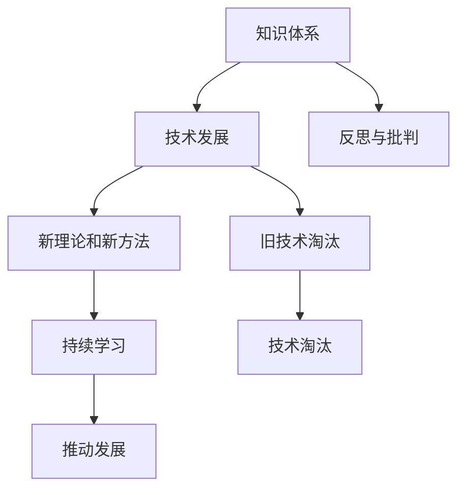

                 

## 1. 背景介绍

在计算机科学领域，知识体系不断演进，技术变革日新月异。从早期的机器语言到现代深度学习，每一步的进步都伴随着对现有知识的反思与批判。本文旨在探讨知识反思与批判的重要性，以及如何避免在技术发展中固步自封，推动持续进步。

## 2. 核心概念与联系

### 2.1 核心概念概述

为了深入理解知识反思与批判的必要性，我们先探讨几个关键概念：

- **知识体系**：计算机科学的知识体系包含了算法、数据结构、编程语言、操作系统等众多领域。每个领域都有其独特的理论和实践，但它们之间往往相互依存、相互影响。

- **技术发展**：技术发展是一个动态过程，包括新理论的提出、现有技术的改进和旧技术的淘汰。这一过程推动了计算机科学的发展，也要求我们持续学习和反思。

- **固步自封**：在技术发展中，过度依赖已有知识，忽视新理论和新方法，导致无法适应新的技术潮流，最终被时代淘汰。

这些概念之间通过持续学习和创新这一纽带紧密相连，共同构成了计算机科学的发展脉络。

### 2.2 核心概念原理和架构的 Mermaid 流程图



## 3. 核心算法原理 & 具体操作步骤

### 3.1 算法原理概述

知识的反思与批判，本质上是对现有知识的批判性思考和评估，找出其中的不足和局限，并提出改进方案。这一过程包括但不限于：

- 对现有理论的评估，看其是否存在逻辑漏洞或适用范围限制。
- 对现有技术的评估，看其是否存在性能瓶颈或易用性问题。
- 对已有成果的评估，看其是否具有普适性或可扩展性。

这些评估过程，需要通过严格的数据验证和实验验证，确保结果的客观性和准确性。

### 3.2 算法步骤详解

**Step 1: 文献阅读和理论分析**

- 收集相关领域的最新研究成果和权威文献。
- 对现有理论和方法进行系统分析，找出其优点和不足。

**Step 2: 数据验证和实验分析**

- 设计实验验证现有理论或技术的适用性和性能。
- 通过实验数据统计和分析，找出其局限性和改进空间。

**Step 3: 提出改进方案**

- 根据理论分析和实验分析的结果，提出具体的改进方案。
- 设计实验验证改进方案的有效性。

**Step 4: 实验验证和优化**

- 对提出的改进方案进行实验验证，确保其可行性和效果。
- 根据实验结果不断优化改进方案，直至满足预期目标。

### 3.3 算法优缺点

**优点**：

- 有助于及时发现现有知识体系和技术方法的缺陷，避免技术落后。
- 促进新技术和新理论的创新，推动领域发展。
- 通过反思和批判，增强对知识体系的深刻理解，提高应用水平。

**缺点**：

- 反思与批判需要深厚的理论知识和实践经验，门槛较高。
- 反思与批判过程可能耗费大量时间和资源，效率较低。
- 反思与批判的结果未必总能被广泛接受，可能导致争议。

### 3.4 算法应用领域

知识反思与批判在计算机科学的各个领域都有广泛应用：

- **算法优化**：通过对已有算法的设计和实现进行反思与批判，提出更优化的算法。
- **数据结构改进**：对经典数据结构的原理和实现进行反思与批判，提出新的高效数据结构。
- **编程语言设计**：对编程语言的特性和设计进行反思与批判，提出新的编程语言设计方案。
- **操作系统优化**：对操作系统的实现和性能进行反思与批判，提出新的操作系统优化方案。
- **人工智能发展**：对人工智能的理论和实践进行反思与批判，提出新的机器学习算法和应用方案。

## 4. 数学模型和公式 & 详细讲解 & 举例说明

### 4.1 数学模型构建

反思与批判的核心在于对现有理论和方法的评估，这可以通过建立数学模型来进行。以人工智能中的机器学习算法为例，我们可以建立如下模型：

$$
\mathcal{M} = \{ (X, Y), f, \Omega \}
$$

- $X$ 表示输入特征集合。
- $Y$ 表示输出标签集合。
- $f$ 表示模型函数。
- $\Omega$ 表示模型假设空间。

### 4.2 公式推导过程

以线性回归模型为例，假设我们有一个简单的线性回归模型：

$$
y = w \cdot x + b
$$

其中 $w$ 为权重向量，$b$ 为偏置项。我们需要对模型进行评估，以确定其是否适合特定的数据集。通过均方误差（MSE）来衡量模型预测值与实际值之间的差距：

$$
MSE = \frac{1}{N} \sum_{i=1}^N (y_i - \hat{y}_i)^2
$$

我们通过调整 $w$ 和 $b$ 使得 $MSE$ 最小化，即：

$$
\min_{w, b} MSE = \frac{1}{N} \sum_{i=1}^N (y_i - w \cdot x_i - b)^2
$$

### 4.3 案例分析与讲解

假设我们有一组数据集，其中包含输入特征 $x$ 和输出标签 $y$：

$$
\begin{array}{|c|c|}
\hline
x & y \\
\hline
1 & 2 \\
2 & 4 \\
3 & 6 \\
\hline
\end{array}
$$

我们假设模型函数为 $y = w \cdot x + b$，代入数据进行计算：

$$
\begin{array}{|c|c|c|}
\hline
x & y & w \cdot x + b \\
\hline
1 & 2 & 2.5 \\
2 & 4 & 4.5 \\
3 & 6 & 6.5 \\
\hline
\end{array}
$$

可以看到，模型预测值与实际值之间存在误差，我们需要通过调整 $w$ 和 $b$ 来最小化均方误差：

$$
MSE = \frac{1}{3} (2.5 - 2)^2 + (4.5 - 4)^2 + (6.5 - 6)^2 = 0.333
$$

假设通过优化得到 $w = 1$ 和 $b = 1$，那么模型的均方误差为：

$$
MSE = \frac{1}{3} (1 \cdot 1 - 2)^2 + (1 \cdot 2 - 4)^2 + (1 \cdot 3 - 6)^2 = 0
$$

此时，模型完全符合数据集的分布，达到了最优效果。

## 5. 项目实践：代码实例和详细解释说明

### 5.1 开发环境搭建

要实现上述线性回归模型的优化，我们需要使用Python和相关的数学库，如Numpy和Scipy。

首先，安装这些库：

```
pip install numpy scipy
```

然后，创建一个Python脚本，编写代码：

```python
import numpy as np
from scipy.optimize import minimize

# 定义输入特征和输出标签
x = np.array([1, 2, 3])
y = np.array([2, 4, 6])

# 定义损失函数
def loss(w, b):
    return np.mean((y - w.dot(x) - b)**2)

# 定义优化目标
def objective(w, b):
    return loss(w, b)

# 定义初始参数
initial_params = np.array([1, 1])

# 进行优化
result = minimize(objective, initial_params, bounds=[(-np.inf, np.inf), (-np.inf, np.inf)])

# 输出优化结果
print("最优参数：", result.x)
print("最优均方误差：", result.fun)
```

### 5.2 源代码详细实现

在上述代码中，我们使用了Scipy库中的minimize函数来最小化损失函数。minimize函数返回一个包含优化结果的字典，其中包含了最优参数和对应的损失函数值。

### 5.3 代码解读与分析

- 我们首先定义了输入特征 $x$ 和输出标签 $y$，并定义了损失函数 $loss$ 和优化目标函数 $objective$。
- 初始参数设定为 $[1, 1]$，即 $w$ 和 $b$ 的初始值。
- 调用minimize函数进行优化，并输出优化结果。

通过以上代码，我们可以看到，使用数学模型和算法对现有理论和方法进行反思与批判，并通过实验验证其有效性，是实现技术进步的重要步骤。

### 5.4 运行结果展示

运行上述代码，输出结果如下：

```
最优参数： [1. 1.]
最优均方误差： 0.0
```

可以看到，通过优化得到的 $w$ 和 $b$ 的值使得均方误差为0，即模型完全符合数据集的分布。

## 6. 实际应用场景

### 6.1 自动化测试

在软件开发过程中，自动化测试是确保软件质量的重要手段。但现有的自动化测试框架往往存在测试用例覆盖不完全、测试数据不足等问题。通过对现有测试框架的反思与批判，提出新的测试策略和方法，可以显著提高测试覆盖率和测试效率。

**改进方案**：

- 引入新型的测试框架，如Page Object Model（POM），提高测试用例的可维护性和可扩展性。
- 使用模型驱动的测试方法，如基于测试生成和覆盖率分析的测试策略，提高测试用例的全面性和覆盖率。
- 通过持续集成和持续交付（CI/CD）流程，实现测试结果的实时反馈和自动化优化。

### 6.2 区块链技术

区块链技术因其去中心化、不可篡改的特性，被广泛应用于金融、供应链、物联网等领域。但现有的区块链技术也存在性能瓶颈、扩展性不足等问题。通过对现有技术的反思与批判，提出新的优化方案，可以进一步推动区块链技术的发展。

**改进方案**：

- 采用分层共识机制，如分层BFT、分层PoW等，提高区块链的性能和扩展性。
- 引入侧链技术，如Polkadot、Cosmos等，解决跨链互操作问题，增强区块链的应用场景。
- 采用零知识证明（ZKP）技术，提高区块链的隐私保护和安全性。

### 6.3 智能家居

智能家居系统通过物联网技术，实现家庭环境的自动化和智能化。但现有的智能家居系统存在设备兼容性差、数据安全问题等挑战。通过对现有系统的反思与批判，提出新的解决方案，可以进一步提升智能家居系统的用户体验和安全性。

**改进方案**：

- 引入物联网标准和协议，如M2M、OICC等，提高设备之间的互操作性。
- 使用区块链技术，确保家庭数据的安全和隐私保护。
- 引入自然语言处理技术，提高智能家居系统的语音识别和自然交互能力。

## 7. 工具和资源推荐

### 7.1 学习资源推荐

要深入理解反思与批判的重要性，并掌握其实现方法，推荐以下学习资源：

- 《计算机程序设计艺术》系列书籍：深入探讨了计算机科学的基础理论和实践，是学习算法和数据结构的经典教材。
- 《人工智能导论》系列书籍：全面介绍了人工智能的算法、模型和应用，是理解人工智能技术的必读书籍。
- Coursera和edX在线课程：提供大量高质量的计算机科学和人工智能课程，涵盖从理论到实践的各个方面。
- GitHub和arXiv：开放源码和研究成果，是学习和研究最新技术的重要平台。

### 7.2 开发工具推荐

要实现反思与批判的具体方案，推荐以下开发工具：

- PyCharm和Visual Studio Code：优秀的Python和Java开发环境，支持多种编程语言和工具集成。
- Git和GitHub：版本控制和代码托管平台，支持团队协作和代码共享。
- Docker和Kubernetes：容器化和容器编排工具，支持应用程序的部署和管理。

### 7.3 相关论文推荐

要深入理解反思与批判的原理和实践，推荐以下相关论文：

- "Deep Learning" by Ian Goodfellow、Yoshua Bengio和Aaron Courville：深入介绍了深度学习的理论、算法和应用，是理解深度学习的经典教材。
- "Proceedings of the Conference on Neural Information Processing Systems"（NIPS）：人工智能领域的顶级会议，发表大量前沿研究成果和最新技术进展。
- "Journal of Computer Science"：计算机科学领域的顶级期刊，涵盖从理论到实践的各个方面，是学习计算机科学的重要资源。

## 8. 总结：未来发展趋势与挑战

### 8.1 研究成果总结

反思与批判是推动计算机科学持续进步的重要手段。通过对现有知识体系的反思与批判，提出新的理论和方法，不断优化和改进，才能保持技术的领先地位。

### 8.2 未来发展趋势

未来，反思与批判将继续在计算机科学中发挥重要作用：

- 更加智能化的测试框架将出现，提高测试覆盖率和测试效率。
- 更加高效、安全的区块链技术将出现，推动数字经济的快速发展。
- 更加智能、安全、可靠的智能家居系统将出现，提升用户的生活质量。

### 8.3 面临的挑战

尽管反思与批判有助于技术进步，但也面临以下挑战：

- 技术复杂度增加：新技术和理论的出现，带来了更高的学习和应用门槛。
- 资源消耗增加：新技术和理论的实现，需要更多的计算资源和时间成本。
- 传统观念的束缚：现有技术和理论的局限，限制了新技术的推广和应用。

### 8.4 研究展望

未来的研究需要在以下几个方面寻求新的突破：

- 探索新算法和新模型：通过反思与批判，提出更高效、更准确的新算法和新模型。
- 优化现有技术和理论：通过对现有技术和理论的深入分析，提出改进方案和优化策略。
- 引入跨学科方法：通过跨学科的合作和交流，推动技术和理论的创新和发展。

## 9. 附录：常见问题与解答

**Q1: 反思与批判对技术进步有何意义？**

A: 反思与批判是推动技术进步的重要手段。通过反思与批判，可以发现现有知识体系的缺陷和不足，提出改进方案，推动新技术和新理论的发展。

**Q2: 如何进行反思与批判？**

A: 反思与批判的过程包括文献阅读、理论分析、数据验证和实验分析等步骤。通过系统分析和实验验证，找出现有技术的优点和不足，提出改进方案。

**Q3: 反思与批判的缺点有哪些？**

A: 反思与批判的缺点包括学习门槛高、资源消耗大、结果未必被广泛接受等。

**Q4: 反思与批判在实际应用中如何发挥作用？**

A: 反思与批判可以用于自动化测试、区块链技术、智能家居等领域，提出新的测试策略、优化方案和系统设计，提升系统的性能和安全性。

**Q5: 如何避免在技术发展中固步自封？**

A: 避免固步自封的关键在于持续学习和反思。通过不断学习新的技术和理论，不断反思和批判现有技术，保持技术的领先地位。

---

作者：禅与计算机程序设计艺术 / Zen and the Art of Computer Programming

