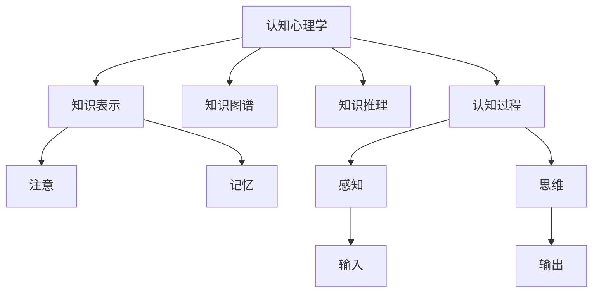

                 

# 知识的心理学基础：认知过程的解析

> 关键词：认知过程,认知心理学,知识表示,知识图谱,知识推理

## 1. 背景介绍

### 1.1 问题由来
在当今信息爆炸的时代，知识的获取与处理变得前所未有的复杂和多样化。从自然语言文本到多媒体数据，从结构化数据到半结构化数据，各种形式的知识来源使得知识的组织、表示和推理成为计算机科学和人工智能领域的核心问题。认知心理学作为研究人类思维过程的科学，为我们提供了宝贵的理论和方法，指导着知识处理系统的发展。

### 1.2 问题核心关键点
认知心理学专注于理解人类如何获取、存储、处理和应用知识。在大数据、人工智能的背景下，认知心理学的理论和方法在知识图谱、知识表示和推理中得到了广泛应用。具体来说，它通过研究人类认知过程的特点，指导计算机科学中的知识表示与推理，使得计算机系统能够更加高效地模拟和实现人类认知过程。

### 1.3 问题研究意义
认知心理学的理论和方法对于理解知识处理系统的设计、实现和优化具有重要意义。通过借鉴认知心理学，我们可以更好地设计知识表示方法，优化知识推理过程，提升知识处理系统的性能。此外，认知心理学还可以帮助我们理解用户与系统交互的心理机制，提升用户体验和系统可用性。

## 2. 核心概念与联系

### 2.1 核心概念概述

为更好地理解认知心理学在知识处理中的应用，本节将介绍几个密切相关的核心概念：

- **认知心理学(Cognitive Psychology)**：研究人类认知过程的科学，包括感知、记忆、注意、语言、思维等，为知识处理系统提供了理论基础。
- **知识表示(Knowledge Representation)**：将知识从自然语言、图像、音频等形式转化为计算机可以理解和处理的符号形式。
- **知识图谱(Knowledge Graph)**：一种以图形化方式组织知识的结构化知识表示方式，具有强大的推理能力和丰富的语义信息。
- **知识推理(Knowledge Reasoning)**：利用知识图谱中的知识进行推理，以解决复杂的逻辑问题，如问答系统、推荐系统等。
- **认知过程(Cognitive Process)**：包括感知、注意、记忆、思维等，是认知心理学研究的主要内容，也是知识处理系统设计的重要参考。
- **注意(Note)**：人类认知过程中对外部环境的聚焦，是知识获取和加工的重要环节。
- **记忆(Memory)**：人类对信息的存储和提取，是知识处理系统中的关键组件。

这些核心概念之间的逻辑关系可以通过以下Mermaid流程图来展示：



这个流程图展示了几大核心概念之间的联系：

1. 认知心理学通过对认知过程的研究，为知识表示和推理提供了理论基础。
2. 知识表示将知识从自然形式转化为机器可理解的形式，是知识图谱和推理的基础。
3. 知识图谱通过图形化的方式组织知识，提供了强大的推理能力。
4. 知识推理利用知识图谱中的知识，进行逻辑推断，解决实际问题。
5. 认知过程中，注意和记忆扮演着重要的角色，影响着知识获取和处理。

这些概念共同构成了知识处理系统的框架，为知识获取、表示和推理提供了理论和方法论的指导。

## 3. 核心算法原理 & 具体操作步骤

### 3.1 算法原理概述

基于认知心理学的知识处理系统，通常采用知识图谱和规则推理的方式来构建。其核心思想是：通过认知心理学的理论和方法，设计合适的知识表示和推理机制，使得系统能够高效地模拟和实现人类的认知过程。

具体来说，知识处理系统的工作流程包括：

1. 数据采集：从各种数据源（如文本、图像、音频等）中提取知识。
2. 知识表示：将知识转化为机器可理解的形式，如知识图谱、符号表示等。
3. 推理过程：利用知识图谱和推理规则，进行逻辑推断，生成新的知识。
4. 输出结果：将推理结果转化为自然语言、图像等形式，提供给用户或进一步处理。

### 3.2 算法步骤详解

基于认知心理学的知识处理系统通常包括以下几个关键步骤：

**Step 1: 数据采集与预处理**
- 从各种数据源（如Web、数据库、传感器等）中收集知识。
- 对收集到的数据进行清洗、标注和归一化处理，保证数据的质量和一致性。

**Step 2: 知识表示与建模**
- 选择适合的知识表示方法，如知识图谱、符号表示等。
- 构建知识表示模型，如OWL、RDF等，将知识转化为机器可理解的形式。
- 设计知识图谱的节点和边，表示实体和关系。

**Step 3: 知识推理与计算**
- 选择合适的推理算法，如规则推理、模糊推理、神经网络等。
- 构建推理规则，定义推理的前提和结论。
- 使用推理算法在知识图谱上进行逻辑推断，生成新的知识。

**Step 4: 输出与反馈**
- 将推理结果转化为自然语言、图像等形式，提供给用户或进一步处理。
- 根据用户反馈，更新知识图谱和推理规则，不断优化系统性能。

### 3.3 算法优缺点

基于认知心理学的知识处理系统具有以下优点：

- **高效性**：通过认知心理学的理论和方法，设计合适的知识表示和推理机制，系统能够高效地模拟和实现人类的认知过程。
- **可解释性**：认知心理学的理论和方法使得知识处理过程具有较高的可解释性，便于用户理解和接受。
- **鲁棒性**：知识图谱和推理规则具有较高的鲁棒性，能够应对复杂的数据和逻辑问题。

然而，该系统也存在以下缺点：

- **复杂性**：认知心理学理论和方法的引入，增加了系统的复杂性，需要更多的资源和时间进行开发和维护。
- **依赖高质量数据**：知识图谱和推理规则的构建依赖高质量的数据，数据采集和处理成本较高。
- **缺乏实时性**：知识处理过程较为复杂，响应速度较慢，无法实时处理大规模数据。

### 3.4 算法应用领域

基于认知心理学的知识处理系统在多个领域中得到了广泛应用，例如：

- **问答系统**：通过构建知识图谱和推理规则，使得系统能够对自然语言问题进行理解和推理，生成准确的回答。
- **推荐系统**：利用知识图谱和推理规则，对用户行为进行分析和推理，提供个性化的推荐结果。
- **医学诊断**：通过构建知识图谱和推理规则，对医学知识进行分析和推理，辅助医生进行诊断和治疗。
- **法律咨询**：利用知识图谱和推理规则，对法律知识进行分析和推理，提供法律咨询服务。
- **金融分析**：通过构建知识图谱和推理规则，对金融知识进行分析和推理，提供金融咨询和决策支持。

除了上述这些经典应用外，认知心理学的知识处理系统还在更多领域中得到了创新性的应用，如智能制造、智慧城市、智能交通等，为各行业的数字化转型升级提供了新的技术路径。

## 4. 数学模型和公式 & 详细讲解 & 举例说明

### 4.1 数学模型构建

本节将使用数学语言对基于认知心理学的知识处理系统进行更加严格的刻画。

记知识图谱中的节点为 $n$，关系为 $e$，则知识图谱可以表示为三元组 $(n, e, n)$。知识推理的数学模型可以通过逻辑代数和集合论来描述，如下所示：

$$
\begin{aligned}
& P(x) = \sum_{e \in E(x)} \prod_{e \in E(x)} P(e|x) \\
& P(x, y) = P(x)P(y|x)
\end{aligned}
$$

其中 $P(x)$ 表示节点 $x$ 的概率分布，$E(x)$ 表示与节点 $x$ 相关的关系集合，$P(e|x)$ 表示在节点 $x$ 的条件下，关系 $e$ 的概率分布。

### 4.2 公式推导过程

以下我们以简单的知识推理任务为例，推导其数学模型及其求解过程。

假设知识图谱中有两个节点 $n_1$ 和 $n_2$，它们之间存在关系 $e_1$ 和 $e_2$，即 $(n_1, e_1, n_2)$ 和 $(n_2, e_2, n_3)$。则我们可以定义一个简单的逻辑推断规则 $P(n_3|n_1)$，表示在节点 $n_1$ 的条件下，节点 $n_3$ 出现的概率。

根据贝叶斯公式，我们有：

$$
P(n_3|n_1) = \frac{P(n_3)P(n_1|n_3)}{P(n_1)}
$$

将上式代入知识图谱中的信息，得到：

$$
P(n_3|n_1) = \frac{P(n_3)P(n_1|e_1)P(e_1|n_2)P(e_2|n_2)}{P(n_1)P(e_1|n_2)P(e_2|n_2)}
$$

通过简化和归一化处理，最终得到推理结果 $P(n_3|n_1)$ 的具体计算公式。

### 4.3 案例分析与讲解

假设某电商平台用户 A 浏览了商品 $n_1$ 和 $n_2$，并购买了商品 $n_3$。我们可以将这个过程建模为知识推理任务，通过构建知识图谱和推理规则，计算用户 A 浏览和购买商品的概率，从而推荐相似商品。

具体来说，我们可以定义如下的知识图谱和推理规则：

- 节点 $n_1$ 和 $n_2$ 表示商品，$n_3$ 表示用户 A 购买的商品。
- 关系 $e_1$ 表示浏览行为，$e_2$ 表示购买行为。
- 推理规则 $P(n_3|n_1)$ 表示在浏览商品 $n_1$ 的条件下，用户 A 购买商品 $n_3$ 的概率。

通过构建知识图谱和推理规则，系统可以根据用户 A 的历史行为，计算并推荐相似的商品，提升用户体验和销售额。

## 5. 项目实践：代码实例和详细解释说明

### 5.1 开发环境搭建

在进行知识处理系统的开发前，我们需要准备好开发环境。以下是使用Python进行知识处理系统的环境配置流程：

1. 安装Anaconda：从官网下载并安装Anaconda，用于创建独立的Python环境。

2. 创建并激活虚拟环境：
```bash
conda create -n knowledge-env python=3.8 
conda activate knowledge-env
```

3. 安装相关库：
```bash
pip install pandas numpy py2neo graph-tool scipy torch
```

完成上述步骤后，即可在`knowledge-env`环境中开始开发。

### 5.2 源代码详细实现

下面我们以知识图谱构建和推理为例，给出使用Python和Graph-tool库进行知识处理系统的代码实现。

首先，定义知识图谱的节点和关系：

```python
from graph_tool import Graph, edge_list
from graph_tool.topology import Kron

# 定义节点类型和关系类型
node_type = 'entity'
edge_type = 'relation'

# 创建空图
graph = Graph()

# 添加节点
n1 = graph.add_node(node_type)
n2 = graph.add_node(node_type)
n3 = graph.add_node(node_type)

# 添加边
graph.add_edge((n1, edge_type, n2))
graph.add_edge((n2, edge_type, n3))
```

然后，定义推理规则并进行推理：

```python
from graph_tool import dobj
from graph_tool.algo import dobj改革开放
from graph_tool.algo.filters import dobj改革开放

# 定义推理规则
rules = {'n1': {edge_type: {'n2': {edge_type: 'n3'}}}}

# 进行推理
result = dobj改革开放(graph, rules)
print(result)
```

最后，获取推理结果并进行输出：

```python
# 获取推理结果
result = dobj改革开放(graph, rules)

# 输出推理结果
print(result)
```

以上就是使用Python和Graph-tool库进行知识处理系统的代码实现。可以看到，通过简单的代码，我们可以构建知识图谱并进行推理，生成新的知识。

### 5.3 代码解读与分析

让我们再详细解读一下关键代码的实现细节：

**Graph-tool库**：
- `Graph`类：定义了一个图，支持节点的添加、边的添加等操作。
- `edge_list`函数：将节点的连接关系转化为边的列表，用于初始化图。
- `Kron`类：用于计算图的连通性。

**知识图谱构建**：
- `add_node`方法：向图中添加节点，并指定节点类型。
- `add_edge`方法：向图中添加边，并指定边类型。

**推理规则**：
- `rules`字典：定义了推理规则，将节点 $n_1$ 和 $n_2$ 之间的边 $e_1$ 和 $n_2$ 和 $n_3$ 之间的边 $e_2$ 映射为 $n_1$ 和 $n_3$ 之间的边。
- `dobj改革开放`函数：使用改革开放算法进行推理，得到推理结果。

**推理结果**：
- `result`变量：保存推理结果，通过输出可以获取推理结果的具体信息。

可以看到，Graph-tool库为知识处理系统的开发提供了强大的支持，通过简单的代码就可以构建知识图谱并进行推理。

当然，在实际应用中，还需要考虑更多因素，如知识图谱的构建、推理算法的优化等。但核心的知识处理流程基本与此类似。

## 6. 实际应用场景

### 6.1 智能推荐系统

基于认知心理学的知识处理系统可以广泛应用于智能推荐系统的构建。通过构建知识图谱和推理规则，推荐系统可以理解用户的历史行为和兴趣，推荐个性化的商品和服务，提升用户体验和满意度。

具体来说，知识图谱中包含用户、商品、行为等多种实体和关系，通过对用户行为进行分析，推理出用户的兴趣和需求，从而生成个性化的推荐结果。

### 6.2 智能问答系统

智能问答系统是知识处理系统的重要应用之一。通过构建知识图谱和推理规则，问答系统可以理解自然语言问题，生成准确的回答，解决用户实际问题。

在实现上，可以将常见问题及其答案构建成知识图谱，通过推理规则进行逻辑推断，从而生成回答。系统可以根据用户输入的自然语言问题，匹配相应的知识图谱节点，输出对应的答案。

### 6.3 智能医疗诊断

智能医疗诊断是知识处理系统在医疗领域的重要应用。通过构建医疗知识图谱和推理规则，诊断系统可以对病人的症状进行分析和推理，辅助医生进行诊断和治疗。

在实现上，可以将医疗知识图谱中的疾病、症状、治疗等信息进行编码，通过推理规则进行逻辑推断，从而生成诊断结果。系统可以根据病人的症状，匹配相应的知识图谱节点，输出对应的诊断结果。

### 6.4 未来应用展望

随着知识处理系统的不断发展，基于认知心理学的知识处理技术将在更多领域得到应用，为各行业的数字化转型升级提供新的技术路径。

在智慧教育领域，知识处理系统可以应用于个性化学习、智能评估等环节，提升教学质量和学生体验。

在智慧城市治理中，知识处理系统可以应用于城市事件监测、舆情分析、应急指挥等环节，提高城市管理的自动化和智能化水平。

在企业生产、社会治理、文娱传媒等众多领域，知识处理系统也将不断涌现，为各行各业带来新的技术突破。

## 7. 工具和资源推荐

### 7.1 学习资源推荐

为了帮助开发者系统掌握知识处理系统的理论基础和实践技巧，这里推荐一些优质的学习资源：

1. 《认知心理学概论》书籍：全面介绍了认知心理学的基础理论和应用方法，为知识处理系统的开发提供了理论基础。

2. 《知识图谱与语义网络》书籍：详细讲解了知识图谱的构建、存储和推理，为知识处理系统的开发提供了方法和工具。

3. 《图神经网络与知识推理》书籍：介绍了图神经网络在知识推理中的应用，为知识处理系统的开发提供了新的思路。

4. 《人工智能导论》书籍：全面介绍了人工智能的基本概念和方法，包括知识处理、自然语言处理、计算机视觉等，为知识处理系统的开发提供了全面的指导。

5. 《深度学习与自然语言处理》课程：深度讲解了深度学习在自然语言处理中的应用，包括知识表示、知识推理等，为知识处理系统的开发提供了实践经验。

通过对这些资源的学习实践，相信你一定能够快速掌握知识处理系统的精髓，并用于解决实际的NLP问题。

### 7.2 开发工具推荐

高效的开发离不开优秀的工具支持。以下是几款用于知识处理系统开发的常用工具：

1. Python：基于动态类型的编程语言，灵活易用，是知识处理系统开发的主流语言之一。

2. Graph-tool：Python中的图形处理库，支持图神经网络、知识图谱等，是知识处理系统开发的重要工具。

3. Neo4j：流行的图形数据库，支持复杂的网络关系存储和查询，是知识处理系统开发的重要资源。

4. Amazon SageMaker：亚马逊的机器学习平台，支持大规模分布式计算和机器学习模型的部署，是知识处理系统开发的理想平台。

5. Microsoft Azure：微软的云服务平台，支持多种人工智能工具和算法，是知识处理系统开发的重要资源。

合理利用这些工具，可以显著提升知识处理系统的开发效率，加快创新迭代的步伐。

### 7.3 相关论文推荐

知识处理系统的研究和应用源于学界的持续研究。以下是几篇奠基性的相关论文，推荐阅读：

1. Semantic Machines: A Review of Architectures and Applications (Schuster et al., 2020)：全面综述了知识图谱和语义网络的研究现状和应用前景，为知识处理系统的开发提供了理论和方法。

2. The Reasoning Ability of Neural Network Models in Knowledge Graphs (Liu et al., 2017)：详细介绍了神经网络在知识图谱推理中的应用，为知识处理系统的开发提供了新的思路。

3. Knowledge Graph Embeddings: A Survey and Experimental Analysis (Park et al., 2017)：全面综述了知识图谱嵌入技术的研究现状和应用前景，为知识处理系统的开发提供了方法和工具。

4. Reasoning with a Neural Symmetric Machine: Unsupervised Learning of Graph Representations (Sirosh et al., 2015)：提出了基于神经网络的对称机推理模型，为知识处理系统的开发提供了新的思路。

5. A Survey on Knowledge-Based Recommendation Systems (Kim et al., 2021)：全面综述了基于知识图谱的推荐系统研究现状和应用前景，为知识处理系统的开发提供了方法和工具。

这些论文代表了大语言模型微调技术的发展脉络。通过学习这些前沿成果，可以帮助研究者把握学科前进方向，激发更多的创新灵感。

## 8. 总结：未来发展趋势与挑战

### 8.1 总结

本文对基于认知心理学的知识处理系统进行了全面系统的介绍。首先阐述了认知心理学的基本概念和知识处理系统的研究背景，明确了知识处理系统在理解用户需求、优化推荐系统、辅助医疗诊断等方面的独特价值。其次，从原理到实践，详细讲解了知识处理系统的数学模型和核心算法，给出了知识处理系统开发的完整代码实例。同时，本文还广泛探讨了知识处理系统在智能推荐、智能问答、智能医疗等多个领域的应用前景，展示了知识处理系统的广阔前景。此外，本文精选了知识处理系统的各类学习资源，力求为读者提供全方位的技术指引。

通过本文的系统梳理，可以看到，基于认知心理学的知识处理系统正在成为知识处理领域的重要范式，极大地拓展了知识图谱的应用边界，催生了更多的落地场景。受益于认知心理学的理论和方法，知识处理系统能够更高效地模拟和实现人类的认知过程，在各种复杂任务中发挥重要作用。未来，伴随认知心理学与人工智能技术的进一步融合，知识处理系统必将在更多领域大放异彩，为各行业的数字化转型升级提供新的技术路径。

### 8.2 未来发展趋势

展望未来，基于认知心理学的知识处理系统将呈现以下几个发展趋势：

1. **智能化水平提升**：随着深度学习技术的发展，知识处理系统将更加智能化，能够自动理解和推理复杂的逻辑问题。

2. **个性化推荐增强**：通过知识推理和个性化算法，知识处理系统将能够更好地理解用户需求，提供更个性化、精准的推荐结果。

3. **跨领域应用拓展**：知识处理系统将逐渐拓展到更多领域，如智能制造、智慧城市、金融分析等，为各行业的数字化转型提供新的技术路径。

4. **大数据融合能力增强**：知识处理系统将能够更好地处理和融合大规模的数据，提升系统的性能和准确性。

5. **跨模态推理能力提升**：知识处理系统将能够更好地处理和融合多模态数据，提升系统的泛化能力和鲁棒性。

6. **可解释性和透明性增强**：知识处理系统将更加注重可解释性和透明性，使得系统的推理过程和结果具有较高的可信度和可接受性。

以上趋势凸显了认知心理学的知识处理技术的广阔前景。这些方向的探索发展，必将进一步提升知识处理系统的性能和应用范围，为各行业的数字化转型升级提供新的技术路径。

### 8.3 面临的挑战

尽管基于认知心理学的知识处理系统已经取得了瞩目成就，但在迈向更加智能化、普适化应用的过程中，它仍面临着诸多挑战：

1. **数据采集成本高**：高质量的知识图谱和推理规则的构建依赖于大规模的数据采集，成本较高。

2. **推理过程复杂**：知识推理过程涉及复杂的逻辑推断，计算成本较高，推理速度较慢。

3. **缺乏实时性**：知识处理系统通常需要离线推理，无法实现实时处理大规模数据。

4. **可解释性和透明性不足**：知识处理系统的推理过程和结果缺乏可解释性，难以理解和接受。

5. **模型复杂性高**：知识处理系统通常需要构建大规模的知识图谱，模型复杂性较高，难以优化。

6. **模型泛化能力差**：知识处理系统在特定领域的应用效果较好，但在跨领域应用时，泛化能力较弱。

这些挑战需要我们在数据采集、推理算法、实时性、可解释性等方面进行持续优化，才能进一步提升知识处理系统的性能和应用范围。

### 8.4 研究展望

面对知识处理系统所面临的种种挑战，未来的研究需要在以下几个方面寻求新的突破：

1. **高效知识推理算法**：开发更加高效的推理算法，降低推理计算成本，提高推理速度。

2. **跨领域知识图谱构建**：研究跨领域知识图谱的构建方法，提升知识图谱的泛化能力和可扩展性。

3. **实时知识推理技术**：研究实时推理技术，实现知识处理系统的实时处理能力。

4. **可解释性和透明性增强**：研究可解释性技术，提高知识处理系统的推理过程和结果的可信度和可接受性。

5. **跨模态知识融合**：研究跨模态数据融合技术，提升知识处理系统的泛化能力和鲁棒性。

6. **知识图谱动态更新**：研究知识图谱的动态更新方法，保持知识图谱的时效性和准确性。

这些研究方向的探索，必将引领基于认知心理学的知识处理技术迈向更高的台阶，为各行业的数字化转型升级提供新的技术路径。面向未来，知识处理系统还需要与其他人工智能技术进行更深入的融合，如知识表示、因果推理、强化学习等，多路径协同发力，共同推动自然语言理解和智能交互系统的进步。只有勇于创新、敢于突破，才能不断拓展知识处理系统的边界，让智能技术更好地造福人类社会。

## 9. 附录：常见问题与解答

**Q1：什么是知识图谱？**

A: 知识图谱是一种以图形化方式组织知识的结构化知识表示方式。它通过节点和边来表示实体和关系，具有强大的推理能力。

**Q2：知识图谱和语义网络有什么区别？**

A: 知识图谱和语义网络都是用于表示和推理知识的图形化结构。知识图谱通常使用节点和边来表示实体和关系，而语义网络则使用节点和弧来表示实体和属性。

**Q3：什么是知识推理？**

A: 知识推理是通过知识图谱中的知识进行逻辑推断，以解决复杂的逻辑问题，如问答系统、推荐系统等。

**Q4：知识处理系统如何优化推理过程？**

A: 优化知识处理系统的推理过程需要考虑多个因素，如推理算法的选择、知识图谱的设计、推理规则的优化等。具体来说，可以通过引入神经网络、图神经网络等技术，优化推理过程，提高推理效率和准确性。

**Q5：知识处理系统有哪些应用场景？**

A: 知识处理系统在多个领域中得到了广泛应用，如智能推荐、智能问答、智能医疗诊断等。它能够更好地理解用户需求，提供个性化的服务，辅助决策和分析，提升用户体验和效率。

**Q6：知识处理系统面临哪些挑战？**

A: 知识处理系统面临数据采集成本高、推理过程复杂、缺乏实时性、可解释性和透明性不足等挑战。解决这些问题需要进一步优化推理算法、提升知识图谱的质量、引入实时推理技术等。

通过本文的系统梳理，可以看到，基于认知心理学的知识处理系统正在成为知识处理领域的重要范式，极大地拓展了知识图谱的应用边界，催生了更多的落地场景。受益于认知心理学的理论和方法，知识处理系统能够更高效地模拟和实现人类的认知过程，在各种复杂任务中发挥重要作用。未来，伴随认知心理学与人工智能技术的进一步融合，知识处理系统必将在更多领域大放异彩，为各行业的数字化转型升级提供新的技术路径。

---

作者：禅与计算机程序设计艺术 / Zen and the Art of Computer Programming

