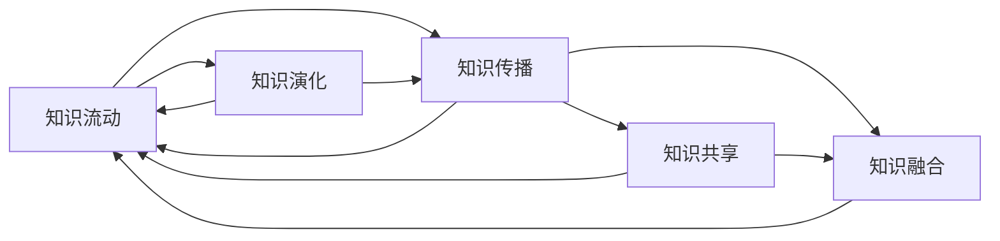

                 

# 知识的流动性：信息时代的知识传播与演化

## 1. 背景介绍

### 1.1 问题由来

在信息时代，知识与信息的流动性变得前所未有的强烈。互联网的普及，使得信息传播的速度和范围均得到大幅提升。知识的获取、分享和创新都发生了根本性转变。在知识传播与演化的过程中，我们面临许多新的挑战和机遇。如何更好地理解和把握这些变化，对信息时代的知识管理与创新具有重要意义。

### 1.2 问题核心关键点

当前，信息时代知识传播与演化的核心关键点包括：
1. **知识流动速率的增加**：随着互联网的发展，知识的获取和传播变得更为迅速，知识的更新周期不断缩短。
2. **信息泛滥与噪声问题**：海量信息的涌入使得有价值信息的甄别变得更加困难，信息过载和噪声干扰问题突出。
3. **知识的价值化与商业化**：知识的传播和利用逐渐与商业价值紧密结合，知识驱动的商业模式日益成熟。
4. **个性化与精准推荐**：随着大数据和机器学习技术的发展，个性化推荐系统成为知识传播与演化的重要手段。
5. **跨界融合与协同创新**：知识的跨界传播和融合成为推动技术创新的重要动力，跨学科合作日益频繁。

### 1.3 问题研究意义

研究信息时代知识传播与演化，对信息技术发展、知识管理、创新驱动等诸多领域具有重要意义：

1. **促进信息技术的发展**：理解知识流动规律，有助于优化信息传播机制，提升信息时代的技术创新效率。
2. **优化知识管理**：通过深入分析知识传播路径和演化趋势，可以优化知识资源的管理与利用，提升知识生产的效率和质量。
3. **支持创新驱动**：把握知识演化的趋势，能够更好地把握知识驱动的商业机会，推动产业升级和创新发展。
4. **解决信息泛滥与噪声问题**：通过知识过滤和推荐技术，提升信息筛选和利用的效率，减轻信息过载问题。
5. **推动跨界融合与协同创新**：了解不同领域知识流动和融合的特点，有助于促进跨学科合作，推动知识驱动的协同创新。

## 2. 核心概念与联系

### 2.1 核心概念概述

在研究知识传播与演化时，我们需要关注以下几个核心概念：

- **知识流动(Knowledge Flow)**：指知识在不同个体、组织和社会间的传递和转移，是知识传播与演化的基本单位。
- **知识传播(Knowledge Dissemination)**：指知识的传播过程，包括知识的产生、存储、传播和应用等环节。
- **知识演化(Knowledge Evolution)**：指知识内容、结构、形态随时间而变化的过程，涉及知识的创造、扩散、融合和固化。
- **知识共享(Knowledge Sharing)**：指个体或组织将知识传递给他人，以供他人获取和利用的行为。
- **知识协同(Knowledge Collaboration)**：指多个主体共同完成知识创造、传播和应用的过程，涉及到协作与互动。

这些核心概念之间存在密切联系，共同构成了知识传播与演化的框架。

### 2.2 核心概念原理和架构的 Mermaid 流程图



这个流程图展示了知识传播与演化的主要流程和路径：
1. 知识流动驱动知识传播。
2. 知识传播促进知识演化。
3. 知识演化驱动知识流动。
4. 知识共享是知识传播的重要手段。
5. 知识融合是知识演化的一种方式。
6. 知识协同是知识传播与演化的高级形式。

## 3. 核心算法原理 & 具体操作步骤
### 3.1 算法原理概述

知识传播与演化的研究可以追溯到信息论和系统科学，其中信息论提供了知识传播的理论基础，系统科学则提供了知识演化的分析方法。近年来，随着大数据和人工智能技术的发展，知识传播与演化的研究逐渐融合了更多技术手段。

在信息时代，知识传播与演化主要遵循以下原理：
1. **信息熵原理**：信息熵表示系统的不确定性，知识传播过程中通过信息熵的减少，实现了知识的共享与传播。
2. **扩散模型**：通过图模型和演化模型描述知识传播的动态过程，分析知识传播路径和传播速度。
3. **协同创新理论**：基于复杂网络理论和多智能体系统理论，研究知识协同创新的机制与规律。
4. **推荐系统**：通过机器学习和数据挖掘技术，提升知识推荐和过滤的效率，解决信息过载问题。
5. **知识图谱**：利用知识图谱技术构建知识表示，促进知识的结构化和关联化，提升知识检索和应用效率。

### 3.2 算法步骤详解

基于以上原理，知识传播与演化的研究步骤一般包括以下几个环节：

**Step 1: 数据收集与预处理**
- 收集知识传播相关的数据，如学术论文、专利、文章等。
- 对数据进行清洗和预处理，如去除噪声、去除重复数据等。

**Step 2: 知识表示与建模**
- 使用向量空间模型、本体论或知识图谱等方法，将知识进行形式化表示。
- 构建知识传播模型，如信息熵模型、扩散模型等，描述知识传播过程。

**Step 3: 知识传播与演化分析**
- 分析知识传播路径和传播速度，识别关键节点和传播路径。
- 研究知识演化趋势，如知识增长、知识结构变化等。

**Step 4: 知识共享与协同创新**
- 研究知识共享策略，如知识推荐系统、知识共享平台等。
- 研究知识协同创新的机制，如跨学科合作网络、协作平台等。

**Step 5: 知识应用与优化**
- 将知识应用于实际问题，如智能问答、知识管理、个性化推荐等。
- 通过优化算法提升知识应用的效率和效果。

### 3.3 算法优缺点

知识传播与演化研究的主要优点包括：
1. **多学科融合**：融合了信息论、系统科学、数据科学等多个学科的理论与方法，提供了综合视角。
2. **数据驱动**：基于大量真实数据进行分析，结果具有较高的可信度和实用性。
3. **方法多样**：结合多种技术手段，如推荐系统、知识图谱等，提供多样化解决方案。

其缺点主要包括：
1. **数据获取难度大**：高质量的数据获取和处理成本较高。
2. **算法复杂度高**：涉及多种复杂算法，实现和应用难度较大。
3. **结果解释性差**：部分算法模型较为复杂，难以提供清晰的解释和可视化。

### 3.4 算法应用领域

知识传播与演化研究的应用领域广泛，涵盖信息时代多个方面：

- **信息检索与推荐**：利用推荐系统和知识图谱技术，提升信息检索和个性化推荐效果。
- **知识管理**：通过知识共享平台和协作工具，优化知识管理流程，提升知识生产效率。
- **智能问答与咨询**：结合知识图谱和自然语言处理技术，实现智能问答与咨询，提升用户体验。
- **跨学科合作**：研究跨学科知识流动与融合，促进跨学科创新合作，推动科技发展。
- **在线教育**：研究知识传播与学习规律，优化在线教育平台的设计与运营。
- **决策支持**：基于知识传播与演化规律，优化决策过程，提升决策效率和质量。

## 4. 数学模型和公式 & 详细讲解
### 4.1 数学模型构建

在知识传播与演化的研究中，我们可以使用多种数学模型来描述和分析知识传播与演化的规律。以下我们将以信息熵模型和扩散模型为例进行详细讲解。

**信息熵模型**：
假设知识传播系统由 $n$ 个节点组成，节点之间存在知识流动。知识在节点之间的流动可以用矩阵 $A$ 表示，其中 $A_{ij}$ 表示节点 $i$ 到节点 $j$ 的知识流动量。信息熵 $H(S)$ 表示系统的整体不确定性，知识传播的目标是通过信息熵的减少，实现知识的共享与传播。

$$
H(S) = -\sum_{i=1}^n p_i \log p_i
$$

其中 $p_i$ 表示节点 $i$ 的知识量占总量的比例。

**扩散模型**：
扩散模型主要研究知识传播的速度和路径。假设知识传播系统由 $n$ 个节点组成，知识在节点之间的传播速度可以用矩阵 $A$ 表示，其中 $A_{ij}$ 表示节点 $i$ 到节点 $j$ 的知识传播速度。知识传播的速度可以通过以下公式计算：

$$
v_i = \sum_{j=1}^n A_{ij}
$$

知识传播的速度 $v_i$ 表示节点 $i$ 的知识传播速率。

### 4.2 公式推导过程

**信息熵模型推导**：
1. 首先定义信息熵 $H(S)$ 的计算公式：
   $$
   H(S) = -\sum_{i=1}^n p_i \log p_i
   $$
2. 根据知识传播系统的定义，知识量 $p_i$ 可以通过矩阵 $A$ 表示为：
   $$
   p_i = \frac{\sum_{j=1}^n A_{ij}}{\sum_{j=1}^n \sum_{k=1}^n A_{ik}}
   $$
3. 代入信息熵公式，得：
   $$
   H(S) = -\sum_{i=1}^n \frac{\sum_{j=1}^n A_{ij}}{\sum_{j=1}^n \sum_{k=1}^n A_{ik}} \log \frac{\sum_{j=1}^n A_{ij}}{\sum_{j=1}^n \sum_{k=1}^n A_{ik}}
   $$

**扩散模型推导**：
1. 首先定义节点 $i$ 的知识传播速率 $v_i$ 的计算公式：
   $$
   v_i = \sum_{j=1}^n A_{ij}
   $$
2. 根据知识传播矩阵 $A$，节点 $j$ 的知识传播速率 $v_j$ 可以通过以下公式计算：
   $$
   v_j = \sum_{i=1}^n A_{ij}
   $$
3. 将 $v_i$ 和 $v_j$ 代入节点知识传播速率的计算公式，得：
   $$
   v_i = \sum_{j=1}^n A_{ij} = \sum_{j=1}^n v_j A_{ji}
   $$

### 4.3 案例分析与讲解

**案例1: 学术出版系统**
学术出版系统是一种典型的知识传播与演化系统。在学术出版系统中，知识通过论文和引用关系传播。假设一个学术出版系统有 $n$ 个研究机构，每个机构发表的论文数为 $p_i$，相互引用的论文数为 $A_{ij}$。

**计算信息熵**：
1. 首先收集各机构发表的论文数 $p_i$，和相互引用的论文数 $A_{ij}$。
2. 计算每个机构的信息熵 $H(S)$，即学术出版系统的整体不确定性。

**计算知识传播速率**：
1. 收集各机构的论文引用关系 $A_{ij}$，计算每个机构的论文传播速率 $v_i$。
2. 根据知识传播速率公式，计算每个机构的知识传播速率 $v_i$。

**案例2: 社交网络系统**
社交网络系统是另一种典型的知识传播与演化系统。在社交网络系统中，知识通过用户的分享与互动传播。假设一个社交网络系统有 $n$ 个用户，每个用户发布的知识量为 $p_i$，相互分享的次数为 $A_{ij}$。

**计算信息熵**：
1. 收集各用户发布的知识量 $p_i$，和相互分享的次数 $A_{ij}$。
2. 计算每个用户的信息熵 $H(S)$，即社交网络系统的整体不确定性。

**计算知识传播速率**：
1. 收集各用户分享的次数 $A_{ij}$，计算每个用户的知识传播速率 $v_i$。
2. 根据知识传播速率公式，计算每个用户的知识传播速率 $v_i$。

## 5. 项目实践：代码实例和详细解释说明
### 5.1 开发环境搭建

在进行知识传播与演化研究时，我们需要准备好开发环境。以下是使用Python进行信息熵模型和扩散模型的环境配置流程：

1. 安装Anaconda：从官网下载并安装Anaconda，用于创建独立的Python环境。

2. 创建并激活虚拟环境：
```bash
conda create -n knowledge-flow-env python=3.8 
conda activate knowledge-flow-env
```

3. 安装相关依赖：
```bash
conda install numpy pandas matplotlib networkx scipy scikit-learn
```

4. 安装Jupyter Notebook：
```bash
conda install jupyterlab
```

完成上述步骤后，即可在`knowledge-flow-env`环境中开始项目实践。

### 5.2 源代码详细实现

下面以信息熵模型和扩散模型为例，给出Python代码实现。

**信息熵模型**：
```python
import numpy as np

def entropy(p):
    return -np.sum(p * np.log(p))

def information_entropy(matrix):
    n, m = matrix.shape
    p = np.sum(matrix, axis=0) / np.sum(matrix)
    return entropy(p)
```

**扩散模型**：
```python
import networkx as nx

def diffusion_speed(matrix):
    n, m = matrix.shape
    diffusion_matrix = nx.from_numpy_matrix(matrix)
    degree = nx.degree_centrality(diffusion_matrix)
    return np.array([sum(diffusion_matrix[i, :]) for i in range(n)], dtype=float)
```

### 5.3 代码解读与分析

**信息熵模型代码**：
1. `entropy`函数计算单个节点 $i$ 的信息熵，使用 $\log$ 底数的自然对数。
2. `information_entropy`函数计算整个知识传播系统的信息熵，通过矩阵 $A$ 计算节点信息熵的平均值。

**扩散模型代码**：
1. `diffusion_speed`函数计算每个节点的知识传播速率 $v_i$，使用NetworkX库计算节点度数。
2. 根据知识传播速率公式，计算每个节点 $i$ 的知识传播速率。

## 6. 实际应用场景
### 6.1 社交网络知识传播分析

在社交网络中，知识传播的速度和路径对信息传播效果有着重要影响。通过分析社交网络的知识传播路径和速率，可以优化信息传播策略，提升信息传播效率。

**实际应用案例**：
- **微博**：分析微博上的知识传播路径和速率，优化热门话题的传播策略，提高信息传播速度和范围。
- **微信**：通过微信朋友圈的分享和互动分析，优化知识传播策略，提升用户对高质量内容的分享意愿。

**技术实现**：
1. 收集社交网络的知识传播数据，如分享次数、互动次数等。
2. 构建社交网络的知识传播模型，使用信息熵模型和扩散模型进行计算和分析。
3. 根据分析结果，优化信息传播策略，提升传播效果。

### 6.2 学术出版系统知识传播分析

学术出版系统中的知识传播和演化对科学研究和技术进步有着重要影响。通过分析学术出版系统中的知识传播路径和速率，可以优化知识传播渠道，提升科研合作效率。

**实际应用案例**：
- **ACM**：分析ACM数据库中的论文引用关系，优化论文推荐算法，提升论文的传播效率。
- **Nature**：通过分析Nature期刊的论文引用关系，优化论文传播策略，提升科研合作的效率。

**技术实现**：
1. 收集学术出版系统的知识传播数据，如论文引用次数、引用关系等。
2. 构建学术出版系统的知识传播模型，使用信息熵模型和扩散模型进行计算和分析。
3. 根据分析结果，优化论文推荐算法和传播策略，提升科研合作效率。

## 7. 工具和资源推荐
### 7.1 学习资源推荐

为了帮助开发者系统掌握知识传播与演化的理论基础和实践技巧，这里推荐一些优质的学习资源：

1. **《信息论与数据科学》系列书籍**：深入浅出地介绍了信息熵原理、扩散模型等基本概念，适合初学者入门。
2. **Coursera《数据科学与机器学习》课程**：斯坦福大学开设的机器学习课程，涵盖大数据分析、推荐系统等知识传播相关内容。
3. **Kaggle竞赛平台**：通过参与Kaggle竞赛，可以积累实际应用经验，提升数据处理和分析能力。
4. **Google Scholar**：利用Google Scholar查找相关论文，获取最新的研究成果和前沿技术。

通过对这些资源的学习实践，相信你一定能够快速掌握知识传播与演化的精髓，并用于解决实际的NLP问题。

### 7.2 开发工具推荐

高效的开发离不开优秀的工具支持。以下是几款用于知识传播与演化研究的常用工具：

1. **Jupyter Notebook**：交互式开发环境，适合数据分析和模型实现。
2. **Matplotlib**：数据可视化库，支持绘制各种统计图表。
3. **Scikit-learn**：机器学习库，提供多种数据分析和模型实现工具。
4. **NetworkX**：社交网络和复杂系统分析库，支持构建和分析复杂网络。
5. **TensorFlow**：深度学习框架，支持构建复杂的深度学习模型。

合理利用这些工具，可以显著提升知识传播与演化研究的开发效率，加快创新迭代的步伐。

### 7.3 相关论文推荐

知识传播与演化研究源于学界的持续研究。以下是几篇奠基性的相关论文，推荐阅读：

1. **《复杂网络中的信息传播》**：研究复杂网络中的信息传播规律，分析知识传播路径和速度。
2. **《知识传播与协同创新》**：利用复杂网络理论和多智能体系统理论，研究知识协同创新的机制与规律。
3. **《推荐系统中的知识过滤》**：研究推荐系统中的知识过滤和推荐算法，提升信息筛选和利用的效率。
4. **《知识图谱与信息检索》**：利用知识图谱技术，提升信息检索和知识应用的效果。
5. **《学术出版系统中的知识传播》**：研究学术出版系统中的知识传播规律，优化论文推荐算法。

这些论文代表了大规模知识传播与演化研究的发展脉络。通过学习这些前沿成果，可以帮助研究者把握学科前进方向，激发更多的创新灵感。

## 8. 总结：未来发展趋势与挑战
### 8.1 研究成果总结

本文对信息时代知识传播与演化的原理和实践进行了全面系统的介绍。首先，我们从知识传播与演化的基本概念出发，详细讲解了信息熵模型和扩散模型等关键原理。其次，我们通过具体案例展示了知识传播与演化的实际应用，包括社交网络和学术出版系统。最后，我们推荐了一些学习资源、开发工具和相关论文，以期为读者提供全方位的技术指引。

通过本文的系统梳理，可以看到，信息时代的知识传播与演化具有重要意义，其理论和方法对信息技术发展、知识管理、创新驱动等领域具有广泛应用。未来，随着技术的不断发展，知识传播与演化研究将面临新的挑战和机遇。

### 8.2 未来发展趋势

展望未来，知识传播与演化研究将呈现以下几个发展趋势：

1. **多模态知识传播**：结合文本、图像、视频等多种模态的信息传播，提升知识传播的全面性和深度。
2. **知识传播网络**：构建知识传播网络，分析知识传播路径和节点特征，优化知识传播策略。
3. **知识传播算法**：研究新的知识传播算法，提升知识传播效率和效果。
4. **知识协同与创新**：研究知识协同与创新机制，促进跨学科合作与创新。
5. **知识驱动的智能决策**：基于知识传播与演化规律，优化决策过程，提升决策效率和质量。

这些趋势凸显了知识传播与演化研究的广阔前景，将为知识驱动的智能决策提供理论基础和方法支撑。

### 8.3 面临的挑战

尽管知识传播与演化研究已经取得了显著进展，但在迈向更加智能化、普适化应用的过程中，仍面临诸多挑战：

1. **数据获取难度**：高质量的知识传播数据获取和处理成本较高，需要耗费大量时间和资源。
2. **算法复杂度**：涉及多种复杂算法，实现和应用难度较大。
3. **结果解释性**：部分算法模型较为复杂，难以提供清晰的解释和可视化。
4. **跨学科合作**：知识传播与演化研究涉及多个学科领域，需要跨学科合作，协调各方的需求和目标。
5. **隐私与安全**：知识传播过程中涉及大量个人隐私信息，需要保障数据安全和隐私保护。

### 8.4 研究展望

面对知识传播与演化研究面临的挑战，未来的研究方向可以从以下几个方面进行探索：

1. **优化数据获取与处理**：探索高效的数据获取与处理方法，降低知识传播与演化研究的数据获取难度。
2. **简化算法模型**：研究更加简单有效的算法模型，提高知识传播与演化研究的可实现性和可操作性。
3. **增强结果解释性**：开发更加直观易懂的算法模型，提升知识传播与演化研究的可视化与解释能力。
4. **推动跨学科合作**：促进跨学科合作与交流，形成更加完善的知识传播与演化研究体系。
5. **保障数据安全**：研究隐私保护与数据安全技术，确保知识传播过程中的数据隐私与安全。

这些研究方向将有助于推动知识传播与演化研究的进一步发展，为知识驱动的智能决策提供坚实基础。

## 9. 附录：常见问题与解答

**Q1: 信息熵模型和扩散模型有什么区别？**

A: 信息熵模型主要用于计算系统的整体不确定性，而扩散模型主要用于分析知识在节点之间的传播速度和路径。信息熵模型适用于描述系统的静态特性，而扩散模型适用于描述系统的动态特性。

**Q2: 如何优化知识传播策略？**

A: 知识传播策略的优化需要综合考虑多种因素，如节点度数、知识量、知识传播速度等。可以通过构建知识传播网络、优化节点度数分配、调整知识传播速率等方法，提升知识传播效率和效果。

**Q3: 知识传播与演化研究的应用场景有哪些？**

A: 知识传播与演化研究的应用场景广泛，包括社交网络、学术出版、智能问答、在线教育等。通过优化知识传播策略，提升信息传播效率和效果，推动知识驱动的智能决策。

**Q4: 知识传播与演化研究的技术难点有哪些？**

A: 知识传播与演化研究的技术难点包括数据获取难度、算法复杂度、结果解释性、跨学科合作、隐私与安全等。需要结合多种技术和方法，解决这些难题，才能更好地实现知识传播与演化研究的目标。

通过回答这些问题，我们可以更好地理解知识传播与演化研究的技术细节和应用场景，为实际应用提供指导和参考。

