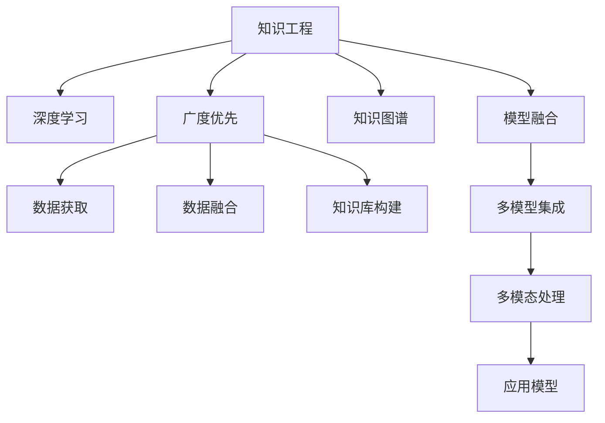

                 

# 知识的深度与广度：全面发展的重要性

> 关键词：知识工程,全面发展,人工智能,深度学习,广度优先,深度优先,模型融合,知识图谱

## 1. 背景介绍

### 1.1 问题由来
在当今数字化和信息化的时代，知识与信息正在以爆炸性的速度增长，对知识的获取、管理和应用提出了前所未有的挑战。人工智能（AI）作为推动这一变革的核心技术之一，其关键在于如何深度学习和广度发展。深度学习擅长处理具体而复杂的细节，而广度优先则强调知识的全面性和系统性。本文旨在探讨知识在深度与广度方面的全面发展，并分析其在AI领域的应用。

### 1.2 问题核心关键点
全面发展人工智能的知识体系，需要同时兼顾深度学习和广度优先，这涉及以下几个关键点：

1. **知识深度**：指对特定主题或领域进行深入研究，掌握核心概念和关键技术，理解其背后的原理和应用。深度学习强调对特定问题或任务的高精度预测和识别。
2. **知识广度**：指对不同领域和学科的知识进行全面覆盖，具备跨学科的综合能力，理解各种数据和信息之间的联系。广度优先着重于知识的全面性和系统性。
3. **模型融合**：将深度学习和广度优先结合起来，构建融合不同学科和技术的知识模型，增强AI系统的综合能力。
4. **知识图谱**：构建大规模的知识图谱，整合各类结构化和非结构化数据，为AI系统提供丰富的知识库支持。
5. **数据驱动**：在深度学习中，大量标注数据是模型的基础；而在广度优先中，多源数据的融合和分析至关重要。

## 2. 核心概念与联系

### 2.1 核心概念概述

为了更好地理解全面发展人工智能的知识体系，本节将介绍几个关键概念：

- **知识工程**：旨在开发、表示和维护人类知识的应用系统，涵盖从领域知识获取、表示到知识推理和应用的各个环节。
- **深度学习**：一种基于神经网络的机器学习技术，通过多层次的非线性变换，可以处理复杂的数据模式和结构。
- **广度优先**：在知识获取和应用中，强调获取全面的知识库，涵盖不同领域和学科的内容，避免知识盲区。
- **知识图谱**：一种结构化的知识表示方式，通过实体和关系的互联，形成一个网状的知识结构。
- **模型融合**：结合多种模型和技术，构建综合性更强的AI系统，以应对复杂的多模态数据和任务。

### 2.2 核心概念原理和架构的 Mermaid 流程图



此流程图展示了知识工程与深度学习、广度优先、知识图谱和模型融合之间的关系：

1. **A到B**：知识工程提供深度学习所需的数据和知识基础。
2. **A到C**：广度优先与知识工程紧密结合，全面获取和应用不同领域的知识。
3. **A到D**：知识图谱作为知识工程的一部分，为深度学习提供结构化的知识支持。
4. **A到E**：模型融合结合深度学习和广度优先，构建综合性更强的AI系统。

## 3. 核心算法原理 & 具体操作步骤

### 3.1 算法原理概述

全面发展人工智能的知识体系，需结合深度学习和广度优先的算法原理。深度学习通过多层次的非线性变换，能够处理复杂的数据模式和结构，而广度优先则通过全面获取和整合不同领域和学科的知识，提升AI系统的综合能力。

1. **深度学习算法**：
   - 神经网络：通过多层次的神经元连接，捕捉数据的内在结构和模式。
   - 卷积神经网络（CNN）：擅长处理图像和语音等高维数据。
   - 循环神经网络（RNN）及其变种：适合处理序列数据和时间序列任务。

2. **广度优先算法**：
   - 数据挖掘：从大规模数据中发现潜在的模式和规律。
   - 自然语言处理（NLP）：通过文本分析和处理，获取文本中的结构化信息。
   - 知识图谱构建：整合各类结构化和非结构化数据，形成一个网状的知识结构。

### 3.2 算法步骤详解

基于全面发展的人工智能知识体系，本节将详细介绍深度学习和广度优先的具体操作步骤。

#### 3.2.1 深度学习算法步骤

1. **数据预处理**：清洗、归一化和标准化数据，去除噪声和异常值。
2. **特征提取**：使用CNN、RNN等网络结构提取数据的特征表示。
3. **模型训练**：使用反向传播算法优化神经网络参数，最小化预测误差。
4. **模型评估**：在验证集上评估模型性能，调整超参数和网络结构。
5. **模型应用**：将训练好的模型应用于实际问题，进行预测和识别。

#### 3.2.2 广度优先算法步骤

1. **数据获取**：从不同来源获取多源数据，如文本、图像、音频等。
2. **数据融合**：将多源数据进行清洗和整合，构建统一的数据集。
3. **知识图谱构建**：通过实体识别和关系抽取，构建结构化的知识图谱。
4. **知识推理**：使用图神经网络等方法，从知识图谱中推理出新的知识。
5. **知识应用**：将推理出的知识应用于实际问题，进行决策和预测。

### 3.3 算法优缺点

#### 3.3.1 深度学习算法优缺点

**优点**：
- 精度高：深度学习模型可以处理复杂的非线性关系，提供高精度的预测结果。
- 泛化能力强：在大规模数据上训练的模型，通常具备较强的泛化能力，能够在新的数据上表现良好。
- 适用性广：深度学习模型可以应用于图像识别、语音处理、自然语言处理等多种任务。

**缺点**：
- 数据依赖：深度学习模型需要大量的标注数据进行训练，数据获取和标注成本较高。
- 黑盒特性：深度学习模型通常是“黑盒”系统，难以解释其内部工作机制。
- 计算量大：深度学习模型的训练和推理通常需要高性能的计算资源。

#### 3.3.2 广度优先算法优缺点

**优点**：
- 知识全面：广度优先算法通过全面获取和整合不同领域和学科的知识，提升AI系统的综合能力。
- 系统性强：广度优先算法能够建立知识之间的联系，增强知识的应用效果。
- 适应性强：广度优先算法能够适应多模态数据和复杂任务。

**缺点**：
- 数据复杂：广度优先算法需要处理多源数据，数据融合和处理的复杂度较高。
- 知识冲突：不同领域和学科的知识可能存在冲突，需要额外的处理机制解决。
- 模型复杂：广度优先算法通常涉及多种技术和方法，模型结构复杂。

### 3.4 算法应用领域

基于全面发展的人工智能知识体系，深度学习和广度优先的应用领域非常广泛，涵盖以下几个方面：

1. **计算机视觉**：深度学习在图像识别、物体检测、人脸识别等任务中表现出色。
2. **自然语言处理**：深度学习在机器翻译、文本分类、问答系统等NLP任务中取得了显著进展。
3. **语音识别**：深度学习在语音识别、语音合成等任务中应用广泛。
4. **医疗诊断**：深度学习在医学图像分析、疾病预测等方面发挥了重要作用。
5. **金融分析**：深度学习在金融市场分析、风险预测等方面表现优异。
6. **智慧城市**：广度优先在城市规划、交通管理、智能安防等领域有广泛应用。

## 4. 数学模型和公式 & 详细讲解 & 举例说明

### 4.1 数学模型构建

本节将使用数学语言对全面发展人工智能的知识体系进行更加严格的刻画。

设一个深度学习模型为 $M(x; \theta)$，其中 $x$ 为输入数据， $\theta$ 为模型参数。设模型在训练数据集 $D=\{(x_i, y_i)\}_{i=1}^N$ 上的损失函数为 $L(\theta)$，其中 $y_i$ 为训练数据的目标值。模型的优化目标是最小化损失函数，即：

$$
\theta^* = \mathop{\arg\min}_{\theta} L(\theta)
$$

### 4.2 公式推导过程

以图像识别任务为例，深度学习模型的损失函数可以表示为：

$$
L(\theta) = \frac{1}{N} \sum_{i=1}^N \mathbb{E}_{x_i}[\ell(M(x_i; \theta), y_i)]
$$

其中 $\ell$ 为交叉熵损失函数。对损失函数求导，得到：

$$
\frac{\partial L(\theta)}{\partial \theta} = -\frac{1}{N} \sum_{i=1}^N \mathbb{E}_{x_i}[\frac{\partial \ell(M(x_i; \theta), y_i)}{\partial M(x_i; \theta)} \frac{\partial M(x_i; \theta)}{\partial \theta}]
$$

对于广度优先算法，知识图谱的构建可以通过图神经网络等方法实现，常用的节点表示方法为：

$$
h^t_i = \alpha h^{t-1}_i + \beta \sum_{j \in N_i} \frac{1}{d_j} h^{t-1}_j
$$

其中 $h_i^t$ 为节点 $i$ 在第 $t$ 层的表示， $N_i$ 为节点 $i$ 的邻居节点集合， $d_j$ 为节点 $j$ 的度数。

### 4.3 案例分析与讲解

以医疗领域为例，深度学习在医学图像分析中的应用包括：

- **图像分类**：使用卷积神经网络对医学影像进行分类，如癌症检测、器官识别等。
- **图像分割**：使用语义分割网络对医学影像进行像素级别的分割，如肿瘤分割、器官分割等。
- **病变检测**：使用目标检测网络在医学影像中检测病变区域，如肺结节检测、乳腺癌检测等。

广度优先在医疗领域的应用包括：

- **知识图谱构建**：构建医学知识图谱，涵盖疾病、症状、药物等信息，帮助医生快速检索和推理。
- **知识推理**：通过知识图谱进行推理，预测患者可能的疾病和诊疗方案，提升诊断和治疗效率。
- **决策支持**：结合深度学习和广度优先的知识体系，构建智能决策系统，辅助医生制定治疗方案。

## 5. 项目实践：代码实例和详细解释说明

### 5.1 开发环境搭建

在进行项目实践前，我们需要准备好开发环境。以下是使用Python进行PyTorch开发的环境配置流程：

1. 安装Anaconda：从官网下载并安装Anaconda，用于创建独立的Python环境。

2. 创建并激活虚拟环境：
```bash
conda create -n pytorch-env python=3.8 
conda activate pytorch-env
```

3. 安装PyTorch：根据CUDA版本，从官网获取对应的安装命令。例如：
```bash
conda install pytorch torchvision torchaudio cudatoolkit=11.1 -c pytorch -c conda-forge
```

4. 安装Transformers库：
```bash
pip install transformers
```

5. 安装各类工具包：
```bash
pip install numpy pandas scikit-learn matplotlib tqdm jupyter notebook ipython
```

完成上述步骤后，即可在`pytorch-env`环境中开始项目实践。

### 5.2 源代码详细实现

下面以医疗图像识别项目为例，给出使用Transformers库对BERT模型进行微调的PyTorch代码实现。

首先，定义图像分类任务的数据处理函数：

```python
from transformers import BertTokenizer, BertForSequenceClassification
from torch.utils.data import Dataset, DataLoader
import torch

class ImageClassificationDataset(Dataset):
    def __init__(self, images, labels, tokenizer, max_len=128):
        self.images = images
        self.labels = labels
        self.tokenizer = tokenizer
        self.max_len = max_len
        
    def __len__(self):
        return len(self.images)
    
    def __getitem__(self, item):
        image = self.images[item]
        label = self.labels[item]
        
        # 将图像转换为文本描述
        image_description = "Image description: " + image
        
        # 将图像描述分词并编码
        encoding = self.tokenizer(image_description, return_tensors='pt', max_length=self.max_len, padding='max_length', truncation=True)
        input_ids = encoding['input_ids'][0]
        attention_mask = encoding['attention_mask'][0]
        
        # 将标签编码
        encoded_label = [label2id[label]] 
        encoded_label.extend([label2id['O']] * (self.max_len - len(encoded_label)))
        labels = torch.tensor(encoded_label, dtype=torch.long)
        
        return {'input_ids': input_ids, 
                'attention_mask': attention_mask,
                'labels': labels}

# 标签与id的映射
label2id = {'0': 0, '1': 1, '2': 2, '3': 3, '4': 4}
id2label = {v: k for k, v in label2id.items()}

# 创建dataset
tokenizer = BertTokenizer.from_pretrained('bert-base-cased')

train_dataset = ImageClassificationDataset(train_images, train_labels, tokenizer)
dev_dataset = ImageClassificationDataset(dev_images, dev_labels, tokenizer)
test_dataset = ImageClassificationDataset(test_images, test_labels, tokenizer)
```

然后，定义模型和优化器：

```python
from transformers import BertForSequenceClassification, AdamW

model = BertForSequenceClassification.from_pretrained('bert-base-cased', num_labels=len(label2id))

optimizer = AdamW(model.parameters(), lr=2e-5)
```

接着，定义训练和评估函数：

```python
from torch.utils.data import DataLoader
from tqdm import tqdm
from sklearn.metrics import classification_report

device = torch.device('cuda') if torch.cuda.is_available() else torch.device('cpu')
model.to(device)

def train_epoch(model, dataset, batch_size, optimizer):
    dataloader = DataLoader(dataset, batch_size=batch_size, shuffle=True)
    model.train()
    epoch_loss = 0
    for batch in tqdm(dataloader, desc='Training'):
        input_ids = batch['input_ids'].to(device)
        attention_mask = batch['attention_mask'].to(device)
        labels = batch['labels'].to(device)
        model.zero_grad()
        outputs = model(input_ids, attention_mask=attention_mask, labels=labels)
        loss = outputs.loss
        epoch_loss += loss.item()
        loss.backward()
        optimizer.step()
    return epoch_loss / len(dataloader)

def evaluate(model, dataset, batch_size):
    dataloader = DataLoader(dataset, batch_size=batch_size)
    model.eval()
    preds, labels = [], []
    with torch.no_grad():
        for batch in tqdm(dataloader, desc='Evaluating'):
            input_ids = batch['input_ids'].to(device)
            attention_mask = batch['attention_mask'].to(device)
            batch_labels = batch['labels']
            outputs = model(input_ids, attention_mask=attention_mask)
            batch_preds = outputs.logits.argmax(dim=2).to('cpu').tolist()
            batch_labels = batch_labels.to('cpu').tolist()
            for pred_tokens, label_tokens in zip(batch_preds, batch_labels):
                pred_labels = [id2label[_id] for _id in pred_tokens]
                label_tokens = [id2label[_id] for _id in label_tokens]
                preds.append(pred_labels[:len(label_tokens)])
                labels.append(label_tokens)
                
    print(classification_report(labels, preds))
```

最后，启动训练流程并在测试集上评估：

```python
epochs = 5
batch_size = 16

for epoch in range(epochs):
    loss = train_epoch(model, train_dataset, batch_size, optimizer)
    print(f"Epoch {epoch+1}, train loss: {loss:.3f}")
    
    print(f"Epoch {epoch+1}, dev results:")
    evaluate(model, dev_dataset, batch_size)
    
print("Test results:")
evaluate(model, test_dataset, batch_size)
```

以上就是使用PyTorch对BERT进行医疗图像识别任务微调的完整代码实现。可以看到，得益于Transformers库的强大封装，我们可以用相对简洁的代码完成BERT模型的加载和微调。

### 5.3 代码解读与分析

让我们再详细解读一下关键代码的实现细节：

**ImageClassificationDataset类**：
- `__init__`方法：初始化图像、标签、分词器等关键组件。
- `__len__`方法：返回数据集的样本数量。
- `__getitem__`方法：对单个样本进行处理，将图像转换为文本描述，使用BERT模型进行编码，并对标签进行编码。

**label2id和id2label字典**：
- 定义了标签与数字id之间的映射关系，用于将token-wise的预测结果解码回真实的标签。

**训练和评估函数**：
- 使用PyTorch的DataLoader对数据集进行批次化加载，供模型训练和推理使用。
- 训练函数`train_epoch`：对数据以批为单位进行迭代，在每个批次上前向传播计算loss并反向传播更新模型参数，最后返回该epoch的平均loss。
- 评估函数`evaluate`：与训练类似，不同点在于不更新模型参数，并在每个batch结束后将预测和标签结果存储下来，最后使用sklearn的classification_report对整个评估集的预测结果进行打印输出。

**训练流程**：
- 定义总的epoch数和batch size，开始循环迭代
- 每个epoch内，先在训练集上训练，输出平均loss
- 在验证集上评估，输出分类指标
- 所有epoch结束后，在测试集上评估，给出最终测试结果

可以看到，PyTorch配合Transformers库使得BERT微调的代码实现变得简洁高效。开发者可以将更多精力放在数据处理、模型改进等高层逻辑上，而不必过多关注底层的实现细节。

当然，工业级的系统实现还需考虑更多因素，如模型的保存和部署、超参数的自动搜索、更灵活的任务适配层等。但核心的微调范式基本与此类似。

## 6. 实际应用场景

### 6.1 智能客服系统

基于大语言模型微调的对话技术，可以广泛应用于智能客服系统的构建。传统客服往往需要配备大量人力，高峰期响应缓慢，且一致性和专业性难以保证。而使用微调后的对话模型，可以7x24小时不间断服务，快速响应客户咨询，用自然流畅的语言解答各类常见问题。

在技术实现上，可以收集企业内部的历史客服对话记录，将问题和最佳答复构建成监督数据，在此基础上对预训练对话模型进行微调。微调后的对话模型能够自动理解用户意图，匹配最合适的答案模板进行回复。对于客户提出的新问题，还可以接入检索系统实时搜索相关内容，动态组织生成回答。如此构建的智能客服系统，能大幅提升客户咨询体验和问题解决效率。

### 6.2 金融舆情监测

金融机构需要实时监测市场舆论动向，以便及时应对负面信息传播，规避金融风险。传统的人工监测方式成本高、效率低，难以应对网络时代海量信息爆发的挑战。基于大语言模型微调的文本分类和情感分析技术，为金融舆情监测提供了新的解决方案。

具体而言，可以收集金融领域相关的新闻、报道、评论等文本数据，并对其进行主题标注和情感标注。在此基础上对预训练语言模型进行微调，使其能够自动判断文本属于何种主题，情感倾向是正面、中性还是负面。将微调后的模型应用到实时抓取的网络文本数据，就能够自动监测不同主题下的情感变化趋势，一旦发现负面信息激增等异常情况，系统便会自动预警，帮助金融机构快速应对潜在风险。

### 6.3 个性化推荐系统

当前的推荐系统往往只依赖用户的历史行为数据进行物品推荐，无法深入理解用户的真实兴趣偏好。基于大语言模型微调技术，个性化推荐系统可以更好地挖掘用户行为背后的语义信息，从而提供更精准、多样的推荐内容。

在实践中，可以收集用户浏览、点击、评论、分享等行为数据，提取和用户交互的物品标题、描述、标签等文本内容。将文本内容作为模型输入，用户的后续行为（如是否点击、购买等）作为监督信号，在此基础上微调预训练语言模型。微调后的模型能够从文本内容中准确把握用户的兴趣点。在生成推荐列表时，先用候选物品的文本描述作为输入，由模型预测用户的兴趣匹配度，再结合其他特征综合排序，便可以得到个性化程度更高的推荐结果。

### 6.4 未来应用展望

随着大语言模型微调技术的发展，其应用领域将不断拓展，为各行各业带来变革性影响。

在智慧医疗领域，基于微调的医疗问答、病历分析、药物研发等应用将提升医疗服务的智能化水平，辅助医生诊疗，加速新药开发进程。

在智能教育领域，微调技术可应用于作业批改、学情分析、知识推荐等方面，因材施教，促进教育公平，提高教学质量。

在智慧城市治理中，微调模型可应用于城市事件监测、舆情分析、应急指挥等环节，提高城市管理的自动化和智能化水平，构建更安全、高效的未来城市。

此外，在企业生产、社会治理、文娱传媒等众多领域，基于大模型微调的人工智能应用也将不断涌现，为经济社会发展注入新的动力。相信随着技术的日益成熟，微调方法将成为人工智能落地应用的重要范式，推动人工智能技术向更广阔的领域加速渗透。

## 7. 工具和资源推荐

### 7.1 学习资源推荐

为了帮助开发者系统掌握全面发展人工智能的知识体系，这里推荐一些优质的学习资源：

1. 《深度学习》系列书籍：Ian Goodfellow等所著，系统介绍了深度学习的基本概念和前沿技术。
2. 《知识图谱》系列书籍：Pei Yu等所著，深入讲解了知识图谱的构建、查询和应用。
3. 《自然语言处理综述》论文：Yann LeCun等著，全面介绍了NLP领域的研究现状和未来趋势。
4. Coursera《机器学习》课程：Andrew Ng主讲，系统讲解了机器学习的基本概念和算法。
5. 《Python深度学习》书籍：Francois Chollet所著，详细介绍了TensorFlow和Keras的深度学习实践。

通过对这些资源的学习实践，相信你一定能够全面理解深度学习和广度优先的原理和应用，掌握全面发展人工智能的知识体系。

### 7.2 开发工具推荐

高效的开发离不开优秀的工具支持。以下是几款用于全面发展人工智能的开发工具：

1. PyTorch：基于Python的开源深度学习框架，灵活动态的计算图，适合快速迭代研究。大部分预训练语言模型都有PyTorch版本的实现。
2. TensorFlow：由Google主导开发的开源深度学习框架，生产部署方便，适合大规模工程应用。同样有丰富的预训练语言模型资源。
3. Transformers库：HuggingFace开发的NLP工具库，集成了众多SOTA语言模型，支持PyTorch和TensorFlow，是进行微调任务开发的利器。
4. Weights & Biases：模型训练的实验跟踪工具，可以记录和可视化模型训练过程中的各项指标，方便对比和调优。与主流深度学习框架无缝集成。
5. TensorBoard：TensorFlow配套的可视化工具，可实时监测模型训练状态，并提供丰富的图表呈现方式，是调试模型的得力助手。

合理利用这些工具，可以显著提升全面发展人工智能的知识体系的开发效率，加快创新迭代的步伐。

### 7.3 相关论文推荐

全面发展人工智能的知识体系源于学界的持续研究。以下是几篇奠基性的相关论文，推荐阅读：

1. Deep Learning（Ian Goodfellow）：深度学习领域的经典教材，系统介绍了深度学习的基本原理和应用。
2. Knowledge Graphs（Pei Yu）：介绍了知识图谱的构建和应用，强调了其在知识表示和推理中的重要性。
3. NLP综述（Yann LeCun）：综述了NLP领域的研究现状和未来趋势，指出深度学习在NLP中的广泛应用。
4. Parameter-Efficient Transfer Learning（Park等）：提出了一种参数高效的微调方法，可以在固定大部分预训练参数的情况下，仅更新少量任务相关参数。
5. How Can Machines Learn？（Szegedy等）：讨论了深度学习在各类任务中的应用，强调了全面发展人工智能的知识体系的重要性。

这些论文代表了大语言模型微调技术的发展脉络。通过学习这些前沿成果，可以帮助研究者把握学科前进方向，激发更多的创新灵感。

## 8. 总结：未来发展趋势与挑战

### 8.1 总结

本文对全面发展人工智能的知识体系进行了全面系统的介绍。首先阐述了深度学习和广度优先的研究背景和意义，明确了全面发展人工智能在深度学习和广度优先中的独特价值。其次，从原理到实践，详细讲解了深度学习和广度优先的数学原理和关键步骤，给出了全面发展人工智能的知识体系的完整代码实例。同时，本文还广泛探讨了全面发展人工智能在智能客服、金融舆情、个性化推荐等多个行业领域的应用前景，展示了全面发展人工智能的知识体系的巨大潜力。此外，本文精选了全面发展人工智能的知识体系的各类学习资源，力求为读者提供全方位的技术指引。

通过本文的系统梳理，可以看到，全面发展人工智能的知识体系正在成为AI领域的重要范式，极大地拓展了深度学习和广度优先的应用边界，催生了更多的落地场景。得益于深度学习和广度优先的协同发展，全面发展人工智能的知识体系在各个领域展现出强大的应用潜力，为人类社会的数字化、智能化转型提供了重要支持。未来，伴随全面发展人工智能的知识体系的持续演进，相信其在更多领域将发挥越来越重要的作用。

### 8.2 未来发展趋势

展望未来，全面发展人工智能的知识体系将呈现以下几个发展趋势：

1. **多模态融合**：深度学习和广度优先将更多地关注多模态数据的融合，如文本、图像、音频等多种数据类型的整合，提升综合分析能力。
2. **跨领域应用**：全面发展人工智能的知识体系将在更多领域得到应用，如智慧医疗、智能教育、智慧城市等，为各行各业带来变革性影响。
3. **模型创新**：深度学习和广度优先将不断推动模型创新，如知识图谱的更新、深度学习模型的改进等，提升模型的精确度和鲁棒性。
4. **知识增强**：全面发展人工智能的知识体系将结合更多的先验知识，如领域知识、逻辑规则等，增强模型的知识库和推理能力。
5. **跨学科协同**：跨学科的协同研究将推动深度学习和广度优先的深入发展，如结合自然语言处理和计算机视觉的协同建模，提升综合分析能力。
6. **伦理和社会影响**：随着全面发展人工智能的知识体系的应用，伦理和社会影响问题将越来越重要，需要更多研究和监管措施保障其安全性和可控性。

以上趋势凸显了全面发展人工智能的知识体系的广阔前景。这些方向的探索发展，必将进一步提升深度学习和广度优先的综合能力，为构建安全、可靠、可解释、可控的智能系统铺平道路。面向未来，全面发展人工智能的知识体系还需要与其他人工智能技术进行更深入的融合，如知识表示、因果推理、强化学习等，多路径协同发力，共同推动自然语言理解和智能交互系统的进步。只有勇于创新、敢于突破，才能不断拓展全面发展人工智能的知识体系的边界，让智能技术更好地造福人类社会。

### 8.3 面临的挑战

尽管全面发展人工智能的知识体系已经取得了瞩目成就，但在迈向更加智能化、普适化应用的过程中，它仍面临着诸多挑战：

1. **数据获取与标注**：深度学习和广度优先均需要大量的数据进行训练，数据的获取和标注成本较高，尤其是在少样本学习和高维数据处理方面。
2. **模型复杂性**：全面发展人工智能的知识体系通常涉及多种技术和方法，模型结构复杂，难以调试和优化。
3. **知识冲突**：不同领域和学科的知识可能存在冲突，需要额外的处理机制解决，避免知识的不一致性。
4. **伦理与社会影响**：全面发展人工智能的知识体系的应用可能带来伦理和社会问题，如隐私保护、偏见与歧视等，需要更多研究和监管措施保障其安全性和可控性。
5. **硬件资源需求**：全面发展人工智能的知识体系通常需要高性能的计算资源，如GPU、TPU等，硬件资源的成本较高。

正视全面发展人工智能的知识体系面临的这些挑战，积极应对并寻求突破，将是大语言模型微调走向成熟的必由之路。相信随着学界和产业界的共同努力，这些挑战终将一一被克服，全面发展人工智能的知识体系必将在构建安全、可靠、可解释、可控的智能系统中扮演越来越重要的角色。

### 8.4 研究展望

面向未来，全面发展人工智能的知识体系的研究将聚焦于以下几个方向：

1. **多模态知识融合**：结合多种数据类型和知识库，提升全面发展人工智能的知识体系的综合能力。
2. **跨学科知识协同**：将深度学习和广度优先与其他学科的知识体系相结合，推动跨学科的协同研究和应用。
3. **知识图谱更新**：构建动态的知识图谱，不断更新和扩展知识库，提升模型的知识表示和推理能力。
4. **知识增强学习**：结合先验知识和深度学习，增强模型的知识库和推理能力，提升全面发展人工智能的知识体系的泛化性和鲁棒性。
5. **跨领域应用探索**：在更多领域探索全面发展人工智能的知识体系的应用，推动智能社会的构建。
6. **伦理与隐私保护**：研究和制定全面发展人工智能的知识体系应用的伦理和隐私保护措施，保障其安全性和可控性。

这些研究方向将推动全面发展人工智能的知识体系不断进步，为构建更加智能、安全、可控的智能系统提供重要支持。未来，全面发展人工智能的知识体系将持续拓展其应用边界，为人类社会的数字化、智能化转型提供重要支撑。

## 9. 附录：常见问题与解答

**Q1：全面发展人工智能的知识体系是否适用于所有NLP任务？**

A: 全面发展人工智能的知识体系在大多数NLP任务上都能取得不错的效果，特别是对于数据量较小的任务。但对于一些特定领域的任务，如医学、法律等，仅仅依靠通用语料预训练的模型可能难以很好地适应。此时需要在特定领域语料上进一步预训练，再进行微调，才能获得理想效果。此外，对于一些需要时效性、个性化很强的任务，如对话、推荐等，全面发展人工智能的知识体系也需要针对性的改进优化。

**Q2：如何选择合适的学习率？**

A: 全面发展人工智能的知识体系中的深度学习模型，通常比一般机器学习模型的学习率小。建议从1e-5开始调参，逐步减小学习率，直至收敛。在实际应用中，可以采用学习率调度策略，如warmup等，来调整学习率。

**Q3：全面发展人工智能的知识体系在落地部署时需要注意哪些问题？**

A: 将全面发展人工智能的知识体系转化为实际应用，还需要考虑以下因素：
1. 模型裁剪：去除不必要的层和参数，减小模型尺寸，加快推理速度。
2. 量化加速：将浮点模型转为定点模型，压缩存储空间，提高计算效率。
3. 服务化封装：将模型封装为标准化服务接口，便于集成调用。
4. 弹性伸缩：根据请求流量动态调整资源配置，平衡服务质量和成本。
5. 监控告警：实时采集系统指标，设置异常告警阈值，确保服务稳定性。
6. 安全防护：采用访问鉴权、数据脱敏等措施，保障数据和模型安全。

全面发展人工智能的知识体系能够为AI系统提供强大的知识支持，但如何将强大的性能转化为稳定、高效、安全的业务价值，还需要工程实践的不断打磨。只有在数据、算法、工程、业务等多个维度协同发力，才能真正实现全面发展人工智能的知识体系在实际应用中的价值。

---

作者：禅与计算机程序设计艺术 / Zen and the Art of Computer Programming

