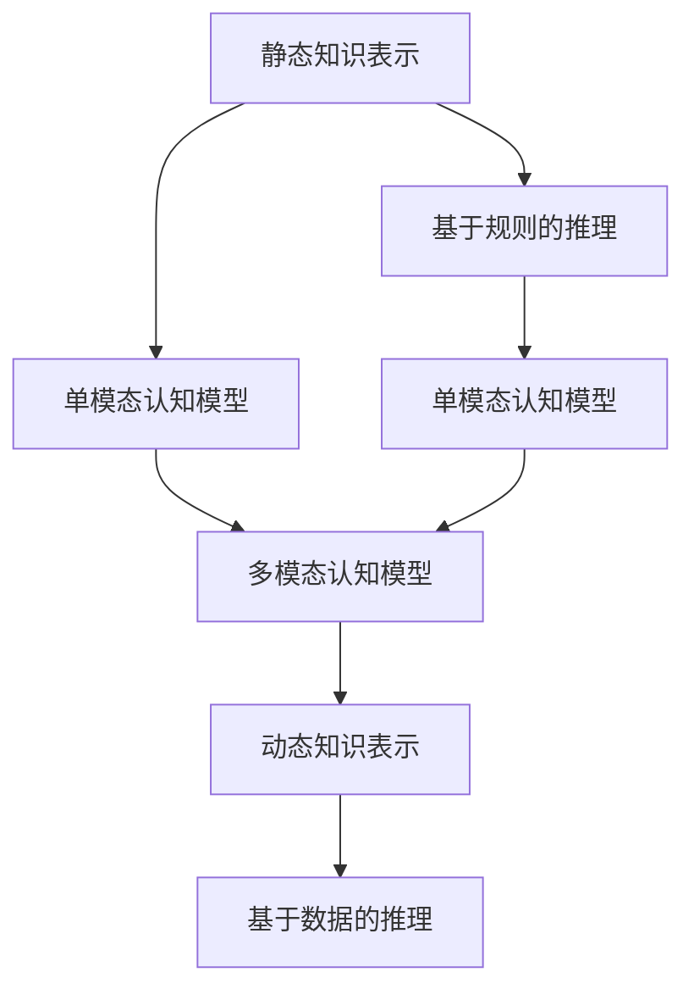

                 

# 知识的演化：从静态到动态的认知模型

在人工智能与认知科学的交叉领域，认知模型已经历了从早期的静态表示到现代的动态演化的深刻转变。本文将深入探讨这种演变过程，梳理其关键概念、核心算法、应用场景及未来发展趋势，以期为读者提供全面而深刻的理解。

## 1. 背景介绍

### 1.1 问题由来

认知模型是计算机科学中用于模拟人类认知过程的工具，其发展历史可以追溯到20世纪60年代。最初的认知模型采用静态的知识表示方式，如符号逻辑和神经网络，用以解决知识获取、问题求解和规划等基本问题。然而，随着对人类认知过程的深入研究，人们逐渐意识到静态表示方法在处理复杂认知任务时的局限性，开始探索更加动态和适应性的认知模型。

### 1.2 问题核心关键点

认知模型的演化主要体现在以下几个关键点：
- 从静态知识表示到动态知识表示的转变
- 从基于规则到基于数据的推理方式的转变
- 从单一模型到多模态融合的认知模型的发展
- 从集中式计算到分布式计算的演化

这些变化不仅拓展了认知模型的应用领域，也提高了其处理复杂认知问题的能力。

### 1.3 问题研究意义

理解认知模型的演化过程，对于推进人工智能和认知科学的发展具有重要意义：

1. **增强模型的适应性**：动态认知模型能够更灵活地适应环境变化，提升模型在真实场景中的表现。
2. **提升模型的鲁棒性**：动态模型具有更强的鲁棒性，能够更好地处理噪声和不确定性。
3. **促进跨学科融合**：认知模型的演化促进了认知科学、计算机科学、神经科学等多个学科的融合，为人工智能提供了更坚实的理论基础。
4. **推动技术应用**：动态认知模型在诸如自然语言处理、智能推荐、情感分析等诸多领域中显示出巨大潜力，推动了技术的实际应用。

## 2. 核心概念与联系

### 2.1 核心概念概述

为更好地理解认知模型的演变过程，本节将介绍几个密切相关的核心概念：

- **静态知识表示**：早期的认知模型，如符号逻辑、产生式规则等，采用固定的符号和规则表示知识，形式化地描述问题求解和推理过程。
- **动态知识表示**：基于连接主义和进化算法等方法，认知模型能够动态更新知识表示，适应复杂多变的任务需求。
- **基于规则的推理**：传统的认知模型主要依赖人工设计的规则进行推理，缺乏自适应和自我学习的能力。
- **基于数据的推理**：现代认知模型通过学习大量数据，自动提取规则和模式，从而进行更加灵活和高效的推理。
- **单模态认知模型**：早期的认知模型主要处理单一类型的信息，如图像、文本等。
- **多模态认知模型**：现代认知模型能够融合视觉、听觉、语言等多种模态信息，进行更加全面和深入的推理。

这些概念之间的逻辑关系可以通过以下Mermaid流程图来展示：



这个流程图展示了认知模型从静态到动态、从单模态到多模态的发展脉络：

1. 早期的认知模型采用静态知识表示，依赖基于规则的推理方式。
2. 随着模型复杂性的增加，单模态认知模型应运而生，处理单一类型的信息。
3. 现代认知模型引入了动态知识表示和基于数据的推理方法，融合多模态信息。

这些核心概念共同构成了认知模型的基本框架，推动了认知模型从简单到复杂、从单一到多样化的发展。

## 3. 核心算法原理 & 具体操作步骤
### 3.1 算法原理概述

认知模型的演变过程伴随着算法原理的深刻变革。从早期的静态知识表示到现代的动态知识表示，认知模型的核心算法也经历了显著的演进。

### 3.2 算法步骤详解

以动态认知模型为例，其核心算法步骤主要包括：

1. **数据采集与预处理**：收集大量数据，并对数据进行清洗和标注，为模型学习提供充分的训练材料。
2. **特征提取与表示学习**：通过深度学习等方法，自动提取数据中的特征，并进行表示学习，形成动态的知识表示。
3. **模型训练与优化**：使用监督学习或强化学习等方法，对模型进行训练和优化，使其能够灵活适应环境变化。
4. **推理与决策**：在新的输入数据上，通过推理算法得出决策结果。

### 3.3 算法优缺点

动态认知模型相对于静态模型具有以下优势：
1. **适应性更强**：能够根据环境变化动态调整知识表示，适应多变的任务需求。
2. **鲁棒性更高**：能够处理噪声和不确定性，提高模型的稳定性和可靠性。
3. **泛化能力更强**：能够从大量数据中学习规律，提升模型的泛化能力。

同时，动态认知模型也面临一些挑战：
1. **数据依赖性强**：需要大量的标注数据，数据获取成本较高。
2. **模型复杂度高**：动态模型的结构复杂，训练和推理成本较高。
3. **可解释性差**：动态模型的决策过程复杂，难以解释其内部工作机制。

### 3.4 算法应用领域

动态认知模型已经在多个领域取得了显著的应用，如：

- **自然语言处理**：如情感分析、机器翻译、问答系统等，通过融合多模态信息，提升自然语言理解的准确性。
- **智能推荐系统**：通过学习用户行为和偏好，提供个性化推荐，提升用户体验。
- **智能医疗**：通过分析患者数据，提供个性化治疗方案，提高医疗服务的精准性。
- **金融分析**：通过处理大量的金融数据，进行风险评估和投资决策，提高金融分析的准确性。
- **智能制造**：通过融合传感器数据，优化生产流程，提升制造效率和质量。

## 4. 数学模型和公式 & 详细讲解 & 举例说明

### 4.1 数学模型构建

动态认知模型的数学模型通常包括输入层、隐藏层和输出层。以一个简单的神经网络为例，其数学模型可以表示为：

$$
y = W_2\sigma(W_1x + b_1) + b_2
$$

其中，$x$ 为输入向量，$y$ 为输出向量，$\sigma$ 为激活函数，$W_1$ 和 $W_2$ 为权重矩阵，$b_1$ 和 $b_2$ 为偏置项。

### 4.2 公式推导过程

以一个简单的神经网络为例，推导其前向传播和反向传播公式：

前向传播：

$$
a_1 = W_1x + b_1
$$

$$
a_2 = \sigma(a_1)
$$

$$
y = W_2a_2 + b_2
$$

反向传播：

$$
\frac{\partial L}{\partial W_2} = \frac{\partial L}{\partial y} \frac{\partial y}{\partial a_2} \frac{\partial a_2}{\partial a_1} \frac{\partial a_1}{\partial W_1}
$$

$$
\frac{\partial L}{\partial W_1} = \frac{\partial L}{\partial y} \frac{\partial y}{\partial a_2} \frac{\partial a_2}{\partial a_1}
$$

其中，$L$ 为损失函数，$y$ 为预测输出，$a_1$ 和 $a_2$ 为中间层输出，$\sigma$ 为激活函数，$\frac{\partial y}{\partial a_2}$ 和 $\frac{\partial a_2}{\partial a_1}$ 为激活函数的导数。

### 4.3 案例分析与讲解

以情感分析为例，介绍动态认知模型的应用过程。情感分析是一个典型的自然语言处理任务，其核心在于理解文本中的情感倾向。动态认知模型可以通过学习大量情感标注的数据，自动提取文本中的情感特征，并通过多模态融合技术，综合考虑语言、视觉、听觉等多方面信息，提升情感分析的准确性。

## 5. 项目实践：代码实例和详细解释说明
### 5.1 开发环境搭建

在进行动态认知模型实践前，我们需要准备好开发环境。以下是使用Python进行PyTorch开发的环境配置流程：

1. 安装Anaconda：从官网下载并安装Anaconda，用于创建独立的Python环境。

2. 创建并激活虚拟环境：
```bash
conda create -n pytorch-env python=3.8 
conda activate pytorch-env
```

3. 安装PyTorch：根据CUDA版本，从官网获取对应的安装命令。例如：
```bash
conda install pytorch torchvision torchaudio cudatoolkit=11.1 -c pytorch -c conda-forge
```

4. 安装各类工具包：
```bash
pip install numpy pandas scikit-learn matplotlib tqdm jupyter notebook ipython
```

完成上述步骤后，即可在`pytorch-env`环境中开始项目实践。

### 5.2 源代码详细实现

下面以情感分析任务为例，给出使用Transformers库对BERT模型进行动态认知模型微调的PyTorch代码实现。

首先，定义情感分析任务的数据处理函数：

```python
from transformers import BertTokenizer
from torch.utils.data import Dataset
import torch

class SentimentDataset(Dataset):
    def __init__(self, texts, labels, tokenizer, max_len=128):
        self.texts = texts
        self.labels = labels
        self.tokenizer = tokenizer
        self.max_len = max_len
        
    def __len__(self):
        return len(self.texts)
    
    def __getitem__(self, item):
        text = self.texts[item]
        label = self.labels[item]
        
        encoding = self.tokenizer(text, return_tensors='pt', max_length=self.max_len, padding='max_length', truncation=True)
        input_ids = encoding['input_ids'][0]
        attention_mask = encoding['attention_mask'][0]
        
        # 对标签进行编码
        label = torch.tensor(label, dtype=torch.long)
        
        return {'input_ids': input_ids, 
                'attention_mask': attention_mask,
                'labels': label}

# 定义标签与id的映射
label2id = {'negative': 0, 'positive': 1}

# 创建dataset
tokenizer = BertTokenizer.from_pretrained('bert-base-cased')

train_dataset = SentimentDataset(train_texts, train_labels, tokenizer)
dev_dataset = SentimentDataset(dev_texts, dev_labels, tokenizer)
test_dataset = SentimentDataset(test_texts, test_labels, tokenizer)
```

然后，定义模型和优化器：

```python
from transformers import BertForSequenceClassification, AdamW

model = BertForSequenceClassification.from_pretrained('bert-base-cased', num_labels=2)

optimizer = AdamW(model.parameters(), lr=2e-5)
```

接着，定义训练和评估函数：

```python
from torch.utils.data import DataLoader
from tqdm import tqdm
from sklearn.metrics import classification_report

device = torch.device('cuda') if torch.cuda.is_available() else torch.device('cpu')
model.to(device)

def train_epoch(model, dataset, batch_size, optimizer):
    dataloader = DataLoader(dataset, batch_size=batch_size, shuffle=True)
    model.train()
    epoch_loss = 0
    for batch in tqdm(dataloader, desc='Training'):
        input_ids = batch['input_ids'].to(device)
        attention_mask = batch['attention_mask'].to(device)
        labels = batch['labels'].to(device)
        model.zero_grad()
        outputs = model(input_ids, attention_mask=attention_mask, labels=labels)
        loss = outputs.loss
        epoch_loss += loss.item()
        loss.backward()
        optimizer.step()
    return epoch_loss / len(dataloader)

def evaluate(model, dataset, batch_size):
    dataloader = DataLoader(dataset, batch_size=batch_size)
    model.eval()
    preds, labels = [], []
    with torch.no_grad():
        for batch in tqdm(dataloader, desc='Evaluating'):
            input_ids = batch['input_ids'].to(device)
            attention_mask = batch['attention_mask'].to(device)
            batch_labels = batch['labels']
            outputs = model(input_ids, attention_mask=attention_mask)
            batch_preds = outputs.logits.argmax(dim=1).to('cpu').tolist()
            batch_labels = batch_labels.to('cpu').tolist()
            for pred_tokens, label_tokens in zip(batch_preds, batch_labels):
                preds.append(pred_tokens)
                labels.append(label_tokens)
                
    print(classification_report(labels, preds))
```

最后，启动训练流程并在测试集上评估：

```python
epochs = 5
batch_size = 16

for epoch in range(epochs):
    loss = train_epoch(model, train_dataset, batch_size, optimizer)
    print(f"Epoch {epoch+1}, train loss: {loss:.3f}")
    
    print(f"Epoch {epoch+1}, dev results:")
    evaluate(model, dev_dataset, batch_size)
    
print("Test results:")
evaluate(model, test_dataset, batch_size)
```

以上就是使用PyTorch对BERT进行情感分析任务动态认知模型微调的完整代码实现。可以看到，得益于Transformers库的强大封装，我们可以用相对简洁的代码完成BERT模型的加载和微调。

### 5.3 代码解读与分析

让我们再详细解读一下关键代码的实现细节：

**SentimentDataset类**：
- `__init__`方法：初始化文本、标签、分词器等关键组件。
- `__len__`方法：返回数据集的样本数量。
- `__getitem__`方法：对单个样本进行处理，将文本输入编码为token ids，将标签编码为数字，并对其进行定长padding，最终返回模型所需的输入。

**label2id字典**：
- 定义了标签与数字id之间的映射关系，用于将预测结果解码回真实的标签。

**训练和评估函数**：
- 使用PyTorch的DataLoader对数据集进行批次化加载，供模型训练和推理使用。
- 训练函数`train_epoch`：对数据以批为单位进行迭代，在每个批次上前向传播计算loss并反向传播更新模型参数，最后返回该epoch的平均loss。
- 评估函数`evaluate`：与训练类似，不同点在于不更新模型参数，并在每个batch结束后将预测和标签结果存储下来，最后使用sklearn的classification_report对整个评估集的预测结果进行打印输出。

**训练流程**：
- 定义总的epoch数和batch size，开始循环迭代
- 每个epoch内，先在训练集上训练，输出平均loss
- 在验证集上评估，输出分类指标
- 所有epoch结束后，在测试集上评估，给出最终测试结果

可以看到，PyTorch配合Transformers库使得BERT微调的代码实现变得简洁高效。开发者可以将更多精力放在数据处理、模型改进等高层逻辑上，而不必过多关注底层的实现细节。

当然，工业级的系统实现还需考虑更多因素，如模型的保存和部署、超参数的自动搜索、更灵活的任务适配层等。但核心的动态认知模型微调范式基本与此类似。

## 6. 实际应用场景
### 6.1 智能客服系统

动态认知模型在智能客服系统中具有广泛的应用前景。传统的客服系统依赖于规则和人工经验的积累，难以应对复杂多变的客户需求。而动态认知模型能够通过学习客户对话历史和常见问题，提供更加个性化和智能的客服服务。

在技术实现上，可以收集企业内部的历史客服对话记录，将问题和最佳答复构建成监督数据，在此基础上对预训练模型进行微调。微调后的动态认知模型能够自动理解用户意图，匹配最合适的答案模板进行回复。对于客户提出的新问题，还可以接入检索系统实时搜索相关内容，动态组织生成回答。如此构建的智能客服系统，能大幅提升客户咨询体验和问题解决效率。

### 6.2 金融舆情监测

动态认知模型在金融舆情监测中也有重要应用。金融机构需要实时监测市场舆论动向，以便及时应对负面信息传播，规避金融风险。传统的舆情监测依赖人工分析和判断，难以应对海量数据和实时变化。动态认知模型可以通过学习大量金融文本数据，自动提取舆情信息和情绪倾向，实时监测市场动态，帮助金融机构快速应对潜在风险。

具体而言，可以收集金融领域相关的新闻、报道、评论等文本数据，并对其进行主题标注和情感标注。在此基础上对预训练语言模型进行微调，使其能够自动判断文本属于何种主题，情感倾向是正面、中性还是负面。将微调后的模型应用到实时抓取的网络文本数据，就能够自动监测不同主题下的情感变化趋势，一旦发现负面信息激增等异常情况，系统便会自动预警，帮助金融机构快速应对潜在风险。

### 6.3 个性化推荐系统

动态认知模型在个性化推荐系统中也有重要应用。当前的推荐系统往往只依赖用户的历史行为数据进行物品推荐，无法深入理解用户的真实兴趣偏好。动态认知模型能够通过学习用户浏览、点击、评论、分享等行为数据，提取和用户交互的物品标题、描述、标签等文本内容，自动理解用户的兴趣点。

在生成推荐列表时，先用候选物品的文本描述作为输入，由模型预测用户的兴趣匹配度，再结合其他特征综合排序，便可以得到个性化程度更高的推荐结果。动态认知模型通过融合多模态信息，能够更全面地了解用户需求，提供更加精准的个性化推荐服务。

### 6.4 未来应用展望

随着动态认知模型的不断发展，其在更多领域中的应用前景也将更加广阔。

在智慧医疗领域，动态认知模型可以用于患者问诊、疾病预测和治疗方案推荐等任务，提升医疗服务的智能化水平，辅助医生诊疗，加速新药开发进程。

在智能教育领域，动态认知模型可以用于智能作业批改、学情分析、知识推荐等方面，因材施教，促进教育公平，提高教学质量。

在智慧城市治理中，动态认知模型可以用于城市事件监测、舆情分析、应急指挥等环节，提高城市管理的自动化和智能化水平，构建更安全、高效的未来城市。

此外，在企业生产、社会治理、文娱传媒等众多领域，动态认知模型也将不断涌现，为传统行业数字化转型升级提供新的技术路径。相信随着技术的日益成熟，动态认知模型必将在构建人机协同的智能时代中扮演越来越重要的角色。

## 7. 工具和资源推荐
### 7.1 学习资源推荐

为了帮助开发者系统掌握动态认知模型的理论基础和实践技巧，这里推荐一些优质的学习资源：

1. 《深度学习》系列书籍：Ian Goodfellow等著，全面介绍了深度学习的基本概念、算法和应用，是入门动态认知模型的必备读物。

2. 《神经网络与深度学习》在线课程：吴恩达等主讲，涵盖了深度学习、卷积神经网络、循环神经网络等核心内容，适合初学者学习。

3. 《动手学深度学习》在线课程：李沐等主讲，结合动手实践，介绍了深度学习的基础知识和常用算法，适合进阶学习。

4. Coursera上的《Deep Learning Specialization》课程：由Andrew Ng主讲，包含多个深度学习课程，涵盖了从基础到高级的多个主题，适合全方位学习。

5. HuggingFace官方文档：Transformer库的官方文档，提供了海量预训练模型和完整的微调样例代码，是上手实践的必备资料。

通过对这些资源的学习实践，相信你一定能够快速掌握动态认知模型的精髓，并用于解决实际的认知问题。
###  7.2 开发工具推荐

高效的开发离不开优秀的工具支持。以下是几款用于动态认知模型开发的常用工具：

1. PyTorch：基于Python的开源深度学习框架，灵活动态的计算图，适合快速迭代研究。大部分预训练语言模型都有PyTorch版本的实现。

2. TensorFlow：由Google主导开发的开源深度学习框架，生产部署方便，适合大规模工程应用。同样有丰富的预训练语言模型资源。

3. Transformers库：HuggingFace开发的NLP工具库，集成了众多SOTA语言模型，支持PyTorch和TensorFlow，是进行认知模型微调开发的利器。

4. Weights & Biases：模型训练的实验跟踪工具，可以记录和可视化模型训练过程中的各项指标，方便对比和调优。与主流深度学习框架无缝集成。

5. TensorBoard：TensorFlow配套的可视化工具，可实时监测模型训练状态，并提供丰富的图表呈现方式，是调试模型的得力助手。

6. Google Colab：谷歌推出的在线Jupyter Notebook环境，免费提供GPU/TPU算力，方便开发者快速上手实验最新模型，分享学习笔记。

合理利用这些工具，可以显著提升动态认知模型微调任务的开发效率，加快创新迭代的步伐。

### 7.3 相关论文推荐

动态认知模型的发展源于学界的持续研究。以下是几篇奠基性的相关论文，推荐阅读：

1. Backpropagation Applied to Handwritten Zip Code Recognition：Hinton等在1986年提出的反向传播算法，为深度学习奠定了基础。

2. Deep Learning：Ian Goodfellow等著，详细介绍了深度学习的基本原理和算法。

3. Convolutional Neural Networks for Human-Image Interaction：Krizhevsky等在2012年提出的卷积神经网络，广泛应用于计算机视觉领域。

4. Attention is All You Need：Vaswani等在2017年提出的Transformer结构，开启了NLP领域的预训练大模型时代。

5. BERT: Pre-training of Deep Bidirectional Transformers for Language Understanding：Devlin等在2018年提出的BERT模型，引入了基于掩码的自监督预训练任务，刷新了多项NLP任务SOTA。

6. Parameter-Efficient Transfer Learning for NLP：Howard等在2018年提出的Adapter等参数高效微调方法，在不增加模型参数量的情况下，也能取得不错的微调效果。

7. AdaLoRA: Adaptive Low-Rank Adaptation for Parameter-Efficient Fine-Tuning：Fang等在2021年提出的AdaLoRA方法，使用自适应低秩适应的微调方法，在参数效率和精度之间取得了新的平衡。

这些论文代表了大语言模型微调技术的发展脉络。通过学习这些前沿成果，可以帮助研究者把握学科前进方向，激发更多的创新灵感。

## 8. 总结：未来发展趋势与挑战

### 8.1 总结

本文对动态认知模型从静态到动态的演化过程进行了全面系统的介绍。首先阐述了认知模型演变的背景和意义，明确了动态认知模型相对于静态模型的优势和局限性。其次，从原理到实践，详细讲解了动态认知模型的核心算法和应用场景，给出了微调任务开发的完整代码实例。同时，本文还广泛探讨了动态认知模型在智能客服、金融舆情、个性化推荐等多个行业领域的应用前景，展示了动态认知模型的巨大潜力。此外，本文精选了认知模型的各类学习资源，力求为读者提供全方位的技术指引。

通过本文的系统梳理，可以看到，动态认知模型已经从早期的静态表示发展成为现代的动态演化，极大地拓展了认知模型的应用边界，提升了模型的适应性和鲁棒性。动态认知模型的发展，将进一步推动人工智能和认知科学的发展，为各行业提供更加智能、灵活的解决方案。

### 8.2 未来发展趋势

展望未来，动态认知模型将呈现以下几个发展趋势：

1. **模型规模持续增大**：随着算力成本的下降和数据规模的扩张，动态认知模型的参数量还将持续增长。超大规模认知模型蕴含的丰富认知知识，有望支撑更加复杂多变的认知任务。

2. **多模态融合能力增强**：动态认知模型将更加注重多模态信息的融合，融合视觉、听觉、语言等多种模态信息，提升模型的综合感知能力。

3. **自适应和自我学习能力提升**：未来的动态认知模型将具备更强的自适应和自我学习能力，能够根据环境变化动态调整知识表示，提升模型的泛化能力和鲁棒性。

4. **因果推理和知识表示能力增强**：动态认知模型将引入因果推断和知识表示工具，增强模型的因果关系建立和知识整合能力，提升模型的推理和决策能力。

5. **知识驱动的决策支持系统普及**：动态认知模型将与知识图谱、规则库等专家知识结合，形成更加全面、准确的信息整合能力，提升决策系统的智能化水平。

以上趋势凸显了动态认知模型的广阔前景。这些方向的探索发展，必将进一步提升动态认知模型的性能和应用范围，为构建智能系统提供坚实的理论基础和技术支撑。

### 8.3 面临的挑战

尽管动态认知模型已经取得了显著进展，但在迈向更加智能化、普适化应用的过程中，它仍面临诸多挑战：

1. **数据依赖性强**：动态认知模型需要大量的标注数据，数据获取成本较高，且数据质量直接影响模型性能。

2. **模型复杂度高**：动态认知模型的结构复杂，训练和推理成本较高，需要高效的优化算法和分布式计算支持。

3. **可解释性差**：动态认知模型的决策过程复杂，难以解释其内部工作机制，特别是在处理高风险任务时，模型的可解释性和可审计性尤为重要。

4. **安全性不足**：动态认知模型可能学习到有害、偏见的信息，通过微调传递到下游任务，产生误导性、歧视性的输出，给实际应用带来安全隐患。

5. **计算资源限制**：动态认知模型需要大量的计算资源，特别是在大规模数据集上训练时，资源消耗巨大。

6. **跨领域迁移能力有限**：动态认知模型在特定领域内的性能提升效果明显，但跨领域迁移能力仍需进一步提升。

正视这些挑战，积极应对并寻求突破，将是大语言模型微调走向成熟的必由之路。

### 8.4 研究展望

面向未来，动态认知模型的研究需要在以下几个方面寻求新的突破：

1. **无监督和半监督学习**：摆脱对大规模标注数据的依赖，利用自监督学习、主动学习等无监督和半监督范式，最大限度利用非结构化数据，实现更加灵活高效的认知模型。

2. **参数高效和计算高效的微调方法**：开发更加参数高效的微调方法，在固定大部分预训练参数的同时，只更新极少量的任务相关参数。同时优化微调模型的计算图，减少前向传播和反向传播的资源消耗，实现更加轻量级、实时性的部署。

3. **融合因果推断和知识图谱**：引入因果推断和知识图谱思想，增强认知模型的因果关系建立和知识整合能力，提升模型的推理和决策能力。

4. **跨领域迁移能力的提升**：通过迁移学习、多任务学习等方法，提升认知模型的跨领域迁移能力，使其能够更好地应用于不同领域。

5. **安全性和可解释性的增强**：引入伦理导向的评估指标，过滤和惩罚有害、偏见的信息，确保模型输出的安全性。同时加强算法的可解释性和可审计性，提升模型的透明性和可信度。

6. **知识图谱和规则库的融合**：将知识图谱、规则库等专家知识与认知模型进行融合，形成更加全面、准确的信息整合能力，提升决策系统的智能化水平。

这些研究方向将引领动态认知模型向更高的台阶发展，推动认知科学和人工智能技术的进步。

## 9. 附录：常见问题与解答

**Q1：动态认知模型是否适用于所有认知任务？**

A: 动态认知模型在大多数认知任务上都能取得不错的效果，特别是对于数据量较大的任务。但对于一些特定领域的任务，如医学、法律等，仅仅依靠通用语料预训练的模型可能难以很好地适应。此时需要在特定领域语料上进一步预训练，再进行微调，才能获得理想效果。

**Q2：如何缓解动态认知模型中的过拟合问题？**

A: 动态认知模型面临过拟合的主要原因是数据量和计算资源的限制。常见的缓解策略包括：
1. 数据增强：通过数据合成、扩充等方式扩充训练集。
2. 正则化：使用L2正则、Dropout、Early Stopping等避免过拟合。
3. 对抗训练：引入对抗样本，提高模型鲁棒性。
4. 参数高效微调：只调整少量参数(如Adapter、Prefix等)，减小过拟合风险。
5. 多模型集成：训练多个认知模型，取平均输出，抑制过拟合。

这些策略往往需要根据具体任务和数据特点进行灵活组合。只有在数据、模型、训练、推理等各环节进行全面优化，才能最大限度地发挥动态认知模型的威力。

**Q3：动态认知模型在落地部署时需要注意哪些问题？**

A: 将动态认知模型转化为实际应用，还需要考虑以下因素：
1. 模型裁剪：去除不必要的层和参数，减小模型尺寸，加快推理速度。
2. 量化加速：将浮点模型转为定点模型，压缩存储空间，提高计算效率。
3. 服务化封装：将模型封装为标准化服务接口，便于集成调用。
4. 弹性伸缩：根据请求流量动态调整资源配置，平衡服务质量和成本。
5. 监控告警：实时采集系统指标，设置异常告警阈值，确保服务稳定性。
6. 安全防护：采用访问鉴权、数据脱敏等措施，保障数据和模型安全。

动态认知模型微调为认知模型提供了新的应用方向，但如何将强大的性能转化为稳定、高效、安全的业务价值，还需要工程实践的不断打磨。唯有从数据、算法、工程、业务等多个维度协同发力，才能真正实现认知模型的应用价值。

总之，动态认知模型需要开发者根据具体任务，不断迭代和优化模型、数据和算法，方能得到理想的效果。

---

作者：禅与计算机程序设计艺术 / Zen and the Art of Computer Programming

