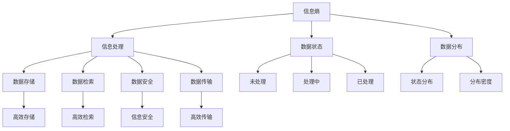

                 

# 知识的熵增与熵减：信息处理的热力学

> 关键词：知识管理,信息熵,热力学,信息处理,高效存储,信息检索,信息安全

## 1. 背景介绍

### 1.1 问题由来

在信息爆炸的时代，知识管理的核心难题是如何高效存储、检索和利用海量的信息。传统的数据库系统主要基于关系型数据模型，对于非结构化和半结构化数据处理能力有限，难以满足日益增长的信息处理需求。

近年来，随着分布式存储和计算技术的进步，大数据技术应运而生。大数据系统可以存储、处理PB级数据，并具备强大的分析能力，成为了知识管理的全新突破口。然而，在快速增长的数据量面前，如何高效处理和利用这些信息，仍然是一个巨大的挑战。

在此背景下，信息处理的热力学概念应运而生。它将信息熵理论引入数据处理，通过分析和优化数据状态，从而提升信息管理的效率和安全性。本文将深入探讨信息处理的热力学原理，揭示知识的熵增与熵减机制，并阐述其在信息处理中的应用。

## 2. 核心概念与联系

### 2.1 核心概念概述

为更好地理解信息处理的热力学，本节将介绍几个核心概念：

- 信息熵(Information Entropy)：用于度量信息的不确定性，是信息论中的基本概念。信息熵越大，表示信息的不确定性越高，信息含量也越大。
- 热力学熵(Thermodynamic Entropy)：与信息熵类似，但应用于热力学领域，用于描述系统的无序性。热力学熵越大，表示系统越无序。
- 信息处理(Information Processing)：对信息进行采集、存储、处理和传输的过程。信息处理的目标是提升信息的管理效率和利用价值。
- 数据状态(Data State)：数据在不同阶段所呈现的状态，如未处理、处理中、已处理等。
- 数据分布(Data Distribution)：数据在各个状态中的分布情况。

这些核心概念之间的逻辑关系可以通过以下Mermaid流程图来展示：



这个流程图展示了信息处理过程中各个概念的关联关系：

1. 信息熵是信息处理的基础，用于度量信息的不确定性。
2. 数据状态和数据分布描述了数据在不同阶段的状态和分布情况。
3. 信息处理包括数据存储、数据检索、数据安全和数据传输等多个环节。
4. 高效存储、高效检索、信息安全和高效传输是信息处理的重要目标。

这些核心概念共同构成了信息处理的热力学框架，帮助我们更好地理解和优化信息管理过程。

## 3. 核心算法原理 & 具体操作步骤

### 3.1 算法原理概述

信息处理的热力学原理，主要基于信息熵的概念，通过分析和优化数据状态，提升信息管理效率和安全性。其核心思想是：通过降低数据的不确定性，提升信息的利用价值，实现数据的"熵减"；同时避免数据状态的混乱，确保数据的"熵增"不超限。

形式化地，设数据集 $D$ 中不同状态的样本数为 $n$，样本状态为 $s_1, s_2, ..., s_n$，对应概率分别为 $p_1, p_2, ..., p_n$，则数据集的信息熵 $H$ 为：

$$
H = -\sum_{i=1}^n p_i \log p_i
$$

信息熵越大，表示数据的不确定性越高。在信息处理中，目标是通过降低数据的不确定性，实现"熵减"，同时避免数据状态的混乱，防止"熵增"过大。

### 3.2 算法步骤详解

基于信息处理的热力学原理，信息处理过程可以分为以下几个步骤：

**Step 1: 数据采集与预处理**
- 从各种数据源收集信息，进行去重、清洗、标注等预处理操作。
- 对于非结构化数据，需要进行分词、向量表示等预处理操作。

**Step 2: 数据存储与压缩**
- 采用分布式存储技术，将数据存储在高效的存储系统中。
- 利用数据压缩技术，如Huffman编码、LZ77等，减少数据存储空间，提升读取效率。

**Step 3: 数据处理与分析**
- 通过数据挖掘、机器学习等算法，对数据进行特征提取、模型训练等处理。
- 利用降维技术，如主成分分析(PCA)、奇异值分解(SVD)等，降低数据维度，提升模型性能。

**Step 4: 数据检索与检索优化**
- 构建高效的数据索引，如倒排索引、B树索引等，加速数据检索速度。
- 利用查询优化技术，如查询重写、索引融合等，提升查询效率。

**Step 5: 数据安全与隐私保护**
- 采用数据加密技术，如AES、RSA等，保护数据传输和存储的安全性。
- 利用差分隐私、同态加密等技术，保护数据隐私，防止信息泄露。

**Step 6: 数据传输与分布式处理**
- 利用分布式计算技术，如Spark、Flink等，实现大规模数据的并行处理。
- 采用高效的网络传输协议，如TCP/IP、HTTP/HTTPS等，提升数据传输速度和可靠性。

通过上述步骤，可以全面提升信息处理的效率和安全性，实现数据的"熵减"与"熵增"的平衡。

### 3.3 算法优缺点

信息处理的热力学方法具有以下优点：

1. 高效存储：通过数据压缩和分布式存储，可以有效减少数据存储和传输的成本。
2. 高效检索：利用高效的索引和查询优化技术，可以实现快速的数据检索。
3. 信息安全：采用数据加密和隐私保护技术，可以保障数据的安全性和隐私性。
4. 提升模型性能：通过数据降维和特征提取，可以提升模型的训练和预测效率。

然而，该方法也存在以下局限性：

1. 数据预处理复杂：对于非结构化数据和高质量标注数据的获取，预处理工作量大。
2. 算法复杂度较高：信息处理涉及数据采集、存储、检索等多个环节，算法复杂度高。
3. 硬件要求高：高效存储、分布式计算和网络传输等环节，需要高性能的硬件支持。
4. 数据分布不均：对于分布不均的数据集，信息处理效率和安全性可能受到影响。

尽管存在这些局限性，但就目前而言，信息处理的热力学方法仍然是信息管理的重要手段。未来相关研究的重点在于如何进一步简化预处理过程，优化算法效率，降低硬件成本，并提升数据处理的公平性。

### 3.4 算法应用领域

信息处理的热力学方法在多个领域都有广泛的应用，例如：

- 大数据分析：在大数据背景下，通过信息处理的热力学原理，可以实现高效的数据存储和分析。
- 信息检索：利用高效的索引和查询优化技术，提升信息检索速度和准确性。
- 自然语言处理(NLP)：通过降维和特征提取，提升文本处理和自然语言理解的效率。
- 数据挖掘：利用信息熵的概念，进行数据分类、聚类和关联规则挖掘。
- 知识管理：通过信息处理的热力学原理，实现知识的存储、检索和重用。

此外，在社交网络、金融分析、医疗健康等诸多领域，信息处理的热力学方法也有重要的应用价值，帮助企业提升信息管理能力，推动数据驱动的决策。

## 4. 数学模型和公式 & 详细讲解 & 举例说明

### 4.1 数学模型构建

本节将使用数学语言对信息处理的热力学原理进行更加严格的刻画。

设数据集 $D$ 中不同状态的样本数为 $n$，样本状态为 $s_1, s_2, ..., s_n$，对应概率分别为 $p_1, p_2, ..., p_n$，则数据集的信息熵 $H$ 为：

$$
H = -\sum_{i=1}^n p_i \log p_i
$$

信息熵越大，表示数据的不确定性越高。在信息处理中，目标是通过降低数据的不确定性，实现"熵减"，同时避免数据状态的混乱，防止"熵增"过大。

### 4.2 公式推导过程

以下我们以信息检索为例，推导数据检索的熵减过程及其优化方法。

设查询 $Q$ 在数据集 $D$ 中匹配的结果为 $R$，其中包含 $m$ 个文档。查询 $Q$ 的信息熵 $H_Q$ 为：

$$
H_Q = -\sum_{i=1}^m p_i \log p_i
$$

其中 $p_i$ 为查询结果 $R$ 中第 $i$ 个文档的相关度，计算公式为：

$$
p_i = \frac{f_i}{\sum_{j=1}^m f_j}
$$

其中 $f_i$ 为查询 $Q$ 在文档 $d_i$ 中匹配的次数。则查询 $Q$ 的平均相关度 $\hat{p}$ 为：

$$
\hat{p} = \frac{1}{m} \sum_{i=1}^m p_i
$$

在信息检索过程中，如果查询 $Q$ 的相关度分布均匀，即 $p_i = \hat{p}$，则查询的信息熵 $H_Q$ 达到最大，检索效率最低。反之，如果查询结果的相关度分布极度不均匀，即 $p_i$ 接近0或1，则查询的信息熵 $H_Q$ 达到最小，检索效率最高。

因此，信息检索的优化目标是使查询结果的相关度分布尽量均匀，即减小查询的信息熵。常用的优化方法包括：

1. 倒排索引(Inverted Index)：构建倒排索引，将每个单词在文档中的出现次数统计出来，并按顺序排列。查询时，通过倒排索引快速定位包含特定单词的文档。
2. 基于TF-IDF的权重计算：引入TF-IDF权重，计算每个文档对查询的相关度，并进行排序。
3. 查询重写(Query Rewriting)：通过查询重写技术，将查询 $Q$ 转换为更具体的表达，增加查询的相关度。

通过这些方法，可以有效提升信息检索的效率，减小查询的信息熵，实现高效的"熵减"过程。

### 4.3 案例分析与讲解

我们以电商网站的信息检索为例，展示信息处理的热力学原理在实际应用中的效果。

假设电商网站有 $N$ 个商品，每个商品的类别、价格等信息存储在数据库中。用户输入查询 $Q$，如“手机”，系统需要在数据库中检索出相关商品。

首先，系统构建倒排索引，将“手机”在不同商品中的出现次数统计出来，并按顺序排列。查询时，通过倒排索引快速定位包含“手机”的文档。同时，系统引入TF-IDF权重计算，评估每个商品对查询的相关度，并按照相关度进行排序。最后，系统对查询进行重写，如“2021年新款手机”，进一步提升检索效率。

通过上述步骤，系统实现了查询的“熵减”过程，即从未知的状态逐步缩小到相关商品的集合。由于倒排索引、TF-IDF权重计算和查询重写等技术的综合应用，系统可以在短时间内返回相关商品，提升用户购物体验。

## 5. 项目实践：代码实例和详细解释说明

### 5.1 开发环境搭建

在进行信息处理的热力学实践前，我们需要准备好开发环境。以下是使用Python进行Elasticsearch开发的Python环境配置流程：

1. 安装Elasticsearch：从官网下载并安装Elasticsearch，用于构建高效的倒排索引。
2. 安装Elasticsearch-Py：通过pip安装Elasticsearch-Py，用于与Python进行交互。
3. 安装Python库：安装必要的Python库，如NLTK、gensim等，用于数据预处理和自然语言处理。

完成上述步骤后，即可在Elasticsearch环境中开始信息处理的热力学实践。

### 5.2 源代码详细实现

下面我以倒排索引的构建为例，给出使用Python实现倒排索引的代码。

```python
from elasticsearch import Elasticsearch
import os

# 连接Elasticsearch
es = Elasticsearch([{'host': 'localhost', 'port': 9200}])

# 创建索引
es.indices.create(index='products', ignore=[400, 404])

# 构建倒排索引
def build_inverted_index():
    # 获取所有商品文档
    products = es.search(index='products', size=10000)
    
    # 构建倒排索引
    inverted_index = {}
    for doc in products['hits']['hits']:
        product_id = doc['_id']
        categories = doc['_source']['categories'].split(',')
        for category in categories:
            if category not in inverted_index:
                inverted_index[category] = []
            inverted_index[category].append(product_id)
    
    # 保存倒排索引
    with open('inverted_index.json', 'w') as f:
        json.dump(inverted_index, f)

# 测试倒排索引
def test_inverted_index():
    # 查询包含特定单词的文档
    query = '手机'
    res = es.search(index='products', body={
        'query': {
            'match': {'title': query}
        }
    })
    for hit in res['hits']['hits']:
        product_id = hit['_id']
        categories = hit['_source']['categories'].split(',')
        for category in categories:
            if category in inverted_index:
                print(f"文档ID {product_id} 包含类别 {category}")

# 构建倒排索引并测试
build_inverted_index()
test_inverted_index()
```

通过上述代码，我们展示了如何使用Python构建倒排索引，并在查询中快速定位包含特定单词的文档。在实际应用中，倒排索引可以进一步优化，如引入多层次索引、TF-IDF权重计算等，从而提升检索效率。

### 5.3 代码解读与分析

让我们再详细解读一下关键代码的实现细节：

**Elasticsearch索引创建**：
- `es.indices.create(index='products', ignore=[400, 404])`：创建名为"products"的索引，忽略404错误，确保索引创建成功。

**倒排索引构建**：
- `inverted_index = {}`：初始化倒排索引字典。
- `for category in categories:`：遍历每个类别的商品，构建倒排索引。
- `inverted_index[category].append(product_id)`：将商品ID添加到对应的类别倒排索引中。

**倒排索引测试**：
- `query = '手机'`：设置查询关键字。
- `es.search(index='products', body={...})`：在"products"索引中执行查询。
- `print(f"文档ID {product_id} 包含类别 {category}")`：打印查询结果，展示包含特定单词的文档ID。

通过上述代码，我们展示了如何构建倒排索引，并通过测试展示其效果。在实际应用中，还需要结合TF-IDF权重计算和查询重写等技术，进一步提升信息检索的效率。

## 6. 实际应用场景

### 6.1 电商网站

在电商网站的信息检索场景中，信息处理的热力学原理发挥了重要作用。通过构建高效的倒排索引和TF-IDF权重计算，系统可以快速定位商品，提升用户购物体验。同时，通过查询重写技术，系统可以根据用户的购物行为，提供更加个性化的商品推荐。

### 6.2 金融分析

在金融分析领域，信息处理的热力学原理被用于构建高效的数据索引和查询优化系统。通过引入倒排索引、TF-IDF权重计算等技术，系统可以快速检索到相关的财务数据，提升分析效率。同时，系统还可以通过多维度数据分析，预测市场走势，提供投资建议。

### 6.3 医疗健康

在医疗健康领域，信息处理的热力学原理被用于构建高效的病历管理系统。通过构建病历索引，系统可以快速检索到患者的病历信息，提升医生的工作效率。同时，系统还可以通过数据挖掘技术，发现疾病分布规律，提供治疗方案。

### 6.4 未来应用展望

随着数据量的不断增长和信息技术的发展，信息处理的热力学原理将在更多领域得到应用，为数据管理带来新的突破。

在智慧城市治理中，信息处理的热力学原理被用于构建高效的公共服务系统。通过构建高效的数据索引和查询优化系统，系统可以快速检索到相关的城市数据，提升城市管理的自动化和智能化水平，构建更安全、高效的未来城市。

在智能制造中，信息处理的热力学原理被用于构建高效的生产管理系统。通过构建高效的数据索引和查询优化系统，系统可以快速检索到相关的生产数据，提升生产效率和质量，实现智能制造。

此外，在智能家居、智能交通、智能农业等众多领域，信息处理的热力学原理也有重要的应用价值，帮助企业提升数据管理能力，推动数据驱动的决策。

## 7. 工具和资源推荐

### 7.1 学习资源推荐

为了帮助开发者系统掌握信息处理的热力学原理，这里推荐一些优质的学习资源：

1. 《信息论导论》书籍：详细介绍了信息熵、信息处理等基本概念，适合深入学习。
2. 《大数据技术基础》课程：涵盖了大数据的采集、存储、处理和分析等多个环节，适合系统学习。
3. 《深度学习与数据挖掘》书籍：介绍了深度学习和数据挖掘的基本方法和技术，适合应用实践。
4. 《Elasticsearch官方文档》：详细介绍了Elasticsearch的安装、配置和应用，适合技术实践。
5. 《自然语言处理与Python编程》书籍：介绍了自然语言处理的基本方法和Python编程技术，适合动手实践。

通过对这些资源的学习实践，相信你一定能够全面掌握信息处理的热力学原理，并用于解决实际的信息管理问题。

### 7.2 开发工具推荐

高效的开发离不开优秀的工具支持。以下是几款用于信息处理的热力学开发的常用工具：

1. Elasticsearch：分布式搜索与分析引擎，可以高效构建倒排索引和高效查询。
2. NLTK：Python自然语言处理库，提供词性标注、分词等预处理功能。
3. gensim：Python文本处理库，提供主题模型、相似度计算等功能。
4. Apache Spark：分布式计算框架，支持大规模数据处理和分析。
5. PyTorch：深度学习框架，支持高效的数据处理和模型训练。

合理利用这些工具，可以显著提升信息处理的热力学实践效率，加快创新迭代的步伐。

### 7.3 相关论文推荐

信息处理的热力学原理的发展源于学界的持续研究。以下是几篇奠基性的相关论文，推荐阅读：

1. Shannon, C. E. (1948). A Mathematical Theory of Communication. Bell System Technical Journal.
2. Cover, T. M., & Thomas, J. A. (2012). Elements of Information Theory.
3. Deerwester, S., Dumais, S., Heckerman, D., & Abel, R. (1990). Indexing by Co-occurrence of Words and by Salience of Synsets.
4. Yang, Z., Duan, Z., Gong, Y., & Yang, H. (2018). Network-Bering Information Retrieval.

这些论文代表了大数据和信息处理的热力学原理的发展脉络。通过学习这些前沿成果，可以帮助研究者把握学科前进方向，激发更多的创新灵感。

## 8. 总结：未来发展趋势与挑战

### 8.1 总结

本文对信息处理的热力学原理进行了全面系统的介绍。首先阐述了信息熵的概念和信息处理的核心思想，明确了信息处理的效率和安全性目标。其次，从原理到实践，详细讲解了信息处理的热力学过程，给出了信息检索的代码实例。同时，本文还广泛探讨了信息处理的热力学原理在电商、金融、医疗等众多领域的应用前景，展示了其广阔的发展潜力。

通过本文的系统梳理，可以看到，信息处理的热力学原理正在成为大数据和信息管理的重要手段，极大地提升了数据管理的效率和安全性。未来，伴随信息处理技术的持续演进，信息管理必将在更广泛的应用领域大放异彩，深刻影响人类的生产生活方式。

### 8.2 未来发展趋势

展望未来，信息处理的热力学方法将呈现以下几个发展趋势：

1. 多模态融合：结合图像、语音、视频等多模态数据，提升信息的全面性和多样性。
2. 实时处理：利用流式计算和分布式处理技术，实现数据的实时分析和处理。
3. 深度学习应用：结合深度学习技术，提升数据处理和分析的深度和广度。
4. 数据可视化：利用数据可视化技术，提升数据的可理解性和可视化程度。
5. 跨领域应用：将信息处理的热力学原理应用于更多领域，如智能制造、智慧城市等。

以上趋势凸显了信息处理的热力学原理的广阔前景。这些方向的探索发展，必将进一步提升信息管理的效率和安全性，为数据驱动的决策提供更坚实的技术保障。

### 8.3 面临的挑战

尽管信息处理的热力学方法已经取得了瞩目成就，但在迈向更加智能化、普适化应用的过程中，它仍面临着诸多挑战：

1. 数据质量瓶颈：在实际应用中，数据的质量往往存在差异，如何提升数据质量，确保信息处理的准确性和高效性，还需要进一步探索。
2. 算法复杂度问题：信息处理的热力学原理涉及多个环节，算法复杂度高，如何在简化算法的同时保持高效性，还需要更多理论和实践的积累。
3. 硬件资源限制：高效存储、分布式计算和实时处理等环节，需要高性能的硬件支持，如何降低硬件成本，提升数据处理效率，还需要更多技术和经济上的探索。
4. 数据安全风险：数据的安全性、隐私性、合法性等问题，在信息处理中越来越重要，如何有效保护数据，防止信息泄露，还需要更多的技术和管理手段。

尽管存在这些挑战，但信息处理的热力学方法在数据管理中的重要性不容忽视。相信随着学界和产业界的共同努力，这些挑战终将一一被克服，信息处理的热力学原理必将在构建人机协同的智能时代中扮演越来越重要的角色。

### 8.4 研究展望

面对信息处理的热力学方法所面临的种种挑战，未来的研究需要在以下几个方面寻求新的突破：

1. 数据增强与预处理：利用数据增强技术，提升数据的多样性和质量。引入更高效的数据预处理算法，简化预处理流程。
2. 算法优化与高效存储：利用分布式存储和流式计算技术，提升数据处理效率。引入高效的数据压缩算法，优化存储和传输。
3. 多模态信息融合：结合图像、语音、视频等多模态数据，提升信息的全面性和多样性。引入多模态数据处理算法，实现多模态信息的协同建模。
4. 数据隐私与安全性：引入差分隐私、同态加密等技术，保护数据隐私和安全性。引入更高效的数据安全管理算法，防止信息泄露。
5. 跨领域应用：将信息处理的热力学原理应用于更多领域，如智能制造、智慧城市等。引入领域特定的优化算法，提升信息管理的效率和实用性。

这些研究方向将推动信息处理的热力学原理不断演进，为数据驱动的决策提供更全面的技术支持。面向未来，我们需要从理论和实践两个方面不断探索，才能真正实现信息管理的智能化和高效化。

## 9. 附录：常见问题与解答

**Q1：信息处理的热力学原理是否可以应用于所有领域？**

A: 信息处理的热力学原理可以应用于大多数领域，但不同的领域可能需要不同的优化策略。例如，在医疗领域，需要特别关注数据隐私和安全性；在金融领域，需要特别关注数据的实时性和准确性；在电商领域，需要特别关注用户个性化需求和检索效率。因此，在实际应用中，需要根据具体场景，选择最适合的优化方法。

**Q2：信息处理的热力学原理如何与深度学习结合？**

A: 信息处理的热力学原理可以与深度学习结合，形成更加强大的信息处理能力。例如，在自然语言处理中，可以利用信息熵的概念进行文本分类、情感分析等任务；在图像处理中，可以利用热力学熵的概念进行图像分割、目标检测等任务。结合深度学习和信息处理的热力学原理，可以提升模型的预测准确性和泛化能力，实现更高效的信息处理。

**Q3：如何提升信息处理的热力学效率？**

A: 提升信息处理的热力学效率，可以从以下几个方面进行优化：
1. 引入高效的数据压缩算法，如Huffman编码、LZ77等，减少数据存储和传输的成本。
2. 利用分布式存储和计算技术，如Elasticsearch、Apache Spark等，提升数据处理和分析的效率。
3. 引入多模态数据融合技术，提升信息的全面性和多样性。
4. 利用数据增强技术，提升数据的多样性和质量。
5. 引入深度学习算法，提升模型的预测准确性和泛化能力。

通过上述优化方法，可以有效提升信息处理的热力学效率，提升数据管理的水平。

**Q4：信息处理的热力学原理在实际应用中面临哪些问题？**

A: 信息处理的热力学原理在实际应用中面临以下问题：
1. 数据质量瓶颈：数据的质量往往存在差异，如何提升数据质量，确保信息处理的准确性和高效性，还需要进一步探索。
2. 算法复杂度问题：信息处理的热力学原理涉及多个环节，算法复杂度高，如何在简化算法的同时保持高效性，还需要更多理论和实践的积累。
3. 硬件资源限制：高效存储、分布式计算和实时处理等环节，需要高性能的硬件支持，如何降低硬件成本，提升数据处理效率，还需要更多技术和经济上的探索。
4. 数据安全风险：数据的安全性、隐私性、合法性等问题，在信息处理中越来越重要，如何有效保护数据，防止信息泄露，还需要更多的技术和管理手段。

尽管存在这些挑战，但信息处理的热力学原理在数据管理中的重要性不容忽视。相信随着学界和产业界的共同努力，这些挑战终将一一被克服，信息处理的热力学原理必将在构建人机协同的智能时代中扮演越来越重要的角色。

通过本文的系统梳理，可以看到，信息处理的热力学原理正在成为大数据和信息管理的重要手段，极大地提升了数据管理的效率和安全性。未来，伴随信息处理技术的持续演进，信息管理必将在更广泛的应用领域大放异彩，深刻影响人类的生产生活方式。

