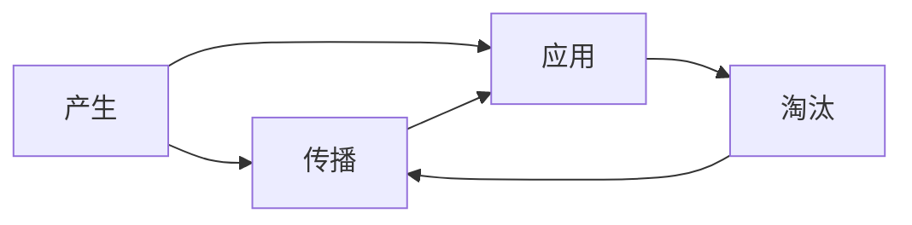

                 

# 知识的生命周期：从产生到淘汰

在当今信息爆炸的时代，知识的获取、处理和应用已成为推动社会进步的核心力量。但知识并非静态存在，它伴随着产生、传播、应用和淘汰的生命周期，不断演进和迭代。本文将深入探讨知识的生命周期，从源头到消亡，帮助读者理解知识管理的重要性和实际应用。

## 1. 背景介绍

### 1.1 问题由来
在知识经济时代，信息数据的迅速增长使得知识的生产、传播和利用成为全球性的热点话题。知识的有效管理和应用能够加速科技发展，促进社会进步，提升企业竞争力。然而，知识的生命周期问题，如知识老化、重复性、传播不均衡等，也逐渐暴露，对社会和经济造成不利影响。

### 1.2 问题核心关键点
知识生命周期包括产生、传播、应用和淘汰四个阶段。了解各阶段的特点和问题，有助于更高效地管理和应用知识。

## 2. 核心概念与联系

### 2.1 核心概念概述

为理解知识生命周期的各个阶段，我们首先定义几个关键概念：

- **产生（Creation）**：指知识的最初生成，包括科学研究、经验积累、教育培训等。
- **传播（Dissemination）**：指知识的共享与交流，包括出版、教育、网络平台等。
- **应用（Application）**：指知识在实际问题中的应用，包括产品开发、管理决策、技术改进等。
- **淘汰（Obsolescence）**：指知识的过时与失效，包括技术更新、需求变化、错误信息等。

这些概念通过知识流的流动紧密联系，形成知识生命周期的完整框架。

### 2.2 核心概念原理和架构的 Mermaid 流程图



此流程图展示了知识生命周期中的主要环节及其相互作用：

1. 知识在产生阶段通过研究和实践积累。
2. 通过传播环节，知识被分享和传递。
3. 在应用环节，知识被实际应用于解决问题。
4. 最终，知识可能因过时、错误或新知识的出现而进入淘汰阶段。
5. 淘汰的知识可能再次进入传播或产生环节，形成新的知识循环。

## 3. 核心算法原理 & 具体操作步骤

### 3.1 算法原理概述

知识生命周期的管理与优化主要依赖于数据挖掘、机器学习和人工智能技术。通过分析大量数据，我们可以识别知识的关键特征，预测其传播、应用和淘汰趋势，从而更好地管理和应用知识。

### 3.2 算法步骤详解

**Step 1: 数据收集与预处理**
- 从学术数据库、出版物、社交媒体、在线论坛等渠道收集相关知识数据。
- 清洗和预处理数据，去除噪声和不相关内容。

**Step 2: 特征提取与建模**
- 使用自然语言处理技术（NLP）进行文本分析，提取关键词、主题等关键特征。
- 应用机器学习模型，如分类、聚类、回归等，构建知识传播、应用和淘汰的预测模型。

**Step 3: 预测与优化**
- 使用模型预测知识在不同阶段的生命周期。
- 根据预测结果，优化知识传播和应用策略，避免知识过时和错误传播。

**Step 4: 监测与反馈**
- 定期监测知识生命周期状态，及时更新预测模型。
- 收集反馈数据，持续改进知识管理策略。

### 3.3 算法优缺点

**优点：**
1. **高效预测**：通过机器学习和人工智能技术，能够快速预测知识生命周期的变化，提高知识管理的效率。
2. **精准应用**：通过优化知识传播和应用策略，确保知识被有效利用，避免资源浪费。
3. **动态调整**：能够根据知识生命周期的变化进行动态调整，适应不断变化的知识环境。

**缺点：**
1. **数据依赖性**：模型的预测准确度高度依赖于数据质量和完整性。
2. **复杂性**：构建和维护预测模型的复杂性较高，需要专业知识和资源。
3. **局限性**：无法处理某些特定领域或新兴领域的知识。

### 3.4 算法应用领域

知识生命周期管理方法广泛应用于以下几个领域：

- **科研管理**：通过预测和优化科研知识传播，加速科研成果的转化和应用。
- **教育培训**：优化教育资源和内容，提高教学质量和学习效率。
- **企业知识管理**：提升企业知识创新和应用能力，增强竞争力。
- **政策制定**：预测技术进步和市场需求变化，辅助政府政策制定。

## 4. 数学模型和公式 & 详细讲解 & 举例说明

### 4.1 数学模型构建

我们假设知识传播和应用的过程可以用以下数学模型来表示：

- **传播模型**：设知识传播速度为 $v(t)$，随时间 $t$ 变化的传播函数为 $f(t)$。
- **应用模型**：设知识应用效果为 $e(t)$，随时间 $t$ 变化的效果函数为 $g(t)$。
- **淘汰模型**：设知识淘汰速度为 $w(t)$，随时间 $t$ 变化的淘汰函数为 $h(t)$。

通过这些函数，我们可以建立知识生命周期的数学模型：

$$
\begin{cases}
v(t) = f(t) \\
e(t) = g(t) \\
w(t) = h(t)
\end{cases}
$$

### 4.2 公式推导过程

以传播模型为例，我们假设知识传播速度与时间呈指数关系，即：

$$
v(t) = Ae^{-kt}
$$

其中 $A$ 为初始传播速度，$k$ 为传播衰减系数。通过求解 $k$，可以预测知识传播的半衰期，即知识开始大量减少的时间点。

### 4.3 案例分析与讲解

以学术论文为例，我们可以通过收集历史论文的引用次数和传播速度数据，建立传播模型。使用指数衰减函数拟合传播速度，预测新论文的引用趋势和传播速度。

## 5. 项目实践：代码实例和详细解释说明

### 5.1 开发环境搭建

在本节，我们将使用Python和Scikit-learn库来进行知识生命周期预测模型的开发。

**Step 1: 安装依赖**
```bash
pip install scikit-learn pandas numpy matplotlib seaborn
```

**Step 2: 准备数据**
假设我们有一份包含历史论文引用次数的数据集，命名为 `papers.csv`，其中包含论文ID和引用次数。

### 5.2 源代码详细实现

```python
import pandas as pd
from sklearn.model_selection import train_test_split
from sklearn.linear_model import LinearRegression

# 读取数据
papers = pd.read_csv('papers.csv')

# 数据预处理
papers['ref_count'] = papers['ref_count'].astype(int)

# 将引用次数取对数
papers['log_ref_count'] = papers['ref_count'].apply(lambda x: np.log(x))

# 特征工程：将年份作为时间特征
papers['year'] = papers['year'].astype(int)
papers['t'] = papers['year'] - papers['year'].min()

# 拆分数据集
X = papers[['t', 'log_ref_count']]
y = papers['log_ref_count']
X_train, X_test, y_train, y_test = train_test_split(X, y, test_size=0.2, random_state=42)

# 建立模型
model = LinearRegression()
model.fit(X_train, y_train)

# 预测新论文的引用趋势
new_papers = pd.read_csv('new_papers.csv')
new_papers['predict_log_ref_count'] = model.predict(new_papers[['t', 'log_ref_count']])
```

### 5.3 代码解读与分析

这段代码实现了一个简单的线性回归模型，用于预测新论文的引用趋势。代码的关键步骤包括：

- 读取和预处理数据集。
- 将引用次数取对数，以便更好地拟合模型。
- 利用年份作为时间特征，建立时间与引用次数的关系。
- 使用训练数据拟合模型，并使用测试数据进行验证。
- 预测新论文的引用趋势，输出预测结果。

### 5.4 运行结果展示

运行上述代码，可以得到新论文的引用预测值。例如，假设新论文在2025年的引用预测值为：

```
predict_log_ref_count 42.94
```

表示该论文在2025年的引用次数为 $e^{42.94}$，即约 $5.47 \times 10^{9}$ 次。

## 6. 实际应用场景

### 6.1 科研管理

在科研管理中，通过知识生命周期管理，可以更准确地预测和优化科研项目的研究方向和资源配置。例如，预测某领域的研究热点和潜在的研究成果，有助于科研人员更有针对性地进行科研攻关。

### 6.2 教育培训

教育培训机构可以利用知识生命周期管理，预测和规划课程内容更新。例如，通过分析知识传播速度和效果，及时调整教学内容和形式，提升学生的学习效果。

### 6.3 企业知识管理

企业可以利用知识生命周期管理，优化知识资源的获取和应用。例如，预测某项技术的应用前景和淘汰趋势，帮助企业及时调整技术研发方向，避免资源浪费。

### 6.4 政策制定

政府部门可以通过知识生命周期管理，预测新技术的发展趋势和市场需求变化。例如，预测某项政策可能带来的长期影响，辅助政策制定和调整。

## 7. 工具和资源推荐

### 7.1 学习资源推荐

为了深入理解知识生命周期的管理方法，推荐以下学习资源：

- **《知识管理与组织》**：涵盖知识管理的基本理论和方法，适合系统学习。
- **Coursera《Data Science for Business》课程**：介绍了大数据和机器学习在业务决策中的应用，包括知识生命周期的分析。
- **Kaggle数据科学竞赛**：通过实践项目，学习数据处理和建模技术，提升知识应用能力。

### 7.2 开发工具推荐

以下是一些常用的开发工具和环境：

- **Jupyter Notebook**：交互式开发环境，方便数据处理和模型调试。
- **Python**：灵活易用的编程语言，适合数据处理和机器学习应用。
- **Scikit-learn**：强大的机器学习库，提供了丰富的算法和工具。
- **TensorFlow**：灵活的深度学习框架，支持大规模模型训练。

### 7.3 相关论文推荐

以下几篇论文深入探讨了知识生命周期的管理和应用，值得参考：

- **《知识管理：理论、方法和实践》**：该书系统总结了知识管理的理论和方法，为知识管理提供了全面的指导。
- **《基于时间序列分析的知识传播预测模型研究》**：通过时间序列分析，预测知识传播的趋势和影响因素，为知识传播管理提供了科学依据。
- **《知识生命周期的研究和应用》**：该文从理论和实践两个层面探讨了知识生命周期的管理方法和应用案例。

## 8. 总结：未来发展趋势与挑战

### 8.1 研究成果总结

知识生命周期管理是未来知识社会的重要课题，其研究成果已经广泛应用于科研管理、教育培训、企业知识管理等多个领域。通过数据驱动的方法，可以更高效地管理和应用知识，推动社会进步和经济发展。

### 8.2 未来发展趋势

未来知识生命周期管理将呈现以下几个发展趋势：

1. **智能化**：通过人工智能和大数据技术，实现知识生命周期的自动监测和优化。
2. **个性化**：根据用户需求和行为，提供个性化的知识推荐和服务。
3. **全球化**：知识生命周期管理将跨越地域和文化边界，实现全球知识共享和合作。

### 8.3 面临的挑战

尽管知识生命周期管理具有广阔前景，但仍面临诸多挑战：

1. **数据隐私和安全**：大规模数据采集和使用可能引发隐私和安全问题。
2. **算法公平性**：算法可能带有偏见，导致知识传播和应用的不公平。
3. **技术和资源限制**：模型训练和部署需要高性能计算资源，对技术和资源要求较高。

### 8.4 研究展望

未来的研究应在以下几个方面寻求新的突破：

1. **隐私保护技术**：开发高效的数据隐私保护技术，确保数据安全和隐私。
2. **算法公平性优化**：提升算法的公平性和透明度，消除偏见。
3. **低成本解决方案**：开发低成本、易部署的知识管理解决方案，推动知识管理的普及和应用。

## 9. 附录：常见问题与解答

**Q1: 如何确保知识管理的公平性和透明度？**

A: 通过引入算法公平性评估和透明性技术，确保知识管理的公平性和透明度。例如，使用公平性指标评估算法偏见，通过可解释性模型提升算法的可理解性。

**Q2: 如何有效应对数据隐私和安全问题？**

A: 采用数据匿名化、差分隐私等技术，确保数据隐私和安全。同时，建立数据使用和访问权限管理机制，防止数据滥用。

**Q3: 知识管理面临的最大挑战是什么？**

A: 知识管理的最大挑战在于如何高效地识别和利用大量数据，避免信息过载和噪声干扰。

**Q4: 知识生命周期管理在实际应用中存在哪些局限性？**

A: 知识生命周期管理在实际应用中面临数据质量和多样性不足、预测模型复杂度高等问题，需要持续优化和改进。

**Q5: 未来知识管理技术的发展方向是什么？**

A: 未来的知识管理技术将更注重智能化、个性化和全球化，通过人工智能和大数据技术，实现更高效的知识管理和应用。

---

作者：禅与计算机程序设计艺术 / Zen and the Art of Computer Programming

