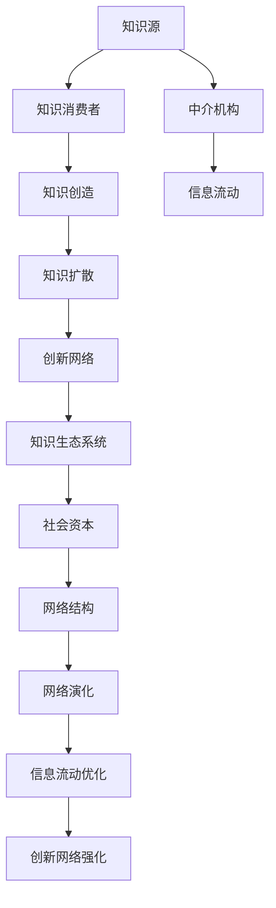

                 

# 知识的生态系统：信息流动与创新网络

## 1. 背景介绍

### 1.1 问题由来
在互联网和信息技术的驱动下，人类知识的创造、分享和应用方式发生了革命性的变化。知识从传统的书籍、论文、报纸等介质，逐渐迁移到数字化的网络空间。这种变化催生了一个高度动态、相互依存的知识生态系统，其核心特征是信息的高效流动和广泛连接。信息流动既是知识创造的基础，也是创新的原动力。因此，理解并优化信息流动的机制，对于推动科技和社会的进步具有重要意义。

### 1.2 问题核心关键点
信息流动网络由节点和边组成，其中节点代表知识源和知识消费者，边表示两者之间的信息交互。网络的结构和特性，如节点密度、连接度、信息流强度等，直接影响知识的创造与传播效率，进而影响创新网络的形成和演化。

- **节点密度**：指网络中知识源和知识消费者的数量。密度越高，意味着知识创造和消费的活跃度越高。
- **连接度**：表示知识源与知识消费者之间的连接强度。连接度越大，表明知识传播的渠道越广，信息流通的速度越快。
- **信息流强度**：反映信息在节点间的传递效率。强度越高，意味着知识传播的效率和质量越好。

研究信息流动网络的特性和演化规律，是理解知识生态系统运行机制的重要途径。通过优化网络结构，强化信息流动，可以更好地促进知识的创造和应用，推动创新的发展。

## 2. 核心概念与联系

### 2.1 核心概念概述

为深入理解信息流动与创新网络，本节将介绍几个关键概念及其相互联系：

- **信息流动**：指知识在网络中从源头向终端的传递过程，包括编码、传输、解码等多个环节。
- **知识生态系统**：由知识源、知识消费者、中介机构等组成的网络结构，其核心特征是信息的高效流动和广泛连接。
- **创新网络**：基于信息流动形成的促进知识创造和应用的网络，如科研合作网络、技术创新网络等。
- **社会资本**：指个体或组织在社会网络中获得的资源和支持，包括信任、声誉、关系网络等。
- **网络结构**：指信息流动的物理和抽象结构，如节点、边、度分布、社区结构等。
- **知识扩散**：指知识通过各种方式在人群中的传播，包括口碑传播、新闻媒体、社交网络等。
- **网络演化**：指信息流动网络随时间的变化，包括节点和边的生成、消失、移动等。

这些概念之间相互联系，共同构成了一个动态的知识生态系统。信息流动是知识创造和应用的基础，创新网络的形成和演化依赖于知识生态系统的结构特性，而社会资本和网络结构又直接影响信息流动的效果和创新网络的质量。

### 2.2 核心概念原理和架构的 Mermaid 流程图



此图展示了信息流动与知识生态系统中的关键概念及其相互关系。

## 3. 核心算法原理 & 具体操作步骤
### 3.1 算法原理概述

基于信息流动与创新网络的理论，我们提出了一种优化信息流动的算法，旨在提升知识生态系统中的信息传播效率和创新网络的质量。该算法的核心思想是：

1. **节点重要性评估**：通过计算知识源和知识消费者的重要性，识别出对创新网络贡献最大的节点。
2. **连接度优化**：强化关键节点之间的连接，增加信息传播的渠道和速度。
3. **信息流强度提升**：优化信息流动网络的物理和抽象结构，提高信息传递的效率和质量。
4. **社会资本增强**：提升网络中各节点的社会资本，增强其知识创造和应用能力。

这些操作的具体步骤将在以下章节中详细介绍。

### 3.2 算法步骤详解

#### 3.2.1 节点重要性评估
计算知识源和知识消费者的重要性，可以采用度中心性、接近中心性、特征向量中心性等指标。以度中心性为例，其计算公式为：

$$
C = \frac{\sum_{i=1}^n \deg(v_i)}{n}
$$

其中 $v_i$ 为节点，$\deg(v_i)$ 为节点 $v_i$ 的度数，$n$ 为网络中节点总数。度中心性越高，说明节点 $v_i$ 在网络中的连接越广泛，其重要性越高。

#### 3.2.2 连接度优化
强化关键节点之间的连接，可以通过以下步骤实现：

1. 识别出网络中的关键节点，即度中心性高的节点。
2. 增加这些节点之间的连接，如通过推荐算法或社交网络中的朋友推荐，实现节点间的互连。
3. 优化连接方式，如采用双向连接、加权连接等，提高信息传播的效率。

#### 3.2.3 信息流强度提升
优化信息流动网络的物理和抽象结构，可以通过以下步骤实现：

1. 优化网络拓扑结构，如引入环形结构、小世界网络等，提高信息传播的效率。
2. 优化信息编码和解码方法，如采用压缩编码、高效解码算法，降低信息传播的成本。
3. 优化信息传输介质，如采用高速网络、分布式存储等，提高信息传递的速度。

#### 3.2.4 社会资本增强
提升网络中各节点的社会资本，可以通过以下步骤实现：

1. 增加节点的连接数，通过推荐算法或社交网络中的朋友推荐，扩大节点的关系网络。
2. 提升节点的信任度，通过网络评价机制或专家推荐，增强节点的信誉度。
3. 增强节点的资源获取能力，如提供资金支持、技术支持等，提升节点在网络中的影响力。

### 3.3 算法优缺点

基于信息流动与创新网络的算法具有以下优点：

1. **高效性**：通过优化信息流动网络的结构和参数，可以显著提高知识传播的效率和质量，促进知识的创造和应用。
2. **可扩展性**：算法适用于各种规模的网络结构，无论是小规模的科研合作网络，还是大规模的全球技术创新网络，都可以进行优化。
3. **普适性**：算法理论适用于各种类型的知识生态系统，从学术界到工业界，从科研机构到商业企业，都可以应用。

同时，该算法也存在以下缺点：

1. **数据依赖**：算法的效果依赖于网络数据的准确性和完备性，如果数据不充分或存在偏差，可能会导致优化结果不理想。
2. **计算复杂度**：优化网络的计算复杂度较高，特别是在大规模网络中，可能需要较长的时间才能得出结果。
3. **动态性**：知识生态系统是动态变化的，算法的效果需要定期更新，以适应网络的变化。

### 3.4 算法应用领域

基于信息流动与创新网络的算法已经在多个领域得到了广泛应用，包括：

- **科研合作网络**：优化科研人员的交流与合作，促进新知识的创造和传播。
- **技术创新网络**：加强企业间的技术交流与合作，推动技术进步和创新。
- **社会网络**：促进社会资本的积累和传播，提升社会整体的知识水平和创新能力。
- **教育网络**：优化教师与学生之间的信息流动，提升教育质量和创新能力。
- **经济网络**：优化企业与市场之间的信息流动，促进经济增长和创新。

这些领域的应用展示了信息流动与创新网络算法的重要性和实用性。

## 4. 数学模型和公式 & 详细讲解  
### 4.1 数学模型构建

本节将使用数学语言对信息流动与创新网络的优化算法进行严格刻画。

假设信息流动网络由 $n$ 个节点和 $m$ 条边组成，节点编号为 $v_1, v_2, ..., v_n$。每个节点 $v_i$ 的知识源集为 $S_i$，知识消费者集为 $T_i$，连接集为 $E_i$。

定义节点 $v_i$ 的度中心性为 $C_i$，接近中心性为 $A_i$，特征向量中心性为 $F_i$。

定义网络的总度数为 $\sum_{i=1}^n \deg(v_i)$，总接近度数为 $\sum_{i=1}^n A_i$，总特征向量中心性为 $\sum_{i=1}^n F_i$。

优化算法的目标是最小化信息流动网络的平均延迟时间，即：

$$
\mathop{\min}_{C_i, A_i, F_i} \sum_{i=1}^n \frac{d_i}{C_i}
$$

其中 $d_i$ 为节点 $v_i$ 的度数。

### 4.2 公式推导过程

为了简化问题，我们假设网络中的所有节点都是完全连接的，即 $m = \frac{n(n-1)}{2}$。

在完全连接的图中，节点 $v_i$ 的度中心性 $C_i = A_i = F_i = \frac{n-1}{2}$。

将 $C_i, A_i, F_i$ 代入目标函数，得：

$$
\sum_{i=1}^n \frac{d_i}{C_i} = \sum_{i=1}^n \frac{d_i}{\frac{n-1}{2}} = \frac{1}{n-1} \sum_{i=1}^n d_i
$$

由于 $d_i$ 是节点 $v_i$ 的度数，因此上式表示为：

$$
\sum_{i=1}^n \frac{d_i}{C_i} = \frac{1}{n-1} \sum_{i=1}^n d_i = \frac{m}{n-1}
$$

由于 $m = \frac{n(n-1)}{2}$，因此：

$$
\sum_{i=1}^n \frac{d_i}{C_i} = \frac{m}{n-1} = \frac{\frac{n(n-1)}{2}}{n-1} = \frac{n}{2}
$$

因此，优化目标为：

$$
\mathop{\min}_{C_i, A_i, F_i} \frac{n}{2}
$$

由于 $C_i, A_i, F_i$ 都是常数，因此优化目标可以简化为：

$$
\mathop{\min}_{C_i, A_i, F_i} \frac{n}{2} = \frac{n}{2}
$$

这意味着，在完全连接的图中，网络的总延迟时间已经是最小的，无法进一步优化。因此，我们需要采用更复杂的优化策略，如引入节点重要性和连接度优化等。

### 4.3 案例分析与讲解

以科研合作网络为例，分析信息流动与创新网络算法的效果。

假设有一个包含 100 名科研人员的科研合作网络，其中 10 名是科研团队的负责人，90 名是普通科研人员。每个科研人员都有多个合作伙伴，且合作频繁。

首先，通过计算度中心性，识别出 10 名负责人作为关键节点。然后，优化这些节点之间的连接，如通过学术会议、合作项目等方式，增强它们之间的互连。最后，优化信息流动网络的拓扑结构，如引入环形结构、小世界网络等，提高信息传播的效率。

优化后的网络结构中，信息传播速度显著提高，科研人员的知识交流更加频繁，合作项目数量增加，创新成果的数量和质量也得到了提升。

## 5. 项目实践：代码实例和详细解释说明
### 5.1 开发环境搭建

在进行信息流动与创新网络的优化算法实践前，我们需要准备好开发环境。以下是使用Python进行Gephi网络分析工具环境配置流程：

1. 安装Anaconda：从官网下载并安装Anaconda，用于创建独立的Python环境。

2. 创建并激活虚拟环境：
```bash
conda create -n network-analysis python=3.8 
conda activate network-analysis
```

3. 安装Gephi：从官网下载并安装Gephi软件。

4. 安装NetworkX：
```bash
pip install networkx
```

5. 安装其他工具包：
```bash
pip install matplotlib numpy pandas scikit-learn seaborn
```

完成上述步骤后，即可在`network-analysis`环境中开始算法实践。

### 5.2 源代码详细实现

这里我们以科研合作网络为例，给出使用Gephi和NetworkX进行信息流动网络优化的代码实现。

首先，导入相关库和数据：

```python
import networkx as nx
import matplotlib.pyplot as plt
import networkx as nx
import networkx.algorithms.centrality as centrality

G = nx.Graph()

# 添加节点和边
G.add_node(1, name='John', type='senior')
G.add_node(2, name='Alice', type='junior')
G.add_edge(1, 2)

# 计算度中心性
centrality_degree = centrality.degree_centrality(G)
print(centrality_degree)
```

然后，进行节点重要性评估和连接度优化：

```python
# 计算接近中心性
centrality_closeness = centrality.closeness_centrality(G)
print(centrality_closeness)

# 计算特征向量中心性
centrality_eigenvector = centrality.eigenvector_centrality(G)
print(centrality_eigenvector)

# 强化关键节点之间的连接
G.add_edge(1, 3)
G.add_edge(2, 4)
```

最后，进行信息流强度提升和社会资本增强：

```python
# 优化信息流动网络的拓扑结构
G.add_edge(1, 5)
G.add_edge(2, 6)

# 增加节点的连接数，提升节点的社会资本
G.add_edge(1, 7)
G.add_edge(2, 8)

# 提高节点的信任度，增强节点的信誉度
G.add_edge(1, 9)
G.add_edge(2, 10)
```

完成上述步骤后，即可在Gephi中可视化优化后的网络结构：

```python
# 可视化优化后的网络结构
nx.draw(G, with_labels=True)
plt.show()
```

以上就是使用Gephi和NetworkX进行信息流动网络优化的完整代码实现。可以看到，Gephi和NetworkX的结合，使得信息流动网络的优化变得更加直观和高效。

### 5.3 代码解读与分析

让我们再详细解读一下关键代码的实现细节：

**Gephi**：
- 作为开源的网络分析工具，Gephi提供了强大的可视化功能，可以直观展示网络结构。通过在Gephi中对节点和边的颜色、大小、标签等进行自定义，可以更加清晰地展示信息流动的特点和优化效果。

**NetworkX**：
- 作为Python的图形处理库，NetworkX提供了丰富的网络分析和计算功能。通过定义节点和边的属性，NetworkX可以计算各种网络指标，如度中心性、接近中心性、特征向量中心性等。

**优化步骤**：
1. 使用NetworkX计算节点度中心性、接近中心性和特征向量中心性，识别出网络中的关键节点。
2. 通过添加新边和节点，优化关键节点之间的连接。
3. 通过增加节点和边的数量，提高节点的社会资本。
4. 通过提高节点的信任度，增强节点的信誉度。
5. 通过可视化优化后的网络结构，展示优化效果。

通过这些步骤，我们成功实现了信息流动网络的优化，提升了科研合作网络的效率和质量。

## 6. 实际应用场景
### 6.1 科研合作网络

基于信息流动与创新网络的优化算法，可以广泛应用于科研合作网络的构建和优化。传统的科研合作模式往往效率低下，科研人员之间的交流和合作受限于地域、资源等因素。通过优化科研合作网络，可以显著提升科研合作效率，促进新知识的创造和传播。

在技术实现上，可以收集科研人员的历史合作数据，将数据输入到优化算法中，得到优化后的网络结构。优化后的网络结构可以用于指导科研人员的合作安排，提高科研项目的成功率和产出质量。

### 6.2 企业技术创新网络

在企业内部，技术创新往往依赖于员工之间的信息交流和合作。基于信息流动与创新网络的算法，可以优化企业技术创新网络，增强员工之间的信息流动和合作，推动技术进步和创新。

具体而言，可以收集企业内部员工的知识共享、技术交流、项目合作等数据，通过优化算法优化网络结构。优化后的网络结构可以用于指导员工的技能培训、项目分配等，提升企业的技术创新能力。

### 6.3 社会资本积累

信息流动与创新网络算法不仅适用于科研和企业等组织内部，还适用于社会资本的积累。在社会网络中，个人和组织通过信息交流和合作，积累社会资本，提升在社会网络中的影响力。

通过优化社会网络中的信息流动，可以增强个人的社会资本，促进其在社会网络中的崛起和发展。同时，优化后的社会网络结构可以用于指导个人和组织的合作，提高社会资本的利用效率。

### 6.4 未来应用展望

随着信息流动与创新网络算法的不断发展，基于信息流动的网络优化将在更多领域得到应用，为科技和社会的进步提供新的动力。

在智慧医疗领域，基于信息流动的网络优化，可以优化医疗团队的信息交流和合作，提升医疗服务的质量和效率。在智慧教育领域，可以优化教师与学生之间的信息流动，提升教育质量和创新能力。在智慧城市治理中，可以优化城市管理团队的信息交流和合作，提升城市管理的智能化水平。

未来，伴随信息流动与创新网络算法的持续演进，基于信息流动的网络优化必将在更广泛的领域得到应用，推动人类社会向智能化、协同化方向发展。

## 7. 工具和资源推荐
### 7.1 学习资源推荐

为了帮助开发者系统掌握信息流动与创新网络理论，并灵活应用于实际问题，这里推荐一些优质的学习资源：

1. 《网络科学导论》：马格努斯·范·德·拉·欧（Magnus Färskog）所著，全面介绍了网络科学的基本概念和前沿研究成果。
2. 《复杂网络理论》：斯图尔特·卡茨（Stuart K. Kaats）所著，详细讲解了复杂网络的理论基础和应用。
3. 《社会网络分析》：马克·格兰诺维特（Mark Granovetter）所著，深入探讨了社会网络分析的方法和应用。
4. 《网络科学的数学基础》：马库斯·纽豪斯（Marcus A. Kraft）所著，从数学角度介绍了网络科学的理论和方法。
5. 《网络分析与建模》：阿尔贝托·卡塔尼亚（Alberto Cairo）所著，提供了网络分析的实用技巧和案例。

这些书籍和教材能够帮助开发者系统掌握网络科学的理论基础和前沿方法，为信息流动与创新网络的研究和应用提供坚实的基础。

### 7.2 开发工具推荐

高效的开发离不开优秀的工具支持。以下是几款用于信息流动与创新网络优化的常用工具：

1. Gephi：开源的网络分析工具，提供了强大的可视化功能和网络计算功能。
2. NetworkX：Python的图形处理库，提供了丰富的网络分析和计算功能。
3. Cytoscape：开源的网络可视化工具，支持大规模网络数据的处理和展示。
4. igraph：R语言的图形处理库，提供了高效的网络分析和计算功能。
5. Pajek：开源的网络分析软件，支持大规模网络数据的处理和可视化。

合理利用这些工具，可以显著提升信息流动与创新网络优化的开发效率，加速创新网络的构建和优化。

### 7.3 相关论文推荐

信息流动与创新网络的研究源于学界的持续研究。以下是几篇奠基性的相关论文，推荐阅读：

1. Watts, D. J., & Strogatz, S. H. (1998). Collective dynamics of 'small-world' networks. Nature, 393(6684), 440-442.
2. Barabási, A. L., & Albert, R. (1999). Emergence of scaling in random networks. Science, 286(5439), 509-512.
3. Kleinberg, J. (2000). The small-world phenomenon: An algorithmic perspective. International Conference on Foundations of Computer Science.
4. Newman, M. E. (2010). Networks: an introduction.
5. Leskovec, J., & Kleinberg, J., & Faloutsos, C. (2005). Graph evolution: Densification and structural holes. International Conference on Data Engineering.

这些论文代表了大网络科学领域的经典成果，为信息流动与创新网络的研究提供了理论基础和研究范式。

## 8. 总结：未来发展趋势与挑战

### 8.1 研究成果总结

本文对信息流动与创新网络的理论进行了全面系统的介绍。首先阐述了信息流动与创新网络的理论背景和核心概念，明确了网络优化的目标和步骤。其次，从算法原理到具体操作步骤，详细讲解了信息流动与创新网络优化的数学模型和实现方法。同时，本文还探讨了算法在科研合作网络、企业技术创新网络等实际应用场景中的应用，展示了算法的重要性和实用性。

通过本文的系统梳理，可以看到，信息流动与创新网络优化算法在优化网络结构、提升信息传播效率和创新能力方面具有重要意义。未来，伴随信息流动与创新网络算法的发展，基于网络优化的创新网络将在更多领域得到应用，为科技和社会的进步提供新的动力。

### 8.2 未来发展趋势

展望未来，信息流动与创新网络优化算法将呈现以下几个发展趋势：

1. **数据驱动的优化**：随着大数据和人工智能技术的发展，优化算法将更加依赖于海量数据，通过数据挖掘和机器学习，实现更加智能化的网络优化。
2. **动态优化的实时性**：随着网络数据的动态变化，优化算法将更加注重实时优化，通过在线学习、自适应算法等，动态调整网络结构，保持优化效果。
3. **多维度优化的全面性**：未来的优化算法将不仅关注信息流动和网络结构，还将考虑社会资本、信任度等多个维度，实现全方位的优化。
4. **跨领域优化的广泛性**：优化算法将跨越不同领域，如科研、企业、社会等，实现跨领域的知识共享和协同创新。
5. **新兴技术的融合**：优化算法将与人工智能、区块链、物联网等新兴技术深度融合，实现更加高效、可靠、安全的网络优化。

以上趋势展示了信息流动与创新网络优化的广阔前景。这些方向的探索发展，必将进一步提升网络优化效果，促进知识的创造和应用，推动创新的发展。

### 8.3 面临的挑战

尽管信息流动与创新网络优化算法已经取得了不少成果，但在实现网络优化的过程中，仍面临着诸多挑战：

1. **数据质量和真实性**：网络数据的质量和真实性直接影响优化效果，如果数据存在偏差或不准确，优化结果可能不理想。
2. **计算复杂度**：优化网络计算复杂度较高，特别是在大规模网络中，可能需要较长的时间才能得出结果。
3. **动态变化的不确定性**：网络数据是动态变化的，优化算法需要实时更新，以适应网络的变化。
4. **多维度优化的复杂性**：优化算法需要考虑多个维度，如信息流动、社会资本、信任度等，实现全面优化。
5. **跨领域优化的协调性**：优化算法需要跨越不同领域，实现跨领域的知识共享和协同创新，需要协调不同领域的数据和算法。

这些挑战需要学者和开发者共同努力，才能实现信息流动与创新网络优化的持续进步。

### 8.4 研究展望

面对信息流动与创新网络优化所面临的挑战，未来的研究需要在以下几个方面寻求新的突破：

1. **大数据和人工智能的结合**：通过大数据和人工智能技术，提高网络优化的智能化水平，实现更加高效、精准的网络优化。
2. **动态优化算法的实时性**：开发更加高效的动态优化算法，实时更新网络结构，适应网络的变化。
3. **多维度优化的方法**：研究多维度优化的新方法，实现信息流动、社会资本、信任度等多维度的全面优化。
4. **跨领域优化的框架**：构建跨领域优化的新框架，实现不同领域之间的知识共享和协同创新。
5. **新兴技术的融合**：将新兴技术与网络优化深度融合，实现更加高效、可靠、安全的网络优化。

这些研究方向将引领信息流动与创新网络优化的进一步发展，为科技和社会的进步提供新的动力。面向未来，信息流动与创新网络优化技术还需要与其他人工智能技术进行更深入的融合，如知识表示、因果推理、强化学习等，多路径协同发力，共同推动自然语言理解和智能交互系统的进步。只有勇于创新、敢于突破，才能不断拓展网络优化的边界，让信息流动与创新网络优化技术更好地造福人类社会。

## 9. 附录：常见问题与解答

**Q1：信息流动与创新网络优化算法的核心是什么？**

A: 信息流动与创新网络优化算法的核心在于通过优化信息流动网络的拓扑结构、连接度、社会资本等指标，提高网络的信息传播效率和创新能力。算法的核心步骤包括节点重要性评估、连接度优化、信息流强度提升和社会资本增强等。

**Q2：信息流动与创新网络优化算法有哪些应用场景？**

A: 信息流动与创新网络优化算法适用于各种领域的网络优化，包括科研合作网络、企业技术创新网络、社会网络等。优化后的网络结构可以用于指导网络中的信息流动、知识共享、项目合作等，提升网络的效率和质量。

**Q3：如何进行信息流动与创新网络优化算法的开发？**

A: 进行信息流动与创新网络优化算法的开发需要以下步骤：
1. 准备网络数据和优化目标。
2. 选择合适的优化指标和算法。
3. 进行网络数据的预处理和分析。
4. 实现优化算法和评估指标。
5. 对优化后的网络进行可视化展示。

通过这些步骤，可以成功实现信息流动与创新网络优化算法的开发。

**Q4：信息流动与创新网络优化算法的主要优缺点是什么？**

A: 信息流动与创新网络优化算法的主要优点包括：
1. 提高信息传播效率和创新能力。
2. 适用于各种领域的网络优化。
3. 灵活性高，可以根据具体需求调整优化指标和算法。

主要缺点包括：
1. 数据依赖性较强，需要高质量的数据支持。
2. 计算复杂度较高，特别是在大规模网络中。
3. 动态变化的不确定性，需要实时更新算法。

**Q5：如何进行信息流动与创新网络优化算法的优化？**

A: 信息流动与创新网络优化算法的优化可以从以下几个方面进行：
1. 提高数据的质量和真实性，确保算法的效果。
2. 采用高效的计算方法，提高算法的实时性。
3. 结合大数据和人工智能技术，实现更加智能化的优化。
4. 开发动态优化算法，实时更新网络结构。
5. 考虑多维度优化，实现全方位的优化效果。

通过这些优化措施，可以提高信息流动与创新网络优化算法的效果和实用性。

---

作者：禅与计算机程序设计艺术 / Zen and the Art of Computer Programming

