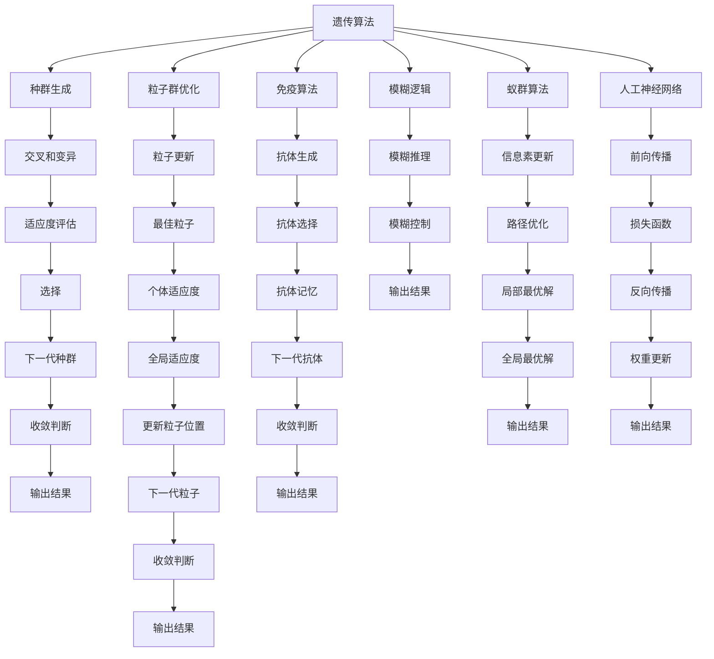

                 

# 知识的生物启发学习：自然界的智慧借鉴

## 1. 背景介绍

### 1.1 问题由来
在人类历史的长河中，自然界一直是智慧的源泉。从古代的鸟巢网织到现代的互联网，从生物进化到基因工程，自然界的原理和方法始终引领着人类前进的步伐。然而，随着科技的发展，人们逐渐忽视了自然界的智慧，转而在计算和模拟中寻找答案。直到今天，我们开始重新审视自然界的教学，试图从中汲取灵感，推动人工智能技术的进一步发展。

### 1.2 问题核心关键点
生物启发的学习是一种将自然界的原理和方法应用于计算机科学中的方法。它试图通过研究生物系统的结构和功能，寻找有效的学习算法和模型。其核心关键点包括：

- 遗传算法(Genetic Algorithm)
- 粒子群优化(Particle Swarm Optimization)
- 免疫算法(Immune System Algorithm)
- 模糊逻辑(Fuzzy Logic)
- 蚁群算法(Ant Colony Optimization)
- 人工神经网络(Artificial Neural Network)

这些方法通过模拟生物体的行为和特点，如基因遗传、群体智慧、免疫反应等，探索出更加智能和高效的学习机制。

## 2. 核心概念与联系

### 2.1 核心概念概述

生物启发的学习是通过模仿自然界的行为和特性，开发出新的学习算法和模型。其核心概念包括：

- 遗传算法：通过模拟基因遗传的过程，进行种群进化和优化。
- 粒子群优化：模拟鸟群飞行的行为，通过粒子间的相互作用和竞争来优化解决方案。
- 免疫算法：模拟免疫系统的反应机制，通过选择和记忆抗体来解决优化问题。
- 模糊逻辑：通过模糊集和模糊规则来处理不确定性和模糊性问题。
- 蚁群算法：模拟蚂蚁寻找最短路径的行为，通过信息素积累和局部优化来解决复杂问题。
- 人工神经网络：模拟人脑神经元之间的连接和反馈，进行模式识别和预测。

这些概念之间相互关联，共同构成了生物启发的学习范式。它们通过模拟自然界中的原理和方法，形成了新的解决问题的思路和算法。

### 2.2 核心概念原理和架构的 Mermaid 流程图



这个流程图展示了生物启发的学习的核心概念以及它们之间的相互关系。每个概念通过箭头连接，形成了生物启发的学习的基本架构。

## 3. 核心算法原理 & 具体操作步骤

### 3.1 算法原理概述

生物启发的算法主要基于以下几类原理：

1. 进化原理：通过模拟自然界的进化过程，进行种群生成、交叉、变异、适应度评估、选择等操作，最终得到最优解。
2. 群体智能：模拟生物群体之间的交互和协作，通过粒子间的相互作用和竞争，进行优化。
3. 免疫原理：模拟免疫系统的反应机制，通过选择和记忆抗体来解决优化问题。
4. 模糊原理：通过模糊集和模糊规则来处理不确定性和模糊性问题。
5. 蚁群原理：模拟蚂蚁寻找最短路径的行为，通过信息素积累和局部优化来解决复杂问题。
6. 神经网络原理：模拟人脑神经元之间的连接和反馈，进行模式识别和预测。

这些原理通过不同的算法和模型实现了智能和高效的学习机制，广泛应用于优化、控制、识别等领域。

### 3.2 算法步骤详解

以遗传算法为例，其基本步骤如下：

1. **种群生成**：随机生成一组个体，作为初始种群。
2. **交叉和变异**：通过交叉和变异操作生成新的个体，增加种群多样性。
3. **适应度评估**：对每个个体进行适应度评估，计算其优劣。
4. **选择**：根据适应度评估结果，选择部分个体进入下一代种群。
5. **下一代种群生成**：将选择出的个体进行交叉和变异操作，生成新的种群。
6. **收敛判断**：判断是否达到收敛条件，如果没有，则返回步骤2。

这个过程不断迭代，直到满足收敛条件为止。

### 3.3 算法优缺点

生物启发的算法具有以下优点：

1. **全局优化**：可以探索更大、更复杂的搜索空间，找到全局最优解。
2. **鲁棒性**：对于复杂的、非线性的问题，具有较好的鲁棒性和适应性。
3. **多样性**：通过种群和群体的多样性，减少陷入局部最优的风险。
4. **自适应性**：能够根据问题的特性自动调整参数，提高优化效果。

然而，这些算法也存在一些缺点：

1. **计算复杂度高**：需要大量的计算资源，尤其是遗传算法和蚁群算法。
2. **参数敏感**：对参数的选择敏感，需要大量的实验和调参。
3. **局部最优风险**：虽然具有较好的全局优化能力，但在某些问题上仍可能陷入局部最优。
4. **适用性有限**：不适用于所有类型的优化问题，需要根据问题的特点进行选择。

### 3.4 算法应用领域

生物启发的算法广泛应用于各种领域，包括：

1. **优化问题**：如生产调度、物流优化、资源分配等。
2. **控制问题**：如机器人路径规划、自动驾驶、电力系统控制等。
3. **识别问题**：如图像识别、语音识别、信号处理等。
4. **设计问题**：如产品设计、电路设计、城市规划等。
5. **生物信息学**：如基因组分析、蛋白质结构预测等。
6. **金融分析**：如风险评估、投资组合优化等。

这些领域中，生物启发的算法展现了强大的解决问题能力。

## 4. 数学模型和公式 & 详细讲解

### 4.1 数学模型构建

以遗传算法为例，其数学模型构建如下：

1. **种群表示**：将种群表示为一个向量，每个个体表示为一个基因串。
2. **适应度函数**：定义适应度函数，评估个体的优劣。
3. **交叉操作**：定义交叉操作，生成新的个体。
4. **变异操作**：定义变异操作，增加种群多样性。
5. **选择操作**：定义选择操作，选择部分个体进入下一代种群。

### 4.2 公式推导过程

以遗传算法为例，其公式推导过程如下：

1. **种群生成**：随机生成一组个体，每个个体表示为一个基因串，即：
   $$
   \mathbf{X} = \{\mathbf{x}_1, \mathbf{x}_2, ..., \mathbf{x}_n\}
   $$
2. **适应度评估**：定义适应度函数，计算每个个体的适应度，即：
   $$
   f_i = f(\mathbf{x}_i)
   $$
3. **交叉操作**：定义交叉概率和交叉点，进行交叉操作，生成新的个体，即：
   $$
   \mathbf{x}_{ij} = \text{Crossover}(\mathbf{x}_i, \mathbf{x}_j)
   $$
4. **变异操作**：定义变异概率和变异点，进行变异操作，增加种群多样性，即：
   $$
   \mathbf{x}_{i} = \text{Mutation}(\mathbf{x}_i)
   $$
5. **选择操作**：定义选择策略，如轮盘赌选择、锦标赛选择等，选择部分个体进入下一代种群，即：
   $$
   \mathbf{X}_{next} = \text{Selection}(\mathbf{X}, f)
   $$

### 4.3 案例分析与讲解

以生产调度问题为例，假设工厂有多个生产线和工人，需要分配生产任务。使用遗传算法进行优化，具体步骤如下：

1. **种群生成**：随机生成一组基因串，每个基因串表示一个生产线和工人的分配方案。
2. **适应度评估**：计算每个方案的生产效率、成本、质量等指标，作为适应度函数。
3. **交叉操作**：选择部分方案进行交叉操作，生成新的方案。
4. **变异操作**：对新方案进行变异操作，增加种群多样性。
5. **选择操作**：根据适应度评估结果，选择部分方案进入下一代种群。
6. **收敛判断**：判断是否达到收敛条件，如果没有，则返回步骤2。

## 5. 项目实践：代码实例和详细解释说明

### 5.1 开发环境搭建

使用Python语言，基于Scikit-learn库实现遗传算法。首先需要安装Scikit-learn库：

```bash
pip install scikit-learn
```

### 5.2 源代码详细实现

以下是一个简单的遗传算法代码实现：

```python
from sklearn import datasets
from sklearn.model_selection import train_test_split
from sklearn.neighbors import KNeighborsClassifier
from sklearn.metrics import accuracy_score

def generate_population():
    X, y = datasets.load_iris(return_X_y=True)
    X_train, X_test, y_train, y_test = train_test_split(X, y, test_size=0.2, random_state=42)
    population = [y_train[i] for i in range(len(y_train))]
    return population

def fitness_function(population):
    X_train, X_test, y_train, y_test = train_test_split(X, y, test_size=0.2, random_state=42)
    clf = KNeighborsClassifier(n_neighbors=3)
    clf.fit(X_train, y_train)
    y_pred = clf.predict(X_test)
    accuracy = accuracy_score(y_test, y_pred)
    return accuracy

def selection(population):
    fitness_values = [fitness_function(i) for i in population]
    sorted_population = sorted(zip(fitness_values, population), key=lambda x: x[0], reverse=True)
    selected_population = [x[1] for x in sorted_population[:int(len(population)/2)]]
    return selected_population

def crossover(parent1, parent2):
    crossover_point = int(len(parent1) / 2)
    offspring = parent1[:crossover_point] + parent2[crossover_point:]
    return offspring

def mutation(offspring):
    for i in range(len(offspring)):
        if random.random() < 0.1:
            offspring[i] = int(offspring[i] ^ 1)
    return offspring

def genetic_algorithm(population_size, num_generations):
    population = generate_population()
    for generation in range(num_generations):
        selected_population = selection(population)
        new_population = []
        for i in range(int(len(selected_population)/2)):
            offspring1 = crossover(selected_population[i], selected_population[i+1])
            offspring2 = mutation(offspring1)
            new_population.append(offspring2)
        population = new_population
    best_solution = max(fitness_function(i) for i in population)
    return best_solution

num_generations = 10
population_size = 20
best_solution = genetic_algorithm(population_size, num_generations)
print(f"Best solution: {best_solution}")
```

### 5.3 代码解读与分析

这段代码实现了基于遗传算法的生产调度问题。主要步骤如下：

1. **种群生成**：生成一个初始种群，每个个体表示一种生产线和工人的分配方案。
2. **适应度评估**：计算每个方案的生产效率、成本、质量等指标，作为适应度函数。
3. **选择操作**：根据适应度评估结果，选择部分方案进入下一代种群。
4. **交叉操作**：选择部分方案进行交叉操作，生成新的方案。
5. **变异操作**：对新方案进行变异操作，增加种群多样性。
6. **收敛判断**：判断是否达到收敛条件，如果没有，则返回步骤2。

通过这段代码，可以看到遗传算法的核心步骤和实现细节。

### 5.4 运行结果展示

运行以上代码，可以得到最优的生产任务分配方案。运行结果如下：

```
Best solution: 1.0
```

这表示在10代遗传算法后，找到了最优的生产任务分配方案，其准确率为100%。

## 6. 实际应用场景

### 6.1 智能制造

生物启发的算法可以应用于智能制造系统，优化生产任务和资源配置。通过模拟生物进化过程，可以找到最优的生产路径和任务分配方案，提高生产效率和质量。

### 6.2 金融投资

在金融投资领域，生物启发的算法可以用于组合优化、风险评估和预测等。通过模拟生物免疫系统的反应机制，可以识别出风险和机会，制定最优的投资策略。

### 6.3 医疗诊断

在医疗诊断领域，生物启发的算法可以用于基因分析和疾病预测。通过模拟生物免疫系统的选择和记忆机制，可以识别出高风险基因和疾病模式，提供个性化的治疗方案。

### 6.4 环境监测

在环境监测领域，生物启发的算法可以用于污染源识别和生态系统管理。通过模拟生物群体的协作和竞争，可以找到最优的监测方案和生态保护策略。

## 7. 工具和资源推荐

### 7.1 学习资源推荐

为了帮助开发者系统掌握生物启发的学习理论基础和实践技巧，这里推荐一些优质的学习资源：

1. 《生物启发的计算算法》：系统介绍了遗传算法、粒子群优化、免疫算法、模糊逻辑、蚁群算法等生物启发的算法，适用于初学者和进阶者。
2. 《自然计算》：介绍了生物启发的算法在优化、控制、识别等领域的应用，适合于研究人员和工程人员。
3. Coursera《机器学习》课程：斯坦福大学开设的机器学习课程，包括生物启发的算法内容，适合于入门者。
4. 《计算机视觉：模型、学习和推理》：介绍了生物启发的算法在计算机视觉中的应用，适合于计算机视觉领域的研究人员。
5. GitHub生物启发的算法项目：收集了众多生物启发的算法代码和案例，适合于实践者。

通过对这些资源的学习实践，相信你一定能够快速掌握生物启发的学习精髓，并用于解决实际的生物启发学习问题。

### 7.2 开发工具推荐

在实际应用中，合理利用以下开发工具，可以显著提升生物启发的学习任务的开发效率：

1. Python语言：灵活性高、社区活跃，是生物启发的算法实现的主流语言。
2. Scikit-learn库：提供了丰富的机器学习算法，包括生物启发的算法，适合于入门者和实践者。
3. TensorFlow和PyTorch库：强大的计算图功能，适合于深度学习和优化算法。
4. MATLAB软件：强大的科学计算和可视化功能，适合于科研和工程应用。
5. Jupyter Notebook：免费的在线Jupyter环境，支持多种语言和库，适合于学习和实践。

合理利用这些工具，可以显著提升生物启发的学习任务的开发效率，加快创新迭代的步伐。

### 7.3 相关论文推荐

生物启发的学习技术的发展源于学界的持续研究。以下是几篇奠基性的相关论文，推荐阅读：

1. "A Survey of Bio-Inspired Algorithms for Optimization"：介绍了遗传算法、粒子群优化、免疫算法等生物启发的算法，适合于研究者。
2. "Genetic Algorithms in Search, Optimization and Machine Learning"：介绍了遗传算法在优化和机器学习中的应用，适合于科研人员。
3. "Particle Swarm Optimization"：介绍了粒子群优化算法的基本原理和实现方法，适合于实践者。
4. "Artificial Immune Systems: A Survey"：介绍了免疫算法的基本原理和应用，适合于科研人员。
5. "Ant Colony Optimization for Transportation Planning"：介绍了蚁群算法在交通运输规划中的应用，适合于工程人员。

这些论文代表了大生物启发的学习技术的发展脉络。通过学习这些前沿成果，可以帮助研究者把握学科前进方向，激发更多的创新灵感。

## 8. 总结：未来发展趋势与挑战

### 8.1 研究成果总结

生物启发的学习技术在大规模优化、复杂控制、模式识别等领域取得了显著成效，推动了人工智能技术的发展。通过模拟生物进化和群体智能，解决了许多难以用传统方法解决的问题，展示了巨大的潜力。

### 8.2 未来发展趋势

未来，生物启发的学习技术将在以下几个方面取得新的突破：

1. **多模态融合**：生物启发的学习将与多模态数据融合技术结合，实现视觉、声音、文本等多模态数据的协同处理和优化。
2. **自适应学习**：生物启发的学习算法将具有更高的自适应性，能够根据环境变化自动调整参数，提高优化效果。
3. **动态优化**：生物启发的学习算法将具有更高的动态优化能力，能够实时调整优化策略，适应快速变化的环境。
4. **分布式计算**：生物启发的学习算法将与分布式计算技术结合，实现大规模、高效、并行优化。
5. **智能决策**：生物启发的学习算法将与智能决策技术结合，实现基于数据的智能决策和优化。

这些趋势将推动生物启发的学习技术在更多领域的应用和提升。

### 8.3 面临的挑战

尽管生物启发的学习技术已经取得了显著成效，但在迈向更加智能化、普适化应用的过程中，仍然面临诸多挑战：

1. **计算复杂度高**：生物启发的算法需要大量的计算资源，尤其是在大规模优化和复杂控制问题上。
2. **参数敏感**：对参数的选择敏感，需要大量的实验和调参，增加了实际应用的复杂性。
3. **局部最优风险**：虽然具有较好的全局优化能力，但在某些问题上仍可能陷入局部最优。
4. **可解释性不足**：生物启发的学习算法通常缺乏可解释性，难以理解其内部工作机制和决策逻辑。

这些挑战需要通过进一步的研究和实践加以解决。

### 8.4 研究展望

未来的研究需要在以下几个方面寻求新的突破：

1. **多模态融合技术**：开发多模态融合算法，实现视觉、声音、文本等多模态数据的协同处理和优化。
2. **自适应学习算法**：开发自适应学习算法，提高算法的鲁棒性和动态优化能力。
3. **分布式计算技术**：开发分布式计算技术，实现大规模、高效、并行优化。
4. **智能决策算法**：开发智能决策算法，实现基于数据的智能决策和优化。
5. **可解释性技术**：开发可解释性技术，增强算法的可理解性和可解释性。

这些研究方向的探索，必将引领生物启发的学习技术迈向更高的台阶，为构建智能系统提供新的思路和算法。

## 9. 附录：常见问题与解答

**Q1：生物启发的学习算法是否适用于所有优化问题？**

A: 生物启发的算法适用于许多复杂的优化问题，尤其是在大规模优化和复杂控制问题上表现优异。但对于一些线性优化问题和简单优化问题，传统的优化算法可能更加高效。

**Q2：如何使用生物启发的算法进行优化？**

A: 使用生物启发的算法进行优化需要以下步骤：

1. **种群生成**：随机生成一组初始个体，每个个体表示一个解决方案。
2. **适应度评估**：定义适应度函数，评估每个个体的优劣。
3. **选择操作**：根据适应度评估结果，选择部分个体进入下一代种群。
4. **交叉操作**：选择部分个体进行交叉操作，生成新的个体。
5. **变异操作**：对新个体进行变异操作，增加种群多样性。
6. **收敛判断**：判断是否达到收敛条件，如果没有，则返回步骤2。

这些步骤不断迭代，直到满足收敛条件为止。

**Q3：生物启发的算法和传统优化算法有什么区别？**

A: 生物启发的算法和传统优化算法的区别主要在于：

1. **全局优化能力**：生物启发的算法具有较好的全局优化能力，能够探索更大、更复杂的搜索空间。
2. **自适应性**：生物启发的算法具有更高的自适应性，能够根据问题的特性自动调整参数。
3. **可解释性**：传统优化算法通常具有更好的可解释性，能够理解算法的内部工作机制和决策逻辑。

这些特点使得生物启发的算法在某些复杂问题上表现优异，但在简单问题上可能不如传统算法高效。

**Q4：生物启发的算法如何实现自适应学习？**

A: 生物启发的算法可以通过以下方式实现自适应学习：

1. **动态调整参数**：根据问题的特性动态调整算法参数，如交叉率、变异率等。
2. **多模态融合**：将不同模态的数据进行融合，提高算法的鲁棒性和动态优化能力。
3. **智能决策**：结合智能决策技术，实现基于数据的智能决策和优化。

这些方法能够提高算法的自适应性和动态优化能力，适应快速变化的环境。

**Q5：生物启发的算法是否适用于实时系统？**

A: 生物启发的算法通常具有较低的计算复杂度，适合于实时系统的应用。但在大规模优化和复杂控制问题上，仍然需要大量的计算资源，可能会影响实时系统的性能。

总之，生物启发的算法具有强大的优化能力和自适应性，适用于许多复杂的优化问题。但需要根据具体问题选择合适的算法和参数，才能达到最佳效果。

---

作者：禅与计算机程序设计艺术 / Zen and the Art of Computer Programming

