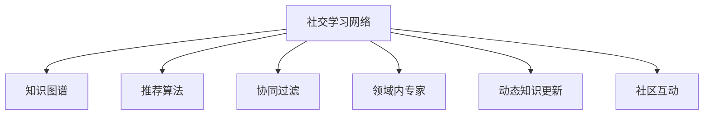

                 

# 知识的社交学习网络：peer-to-peer教育模式

> 关键词：社交学习网络, peer-to-peer教育模式, 知识图谱, 推荐算法, 协同过滤, 领域内专家, 动态知识更新, 社区互动

## 1. 背景介绍

### 1.1 问题由来
随着互联网技术的飞速发展，知识的获取和传播方式正在发生深刻变革。传统的单向知识灌输模式逐渐被替代，人们更倾向于通过互动、协作的方式进行学习。 Peer-to-Peer（P2P）教育模式正是在这一背景下兴起的，它利用网络中个体之间的直接互动来提升学习效果，实现知识的共享与传递。

然而，P2P教育模式中也存在一些问题。由于缺乏有效的知识组织和推荐机制，学习者在大量信息中找到有价值的内容往往需要耗费大量时间和精力。同时，由于知识更新速度极快，仅靠单个学习者进行知识积累和更新难以满足快速发展的需要。

## 2. 核心概念与联系

### 2.1 核心概念概述

为了更好地理解知识的社交学习网络，这里首先介绍几个核心概念：

- **社交学习网络**：一种基于社交关系的学习模式，通过学习者之间的互动，实现知识的传递和更新。它强调个体之间的交互，通过社区协作、知识共享等方式进行学习。

- **Peer-to-Peer教育模式**：指学习者之间通过直接互动进行知识交流和学习的模式。它打破了传统的教师-学生单向知识传递模式，更加注重个体之间的互动和协作。

- **知识图谱**：一种结构化表示知识的方式，通过节点和边来描述实体之间的关系，形成知识网络，方便知识检索和推荐。

- **推荐算法**：根据用户的历史行为和兴趣，推荐合适的知识内容。常见的推荐算法包括协同过滤、基于内容的推荐等。

- **协同过滤**：一种利用用户之间的相似性进行知识推荐的方法，包括基于用户的协同过滤和基于物品的协同过滤。

- **领域内专家**：具有某领域深厚知识和经验的专家，能够在特定领域提供高质量的知识和指导。

- **动态知识更新**：知识网络中的知识不是静态的，而是随着时间和环境的变化不断更新和迭代。动态更新能够确保知识的最新性和实用性。

- **社区互动**：社区成员之间的频繁交流和互动，有助于知识的多样化积累和快速传播。

这些核心概念之间的逻辑关系可以通过以下Mermaid流程图来展示：



这个流程图展示了几大核心概念以及它们之间的内在联系：社交学习网络利用知识图谱进行知识的组织和表示，通过推荐算法和协同过滤对知识进行个性化推荐，借助领域内专家提供高质量的知识内容，并结合动态知识更新和社区互动，不断丰富和更新知识网络。

## 3. 核心算法原理 & 具体操作步骤

### 3.1 算法原理概述

基于社交学习网络的P2P教育模式，核心在于构建一个知识图谱，并通过推荐算法对知识进行个性化推荐。其核心思想是利用个体之间的社交关系，结合用户行为数据，挖掘知识间的联系，从而提升学习效率。

假设知识图谱为 $G(V,E)$，其中 $V$ 表示知识节点集合，$E$ 表示知识关系集合。用户 $u$ 对知识节点 $v$ 的兴趣度可以用 $I(u,v)$ 表示。知识图谱通过推荐算法 $R$ 对用户进行知识推荐，即 $R(u) = \{v | I(u,v) > \theta\}$，其中 $\theta$ 为阈值。

### 3.2 算法步骤详解

基于社交学习网络的P2P教育模式，通常包括以下几个关键步骤：

**Step 1: 构建知识图谱**
- 收集领域内知识，通过实体识别、关系抽取等方式构建知识图谱。
- 选择合适的图谱表示方法，如RDF、OWL等。

**Step 2: 定义推荐模型**
- 选择合适的推荐算法，如协同过滤、基于内容的推荐等。
- 对用户行为数据进行建模，如点击、评论、收藏等。
- 设计损失函数和优化目标，最小化推荐误差。

**Step 3: 训练推荐模型**
- 使用用户的交互数据训练推荐模型，求解最优参数。
- 应用交叉验证等技术，评估推荐效果。

**Step 4: 实时推荐**
- 在知识图谱和推荐模型基础上，实时计算用户感兴趣的知识节点。
- 根据用户反馈，动态调整推荐策略。

**Step 5: 社区互动与知识更新**
- 通过社区互动模块收集用户反馈和讨论，更新知识图谱。
- 引入领域内专家，对新知识进行审核和标注，确保知识质量。

### 3.3 算法优缺点

基于社交学习网络的P2P教育模式，具有以下优点：
1. 充分利用社交关系。通过学习者之间的互动，加速知识传播和更新。
2. 实现个性化推荐。通过推荐算法，提升用户的学习效率。
3. 动态更新知识图谱。不断加入新知识，保持知识的时效性和实用性。
4. 社区互动丰富。社区成员之间的交流互动，有助于知识的多样化和深入理解。

同时，该方法也存在一定的局限性：
1. 对数据质量要求高。需要大量的高质量用户行为数据和知识数据，否则推荐效果不佳。
2. 知识图谱构建复杂。知识图谱的构建需要丰富的领域知识，涉及实体识别、关系抽取等技术。
3. 推荐算法复杂。推荐算法的设计和训练需要考虑多种因素，如用户兴趣、知识相关性等。
4. 社区管理困难。社区中可能存在不和谐行为，需要有效的管理措施和用户审核机制。

尽管存在这些局限性，但就目前而言，基于社交学习网络的P2P教育模式仍是一种非常有前景的学习方式，尤其适用于社交网络高度发达的现代社会。未来相关研究的重点在于如何进一步优化推荐算法，降低对高质量数据的依赖，提高知识图谱的构建效率，以及增强社区互动的和谐性。

### 3.4 算法应用领域

基于社交学习网络的P2P教育模式，在多个领域得到了广泛应用，例如：

- 在线教育平台：如Coursera、Khan Academy等，通过社交网络实现知识的传递和互动，提升学习效率。
- 学术社交网络：如ResearchGate、Google Scholar等，利用学术领域的知识图谱和推荐算法，帮助学者找到相关的研究成果。
- 在线协作工具：如Slack、Microsoft Teams等，通过实时互动和协作，提升团队的工作效率。
- 社交问答平台：如Stack Overflow、知乎等，通过社区交流和知识分享，解决用户的技术问题。

除了上述这些经典应用外，P2P教育模式还被创新性地应用到更多场景中，如健康咨询、兴趣社区、金融知识分享等，为知识的传播和共享带来了新的机遇。

## 4. 数学模型和公式 & 详细讲解 & 举例说明

### 4.1 数学模型构建

本节将使用数学语言对基于社交学习网络的P2P教育模式进行更加严格的刻画。

记知识图谱为 $G(V,E)$，其中 $V$ 表示知识节点集合，$E$ 表示知识关系集合。用户 $u$ 对知识节点 $v$ 的兴趣度可以用 $I(u,v)$ 表示。知识图谱通过推荐算法 $R$ 对用户进行知识推荐，即 $R(u) = \{v | I(u,v) > \theta\}$，其中 $\theta$ 为阈值。

### 4.2 公式推导过程

以下我们以协同过滤推荐算法为例，推导其计算公式。

设知识图谱中用户 $u$ 对知识节点 $v$ 的兴趣度为 $I(u,v)$，用户 $u$ 的历史行为数据为 $X_u = (x_1, x_2, ..., x_n)$，其中 $x_i$ 表示用户 $u$ 对知识节点 $v_i$ 的兴趣程度。推荐算法通过用户行为数据构建用户-知识项矩阵 $U \times K$，其中 $U$ 表示用户数，$K$ 表示知识项数。知识图谱中的知识关系矩阵为 $K \times K$，其中 $K$ 表示知识项数。

假设用户 $u$ 对知识节点 $v$ 的兴趣度可以通过协同过滤算法计算得到，其计算公式为：

$$
I(u,v) = \frac{1}{|N(v)|}\sum_{i \in N(v)} \frac{X_{ui}}{||X_{ui}||}
$$

其中 $N(v)$ 表示与知识节点 $v$ 直接关联的知识节点集合，$||X_{ui}||$ 表示用户 $u$ 对知识节点 $v$ 的兴趣程度归一化。

### 4.3 案例分析与讲解

假设有一个在线教育平台，收集了用户对不同课程的点击、收藏、评论等行为数据。通过对这些数据进行协同过滤，推荐算法可以为用户推荐与用户行为兴趣相似的课程。假设知识图谱中用户 $u$ 对知识节点 $v_1, v_2, ..., v_n$ 的兴趣度分别为 $I(u,v_1), I(u,v_2), ..., I(u,v_n)$，推荐算法可以通过以下公式计算用户 $u$ 对知识节点 $v$ 的兴趣度：

$$
I(u,v) = \frac{1}{|N(v)|}\sum_{i \in N(v)} \frac{X_{ui}}{||X_{ui}||}
$$

其中 $N(v)$ 表示与知识节点 $v$ 直接关联的知识节点集合，$||X_{ui}||$ 表示用户 $u$ 对知识节点 $v$ 的兴趣程度归一化。推荐算法根据 $I(u,v)$ 的值进行推荐，选择 $I(u,v) > \theta$ 的知识节点 $v$ 作为推荐结果。

## 5. 项目实践：代码实例和详细解释说明

### 5.1 开发环境搭建

在进行知识图谱和推荐算法开发前，我们需要准备好开发环境。以下是使用Python进行PyTorch和PySpark开发的环境配置流程：

1. 安装Anaconda：从官网下载并安装Anaconda，用于创建独立的Python环境。

2. 创建并激活虚拟环境：
```bash
conda create -n pytorch-env python=3.8 
conda activate pytorch-env
```

3. 安装PyTorch：根据CUDA版本，从官网获取对应的安装命令。例如：
```bash
conda install pytorch torchvision torchaudio cudatoolkit=11.1 -c pytorch -c conda-forge
```

4. 安装PySpark：
```bash
pip install pyspark
```

5. 安装各类工具包：
```bash
pip install numpy pandas scikit-learn matplotlib tqdm jupyter notebook ipython
```

完成上述步骤后，即可在`pytorch-env`环境中开始知识图谱和推荐算法的开发。

### 5.2 源代码详细实现

这里我们以基于PySpark的协同过滤推荐系统为例，给出完整代码实现。

首先，定义知识图谱数据结构：

```python
from pyspark.sql import SparkSession

spark = SparkSession.builder.appName("Collaborative Filtering").getOrCreate()

# 定义知识图谱数据结构
class KnowledgeGraph:
    def __init__(self, data):
        self.data = data
        self.graph = None
        
    def build_graph(self):
        self.graph = Graph(self.data)
        
    def load_graph(self):
        return self.graph
    
class Graph:
    def __init__(self, data):
        self.data = data
        self.graph = self._construct_graph()
        
    def _construct_graph(self):
        # 将数据转换为邻接矩阵
        adjacency_matrix = self._to_adjacency_matrix()
        
        # 构建图结构
        graph = PyGraph()
        graph.add_vertices(self.data['id'].unique().tolist())
        graph.add_edges(list(adjacency_matrix.nonzero()))
        
        return graph
    
    def _to_adjacency_matrix(self):
        # 将数据转换为邻接矩阵
        adjacency_matrix = self.data[['id', 'neighbor']].pivot(index='id', columns='neighbor', fill_value=0).to_dense().astype(int)
        
        return adjacency_matrix
    
    def get_neighbors(self, node_id):
        return self.data[self.data['neighbor'] == node_id]['id'].tolist()
```

接着，定义推荐算法的核心逻辑：

```python
from pyspark.sql import Row

class CollaborativeFiltering:
    def __init__(self, graph, user_behavior):
        self.graph = graph
        self.user_behavior = user_behavior
        
    def train(self):
        # 计算用户行为向量和邻接矩阵
        user_behavior_matrix = self._to_user_behavior_matrix()
        adjacency_matrix = self.graph._construct_graph()._to_adjacency_matrix()
        
        # 计算用户行为向量和邻接矩阵的乘积
        product_matrix = user_behavior_matrix.dot(adjacency_matrix)
        
        # 计算用户的兴趣度向量
        user_interest_vector = product_matrix.sum(1)
        
        # 计算用户的兴趣度向量归一化
        user_interest_vector /= user_interest_vector.norm()
        
        return user_interest_vector
    
    def _to_user_behavior_matrix(self):
        # 将用户行为数据转换为行为向量和邻接矩阵
        user_behavior_matrix = self.user_behavior.pivot(index='user_id', columns='item_id', fill_value=0).to_dense().astype(int)
        
        return user_behavior_matrix
    
    def predict(self, user_interest_vector, graph):
        # 计算用户的兴趣度向量与邻接矩阵的乘积
        predict_matrix = user_interest_vector.dot(adjacency_matrix)
        
        # 计算预测结果向量
        predict_vector = predict_matrix.to_dense().astype(float)
        
        # 计算预测结果向量归一化
        predict_vector /= predict_vector.norm()
        
        return predict_vector
```

最后，实现用户行为数据的加载和推荐结果的输出：

```python
from pyspark.sql.functions import col

# 加载用户行为数据
user_behavior = spark.read.json("user_behavior.json")

# 加载知识图谱
graph = KnowledgeGraph(user_behavior)

# 训练推荐模型
cf = CollaborativeFiltering(graph, user_behavior)
user_interest_vector = cf.train()

# 计算推荐结果
predict_vector = cf.predict(user_interest_vector, graph.load_graph())

# 输出推荐结果
recommendations = []
for item_id, score in zip(graph.graph.vertices, predict_vector):
    recommendations.append((item_id, score))
    
recommendations = sorted(recommendations, key=lambda x: x[1], reverse=True)[:10]
print(recommendations)
```

以上就是使用PySpark进行基于协同过滤的推荐系统开发的完整代码实现。可以看到，PySpark提供了强大的分布式计算能力，使得大规模数据的处理和分析变得更加高效。

### 5.3 代码解读与分析

让我们再详细解读一下关键代码的实现细节：

**KnowledgeGraph类**：
- `__init__`方法：初始化知识图谱数据和图结构。
- `build_graph`方法：构建邻接矩阵表示的知识图谱。
- `load_graph`方法：加载已构建的知识图谱。

**Graph类**：
- `__init__`方法：初始化知识图谱数据和邻接矩阵。
- `_construct_graph`方法：构建邻接矩阵表示的知识图谱。
- `_to_adjacency_matrix`方法：将知识图谱数据转换为邻接矩阵。
- `get_neighbors`方法：获取知识节点指定节点的邻接节点列表。

**CollaborativeFiltering类**：
- `__init__`方法：初始化知识图谱和用户行为数据。
- `train`方法：训练协同过滤推荐算法，计算用户的兴趣度向量。
- `_to_user_behavior_matrix`方法：将用户行为数据转换为行为向量和邻接矩阵。
- `predict`方法：根据用户兴趣度向量和邻接矩阵计算推荐结果向量。

**推荐结果输出**：
- 使用Spark计算推荐结果向量，排序后取前10个推荐结果输出。

可以看到，PySpark的分布式计算特性使得大规模知识图谱和推荐算法的实现变得更加简单高效。开发者可以将更多精力放在数据处理、模型改进等高层逻辑上，而不必过多关注底层分布式计算的细节。

当然，工业级的系统实现还需考虑更多因素，如模型的保存和部署、超参数的自动搜索、更灵活的任务适配层等。但核心的协同过滤推荐范式基本与此类似。

## 6. 实际应用场景

### 6.1 在线教育平台

基于知识图谱和推荐算法的P2P教育模式，可以广泛应用于在线教育平台，如Coursera、Khan Academy等。通过收集用户对不同课程的点击、收藏、评论等行为数据，利用协同过滤算法推荐与用户行为兴趣相似的课程，提升学习效率和用户体验。

在技术实现上，可以构建领域内知识图谱，使用协同过滤算法为用户推荐合适的课程。对于热门课程，可以使用领域内专家进行审核和标注，确保课程质量。同时，通过社区互动模块收集用户反馈和讨论，更新知识图谱和推荐算法，不断提升推荐效果。

### 6.2 学术社交网络

学术社交网络如ResearchGate、Google Scholar等，可以利用P2P教育模式进行知识的传递和交流。通过收集用户的科研兴趣、论文引用等行为数据，利用推荐算法为用户推荐相关的研究成果和专家，促进学术知识的传播和共享。

在技术实现上，可以构建学术领域知识图谱，使用推荐算法为用户推荐相关的研究成果和专家。对于重要研究成果，可以使用领域内专家进行审核和标注，确保研究质量的可靠性。同时，通过社区互动模块收集用户反馈和讨论，更新知识图谱和推荐算法，不断提升推荐效果。

### 6.3 在线协作工具

在线协作工具如Slack、Microsoft Teams等，可以利用P2P教育模式进行团队协作和知识共享。通过收集团队成员之间的消息、文档等交互数据，利用推荐算法推荐相关的知识资源，提升团队的工作效率和协作效果。

在技术实现上，可以构建团队领域知识图谱，使用推荐算法为用户推荐相关的知识资源。对于重要的团队文档和任务，可以使用领域内专家进行审核和标注，确保知识资源的权威性和实用性。同时，通过社区互动模块收集用户反馈和讨论，更新知识图谱和推荐算法，不断提升推荐效果。

### 6.4 社交问答平台

社交问答平台如Stack Overflow、知乎等，可以利用P2P教育模式进行技术交流和知识共享。通过收集用户的问题和答案数据，利用推荐算法为用户推荐相关的解决方案，促进技术知识的传播和积累。

在技术实现上，可以构建技术领域知识图谱，使用推荐算法为用户推荐相关的解决方案。对于重要的技术问题和答案，可以使用领域内专家进行审核和标注，确保知识资源的准确性和实用性。同时，通过社区互动模块收集用户反馈和讨论，更新知识图谱和推荐算法，不断提升推荐效果。

## 7. 工具和资源推荐

### 7.1 学习资源推荐

为了帮助开发者系统掌握知识的社交学习网络，这里推荐一些优质的学习资源：

1. 《社交学习网络：理论与实践》系列博文：由社交学习网络技术专家撰写，深入浅出地介绍了社交学习网络的理论基础和实践技巧。

2. CS346《数据挖掘与统计学习》课程：斯坦福大学开设的课程，系统讲解了数据挖掘和统计学习的经典算法，包括协同过滤等推荐算法。

3. 《推荐系统》书籍：推荐系统的经典入门书籍，详细介绍了推荐算法的设计和实现，包括协同过滤、基于内容的推荐等。

4. KDD Cup 2020 Challenge Dataset：KDD Cup 2020推荐系统挑战赛的公开数据集，提供了大量用户行为数据和知识图谱，可用来练习推荐算法。

5. Amazon Fine-Grained Reviews Dataset：Amazon商品评论数据集，可用于用户行为分析和学习推荐算法。

通过对这些资源的学习实践，相信你一定能够快速掌握知识的社交学习网络的精髓，并用于解决实际的推荐问题。

### 7.2 开发工具推荐

高效的开发离不开优秀的工具支持。以下是几款用于知识图谱和推荐算法开发的常用工具：

1. Apache Spark：用于大规模数据处理和分布式计算，适合大数据量的推荐系统开发。

2. TensorFlow：由Google主导开发的开源深度学习框架，生产部署方便，适合大规模工程应用。

3. PySpark：基于Python的Spark API，适合Python开发者使用，提供了便捷的分布式计算接口。

4. PyTorch：基于Python的开源深度学习框架，灵活动态的计算图，适合快速迭代研究。

5. Jupyter Notebook：交互式编程环境，支持Python、R等多种语言，适合数据处理和模型开发。

合理利用这些工具，可以显著提升知识图谱和推荐算法的开发效率，加快创新迭代的步伐。

### 7.3 相关论文推荐

知识图谱和推荐技术的发展源于学界的持续研究。以下是几篇奠基性的相关论文，推荐阅读：

1. Can't Stop the Music: A Platform for Creating Personalized Music Recommendation Systems：介绍了一个基于协同过滤的推荐系统，利用用户行为数据为用户推荐音乐。

2. Factorization Machines for Precision Agriculture and Agricultural Data Mining：提出了一种基于协同过滤的推荐算法，用于精准农业和农业数据分析。

3. Scalable Collaborative Filtering Techniques for Recommender Systems：介绍了一种基于协同过滤的推荐算法，利用用户行为数据为用户推荐商品。

4. A New Synthetic Social Network for Modelling Gemeinschaft and Gesellschaft Dynamics：构建了一个用于研究社会网络的虚拟社区，用于研究社区互动和知识传播。

5. Trust and Disclosure in Recommender Systems：探讨了推荐系统中的信任机制和隐私保护问题，提出了基于社交网络的推荐算法。

这些论文代表了大语言模型微调技术的发展脉络。通过学习这些前沿成果，可以帮助研究者把握学科前进方向，激发更多的创新灵感。

## 8. 总结：未来发展趋势与挑战

### 8.1 总结

本文对基于社交学习网络的P2P教育模式进行了全面系统的介绍。首先阐述了社交学习网络在知识传播和共享中的应用背景和意义，明确了P2P教育模式在提升学习效率、促进知识积累方面的独特价值。其次，从原理到实践，详细讲解了推荐算法的数学原理和关键步骤，给出了推荐系统开发的完整代码实例。同时，本文还广泛探讨了P2P教育模式在在线教育、学术社交网络、在线协作工具、社交问答平台等多个行业领域的应用前景，展示了P2P教育模式的广阔前景。

通过本文的系统梳理，可以看到，基于社交学习网络的P2P教育模式正在成为知识传播和共享的重要范式，极大地拓展了知识图谱和推荐技术的应用边界，为知识的多样化积累和快速传播带来了新的机遇。未来，伴随社交网络的持续发展和推荐算法技术的不断进步，P2P教育模式必将在构建人机协同的智能时代中扮演越来越重要的角色。

### 8.2 未来发展趋势

展望未来，基于社交学习网络的P2P教育模式将呈现以下几个发展趋势：

1. 社交网络与知识图谱深度融合。社交网络的丰富数据将进一步提升知识图谱的构建效率和准确性，知识图谱也将成为社交网络中知识共享的重要工具。

2. 推荐算法日趋多样化。除了传统的协同过滤算法，未来将涌现更多推荐算法，如基于内容的推荐、基于知识图谱的推荐等，提供更加精准和个性化的知识推荐。

3. 用户行为建模深入。推荐算法将更加注重用户行为的多样性和动态性，结合时序建模和联合推荐技术，提供更加全面的用户画像。

4. 推荐系统实时化。推荐系统将更加注重实时性和动态性，通过在线学习技术不断更新推荐模型，确保推荐结果的即时性和准确性。

5. 推荐系统智能化。推荐系统将更加注重机器学习和人工智能技术的应用，引入深度学习、强化学习等技术，提升推荐模型的智能水平。

以上趋势凸显了基于社交学习网络的P2P教育模式的广阔前景。这些方向的探索发展，必将进一步提升知识传播和共享的效率，为知识的多样化和深入理解提供新的机遇。

### 8.3 面临的挑战

尽管基于社交学习网络的P2P教育模式已经取得了显著成果，但在迈向更加智能化、普适化应用的过程中，它仍面临着诸多挑战：

1. 数据隐私和安全。用户行为数据的收集和使用需要严格遵守隐私保护法规，确保用户数据的安全和隐私。

2. 知识图谱构建困难。知识图谱的构建需要大量的领域知识，涉及实体识别、关系抽取等技术，需要大量的时间和资源。

3. 推荐算法复杂。推荐算法的设计和训练需要考虑多种因素，如用户兴趣、知识相关性等，需要不断的模型优化和调参。

4. 社区管理复杂。社区中可能存在不和谐行为，需要有效的管理措施和用户审核机制，确保社区的和谐与稳定。

尽管存在这些挑战，但就目前而言，基于社交学习网络的P2P教育模式仍是一种非常有前景的学习方式，尤其适用于社交网络高度发达的现代社会。未来相关研究的重点在于如何进一步优化推荐算法，降低对高质量数据的依赖，提高知识图谱的构建效率，以及增强社区互动的和谐性。

### 8.4 研究展望

面对基于社交学习网络的P2P教育模式所面临的种种挑战，未来的研究需要在以下几个方面寻求新的突破：

1. 探索无监督和半监督推荐方法。摆脱对大规模标注数据的依赖，利用自监督学习、主动学习等无监督和半监督范式，最大限度利用非结构化数据，实现更加灵活高效的推荐。

2. 研究参数高效和计算高效的推荐范式。开发更加参数高效的推荐方法，在固定大部分预训练参数的情况下，只更新极少量的任务相关参数。同时优化推荐系统的计算图，减少前向传播和反向传播的资源消耗，实现更加轻量级、实时性的部署。

3. 引入更多先验知识。将符号化的先验知识，如知识图谱、逻辑规则等，与神经网络模型进行巧妙融合，引导推荐过程学习更准确、合理的知识表示。

4. 结合因果分析和博弈论工具。将因果分析方法引入推荐模型，识别出推荐结果的关键特征，增强推荐结果的因果性和逻辑性。借助博弈论工具刻画用户行为过程，主动探索并规避推荐模型的脆弱点，提高系统稳定性。

5. 纳入伦理道德约束。在推荐目标中引入伦理导向的评估指标，过滤和惩罚有害的推荐结果，确保推荐系统的公平性和道德性。

这些研究方向的探索，必将引领基于社交学习网络的P2P教育模式走向更高的台阶，为构建安全、可靠、可解释、可控的智能系统铺平道路。面向未来，基于社交学习网络的P2P教育模式还需要与其他人工智能技术进行更深入的融合，如知识表示、因果推理、强化学习等，多路径协同发力，共同推动智能推荐系统的进步。

## 9. 附录：常见问题与解答

**Q1：知识图谱的构建需要多少数据？**

A: 知识图谱的构建需要大量的领域知识，涉及实体识别、关系抽取等技术。具体需要多少数据取决于知识图谱的规模和复杂度。一般来说，需要收集大量的领域数据，才能构建一个完备的知识图谱。

**Q2：推荐算法如何处理稀疏数据？**

A: 推荐算法通常会遇到数据稀疏的问题，即用户-物品矩阵中的大部分元素为零。为了处理稀疏数据，可以采用矩阵分解、协同过滤等技术。其中，矩阵分解将用户行为数据分解为低维向量，可以有效地处理稀疏数据。协同过滤则通过计算用户和物品的相似度，利用相似的用户和物品的推荐结果，填补稀疏矩阵中的零元素。

**Q3：推荐算法如何处理动态数据？**

A: 推荐算法通常需要考虑数据的时序性，即用户行为数据不是静态的，而是随着时间和环境的变化不断更新。为了处理动态数据，可以采用在线学习、增量学习等技术。在线学习通过不断更新模型参数，适应新数据的变化，保持推荐模型的准确性。增量学习则通过不断加入新数据，更新模型参数，确保推荐结果的时效性。

**Q4：推荐算法如何处理多模态数据？**

A: 推荐算法通常需要处理多模态数据，如文本、图像、音频等。为了处理多模态数据，可以采用多模态协同过滤、多模态融合等技术。多模态协同过滤通过融合不同模态的数据，提升推荐结果的准确性和多样性。多模态融合则通过将不同模态的数据进行融合，提供更加全面的用户画像，提升推荐效果。

**Q5：推荐算法如何处理恶意推荐？**

A: 推荐算法需要考虑恶意推荐的问题，即推荐系统可能被恶意利用，产生有害的推荐结果。为了处理恶意推荐，可以引入信任机制和监督机制，确保推荐结果的可靠性和安全性。信任机制通过用户评价和反馈，评估推荐结果的可靠性，提升推荐系统的可信度。监督机制则通过人工审核和监控，防止推荐系统的误导性，确保推荐结果的合法性。

通过回答这些问题，可以看到基于社交学习网络的P2P教育模式在实际应用中还面临许多挑战和问题。如何优化推荐算法、提升数据处理能力、确保系统的安全性，都是未来研究的重要方向。

---

作者：禅与计算机程序设计艺术 / Zen and the Art of Computer Programming

