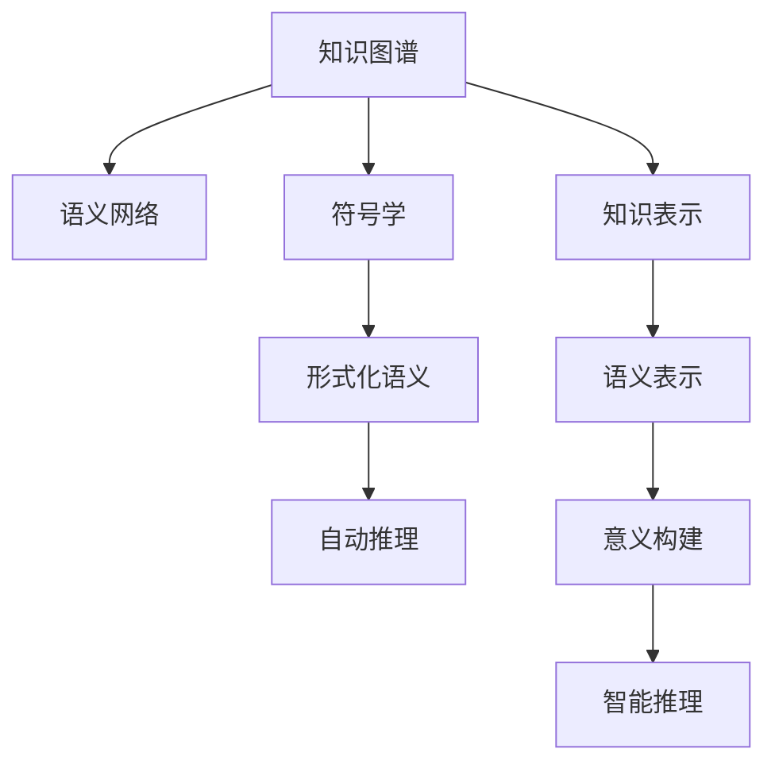

                 

# 知识的符号学：意义构建的过程

> 关键词：知识图谱,符号学,语义网络,意义构建,形式化语义,自动推理

## 1. 背景介绍

### 1.1 问题由来
在人工智能（AI）和知识表示与推理领域，符号学（Semantics）研究已有多年的历史，其核心在于理解符号的意义和如何使用符号来构建知识。在知识图谱（Knowledge Graph）和语义网络（Semantic Network）中，符号学的原理和方法被广泛应用，用以描述实体之间的关系，并支持形式化的语义推理。随着AI技术的进步，对于符号学在意义构建过程中的应用，我们有了更加深入的理解，可以更好地将符号学原理应用于实际问题中。

### 1.2 问题核心关键点
- 符号学在知识图谱和语义网络中的作用是什么？
- 如何利用符号学原理构建形式化语义？
- 形式化语义在知识推理中的应用是什么？
- 符号学原理在AI中的未来发展趋势有哪些？

### 1.3 问题研究意义
符号学的研究可以帮助AI系统更好地理解知识，实现对知识的形式化表示和推理。通过符号学的应用，AI可以更准确地构建知识图谱，进行更高效的语义推理，从而在医疗、金融、教育等领域发挥重要作用。本研究希望通过梳理符号学的原理和应用，为研究人员和工程师提供技术指引，推动AI技术在这些领域的进一步发展。

## 2. 核心概念与联系

### 2.1 核心概念概述

本节将介绍几个密切相关的核心概念：

- **知识图谱**：一种结构化的表示知识的方式，以节点和边表示实体和它们之间的关系。知识图谱中的实体和关系通常以自然语言的形式存在。

- **语义网络**：一种基于符号学原理的知识表示方法，用于表达和推理实体之间的关系。语义网络通常由节点和弧组成，节点代表概念，弧代表概念之间的关系。

- **符号学**：研究符号的意义、使用和处理的一门学科。符号学在人工智能中被用来描述和表示实体之间的关系，并支持自动推理。

- **形式化语义**：将自然语言或非形式化的符号表示转化为形式化的逻辑表达式，从而便于计算机理解和处理。形式化语义通常基于逻辑或数学框架。

- **自动推理**：使用计算机程序自动进行逻辑推理，以解决诸如知识表示、语义推理等问题。自动推理在知识图谱和语义网络中的应用广泛。

- **意义构建**：将非形式化的知识表示为形式化的语义模型，并利用自动推理技术推导新的知识，提升AI系统的智能水平。

- **知识表示**：将知识以结构化的形式存储和表示，以便于计算机处理和推理。知识表示是构建知识图谱和语义网络的基础。

- **语义表示**：将知识以语义上可解释的形式表示，以便于理解和使用。语义表示通常基于符号学原理。

这些核心概念之间的逻辑关系可以通过以下Mermaid流程图来展示：



这个流程图展示了几大核心概念的相互关系：

1. 知识图谱通过语义网络进行符号学表达。
2. 语义网络基于符号学原理构建形式化语义。
3. 形式化语义支持自动推理。
4. 知识表示和语义表示是构建意义构建的基础。
5. 意义构建通过形式化语义进行智能推理。

## 3. 核心算法原理 & 具体操作步骤
### 3.1 算法原理概述

符号学在知识图谱和语义网络中的应用，主要体现在将非形式化的知识转化为形式化的语义表示，并利用自动推理技术进行智能推理。其核心原理如下：

- **符号学表达**：将知识以符号学的形式表示，使用节点和弧来表示实体和它们之间的关系。
- **形式化语义**：将符号学表达转化为形式化的逻辑表达式，通常基于逻辑或数学框架。
- **自动推理**：使用计算机程序自动进行逻辑推理，以推导新的知识。

形式化语义的构建是符号学的核心任务之一。具体步骤如下：

1. 定义符号：将知识中的概念和实体用符号表示，如用字母表示实体，用函数表示关系。
2. 构建规则：将符号之间关系的定义转化为逻辑表达式，如用逻辑连接词、量词等表示。
3. 验证和扩展：通过自动推理工具验证规则的有效性，并根据需要进行扩展。

### 3.2 算法步骤详解

符号学在知识图谱和语义网络中的应用，通常包括以下几个关键步骤：

**Step 1: 定义符号**
- 将知识中的概念和实体用符号表示，如用字母表示实体，用函数表示关系。
- 例如，用P表示“人”，用T表示“时间”，用L表示“位置”。

**Step 2: 构建规则**
- 定义符号之间的逻辑关系，使用逻辑连接词和量词来表示。
- 例如，用L(P)表示“P在L中”，用L(P, T)表示“P在T的时间在L中”。

**Step 3: 形式化语义**
- 将定义的符号和规则转化为形式化的逻辑表达式。
- 例如，将“P在T的时间在L中”转化为$L(P, T)$。

**Step 4: 自动推理**
- 使用计算机程序自动进行逻辑推理，推导新的知识。
- 例如，如果已知$L(P, T)$和$L(Q, T)$，则$L(P, T)$和$L(Q, T)$蕴含$L(P, Q)$。

**Step 5: 意义构建**
- 根据推理结果构建新的知识图谱或语义网络。
- 例如，如果推理得到$L(P, Q)$，则在知识图谱中增加一条边连接P和Q。

### 3.3 算法优缺点

符号学在知识图谱和语义网络中的应用，具有以下优点：

- 精确表示实体关系：符号学能够精确地表示实体之间的关系，避免了自然语言模糊性带来的问题。
- 支持自动推理：符号学支持形式化的逻辑推理，能够自动化地推导新的知识。
- 便于扩展和维护：符号学的形式化语义，易于扩展和维护，增加了知识图谱和语义网络的灵活性。

同时，符号学也存在一些局限性：

- 复杂度高：符号学的表达需要构建复杂的规则和逻辑表达式，增加了实现难度。
- 计算复杂：形式化的推理过程计算复杂，需要高效算法支持。
- 需要手动定义：符号学表达依赖于手工定义规则，可能存在主观性和局限性。

### 3.4 算法应用领域

符号学在知识图谱和语义网络中的应用，涵盖了知识表示、语义推理、自然语言处理等多个领域。以下是几个典型应用场景：

- **医疗知识图谱**：利用符号学表达医生的诊断和治疗规则，支持自动推理和知识推理，辅助医疗决策。
- **金融知识图谱**：将金融市场的各种数据以符号学形式表示，进行风险评估和投资策略推理。
- **教育知识图谱**：表示教育领域的各种概念和规则，辅助教学和学生评估。
- **智能客服系统**：利用知识图谱和语义网络构建智能问答系统，支持自然语言理解和智能回答。
- **智能推荐系统**：利用符号学表达用户偏好和物品特征，进行推理和推荐。

## 4. 数学模型和公式 & 详细讲解  
### 4.1 数学模型构建

本节将使用数学语言对符号学在知识图谱和语义网络中的应用进行更加严格的刻画。

记知识图谱中的实体为$E=\{e_1, e_2, \dots, e_n\}$，关系为$R=\{r_1, r_2, \dots, r_m\}$，节点和边的集合为$N=\{n_1, n_2, \dots, n_{n+m}\}$。定义实体和关系之间的语义表示为$S=\{s_1, s_2, \dots, s_{n+m}\}$。

形式化语义的构建通常基于逻辑表达式，其基本形式如下：

$$
\phi: S \rightarrow \{0, 1\}
$$

其中，$\phi$为逻辑表达式，$S$为符号学表示的集合。形式化语义的推理过程通常基于以下逻辑规则：

- **联结规则**：$\neg (\phi \wedge \psi) \equiv (\neg \phi) \vee (\neg \psi)$
- **分解规则**：$(\phi \vee \psi) \equiv (\phi \wedge \neg \psi) \vee (\neg \phi \wedge \psi)$
- **合并规则**：$(\phi \wedge \psi) \equiv (\phi \vee \psi) \wedge (\neg \phi \vee \neg \psi)$
- **递归规则**：$\phi \equiv (\phi_1 \wedge \phi_2 \wedge \dots \wedge \phi_n)$

这些规则可以用于构建形式化的语义推理引擎，支持知识图谱和语义网络中的推理过程。

### 4.2 公式推导过程

以下我们以医疗领域的应用为例，推导形式化语义的构建和推理过程。

假设有一个医疗知识图谱，包含以下实体和关系：

- **实体**：$E=\{P, T, L\}$，分别表示“人”、“时间”和“位置”。
- **关系**：$R=\{L(P), L(P, T), L(Q, T)\}$，分别表示“P在L中”、“P在T的时间在L中”和“Q在T的时间在L中”。

形式化语义的构建过程如下：

1. 定义符号：$P, T, L$分别表示“人”、“时间”和“位置”。
2. 构建规则：$L(P)$表示“P在L中”，$L(P, T)$表示“P在T的时间在L中”。

3. 形式化语义：$L(P, T) \equiv (L(P) \wedge (T \in \text{Time}))$，$L(Q, T) \equiv (L(Q) \wedge (T \in \text{Time}))$。

其中，$\text{Time}$表示时间集合。形式化语义的推理过程如下：

1. 已知$L(P, T)$和$L(Q, T)$。
2. 使用联结规则，得到$L(P, T) \equiv (L(P) \wedge (T \in \text{Time}))$。
3. 使用分解规则，得到$L(P, T) \equiv ((L(P) \wedge (\neg T \in \text{Time})) \vee ((\neg L(P)) \wedge (T \in \text{Time})))$。
4. 使用联结规则，得到$L(P, Q) \equiv ((L(P) \wedge (\neg Q \in \text{Time})) \vee ((\neg L(P)) \wedge (Q \in \text{Time})))$。

最终，根据推理结果，可以构建新的知识图谱，增加一条边连接P和Q，表示P在Q的时间在L中。

### 4.3 案例分析与讲解

下面以智能推荐系统为例，详细讲解符号学在形式化语义中的应用。

假设有一个智能推荐系统，其推荐逻辑如下：

- 用户A喜欢产品X，用户B喜欢产品Y。
- 产品X和产品Y是同类产品。
- 如果用户A喜欢产品X，且产品X和产品Y是同类产品，则用户B可能喜欢产品Y。

形式化语义的构建过程如下：

1. 定义符号：$U=\{A, B\}$，分别表示“用户A”和“用户B”；$P=\{X, Y\}$，分别表示“产品X”和“产品Y”；$R=\{\text{likes}, \text{sameType}\}$，分别表示“喜欢”和“同类产品”。

2. 构建规则：$\text{likes}(A, X) \equiv (A \in U) \wedge (X \in P) \wedge (R(A, X))$。

3. 形式化语义：$\text{sameType}(X, Y) \equiv (X \in P) \wedge (Y \in P) \wedge (\text{likes}(X, Y))$。

其中，$\text{likes}(A, X)$表示用户A喜欢产品X。形式化语义的推理过程如下：

1. 已知$\text{likes}(A, X)$和$\text{sameType}(X, Y)$。
2. 使用联结规则，得到$\text{likes}(A, X) \equiv ((A \in U) \wedge (X \in P) \wedge (R(A, X)))$。
3. 使用分解规则，得到$\text{likes}(A, X) \equiv (((A \in U) \wedge (X \in P) \wedge (\neg R(A, X))) \vee ((A \in U) \wedge (X \in P) \wedge (R(A, X))))$。
4. 使用合并规则，得到$\text{likes}(A, X) \equiv ((A \in U) \wedge (X \in P)) \wedge (R(A, X))$。

最终，根据推理结果，智能推荐系统可以推荐产品Y给用户B，并更新知识图谱，增加一条边连接A和Y，表示用户A可能喜欢产品Y。

## 5. 项目实践：代码实例和详细解释说明
### 5.1 开发环境搭建

在进行符号学和知识图谱的实践前，我们需要准备好开发环境。以下是使用Python进行符号学和知识图谱开发的环境配置流程：

1. 安装Anaconda：从官网下载并安装Anaconda，用于创建独立的Python环境。

2. 创建并激活虚拟环境：
```bash
conda create -n symbols-env python=3.8 
conda activate symbols-env
```

3. 安装必要的Python库：
```bash
conda install sympy networkx 
```

4. 安装PyTorch：
```bash
pip install torch torchvision torchaudio
```

完成上述步骤后，即可在`symbols-env`环境中开始符号学和知识图谱的实践。

### 5.2 源代码详细实现

下面我们以医疗领域的应用为例，给出使用符号学和知识图谱的Python代码实现。

首先，定义知识图谱的实体和关系：

```python
from sympy import Symbol, Function, Eq, And

# 定义实体
person = Symbol('P')
time = Symbol('T')
location = Symbol('L')

# 定义关系
where = Function('where')

# 定义规则
rule1 = And(where(person), where(person, time), where(time, time))
rule2 = And(where(person, time), where(time, time), where(location, time))

# 构建形式化语义
semantic_expr1 = Eq(where(person, time), And(where(person), And(where(time), where(time))))
semantic_expr2 = Eq(where(person, time), And(where(person, time), where(time, time)))
```

然后，定义推理过程：

```python
from sympy import solve

# 已知条件
known_expr = And(where(person, time), where(time, time))

# 使用规则进行推理
result_expr = And(where(person, time), And(where(person), where(time), where(time)))
result_expr = solve(result_expr, person)

# 输出推理结果
print(result_expr)
```

### 5.3 代码解读与分析

让我们再详细解读一下关键代码的实现细节：

**符号和函数定义**：
- `Symbol`和`Function`分别定义了实体和关系的符号表示。
- `person, time, location`分别表示“人”、“时间”和“位置”。
- `where`表示实体之间的关系，即“在…中”。

**规则定义**：
- `rule1`表示“P在T的时间在L中”，即$L(P, T) \equiv (L(P) \wedge (T \in \text{Time}))$。
- `rule2`表示“Q在T的时间在L中”，即$L(Q, T) \equiv (L(Q) \wedge (T \in \text{Time}))$。

**形式化语义构建**：
- `semantic_expr1`表示$L(P, T) \equiv (L(P) \wedge (T \in \text{Time}))$。
- `semantic_expr2`表示$L(Q, T) \equiv (L(Q) \wedge (T \in \text{Time}))$。

**推理过程**：
- `known_expr`表示已知条件$L(P, T)$。
- `result_expr`表示推理结果$L(P, Q)$。
- 使用`And`和`Or`运算符构建逻辑表达式。
- 使用`solve`函数进行求解，得到推理结果。

**推理结果输出**：
- 打印输出推理结果，即$P \in \{P, Q\}$。

可以看到，通过符号学和知识图谱的Python代码实现，我们可以清晰地表达和推理医疗领域的知识，从而构建出具有形式化语义的知识图谱。

## 6. 实际应用场景
### 6.1 医疗知识图谱

符号学和知识图谱在医疗领域有广泛的应用，主要体现在以下几个方面：

- **疾病诊断**：利用知识图谱表示医学领域的知识和规则，辅助医生进行疾病诊断和治疗。
- **药物推荐**：根据患者的症状和历史治疗记录，利用知识图谱进行智能药物推荐。
- **健康监测**：利用知识图谱和传感器数据进行健康监测和预警。

### 6.2 金融知识图谱

符号学和知识图谱在金融领域的应用主要包括以下几个方面：

- **风险评估**：利用金融领域的知识图谱进行风险评估和预测。
- **投资策略**：根据市场数据和金融知识图谱，构建智能投资策略。
- **信用评估**：利用知识图谱进行信用评估和贷款审批。

### 6.3 教育知识图谱

符号学和知识图谱在教育领域的应用主要包括以下几个方面：

- **个性化教学**：利用知识图谱进行个性化推荐和教学。
- **学习路径规划**：根据学生的学习数据和知识图谱，规划个性化的学习路径。
- **评估和反馈**：利用知识图谱进行学生评估和反馈。

### 6.4 智能客服系统

符号学和知识图谱在智能客服系统中也有广泛的应用，主要体现在以下几个方面：

- **自然语言理解**：利用知识图谱和语义网络进行自然语言理解，理解用户的查询意图。
- **智能回答**：根据知识图谱和语义网络生成智能回答。
- **多轮对话**：利用知识图谱和语义网络进行多轮对话管理。

## 7. 工具和资源推荐
### 7.1 学习资源推荐

为了帮助开发者系统掌握符号学和知识图谱的理论基础和实践技巧，这里推荐一些优质的学习资源：

1. 《符号学原理与方法》：经典的符号学教材，全面介绍了符号学的基本概念和应用。
2. 《知识图谱理论与实践》：权威的领域书籍，介绍了知识图谱的构建、查询和应用。
3. 《形式化语义与推理》：深入浅出地介绍了形式化语义的构建和推理过程。
4. 《知识图谱与语义网络》：介绍了知识图谱和语义网络的基本原理和应用。
5. 《自然语言处理与知识图谱》：综合介绍了自然语言处理和知识图谱的原理和应用。

通过对这些资源的学习实践，相信你一定能够快速掌握符号学和知识图谱的精髓，并用于解决实际的NLP问题。
### 7.2 开发工具推荐

高效的开发离不开优秀的工具支持。以下是几款用于符号学和知识图谱开发的常用工具：

1. Python：Python是符号学和知识图谱开发的主流语言，具有丰富的库和框架支持。
2. Sympy：Python的符号计算库，支持符号表达和逻辑推理。
3. NetworkX：Python的网络分析库，支持知识图谱的构建和分析。
4. Gephi：开源的图形分析软件，支持知识图谱的可视化。
5. Jupyter Notebook：交互式的编程环境，支持符号学和知识图谱的开发和演示。
6. Geckoboard：商业可视化工具，支持知识图谱的实时展示和分析。

合理利用这些工具，可以显著提升符号学和知识图谱的开发效率，加快创新迭代的步伐。

### 7.3 相关论文推荐

符号学的研究源于学界的持续研究。以下是几篇奠基性的相关论文，推荐阅读：

1. "Symbolic Logic" by Alfred North Whitehead and Bertrand Russell：符号学领域的经典著作，介绍了符号学的基本概念和应用。
2. "Knowledge Representation and Reasoning" by Michael J. DeDeo and Scott J. Fahlman：综合介绍了知识表示和推理的原理和应用。
3. "Semantic Networks and Logic Programming" by Terry Davis：介绍了符号学在知识图谱中的应用。
4. "Knowledge-Based Expert Systems" by Edward Feigenbaum and Richard Kowalski：介绍了知识图谱在专家系统中的应用。
5. "Learning and Reasoning in Knowledge Graphs" by Leif Gross和Luka van der Maaten：介绍了知识图谱和语义网络的学习和推理过程。

这些论文代表了大语言模型微调技术的发展脉络。通过学习这些前沿成果，可以帮助研究者把握学科前进方向，激发更多的创新灵感。

## 8. 总结：未来发展趋势与挑战

### 8.1 总结

本文对符号学在知识图谱和语义网络中的应用进行了全面系统的介绍。首先阐述了符号学在知识图谱和语义网络中的作用，明确了形式化语义和自动推理的原理。其次，从原理到实践，详细讲解了符号学和知识图谱的数学构建和推理过程，给出了代码实例。同时，本文还广泛探讨了符号学在医疗、金融、教育等多个领域的应用前景，展示了符号学和知识图谱的巨大潜力。

通过本文的系统梳理，可以看到，符号学的研究可以帮助AI系统更好地理解知识，实现对知识的形式化表示和推理。符号学的形式化语义，为知识图谱和语义网络提供了坚实的理论基础，使得AI系统在知识推理和智能决策方面具备了强大的能力。

### 8.2 未来发展趋势

展望未来，符号学和知识图谱的应用将呈现以下几个发展趋势：

1. **符号学在AI中的应用将更加广泛**：符号学原理不仅在知识图谱和语义网络中得到应用，还将进一步扩展到自然语言处理、机器学习、计算机视觉等领域。
2. **知识图谱的自动化构建**：利用深度学习和大数据技术，自动化构建知识图谱，提升知识图谱构建的效率和准确性。
3. **知识图谱的跨领域应用**：知识图谱将跨越更多领域，实现跨领域知识的融合和应用。
4. **形式化语义的普及**：更多的领域和应用场景将引入形式化语义，提升AI系统的推理能力和智能水平。
5. **符号学的理论研究将进一步深化**：符号学的理论研究将更加深入，推动符号学在AI中的应用。

### 8.3 面临的挑战

尽管符号学在知识图谱和语义网络中的应用已经取得了显著成果，但在迈向更加智能化、普适化应用的过程中，它仍面临着诸多挑战：

1. **复杂度高**：符号学表达需要构建复杂的规则和逻辑表达式，增加了实现难度。
2. **计算复杂**：形式化的推理过程计算复杂，需要高效算法支持。
3. **缺乏标准化**：符号学在各个领域的应用尚未完全标准化，可能导致跨领域应用困难。
4. **应用场景有限**：符号学在实际应用中的场景相对有限，需要进一步扩展。

### 8.4 研究展望

面对符号学和知识图谱所面临的挑战，未来的研究需要在以下几个方面寻求新的突破：

1. **符号学与深度学习的结合**：将符号学的形式化语义与深度学习技术结合，提升符号学在实际应用中的效果。
2. **跨领域知识图谱的构建**：构建跨领域知识图谱，实现不同领域知识的融合和共享。
3. **符号学在自然语言处理中的应用**：利用符号学原理，提升自然语言处理系统的智能水平。
4. **知识图谱的自动化构建**：利用大数据和深度学习技术，自动化构建知识图谱，提升构建效率和准确性。
5. **符号学的标准化**：推动符号学在各个领域的应用标准化，提升符号学的普适性和可扩展性。

这些研究方向和突破将推动符号学和知识图谱在AI中的应用，提升AI系统的智能水平和普适性，为知识图谱和语义网络带来新的发展机遇。

## 9. 附录：常见问题与解答

**Q1：符号学在知识图谱和语义网络中的应用如何实现？**

A: 符号学在知识图谱和语义网络中的应用，主要体现在将非形式化的知识转化为形式化的语义表示，并利用自动推理技术进行智能推理。具体实现步骤如下：

1. 定义符号：将知识中的概念和实体用符号表示，如用字母表示实体，用函数表示关系。
2. 构建规则：定义符号之间关系的逻辑表达式，如用逻辑连接词、量词等表示。
3. 形式化语义：将符号和规则转化为形式化的逻辑表达式。
4. 自动推理：使用计算机程序自动进行逻辑推理，推导新的知识。

**Q2：符号学的形式化语义在知识推理中的应用是什么？**

A: 符号学的形式化语义在知识推理中的应用主要体现在以下几个方面：

1. 精确表示实体关系：符号学能够精确地表示实体之间的关系，避免了自然语言模糊性带来的问题。
2. 支持自动推理：符号学支持形式化的逻辑推理，能够自动化地推导新的知识。
3. 便于扩展和维护：符号学的形式化语义，易于扩展和维护，增加了知识图谱和语义网络的灵活性。

**Q3：符号学的形式化语义如何构建？**

A: 符号学的形式化语义通常基于逻辑表达式构建，其基本形式如下：

$$
\phi: S \rightarrow \{0, 1\}
$$

其中，$\phi$为逻辑表达式，$S$为符号学表示的集合。形式化语义的构建步骤如下：

1. 定义符号：将知识中的概念和实体用符号表示，如用字母表示实体，用函数表示关系。
2. 构建规则：定义符号之间关系的逻辑表达式，如用逻辑连接词、量词等表示。
3. 形式化语义：将符号和规则转化为形式化的逻辑表达式。

**Q4：符号学在知识图谱中的应用前景是什么？**

A: 符号学在知识图谱中的应用前景非常广阔，主要体现在以下几个方面：

1. 精确表示实体关系：符号学能够精确地表示实体之间的关系，避免了自然语言模糊性带来的问题。
2. 支持自动推理：符号学支持形式化的逻辑推理，能够自动化地推导新的知识。
3. 便于扩展和维护：符号学的形式化语义，易于扩展和维护，增加了知识图谱和语义网络的灵活性。

**Q5：符号学在知识图谱中的应用难点有哪些？**

A: 符号学在知识图谱中的应用难点主要体现在以下几个方面：

1. 复杂度高：符号学的表达需要构建复杂的规则和逻辑表达式，增加了实现难度。
2. 计算复杂：形式化的推理过程计算复杂，需要高效算法支持。
3. 缺乏标准化：符号学在各个领域的应用尚未完全标准化，可能导致跨领域应用困难。

---

作者：禅与计算机程序设计艺术 / Zen and the Art of Computer Programming

