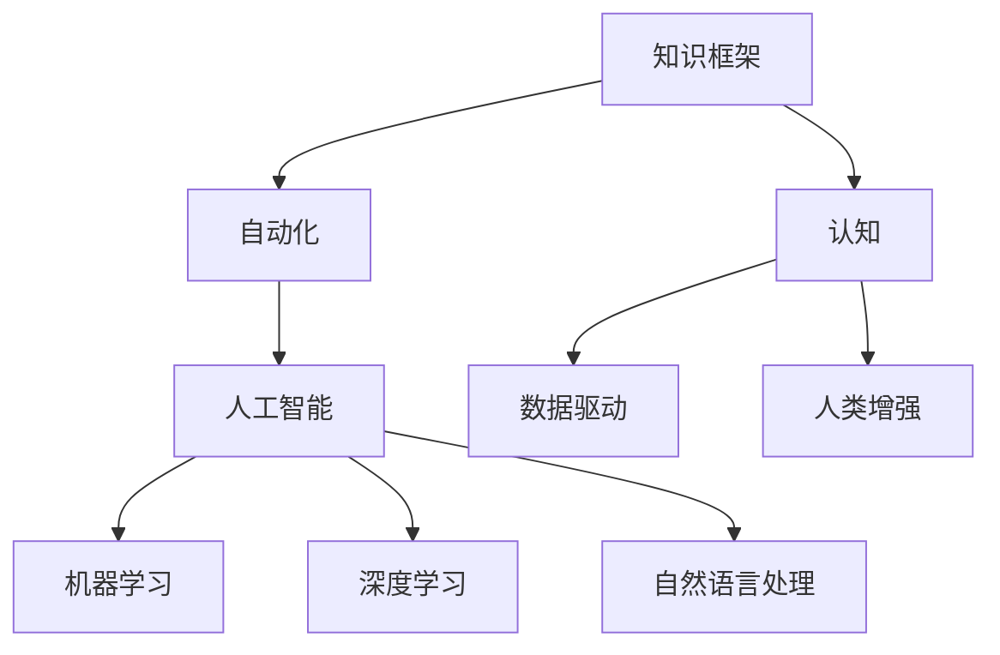

                 

# 知识的系统性：构建完整认知框架

## 1. 背景介绍

在快速迭代和复杂多变的信息时代，构建完整、系统的知识框架变得尤为重要。现代技术的迅猛发展，尤其是人工智能、大数据和机器学习的进步，为知识的系统化提供了新的可能。本文将从认知框架的基本概念出发，探讨如何利用现代技术手段，构建一种高效、系统化的知识框架，从而提升人类的认知能力和决策效率。

## 2. 核心概念与联系

### 2.1 核心概念概述

- **知识框架（Knowledge Framework）**：用于组织、存储和检索知识的概念性结构。知识框架由一系列节点和关系构成，节点代表具体的知识点，关系描述节点之间的连接方式。

- **认知（Cognition）**：人类获取、处理、应用知识的过程。包括感知、记忆、推理、决策等。

- **自动化（Automation）**：利用计算机技术和算法，代替或辅助人工完成认知过程。

- **人工智能（AI）**：模拟人类认知过程的智能技术。包括机器学习、深度学习、自然语言处理等。

- **数据驱动（Data-driven）**：以数据为基础的决策方式，通过大数据分析和挖掘，提升决策的科学性和准确性。

- **人类增强（Human Augmentation）**：借助技术手段，增强人类的认知和决策能力。

这些概念之间的联系可以通过以下Mermaid流程图来展示：



这个流程图展示了知识框架和认知过程的相互依赖关系，以及各技术手段的协同作用。

## 3. 核心算法原理 & 具体操作步骤

### 3.1 算法原理概述

构建知识框架的核心在于如何有效地组织和表示知识。现代认知科学研究表明，人类认知过程遵循一定的结构和模式，即概念图谱（Conceptual Maps）。概念图谱是一种可视化、层次化的知识表示方法，通过节点和连线，形象地表示不同概念之间的逻辑关系。

在算法原理上，知识框架的构建主要涉及以下步骤：

1. **知识采集**：通过网络爬虫、在线数据库、用户输入等方式，收集相关领域的知识数据。
2. **知识标注**：对采集到的数据进行分类、标注，赋予节点和连线以明确的概念和属性。
3. **知识表示**：利用节点和连线，表示不同概念之间的逻辑关系，构建知识图谱。
4. **知识推理**：通过算法进行知识推理，推导新的知识和关系，不断扩展知识框架。

### 3.2 算法步骤详解

**Step 1: 知识采集**

- **网络爬虫**：使用Python的Scrapy等工具，从互联网上抓取相关领域的数据。
- **在线数据库**：如维基百科、百度百科等，提取其中的知识信息。
- **用户输入**：通过Web界面或移动应用，接收用户输入的相关知识数据。

**Step 2: 知识标注**

- **自然语言处理**：利用NLP技术，对采集到的文本进行分词、实体识别、关系提取等处理。
- **知识分类**：将处理后的文本信息，按照预设的分类规则，划分为不同的概念类别。
- **属性标注**：为每个概念赋予属性和特征，如“定义”、“实例”、“关系”等。

**Step 3: 知识表示**

- **节点表示**：将每个概念表示为一个节点，节点中存储概念的定义、属性等信息。
- **连线表示**：通过连线表示概念之间的关系，如“包含”、“关联”、“继承”等。
- **可视化工具**：利用如Cytoscape、Gephi等工具，将知识框架可视化，便于观察和理解。

**Step 4: 知识推理**

- **规则推理**：使用基于规则的推理方法，如生产式规则、启发式规则等，进行知识推理。
- **模型推理**：利用机器学习和深度学习模型，进行基于数据的知识推理。
- **知识扩展**：根据推理结果，不断扩展知识框架，增加新的概念和关系。

### 3.3 算法优缺点

**优点：**

- **系统化**：通过结构化的方式组织知识，有助于系统的理解和应用。
- **可扩展性**：通过不断推理和扩展，知识框架能够持续增长和更新。
- **易维护**：使用可视化工具，方便修改和调整知识结构。
- **数据驱动**：能够利用大数据技术，提升知识推理的准确性和全面性。

**缺点：**

- **复杂度高**：构建和维护知识框架需要较高的技术门槛。
- **资源消耗大**：特别是在大规模知识采集和推理时，计算和存储资源消耗较大。
- **缺乏灵活性**：知识框架一旦建立，修改和调整相对困难。

### 3.4 算法应用领域

知识框架的构建和应用，已经在多个领域得到广泛应用，如：

- **教育**：构建学科知识图谱，辅助教学和评估。
- **医疗**：构建医学知识图谱，支持诊断和治疗。
- **金融**：构建金融知识图谱，辅助投资和风险管理。
- **工程**：构建工程知识图谱，支持设计和优化。
- **法律**：构建法律知识图谱，支持案例研究和判决。
- **环境**：构建环境知识图谱，支持生态保护和资源管理。

## 4. 数学模型和公式 & 详细讲解 & 举例说明

### 4.1 数学模型构建

知识框架的构建涉及多个数学模型，包括但不限于：

- **知识图谱（Knowledge Graph）**：使用图结构表示实体和关系，形式化定义如下：
  - 节点（Node）：表示实体或概念。
  - 边（Edge）：表示实体之间的关系。

- **知识推理（Knowledge Reasoning）**：通过算法进行知识推理，常用的推理方法包括：
  - 规则推理（Rule-Based Reasoning）：基于预设的规则进行推理。
  - 模型推理（Model-Based Reasoning）：利用机器学习或深度学习模型进行推理。

### 4.2 公式推导过程

以知识图谱为例，我们可以用图论中的概念节点和边来表示知识框架。假设有一个简单的知识图谱，包含三个节点A、B、C，以及它们之间的两条边（A-B）和（A-C）。

| 节点       | 定义           | 实例             | 关系             |
|------------|----------------|------------------|------------------|
| A          | 苹果           | 一个水果         | 苹果是水果       |
| B          | 水果           | 一个水果         |                  |
| C          | 水果           | 一个水果         |                  |

知识推理过程中，我们可以通过规则推理或模型推理，得出新的知识。例如，根据（A-B）和（A-C），我们可以推导出（B-C），即“苹果是水果，水果是苹果”。

### 4.3 案例分析与讲解

假设我们要构建一个关于“生物学”的知识框架，可以按照以下步骤进行：

1. **知识采集**：通过网络爬虫和数据库，收集生物学领域的知识数据。
2. **知识标注**：对采集到的数据进行分类和标注，赋予节点和连线明确的生物学概念和属性。
3. **知识表示**：使用节点和连线，表示不同生物学概念之间的关系，构建知识图谱。
4. **知识推理**：利用规则推理或模型推理，推导新的生物学知识和关系，不断扩展知识框架。

例如，在构建“基因组学”子框架时，我们可以收集相关的文献、数据库和实验数据，并标注为基因、DNA、RNA、蛋白质等概念，以及它们之间的关系，如“DNA转录为RNA”、“RNA翻译为蛋白质”等。通过推理，我们可以发现基因突变对蛋白质表达的影响，以及不同基因之间的调控关系。

## 5. 项目实践：代码实例和详细解释说明

### 5.1 开发环境搭建

在进行知识框架构建实践前，我们需要准备好开发环境。以下是使用Python进行PyTorch和Cytoscape开发的环境配置流程：

1. 安装Anaconda：从官网下载并安装Anaconda，用于创建独立的Python环境。

2. 创建并激活虚拟环境：
```bash
conda create -n knowledge-env python=3.8 
conda activate knowledge-env
```

3. 安装PyTorch：根据CUDA版本，从官网获取对应的安装命令。例如：
```bash
conda install pytorch torchvision torchaudio cudatoolkit=11.1 -c pytorch -c conda-forge
```

4. 安装Cytoscape：
```bash
conda install cytoscape -c conda-forge
```

5. 安装各类工具包：
```bash
pip install numpy pandas scikit-learn matplotlib tqdm jupyter notebook ipython
```

完成上述步骤后，即可在`knowledge-env`环境中开始知识框架构建实践。

### 5.2 源代码详细实现

下面我们以构建“基因组学”知识框架为例，给出使用PyTorch和Cytoscape进行知识框架构建的Python代码实现。

首先，定义基因组学知识框架的节点和边：

```python
from cytoscape import Cytoscape, cy_edge, cy_node

# 定义节点
node_A = cy_node('A', {'label': 'DNA', 'data': {'属性': 'DNA', '实例': 'DNA分子', '关系': 'DNA'}})
node_B = cy_node('B', {'label': 'RNA', 'data': {'属性': 'RNA', '实例': 'RNA分子', '关系': 'RNA'}})
node_C = cy_node('C', {'label': '蛋白质', 'data': {'属性': '蛋白质', '实例': '蛋白质', '关系': '蛋白质'}})

# 定义边
edge_AB = cy_edge(node_A, node_B, {'label': '转录', 'data': {'关系': 'DNA转录为RNA', '强度': 1}})
edge_AC = cy_edge(node_A, node_C, {'label': '翻译', 'data': {'关系': 'RNA翻译为蛋白质', '强度': 1}})

# 创建知识框架
graph = Cytoscape()
graph.add_node(node_A)
graph.add_node(node_B)
graph.add_node(node_C)
graph.add_edge(edge_AB)
graph.add_edge(edge_AC)
```

然后，定义知识推理模型：

```python
from sklearn.neural_network import MLPRegressor

# 定义基因表达模型
model = MLPRegressor(hidden_layer_sizes=(100, 100), activation='relu', solver='adam', alpha=0.001)

# 训练模型
X_train = ...
y_train = ...
model.fit(X_train, y_train)

# 预测基因表达量
X_test = ...
y_pred = model.predict(X_test)
```

最后，使用Cytoscape展示推理结果：

```python
# 更新节点属性
node_A.set_property('data', {'基因表达量': y_pred[0]})
node_C.set_property('data', {'基因表达量': y_pred[1]})

# 展示知识框架
graph.show()
```

以上就是使用PyTorch和Cytoscape进行基因组学知识框架构建的完整代码实现。可以看到，利用现代技术手段，我们能够将复杂的知识框架构建过程变得简洁高效。

### 5.3 代码解读与分析

让我们再详细解读一下关键代码的实现细节：

**Cytoscape类**：
- `cy_node`方法：创建节点，接受标签、属性、实例和关系等参数。
- `cy_edge`方法：创建边，接受起点、终点和关系等参数。
- `add_node`方法：将节点添加到知识框架中。
- `add_edge`方法：将边添加到知识框架中。

**MLPRegressor类**：
- 使用sklearn中的多层感知器（MLP）构建基因表达预测模型。
- `hidden_layer_sizes`参数：设置隐藏层的节点数。
- `activation`参数：设置激活函数。
- `solver`参数：设置优化算法。
- `alpha`参数：设置正则化强度。

**知识推理**：
- `fit`方法：使用训练集数据训练模型。
- `predict`方法：使用测试集数据预测基因表达量。

**知识展示**：
- `set_property`方法：更新节点属性，展示推理结果。
- `show`方法：显示知识框架。

可以看到，PyTorch和Cytoscape的结合，使得知识框架构建的代码实现变得简单高效。开发者可以将更多精力放在数据处理和模型改进等高层逻辑上，而不必过多关注底层的实现细节。

当然，工业级的系统实现还需考虑更多因素，如模型的保存和部署、超参数的自动搜索、更灵活的任务适配层等。但核心的知识框架构建流程基本与此类似。

## 6. 实际应用场景

### 6.1 教育

在教育领域，构建完整、系统的知识框架，有助于学生更好地理解和掌握知识。教师可以根据知识框架，制定更加科学合理的教学计划，辅助学生进行自主学习。同时，学生可以通过知识框架，进行自我评估和复习，提高学习效率。

例如，构建物理知识框架，可以将物理定律、公式、实验等内容进行系统化组织，便于学生理解和应用。学生可以通过知识框架，快速查找和理解相关知识点，增强学习效果。

### 6.2 医疗

在医疗领域，构建医学知识图谱，有助于医生更好地理解和应用医学知识。医生可以通过知识图谱，快速查找和应用相关医学信息，提高诊断和治疗效率。

例如，构建疾病知识图谱，可以将各种疾病的定义、症状、治疗方法等内容进行系统化组织。医生可以通过知识图谱，快速查找和应用相关疾病信息，提高诊断和治疗的准确性和效率。

### 6.3 金融

在金融领域，构建金融知识图谱，有助于投资者更好地理解和应用金融知识。投资者可以通过知识图谱，快速查找和应用相关金融信息，提高投资决策的科学性和准确性。

例如，构建金融市场知识图谱，可以将各种金融产品、交易策略、市场指数等内容进行系统化组织。投资者可以通过知识图谱，快速查找和应用相关金融信息，提高投资决策的准确性和效率。

### 6.4 未来应用展望

随着知识框架技术的不断发展，其在更多领域将得到应用，为各行各业带来变革性影响。

在智慧城市治理中，知识框架可以用于城市事件监测、舆情分析、应急指挥等环节，提高城市管理的自动化和智能化水平，构建更安全、高效的未来城市。

在智慧农业中，知识框架可以用于农业生产、病虫害防治、农产品质量监控等环节，提高农业生产的智能化和精准化水平。

在智慧能源中，知识框架可以用于能源消耗监测、智能电网管理、可再生能源利用等环节，提高能源管理的智能化和优化水平。

此外，在教育、医疗、金融、交通、环境保护等多个领域，知识框架技术也将不断涌现，为各行各业的发展注入新的动力。

## 7. 工具和资源推荐

### 7.1 学习资源推荐

为了帮助开发者系统掌握知识框架的基本概念和实践技巧，这里推荐一些优质的学习资源：

1. **《认知框架设计与实现》系列博文**：由知识框架专家撰写，深入浅出地介绍了认知框架的设计和实现方法。

2. **CS231n《计算机视觉》课程**：斯坦福大学开设的计算机视觉明星课程，有Lecture视频和配套作业，带你入门认知框架的基本概念和经典模型。

3. **《认知框架理论与实践》书籍**：全面介绍了认知框架的理论基础和实践方法，涵盖知识图谱、推理算法、应用场景等多个方面。

4. **HuggingFace官方文档**：Cytoscape的官方文档，提供了丰富的知识图谱工具和样例，是入门的必备资料。

5. **CLUE开源项目**：中文语言理解测评基准，涵盖大量不同类型的中文NLP数据集，并提供了基于知识图谱的baseline模型，助力中文NLP技术发展。

通过对这些资源的学习实践，相信你一定能够快速掌握知识框架的精髓，并用于解决实际的NLP问题。

### 7.2 开发工具推荐

高效的开发离不开优秀的工具支持。以下是几款用于知识框架构建开发的常用工具：

1. **PyTorch**：基于Python的开源深度学习框架，灵活的计算图，适合快速迭代研究。知识框架构建中常用的深度学习模型和算法，如神经网络、卷积神经网络等，都有PyTorch版本的实现。

2. **Cytoscape**：开源的知识图谱可视化工具，支持多模态数据融合和复杂网络分析，是知识框架构建的首选工具。

3. **WEKA**：开源的机器学习工具，提供丰富的算法和模型库，支持数据挖掘和知识推理。

4. **Tableau**：数据可视化工具，支持多维数据分析和可视化展示，是知识框架展示和分析的重要工具。

5. **Gephi**：开源的图形分析工具，支持复杂网络分析和大规模数据处理，是知识框架可视化和推理的重要工具。

合理利用这些工具，可以显著提升知识框架构建的开发效率，加快创新迭代的步伐。

### 7.3 相关论文推荐

知识框架和认知科学的进步，源于学界的持续研究。以下是几篇奠基性的相关论文，推荐阅读：

1. **《知识图谱与语义网络》**：提出了知识图谱的概念和定义，探讨了知识图谱的构建方法和应用场景。

2. **《基于知识图谱的信息检索》**：介绍了知识图谱在信息检索中的应用，展示了如何通过知识图谱提升信息检索的准确性和效率。

3. **《认知计算框架》**：全面介绍了认知计算框架的理论基础和实践方法，包括认知模型、推理算法、应用场景等多个方面。

4. **《基于知识图谱的推荐系统》**：研究了知识图谱在推荐系统中的应用，展示了如何通过知识图谱提升推荐系统的精准性和个性化水平。

5. **《认知增强与知识图谱》**：探讨了认知增强技术在知识图谱中的应用，展示了如何通过认知增强技术提升知识图谱的性能和应用效果。

这些论文代表的知识框架和认知科学的发展脉络，通过学习这些前沿成果，可以帮助研究者把握学科前进方向，激发更多的创新灵感。

## 8. 总结：未来发展趋势与挑战

### 8.1 总结

本文对知识框架的基本概念和实践进行了全面系统的介绍。首先阐述了知识框架的基本概念和构建流程，明确了知识框架在认知过程中的重要性。其次，从原理到实践，详细讲解了知识框架的构建方法，给出了知识框架构建任务的完整代码实例。同时，本文还探讨了知识框架在多个行业领域的应用前景，展示了知识框架技术的广阔前景。

通过本文的系统梳理，可以看到，知识框架技术正在成为认知过程的重要工具，极大地提升人类的认知能力和决策效率。未来，伴随知识框架技术的持续演进，相信其在更多领域将得到应用，为各行各业的发展注入新的动力。

### 8.2 未来发展趋势

展望未来，知识框架技术将呈现以下几个发展趋势：

1. **智能化**：利用人工智能技术，提升知识框架的自动构建和推理能力。未来知识框架将具备更高的智能化水平，能够更好地适应复杂多变的场景。

2. **多样化**：知识框架将涵盖更多领域的知识，涵盖教育、医疗、金融、工业等多个行业。未来知识框架将更加丰富、全面，提供更精准的知识服务。

3. **动态化**：知识框架将具备动态更新能力，能够实时更新和扩展知识图谱。未来知识框架将更加灵活、动态，适应数据分布的变化。

4. **协同化**：知识框架将与物联网、大数据、区块链等技术结合，实现跨领域、跨技术的协同应用。未来知识框架将具备更强的协同能力，提升应用效果。

5. **人机融合**：知识框架将与人机交互技术结合，实现人机协同的知识获取和推理。未来知识框架将更加人性化、友好，提升用户体验。

以上趋势凸显了知识框架技术的广阔前景。这些方向的探索发展，必将进一步提升知识框架的性能和应用范围，为人类认知智能的进化带来深远影响。

### 8.3 面临的挑战

尽管知识框架技术已经取得了瞩目成就，但在迈向更加智能化、普适化应用的过程中，它仍面临诸多挑战：

1. **复杂性**：知识框架的构建和维护需要较高的技术门槛，难以满足所有应用场景的需求。未来需要更加自动化、智能化的知识框架构建方法。

2. **数据质量**：知识框架的质量高度依赖于数据的质量和多样性。如何从海量数据中筛选和标注高质量的知识，是知识框架构建的重要挑战。

3. **资源消耗**：知识框架的构建和推理需要消耗大量的计算资源和存储空间。如何优化知识框架的资源消耗，提升推理效率，是知识框架发展的关键问题。

4. **可解释性**：知识框架的推理过程缺乏透明性和可解释性，难以满足高风险应用的需求。如何赋予知识框架更强的可解释性，是未来知识框架的重要研究方向。

5. **安全性和隐私保护**：知识框架的构建和应用涉及大量敏感数据，如何保护数据隐私和系统安全，是知识框架应用的重要保障。

6. **跨领域融合**：知识框架在不同领域的应用需要具备跨领域的适应能力。如何实现知识框架的跨领域融合，提升其通用性和普适性，是知识框架发展的难点。

这些挑战需要我们在未来的研究中持续探索和突破，才能实现知识框架技术的全面落地和应用。

### 8.4 研究展望

面对知识框架面临的诸多挑战，未来的研究需要在以下几个方面寻求新的突破：

1. **知识图谱的自动化构建**：研究如何利用机器学习、深度学习等技术，自动化地构建知识图谱，减少人工标注的工作量。

2. **跨领域知识融合**：研究如何实现不同领域知识图谱的融合，提升知识框架的通用性和普适性。

3. **知识推理的智能化**：研究如何利用人工智能技术，提升知识推理的智能化水平，实现更准确、高效的知识推理。

4. **知识框架的可解释性**：研究如何赋予知识框架更强的可解释性，提高其透明性和可理解性。

5. **知识框架的安全性和隐私保护**：研究如何保护知识框架构建和应用中的数据隐私和安全，确保系统稳定性和安全性。

这些研究方向的探索，必将引领知识框架技术迈向更高的台阶，为构建安全、可靠、可解释、可控的智能系统铺平道路。面向未来，知识框架技术还需要与其他人工智能技术进行更深入的融合，如知识表示、因果推理、强化学习等，多路径协同发力，共同推动认知智能的进步。

总之，知识框架技术的不断发展和应用，将极大地提升人类的认知能力和决策效率，为各行各业的发展注入新的动力。相信随着技术的发展和应用的深入，知识框架技术必将不断突破创新，推动人类认知智能的进步。

## 9. 附录：常见问题与解答

**Q1：构建知识框架需要哪些技术和工具？**

A: 构建知识框架需要多种技术和工具的协同使用。主要包括：

- **自然语言处理**：用于文本的预处理、分词、实体识别等。
- **数据挖掘**：用于从海量数据中筛选和标注高质量的知识。
- **知识图谱**：用于表示和存储知识。
- **机器学习**：用于自动构建和推理知识图谱。
- **可视化工具**：用于展示知识图谱和推理结果。

**Q2：如何提升知识框架的可解释性？**

A: 提升知识框架的可解释性，可以从以下几个方面入手：

- **知识图谱的可视化展示**：利用可视化工具，展示知识图谱的结构和关系。
- **知识推理的规则说明**：为知识推理提供详细的规则和说明，帮助理解推理过程。
- **用户交互和反馈**：利用用户交互技术，获取用户反馈和建议，不断优化知识框架。
- **透明度和开放性**：保持知识框架的透明性和开放性，便于外部审核和验证。

**Q3：知识框架的构建和维护需要多少成本？**

A: 知识框架的构建和维护需要较高的成本，主要包括：

- **技术成本**：需要高水平的技术人才和设备支持。
- **数据成本**：需要大量高质量的标注数据。
- **维护成本**：需要持续更新和维护知识图谱，保证其准确性和时效性。

但随着技术的进步，知识框架的构建和维护成本也在逐渐降低。未来，利用自动化和智能化技术，可以大幅降低知识框架构建和维护的成本。

**Q4：知识框架的应用场景有哪些？**

A: 知识框架的应用场景非常广泛，包括但不限于：

- **教育**：用于辅助教学和评估，帮助学生进行自主学习。
- **医疗**：用于医学知识管理，辅助医生进行诊断和治疗。
- **金融**：用于金融知识管理，辅助投资者进行决策。
- **工程**：用于技术文档管理，辅助工程师进行设计和开发。
- **法律**：用于法律知识管理，辅助律师进行研究和分析。
- **环境保护**：用于环境知识管理，辅助环保部门进行监测和治理。

**Q5：如何应对知识框架构建过程中的数据质量问题？**

A: 应对知识框架构建过程中的数据质量问题，可以从以下几个方面入手：

- **数据筛选**：对海量数据进行筛选，选择高质量、可信的数据。
- **标注规范**：制定标注规范和标准，提高标注数据的准确性和一致性。
- **多源数据融合**：利用多源数据融合技术，综合多种数据源的信息，提升数据质量。
- **持续更新**：定期更新和维护知识图谱，保证其时效性和准确性。

通过综合利用这些方法，可以有效提升知识框架构建过程中的数据质量，提高知识框架的应用效果。

---

作者：禅与计算机程序设计艺术 / Zen and the Art of Computer Programming

