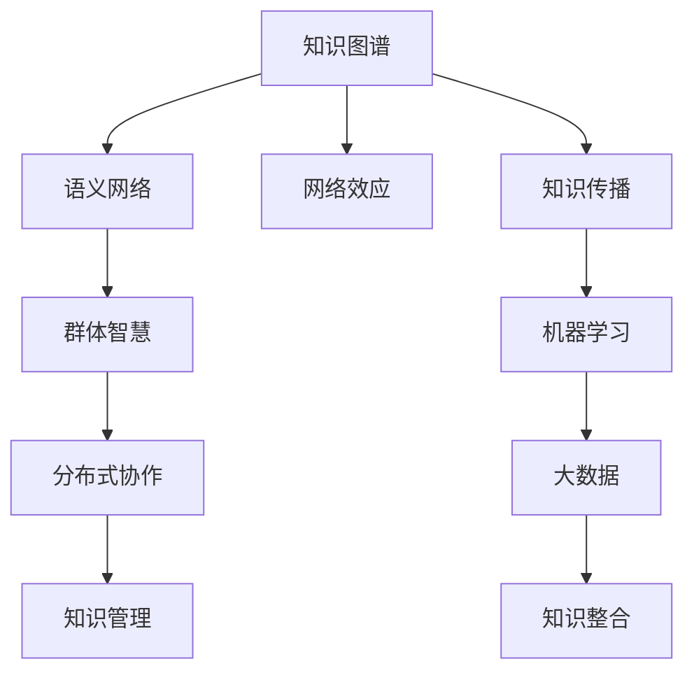

                 

# 知识的网络效应：集体智慧与知识传播

> 关键词：知识图谱,语义网络,网络效应,知识传播,群体智能,分布式协作,知识管理,机器学习

## 1. 背景介绍

在信息化时代，知识作为核心生产要素的重要性日益凸显。传统的知识和信息传播方式已经无法满足现代社会对知识需求的多样化和高效化。随着信息技术的发展，新的知识传播模式正在不断涌现。本文将围绕知识的网络效应、群体智慧和分布式协作等概念，深入探讨知识在网络环境中的传播规律，以及如何通过机器学习和大数据技术，促进知识的有效传播与利用。

### 1.1 问题由来
随着互联网的普及和社交媒体的发展，知识传播的方式和路径发生了深刻变化。传统以线性和单向传播为主的知识传播模式，正逐渐被以互动和网络化传播为特征的新模式所取代。信息传播速度的加快和传播渠道的多样化，使得知识传播更加便捷和高效。

然而，随着知识规模的爆炸式增长，知识的筛选、聚合、共享和应用成为新的挑战。知识孤岛现象严重，知识碎片化和异构化问题突出，阻碍了知识的有效流动和利用。因此，需要新的技术和方法，以支撑大规模、分布式和协作式的知识传播与共享。

## 2. 核心概念与联系

### 2.1 核心概念概述

要理解知识传播的网络效应，首先需要明确几个核心概念：

- **知识图谱(Knowledge Graph)**：一种语义化的知识表示方式，通过节点和边的关系描述实体和概念之间的关联。知识图谱是实现知识自动化管理和传播的基础。
- **语义网络(Semantic Network)**：一种描述实体和概念之间关系的图结构，常用于表示领域知识。语义网络与知识图谱概念相似，但更加注重语义理解。
- **网络效应(Network Effect)**：指网络成员数量的增加会带来网络价值或功能上的提升。知识传播中，网络成员越多，知识共享和创新的效应越明显。
- **知识传播(Knowledge Dissemination)**：指知识从源端向目标端的传递过程。传统的信息传播模型已经难以满足复杂和多样化的知识传播需求。
- **群体智慧(Collective Wisdom)**：指通过多个个体或集体合作，汇聚其知识、经验、技能和创意，实现智慧的提升和创新。群体智慧强调知识的社会性和互动性。
- **分布式协作(Distributed Collaboration)**：指多个个体或团队，通过网络化的方式进行协作，共同完成知识和任务的传播、整合与创新。分布式协作利用了网络中的冗余度和资源共享，提升了知识传播的效率和效果。

这些概念之间的联系可以通过以下Mermaid流程图来展示：



这个流程图展示了几大核心概念及其相互关系：

1. 知识图谱和语义网络是知识传播的基础。
2. 网络效应描述了知识传播过程中的价值提升。
3. 知识传播是知识流动和利用的关键环节。
4. 群体智慧强调了知识的社会性和互动性。
5. 分布式协作通过网络化的方式提升了知识传播的效率。
6. 知识管理和大数据技术辅助知识整合，机器学习提高了知识传播的智能性。

## 3. 核心算法原理 & 具体操作步骤

### 3.1 算法原理概述

知识传播和利用是典型的多智能体系统，涉及大量知识源、知识传递路径和接收节点。知识传播网络中的成员数量越多，知识的传播效果越好。知识图谱和语义网络为知识传播提供了一个清晰的图结构，便于在网络中传播和共享。

基于知识图谱和语义网络的传播模型，通常使用图神经网络(Graph Neural Network, GNN)进行优化。GNN通过在图结构上学习和传播节点特征，实现了知识的高效传递和聚合。结合网络效应的原理，GNN模型可以在传播过程中动态调整节点权重，提升知识传播的精准度和效率。

### 3.2 算法步骤详解

知识传播的GNN模型构建和优化一般包括以下关键步骤：

**Step 1: 构建知识图谱**
- 收集领域内的实体和关系数据，构建知识图谱。知识图谱可以是结构化或半结构化数据，包含节点和边。
- 使用Neo4j等图形数据库存储和管理知识图谱。

**Step 2: 设计知识传播路径**
- 定义知识传播路径，包括起点、终点和中间节点。
- 设计知识传播策略，如单向传播、双向传播、跨层传播等。

**Step 3: 引入网络效应**
- 将网络效应引入模型，构建知识传播网络。
- 设计网络传播算法，动态调整节点权重，优化知识传播路径。

**Step 4: 加入知识管理模块**
- 设计知识管理的模块，用于知识的筛选、聚合和推荐。
- 引入知识管理算法，如知识图谱嵌入、知识推荐系统等。

**Step 5: 应用机器学习算法**
- 设计机器学习模型，用于知识传播过程的优化。
- 应用深度学习算法，如卷积神经网络、图神经网络等，优化知识传播的精准度和效率。

**Step 6: 实施大数据技术**
- 收集大量知识传播数据，并进行大数据处理和分析。
- 设计数据流图和算法，处理大数据中的知识传播信息。

### 3.3 算法优缺点

知识传播的GNN模型具有以下优点：

1. 精确传播：通过在图结构上学习和传播节点特征，实现了知识的精确传递和聚合。
2. 动态调整：能够动态调整节点权重，提升知识传播的精准度和效率。
3. 高效聚合：通过网络效应，知识在传播过程中不断聚合，提升了知识利用率。
4. 分布式协作：结合分布式协作的技术，提高了知识传播的协作性和效果。
5. 智能推荐：结合知识管理模块，实现了知识传播过程的智能推荐和优化。

同时，该模型也存在一定的局限性：

1. 数据复杂度：知识图谱和语义网络的构建需要大量标注数据和领域知识，难度较大。
2. 算法复杂度：图神经网络和大数据算法复杂度高，计算资源消耗大。
3. 模型泛化：模型的泛化能力受知识图谱结构和数据质量的制约，对数据偏差较为敏感。
4. 隐私保护：知识传播过程中，用户隐私保护是一个重要问题，需要设计隐私保护算法。
5. 稳定性：知识传播网络中的节点和边关系可能会随时间变化，模型的稳定性需进一步验证。

### 3.4 算法应用领域

知识传播的GNN模型已在多个领域得到应用，例如：

- 医疗知识传播：通过医疗知识图谱，实现医学知识的传播和共享，提高医疗服务质量。
- 金融知识传播：利用金融知识图谱，实现金融知识和策略的传播，支持投资决策。
- 教育知识传播：构建教育知识图谱，实现教育资源和知识的传播，支持个性化学习。
- 企业知识管理：通过企业知识图谱，实现企业知识和经验的共享，支持业务创新和协作。
- 科学研究知识传播：构建科学研究知识图谱，实现科学研究和知识的传播，支持科学合作。

此外，知识传播的GNN模型还可以应用于政府信息公开、公共服务、科普教育等更多领域，为各行业的知识管理和传播提供新的思路和工具。

## 4. 数学模型和公式 & 详细讲解 & 举例说明

### 4.1 数学模型构建

知识传播的GNN模型可以通过图神经网络进行构建和优化。以下是一个简单的数学模型：

$$
H^{l+1}=\sigma(\tilde{H}^{l}A)
$$

其中，$H^{l+1}$ 表示节点在层 $l+1$ 的表示，$A$ 表示图结构的邻接矩阵，$\sigma$ 表示激活函数，$\tilde{H}^{l}$ 表示节点在层 $l$ 的表示。

模型的输入为节点特征 $X$，输出为节点的表示 $H^{L}$，其中 $L$ 为模型层数。

### 4.2 公式推导过程

以二阶线性图神经网络为例，其推导过程如下：

1. 层 $l$ 的节点表示为 $H^l$，层 $l+1$ 的节点表示为 $H^{l+1}$。
2. 节点 $i$ 的邻居节点集合为 $\mathcal{N}_i$。
3. 节点 $i$ 与邻居节点的信息聚合，得到信息聚合向量 $\tilde{H}^l_i$：

$$
\tilde{H}^l_i=\sum_{j\in\mathcal{N}_i}A_{ij}H^l_j
$$

4. 将信息聚合向量 $\tilde{H}^l_i$ 和节点特征 $X_i$ 进行线性变换和激活函数处理，得到节点 $i$ 在层 $l+1$ 的表示：

$$
H^{l+1}_i=\sigma(W^l\tilde{H}^l_i+b^l)
$$

5. 重复上述过程，直到输出层 $L$。

### 4.3 案例分析与讲解

以医疗知识传播为例，节点表示为病历信息，边表示不同病历信息之间的关系。通过构建医疗知识图谱，利用二阶线性图神经网络进行知识传播和聚合。

节点特征 $X_i$ 可以是病历的临床表现、诊断信息等，节点在层 $l$ 的表示 $H^l_i$ 包含对知识图谱中节点信息的聚合理解。通过在图结构上传播和聚合，可以得到关于某个疾病的知识表示 $H^{L}_i$，用于疾病诊断和治疗建议的推荐。

## 5. 项目实践：代码实例和详细解释说明

### 5.1 开发环境搭建

在进行知识传播的GNN模型开发前，需要准备好开发环境。以下是使用Python进行PyTorch开发的环境配置流程：

1. 安装Anaconda：从官网下载并安装Anaconda，用于创建独立的Python环境。

2. 创建并激活虚拟环境：
```bash
conda create -n gnn-env python=3.8 
conda activate gnn-env
```

3. 安装PyTorch：根据CUDA版本，从官网获取对应的安装命令。例如：
```bash
conda install pytorch torchvision torchaudio cudatoolkit=11.1 -c pytorch -c conda-forge
```

4. 安装PyTorch Geometric库：用于图神经网络算法的实现。
```bash
pip install torch-geometric
```

5. 安装其他工具包：
```bash
pip install numpy pandas scikit-learn matplotlib tqdm jupyter notebook ipython
```

完成上述步骤后，即可在`gnn-env`环境中开始GNN模型的实践。

### 5.2 源代码详细实现

下面我们以医疗知识传播为例，给出使用PyTorch Geometric库对GNN模型进行实现的代码。

首先，定义知识图谱：

```python
import torch_geometric as g
import torch.nn as nn

# 构建知识图谱
g_data = g.data.x
g_data = g.data.edge_index
```

然后，定义GNN模型：

```python
class GraphNeuralNetwork(nn.Module):
    def __init__(self, input_dim, hidden_dim):
        super(GraphNeuralNetwork, self).__init__()
        self.layer1 = nn.Linear(input_dim, hidden_dim)
        self.layer2 = nn.Linear(hidden_dim, hidden_dim)
        self.act = nn.ReLU()

    def forward(self, x, edge_index):
        x = self.act(self.layer1(x))
        x = g.nn.propogate(self.layer2, x, edge_index)
        return x
```

接着，定义优化器：

```python
import torch.optim as optim

optimizer = optim.Adam(model.parameters(), lr=0.01)
```

最后，启动训练流程：

```python
epochs = 100

for epoch in range(epochs):
    optimizer.zero_grad()
    output = model(g_data.x, g_data.edge_index)
    loss = F.mse_loss(output, g_data.y)
    loss.backward()
    optimizer.step()
```

以上就是使用PyTorch Geometric库对GNN模型进行医疗知识传播的完整代码实现。可以看到，得益于PyTorch Geometric库的强大封装，我们可以用相对简洁的代码完成GNN模型的加载和训练。

### 5.3 代码解读与分析

让我们再详细解读一下关键代码的实现细节：

**GraphNeuralNetwork类**：
- `__init__`方法：初始化层数和参数。
- `forward`方法：前向传播计算节点表示，包含节点特征的线性变换和激活函数处理。
- 使用`torch_geometric.nn.propogate`方法进行节点特征在图结构上的传播和聚合。

**训练流程**：
- 循环迭代一定轮数。
- 每个epoch内，计算模型输出和真实标签的均方误差损失。
- 反向传播计算参数梯度，并使用Adam优化器更新模型参数。

**优化器选择**：
- 使用Adam优化器，学习率为0.01，与传统深度学习模型的优化策略类似。

**数据准备**：
- 定义知识图谱的数据，包含节点特征和边关系。
- 使用PyTorch Geometric库提供的`data.x`和`data.edge_index`获取数据。

可以看到，PyTorch Geometric库的接口简洁、易于使用，大大简化了图神经网络模型的开发过程。开发者可以更加专注于算法和业务逻辑的设计，而不必过多关注底层实现细节。

当然，工业级的系统实现还需考虑更多因素，如模型的保存和部署、超参数的自动搜索、更灵活的图结构设计等。但核心的GNN模型构建方法基本与此类似。

## 6. 实际应用场景

### 6.1 智能医疗

基于知识图谱的GNN模型，可以应用于智能医疗领域，实现医疗知识的传播和共享，提高医疗服务质量。通过构建医疗知识图谱，利用GNN模型进行疾病诊断和治疗建议的推荐，提升医生的诊断效率和精准度，降低医疗成本。

具体而言，可以收集医院病历、医学文献、专家意见等数据，构建医疗知识图谱。利用GNN模型对知识图谱进行传播和聚合，得到关于某种疾病的知识表示。将知识表示用于疾病诊断和治疗建议的推荐，辅助医生进行决策。

### 6.2 金融投资

GNN模型在金融投资领域也具有广泛应用。通过构建金融知识图谱，利用GNN模型进行金融知识和策略的传播，支持投资决策。

具体而言，可以收集金融市场数据、公司财报、新闻报道等数据，构建金融知识图谱。利用GNN模型对知识图谱进行传播和聚合，得到关于某种金融策略的知识表示。将知识表示用于金融策略的推荐和优化，支持投资者进行决策。

### 6.3 教育资源共享

在教育领域，GNN模型可以实现教育资源的共享，支持个性化学习。通过构建教育知识图谱，利用GNN模型进行教育资源的推荐，支持学生的学习路径规划。

具体而言，可以收集教育资源（如教材、课程、习题等）和学生数据，构建教育知识图谱。利用GNN模型对知识图谱进行传播和聚合，得到关于某个学科的知识表示。将知识表示用于教育资源的推荐，支持学生选择适合自己的学习资源。

### 6.4 企业知识管理

在企业领域，GNN模型可以实现企业知识和经验的共享，支持业务创新和协作。通过构建企业知识图谱，利用GNN模型进行企业知识的推荐，支持团队的协作和创新。

具体而言，可以收集企业内部文档、员工经验、项目信息等数据，构建企业知识图谱。利用GNN模型对知识图谱进行传播和聚合，得到关于某个项目的知识表示。将知识表示用于企业知识的推荐，支持团队的协作和创新。

## 7. 工具和资源推荐

### 7.1 学习资源推荐

为了帮助开发者系统掌握知识传播的GNN模型理论基础和实践技巧，这里推荐一些优质的学习资源：

1. 《Graph Neural Networks: A Review of Methods and Applications》系列博文：由大模型技术专家撰写，深入浅出地介绍了图神经网络原理、GNN模型在各个领域的典型应用。

2. CS224W《Graph Neural Networks》课程：斯坦福大学开设的图神经网络课程，有Lecture视频和配套作业，带你入门图神经网络的基本概念和经典模型。

3. 《Graph Neural Networks and their Applications in Deep Learning》书籍：由深度学习领域专家所著，全面介绍了图神经网络在各个领域的应用，包括知识传播在内的多种场景。

4. PyTorch Geometric官方文档：PyTorch Geometric库的官方文档，提供了海量图神经网络算法的实现和应用案例，是实践图神经网络开发的基础资料。

5. Datasets for Graph Neural Networks（GNN数据集）：收集了各类图神经网络应用的标注数据集，可用于模型的训练和测试。

通过对这些资源的学习实践，相信你一定能够快速掌握知识传播的GNN模型的精髓，并用于解决实际的NLP问题。

### 7.2 开发工具推荐

高效的开发离不开优秀的工具支持。以下是几款用于知识传播的GNN模型开发的常用工具：

1. PyTorch：基于Python的开源深度学习框架，灵活动态的计算图，适合快速迭代研究。大部分图神经网络模型都有PyTorch版本的实现。

2. TensorFlow：由Google主导开发的开源深度学习框架，生产部署方便，适合大规模工程应用。同样有丰富的图神经网络资源。

3. PyTorch Geometric：HuggingFace开发的图神经网络工具库，集成了众多SOTA图神经网络算法，支持PyTorch和TensorFlow，是进行图神经网络开发的利器。

4. Weights & Biases：模型训练的实验跟踪工具，可以记录和可视化模型训练过程中的各项指标，方便对比和调优。与主流深度学习框架无缝集成。

5. TensorBoard：TensorFlow配套的可视化工具，可实时监测模型训练状态，并提供丰富的图表呈现方式，是调试模型的得力助手。

6. Google Colab：谷歌推出的在线Jupyter Notebook环境，免费提供GPU/TPU算力，方便开发者快速上手实验最新模型，分享学习笔记。

合理利用这些工具，可以显著提升图神经网络模型的开发效率，加快创新迭代的步伐。

### 7.3 相关论文推荐

知识传播的GNN模型发展源于学界的持续研究。以下是几篇奠基性的相关论文，推荐阅读：

1. Graph Convolutional Networks：提出了图卷积网络，为图神经网络提供了基本算法。

2. Deep Graph Infomax：提出深度图信息最大模型，通过最大信息互信息优化图神经网络模型。

3. Gated Graph Sequence Neural Networks：提出门控图序列神经网络，通过图卷积和门控机制优化图神经网络。

4. Multi-layer Graph Attention Networks：提出多层次图注意力网络，通过注意力机制提升图神经网络的传播和聚合能力。

5. Graph Isomorphism Network：提出图同构网络，通过图结构的同构性优化图神经网络。

这些论文代表了大模型知识传播理论的发展脉络。通过学习这些前沿成果，可以帮助研究者把握学科前进方向，激发更多的创新灵感。

## 8. 总结：未来发展趋势与挑战

### 8.1 总结

本文对基于图神经网络的知识传播模型进行了全面系统的介绍。首先阐述了知识传播的网络效应、群体智慧和分布式协作等概念，明确了知识传播的重要性和应用场景。其次，从原理到实践，详细讲解了知识传播的图神经网络模型的构建和优化过程，给出了知识传播任务开发的完整代码实例。同时，本文还广泛探讨了知识传播模型在医疗、金融、教育等多个领域的应用前景，展示了知识传播模型的巨大潜力。此外，本文精选了知识传播模型的各类学习资源，力求为读者提供全方位的技术指引。

通过本文的系统梳理，可以看到，基于图神经网络的知识传播模型正在成为知识传播的重要范式，极大地拓展了知识图谱的应用边界，催生了更多的落地场景。受益于大规模图数据和图神经网络的演进，知识传播模型必将在知识管理和传播中发挥更大作用。

### 8.2 未来发展趋势

展望未来，知识传播的图神经网络模型将呈现以下几个发展趋势：

1. 模型规模持续增大。随着图数据量的增长，知识传播模型的参数量将进一步增加，通过更大规模的数据进行训练和优化。

2. 图神经网络算法不断演进。新的图神经网络算法，如图注意力网络、图卷积网络等，不断涌现，提高了知识传播模型的传播和聚合能力。

3. 知识图谱建设加速。通过大规模标注数据和自动化工具，知识图谱的建设将更加高效和全面，支持更丰富的知识传播场景。

4. 知识传播智能化。结合机器学习和大数据技术，知识传播模型将更加智能化，能够自动筛选和推荐知识，提升知识传播的效率和效果。

5. 分布式协作提升。通过分布式图神经网络算法，知识传播模型将实现更高效的分布式协作，支持多节点、多任务的知识传播。

6. 知识传播定制化。针对不同领域和场景，知识传播模型将进行定制化设计，满足特定的知识传播需求。

以上趋势凸显了知识传播图神经网络模型的广阔前景。这些方向的探索发展，必将进一步提升知识传播模型的精度和效率，为知识管理和传播带来新的突破。

### 8.3 面临的挑战

尽管知识传播的图神经网络模型已经取得了瞩目成就，但在迈向更加智能化、普适化应用的过程中，它仍面临着诸多挑战：

1. 图数据质量：知识图谱的构建需要大量高质量标注数据和领域知识，难度较大。如何保证数据质量，提高数据标注效率，是一个重要问题。

2. 算法复杂度：图神经网络和大数据算法复杂度高，计算资源消耗大。如何优化算法，提高模型训练和推理效率，是一个重要挑战。

3. 模型泛化能力：模型的泛化能力受知识图谱结构和数据质量的制约，对数据偏差较为敏感。如何提高模型的泛化能力，是未来研究的重要方向。

4. 隐私保护：知识传播过程中，用户隐私保护是一个重要问题，需要设计隐私保护算法，防止数据泄露和滥用。

5. 稳定性：知识传播网络中的节点和边关系可能会随时间变化，模型的稳定性需进一步验证。

6. 人机协作：如何实现人机协作，提高知识传播模型的解释性和可理解性，是未来研究的重要方向。

面对这些挑战，未来的研究需要在以下几个方面寻求新的突破：

1. 优化图数据标注方法。利用半监督学习、自监督学习等方法，提高知识图谱的构建效率和数据质量。

2. 改进图神经网络算法。开发更加高效和鲁棒的图神经网络算法，提高知识传播模型的训练和推理效率。

3. 增强模型泛化能力。通过迁移学习、知识蒸馏等方法，提高知识传播模型的泛化能力，使其在更广泛的数据集上表现更好。

4. 设计隐私保护算法。利用差分隐私、联邦学习等技术，设计隐私保护算法，保护用户隐私和数据安全。

5. 增强模型稳定性。通过动态图结构优化、模型微调等方法，提高知识传播模型的稳定性。

6. 改善人机协作。利用知识图谱、解释性算法等方法，改善人机协作，提高知识传播模型的解释性和可理解性。

这些研究方向的探索，必将引领知识传播图神经网络模型迈向更高的台阶，为知识管理和传播带来新的突破。相信随着学界和产业界的共同努力，这些挑战终将一一被克服，知识传播图神经网络模型必将在知识管理和传播中发挥更大作用。

### 8.4 研究展望

面向未来，知识传播图神经网络模型的研究将在以下几个方面进一步深化：

1. 探索新型图神经网络算法。开发更加高效和鲁棒的图神经网络算法，提高知识传播模型的传播和聚合能力。

2. 结合大数据技术。结合大数据技术，探索知识传播模型的算法优化和数据增强，提升知识传播的精度和效率。

3. 实现分布式协作。通过分布式图神经网络算法，实现更高效的分布式协作，支持多节点、多任务的知识传播。

4. 引入多模态数据。结合视觉、语音、文本等多模态数据，实现多模态知识传播模型的构建，提升知识传播的全面性和准确性。

5. 结合因果推理。引入因果推理机制，提高知识传播模型的因果解释能力，增强模型的可信度和鲁棒性。

6. 引入个性化推荐。利用推荐系统算法，结合知识图谱，实现知识传播模型的个性化推荐，提升知识传播的个性化和精准度。

这些研究方向的探索，必将引领知识传播图神经网络模型迈向更高的台阶，为知识管理和传播带来新的突破。面向未来，知识传播图神经网络模型需要在技术、应用、伦理等多个维度协同发力，不断探索和优化，才能更好地支撑知识的传播和利用。

## 9. 附录：常见问题与解答

**Q1：知识传播的图神经网络模型是否适用于所有领域？**

A: 知识传播的图神经网络模型在大多数领域都有应用前景。但是，对于某些特殊领域，如医疗、法律、金融等，知识图谱的构建和数据质量可能需要进一步验证。此外，对于需要实时动态数据更新和快速传播的场景，知识传播的图神经网络模型可能需要进一步优化。

**Q2：知识传播的图神经网络模型如何处理图数据质量问题？**

A: 处理图数据质量问题，可以通过以下方法：

1. 半监督学习和自监督学习：利用少量标注数据和数据结构信息，训练模型，提高数据标注效率和数据质量。

2. 自动化图数据标注工具：利用自然语言处理和知识图谱构建工具，自动标注图数据，提高数据标注效率和准确度。

3. 数据清洗和预处理：对图数据进行清洗和预处理，去除噪声和冗余数据，提高数据质量。

4. 数据增强：通过数据增强方法，生成新的图数据，提高数据多样性和数据质量。

**Q3：知识传播的图神经网络模型如何提高模型泛化能力？**

A: 提高模型泛化能力，可以通过以下方法：

1. 迁移学习：将知识传播的图神经网络模型应用于其他领域，通过迁移学习提高泛化能力。

2. 知识蒸馏：利用知识蒸馏技术，将大模型的知识迁移到小模型中，提高模型的泛化能力。

3. 数据增强：通过数据增强方法，提高模型的泛化能力。

4. 多任务学习：结合多个任务的数据，进行联合训练，提高模型的泛化能力。

**Q4：知识传播的图神经网络模型如何处理隐私保护问题？**

A: 处理隐私保护问题，可以通过以下方法：

1. 差分隐私：通过差分隐私技术，保护用户隐私和数据安全。

2. 联邦学习：通过联邦学习技术，在多个节点上进行分布式训练，保护数据隐私和数据安全。

3. 数据加密：对图数据进行加密处理，保护数据隐私和数据安全。

4. 访问控制：通过访问控制机制，限制数据的访问权限，保护数据隐私和数据安全。

**Q5：知识传播的图神经网络模型如何实现分布式协作？**

A: 实现分布式协作，可以通过以下方法：

1. 分布式图神经网络算法：开发分布式图神经网络算法，提高知识传播模型的分布式协作能力。

2. 多节点协同训练：通过多节点协同训练，提高知识传播模型的分布式协作能力。

3. 消息传递机制：通过消息传递机制，实现多节点间的通信和协作，提高知识传播模型的分布式协作能力。

4. 分布式知识管理：通过分布式知识管理，实现多节点间的知识共享和协作，提高知识传播模型的分布式协作能力。

这些方法可以帮助实现知识传播的图神经网络模型的分布式协作，提高知识传播的效率和效果。

**Q6：知识传播的图神经网络模型如何改善人机协作？**

A: 改善人机协作，可以通过以下方法：

1. 解释性算法：通过解释性算法，提高知识传播模型的解释性和可理解性，改善人机协作。

2. 知识图谱可视化：通过知识图谱可视化，提高知识传播模型的可理解性，改善人机协作。

3. 用户反馈机制：通过用户反馈机制，收集用户反馈，改善知识传播模型的输出，改善人机协作。

4. 人机交互界面：通过人机交互界面，改善人机协作。

这些方法可以帮助改善知识传播的图神经网络模型的人机协作，提高知识传播的效率和效果。

---

作者：禅与计算机程序设计艺术 / Zen and the Art of Computer Programming

