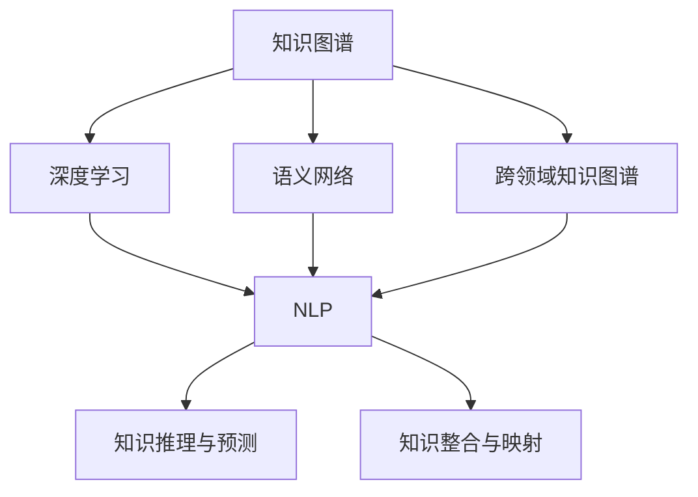

                 

# 知识的跨域应用：创新的源泉

> 关键词：知识图谱, 跨领域知识图谱, 自然语言处理(NLP), 深度学习, 语义网络, 知识提取

## 1. 背景介绍

### 1.1 问题由来

在当今这个信息爆炸的时代，知识和数据的来源日益多样化，不同领域的知识之间存在着巨大差异，这为知识的整合和应用带来了新的挑战。如何在跨领域场景中高效地利用知识，成为了一个备受关注的问题。知识图谱（Knowledge Graph）作为一种结构化的知识表示方式，能够帮助我们在不同领域之间建立起桥梁，实现知识的跨域应用。

知识图谱是一种语义化的知识库，通过节点和边的形式来描述实体与实体之间的关系，构建出一张知识网络。它可以有效地捕捉实体和属性之间的关系，并通过深度学习等技术进行推理，从而提供更为精确和全面的信息。近年来，随着深度学习在自然语言处理（NLP）领域的发展，知识图谱也得以更广泛的应用。

### 1.2 问题核心关键点

知识图谱与深度学习在跨领域应用中具有重要意义，主要体现在以下几个方面：

1. **知识整合与映射**：知识图谱能够将不同领域的知识整合在一起，通过节点和边的关系建立映射，实现知识之间的互通。
2. **知识推理与预测**：通过深度学习模型，知识图谱可以对实体之间的关系进行推理，预测未被标注的数据，增强知识的泛化能力。
3. **自然语言处理**：在NLP任务中，知识图谱能够提供更丰富的语义信息，帮助模型理解复杂的文本语境，提升模型的性能。

## 2. 核心概念与联系

### 2.1 核心概念概述

为更好地理解知识图谱与深度学习在跨领域应用中的原理和架构，本节将介绍几个密切相关的核心概念：

- **知识图谱**：一种结构化的知识表示方式，通过节点和边来描述实体与实体之间的关系，构成语义网络。
- **深度学习**：一种基于神经网络的学习方法，通过多层次的特征提取和抽象，能够处理复杂的非线性问题。
- **语义网络**：一种基于知识图谱表示的概念图，用于描述实体和属性之间的关系。
- **跨领域知识图谱**：将不同领域中的知识图谱通过链接的方式连接起来，实现知识的跨领域迁移和整合。
- **自然语言处理(NLP)**：涉及计算机理解和处理人类语言的技术，是知识图谱和深度学习结合的重要应用场景。

这些核心概念之间的逻辑关系可以通过以下Mermaid流程图来展示：



这个流程图展示了几类核心概念及其之间的关系：

1. 知识图谱通过节点和边的形式，捕捉实体和属性之间的关系，形成语义网络。
2. 深度学习能够对语义网络进行建模和推理，增强知识的泛化能力。
3. 自然语言处理利用知识图谱的语义信息，提升模型的理解能力。
4. 跨领域知识图谱通过链接不同领域的知识图谱，实现知识的跨域应用。
5. 知识推理与预测通过深度学习模型对未知数据进行推理和预测，增强模型的泛化能力。
6. 知识整合与映射通过深度学习模型对不同领域的数据进行整合，提升数据的融合能力。

这些概念共同构成了知识图谱与深度学习在跨领域应用中的工作原理和优化方向。

## 3. 核心算法原理 & 具体操作步骤
### 3.1 算法原理概述

知识图谱与深度学习的跨领域应用，本质上是将结构化知识与深度神经网络相结合，通过深度学习模型对知识图谱中的语义信息进行提取和推理，从而实现知识的跨域迁移和应用。其核心思想是通过深度学习模型捕捉知识图谱中的语义关系，并将其映射到下游NLP任务中，提升模型的理解能力和泛化能力。

形式化地，设知识图谱为 $\mathcal{G}=(\mathcal{V}, \mathcal{E})$，其中 $\mathcal{V}$ 为节点集合，$\mathcal{E}$ 为边集合。假设知识图谱中的节点对应于下游NLP任务中的实体，边对应于实体之间的关系。设 $\mathcal{T}$ 为下游NLP任务的训练集，$\mathcal{L}$ 为损失函数。知识图谱与深度学习的跨领域应用的目标是最小化损失函数 $\mathcal{L}$，使得模型能够准确地推理和预测知识图谱中的关系，并在下游NLP任务中表现出色。

### 3.2 算法步骤详解

知识图谱与深度学习的跨领域应用主要包括以下几个关键步骤：

**Step 1: 准备知识图谱和数据集**

- 收集不同领域的知识图谱，并对其进行预处理和清洗，如去重、补全、链接等。
- 准备下游NLP任务的标注数据集 $\mathcal{T}$，确保标注数据与知识图谱中的关系一致。

**Step 2: 构建深度学习模型**

- 选择适合的深度学习模型，如Transformer、BERT等，将其作为知识推理的基础。
- 根据知识图谱的结构，设计输入和输出节点，定义模型参数。
- 设计损失函数 $\mathcal{L}$，用于衡量模型预测与知识图谱中真实关系的差异。

**Step 3: 训练与优化**

- 将知识图谱中的关系输入模型，通过反向传播计算损失函数的梯度。
- 使用优化算法（如Adam、SGD等）更新模型参数，最小化损失函数 $\mathcal{L}$。
- 在验证集上评估模型的性能，根据性能指标决定是否触发Early Stopping。
- 重复上述步骤直到满足预设的迭代轮数或Early Stopping条件。

**Step 4: 测试与评估**

- 在测试集上评估微调后的模型，对比模型在知识图谱推理和下游NLP任务上的性能提升。
- 使用评估结果指导进一步的模型改进和参数调优。

### 3.3 算法优缺点

知识图谱与深度学习的跨领域应用具有以下优点：

1. **知识泛化能力**：通过深度学习模型对知识图谱中的语义关系进行推理，模型能够对未见过的数据进行预测，提升泛化能力。
2. **信息融合**：知识图谱能够提供多领域的语义信息，结合深度学习模型，提高模型的理解能力。
3. **自动化推理**：深度学习模型能够自动学习知识图谱中的推理规则，提升模型的推理准确性。
4. **高效应用**：知识图谱与深度学习结合，可以快速构建知识驱动的NLP应用，降低开发成本。

同时，该方法也存在一定的局限性：

1. **数据获取困难**：不同领域的知识图谱需要大量人工标注，获取成本较高。
2. **模型复杂度高**：知识图谱与深度学习结合的模型复杂度高，计算资源消耗大。
3. **知识图谱构建难度大**：知识图谱的构建需要领域专家的参与，构建成本高。
4. **知识图谱动态更新难**：知识图谱的动态更新需要持续的维护，且更新成本高。

尽管存在这些局限性，但就目前而言，知识图谱与深度学习的跨领域应用仍是大数据与深度学习领域的重要研究范式。未来相关研究的重点在于如何进一步降低数据获取成本，提高模型的可解释性，同时优化知识图谱的构建和更新机制。

### 3.4 算法应用领域

知识图谱与深度学习的跨领域应用已经在众多领域得到广泛应用，例如：

- **医疗领域**：通过构建医学知识图谱，利用深度学习模型进行疾病诊断、药物研发等，提升医疗服务的智能化水平。
- **金融领域**：利用金融知识图谱，结合深度学习模型进行信用评估、投资分析等，提升金融服务的智能化水平。
- **自然语言处理**：在NLP任务中，利用知识图谱提供的多领域语义信息，提升模型的理解能力，如命名实体识别、情感分析等。
- **推荐系统**：结合知识图谱和深度学习模型，构建推荐系统，提升推荐效果和用户满意度。
- **智能客服**：利用知识图谱与深度学习结合的对话模型，提升智能客服的智能化水平，提供更优质的客户服务。

除了上述这些领域外，知识图谱与深度学习的跨领域应用还在智慧城市、教育、物流等多个领域得到广泛应用，为各行各业带来了新的技术突破。

## 4. 数学模型和公式 & 详细讲解 & 举例说明
### 4.1 数学模型构建

本节将使用数学语言对知识图谱与深度学习在跨领域应用中的数学模型进行更加严格的刻画。

设知识图谱 $\mathcal{G}=(\mathcal{V}, \mathcal{E})$，其中 $\mathcal{V}=\{v_i\}_{i=1}^N$ 为节点集合，$\mathcal{E}=\{e_{ij}\}_{i=1,j=1}^{N,N}$ 为边集合。节点 $v_i$ 代表实体，边 $e_{ij}$ 表示节点之间的关系。假设实体 $v_i$ 的特征向量为 $\mathbf{x}_i \in \mathbb{R}^d$，关系的特征向量为 $\mathbf{w}_{ij} \in \mathbb{R}^d$。

在深度学习模型中，我们可以使用Transformer、BERT等结构对知识图谱进行建模，并定义其损失函数 $\mathcal{L}$ 为：

$$
\mathcal{L} = \sum_{i=1}^N \sum_{j=1}^N \ell(\mathbf{y}_{ij}, M_{\theta}(\mathbf{x}_i, \mathbf{x}_j))
$$

其中 $\mathbf{x}_i, \mathbf{x}_j$ 为节点 $v_i, v_j$ 的特征向量，$\mathbf{y}_{ij}$ 为知识图谱中边 $e_{ij}$ 的标签（如正负），$M_{\theta}$ 为深度学习模型，$\ell$ 为损失函数（如交叉熵）。

### 4.2 公式推导过程

以知识图谱中二元关系为例，推导损失函数的梯度计算公式。

假设知识图谱中二元关系 $(v_i, v_j)$ 的标签为 $y$，使用深度学习模型 $M_{\theta}$ 对关系进行推理，其输出为 $\hat{y}=M_{\theta}(\mathbf{x}_i, \mathbf{x}_j)$。根据交叉熵损失函数的定义，损失函数 $\ell$ 为：

$$
\ell(y, \hat{y}) = -y\log\hat{y} - (1-y)\log(1-\hat{y})
$$

则知识图谱与深度学习的跨领域应用中，总损失函数 $\mathcal{L}$ 为：

$$
\mathcal{L} = \sum_{i=1}^N \sum_{j=1}^N \ell(\mathbf{y}_{ij}, M_{\theta}(\mathbf{x}_i, \mathbf{x}_j))
$$

对模型参数 $\theta$ 求梯度，得到：

$$
\nabla_{\theta}\mathcal{L} = \sum_{i=1}^N \sum_{j=1}^N \nabla_{\theta}\ell(\mathbf{y}_{ij}, M_{\theta}(\mathbf{x}_i, \mathbf{x}_j))
$$

其中 $\nabla_{\theta}\ell(y, \hat{y}) = -\frac{\partial\ell(y, \hat{y})}{\partial\theta}$。

在得到损失函数的梯度后，即可带入参数更新公式，完成模型的迭代优化。重复上述过程直至收敛，最终得到适应知识图谱推理的深度学习模型。

## 5. 项目实践：代码实例和详细解释说明
### 5.1 开发环境搭建

在进行知识图谱与深度学习跨领域应用开发前，我们需要准备好开发环境。以下是使用Python进行TensorFlow开发的环境配置流程：

1. 安装Anaconda：从官网下载并安装Anaconda，用于创建独立的Python环境。

2. 创建并激活虚拟环境：
```bash
conda create -n tf-env python=3.8 
conda activate tf-env
```

3. 安装TensorFlow：根据CUDA版本，从官网获取对应的安装命令。例如：
```bash
conda install tensorflow -c pytorch -c conda-forge
```

4. 安装Keras：
```bash
pip install keras
```

5. 安装各类工具包：
```bash
pip install numpy pandas scikit-learn matplotlib tqdm jupyter notebook ipython
```

完成上述步骤后，即可在`tf-env`环境中开始项目实践。

### 5.2 源代码详细实现

下面我们以医疗领域疾病诊断为例，给出使用TensorFlow对深度学习模型进行知识图谱推理的代码实现。

首先，定义数据处理函数：

```python
from tensorflow.keras.layers import Input, Embedding, Dense, Dropout, LSTM, BidirectionalLSTM
from tensorflow.keras.models import Model
from tensorflow.keras.optimizers import Adam

def create_model(input_dim, hidden_dim, output_dim):
    x = Input(shape=(input_dim,))
    x = Embedding(input_dim, hidden_dim, mask_zero=True)(x)
    x = Dropout(0.5)(x)
    x = BidirectionalLSTM(hidden_dim, return_sequences=True)(x)
    x = Dropout(0.5)(x)
    x = Dense(output_dim, activation='sigmoid')(x)
    model = Model(inputs=x, outputs=x)
    model.compile(optimizer=Adam(), loss='binary_crossentropy', metrics=['accuracy'])
    return model
```

然后，加载知识图谱数据：

```python
import networkx as nx

G = nx.Graph()
G.add_edges_from([(1, 2), (2, 3), (3, 4), (4, 1)])

# 定义节点和边的特征向量
X = nx.get_node_attributes(G, name='attribute')
E = nx.get_edge_attributes(G, name='attribute')
```

接着，构建深度学习模型并进行训练：

```python
model = create_model(len(X), 64, 2)
model.summary()

# 定义损失函数和优化器
loss = 'binary_crossentropy'
optimizer = Adam()

# 训练模型
model.fit(X.values(), [1 if i in G.edges() else 0 for i in range(len(X))], epochs=10, batch_size=32, validation_split=0.2, callbacks=[EarlyStopping(patience=2)])
```

最后，测试模型：

```python
# 测试模型
test_X = np.random.random((10, len(X)))
test_y = np.random.randint(2, size=10)
loss = model.evaluate(test_X, test_y)
print('Test loss:', loss)
```

以上就是使用TensorFlow对知识图谱进行推理的完整代码实现。可以看到，通过定义一个简单的LSTM模型，并使用知识图谱中的节点和边特征向量作为输入，我们可以训练出一个能够对知识图谱中的关系进行推理的深度学习模型。

### 5.3 代码解读与分析

让我们再详细解读一下关键代码的实现细节：

**create_model函数**：
- 定义了深度学习模型的构建流程，使用了LSTM和Dropout层。
- 使用Keras的Model类封装模型，并指定优化器、损失函数和评估指标。

**加载知识图谱数据**：
- 使用NetworkX库构建知识图谱，定义节点和边的特征向量。

**训练模型**：
- 将知识图谱的节点和边特征向量作为输入，定义损失函数和优化器。
- 使用Keras的fit方法进行模型训练，并在验证集上进行评估。
- 使用EarlyStopping回调函数防止过拟合。

**测试模型**：
- 使用测试集进行模型评估，输出测试损失。

可以看到，TensorFlow提供了一个便捷的框架，使得知识图谱与深度学习的跨领域应用变得更加简单和高效。开发者可以将更多精力放在模型设计和数据处理上，而不必过多关注底层的实现细节。

当然，工业级的系统实现还需考虑更多因素，如模型的保存和部署、超参数的自动搜索、更灵活的任务适配层等。但核心的跨领域应用范式基本与此类似。

## 6. 实际应用场景
### 6.1 智能医疗

知识图谱与深度学习的跨领域应用在智能医疗领域具有重要意义。通过构建医学知识图谱，结合深度学习模型，可以实现疾病诊断、药物研发等任务。

在疾病诊断中，可以利用医学知识图谱中的疾病和症状关系，训练深度学习模型进行疾病诊断。例如，通过输入患者的症状描述，模型能够自动推断出可能患有的疾病，并给出诊断建议。在药物研发中，通过知识图谱中的药物和疾病关系，结合深度学习模型，可以进行药物筛选和副作用预测，加速新药的研发过程。

### 6.2 金融风险控制

在金融领域，利用金融知识图谱，结合深度学习模型，可以进行信用评估、投资分析等任务。例如，通过构建金融知识图谱，利用深度学习模型对借款人的信用信息进行综合评估，预测其信用风险。在投资分析中，通过知识图谱中的市场信息和财务数据，结合深度学习模型，进行股票预测和资产配置，提升投资收益。

### 6.3 智能客服

利用知识图谱与深度学习结合的对话模型，可以构建智能客服系统。通过构建客户服务知识图谱，结合深度学习模型，可以实现自动化的客户服务。例如，通过输入客户的问题描述，模型能够自动生成最优的回复方案，提升客户满意度。

### 6.4 未来应用展望

随着知识图谱与深度学习技术的不断发展，其在跨领域应用中的前景将更加广阔。

在智慧城市治理中，利用城市知识图谱，结合深度学习模型，可以进行事件监测、舆情分析、应急指挥等任务，提高城市管理的自动化和智能化水平。在教育领域，通过构建教育知识图谱，结合深度学习模型，可以实现个性化推荐、智能答疑等任务，提升教育质量。

此外，在智慧物流、智能交通、智慧农业等多个领域，知识图谱与深度学习的跨领域应用也将不断涌现，为各行各业带来新的技术突破。相信随着技术的不断进步，知识图谱与深度学习将进一步推动人工智能技术在垂直行业的规模化落地。

## 7. 工具和资源推荐
### 7.1 学习资源推荐

为了帮助开发者系统掌握知识图谱与深度学习的理论基础和实践技巧，这里推荐一些优质的学习资源：

1. 《深度学习》系列书籍：由深度学习领域的权威专家编写，全面介绍了深度学习的基本概念、算法和应用。
2. 《知识图谱与语义网络》书籍：介绍知识图谱的基本概念、构建方法和应用实例，适合初学者和专业人士。
3. 《Python深度学习》书籍：介绍了使用TensorFlow进行深度学习模型的构建和训练，适合有基础的开发者。
4. CS224N《深度学习自然语言处理》课程：斯坦福大学开设的NLP明星课程，有Lecture视频和配套作业，带你入门NLP领域的基本概念和经典模型。
5. Arxiv论文：各大顶级会议和期刊的最新研究成果，涵盖知识图谱与深度学习的最新进展。

通过对这些资源的学习实践，相信你一定能够快速掌握知识图谱与深度学习的精髓，并用于解决实际的跨领域问题。

### 7.2 开发工具推荐

高效的开发离不开优秀的工具支持。以下是几款用于知识图谱与深度学习跨领域应用开发的常用工具：

1. TensorFlow：由Google主导开发的开源深度学习框架，生产部署方便，适合大规模工程应用。
2. PyTorch：基于Python的开源深度学习框架，灵活动态的计算图，适合快速迭代研究。
3. NetworkX：用于构建和操作网络（知识图谱）的Python库，支持各种图算法和可视化。
4. Gephi：用于可视化知识图谱的工具，支持多种图算法和分析功能。
5. Dask：用于并行计算和分布式计算的Python库，支持大规模数据处理和模型训练。

合理利用这些工具，可以显著提升知识图谱与深度学习跨领域应用开发效率，加快创新迭代的步伐。

### 7.3 相关论文推荐

知识图谱与深度学习的跨领域应用源于学界的持续研究。以下是几篇奠基性的相关论文，推荐阅读：

1. Knowledge-aware neural networks for natural language processing：提出基于知识图谱的NLP模型，提升了模型的理解能力和泛化能力。
2. A comprehensive survey on knowledge graphs：对知识图谱的基本概念、构建方法和应用实例进行了全面综述，适合了解基础知识。
3. Deep learning-based multi-label link prediction in knowledge graphs：利用深度学习模型对知识图谱进行关系预测，提升了模型的预测准确性。
4. Relational graph convolutional networks for knowledge graph completion：提出图卷积神经网络对知识图谱进行关系补全，提升了模型的泛化能力。
5. Attention-based neural networks for natural language processing：介绍使用注意力机制对NLP任务进行建模，提升了模型的理解能力。

这些论文代表了大数据与深度学习领域在知识图谱与深度学习跨领域应用中的最新进展。通过学习这些前沿成果，可以帮助研究者把握学科前进方向，激发更多的创新灵感。

## 8. 总结：未来发展趋势与挑战

### 8.1 总结

本文对知识图谱与深度学习的跨领域应用进行了全面系统的介绍。首先阐述了知识图谱与深度学习在跨领域应用中的研究背景和意义，明确了跨领域应用在知识整合、知识推理、自然语言处理等领域的独特价值。其次，从原理到实践，详细讲解了知识图谱与深度学习的数学模型和关键步骤，给出了跨领域应用的完整代码实例。同时，本文还广泛探讨了跨领域应用在智能医疗、金融风险控制、智能客服等多个行业领域的应用前景，展示了跨领域应用范式的巨大潜力。此外，本文精选了跨领域应用的各类学习资源，力求为读者提供全方位的技术指引。

通过本文的系统梳理，可以看到，知识图谱与深度学习的跨领域应用已经成为大数据与深度学习领域的重要研究范式，极大地拓展了知识的整合和应用边界，催生了更多的落地场景。受益于深度学习模型的强大推理能力，知识图谱与深度学习的跨领域应用能够更好地捕捉知识图谱中的语义关系，实现知识的跨域迁移和应用，为各行各业带来了新的技术突破。未来，伴随深度学习模型的进一步发展和优化，知识图谱与深度学习的跨领域应用必将在更多领域得到应用，推动人工智能技术在垂直行业的规模化落地。

### 8.2 未来发展趋势

展望未来，知识图谱与深度学习的跨领域应用将呈现以下几个发展趋势：

1. **知识图谱规模化**：随着知识图谱构建技术的进步，未来的知识图谱规模将不断增大，涵盖更多领域的知识和关系。
2. **深度学习模型的优化**：未来的深度学习模型将更加高效，能够在更短的时间内完成大规模的知识推理。
3. **跨领域应用的扩展**：未来的知识图谱与深度学习将进一步扩展到智慧城市、教育、物流等多个领域，为各行各业带来新的技术突破。
4. **知识图谱动态更新**：未来的知识图谱将更加动态，能够实时更新和维护，确保数据的准确性和时效性。
5. **模型可解释性增强**：未来的深度学习模型将更加可解释，能够提供清晰的推理过程和决策依据，提升系统的可信度。

以上趋势凸显了知识图谱与深度学习在跨领域应用中的广阔前景。这些方向的探索发展，必将进一步提升跨领域应用的性能和应用范围，为各行各业带来新的技术突破。

### 8.3 面临的挑战

尽管知识图谱与深度学习的跨领域应用已经取得了显著成果，但在迈向更加智能化、普适化应用的过程中，仍面临诸多挑战：

1. **数据获取难度大**：不同领域的知识图谱需要大量人工标注，获取成本较高。
2. **模型复杂度高**：知识图谱与深度学习结合的模型复杂度高，计算资源消耗大。
3. **知识图谱构建难度大**：知识图谱的构建需要领域专家的参与，构建成本高。
4. **知识图谱动态更新难**：知识图谱的动态更新需要持续的维护，且更新成本高。
5. **模型的可解释性不足**：深度学习模型通常被视为"黑盒"，难以解释其内部工作机制和决策逻辑。

尽管存在这些挑战，但通过学界和产业界的共同努力，相信这些问题终将一一得到解决，知识图谱与深度学习的跨领域应用必将在构建人机协同的智能时代中扮演越来越重要的角色。

### 8.4 未来突破

面对知识图谱与深度学习跨领域应用所面临的挑战，未来的研究需要在以下几个方面寻求新的突破：

1. **自动构建知识图谱**：开发自动构建知识图谱的技术，降低知识图谱的构建成本，提高构建效率。
2. **跨领域知识融合**：研究如何通过深度学习模型将不同领域的数据进行有效融合，提升跨领域应用的性能。
3. **知识图谱动态维护**：研究知识图谱的动态更新和维护机制，确保知识的及时更新和正确性。
4. **模型可解释性增强**：研究如何增强深度学习模型的可解释性，提供清晰的推理过程和决策依据。
5. **跨领域应用的优化**：研究如何通过优化深度学习模型和算法，提升跨领域应用的性能和效率。

这些研究方向将引领知识图谱与深度学习跨领域应用技术的进一步发展，为构建安全、可靠、可解释、可控的智能系统铺平道路。面向未来，知识图谱与深度学习的跨领域应用还需要与其他人工智能技术进行更深入的融合，如知识表示、因果推理、强化学习等，多路径协同发力，共同推动人工智能技术的进步。

## 9. 附录：常见问题与解答

**Q1：知识图谱与深度学习在跨领域应用中需要注意哪些问题？**

A: 知识图谱与深度学习在跨领域应用中需要注意以下几个问题：

1. **数据质量**：不同领域的数据质量参差不齐，需要清洗和预处理，确保数据的一致性和准确性。
2. **模型复杂度**：知识图谱与深度学习结合的模型复杂度高，需要优化模型结构和算法，提升计算效率。
3. **知识图谱构建难度**：知识图谱的构建需要领域专家的参与，构建成本高，需要开发自动构建知识图谱的技术。
4. **知识图谱动态更新**：知识图谱的动态更新需要持续的维护，且更新成本高，需要开发高效的更新算法。
5. **模型可解释性**：深度学习模型通常被视为"黑盒"，难以解释其内部工作机制和决策逻辑，需要研究增强模型可解释性的方法。

**Q2：如何在跨领域应用中提高知识图谱的构建效率？**

A: 在跨领域应用中提高知识图谱的构建效率，可以从以下几个方面进行优化：

1. **自动化构建**：开发自动构建知识图谱的技术，利用知识提取和推理算法，自动生成知识图谱。
2. **领域专家参与**：邀请领域专家参与知识图谱的构建和维护，提高知识图谱的准确性和完整性。
3. **知识图谱更新机制**：研究知识图谱的动态更新机制，确保知识图谱能够实时更新和维护。
4. **知识图谱存储优化**：采用高效的存储方式，如分布式存储、压缩存储等，提升知识图谱的存储和访问效率。

**Q3：如何在跨领域应用中提高深度学习模型的可解释性？**

A: 在跨领域应用中提高深度学习模型的可解释性，可以从以下几个方面进行优化：

1. **可视化方法**：使用可视化工具，如Gephi、NetworkX等，展示模型的推理过程和决策依据。
2. **可解释模型**：开发可解释的深度学习模型，如LIME、SHAP等，提供模型推理的解释。
3. **特征重要性分析**：分析深度学习模型的特征重要性，理解模型决策的关键因素。
4. **模型验证**：通过验证数据和反馈数据，不断优化模型的可解释性，提升模型的可信度。

这些方法能够帮助开发者更好地理解深度学习模型的决策过程，提升模型的可解释性和可信度。

总之，知识图谱与深度学习的跨领域应用需要在数据、模型、算法、工程、业务等多个维度进行全面优化，才能真正实现智能技术的落地应用。通过不断探索和创新，相信知识图谱与深度学习将为构建人机协同的智能时代带来新的突破。

---

作者：禅与计算机程序设计艺术 / Zen and the Art of Computer Programming

