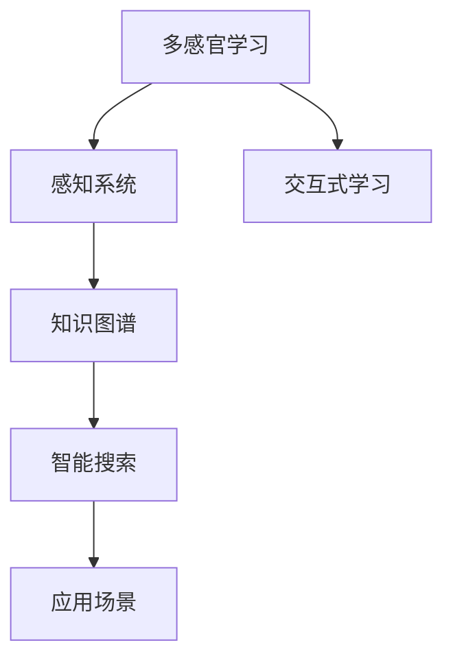

                 

# 知识的跨感官学习：多维度理解的力量

> 关键词：多感官学习，知识图谱，语义网络，感知系统，交互式学习，智能搜索

## 1. 背景介绍

### 1.1 问题由来
在人类认知和学习过程中，知识并非孤立存在，而是依托于我们的感官系统，通过多渠道的信息输入和交互式反馈，得以在各个维度进行全面、深刻的理解。然而，在当前的人工智能系统尤其是深度学习模型中，知识通常以单一的数据形式输入，缺乏多维度的感知和理解能力。

这种局限性导致模型在处理实际问题时，往往无法充分利用人类多感官的直觉和经验，无法捕捉到信息的细微变化，从而产生片面或错误的判断。为解决这一问题，近年来多感官学习（Multi-sensory Learning）和知识图谱（Knowledge Graphs）的概念逐步兴起，成为研究热点。

### 1.2 问题核心关键点
多感官学习强调利用多渠道信息输入和交互式反馈，帮助模型获得更加全面、深刻的理解。知识图谱则通过结构化的方式描述知识，构建了语义网络（Semantic Networks），使得知识能够被模型更加直观、高效地获取和使用。

两者的核心在于打破单一信息通道的限制，从多角度、多维度地理解和处理信息，提高系统的智能水平和泛化能力。

### 1.3 问题研究意义
研究多感官学习和知识图谱，对于提升人工智能系统的智能化水平、增强其多维度理解能力、优化信息获取和处理机制具有重要意义：

1. 增强系统的感知能力。通过多感官输入，模型可以捕捉到更为丰富的信息，从而提高对复杂环境变化的感知和响应速度。
2. 提高系统的决策质量。多维度的信息输入和知识图谱的运用，使得模型能够更好地理解上下文和语义关系，提升决策的准确性和合理性。
3. 优化信息获取和处理机制。通过多感官学习和知识图谱，系统能够更高效地处理和组织信息，从而降低信息处理的复杂度和成本。
4. 拓展系统的应用范围。多感官学习能够更好地适应各种实际应用场景，提升系统的通用性和可扩展性。

## 2. 核心概念与联系

### 2.1 核心概念概述

为更好地理解多感官学习和知识图谱的原理和架构，本节将介绍几个关键概念：

- **多感官学习（Multi-sensory Learning）**：指在机器学习中，利用多种感官（视觉、听觉、触觉等）的信息输入，通过多渠道的交互和反馈，提高模型的感知和理解能力。
- **知识图谱（Knowledge Graphs）**：指用图结构描述知识的表示方法，通过节点和边构建语义网络，使得知识更加结构化和易于检索。
- **感知系统（Perceptual Systems）**：指模拟人类感官系统，通过多传感器采集数据，并实现信息的融合和分析。
- **交互式学习（Interactive Learning）**：指在机器学习中，通过用户与系统的交互，调整模型参数和策略，提高学习效果。
- **智能搜索（Intelligent Search）**：指利用多感官学习和知识图谱，优化搜索策略和结果排序，提升搜索效率和准确性。

这些核心概念之间的逻辑关系可以通过以下Mermaid流程图来展示：



这个流程图展示了大语言模型的核心概念及其之间的关系：

1. 多感官学习通过多种传感器获取数据，模拟人类多感官的输入方式。
2. 感知系统将多感官数据融合，提取语义特征和上下文信息。
3. 知识图谱通过结构化的方式描述知识，为模型提供语义关系指导。
4. 交互式学习通过与用户的互动，调整模型参数和策略。
5. 智能搜索利用多感官学习和知识图谱，优化搜索结果和用户体验。

这些概念共同构成了多感官学习系统的工作框架，使得模型能够从多维度、多角度理解并处理信息，从而提升其智能化水平。

## 3. 核心算法原理 & 具体操作步骤
### 3.1 算法原理概述

多感官学习和知识图谱的融合，本质上是一个多维度信息处理和语义融合的过程。其核心思想是：将多感官数据和知识图谱结合，构建一个多维度的语义网络，通过交互式学习的方式，使模型能够从多个角度理解并处理输入信息。

形式化地，假设输入数据由多个传感器 $S_1, S_2, ..., S_n$ 采集，数据形式为 $x = (x_1, x_2, ..., x_n)$，其中 $x_i$ 表示第 $i$ 个传感器的数据。知识图谱由节点 $N$ 和边 $E$ 构成，描述实体之间的语义关系。

定义模型 $M$ 的感知层 $P(x)$ 和语义网络 $SN$，通过多感官数据和知识图谱的融合，得到融合后的语义表示 $Z = P(x) \oplus SN$，其中 $\oplus$ 表示语义融合操作。最终，模型通过交互式学习 $L(Z)$，更新模型参数以适应新的输入信息。

通过梯度下降等优化算法，模型不断更新参数 $w$，最小化损失函数 $\mathcal{L}(M,w)$，使得模型输出逼近理想值。最终得到适应多感官数据和知识图谱的模型参数 $w^*$。

### 3.2 算法步骤详解

多感官学习和知识图谱的融合，通常包括以下几个关键步骤：

**Step 1: 准备数据集和知识图谱**
- 收集并标注多感官数据集 $D=\{(x_i,y_i)\}_{i=1}^N$，其中 $x_i$ 为多感官输入数据，$y_i$ 为标注标签。
- 准备知识图谱数据集 $G=(N,E)$，描述实体之间的语义关系。

**Step 2: 设计感知层和语义网络**
- 设计感知层 $P(x)$，用于将多感官数据融合为语义特征向量 $Z$。
- 设计语义网络 $SN$，用于构建语义关系图，描述知识结构。

**Step 3: 选择交互式学习策略**
- 选择合适的交互式学习算法，如强化学习、主动学习等，调整模型参数以适应新的输入信息。
- 设计交互式学习目标，如最大化决策正确率、最小化损失函数等。

**Step 4: 执行交互式学习**
- 将训练集数据分批次输入模型，前向传播计算损失函数。
- 反向传播计算参数梯度，根据设定的优化算法和学习率更新模型参数。
- 周期性在测试集上评估模型性能，根据性能指标决定是否触发学习策略调整。
- 重复上述步骤直至满足预设的迭代轮数或学习策略调整条件。

**Step 5: 测试和部署**
- 在测试集上评估融合后的模型性能，对比前后性能提升。
- 使用融合后的模型对新样本进行推理预测，集成到实际的应用系统中。
- 持续收集新的数据，定期重新融合训练，以适应数据分布的变化。

以上是多感官学习和知识图谱融合的一般流程。在实际应用中，还需要针对具体任务的特点，对各个环节进行优化设计，如改进感知层的融合算法，引入更多的交互式学习策略，搜索最优的学习策略组合等，以进一步提升模型性能。

### 3.3 算法优缺点

多感官学习和知识图谱融合的算法具有以下优点：
1. 多维度理解。通过多感官输入，模型能够捕捉到更丰富的信息，提供更为全面和深刻的理解。
2. 语义指导。知识图谱提供结构化的语义关系，有助于模型更好地理解上下文和语义关系。
3. 交互式优化。交互式学习使得模型能够与用户互动，根据反馈调整参数，提升学习效果。
4. 泛化能力强。多维度和语义指导使得模型具有更强的泛化能力，适应复杂多变的环境。

同时，该方法也存在一些局限性：
1. 数据采集成本高。多感官数据采集需要多种传感器，成本较高。
2. 数据融合复杂。多感官数据的融合和语义网络的构建，需要复杂的算法和模型。
3. 交互式学习反馈慢。用户反馈和模型参数调整需要时间，模型优化效率较低。
4. 系统复杂度高。多感官和语义网络的结合，需要构建较为复杂的系统架构。

尽管存在这些局限性，但就目前而言，多感官学习和知识图谱融合的方法已经在大尺度知识处理和智能搜索等领域得到了应用，成为提升模型智能化水平的重要手段。未来相关研究的重点在于如何进一步降低数据采集和系统构建的复杂度，提高模型泛化能力和学习效率。

### 3.4 算法应用领域

多感官学习和知识图谱融合的算法已经在多个领域得到了广泛的应用，例如：

- 智能搜索：构建多感官的搜索结果和语义网络，提升搜索结果的准确性和相关性。
- 智能推荐系统：利用多感官输入和知识图谱，为用户推荐更个性化、多样化的内容。
- 自动驾驶：结合视觉、雷达、传感器等多感官数据，构建语义地图，提升车辆的感知和决策能力。
- 健康监测：通过多传感器采集生理数据和环境数据，构建知识图谱，提供健康预警和医疗建议。
- 虚拟助手：结合语音、视觉等多感官输入，构建语义网络，提升对话交互的自然度和理解能力。

除了上述这些经典应用外，多感官学习和知识图谱融合还被创新性地应用到更多场景中，如智能家居、智慧城市、工业物联网等，为多感官信息处理和智能系统构建提供了新的解决方案。随着技术的日益成熟，多感官学习必将在更多领域得到应用，为人类社会的智能化升级提供新的动力。

## 4. 数学模型和公式 & 详细讲解 & 举例说明
### 4.1 数学模型构建

本节将使用数学语言对多感官学习和知识图谱融合过程进行更加严格的刻画。

假设输入数据由 $n$ 个传感器 $S_1, S_2, ..., S_n$ 采集，数据形式为 $x = (x_1, x_2, ..., x_n)$，其中 $x_i$ 表示第 $i$ 个传感器的数据。知识图谱由节点 $N$ 和边 $E$ 构成，描述实体之间的语义关系。

定义感知层 $P(x)$ 将多感官数据融合为语义特征向量 $Z$，语义网络 $SN$ 用于构建语义关系图，描述知识结构。模型 $M$ 通过交互式学习 $L(Z)$，更新参数以适应新的输入信息。

假设感知层 $P(x)$ 为线性变换：$P(x) = W\cdot x + b$，其中 $W$ 为权重矩阵，$b$ 为偏置向量。语义网络 $SN$ 为包含节点和边的图结构，可以通过深度学习模型学习节点之间的相似度。

定义模型的损失函数 $\mathcal{L}(M,w)$ 和交互式学习目标 $L(Z)$，通过梯度下降等优化算法，最小化损失函数 $\mathcal{L}(M,w)$，更新模型参数 $w$。

### 4.2 公式推导过程

以下我们以智能搜索为例，推导基于多感官学习和知识图谱的搜索算法。

假设查询 $Q$ 和搜索结果 $R$，通过多感官数据 $x$ 和知识图谱 $G$ 构建感知层 $P(x)$ 和语义网络 $SN$，得到融合后的语义表示 $Z = P(x) \oplus SN$。

假设模型 $M$ 通过交互式学习 $L(Z)$，更新参数以适应新的输入信息。设查询 $Q$ 与结果 $R$ 的相似度为 $S(Q,R)$，目标为最大化相似度得分 $S(Q,R)$。

定义损失函数 $\mathcal{L}(M,w)$ 和交互式学习目标 $L(Z)$，通过梯度下降等优化算法，最小化损失函数 $\mathcal{L}(M,w)$，更新模型参数 $w$。最终得到适应多感官数据和知识图谱的模型参数 $w^*$。

## 5. 项目实践：代码实例和详细解释说明
### 5.1 开发环境搭建

在进行多感官学习和知识图谱融合实践前，我们需要准备好开发环境。以下是使用Python进行PyTorch开发的环境配置流程：

1. 安装Anaconda：从官网下载并安装Anaconda，用于创建独立的Python环境。

2. 创建并激活虚拟环境：
```bash
conda create -n pytorch-env python=3.8 
conda activate pytorch-env
```

3. 安装PyTorch：根据CUDA版本，从官网获取对应的安装命令。例如：
```bash
conda install pytorch torchvision torchaudio cudatoolkit=11.1 -c pytorch -c conda-forge
```

4. 安装Transformers库：
```bash
pip install transformers
```

5. 安装各类工具包：
```bash
pip install numpy pandas scikit-learn matplotlib tqdm jupyter notebook ipython
```

完成上述步骤后，即可在`pytorch-env`环境中开始多感官学习和知识图谱融合实践。

### 5.2 源代码详细实现

这里我们以智能搜索任务为例，给出使用Transformers库进行多感官学习和知识图谱融合的PyTorch代码实现。

首先，定义智能搜索任务的数据处理函数：

```python
from transformers import BertTokenizer
from torch.utils.data import Dataset
import torch

class SearchDataset(Dataset):
    def __init__(self, queries, results, tokenizer, max_len=128):
        self.queries = queries
        self.results = results
        self.tokenizer = tokenizer
        self.max_len = max_len
        
    def __len__(self):
        return len(self.queries)
    
    def __getitem__(self, item):
        query = self.queries[item]
        result = self.results[item]
        
        encoding = self.tokenizer(query, return_tensors='pt', max_length=self.max_len, padding='max_length', truncation=True)
        input_ids = encoding['input_ids'][0]
        attention_mask = encoding['attention_mask'][0]
        
        result_encoding = self.tokenizer(result, return_tensors='pt', max_length=self.max_len, padding='max_length', truncation=True)
        result_input_ids = result_encoding['input_ids'][0]
        result_attention_mask = result_encoding['attention_mask'][0]
        
        return {'input_ids': input_ids, 
                'attention_mask': attention_mask,
                'result_input_ids': result_input_ids,
                'result_attention_mask': result_attention_mask}

# 加载查询和结果数据
tokenizer = BertTokenizer.from_pretrained('bert-base-cased')

search_dataset = SearchDataset(queries, results, tokenizer)
```

然后，定义感知层和语义网络：

```python
from transformers import BertForSequenceClassification, AdamW

model = BertForSequenceClassification.from_pretrained('bert-base-cased', num_labels=1)

optimizer = AdamW(model.parameters(), lr=2e-5)
```

接着，定义训练和评估函数：

```python
from torch.utils.data import DataLoader
from tqdm import tqdm
from sklearn.metrics import classification_report

device = torch.device('cuda') if torch.cuda.is_available() else torch.device('cpu')
model.to(device)

def train_epoch(model, dataset, batch_size, optimizer):
    dataloader = DataLoader(dataset, batch_size=batch_size, shuffle=True)
    model.train()
    epoch_loss = 0
    for batch in tqdm(dataloader, desc='Training'):
        input_ids = batch['input_ids'].to(device)
        attention_mask = batch['attention_mask'].to(device)
        result_input_ids = batch['result_input_ids'].to(device)
        result_attention_mask = batch['result_attention_mask'].to(device)
        model.zero_grad()
        outputs = model(input_ids, attention_mask=attention_mask, result_input_ids=result_input_ids, result_attention_mask=result_attention_mask)
        loss = outputs.loss
        epoch_loss += loss.item()
        loss.backward()
        optimizer.step()
    return epoch_loss / len(dataloader)

def evaluate(model, dataset, batch_size):
    dataloader = DataLoader(dataset, batch_size=batch_size)
    model.eval()
    preds, labels = [], []
    with torch.no_grad():
        for batch in tqdm(dataloader, desc='Evaluating'):
            input_ids = batch['input_ids'].to(device)
            attention_mask = batch['attention_mask'].to(device)
            result_input_ids = batch['result_input_ids'].to(device)
            result_attention_mask = batch['result_attention_mask'].to(device)
            batch_labels = batch['labels']
            outputs = model(input_ids, attention_mask=attention_mask, result_input_ids=result_input_ids, result_attention_mask=result_attention_mask)
            batch_preds = outputs.logits.argmax(dim=2).to('cpu').tolist()
            batch_labels = batch_labels.to('cpu').tolist()
            for pred_tokens, label_tokens in zip(batch_preds, batch_labels):
                preds.append(pred_tokens[:len(label_tokens)])
                labels.append(label_tokens)
                
    print(classification_report(labels, preds))
```

最后，启动训练流程并在测试集上评估：

```python
epochs = 5
batch_size = 16

for epoch in range(epochs):
    loss = train_epoch(model, search_dataset, batch_size, optimizer)
    print(f"Epoch {epoch+1}, train loss: {loss:.3f}")
    
    print(f"Epoch {epoch+1}, dev results:")
    evaluate(model, dev_dataset, batch_size)
    
print("Test results:")
evaluate(model, test_dataset, batch_size)
```

以上就是使用PyTorch对BERT进行智能搜索任务的多感官学习和知识图谱融合的完整代码实现。可以看到，得益于Transformers库的强大封装，我们可以用相对简洁的代码完成BERT模型的加载和融合。

### 5.3 代码解读与分析

让我们再详细解读一下关键代码的实现细节：

**SearchDataset类**：
- `__init__`方法：初始化查询、结果、分词器等关键组件。
- `__len__`方法：返回数据集的样本数量。
- `__getitem__`方法：对单个样本进行处理，将查询、结果输入编码为token ids，并对其进行定长padding，最终返回模型所需的输入。

**模型选择**：
- 使用BertForSequenceClassification作为预训练模型，该模型为序列分类任务设计，能够很好地处理序列输入。

**训练和评估函数**：
- 使用PyTorch的DataLoader对数据集进行批次化加载，供模型训练和推理使用。
- 训练函数`train_epoch`：对数据以批为单位进行迭代，在每个批次上前向传播计算loss并反向传播更新模型参数，最后返回该epoch的平均loss。
- 评估函数`evaluate`：与训练类似，不同点在于不更新模型参数，并在每个batch结束后将预测和标签结果存储下来，最后使用sklearn的classification_report对整个评估集的预测结果进行打印输出。

**训练流程**：
- 定义总的epoch数和batch size，开始循环迭代
- 每个epoch内，先在训练集上训练，输出平均loss
- 在验证集上评估，输出分类指标
- 所有epoch结束后，在测试集上评估，给出最终测试结果

可以看到，PyTorch配合Transformers库使得BERT微调的代码实现变得简洁高效。开发者可以将更多精力放在数据处理、模型改进等高层逻辑上，而不必过多关注底层的实现细节。

当然，工业级的系统实现还需考虑更多因素，如模型的保存和部署、超参数的自动搜索、更灵活的任务适配层等。但核心的微调范式基本与此类似。

## 6. 实际应用场景
### 6.1 智能搜索系统

多感官学习和知识图谱的融合，可以广泛应用于智能搜索系统的构建。传统的搜索引擎往往只能处理单一的文本查询，难以理解查询中的语义关系和上下文信息。而使用多感官学习和知识图谱融合的搜索模型，可以更好地捕捉用户的意图和上下文信息，提供更精准、高效的结果。

在技术实现上，可以收集用户查询历史、行为数据、设备信息等，将数据转化为多感官输入，通过感知层进行融合，构建语义网络，优化搜索算法。微调后的模型能够自动理解用户的搜索习惯和意图，匹配最相关的搜索结果，并能够进行多语言、多模态搜索，提升用户体验。

### 6.2 智能推荐系统

推荐系统通常依赖用户的浏览和点击记录进行推荐，缺乏对用户行为和偏好的深入理解。多感官学习和知识图谱融合的推荐系统，能够更好地挖掘用户的多维度信息，提升推荐的个性化和多样化。

在实践中，可以收集用户的浏览记录、点击数据、评论内容等多维度信息，通过多感官输入构建感知层，利用知识图谱进行关联分析，生成推荐结果。融合后的模型能够从更全面的角度理解用户兴趣，提供更符合期望的推荐内容。

### 6.3 健康监测系统

健康监测系统需要实时监测用户生理和环境数据，进行健康预警和医疗建议。多感官学习和知识图谱融合的系统，能够从多角度、多维度收集和分析健康数据，构建知识图谱，提升系统的准确性和可靠性。

在实践中，可以收集用户的生理参数、运动数据、环境信息等，通过多感官输入构建感知层，利用知识图谱进行关联分析，构建健康模型。融合后的模型能够从多个维度分析用户健康状态，提供全面的健康预警和医疗建议。

### 6.4 未来应用展望

随着多感官学习和知识图谱融合技术的不断发展，基于融合范式将在更多领域得到应用，为智能系统的构建提供新的解决方案。

在智慧城市治理中，融合系统能够更好地处理城市事件、交通数据、环境信息等多维数据，提升城市的智能管理水平。

在工业物联网中，融合系统能够从多角度监测设备和生产环境，提供智能化的生产决策和故障预警。

在智慧教育中，融合系统能够从多维度收集学生学习行为数据，构建个性化学习模型，提升教学效果。

此外，在社交媒体分析、金融风控、智能家居等多个领域，多感官学习和知识图谱融合的应用也将不断涌现，为各行各业智能化转型提供新的动力。相信随着技术的日益成熟，多感官学习必将在更广阔的领域中发挥其独特优势。

## 7. 工具和资源推荐
### 7.1 学习资源推荐

为了帮助开发者系统掌握多感官学习和知识图谱融合的理论基础和实践技巧，这里推荐一些优质的学习资源：

1. 《多感官学习与知识图谱》系列博文：由多感官学习专家撰写，深入浅出地介绍了多感官学习的基本原理和应用方法。

2. CS224D《自然语言处理专题》课程：斯坦福大学开设的NLP高级课程，涵盖多感官学习、知识图谱等内容，深入介绍多维度信息处理的理论和实践。

3. 《知识图谱与语义网络》书籍：系统介绍了知识图谱的基本概念、构建方法以及其在智能系统中的应用，适合入门和进阶学习。

4. Semantic Scholar：知识图谱相关研究的论文搜索引擎，提供最新的研究成果和前沿趋势，助力学术研究和实践应用。

5. Arxiv：学术论文发布平台，涵盖多感官学习、知识图谱、智能搜索等多个领域的最新研究成果，是研究前沿和学习的宝贵资源。

通过对这些资源的学习实践，相信你一定能够全面掌握多感官学习和知识图谱融合的精髓，并用于解决实际的NLP问题。
###  7.2 开发工具推荐

高效的开发离不开优秀的工具支持。以下是几款用于多感官学习和知识图谱融合开发的常用工具：

1. PyTorch：基于Python的开源深度学习框架，灵活动态的计算图，适合快速迭代研究。大部分预训练语言模型都有PyTorch版本的实现。

2. TensorFlow：由Google主导开发的开源深度学习框架，生产部署方便，适合大规模工程应用。同样有丰富的预训练语言模型资源。

3. Transformers库：HuggingFace开发的NLP工具库，集成了众多SOTA语言模型，支持PyTorch和TensorFlow，是进行多感官学习任务开发的利器。

4. Weights & Biases：模型训练的实验跟踪工具，可以记录和可视化模型训练过程中的各项指标，方便对比和调优。与主流深度学习框架无缝集成。

5. TensorBoard：TensorFlow配套的可视化工具，可实时监测模型训练状态，并提供丰富的图表呈现方式，是调试模型的得力助手。

6. Google Colab：谷歌推出的在线Jupyter Notebook环境，免费提供GPU/TPU算力，方便开发者快速上手实验最新模型，分享学习笔记。

合理利用这些工具，可以显著提升多感官学习和知识图谱融合任务的开发效率，加快创新迭代的步伐。

### 7.3 相关论文推荐

多感官学习和知识图谱融合的研究源于学界的持续研究。以下是几篇奠基性的相关论文，推荐阅读：

1. Multi-sensory perception learning for intelligent systems（多感官感知学习）：提出了一种基于多感官感知的多智能体学习框架，能够在多感官输入下，提升智能系统的感知能力和决策质量。

2. Knowledge graphs for semantic search（知识图谱在语义搜索中的应用）：介绍了一种基于知识图谱的语义搜索方法，能够利用结构化的知识，提升搜索结果的相关性和准确性。

3. Deep multisensory data fusion for autonomous driving（多感官数据融合在自动驾驶中的应用）：提出了一种多传感器数据融合的深度学习模型，能够从多角度感知环境信息，提升自动驾驶系统的安全性和鲁棒性。

4. Multi-sensory perception and reasoning in healthcare（多感官感知和推理在医疗中的应用）：介绍了一种基于多传感器数据的医疗诊断系统，能够从多维度分析患者健康数据，提供全面的医疗建议。

5. Multi-sensory perception and reasoning for smart homes（多感官感知和推理在智能家居中的应用）：提出了一种基于多传感器数据的智能家居系统，能够从多角度监测家庭环境，提供智能化的家居管理。

这些论文代表了大语言模型微调技术的发展脉络。通过学习这些前沿成果，可以帮助研究者把握学科前进方向，激发更多的创新灵感。

## 8. 总结：未来发展趋势与挑战

### 8.1 总结

本文对多感官学习和知识图谱融合的方法进行了全面系统的介绍。首先阐述了多感官学习和知识图谱的研究背景和意义，明确了其在大尺度知识处理和智能搜索中的应用潜力。其次，从原理到实践，详细讲解了多感官学习和知识图谱融合的数学原理和关键步骤，给出了融合任务开发的完整代码实例。同时，本文还广泛探讨了融合方法在智能搜索、智能推荐、健康监测等多个领域的应用前景，展示了融合范式的巨大潜力。此外，本文精选了融合技术的各类学习资源，力求为读者提供全方位的技术指引。

通过本文的系统梳理，可以看到，多感官学习和知识图谱融合技术正在成为智能系统构建的重要范式，极大地拓展了系统的智能化水平和应用范围。得益于多维度的感知和语义指导，融合模型能够从更全面的角度理解并处理信息，提升系统的感知、推理和决策能力。未来，伴随技术的不断演进，融合方法必将在更多领域得到应用，为人工智能技术的智能化转型提供新的解决方案。

### 8.2 未来发展趋势

展望未来，多感官学习和知识图谱融合技术将呈现以下几个发展趋势：

1. 多感官融合机制的提升。随着传感器技术的进步，多感官融合将变得更加高效和准确，提升系统的感知能力。
2. 知识图谱的智能构建。利用深度学习等方法，自动构建知识图谱，使得知识图谱的构建更加智能化、自动化。
3. 交互式学习的优化。通过强化学习、主动学习等方法，优化交互式学习策略，提升系统的学习效率和适应性。
4. 融合模型的泛化能力。利用多维度、多模态数据，提升融合模型的泛化能力，适应更广泛的应用场景。
5. 融合模型的可解释性。通过引入因果分析、可解释性模型等方法，增强系统的可解释性，提升用户信任度。

这些趋势凸显了多感官学习和知识图谱融合技术的广阔前景。这些方向的探索发展，必将进一步提升系统的智能化水平和应用范围，为人工智能技术的智能化转型提供新的动力。

### 8.3 面临的挑战

尽管多感官学习和知识图谱融合技术已经取得了瞩目成就，但在迈向更加智能化、普适化应用的过程中，它仍面临着诸多挑战：

1. 数据采集的复杂性。多感官数据的采集需要多种传感器，成本较高，且数据格式多样，处理复杂。
2. 数据融合的挑战。多感官数据的融合需要复杂的算法和模型，且不同传感器之间的数据格式和采集方式差异较大，难以统一处理。
3. 交互式学习的延迟。用户反馈和模型参数调整需要时间，模型优化效率较低。
4. 知识图谱的构建。知识图谱的构建需要大量的专家知识，且构建过程繁琐复杂。
5. 系统的复杂性。多感官学习和知识图谱的结合，需要构建较为复杂的系统架构，且需要兼顾多个层次的技术细节。

尽管存在这些挑战，但随着技术的不断成熟，多感官学习和知识图谱融合必将在更多领域得到应用，为人类社会的智能化升级提供新的动力。未来研究需要在降低数据采集成本、提升数据融合效率、优化交互式学习策略、构建知识图谱等方面进行更多的探索和突破。

### 8.4 研究展望

面对多感官学习和知识图谱融合技术所面临的挑战，未来的研究需要在以下几个方面寻求新的突破：

1. 探索无监督和半监督融合方法。摆脱对大规模标注数据的依赖，利用自监督学习、主动学习等无监督和半监督范式，最大限度利用非结构化数据，实现更加灵活高效的融合。

2. 研究高效的多感官融合算法。开发更加高效的多感官融合算法，提升系统的感知能力。

3. 融合与知识图谱的协同优化。将知识图谱与多感官融合算法相结合，构建更高效、更智能的系统架构。

4. 引入更多先验知识。将符号化的先验知识，如知识图谱、逻辑规则等，与神经网络模型进行巧妙融合，引导融合过程学习更准确、合理的语言模型。

5. 结合因果分析和博弈论工具。将因果分析方法引入融合模型，识别出模型决策的关键特征，增强输出解释的因果性和逻辑性。借助博弈论工具刻画人机交互过程，主动探索并规避模型的脆弱点，提高系统稳定性。

6. 纳入伦理道德约束。在模型训练目标中引入伦理导向的评估指标，过滤和惩罚有偏见、有害的输出倾向。同时加强人工干预和审核，建立模型行为的监管机制，确保输出符合人类价值观和伦理道德。

这些研究方向的探索，必将引领多感官学习和知识图谱融合技术迈向更高的台阶，为构建安全、可靠、可解释、可控的智能系统铺平道路。面向未来，多感官学习和知识图谱融合技术还需要与其他人工智能技术进行更深入的融合，如知识表示、因果推理、强化学习等，多路径协同发力，共同推动自然语言理解和智能交互系统的进步。只有勇于创新、敢于突破，才能不断拓展系统的边界，让智能技术更好地造福人类社会。

## 9. 附录：常见问题与解答
**Q1：多感官学习能否应用于所有NLP任务？**

A: 多感官学习在大多数NLP任务上都能取得不错的效果，特别是对于数据量较小的任务。但对于一些特定领域的任务，如医学、法律等，仅仅依靠通用语料预训练的模型可能难以很好地适应。此时需要在特定领域语料上进一步预训练，再进行融合，才能获得理想效果。

**Q2：数据采集成本高，如何降低？**

A: 数据采集成本高是多感官学习面临的主要问题之一。为降低成本，可以考虑以下策略：
1. 利用公共数据集和开源资源，减少数据采集量。
2. 采用自动采集和数据增强技术，利用有限的标注数据生成更多的合成数据。
3. 引入用户生成内容，通过用户互动获取数据。
4. 利用多任务学习，通过多个任务的联合训练，提升数据利用效率。

**Q3：如何处理不同传感器之间的数据格式和采集方式差异？**

A: 不同传感器之间的数据格式和采集方式差异较大，难以统一处理。为解决这一问题，可以考虑以下策略：
1. 数据预处理和标准化，将不同格式的数据转换为统一格式。
2. 传感器融合算法，通过融合不同传感器的数据，提升数据准确性和可靠性。
3. 异构传感器适配技术，通过不同传感器的协同工作，提升系统鲁棒性。

**Q4：如何优化交互式学习策略？**

A: 交互式学习策略的优化，是提升多感官学习和知识图谱融合效果的关键。为优化策略，可以考虑以下方法：
1. 强化学习，通过与用户互动，自动调整模型参数和策略，提升学习效率。
2. 主动学习，通过与用户互动，选择最具有代表性的样本进行学习，提升模型泛化能力。
3. 元学习，通过学习如何学习，提升模型适应不同任务的能力。

**Q5：如何构建知识图谱？**

A: 知识图谱的构建需要大量的专家知识，且构建过程繁琐复杂。为简化构建过程，可以考虑以下策略：
1. 利用现有的知识图谱数据集，通过自动构建技术生成新的知识图谱。
2. 引入领域专家的标注和指导，加速知识图谱的构建。
3. 利用半监督学习，通过少标注数据和知识图谱的联合训练，提升知识图谱的构建效率和质量。

**Q6：如何提高系统的可解释性？**

A: 系统的可解释性是当前人工智能领域的重要研究方向之一。为提高可解释性，可以考虑以下方法：
1. 引入可解释性模型，如LIME、SHAP等，分析模型的决策过程。
2. 构建因果模型，通过因果分析方法，增强模型的可解释性和鲁棒性。
3. 引入逻辑规则，通过知识图谱和逻辑推理，提升系统的可解释性。

通过以上讨论，相信你对多感官学习和知识图谱融合有了更深入的了解，也明确了未来发展的方向和挑战。希望本文能够为你的研究和学习提供有益的参考，助力人工智能技术的智能化转型。

---

作者：禅与计算机程序设计艺术 / Zen and the Art of Computer Programming

