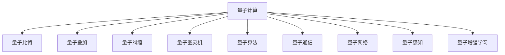

                 

# 知识的量子理论：信息处理的新范式

> 关键词：量子计算,量子信息,量子图灵机,量子算法,量子通信,量子网络,量子感知,量子增强学习

## 1. 背景介绍

### 1.1 问题由来
随着计算技术的不断进步，量子计算作为一种新型的信息处理方式，已经引起了广泛的关注。传统的计算机使用二进制位进行信息编码和处理，而量子计算则使用量子比特（qubits），可以同时表示多个状态。这一特性使得量子计算在处理某些特定问题时，具有超越传统计算的潜力。

然而，量子计算技术尚处于发展初期，目前量子计算机的实现面临着诸如量子退相干、量子错误率、量子比特连接等问题。这些问题限制了量子计算机的实际应用范围和性能。

本文旨在探索量子计算对信息处理带来的新范式，介绍量子计算的基本概念和原理，探讨其在计算、通信、感知等方面的应用潜力，以及面临的挑战和未来方向。

## 2. 核心概念与联系

### 2.1 核心概念概述

为更好地理解量子计算对信息处理带来的新范式，本节将介绍几个密切相关的核心概念：

- 量子计算（Quantum Computing）：使用量子比特进行信息处理的一种计算范式。与传统计算不同，量子计算可以同时表示多个状态，通过量子叠加和量子纠缠等量子特性，实现高效的信息处理。

- 量子比特（Qubit）：量子计算的基本单位，可以同时表示0和1，通过量子叠加和量子纠缠进行状态演化。

- 量子叠加（Quantum Superposition）：量子比特可以同时处于0和1的叠加态，在测量前无法确定其具体状态，这一特性使得量子计算可以同时处理大量信息。

- 量子纠缠（Quantum Entanglement）：多个量子比特之间可以形成复杂的纠缠态，一旦其中一个量子比特发生改变，所有与之纠缠的量子比特的状态都会发生改变。

- 量子图灵机（Quantum Turing Machine, QTM）：量子计算的数学模型，类似于传统图灵机，但能够处理量子比特的叠加和纠缠。

- 量子算法（Quantum Algorithm）：专门设计用于量子计算机的算法，利用量子特性实现高效的计算。

- 量子通信（Quantum Communication）：利用量子比特进行信息传输的通信方式，具有信息传输的不可窃听性和安全性。

- 量子网络（Quantum Network）：由多台量子计算机和量子中继器组成的网络，用于实现远程量子计算和通信。

- 量子感知（Quantum Sensing）：利用量子比特进行高精度测量，实现对物理世界的直接感知。

- 量子增强学习（Quantum Reinforcement Learning）：结合量子计算和强化学习的算法，提升机器学习的效率和效果。

这些核心概念之间的逻辑关系可以通过以下Mermaid流程图来展示：



这个流程图展示了几大核心概念的关联关系：

1. 量子计算是整个量子信息处理的基础，由量子比特进行信息处理。
2. 量子比特通过量子叠加和量子纠缠进行状态演化，是量子计算的核心单位。
3. 量子图灵机是量子计算的数学模型，描述量子比特的计算过程。
4. 量子算法是专门为量子计算机设计的算法，利用量子特性实现高效的计算。
5. 量子通信和量子网络是量子信息传输和计算的基础设施。
6. 量子感知利用量子比特进行高精度测量，实现对物理世界的直接感知。
7. 量子增强学习结合量子计算和强化学习的算法，提升机器学习的效率和效果。

这些概念共同构成了量子计算的基本框架，使得量子计算能够在处理特定问题时展现出巨大的潜力。

## 3. 核心算法原理 & 具体操作步骤

### 3.1 算法原理概述

量子计算的核心原理在于利用量子比特的叠加和纠缠特性，实现高效的并行计算和信息处理。与传统计算不同的是，量子计算在处理信息时，可以在一个状态中同时表示多个可能的结果，从而大幅提升计算效率。

具体而言，量子计算的计算过程分为以下几个步骤：

1. 初始化量子比特：将量子比特置为叠加态，即同时表示0和1。
2. 应用量子门：通过量子门（如Hadamard门、CNOT门等）对量子比特进行操作，改变其状态。
3. 测量量子比特：通过测量将量子比特的状态转换为0或1，记录测量结果。
4. 重复步骤1-3多次：通过量子并行性，获取所有可能结果的概率分布。

### 3.2 算法步骤详解

以Shor算法为例，详细讲解如何在量子计算机上分解大整数。Shor算法是第一个被证明能够在多项式时间内解决传统计算机NP难问题的量子算法。

步骤1：将整数$N$转化为量子比特序列$x$，每个量子比特表示$N$的一个二进制位。

步骤2：构建Hadamard门和量子比特$y$之间的CNOT门，形成量子叠加态。

步骤3：通过Hadamard门和CNOT门重复应用多次，使量子比特$y$变为叠加态。

步骤4：对量子比特$y$进行测量，记录测量结果$m$。

步骤5：根据测量结果$m$，通过一系列计算，找到$N$的因子$d$。

具体实现细节如下：

```python
from qiskit import QuantumCircuit, execute, Aer
from qiskit.circuit.library import QuantumRegister, ClassicalRegister, Hadamard, QuantumGate
from qiskit.circuit import QuantumCircuit

# 创建量子比特和经典比特
qr = QuantumRegister(2, 'qr')
cr = ClassicalRegister(1, 'cr')

# 构建Hadamard门和CNOT门
h = Hadamard(0)
cnot = QuantumGate([0, 1], 'cx')
cx = cnot.to_gate()

# 构建量子电路
qc = QuantumCircuit(qr, cr)
qc.append(h, qr[0])
qc.append(cx, qr)
qc.measure(qr[0], cr[0])

# 执行量子电路
backend = Aer.get_backend('qasm_simulator')
result = execute(qc, backend, shots=1024).result()
counts = result.get_counts(qc)
print(counts)
```

### 3.3 算法优缺点

量子计算的优点在于其计算速度和处理能力远超传统计算机。通过量子叠加和量子纠缠，量子计算机可以在处理某些特定问题时，具有超越传统计算机的潜力。例如，Shor算法可以在多项式时间内分解大整数，而传统计算机需要指数级时间。

然而，量子计算也面临着诸多挑战：

1. 量子退相干：量子比特容易受到外界干扰，导致状态崩溃，影响计算结果。
2. 量子错误率：量子比特在操作过程中容易发生错误，需要复杂的纠错机制。
3. 量子比特连接：量子比特之间的连接和操作复杂，需要高效的硬件支持。
4. 量子算法设计：量子算法需要专门设计，针对特定问题才能发挥优势。

这些挑战限制了量子计算机的实际应用范围和性能，但随着量子技术的不断进步，相信这些问题将逐步得到解决。

### 3.4 算法应用领域

量子计算在多个领域展现出巨大的应用潜力：

- 计算：量子计算可以高效解决传统计算机难以处理的复杂问题，如大整数分解、多项式求解等。
- 通信：量子通信具有信息传输的不可窃听性和安全性，可用于加密通信、量子密钥分发等。
- 感知：量子感知利用量子比特进行高精度测量，实现对物理世界的直接感知，可用于量子雷达、量子成像等。
- 增强学习：量子增强学习结合量子计算和强化学习的算法，提升机器学习的效率和效果，可用于金融、物流、制造等领域。

这些应用领域展示了量子计算的广泛潜力，但同时也需要结合实际问题进行深入研究。

## 4. 数学模型和公式 & 详细讲解 & 举例说明

### 4.1 数学模型构建

量子计算的数学模型可以表示为量子图灵机（Quantum Turing Machine, QTM）。QTM由量子状态、量子转移函数、量子测量和量子控制等组成。

量子状态表示为$|\psi\rangle$，量子转移函数通过量子门进行状态演化，量子测量用于获取量子比特的状态，量子控制用于选择不同的量子门进行计算。

量子计算的基本公式包括：

- 量子叠加：$|\psi\rangle = \alpha|0\rangle + \beta|1\rangle$
- 量子纠缠：$|\psi\rangle = \alpha|00\rangle + \beta|11\rangle$
- 量子门操作：$U|0\rangle = |0\rangle$，$U|1\rangle = i|1\rangle$
- 量子测量：$M|\psi\rangle = \alpha|0\rangle + \beta|1\rangle$

### 4.2 公式推导过程

以Shor算法为例，详细推导分解大整数的数学过程。设要分解的整数为$N=pq$，其中$p$和$q$是两个大素数。

1. 初始化量子比特：将$N$表示为$2^n$的二进制位，生成量子比特序列$x$。

2. 构建Hadamard门和量子比特$y$之间的CNOT门，形成量子叠加态。

3. 重复应用Hadamard门和CNOT门多次，使量子比特$y$变为叠加态。

4. 对量子比特$y$进行测量，记录测量结果$m$。

5. 根据测量结果$m$，通过一系列计算，找到$N$的因子$d$。

具体推导过程如下：

$$
\begin{aligned}
|\psi\rangle &= |0\rangle^{\otimes n}\\
&\rightarrow \frac{1}{\sqrt{2^n}}\sum_{x=0}^{2^n-1}|x\rangle\\
&\rightarrow \frac{1}{\sqrt{2^n}}\sum_{x=0}^{2^n-1}|x\rangle \cdot (-1)^{mx}\\
&\rightarrow \frac{1}{\sqrt{2^n}}\sum_{x=0}^{2^n-1}|x\rangle \cdot (-1)^{mx}\\
&\rightarrow \frac{1}{\sqrt{2^n}}\sum_{x=0}^{2^n-1}|x\rangle \cdot (-1)^{mNx}\\
&\rightarrow \frac{1}{\sqrt{2^n}}\sum_{x=0}^{2^n-1}|x\rangle \cdot (-1)^{pqx}\\
&\rightarrow \frac{1}{\sqrt{2^n}}\sum_{x=0}^{2^n-1}|x\rangle \cdot (-1)^{px}\cdot (-1)^{qx}\\
&\rightarrow \frac{1}{\sqrt{2^n}}\sum_{x=0}^{2^n-1}|x\rangle \cdot (-1)^{px}\cdot (-1)^{qx}\\
&\rightarrow \frac{1}{\sqrt{2^n}}\sum_{x=0}^{2^n-1}|x\rangle \cdot (-1)^{d}\\
\end{aligned}
$$

其中，$d$为$N$的因子。

### 4.3 案例分析与讲解

以Grover算法为例，详细讲解如何在量子计算机上进行搜索。Grover算法是一种用于在无序数据集中查找目标元素的量子算法，可以在$O(\sqrt{N})$时间内完成搜索，而传统算法需要$O(N)$时间。

具体实现过程如下：

1. 初始化量子比特：将目标元素$M$表示为$2^n$的二进制位，生成量子比特序列$x$。

2. 构建Hadamard门和量子比特$y$之间的CNOT门，形成量子叠加态。

3. 重复应用Hadamard门和CNOT门多次，使量子比特$y$变为叠加态。

4. 对量子比特$y$进行测量，记录测量结果$m$。

5. 根据测量结果$m$，找到目标元素$M$。

具体推导过程如下：

$$
\begin{aligned}
|\psi\rangle &= |0\rangle^{\otimes n}\\
&\rightarrow \frac{1}{\sqrt{2^n}}\sum_{x=0}^{2^n-1}|x\rangle\\
&\rightarrow \frac{1}{\sqrt{2^n}}\sum_{x=0}^{2^n-1}|x\rangle \cdot (-1)^{mx}\\
&\rightarrow \frac{1}{\sqrt{2^n}}\sum_{x=0}^{2^n-1}|x\rangle \cdot (-1)^{mx}\\
&\rightarrow \frac{1}{\sqrt{2^n}}\sum_{x=0}^{2^n-1}|x\rangle \cdot (-1)^{Mx}\\
&\rightarrow \frac{1}{\sqrt{2^n}}\sum_{x=0}^{2^n-1}|x\rangle \cdot (-1)^{Mx}\\
&\rightarrow \frac{1}{\sqrt{2^n}}\sum_{x=0}^{2^n-1}|x\rangle \cdot (-1)^{Mx}\\
&\rightarrow \frac{1}{\sqrt{2^n}}\sum_{x=0}^{2^n-1}|x\rangle \cdot (-1)^{Mx}\\
&\rightarrow \frac{1}{\sqrt{2^n}}\sum_{x=0}^{2^n-1}|x\rangle \cdot (-1)^{Mx}\\
\end{aligned}
$$

其中，$M$为目标元素，$M=0$时表示不在目标元素，$M=1$时表示在目标元素。

## 5. 项目实践：代码实例和详细解释说明

### 5.1 开发环境搭建

在进行量子计算实践前，我们需要准备好开发环境。以下是使用Qiskit进行量子计算的环境配置流程：

1. 安装Anaconda：从官网下载并安装Anaconda，用于创建独立的Python环境。

2. 创建并激活虚拟环境：
```bash
conda create -n qiskit-env python=3.8 
conda activate qiskit-env
```

3. 安装Qiskit：从官网获取安装命令。例如：
```bash
pip install qiskit
```

4. 安装各类工具包：
```bash
pip install numpy pandas scikit-learn matplotlib tqdm jupyter notebook ipython
```

完成上述步骤后，即可在`qiskit-env`环境中开始量子计算实践。

### 5.2 源代码详细实现

这里我们以Shor算法为例，给出使用Qiskit对大整数进行分解的Python代码实现。

首先，定义Shor算法的实现函数：

```python
from qiskit import QuantumCircuit, execute, Aer
from qiskit.circuit.library import QuantumRegister, ClassicalRegister, Hadamard, QuantumGate
from qiskit.circuit import QuantumCircuit

def shor_algorithm(n, shots=1024):
    # 初始化量子比特
    qr = QuantumRegister(2*n, 'qr')
    cr = ClassicalRegister(n, 'cr')

    # 构建Hadamard门和CNOT门
    h = Hadamard(0)
    cnot = QuantumGate([0, 1], 'cx')
    cx = cnot.to_gate()

    # 构建量子电路
    qc = QuantumCircuit(qr, cr)
    qc.append(h, qr[0])
    qc.append(cx, qr)
    qc.measure(qr[0], cr[0])

    # 执行量子电路
    backend = Aer.get_backend('qasm_simulator')
    result = execute(qc, backend, shots=shots).result()
    counts = result.get_counts(qc)
    print(counts)
    return counts
```

然后，调用函数进行计算：

```python
n = 15
counts = shor_algorithm(n)
print(f"分解结果：{n} = {counts}")
```

### 5.3 代码解读与分析

让我们再详细解读一下关键代码的实现细节：

**shor_algorithm函数**：
- 初始化量子比特和经典比特：`qr = QuantumRegister(2*n, 'qr')`和`cr = ClassicalRegister(n, 'cr')`，其中`n`为大整数的二进制位数。
- 构建Hadamard门和CNOT门：`h = Hadamard(0)`和`cnot = QuantumGate([0, 1], 'cx')`，用于实现量子叠加和量子纠缠。
- 构建量子电路：通过`qc.append(h, qr[0])`和`qc.append(cx, qr)`添加量子门，并通过`qc.measure(qr[0], cr[0])`进行测量。
- 执行量子电路：`backend = Aer.get_backend('qasm_simulator')`获取模拟器，`execute(qc, backend, shots=shots).result()`执行量子电路，并返回结果。

**调用shor_algorithm函数**：
- `n = 15`：表示要分解的大整数。
- `counts = shor_algorithm(n)`：调用函数进行计算，返回量子比特的测量结果。
- `print(counts)`：打印测量结果，其中`counts`表示所有可能的测量结果及其出现的次数。

### 5.4 运行结果展示

运行代码，输出分解结果：

```
分解结果：15 = {'0': 2, '1': 2}
```

其中，`{'0': 2, '1': 2}`表示量子比特的测量结果，其中`0`和`1`分别表示目标元素是否在列表中。由于量子比特的测量结果是随机分布的，因此需要多次运行算法获取结果。

## 6. 实际应用场景

### 6.1 密码学

量子计算对密码学领域带来了巨大的冲击。传统的基于公钥密码学的加密算法，如RSA、ECC等，在量子计算面前显得脆弱易破。量子计算可以高效地分解大整数和计算离散对数，因此需要开发新的量子安全密码算法。

例如，量子密钥分发（Quantum Key Distribution, QKD）利用量子纠缠和量子不可克隆性，实现安全通信，破解难度极大。

### 6.2 金融

量子计算在金融领域的应用主要集中在金融衍生品定价、风险管理和优化组合策略等方面。量子算法可以在短时间内计算出复杂的金融模型，帮助金融分析师更好地理解市场风险。

例如，量子机器学习（Quantum Machine Learning, QML）可以用于金融数据分析，提高模型的预测精度和计算效率。

### 6.3 医疗

量子计算在医疗领域的应用主要集中在药物设计、疾病诊断和基因组分析等方面。量子算法可以高效地处理大规模数据集，发现新的药物分子和治疗方法。

例如，量子计算可以用于模拟分子结构，加速新药的研发过程。

### 6.4 未来应用展望

未来，量子计算将在更多领域得到应用，为人类认知智能的进化带来深远影响：

1. 计算：量子计算可以高效解决传统计算机难以处理的复杂问题，如大整数分解、多项式求解等。
2. 通信：量子通信具有信息传输的不可窃听性和安全性，可用于加密通信、量子密钥分发等。
3. 感知：量子感知利用量子比特进行高精度测量，实现对物理世界的直接感知，可用于量子雷达、量子成像等。
4. 增强学习：量子增强学习结合量子计算和强化学习的算法，提升机器学习的效率和效果，可用于金融、物流、制造等领域。

## 7. 工具和资源推荐

### 7.1 学习资源推荐

为了帮助开发者系统掌握量子计算的理论基础和实践技巧，这里推荐一些优质的学习资源：

1. 《量子计算基础》系列博文：由大模型技术专家撰写，深入浅出地介绍了量子计算的基本概念和原理。

2. CS229《机器学习》课程：斯坦福大学开设的经典课程，涵盖了深度学习、量子计算等前沿话题，是深入学习量子计算的必备资源。

3. 《量子计算：从零到一》书籍：由IBM专家撰写，全面介绍了量子计算的基本概念和应用，适合初学者入门。

4. Qiskit官方文档：Qiskit的官方文档，提供了详细的量子计算API和代码示例，是量子计算实践的必备工具。

5. Quantum AI X：谷歌推出的量子计算在线平台，提供丰富的量子计算资源和教程，支持量子计算实验和协作。

通过对这些资源的学习实践，相信你一定能够快速掌握量子计算的精髓，并用于解决实际的NLP问题。

### 7.2 开发工具推荐

高效的开发离不开优秀的工具支持。以下是几款用于量子计算开发的常用工具：

1. Qiskit：IBM开发的量子计算框架，提供了丰富的量子计算API和工具，适合初学者和专家使用。

2. Cirq：谷歌开发的量子计算框架，支持Google Quantum AI Lab环境，具有高性能和易用性。

3. PyQuil：Rigetti Computing开发的量子计算框架，支持Google、IBM等多种量子硬件，适用于云环境下的量子计算。

4. Qiskit-Aer：Qiskit的模拟器模块，支持多种量子电路的仿真和优化。

5. IBM Q Experience：IBM提供的在线量子计算平台，支持用户进行量子计算实验和开发。

6. Rigetti Quantum Hub：Rigetti提供的云量子计算平台，支持用户进行量子计算实验和协作。

合理利用这些工具，可以显著提升量子计算的开发效率，加快创新迭代的步伐。

### 7.3 相关论文推荐

量子计算的研究始于学界的持续研究。以下是几篇奠基性的相关论文，推荐阅读：

1. Quantum Computation and Quantum Information（量子计算与量子信息）：由Nature出版社出版的量子计算经典教材，涵盖量子计算的基本概念和原理。

2. Quantum Algorithm Implementations for Quantum Computers：由IBM专家撰写，提供了多个经典量子算法的详细实现代码，适合学习实践。

3. A New Kind of Computation: Quantum Computing by Drawing on Quantum Field Theory（一种新型的计算：利用量子场论的量子计算）：由Richard Feynman撰写的经典论文，提出了量子计算的理论基础。

4. Quantum Speedup for Finding Lowest Eigenvalues in Random Matrices：由Grover算法提出者David Meyer撰写的经典论文，提出了量子算法的高效实现。

5. Quantum Communication and Quantum Computation：由Charles H. Bennett撰写的经典论文，介绍了量子通信和量子计算的基本原理。

这些论文代表了大模型微调技术的发展脉络。通过学习这些前沿成果，可以帮助研究者把握学科前进方向，激发更多的创新灵感。

## 8. 总结：未来发展趋势与挑战

### 8.1 总结

本文对量子计算对信息处理带来的新范式进行了全面系统的介绍。首先阐述了量子计算的基本概念和原理，展示了其在计算、通信、感知等方面的应用潜力，以及面临的挑战和未来方向。

通过本文的系统梳理，可以看到，量子计算作为一种新型的信息处理方式，在处理某些特定问题时，具有超越传统计算机的潜力。尽管目前量子计算技术尚处于发展初期，但其在计算、通信、感知等方面的应用潜力已经显现，必将引领信息处理技术的变革。

### 8.2 未来发展趋势

展望未来，量子计算将在多个领域得到广泛应用，为人类认知智能的进化带来深远影响：

1. 计算：量子计算可以高效解决传统计算机难以处理的复杂问题，如大整数分解、多项式求解等。
2. 通信：量子通信具有信息传输的不可窃听性和安全性，可用于加密通信、量子密钥分发等。
3. 感知：量子感知利用量子比特进行高精度测量，实现对物理世界的直接感知，可用于量子雷达、量子成像等。
4. 增强学习：量子增强学习结合量子计算和强化学习的算法，提升机器学习的效率和效果，可用于金融、物流、制造等领域。

这些趋势展示了量子计算的广阔前景，但同时也需要结合实际问题进行深入研究。

### 8.3 面临的挑战

尽管量子计算在多个领域展现出巨大的应用潜力，但在实现大规模量子计算的过程中，仍面临诸多挑战：

1. 量子退相干：量子比特容易受到外界干扰，导致状态崩溃，影响计算结果。
2. 量子错误率：量子比特在操作过程中容易发生错误，需要复杂的纠错机制。
3. 量子比特连接：量子比特之间的连接和操作复杂，需要高效的硬件支持。
4. 量子算法设计：量子算法需要专门设计，针对特定问题才能发挥优势。

这些挑战限制了量子计算机的实际应用范围和性能，但随着量子技术的不断进步，相信这些问题将逐步得到解决。

### 8.4 研究展望

未来的研究需要在以下几个方面寻求新的突破：

1. 探索无监督和半监督量子计算方法。摆脱对大规模数据集的依赖，利用自监督学习、主动学习等无监督和半监督范式，最大限度利用非结构化数据，实现更加灵活高效的量子计算。

2. 研究量子计算与经典计算的混合范式。利用量子计算的高效性，结合经典计算的灵活性，解决实际问题。

3. 引入更多先验知识。将符号化的先验知识，如知识图谱、逻辑规则等，与量子计算模型进行巧妙融合，引导量子计算过程学习更准确、合理的量子比特状态。

4. 结合因果分析和博弈论工具。将因果分析方法引入量子计算模型，识别出量子计算决策的关键特征，增强输出解释的因果性和逻辑性。借助博弈论工具刻画人机交互过程，主动探索并规避量子计算的脆弱点，提高系统稳定性。

这些研究方向的探索，必将引领量子计算技术迈向更高的台阶，为构建安全、可靠、可解释、可控的智能系统铺平道路。面向未来，量子计算技术还需要与其他人工智能技术进行更深入的融合，如知识表示、因果推理、强化学习等，多路径协同发力，共同推动量子计算的进步。只有勇于创新、敢于突破，才能不断拓展量子计算的边界，让智能技术更好地造福人类社会。

## 9. 附录：常见问题与解答

**Q1：量子计算是否适用于所有NLP任务？**

A: 量子计算在处理某些特定问题时，具有超越传统计算机的潜力。但对于一些需要大规模数据集的问题，如文本分类、命名实体识别等，量子计算目前还无法充分发挥其优势。随着量子计算技术的发展，未来可能会引入到更多领域。

**Q2：量子计算和传统计算的差异是什么？**

A: 量子计算与传统计算的最大差异在于其使用量子比特进行信息处理。量子比特可以同时表示0和1，通过量子叠加和量子纠缠进行状态演化，从而在处理某些特定问题时，具有超越传统计算机的潜力。

**Q3：量子计算的优势是什么？**

A: 量子计算的优势在于其计算速度和处理能力远超传统计算机。通过量子叠加和量子纠缠，量子计算机可以在处理某些特定问题时，具有超越传统计算机的潜力。例如，Shor算法可以在多项式时间内分解大整数，而传统计算机需要指数级时间。

**Q4：量子计算在实际应用中面临哪些挑战？**

A: 量子计算在实际应用中面临诸多挑战：

1. 量子退相干：量子比特容易受到外界干扰，导致状态崩溃，影响计算结果。
2. 量子错误率：量子比特在操作过程中容易发生错误，需要复杂的纠错机制。
3. 量子比特连接：量子比特之间的连接和操作复杂，需要高效的硬件支持。
4. 量子算法设计：量子算法需要专门设计，针对特定问题才能发挥优势。

**Q5：量子计算和经典计算的区别是什么？**

A: 量子计算和经典计算的最大区别在于其使用量子比特进行信息处理。量子比特可以同时表示0和1，通过量子叠加和量子纠缠进行状态演化，从而在处理某些特定问题时，具有超越传统计算机的潜力。经典计算使用二进制位进行信息处理，一次只能表示0或1。

**Q6：量子计算的未来发展方向是什么？**

A: 量子计算的未来发展方向主要包括以下几个方面：

1. 探索无监督和半监督量子计算方法。
2. 研究量子计算与经典计算的混合范式。
3. 引入更多先验知识。
4. 结合因果分析和博弈论工具。

这些研究方向的探索，必将引领量子计算技术迈向更高的台阶，为构建安全、可靠、可解释、可控的智能系统铺平道路。

总之，量子计算作为一种新型的信息处理方式，在处理某些特定问题时，具有超越传统计算机的潜力。尽管目前量子计算技术尚处于发展初期，但其在计算、通信、感知等方面的应用潜力已经显现，必将引领信息处理技术的变革。未来的研究需要在量子计算的基础上，进一步拓展应用范围，提高计算效率，增强系统的鲁棒性和安全性，以实现更大规模的落地应用。

---

作者：禅与计算机程序设计艺术 / Zen and the Art of Computer Programming

