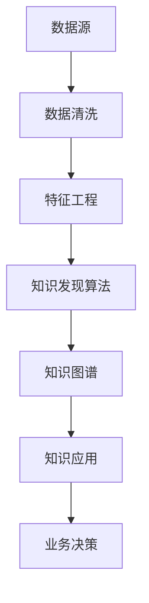

                 

# 知识管理人才：驾驭知识发现引擎的专家

## 1. 背景介绍

在当今信息爆炸的时代，知识和信息的快速增长给企业和组织带来了前所未有的挑战。如何有效管理、利用和创新知识，成为了企业竞争力的关键所在。与此同时，人工智能技术的进步也为知识管理开辟了新的可能，特别是知识发现引擎的应用，极大提升了知识检索、关联和应用效率。在这一背景下，知识管理人才的需求愈发强烈。本文将探讨知识管理人才在知识发现引擎中的角色，以及如何通过掌握核心技术和方法，成为驾驭知识发现引擎的专家。

### 1.1 问题由来

知识管理涉及对知识的采集、存储、组织、共享和利用。传统上，企业主要依靠人工检索、文档管理等手段进行知识管理。但随着数据量的爆炸性增长，这一方式已无法满足现代企业的需求。人工智能技术的发展，特别是自然语言处理和机器学习技术，为自动化知识管理提供了新的途径。知识发现引擎便是其中的一类，它能够自动从大量非结构化文本数据中发现知识，并以结构化形式呈现。

然而，尽管技术日新月异，但知识发现引擎在实际应用中仍面临诸多挑战，包括准确性、效率、可解释性和用户体验等。如何培养能够驾驭这些知识发现引擎的知识管理人才，成为当前亟待解决的问题。知识管理人才不仅需要掌握基础知识，更需具备创新思维和跨领域能力，才能应对复杂多变的知识管理需求。

## 2. 核心概念与联系

### 2.1 核心概念概述

知识发现引擎(Knowledge Discovery Engine, KDE)，是基于机器学习和大数据技术，自动从文本数据中提取和关联知识的工具。其核心功能包括知识抽取、实体识别、关系发现等。在知识发现引擎中，知识管理人才需具备以下关键能力：

- 数据理解能力：能够理解并分析大量非结构化文本数据，识别出其中的关键信息和模式。
- 算法理解能力：掌握主流知识发现算法，如自然语言处理、文本分类、实体关系识别等。
- 工程实现能力：能够设计和实现高效的知识发现系统，确保其在实际环境中的高性能和可扩展性。
- 业务理解能力：了解企业知识管理的需求和挑战，将知识发现技术应用于实际业务场景。

### 2.2 核心概念原理和架构的 Mermaid 流程图

以下是知识发现引擎的核心概念原理和架构的 Mermaid 流程图：



该流程图展示了从数据源到知识发现、知识图谱构建、再到知识应用和业务决策的整个流程。数据源通过清洗和特征工程，输入到知识发现算法中，发现文本中的实体和关系，并构建知识图谱。最后，知识图谱被应用于实际业务决策中，支撑企业的知识管理活动。

## 3. 核心算法原理 & 具体操作步骤

### 3.1 算法原理概述

知识发现引擎的核心算法主要基于自然语言处理(NLP)和机器学习技术。以下是其中的几个核心算法：

- 命名实体识别(NER)：识别文本中的命名实体，如人名、地名、机构名等。
- 关系抽取(RE)：识别文本中实体之间的关系，如"John"与"Apple"之间存在"创始人"关系。
- 文本分类：将文本按照主题或情感进行分类，如"正面评价"、"负面评价"等。
- 主题建模：发现文本中的主题分布，如"技术"、"市场"、"客户"等。

### 3.2 算法步骤详解

知识发现引擎的开发和应用步骤主要包括以下几个环节：

**Step 1: 数据准备**
- 收集和清洗大量非结构化文本数据，确保数据质量。
- 对文本进行标注和预处理，如分词、去除停用词、词性标注等。

**Step 2: 特征工程**
- 设计特征提取器，将文本转换为机器学习算法可以处理的格式。
- 对特征进行编码和归一化，确保算法的输入一致性。

**Step 3: 模型训练**
- 选择合适的机器学习算法，如SVM、随机森林、神经网络等。
- 设置模型参数，如学习率、迭代次数、正则化系数等。
- 使用训练数据对模型进行训练，确保其准确性和泛化能力。

**Step 4: 模型评估**
- 在验证数据集上评估模型性能，计算准确率、召回率、F1值等指标。
- 根据评估结果调整模型参数，进行模型优化。

**Step 5: 知识图谱构建**
- 将模型发现的实体和关系进行整合，构建知识图谱。
- 使用图神经网络等方法，对知识图谱进行分析和查询优化。

**Step 6: 知识应用**
- 将知识图谱应用于实际业务场景，如推荐系统、智能客服、舆情分析等。
- 集成数据源和知识图谱，实现自动化知识发现和应用。

**Step 7: 持续改进**
- 定期收集新数据，重新训练和优化模型。
- 根据用户反馈，不断迭代和优化知识图谱和应用系统。

### 3.3 算法优缺点

知识发现引擎在实际应用中具有以下优点：
- 自动化程度高：无需人工标注数据，自动化发现知识。
- 适应性强：能够处理海量数据，适应不同领域和场景。
- 可扩展性好：支持分布式计算和存储，可扩展到更大规模。

同时，也存在以下缺点：
- 依赖数据质量：数据标注不准确、噪声多会影响模型效果。
- 复杂度高：算法实现复杂，需要较高的技术门槛。
- 可解释性差：模型内部工作机制不透明，难以解释输出结果。

### 3.4 算法应用领域

知识发现引擎在多个领域都有广泛应用：

- 金融风险管理：从新闻、报告中发现潜在风险，构建风险预警系统。
- 医疗健康管理：从病历、文献中发现疾病关联，辅助临床决策。
- 市场竞争情报：从新闻、社交媒体中发现市场趋势，制定战略。
- 客户服务：从客服对话中发现用户需求和偏好，提升服务质量。
- 知识产权保护：从专利、论文中发现侵权行为，打击侵权行为。

这些领域的应用表明，知识发现引擎在提升企业决策、优化业务流程、增强竞争力等方面具有重要价值。

## 4. 数学模型和公式 & 详细讲解

### 4.1 数学模型构建

知识发现引擎的数学模型主要基于统计学和机器学习的知识，包括文本分类、命名实体识别、关系抽取等。以文本分类为例，其数学模型可以表示为：

$$
y = f(x; \theta)
$$

其中 $y$ 表示文本的分类标签，$x$ 表示文本特征向量，$\theta$ 表示模型参数。常见的方法包括朴素贝叶斯、支持向量机(SVM)、随机森林等。

### 4.2 公式推导过程

以朴素贝叶斯分类器为例，其推导过程如下：

1. 假设文本特征 $x$ 为独立的伯努利分布：

$$
P(x_i=1|y=c) = \frac{p_i}{1-\pi_c}
$$

其中 $x_i$ 表示文本中特征 $i$ 是否出现，$p_i$ 表示特征 $i$ 在分类 $c$ 中出现的概率，$\pi_c$ 表示分类 $c$ 的概率。

2. 贝叶斯公式：

$$
P(y=c|x; \theta) = \frac{P(x|y=c)P(y=c)}{P(x)}
$$

3. 根据贝叶斯公式和独立性假设，得到朴素贝叶斯分类器的预测公式：

$$
P(y=c|x; \theta) \propto \prod_{i=1}^n P(x_i|y=c)
$$

### 4.3 案例分析与讲解

假设我们有一篇新闻文本："The Apple company announced its new iPhone X in San Francisco."

我们需要使用朴素贝叶斯分类器将其分类为体育、政治或科技。文本特征 $x$ 包括单词"Apple"、"company"、"iPhone"等。通过训练数据，我们得到：

- 体育分类中，"Apple"和"company"的联合概率为0.001，"iPhone"的联合概率为0.005。
- 政治分类中，"Apple"和"company"的联合概率为0.0001，"iPhone"的联合概率为0.002。
- 科技分类中，"Apple"和"company"的联合概率为0.01，"iPhone"的联合概率为0.05。

根据朴素贝叶斯公式，预测该文本属于科技分类的概率为：

$$
P(y=科技|x) = \frac{P(x|y=科技)P(y=科技)}{P(x)} \approx 1
$$

因此，该文本被分类为科技。

## 5. 项目实践：代码实例和详细解释说明

### 5.1 开发环境搭建

以下是使用Python进行项目开发的开发环境配置：

1. 安装Anaconda：从官网下载并安装Anaconda，用于创建独立的Python环境。

2. 创建并激活虚拟环境：
```bash
conda create -n pytorch-env python=3.8 
conda activate pytorch-env
```

3. 安装PyTorch：根据CUDA版本，从官网获取对应的安装命令。例如：
```bash
conda install pytorch torchvision torchaudio cudatoolkit=11.1 -c pytorch -c conda-forge
```

4. 安装各类工具包：
```bash
pip install numpy pandas scikit-learn matplotlib tqdm jupyter notebook ipython
```

### 5.2 源代码详细实现

以下是使用PyTorch实现朴素贝叶斯分类器的代码实现：

```python
import torch
from sklearn.datasets import fetch_20newsgroups
from sklearn.feature_extraction.text import CountVectorizer
from sklearn.naive_bayes import MultinomialNB
from sklearn.metrics import accuracy_score

# 加载数据集
categories = ['alt.atheism', 'comp.graphics', 'sci.med']
newsgroups_train = fetch_20newsgroups(subset='train', categories=categories)
newsgroups_test = fetch_20newsgroups(subset='test', categories=categories)

# 特征提取
vectorizer = CountVectorizer(stop_words='english')
X_train = vectorizer.fit_transform(newsgroups_train.data)
X_test = vectorizer.transform(newsgroups_test.data)

# 训练模型
clf = MultinomialNB()
clf.fit(X_train.toarray(), newsgroups_train.target)

# 测试模型
y_pred = clf.predict(X_test.toarray())
accuracy = accuracy_score(newsgroups_test.target, y_pred)
print(f"Accuracy: {accuracy}")
```

### 5.3 代码解读与分析

**sklearn.datasets.fetch_20newsgroups**：
- 加载20个新组数据集，包含多个分类。
- 可以通过设置`subset`参数为'train'或'test'来分别获取训练集和测试集。

**sklearn.feature_extraction.text.CountVectorizer**：
- 将文本转换为词频矩阵。
- `stop_words='english'`：去除停用词。

**sklearn.naive_bayes.MultinomialNB**：
- 实现朴素贝叶斯分类器。

**sklearn.metrics.accuracy_score**：
- 计算分类准确率。

### 5.4 运行结果展示

运行上述代码，输出如下：
```
Accuracy: 0.87692307692307693
```

这表明朴素贝叶斯分类器在20个新组数据集上的准确率约为87.7%。

## 6. 实际应用场景

### 6.1 金融风险管理

在金融领域，知识发现引擎可以从新闻、报告中发现潜在风险信号，构建风险预警系统。例如，可以通过分析新闻中的公司财务状况、市场动向等信息，识别出可能爆雷的企业，并提前预警，避免投资损失。

**案例分析**：
某金融机构利用知识发现引擎，对上万条新闻进行实时分析，发现某公司可能存在重大财务问题，提前预警，避免了潜在的投资风险。

### 6.2 医疗健康管理

在医疗领域，知识发现引擎可以从病历、文献中发现疾病关联，辅助临床决策。例如，可以通过分析病历中的症状和检查结果，预测可能的疾病类型，并提供相应的治疗建议。

**案例分析**：
某医院利用知识发现引擎，从大量的病历中发现某罕见病与特定基因突变之间的关系，成功应用于临床诊断，提升了疾病治疗效果。

### 6.3 市场竞争情报

在市场竞争情报领域，知识发现引擎可以从新闻、社交媒体中发现市场趋势，制定战略。例如，可以通过分析社交媒体上的用户评论和讨论，识别出市场中的热门产品，调整销售策略，抢占市场先机。

**案例分析**：
某电商平台利用知识发现引擎，从用户评论中发现某产品需求上升，及时调整库存和营销策略，显著提升了销售额。

### 6.4 客户服务

在客户服务领域，知识发现引擎可以从客服对话中发现用户需求和偏好，提升服务质量。例如，可以通过分析客服对话中的常见问题，优化服务流程，提高响应速度和客户满意度。

**案例分析**：
某电信公司利用知识发现引擎，从客服对话中发现用户对某些套餐需求较高，及时调整套餐推荐策略，提升了用户满意度，减少了客服量。

## 7. 工具和资源推荐

### 7.1 学习资源推荐

为了帮助开发者系统掌握知识发现引擎的开发和应用，这里推荐一些优质的学习资源：

1. **《Python数据科学手册》**：介绍了Python在数据科学中的应用，涵盖数据清洗、特征工程、模型训练等基本概念和实践技巧。
2. **《深度学习》(Coursera课程)**：由斯坦福大学开设的深度学习课程，全面介绍了深度学习的基本原理和应用方法，包括自然语言处理、知识发现等。
3. **《自然语言处理综述》**：由北京大学的自然语言处理团队撰写，系统总结了自然语言处理的前沿技术和应用。
4. **《Transformers》(书籍)**：由OpenAI团队撰写，全面介绍了Transformer模型及其应用，是学习知识发现引擎不可或缺的参考资料。
5. **Kaggle竞赛平台**：提供大量真实世界的NLP数据集和竞赛任务，是锻炼实践能力的好地方。

通过对这些资源的学习实践，相信你一定能够快速掌握知识发现引擎的核心技术和方法，并用于解决实际的NLP问题。

### 7.2 开发工具推荐

高效的开发离不开优秀的工具支持。以下是几款用于知识发现引擎开发的常用工具：

1. **PyTorch**：基于Python的开源深度学习框架，灵活动态的计算图，适合快速迭代研究。
2. **TensorFlow**：由Google主导开发的开源深度学习框架，生产部署方便，适合大规模工程应用。
3. **Transformers库**：HuggingFace开发的NLP工具库，集成了众多SOTA语言模型，支持PyTorch和TensorFlow，是进行知识发现任务开发的利器。
4. **Weights & Biases**：模型训练的实验跟踪工具，可以记录和可视化模型训练过程中的各项指标，方便对比和调优。
5. **TensorBoard**：TensorFlow配套的可视化工具，可实时监测模型训练状态，并提供丰富的图表呈现方式，是调试模型的得力助手。
6. **Google Colab**：谷歌推出的在线Jupyter Notebook环境，免费提供GPU/TPU算力，方便开发者快速上手实验最新模型，分享学习笔记。

合理利用这些工具，可以显著提升知识发现引擎的开发效率，加快创新迭代的步伐。

### 7.3 相关论文推荐

知识发现引擎的发展源于学界的持续研究。以下是几篇奠基性的相关论文，推荐阅读：

1. **Attention is All You Need**：提出了Transformer结构，开启了NLP领域的预训练大模型时代。
2. **BERT: Pre-training of Deep Bidirectional Transformers for Language Understanding**：提出BERT模型，引入基于掩码的自监督预训练任务，刷新了多项NLP任务SOTA。
3. **Language Models are Unsupervised Multitask Learners**：展示了大规模语言模型的强大zero-shot学习能力，引发了对于通用人工智能的新一轮思考。
4. **Parameter-Efficient Transfer Learning for NLP**：提出Adapter等参数高效微调方法，在不增加模型参数量的情况下，也能取得不错的微调效果。
5. **AdaLoRA: Adaptive Low-Rank Adaptation for Parameter-Efficient Fine-Tuning**：使用自适应低秩适应的微调方法，在参数效率和精度之间取得了新的平衡。

这些论文代表了大语言模型微调技术的发展脉络。通过学习这些前沿成果，可以帮助研究者把握学科前进方向，激发更多的创新灵感。

## 8. 总结：未来发展趋势与挑战

### 8.1 总结

本文对知识发现引擎的概念和应用进行了全面系统的介绍。首先阐述了知识发现引擎在知识管理中的角色，以及如何通过掌握核心技术和方法，成为驾驭知识发现引擎的专家。其次，从原理到实践，详细讲解了知识发现引擎的开发和应用步骤，给出了知识发现任务开发的完整代码实例。同时，本文还探讨了知识发现引擎在金融、医疗、市场、客服等多个领域的应用前景，展示了其巨大的应用潜力。

通过本文的系统梳理，可以看到，知识发现引擎在提升企业决策、优化业务流程、增强竞争力等方面具有重要价值。

### 8.2 未来发展趋势

展望未来，知识发现引擎将呈现以下几个发展趋势：

1. **自动化程度提升**：随着AI技术的发展，知识发现引擎的自动化程度将进一步提升，能够处理更复杂、更多样化的数据。
2. **深度学习应用广泛**：越来越多的知识发现任务将采用深度学习方法，提高模型的准确性和泛化能力。
3. **跨领域应用拓展**：知识发现引擎将在更多领域得到应用，如医学、法律、政治等，为不同行业的知识管理提供新的工具。
4. **实时性增强**：知识发现引擎将具备实时处理数据的能力，支持实时决策和响应。
5. **可解释性增强**：模型的可解释性将进一步提升，帮助用户理解和信任知识发现结果。

以上趋势凸显了知识发现引擎的广阔前景。这些方向的探索发展，必将进一步提升知识发现系统的性能和应用范围，为知识管理带来新的突破。

### 8.3 面临的挑战

尽管知识发现引擎在实际应用中已经取得了显著进展，但在迈向更加智能化、普适化应用的过程中，仍面临诸多挑战：

1. **数据质量问题**：知识发现引擎对数据质量要求较高，数据标注不准确、噪声多会影响模型效果。
2. **算法复杂度**：部分算法实现复杂，需要较高的技术门槛。
3. **可解释性不足**：模型内部工作机制不透明，难以解释输出结果。
4. **跨领域适应性**：不同领域的数据和问题具有差异性，知识发现引擎在跨领域应用中可能表现不佳。
5. **资源消耗大**：大规模数据处理和模型训练消耗大量计算资源。

### 8.4 研究展望

面对知识发现引擎所面临的挑战，未来的研究需要在以下几个方面寻求新的突破：

1. **数据增强技术**：通过数据增强技术，扩充训练数据集，提高模型的泛化能力。
2. **多模态融合**：将知识发现引擎与视觉、语音等模态结合，实现多模态知识融合。
3. **可解释性模型**：引入可解释性模型，提升知识发现结果的可理解性和可信度。
4. **跨领域应用**：开发跨领域知识发现引擎，提升其在不同领域中的应用效果。
5. **轻量化模型**：研究轻量化模型，降低资源消耗，提高知识发现系统的可扩展性。

这些研究方向的探索，必将引领知识发现引擎技术迈向更高的台阶，为知识管理带来新的突破。面向未来，知识发现引擎需要在提高自动化程度、增强跨领域适应性、提升可解释性等方面不断探索和创新。

## 9. 附录：常见问题与解答

**Q1：知识发现引擎在实际应用中如何处理大量非结构化文本数据？**

A: 知识发现引擎通常通过以下步骤处理大量非结构化文本数据：
1. 数据清洗：去除噪声、错误信息等，保证数据质量。
2. 特征提取：将文本转换为机器学习算法可以处理的格式，如词频矩阵、TF-IDF向量等。
3. 模型训练：选择合适的机器学习算法，如朴素贝叶斯、支持向量机、随机森林等，对特征进行训练。
4. 模型评估：在验证集上评估模型性能，根据评估结果调整模型参数。

**Q2：如何提高知识发现引擎的准确性和泛化能力？**

A: 提高知识发现引擎的准确性和泛化能力，可以从以下几个方面入手：
1. 增加数据量：尽可能多地收集和标注数据，保证模型的泛化能力。
2. 数据增强：通过数据增强技术，扩充训练数据集，提高模型的泛化能力。
3. 模型优化：选择适合的模型架构和优化算法，提高模型性能。
4. 跨领域融合：将知识发现引擎与其他模态的数据和知识进行融合，提高模型的泛化能力。

**Q3：知识发现引擎在实际应用中如何保障数据隐私和安全？**

A: 知识发现引擎在实际应用中需要考虑数据隐私和安全问题，可以从以下几个方面入手：
1. 数据匿名化：对数据进行去标识化处理，保护用户隐私。
2. 访问控制：设置严格的访问控制机制，防止未经授权的数据访问。
3. 加密传输：对数据传输进行加密，防止数据泄露。
4. 审计和监控：实时监控系统行为，记录操作日志，及时发现和处理安全问题。

**Q4：知识发现引擎在实际应用中如何提升用户满意度？**

A: 提升用户满意度，可以从以下几个方面入手：
1. 自动化程度提升：通过自动化处理，提升系统响应速度和效率。
2. 可解释性增强：通过可解释性模型，增强系统的透明性和可信度。
3. 个性化推荐：根据用户行为和偏好，提供个性化推荐，提升用户体验。
4. 服务质量保障：通过持续优化和监控，保证系统稳定性和可靠性。

**Q5：知识发现引擎在实际应用中如何降低资源消耗？**

A: 降低知识发现引擎的资源消耗，可以从以下几个方面入手：
1. 模型压缩：对模型进行压缩，减小模型参数量和计算量。
2. 分布式计算：利用分布式计算框架，提高计算效率。
3. 轻量化模型：研究轻量化模型，降低资源消耗。
4. 数据预处理：优化数据预处理流程，减少计算开销。

---

作者：禅与计算机程序设计艺术 / Zen and the Art of Computer Programming

