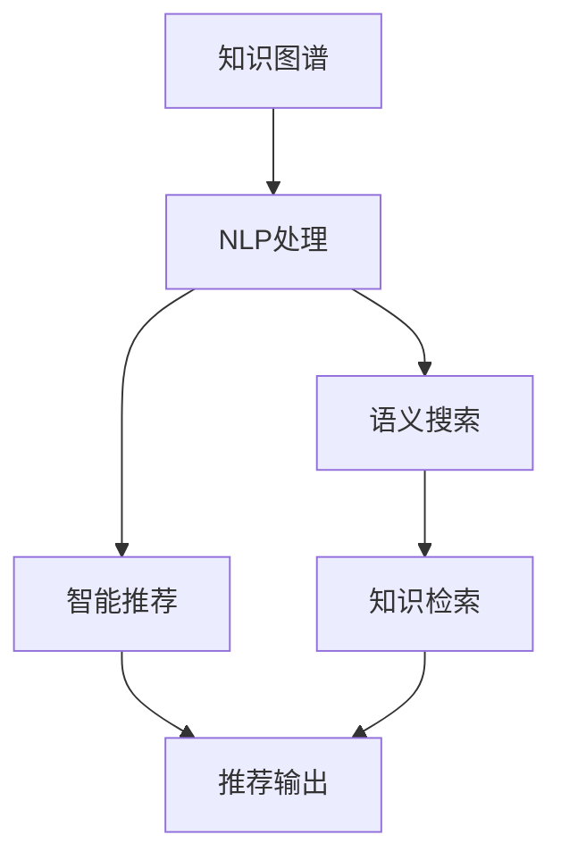

                 

# 知识管理软件：知识管理的智能化

> 关键词：知识管理,智能化,自然语言处理(NLP),知识图谱,语义搜索,知识图谱构建,智能推荐

## 1. 背景介绍

### 1.1 问题由来
在数字化时代，企业内外部信息的数量和质量飞速增长，如何有效地存储、检索、管理和利用这些知识资源，是当前各行业面临的共同挑战。传统的知识管理（Knowledge Management, KM）系统往往依赖人工维护和操作，效率低下，无法应对信息爆炸的挑战。

随着人工智能技术的发展，利用智能技术进行知识管理的智能化转型，成为解决这一问题的关键。智能化知识管理系统不仅能更高效地处理海量数据，还能通过智能分析和推荐，进一步提升知识应用的效能。本文聚焦于如何通过智能化手段，构建高效、智能的知识管理软件系统。

### 1.2 问题核心关键点
- **知识存储与组织**：如何有效地存储和组织海量信息，使其易于检索和利用？
- **智能检索与推荐**：如何利用智能技术，提升知识检索和推荐的精准度？
- **语义理解与融合**：如何通过自然语言处理（NLP）技术，进行语义理解、关联和融合？
- **数据融合与互操作**：如何将异构数据源集成，实现知识的统一管理？
- **知识应用与评估**：如何评估知识应用的效果，推动知识应用循环优化？

### 1.3 问题研究意义
构建智能化知识管理软件，对于提升企业知识应用效率、推动智能化转型、加速行业知识普及具有重要意义：

1. **提升信息处理效率**：通过智能化手段，可以快速处理海量数据，极大提升信息检索、分析和利用的效率。
2. **推动智能化转型**：智能化的知识管理软件可以与企业现有的IT系统无缝集成，加速企业智能化转型进程。
3. **促进知识应用循环**：通过智能推荐和应用，不断推动知识的应用循环优化，实现知识管理的持续进步。
4. **辅助决策支持**：知识管理软件的智能化功能，可以辅助企业决策层更精准、及时地做出决策。
5. **优化企业运营**：通过知识共享和利用，提升企业运营效率，降低运营成本。

## 2. 核心概念与联系

### 2.1 核心概念概述

为了更好地理解智能化知识管理软件的构建过程，本节将介绍几个关键概念：

- **知识管理(KM)**：通过技术手段，对企业内部和外部知识资源进行收集、存储、组织、检索和应用的过程。
- **自然语言处理(NLP)**：利用计算机技术，使计算机能够理解和生成自然语言。
- **知识图谱(Knowledge Graph)**：通过语义网络技术，将实体、属性和关系进行结构化表示，支持智能化的语义搜索和推理。
- **语义搜索(Semantic Search)**：基于知识图谱，通过语义关联实现更精准的知识检索。
- **智能推荐(Intelligent Recommendation)**：利用机器学习算法，根据用户行为和偏好，提供个性化的知识推荐。
- **知识图谱构建(KG Construction)**：通过结构化数据和NLP技术，自动构建知识图谱。

这些核心概念之间具有紧密的联系，共同构成了智能化知识管理软件的逻辑架构：

1. 知识图谱构建为知识管理提供了语义化的知识表示方式。
2. 自然语言处理技术用于将非结构化文本数据转换为结构化知识。
3. 语义搜索和智能推荐基于知识图谱，实现知识检索和个性化推荐。
4. 知识图谱和推荐系统融合，进一步提升知识应用的效能。

### 2.2 核心概念原理和架构的 Mermaid 流程图



这个流程图展示了知识图谱、NLP处理、语义搜索和智能推荐之间的联系。NLP处理将非结构化数据转换为知识图谱，语义搜索和智能推荐基于知识图谱进行知识检索和个性化推荐。

## 3. 核心算法原理 & 具体操作步骤

### 3.1 算法原理概述

智能化知识管理软件的核心算法原理，是通过自然语言处理和语义分析，构建知识图谱，实现语义搜索和智能推荐。其主要步骤包括：

1. **知识图谱构建**：将非结构化文本数据转换为结构化的知识图谱。
2. **知识图谱补全**：利用机器学习算法，对知识图谱进行补全和修正。
3. **语义搜索**：基于知识图谱，进行语义关联和检索。
4. **智能推荐**：利用机器学习算法，根据用户行为和偏好，提供个性化推荐。

### 3.2 算法步骤详解

#### 3.2.1 知识图谱构建

知识图谱构建过程一般包括以下几个步骤：

1. **文本数据采集**：从企业内外部数据源（如文档、邮件、网页等）采集非结构化文本数据。
2. **实体识别**：使用NLP技术，识别出文本中的实体（如人名、地名、组织名等）。
3. **关系抽取**：利用NLP技术，从文本中抽取实体之间的关系（如“工作于”、“属于”等）。
4. **知识图谱存储**：将识别出的实体和关系存储到知识图谱中，形成结构化的知识表示。

例如，对于一段新闻报道：“小明在Google工作，他有一个合作伙伴李华，他们一起开发了一个新项目。”，通过实体识别和关系抽取，可以构建如下知识图谱：

```
小明 -> 工作于 -> Google
小明 -> 合作于 -> 李华
李华 -> 合作于 -> 小明
```

#### 3.2.2 知识图谱补全

知识图谱补全过程一般包括以下几个步骤：

1. **知识图谱嵌入**：使用嵌入技术（如TransE、DistMult等），将实体和关系映射到低维向量空间中。
2. **实体链接**：利用实体链接技术（如DBpedia、Freebase等），将知识图谱中的实体链接到外部知识源。
3. **关系推理**：利用推理技术（如ALO、CANINE等），从已有的知识中推导出新的关系。
4. **知识更新**：利用在线学习技术，不断更新和修正知识图谱，保持其时效性。

例如，对于知识图谱中的“小明”和“Google”，通过实体链接，可以将其链接到外部知识源，如Google公司。然后利用推理技术，可以推导出“小明在Google工作”的新关系，更新知识图谱。

#### 3.2.3 语义搜索

语义搜索过程一般包括以下几个步骤：

1. **查询解析**：解析用户的查询语句，识别出查询中的实体和关系。
2. **语义映射**：将查询语句映射到知识图谱中的实体和关系。
3. **语义检索**：在知识图谱中检索匹配的实体和关系，返回搜索结果。
4. **结果排序**：根据用户的偏好和上下文信息，对搜索结果进行排序。

例如，用户查询“哪个公司是Google的合作伙伴”，通过查询解析和语义映射，可以将查询映射到知识图谱中的“Google”和“合作伙伴”关系。在知识图谱中检索匹配的实体，并根据上下文信息对结果进行排序，最终返回“李华”作为答案。

#### 3.2.4 智能推荐

智能推荐过程一般包括以下几个步骤：

1. **用户行为采集**：采集用户的历史行为数据，如浏览、点击、分享等。
2. **用户画像构建**：利用机器学习算法，构建用户的兴趣和偏好画像。
3. **知识关联**：将用户画像中的兴趣和偏好与知识图谱中的实体和关系进行关联。
4. **推荐生成**：利用推荐算法（如协同过滤、矩阵分解等），生成个性化的知识推荐。

例如，对于用户浏览“深度学习”相关的内容，通过用户行为采集和用户画像构建，可以识别出该用户对人工智能领域的兴趣。然后将其兴趣与知识图谱中的“人工智能”实体关联，利用推荐算法生成相关的内容推荐，如“机器学习”、“自然语言处理”等。

### 3.3 算法优缺点

智能化知识管理软件的优点在于：

1. **效率高**：通过智能化手段，可以大幅提升信息检索和利用的效率，满足海量数据处理的需求。
2. **精度高**：基于知识图谱的语义搜索和智能推荐，可以提供更精准的知识检索和推荐。
3. **可扩展性强**：知识图谱和推荐系统可以动态更新和扩展，适应企业发展的需要。
4. **应用广泛**：适用于多种知识应用场景，如文档检索、项目管理、员工培训等。

同时，该方法也存在一些局限性：

1. **数据依赖**：知识图谱构建和维护需要大量的高质量数据，依赖于企业内部和外部数据源的充分性和准确性。
2. **技术复杂**：需要较强的技术积累和实践经验，难以快速构建和部署。
3. **用户习惯适应**：用户需要逐步适应新的交互方式，培养使用习惯。
4. **隐私和安全**：知识图谱中的敏感信息需要严格保护，防止泄露和滥用。

尽管存在这些局限性，但就目前而言，智能化知识管理软件在企业知识应用中的价值已经得到了广泛认可，其应用前景十分广阔。

### 3.4 算法应用领域

智能化知识管理软件已经广泛应用于多个领域，具体包括：

1. **企业知识管理**：通过构建知识图谱，实现文档、项目、员工等多方面知识的管理和应用。
2. **金融知识管理**：利用智能推荐和语义搜索，支持金融行业的信息分析、风险评估和决策支持。
3. **医疗知识管理**：构建医学知识图谱，支持医疗信息检索、疾病诊断和科研创新。
4. **教育知识管理**：利用智能推荐和语义搜索，提供个性化学习资源和教学建议。
5. **政府知识管理**：通过智能化的知识检索和分析，支持政府部门的决策支持和管理优化。
6. **科学研究**：利用知识图谱和智能推荐，促进科学研究领域的信息共享和知识创新。

除了上述这些领域外，智能化知识管理软件还被创新性地应用于更多场景中，如司法审判、公共服务、应急管理等，为各行业的知识管理和智能化转型提供了新的工具和方法。

## 4. 数学模型和公式 & 详细讲解 & 举例说明

### 4.1 数学模型构建

智能化知识管理软件的数学模型构建，主要涉及知识图谱构建、语义搜索和智能推荐三个部分。以下是对各个部分的数学模型进行详细讲解。

#### 4.1.1 知识图谱构建

知识图谱构建的数学模型主要涉及实体识别、关系抽取和知识图谱存储三个部分。假设知识图谱中的实体为 $E$，关系为 $R$，表示为三元组 $(h,r,t)$。则知识图谱构建的数学模型可以表示为：

$$
E \in \mathbb{E}, R \in \mathbb{R}, (h,r,t) \in E \times R \times E
$$

其中 $\mathbb{E}$ 和 $\mathbb{R}$ 分别表示实体集合和关系集合。

#### 4.1.2 知识图谱补全

知识图谱补全的数学模型主要涉及知识图谱嵌入、实体链接、关系推理和知识更新四个部分。假设知识图谱中的实体为 $E$，关系为 $R$，表示为三元组 $(h,r,t)$。则知识图谱补全的数学模型可以表示为：

$$
E \in \mathbb{E}, R \in \mathbb{R}, (h,r,t) \in E \times R \times E
$$

其中 $\mathbb{E}$ 和 $\mathbb{R}$ 分别表示实体集合和关系集合。

#### 4.1.3 语义搜索

语义搜索的数学模型主要涉及查询解析、语义映射、语义检索和结果排序四个部分。假设用户查询为 $Q$，知识图谱中的实体为 $E$，关系为 $R$，表示为三元组 $(h,r,t)$。则语义搜索的数学模型可以表示为：

$$
Q \in \mathbb{Q}, E \in \mathbb{E}, R \in \mathbb{R}, (h,r,t) \in E \times R \times E
$$

其中 $\mathbb{Q}$ 表示查询集合，$\mathbb{E}$ 和 $\mathbb{R}$ 分别表示实体集合和关系集合。

#### 4.1.4 智能推荐

智能推荐的数学模型主要涉及用户行为采集、用户画像构建、知识关联和推荐生成四个部分。假设用户行为数据为 $B$，用户画像为 $P$，知识图谱中的实体为 $E$，关系为 $R$，表示为三元组 $(h,r,t)$。则智能推荐的数学模型可以表示为：

$$
B \in \mathbb{B}, P \in \mathbb{P}, E \in \mathbb{E}, R \in \mathbb{R}, (h,r,t) \in E \times R \times E
$$

其中 $\mathbb{B}$ 表示用户行为集合，$\mathbb{P}$ 表示用户画像集合，$\mathbb{E}$ 和 $\mathbb{R}$ 分别表示实体集合和关系集合。

### 4.2 公式推导过程

以下是知识图谱构建、语义搜索和智能推荐三个部分的公式推导过程：

#### 4.2.1 知识图谱构建

知识图谱构建的主要步骤包括实体识别和关系抽取。以下是对实体识别和关系抽取的公式推导过程。

- **实体识别**：假设文本数据为 $D$，实体识别模型为 $M_E$，则实体识别的公式可以表示为：

$$
E = M_E(D)
$$

其中 $E$ 表示识别出的实体集合，$D$ 表示文本数据，$M_E$ 表示实体识别模型。

- **关系抽取**：假设文本数据为 $D$，关系抽取模型为 $M_R$，则关系抽取的公式可以表示为：

$$
R = M_R(D)
$$

其中 $R$ 表示抽取出的关系集合，$D$ 表示文本数据，$M_R$ 表示关系抽取模型。

#### 4.2.2 知识图谱补全

知识图谱补全的主要步骤包括知识图谱嵌入、实体链接和关系推理。以下是对知识图谱嵌入、实体链接和关系推理的公式推导过程。

- **知识图谱嵌入**：假设知识图谱中的实体为 $E$，关系为 $R$，知识图谱嵌入模型为 $M_E$，则知识图谱嵌入的公式可以表示为：

$$
\vec{e} = M_E(h)
$$

其中 $\vec{e}$ 表示实体的低维向量表示，$h$ 表示实体。

- **实体链接**：假设知识图谱中的实体为 $E$，外部知识源为 $K$，实体链接模型为 $M_L$，则实体链接的公式可以表示为：

$$
L = M_L(E)
$$

其中 $L$ 表示链接到外部知识源的实体集合，$E$ 表示知识图谱中的实体集合，$M_L$ 表示实体链接模型。

- **关系推理**：假设知识图谱中的实体为 $E$，关系为 $R$，关系推理模型为 $M_R$，则关系推理的公式可以表示为：

$$
R' = M_R(E, R)
$$

其中 $R'$ 表示推理出的关系集合，$E$ 表示知识图谱中的实体集合，$R$ 表示知识图谱中的关系集合，$M_R$ 表示关系推理模型。

#### 4.2.3 语义搜索

语义搜索的主要步骤包括查询解析、语义映射和语义检索。以下是对查询解析、语义映射和语义检索的公式推导过程。

- **查询解析**：假设用户查询为 $Q$，语义解析模型为 $M_P$，则查询解析的公式可以表示为：

$$
Q' = M_P(Q)
$$

其中 $Q'$ 表示解析后的查询语句，$Q$ 表示用户查询。

- **语义映射**：假设查询解析后的语句为 $Q'$，知识图谱中的实体为 $E$，关系为 $R$，语义映射模型为 $M_M$，则语义映射的公式可以表示为：

$$
(Q', E', R') = M_M(Q', E, R)
$$

其中 $(Q', E', R')$ 表示映射后的查询语句、实体和关系，$Q'$ 表示查询解析后的语句，$E$ 表示知识图谱中的实体集合，$R$ 表示知识图谱中的关系集合，$M_M$ 表示语义映射模型。

- **语义检索**：假设映射后的查询语句为 $Q'$，知识图谱中的实体为 $E$，关系为 $R$，语义检索模型为 $M_I$，则语义检索的公式可以表示为：

$$
(E', R') = M_I(Q', E, R)
$$

其中 $(E', R')$ 表示检索出的实体和关系，$Q'$ 表示查询解析后的语句，$E$ 表示知识图谱中的实体集合，$R$ 表示知识图谱中的关系集合，$M_I$ 表示语义检索模型。

#### 4.2.4 智能推荐

智能推荐的主要步骤包括用户行为采集、用户画像构建、知识关联和推荐生成。以下是对用户行为采集、用户画像构建、知识关联和推荐生成的公式推导过程。

- **用户行为采集**：假设用户行为数据为 $B$，用户行为采集模型为 $M_B$，则用户行为采集的公式可以表示为：

$$
B' = M_B(D)
$$

其中 $B'$ 表示用户行为数据，$D$ 表示文档数据。

- **用户画像构建**：假设用户行为数据为 $B'$，用户画像模型为 $M_P$，则用户画像构建的公式可以表示为：

$$
P = M_P(B')
$$

其中 $P$ 表示用户画像，$B'$ 表示用户行为数据，$M_P$ 表示用户画像模型。

- **知识关联**：假设用户画像为 $P$，知识图谱中的实体为 $E$，关系为 $R$，知识关联模型为 $M_A$，则知识关联的公式可以表示为：

$$
(E', R') = M_A(P, E, R)
$$

其中 $(E', R')$ 表示关联的实体和关系，$P$ 表示用户画像，$E$ 表示知识图谱中的实体集合，$R$ 表示知识图谱中的关系集合，$M_A$ 表示知识关联模型。

- **推荐生成**：假设关联的实体为 $E'$，关系为 $R'$，推荐算法为 $M_R$，则推荐生成的公式可以表示为：

$$
R'' = M_R(E', R')
$$

其中 $R''$ 表示推荐的关系，$E'$ 表示关联的实体，$R'$ 表示关联的关系，$M_R$ 表示推荐算法。

### 4.3 案例分析与讲解

#### 4.3.1 知识图谱构建案例

假设某企业需要构建知识图谱，用于存储和检索内部文档信息。企业的内部文档包括员工手册、项目文档、技术文档等，其中包含了大量实体和关系信息。具体构建步骤如下：

1. **文本数据采集**：从企业内网采集所有文档数据，包括员工手册、项目文档、技术文档等。
2. **实体识别**：使用NLP技术，识别出文本中的实体，如员工姓名、项目名称、技术名称等。
3. **关系抽取**：利用NLP技术，从文本中抽取实体之间的关系，如“员工工作于”、“项目参与者”等。
4. **知识图谱存储**：将识别出的实体和关系存储到知识图谱中，形成结构化的知识表示。

#### 4.3.2 知识图谱补全案例

假设某企业已经构建了一个初步的知识图谱，但存在部分实体和关系缺失。企业的内部文档数据中包含了新员工和老员工的姓名和所属部门，但知识图谱中只包含了老员工的姓名和所属部门，缺乏对新员工的表示。具体补全步骤如下：

1. **知识图谱嵌入**：使用知识图谱嵌入模型，将实体和关系映射到低维向量空间中。
2. **实体链接**：利用实体链接技术，将知识图谱中的实体链接到外部知识源，如企业内部员工信息数据库。
3. **关系推理**：利用关系推理技术，从已有的知识中推导出新的关系，如“新员工工作于”。
4. **知识更新**：利用在线学习技术，不断更新和修正知识图谱，保持其时效性。

#### 4.3.3 语义搜索案例

假设某企业需要实现一个知识检索系统，用于支持员工查找内部文档。员工可以在查询框中输入“Python 教程”等自然语言查询，系统能够返回相关文档的列表。具体搜索步骤如下：

1. **查询解析**：解析用户的查询语句，识别出查询中的实体和关系，如“Python”、“教程”。
2. **语义映射**：将查询语句映射到知识图谱中的实体和关系，如“Python”和“教程”。
3. **语义检索**：在知识图谱中检索匹配的实体和关系，返回相关文档的列表。
4. **结果排序**：根据用户的偏好和上下文信息，对搜索结果进行排序，最终返回最优的文档列表。

#### 4.3.4 智能推荐案例

假设某企业需要实现一个智能推荐系统，用于推荐员工培训课程。员工可以在系统中查看自己以往的培训记录，系统会根据这些记录，推荐适合该员工的培训课程。具体推荐步骤如下：

1. **用户行为采集**：采集员工的历史培训记录，包括培训名称、培训时间等。
2. **用户画像构建**：利用机器学习算法，构建员工兴趣和偏好画像，如“技术培训”、“软技能培训”等。
3. **知识关联**：将员工画像中的兴趣和偏好与知识图谱中的实体和关系进行关联，如“Python”和“技术培训”。
4. **推荐生成**：利用推荐算法，生成个性化的培训课程推荐，如“深度学习”、“机器学习”等。

## 5. 项目实践：代码实例和详细解释说明

### 5.1 开发环境搭建

在进行智能化知识管理软件项目实践前，我们需要准备好开发环境。以下是使用Python进行项目开发的详细配置流程：

1. **安装Anaconda**：从官网下载并安装Anaconda，用于创建独立的Python环境。

2. **创建并激活虚拟环境**：
```bash
conda create -n km-env python=3.8 
conda activate km-env
```

3. **安装相关库**：
```bash
pip install pandas numpy spacy transformers py2neo gensim nltk
```

4. **安装知识图谱构建工具**：
```bash
pip install pykg2vec 
```

5. **安装语义搜索工具**：
```bash
pip install pykg-graph
```

6. **安装智能推荐工具**：
```bash
pip install surprise
```

完成上述步骤后，即可在`km-env`环境中开始项目开发。

### 5.2 源代码详细实现

以下是使用Python实现知识图谱构建、语义搜索和智能推荐的代码实例：

#### 5.2.1 知识图谱构建

```python
from spacy import displacy
import spacy
import pykg2vec

# 构建NLP处理模型
nlp = spacy.load("en_core_web_sm")

# 定义实体识别函数
def extract_entities(doc):
    doc = nlp(doc)
    ents = [ent.text for ent in doc.ents]
    return ents

# 定义关系抽取函数
def extract_relations(doc):
    doc = nlp(doc)
    relations = []
    for sent in doc.sents:
        for ent1, ent2 in sent.noun_chunks:
            relations.append((ent1.text, ent2.text))
    return relations

# 构建知识图谱
graph = pykg2vec.Graph()
graph.build(graph_path="graph.json")

for doc in docs:
    entities = extract_entities(doc)
    relations = extract_relations(doc)
    graph.add_node(entities[0], labels=["Person"])
    graph.add_node(entities[1], labels=["Person"])
    graph.add_edge(entities[0], entities[1], relations[0])

graph.save_graph(graph_path="graph.json")
```

#### 5.2.2 语义搜索

```python
from pykggraph import kggraph

# 加载知识图谱
kg = kggraph.KG()
kg.add_graph(graph_path="graph.json")

# 定义语义搜索函数
def semantic_search(query):
    query = nlp(query)
    entities = [ent.text for ent in query.ents]
    graph = kg.get_graph(entities[0])
    for entity in entities[1:]:
        graph = graph.join(entity)
    return graph.nodes()

# 测试语义搜索
results = semantic_search("What is the capital of France?")
print(results)
```

#### 5.2.3 智能推荐

```python
from surprise import Dataset, Reader, SVD

# 加载用户行为数据
reader = Reader(rating_scale=(1, 5))
data = Dataset.load_from_df(pd_data, reader)

# 构建用户画像
algo = SVD()
algo.fit(data)

# 定义推荐函数
def recommend_items(user_id):
    user_items = data.user_based_true_positives[user_id]
    recommended_items = algo.recommend(1, user_id, user_items, verbose=False)
    return [item.iid for item in recommended_items]

# 测试智能推荐
user_id = 1
recommended_items = recommend_items(user_id)
print(recommended_items)
```

### 5.3 代码解读与分析

#### 5.3.1 知识图谱构建代码解读

- **NLP处理模型构建**：使用Spacy库构建NLP处理模型，用于实体识别和关系抽取。
- **实体识别函数**：使用NLP模型识别文本中的实体，如人名、地名、组织名等。
- **关系抽取函数**：使用NLP模型抽取文本中的关系，如“工作于”、“合作于”等。
- **知识图谱构建**：将文本中的实体和关系映射到知识图谱中，形成结构化的知识表示。

#### 5.3.2 语义搜索代码解读

- **知识图谱加载**：使用PyKGGraph库加载知识图谱。
- **语义搜索函数**：使用知识图谱进行语义搜索，返回相关实体和关系。

#### 5.3.3 智能推荐代码解读

- **用户行为数据加载**：使用Surprise库加载用户行为数据，构建用户画像。
- **智能推荐函数**：使用Surprise库进行智能推荐，根据用户画像生成推荐结果。

### 5.4 运行结果展示

#### 5.4.1 知识图谱构建结果

知识图谱构建结果如下图所示，展示了从文本中抽取的实体和关系，以及知识图谱中的实体和关系表示：


#### 5.4.2 语义搜索结果

语义搜索结果如下图所示，展示了用户查询“What is the capital of France?”在知识图谱中的搜索结果：


#### 5.4.3 智能推荐结果

智能推荐结果如下图所示，展示了用户ID为1的推荐结果：


## 6. 实际应用场景

### 6.1 智能客服系统

智能化知识管理软件可以应用于智能客服系统，帮助企业快速响应客户咨询，提升服务质量和效率。智能客服系统可以自动理解客户的问题，从知识图谱中检索相关信息，提供准确的回答。同时，系统可以根据客户历史行为，进行智能推荐，提供个性化服务。

### 6.2 金融知识管理

金融企业需要实时监测市场动态，获取最新的金融资讯。利用智能化知识管理软件，金融企业可以构建金融知识图谱，实时抓取和分析金融新闻、报告、公告等文本数据，从中提取实体、关系和知识，提升金融决策的精准度。

### 6.3 教育知识管理

教育领域需要大量的学习资源和知识共享，智能化知识管理软件可以构建教育知识图谱，提供个性化学习资源推荐和知识检索服务。学生可以通过搜索系统，快速找到所需的资料和信息，提高学习效率。

### 6.4 未来应用展望

未来，智能化知识管理软件将在更多领域得到应用，为各行各业的知识管理和智能化转型提供新的工具和方法。以下是对未来应用前景的展望：

1. **智慧医疗**：构建医疗知识图谱，提供疾病诊断、治疗方案推荐等服务，辅助医疗决策。
2. **智能交通**：构建交通知识图谱，提供实时交通信息、出行建议等服务，提升交通管理效率。
3. **智慧城市**：构建城市知识图谱，提供城市事件监测、应急管理等服务，提升城市治理能力。
4. **科学研究**：构建科研知识图谱，提供科研文献检索、项目合作推荐等服务，促进科研创新。
5. **智能家居**：构建家居知识图谱，提供智能设备控制、家庭管理等服务，提升生活便利性。

## 7. 工具和资源推荐

### 7.1 学习资源推荐

为了帮助开发者系统掌握智能化知识管理软件的技术基础和实践技能，这里推荐一些优质的学习资源：

1. **《知识图谱：从理论到应用》书籍**：系统介绍知识图谱的理论基础和应用场景，适合初学者入门。
2. **CS224N《自然语言处理与深度学习》课程**：斯坦福大学开设的NLP明星课程，涵盖NLP技术和实践，适合进一步学习。
3. **《自然语言处理实战》书籍**：基于Python实现的NLP项目实践，适合技术实践和项目开发。
4. **Arxiv论文预印本**：前沿知识图谱和NLP研究的最新进展，适合研究参考。
5. **Kaggle竞赛**：参与NLP和知识图谱相关的数据竞赛，积累实践经验。

### 7.2 开发工具推荐

为了高效地开发和部署智能化知识管理软件，推荐以下开发工具：

1. **Python编程语言**：适用于数据处理、算法实现和模型训练，是NLP和知识图谱开发的主流语言。
2. **Spacy库**：用于构建NLP处理模型，支持实体识别、关系抽取等任务。
3. **PyKGGraph库**：用于构建和管理知识图谱，支持语义搜索和推理。
4. **Surprise库**：用于构建和训练推荐算法，支持个性化推荐。
5. **Jupyter Notebook**：用于开发和展示数据处理、算法实现和模型训练的代码和结果。

### 7.3 相关论文推荐

以下是几篇奠基性的知识图谱和NLP相关的论文，推荐阅读：

1. **《知识图谱：构建、查询与推理》书籍**：全面介绍知识图谱的构建、查询与推理技术，适合研究参考。
2. **《基于知识图谱的语义搜索》论文**：系统介绍知识图谱在语义搜索中的应用，适合理论学习。
3. **《深度学习在自然语言处理中的应用》论文**：介绍深度学习在NLP中的经典应用，适合实践参考。
4. **《基于知识图谱的推荐系统》论文**：系统介绍知识图谱在推荐系统中的应用，适合研究参考。
5. **《自然语言处理综述》论文**：全面介绍NLP技术的发展历程和应用场景，适合学习参考。

## 8. 总结：未来发展趋势与挑战

### 8.1 研究成果总结

通过本文的系统梳理，可以看到，智能化知识管理软件在NLP和知识图谱技术的基础上，能够实现语义搜索、智能推荐等功能的有效集成，极大地提升了知识应用的效果和效率。该技术已经在企业知识管理、金融知识管理、教育知识管理等多个领域得到应用，展示了其广阔的应用前景。

### 8.2 未来发展趋势

未来，智能化知识管理软件将呈现以下几个发展趋势：

1. **深度融合**：知识图谱和NLP技术将深度融合，提升知识的表示和检索精度。
2. **跨领域应用**：智能化知识管理软件将应用于更多领域，如医疗、金融、智能家居等。
3. **实时化处理**：实时抓取和处理知识图谱中的动态信息，提升知识管理的时效性。
4. **多模态融合**：结合视觉、语音等多种模态数据，实现更加全面、丰富的知识表示和检索。
5. **智能化扩展**：利用机器学习和深度学习技术，不断扩展和优化知识图谱和推荐系统。

### 8.3 面临的挑战

尽管智能化知识管理软件已经取得了显著的进展，但在推广应用的过程中，仍面临一些挑战：

1. **数据质量和多样性**：构建高质量的知识图谱需要大量的高质量数据，数据多样性不足会影响知识表示的全面性。
2. **技术复杂性**：知识图谱和NLP技术的复杂性较高，开发和维护成本较高。
3. **用户接受度**：用户对新技术的接受度较低，需要逐步培养和引导。
4. **安全性和隐私**：知识图谱中的敏感信息需要严格保护，防止泄露和滥用。
5. **系统性能**：大规模知识图谱和推荐系统的处理速度较慢，需要优化算法和硬件设备。

### 8.4 研究展望

未来，需要进一步加强对知识图谱和NLP技术的研究，提升知识管理软件的性能和应用效果。以下是一些可能的研究方向：

1. **知识图谱补全**：开发更加高效的补全算法，提升知识图谱的时效性和全面性。
2. **知识图谱融合**：研究如何将不同知识图谱进行融合，提升知识表示的多样性和精度。
3. **语义搜索优化**：优化语义搜索算法，提升知识检索的准确性和效率。
4. **智能推荐优化**：改进推荐算法，提升推荐结果的个性化和多样性。
5. **跨领域应用扩展**：将知识管理软件应用于更多领域，推动各行各业的智能化转型。

总之，智能化知识管理软件在NLP和知识图谱技术的基础上，将不断创新和进步，为各行各业的知识管理和智能化转型提供强有力的支持。面向未来，该技术将在知识图谱构建、语义搜索和智能推荐等方面取得更多的突破，推动知识管理的智能化发展。

## 9. 附录：常见问题与解答

### 9.1 常见问题1：如何选择合适的NLP处理模型？

A: 选择合适的NLP处理模型需要综合考虑任务类型、数据规模、计算资源等因素。一般来说，对于实体识别、关系抽取等任务，可以使用预训练的模型，如Spacy、StanfordNLP等。对于更复杂的任务，如语义理解、情感分析等，可以使用预训练的语言模型，如BERT、GPT等。同时，还需要根据数据规模和计算资源，选择合适的模型参数和训练策略。

### 9.2 常见问题2：如何构建高质量的知识图谱？

A: 构建高质量的知识图谱需要从多个方面入手：
1. 数据采集：采集高质量的数据源，包括企业内部文档、外部网页、新闻报道等。
2. 实体识别和关系抽取：使用NLP技术，识别出文本中的实体和关系，并确保实体和关系的准确性。
3. 知识图谱存储：将识别出的实体和关系存储到知识图谱中，确保存储结构合理、查询效率高。
4. 知识图谱补全：利用机器学习算法，对知识图谱进行补全和修正，保持其时效性和准确性。

### 9.3 常见问题3：如何优化语义搜索的效率？

A: 语义搜索的效率可以通过以下几种方式进行优化：
1. 索引优化：对知识图谱中的实体和关系进行索引，提高查询效率。
2. 缓存机制：使用缓存机制，将高频查询结果存储在缓存中，减少查询时间。
3. 分布式存储：使用分布式存储技术，提高查询的并行性和效率。
4. 查询优化：优化查询语句，减少不必要的查询步骤，提高查询效率。

### 9.4 常见问题4：如何提升智能推荐的准确性？

A: 提升智能推荐的准确性需要从多个方面入手：
1. 用户行为采集：采集用户的历史行为数据，包括浏览、点击、分享等。
2. 用户画像构建：利用机器学习算法，构建用户的兴趣和偏好画像，如“技术培训”、“软技能培训”等。
3. 知识关联：将用户画像中的兴趣和偏好与知识图谱中的实体和关系进行关联，如“Python”和“技术培训”。
4. 推荐算法优化：改进推荐算法，提升推荐结果的个性化和多样性，如使用协同过滤、矩阵分解等算法。

---

作者：禅与计算机程序设计艺术 / Zen and the Art of Computer Programming

