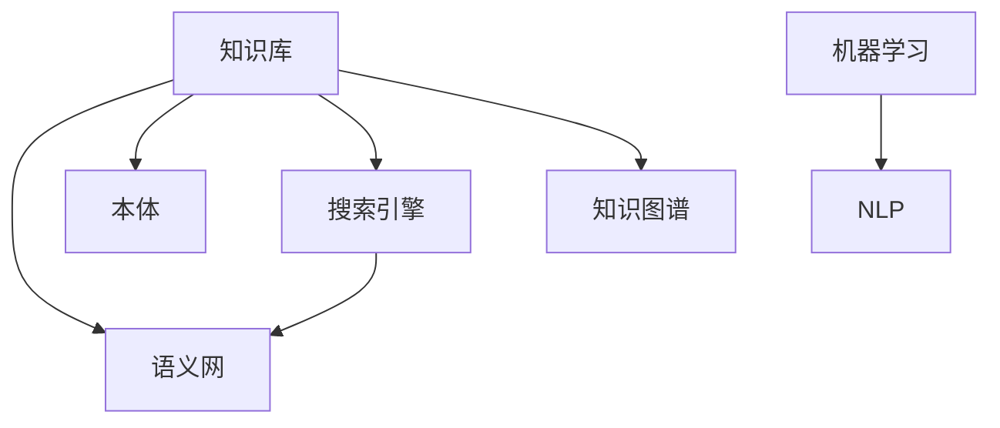

                 

# 知识管理：驾驭人类知识的航船

## 1. 背景介绍

### 1.1 问题由来

在信息爆炸的时代，人类积累了大量的知识，这些知识散落在各个领域、各个角落。如何有效地管理和利用这些知识，使其成为驱动创新和发展的源泉，成为了一个重要的课题。知识管理（Knowledge Management, KM）正是在这样的背景下应运而生，它旨在通过一系列方法、工具和技术，将零散的知识系统化、结构化，使其能够被高效地存储、检索和应用。

### 1.2 问题核心关键点

知识管理的核心目标是实现知识的有效捕获、整合、共享和应用。具体而言，知识管理包括：

- **知识捕获**：从各种来源获取知识，包括文档、会议记录、专家访谈、互联网等。
- **知识整合**：对获取的知识进行分类、标注、抽取、存储，形成知识库。
- **知识共享**：通过知识库、搜索引擎、协作平台等工具，使知识能够被多个人共享和利用。
- **知识应用**：将知识应用于实际的决策、创新和问题解决过程中，驱动业务增长和变革。

知识管理的方法和工具多种多样，但本质上都是围绕知识的捕获、整合、共享和应用进行设计的。随着技术的不断进步，知识管理已经从早期的基于文档和文件的管理，发展到了基于数据和人工智能的管理，为知识的系统化应用提供了新的可能性。

## 2. 核心概念与联系

### 2.1 核心概念概述

为更好地理解知识管理，本节将介绍几个关键的概念及其相互关系：

- **知识库（Knowledge Base, KB）**：存储和管理知识的仓库，通常包括结构化的数据、文档、事实、规则等。知识库是知识管理的核心，是知识共享和应用的基础。
- **语义网（Semantic Web）**：一种基于Web的、具有语义的信息表示和交互方式，通过RDF（Resource Description Framework）等技术，使知识可以更加精准地被机器理解和处理。
- **本体（Ontology）**：对知识库中的概念和关系进行形式化描述，提供了一种语义上的一致性定义，帮助机器理解和推理知识。
- **搜索引擎（Search Engine）**：用于快速检索知识库中存储的知识，帮助用户找到所需信息。
- **知识图谱（Knowledge Graph）**：一种结构化的知识表示方式，通过节点和边表示实体和关系，形成大规模的知识网络。
- **机器学习（Machine Learning, ML）**：通过数据训练模型，使机器能够自动学习和应用知识，提升知识管理和应用的效果。
- **自然语言处理（Natural Language Processing, NLP）**：使机器能够理解和处理人类语言，将非结构化的文本知识转换为结构化的知识库。

这些概念之间的逻辑关系可以通过以下Mermaid流程图来展示：



这个流程图展示了知识管理的各个关键组成部分及其相互关系：

1. 知识库是知识管理的核心，是其他组件的基础。
2. 语义网通过标准化描述方式，使知识更具通用性和互操作性。
3. 本体提供了一种形式化的知识表示方式，帮助机器理解知识。
4. 搜索引擎可以快速检索知识库，提升知识共享效率。
5. 知识图谱通过结构化表示，提供了一种大规模的知识组织方式。
6. NLP将非结构化的文本知识转换为结构化表示，扩充了知识库的内容。
7. 机器学习通过学习知识库中的模式和规律，提升知识应用效果。

这些概念共同构成了知识管理的技术框架，使其能够高效地捕获、整合、共享和应用知识。

## 3. 核心算法原理 & 具体操作步骤

### 3.1 算法原理概述

知识管理算法通常分为两个主要阶段：

- **知识捕获和整合**：通过NLP、机器学习等技术，从各种来源获取知识，并将其整合到知识库中。
- **知识应用和共享**：通过搜索引擎、协作平台等工具，使知识能够被高效地共享和应用于实际问题解决过程中。

知识捕获和整合的核心是知识抽取（Knowledge Extraction），即从文本、数据库、互联网等数据源中识别和提取有用的知识。知识抽取通常涉及以下步骤：

1. 分词和词性标注：将文本分解为单词，并标注每个单词的词性。
2. 命名实体识别：识别文本中的命名实体（如人名、地名、机构名等）。
3. 关系抽取：识别实体之间的语义关系，如主谓宾结构。
4. 实体链接：将识别出的实体与知识库中的实体进行匹配，形成有意义的链接。
5. 推理和融合：通过推理技术，将抽取的知识进行融合，形成更加完整和一致的知识表示。

知识应用和共享的核心是知识检索（Knowledge Retrieval），即通过搜索引擎和协作平台，快速找到所需知识。知识检索通常涉及以下步骤：

1. 用户查询：用户输入查询词或问题。
2. 查询解析：将查询词转换为机器可理解的形式，如向量表示。
3. 文档检索：从知识库中检索出与查询相关的文档。
4. 结果排序：根据文档的相关性和权重，对检索结果进行排序。
5. 结果展示：将排序后的结果展示给用户。

### 3.2 算法步骤详解

#### 3.2.1 知识捕获和整合

**Step 1: 数据预处理**
- 对数据源进行清洗、格式化、去重等预处理操作，去除噪声和无关信息。
- 使用自然语言处理技术进行分词、词性标注、命名实体识别等处理，提取有用的信息。

**Step 2: 知识抽取**
- 使用命名实体识别模型，识别文本中的实体及其属性。
- 使用关系抽取模型，识别实体之间的语义关系。
- 使用实体链接模型，将抽取出的实体与知识库中的实体进行匹配。
- 使用推理模型，根据已有的知识和抽取出的信息进行推理，形成新的知识。

**Step 3: 知识整合**
- 将抽取出的知识存储到知识库中，并进行分类、标注、关联等操作。
- 使用本体建模技术，对知识库中的概念和关系进行形式化描述，提供一致性定义。
- 使用语义网技术，将知识库中的知识转换为标准化的RDF格式，使知识更具互操作性。

#### 3.2.2 知识应用和共享

**Step 1: 查询处理**
- 用户输入查询词或问题，将其转换为向量表示。
- 对查询进行解析，提取关键信息，如实体、属性、关系等。

**Step 2: 文档检索**
- 使用搜索引擎，从知识库中检索出与查询相关的文档。
- 使用排序算法，根据文档的相关性和权重对结果进行排序。

**Step 3: 结果展示**
- 将排序后的结果展示给用户，包括文本摘要、实体关联、关系链等。
- 使用协作平台，允许用户对知识库进行修改、评论、分享等操作。

### 3.3 算法优缺点

知识管理的优点包括：

- **系统化**：将零散的知识系统化、结构化，使其易于管理和应用。
- **高效性**：通过自动化和算法优化，提升知识捕获和整合的效率。
- **广泛性**：可以应用于各个领域和行业，推动跨学科知识的共享和应用。
- **灵活性**：可以根据实际需求，自定义知识库的结构和内容。

同时，知识管理也存在以下缺点：

- **数据噪声**：从各种来源获取的知识可能存在噪声和不一致性，影响知识库的质量。
- **模型复杂性**：知识抽取和整合模型往往较为复杂，需要大量的数据和计算资源进行训练。
- **应用难度**：知识管理系统的开发和部署需要较高的技术门槛，对于一般企业而言，实施成本较高。
- **隐私风险**：知识库中的敏感信息可能被滥用，需要采取相应的安全措施。

尽管存在这些局限性，但知识管理在知识管理领域已经得到了广泛的应用，成为推动知识共享和应用的重要手段。

### 3.4 算法应用领域

知识管理已经在诸多领域得到了广泛应用，以下是几个典型的应用场景：

- **医疗领域**：医院和医疗机构利用知识管理系统，存储和共享医疗知识，提升诊疗效果和科研水平。
- **企业领域**：企业利用知识管理系统，存储和共享企业知识，提升决策效率和创新能力。
- **教育领域**：学校和教育机构利用知识管理系统，存储和共享教育资源，提升教学质量和教育成果。
- **政府领域**：政府机构利用知识管理系统，存储和共享公共知识，提升公共服务效率和治理能力。
- **科研领域**：科研机构利用知识管理系统，存储和共享科研成果，推动科学研究和技术创新。

这些应用场景展示了知识管理在不同领域的广泛应用，为知识共享和应用提供了新的可能性。

## 4. 数学模型和公式 & 详细讲解 & 举例说明

### 4.1 数学模型构建

知识管理算法通常涉及以下几个数学模型：

- **文本向量模型**：将文本转换为向量表示，便于机器处理。
- **关系图模型**：使用图结构表示实体和关系，便于知识推理。
- **知识库模型**：存储和管理知识的仓库，通常使用数据库或图数据库实现。
- **推荐算法**：基于知识库中的信息，为用户推荐相关知识。

### 4.2 公式推导过程

以文本向量模型为例，我们将文本转换为向量表示的过程如下：

1. 分词和词性标注：将文本分解为单词，并标注每个单词的词性。
2. 命名实体识别：识别文本中的命名实体（如人名、地名、机构名等）。
3. 关系抽取：识别实体之间的语义关系，如主谓宾结构。
4. 实体链接：将识别出的实体与知识库中的实体进行匹配，形成有意义的链接。
5. 推理和融合：通过推理技术，将抽取的知识进行融合，形成更加完整和一致的知识表示。

假设文本为 $S$，实体集合为 $E$，关系集合为 $R$，抽取出的知识为 $K$，则知识捕获和整合的过程可以表示为：

$$
K = f(S, E, R)
$$

其中 $f$ 为知识抽取和整合函数。

假设查询词为 $Q$，知识库为 $KB$，搜索结果为 $A$，则知识检索和应用的过程可以表示为：

$$
A = g(Q, KB)
$$

其中 $g$ 为知识检索和应用函数。

### 4.3 案例分析与讲解

假设我们有一篇关于“人工智能”的文档，需要从中抽取有用的知识。具体步骤如下：

1. 分词和词性标注：将文档分解为单词，并标注每个单词的词性。
2. 命名实体识别：识别文档中的命名实体，如“人工智能”、“深度学习”、“自然语言处理”等。
3. 关系抽取：识别实体之间的语义关系，如“人工智能”和“深度学习”的关系是“领域相关”。
4. 实体链接：将识别出的实体与知识库中的实体进行匹配，如“人工智能”与知识库中的“AI”实体匹配。
5. 推理和融合：根据已有的知识和抽取出的信息进行推理，形成新的知识，如“深度学习是人工智能的一个分支”。

通过这些步骤，我们将非结构化的文本知识转换为结构化的知识表示，存储到知识库中，供后续检索和应用使用。

## 5. 项目实践：代码实例和详细解释说明

### 5.1 开发环境搭建

在进行知识管理实践前，我们需要准备好开发环境。以下是使用Python进行SpaCy和Gensim开发的环境配置流程：

1. 安装Anaconda：从官网下载并安装Anaconda，用于创建独立的Python环境。

2. 创建并激活虚拟环境：
```bash
conda create -n km-env python=3.8 
conda activate km-env
```

3. 安装SpaCy和Gensim：
```bash
conda install spacy gensim -c conda-forge
```

4. 安装各类工具包：
```bash
pip install numpy pandas scikit-learn matplotlib tqdm jupyter notebook ipython
```

完成上述步骤后，即可在`km-env`环境中开始知识管理实践。

### 5.2 源代码详细实现

下面我们以知识抽取为例，给出使用SpaCy和Gensim对文本进行知识抽取的PyTorch代码实现。

首先，定义文本处理函数：

```python
import spacy
import spacytextblob
from spacytextblob import TextBlob

def preprocess_text(text):
    nlp = spacy.load('en_core_web_sm')
    doc = nlp(text)
    return [token.text for token in doc if not token.is_punct and not token.is_stop]
```

然后，定义知识抽取模型：

```python
from gensim.models.doc2vec import Doc2Vec
from gensim.models.doc2vec import TaggedDocument

# 定义知识库中的实体和关系
entities = ['人工智能', '深度学习', '自然语言处理']
relationships = ['领域相关']

# 定义知识抽取模型
model = Doc2Vec(vector_size=100, min_count=1, epochs=10)

# 训练模型
tagged_documents = []
for entity in entities:
    tagged_documents.append((entity, [entity] + relationships))

model.fit(tagged_documents, epochs=10)
```

最后，测试模型并输出抽取的知识：

```python
test_text = "深度学习是人工智能的一个分支。"
test_doc = TextBlob(test_text)
test_tokens = preprocess_text(test_doc.text)

# 预测知识
predicted_entities = model.predict([test_tokens])
print(predicted_entities)
```

以上就是使用SpaCy和Gensim对文本进行知识抽取的完整代码实现。可以看到，得益于SpaCy和Gensim的强大封装，我们可以用相对简洁的代码完成知识抽取任务。

### 5.3 代码解读与分析

让我们再详细解读一下关键代码的实现细节：

**preprocess_text函数**：
- 使用SpaCy对文本进行分词，去除标点符号和停用词。

**知识抽取模型**：
- 使用Doc2Vec模型，将文本转换为向量表示。
- 将知识库中的实体和关系作为训练数据，训练模型。
- 通过训练后的模型，对新文本进行预测，输出抽取的知识。

**测试代码**：
- 对测试文本进行分词，去除标点符号和停用词。
- 将测试文本转换为模型可接受的格式，进行预测。
- 输出预测结果。

可以看出，代码的实现相对简单，但通过SpaCy和Gensim的组合使用，可以高效地完成知识抽取任务。

## 6. 实际应用场景

### 6.1 医疗领域

在医疗领域，知识管理被广泛应用于病历管理、医学知识库构建、临床决策支持等方面。通过知识管理系统，医院可以存储和共享病历数据、医学文献、临床指南等知识，提升医疗服务的质量和效率。

具体而言，医生可以利用知识管理系统，快速检索和应用临床指南、医学文献等知识，辅助诊断和治疗决策。患者也可以利用知识管理系统，了解相关疾病知识，增强自我管理和健康监测。

### 6.2 企业领域

在企业领域，知识管理被广泛应用于知识库构建、决策支持、员工培训等方面。通过知识管理系统，企业可以存储和共享内部知识、市场信息、客户反馈等知识，提升决策效率和创新能力。

具体而言，企业可以利用知识管理系统，存储和共享公司内部知识库、市场调研报告、客户反馈等信息，辅助业务决策和产品开发。员工也可以利用知识管理系统，快速查找和应用内部知识，提升工作效率和学习效果。

### 6.3 教育领域

在教育领域，知识管理被广泛应用于教材管理、课程设计、教学资源共享等方面。通过知识管理系统，学校和教育机构可以存储和共享教材、课程设计、教学资源等知识，提升教学质量和教育成果。

具体而言，学校可以利用知识管理系统，存储和共享教材、课程设计、教学资源等信息，辅助教学设计和课程开发。教师也可以利用知识管理系统，快速查找和应用教学资源，提升教学效果和学习体验。

### 6.4 政府领域

在政府领域，知识管理被广泛应用于公共知识库构建、政策决策、公众服务等方面。通过知识管理系统，政府机构可以存储和共享公共知识、政策法规、公众服务信息等知识，提升公共服务效率和治理能力。

具体而言，政府机构可以利用知识管理系统，存储和共享公共知识、政策法规、公众服务信息等信息，辅助政策决策和公共服务。公众也可以利用知识管理系统，快速查找和应用公共知识，提升政府透明度和公众参与度。

## 7. 工具和资源推荐

### 7.1 学习资源推荐

为了帮助开发者系统掌握知识管理的技术基础和实践技巧，这里推荐一些优质的学习资源：

1. 《数据科学与机器学习》系列博文：由知名数据科学家撰写，深入浅出地介绍了数据科学和机器学习的基本概念和算法，适合初学者入门。

2. 《深度学习》课程：由斯坦福大学开设的深度学习明星课程，涵盖深度学习的基础理论、算法实现和应用实践。

3. 《自然语言处理》书籍：权威的自然语言处理教材，系统介绍了NLP的基本原理和算法，适合进阶学习。

4. Apache OpenNLP：Apache基金会提供的开源自然语言处理工具，提供了丰富的NLP功能和算法实现。

5. spaCy官方文档：SpaCy官方文档，提供了详细的API文档和示例代码，是使用SpaCy进行文本处理的好帮手。

6. Gensim官方文档：Gensim官方文档，提供了详细的API文档和示例代码，是使用Gensim进行文本向量化和知识抽取的好帮手。

通过对这些资源的学习实践，相信你一定能够快速掌握知识管理的精髓，并用于解决实际的NLP问题。

### 7.2 开发工具推荐

高效的开发离不开优秀的工具支持。以下是几款用于知识管理开发的常用工具：

1. Python：Python是一种功能强大、易于学习的编程语言，适合进行各种数据处理和机器学习任务。

2. PyTorch：基于Python的深度学习框架，支持动态计算图和自动微分，适合进行复杂的深度学习任务。

3. spaCy：基于Python的自然语言处理工具，支持分词、词性标注、命名实体识别等任务，具有高效的中文处理能力。

4. Gensim：基于Python的文本处理工具，支持文本向量化、知识抽取等任务，具有高效的语义建模能力。

5. ELK Stack：包括Elasticsearch、Logstash、Kibana的组合，提供高效的搜索、分析和可视化功能，适合构建知识管理系统。

6. Apache Solr：Apache基金会提供的开源搜索平台，支持多语言、分布式、高性能的搜索引擎。

7. Apache Flink：Apache基金会提供的流处理框架，支持高效的实时数据处理和分析。

合理利用这些工具，可以显著提升知识管理的开发效率，加快创新迭代的步伐。

### 7.3 相关论文推荐

知识管理的研究源于学界的持续研究。以下是几篇奠基性的相关论文，推荐阅读：

1. 《基于本体的知识管理框架》：介绍了基于本体的知识管理框架，详细探讨了本体建模和知识抽取的方法。

2. 《知识抽取与信息集成》：介绍了知识抽取和信息集成的方法，系统介绍了文本向量化、命名实体识别等技术。

3. 《语义网技术》：介绍了语义网技术的基本原理和应用，详细探讨了RDF、OWL等语义网标准。

4. 《知识管理系统的设计与实现》：介绍了知识管理系统的设计和实现方法，详细探讨了知识库建模、搜索算法等技术。

这些论文代表了大数据管理技术的发展脉络。通过学习这些前沿成果，可以帮助研究者把握学科前进方向，激发更多的创新灵感。

## 8. 总结：未来发展趋势与挑战

### 8.1 总结

本文对知识管理进行了全面系统的介绍。首先阐述了知识管理的核心目标和应用场景，明确了知识管理的系统化、高效化和广泛化的特点。其次，从原理到实践，详细讲解了知识捕获、整合、检索和应用的全过程，给出了知识管理任务开发的完整代码实例。同时，本文还广泛探讨了知识管理方法在医疗、企业、教育、政府等领域的广泛应用，展示了知识管理方法的巨大潜力。此外，本文精选了知识管理技术的各类学习资源，力求为读者提供全方位的技术指引。

通过本文的系统梳理，可以看到，知识管理在知识管理领域已经得到了广泛的应用，成为推动知识共享和应用的重要手段。未来，随着知识管理方法的不断进步和新技术的不断涌现，知识管理将进一步推动知识管理的智能化和自动化，为知识共享和应用提供新的可能性。

### 8.2 未来发展趋势

展望未来，知识管理技术将呈现以下几个发展趋势：

1. **智能化**：知识管理系统将越来越多地采用人工智能和机器学习技术，提升知识的自动抽取、推理和应用能力。

2. **可视化**：知识管理系统的可视化功能将更加强大，通过图表、仪表盘等方式，使知识更加直观和易于理解。

3. **语义化**：知识管理系统将采用语义网技术，提升知识的语义表示和推理能力，使知识更加精准和一致。

4. **自动化**：知识管理系统将更多地采用自动化技术，自动抽取、整合、推荐和应用知识，提升知识管理的效率。

5. **跨领域**：知识管理系统将更多地融合多领域的知识，实现跨学科的知识共享和应用。

6. **安全化**：知识管理系统将更多地考虑数据隐私和安全问题，采用数据脱敏、访问控制等措施，保障知识的安全性和可靠性。

以上趋势凸显了知识管理技术的广阔前景。这些方向的探索发展，必将进一步提升知识管理的智能化、自动化和安全性，为知识的系统化应用提供新的可能性。

### 8.3 面临的挑战

尽管知识管理技术已经取得了显著进展，但在迈向更加智能化、普适化应用的过程中，仍面临以下挑战：

1. **数据噪声**：从各种来源获取的知识可能存在噪声和不一致性，影响知识库的质量。
2. **模型复杂性**：知识抽取和整合模型往往较为复杂，需要大量的数据和计算资源进行训练。
3. **应用难度**：知识管理系统的开发和部署需要较高的技术门槛，对于一般企业而言，实施成本较高。
4. **隐私风险**：知识库中的敏感信息可能被滥用，需要采取相应的安全措施。
5. **知识更新**：知识库中的知识需要定期更新，以保持其时效性和实用性，但更新过程较为繁琐。

尽管存在这些挑战，但知识管理在知识管理领域已经得到了广泛的应用，成为推动知识共享和应用的重要手段。未来，通过不断的技术进步和应用实践，这些挑战终将一一被克服，知识管理必将在构建知识驱动的社会中扮演越来越重要的角色。

### 8.4 未来突破

面对知识管理所面临的挑战，未来的研究需要在以下几个方面寻求新的突破：

1. **智能抽取**：开发更加智能化的知识抽取模型，利用深度学习、因果推理等技术，提升知识抽取的准确性和自动化水平。

2. **跨领域融合**：将知识管理系统与外部知识库、规则库等专家知识进行融合，增强知识管理系统的跨领域适应性。

3. **安全防护**：建立知识管理系统的安全防护机制，采用数据脱敏、访问控制等措施，保障数据隐私和安全。

4. **实时更新**：开发实时化的知识更新机制，通过数据流处理、增量学习等技术，实现知识的实时更新和应用。

5. **跨模态集成**：将知识管理系统与视觉、语音等多模态数据进行融合，提升知识管理的全面性和智能性。

6. **知识协同**：建立知识管理系统的知识协同机制，利用社交网络、协作平台等技术，促进知识的多人共享和应用。

这些研究方向展示了知识管理技术的未来方向，相信随着技术的不断进步和应用实践的不断积累，知识管理必将在构建智能社会中扮演越来越重要的角色。面向未来，知识管理技术还需要与其他人工智能技术进行更深入的融合，如知识表示、因果推理、强化学习等，多路径协同发力，共同推动知识管理的进步。只有勇于创新、敢于突破，才能不断拓展知识管理的边界，让知识管理更好地服务于知识驱动的社会。

## 9. 附录：常见问题与解答

**Q1：知识管理是否可以适用于所有领域？**

A: 知识管理可以适用于各个领域，但不同领域的应用场景和需求存在差异。对于特定领域，可能需要针对性地开发知识管理模型和方法。

**Q2：知识管理与人工智能有何关系？**

A: 知识管理与人工智能密切相关，知识管理中的文本处理、知识抽取、关系推理等技术，可以为人工智能提供丰富的知识来源和应用场景。

**Q3：知识管理系统的实现需要哪些关键技术？**

A: 知识管理系统的实现需要以下关键技术：
1. 自然语言处理（NLP）：对文本进行分词、词性标注、命名实体识别等处理。
2. 知识抽取（KE）：从文本中抽取有用的知识，并将其存储到知识库中。
3. 知识图谱（KG）：使用图结构表示实体和关系，便于知识推理和应用。
4. 搜索引擎（SE）：快速检索知识库中的知识，提高知识共享效率。

**Q4：知识管理系统的应用效果如何？**

A: 知识管理系统的应用效果取决于具体场景和系统设计。在医疗、企业、教育等领域，知识管理系统的应用已经取得了显著的效果，提升了知识共享和应用的能力。

**Q5：知识管理系统的未来发展方向是什么？**

A: 知识管理系统的未来发展方向包括智能化、可视化、语义化、自动化、跨领域融合、安全防护、实时更新、跨模态集成、知识协同等方面。这些方向的探索发展，必将进一步提升知识管理的智能化、自动化和安全性，为知识的系统化应用提供新的可能性。

总之，知识管理作为推动知识共享和应用的重要手段，正在不断发展和进步。通过不断探索和创新，相信知识管理技术必将在构建知识驱动的社会中扮演越来越重要的角色，为知识的系统化应用提供新的可能。

